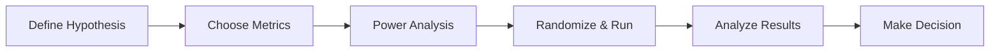

# A/B Testing & Experiment Design

> **The gold standard for causal inference in industry** - designing, running, and analyzing experiments

---

## Overview

A/B testing is the most asked-about topic in data science interviews at tech companies. You need to know the full lifecycle: when to experiment, how to design tests, calculate sample sizes, analyze results, and avoid common pitfalls.

---

## A/B Test Lifecycle

---

## Step 1: Define the Hypothesis

| Component | Definition | Example |
|-----------|-----------|--------|
| **$H_0$ (Null)** | No difference between control and treatment | New button color has no effect on CTR |
| **$H_1$ (Alternative)** | There is a difference | New button color changes CTR |
| **One-sided** | Effect is in a specific direction | New button *increases* CTR |
| **Two-sided** | Effect could go either direction | New button changes CTR (up or down) |

---

## Step 2: Choose Metrics

| Metric Type | Purpose | Example |
|------------|---------|--------|
| **Primary (OEC)** | Overall Evaluation Criterion - the decision metric | Conversion rate, revenue per user |
| **Secondary** | Supporting metrics | Time on page, bounce rate |
| **Guardrail** | Metrics that must NOT degrade | Page load time, error rate, revenue |

### Good Metric Properties

- **Sensitive**: Detects meaningful changes
- **Attributable**: Causally connected to the change
- **Timely**: Observable within experiment duration
- **Interpretable**: Stakeholders understand it

---

## Step 3: Power Analysis & Sample Size

### Key Parameters

| Parameter | Symbol | Typical Value | Meaning |
|-----------|--------|--------------|--------|
| **Significance level** | $\alpha$ | 0.05 | False positive rate |
| **Power** | $1 - \beta$ | 0.80 | Probability of detecting a real effect |
| **Minimum Detectable Effect** | MDE | Business-defined | Smallest effect worth detecting |
| **Baseline rate** | $p_0$ | From historical data | Current metric value |

### Sample Size Formula (Proportions)

$$n = \frac{(z_{\alpha/2} + z_\beta)^2 \cdot (p_1(1-p_1) + p_0(1-p_0))}{(p_1 - p_0)^2}$$

Where $p_1 = p_0 + \text{MDE}$.

**Rule of thumb**: For a 1% absolute change in a 10% baseline rate, you need ~15,000 users per group.

---

## Step 4: Randomization

### Randomization Unit

| Unit | When to Use | Watch For |
|------|------------|----------|
| **User** | Most common, individual experiences | Cross-device users |
| **Session** | Short-term UI tests | Same user sees both variants |
| **Page view** | Very high traffic, simple changes | Inconsistent experience |
| **Cluster (geo/time)** | Network effects, marketplace | Fewer effective units |

### Checks Before Analysis

| Check | Purpose |
|-------|--------|
| **Sample Ratio Mismatch (SRM)** | Verify groups are equally sized (chi-squared test) |
| **Pre-experiment balance** | Covariates balanced between groups |
| **Novelty/primacy effects** | New users vs. existing users behave differently |

---

## Step 5: Analyze Results

### For Proportions (e.g., Conversion Rate)

$$z = \frac{\hat{p}_T - \hat{p}_C}{\sqrt{\hat{p}(1-\hat{p})\left(\frac{1}{n_T} + \frac{1}{n_C}\right)}}$$

where $\hat{p} = \frac{n_T \hat{p}_T + n_C \hat{p}_C}{n_T + n_C}$ (pooled proportion).

### For Means (e.g., Revenue per User)

$$t = \frac{\bar{x}_T - \bar{x}_C}{\sqrt{\frac{s_T^2}{n_T} + \frac{s_C^2}{n_C}}}$$

### Confidence Interval for the Lift

$$(\hat{p}_T - \hat{p}_C) \pm z_{\alpha/2} \cdot \sqrt{\frac{\hat{p}_T(1-\hat{p}_T)}{n_T} + \frac{\hat{p}_C(1-\hat{p}_C)}{n_C}}$$

---

## Common Pitfalls

| Pitfall | Problem | Solution |
|---------|---------|----------|
| **Peeking** | Checking results early inflates false positives | Use sequential testing or pre-commit to end date |
| **Multiple testing** | Testing many metrics inflates $\alpha$ | Bonferroni correction: $\alpha' = \alpha / k$ |
| **Simpson's Paradox** | Aggregate result reverses when segmented | Check for confounders, stratify analysis |
| **Survivorship bias** | Only analyzing users who completed a flow | Use intent-to-treat analysis |
| **Network effects** | Users influence each other | Cluster randomization |
| **Novelty effect** | Temporary boost from newness | Wait for effect to stabilize, filter by exposure time |
| **Low power** | Can't detect real effects | Increase sample size or MDE |

---

## Advanced Topics

### Variance Reduction Techniques

| Technique | How It Works | Improvement |
|-----------|-------------|-------------|
| **CUPED** | Control Using Pre-Experiment Data: subtract predicted value from pre-period | 20-50% variance reduction |
| **Stratification** | Randomize within strata (e.g., country, platform) | Ensures balance on key dimensions |
| **Delta method** | For ratio metrics | Correct variance estimation |

### Sequential Testing

Instead of fixed-horizon, test continuously with adjusted thresholds.

| Method | Approach |
|--------|----------|
| **O'Brien-Fleming** | Conservative early, lenient late |
| **Always-valid p-values** | Valid at any stopping time |
| **Bayesian** | Update posterior continuously |

---

## Interview Questions

1. **"You run an A/B test and get p = 0.06. What do you do?"**
   - Not significant at $\alpha = 0.05$, but close. Consider: sample size (underpowered?), practical significance (is the effect meaningful?), multiple testing corrections, and directional consistency with other metrics. Don't just "run it longer" without pre-committing.

2. **"How would you A/B test a feature that affects both buyers and sellers on a marketplace?"**
   - Can't randomize at user level due to network effects. Use cluster randomization (by market/city), switchback design (time-based), or synthetic control methods.

3. **"Your A/B test shows a 2% lift with p < 0.01, but engagement dropped 5%. Ship or not?"**
   - Guardrail metric (engagement) degraded. Investigate: is the drop significant? Is it a trade-off you accept? Check segments. Likely don't ship without understanding why.

4. **"What's the difference between statistical significance and practical significance?"**
   - Statistical: unlikely due to chance alone. Practical: large enough to matter for the business. A 0.01% lift can be statistically significant with enough data but not worth engineering effort.
