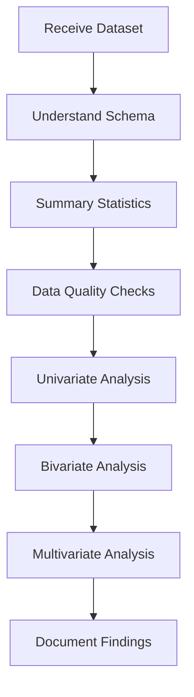

# Exploratory Data Analysis

> **The first step in any data project** - understanding your data before modeling

---

## Overview

EDA is the process of summarizing, visualizing, and understanding a dataset before applying models. In interviews, you'll be asked to walk through how you'd approach a new dataset — interviewers evaluate your systematic thinking, not just technical skills.

---

## EDA Workflow



---

## Step 1: Understand the Schema

| Check | What to Look For |
|-------|------------------|
| **Shape** | Number of rows and columns |
| **Column types** | Numeric, categorical, datetime, text |
| **Granularity** | What does each row represent? |
| **Time range** | What period does the data cover? |
| **Data dictionary** | Do column names have clear meanings? |

```python
df.shape
df.dtypes
df.head(10)
df.describe(include='all')
```

---

## Step 2: Summary Statistics

| Statistic | Purpose | Watch For |
|-----------|---------|----------|
| **Mean vs. Median** | Central tendency | Large gap suggests skewness |
| **Std dev** | Spread | Relative to mean (CV = std/mean) |
| **Min / Max** | Range | Impossible values (negative ages, future dates) |
| **Percentiles** | Distribution shape | Compare p25, p50, p75 |
| **Count** | Completeness | Mismatched counts = missing data |

---

## Step 3: Data Quality Checks

### Missing Data

| Pattern | Likely Mechanism | Handling |
|---------|-----------------|----------|
| Random scattered gaps | MCAR (Missing Completely At Random) | Drop rows or impute with mean/median |
| Missing correlates with another column | MAR (Missing At Random) | Model-based imputation |
| Missingness depends on the missing value itself | MNAR (Not At Random) | Domain knowledge needed, indicator variable |

### Common Issues

| Issue | How to Detect | Solution |
|-------|--------------|----------|
| **Duplicates** | `df.duplicated().sum()` | Deduplicate with domain context |
| **Outliers** | IQR method, z-score > 3 | Investigate before removing |
| **Inconsistent formatting** | Value counts, regex | Standardize (e.g., "USA" vs "US" vs "United States") |
| **Data leakage** | Features from the future | Remove or lag appropriately |
| **Class imbalance** | Target value counts | Note for modeling strategy |

---

## Step 4: Univariate Analysis

| Variable Type | Visualizations | What to Look For |
|--------------|----------------|------------------|
| **Continuous** | Histogram, box plot, KDE | Skewness, modality, outliers |
| **Categorical** | Bar chart, value counts | Cardinality, dominance, rare categories |
| **Datetime** | Line plot over time | Trends, seasonality, gaps |
| **Boolean** | Proportion bar | Class balance |

### Skewness

| Skewness | Interpretation | Common Transform |
|----------|---------------|------------------|
| $\approx 0$ | Symmetric | None needed |
| $> 1$ | Right-skewed (long right tail) | Log, square root |
| $< -1$ | Left-skewed (long left tail) | Square, exponential |

---

## Step 5: Bivariate Analysis

| Combination | Technique | Visualization |
|------------|-----------|---------------|
| Continuous vs. Continuous | Correlation, scatter plot | Scatter with trend line |
| Continuous vs. Categorical | Group statistics, t-test | Box plot by group |
| Categorical vs. Categorical | Chi-squared, contingency table | Heatmap of proportions |
| Feature vs. Target | Correlation, mutual information | Depends on types |

### Correlation Matrix

```python
corr = df.select_dtypes(include='number').corr()
```

**Watch for**: Highly correlated features ($|r| > 0.8$) signal multicollinearity. Consider dropping one or using PCA.

---

## Step 6: Multivariate Analysis

| Technique | Purpose | When to Use |
|-----------|---------|-------------|
| **Pair plots** | All pairwise relationships | < 10 features |
| **PCA** | Dimensionality reduction | High-dimensional data |
| **Clustering** | Natural groupings | Segment discovery |
| **Interaction effects** | Feature combinations | Suspected non-linear relationships |

---

## Interview Framework

When asked "How would you explore this dataset?", follow this structure:

1. **Understand the business context** - What problem are we solving?
2. **Examine the schema** - Shape, types, granularity
3. **Check data quality** - Missing values, duplicates, outliers
4. **Summarize distributions** - Central tendency, spread, shape
5. **Explore relationships** - Correlations, group differences
6. **Generate hypotheses** - What patterns suggest about the problem
7. **Communicate findings** - Key insights and next steps

---

## Interview Questions

1. **"You receive a dataset with 20% missing values in one column. What do you do?"**
   - First understand WHY it's missing (MCAR/MAR/MNAR). Check if missingness correlates with other columns. Options: drop (if MCAR and small), impute (mean/median for MCAR, model-based for MAR), or create a missing indicator.

2. **"How do you handle outliers?"**
   - First investigate: are they data errors or real extremes? Use IQR (1.5x) or z-score (>3) to identify. Options: remove errors, cap/winsorize, transform (log), or use robust methods.

3. **"What's the difference between correlation and mutual information?"**
   - Correlation measures linear (Pearson) or monotonic (Spearman) relationships. Mutual information captures any dependency, including non-linear, but is harder to estimate and interpret.
