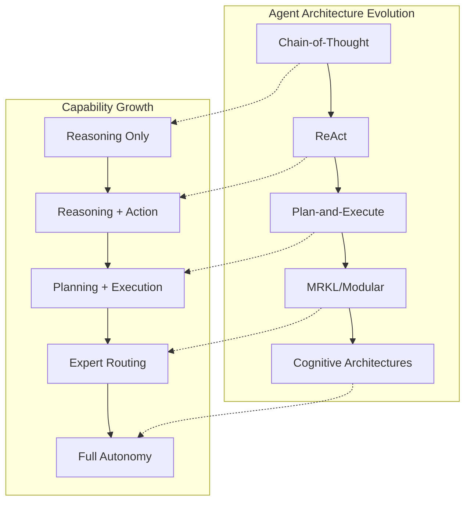
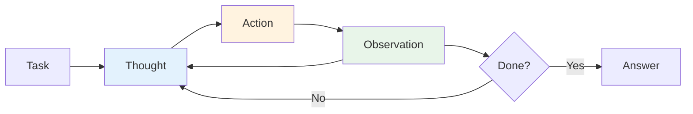
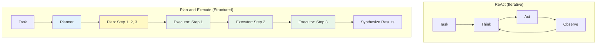
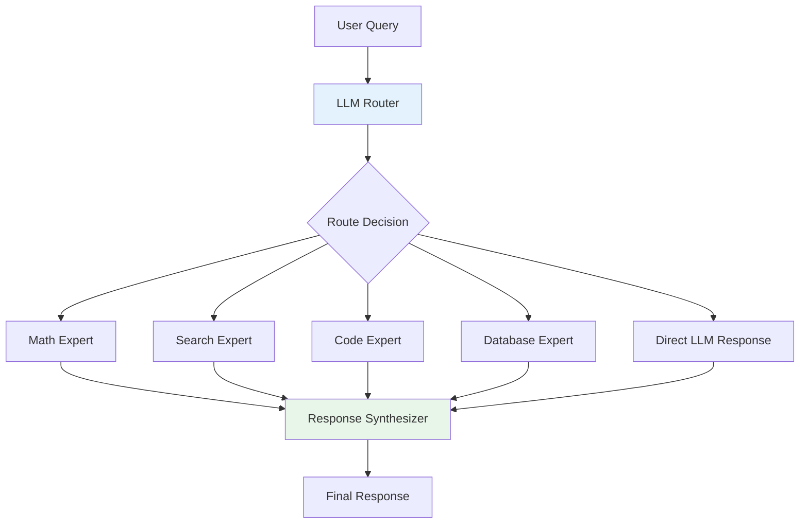
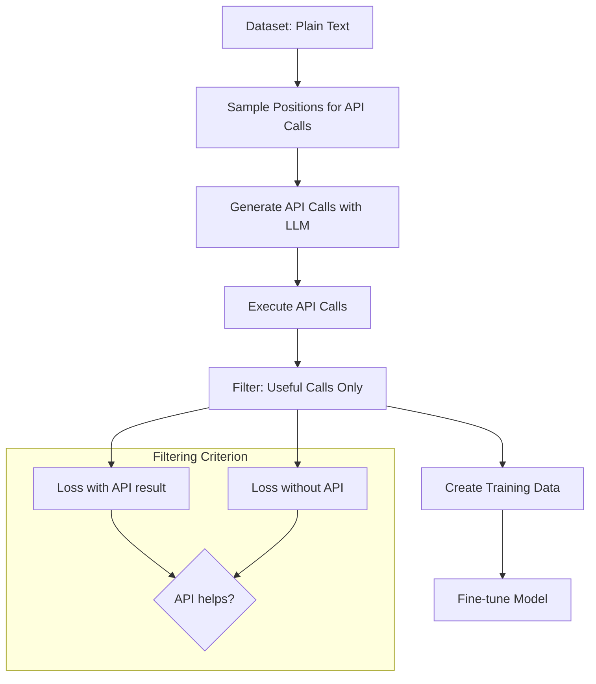
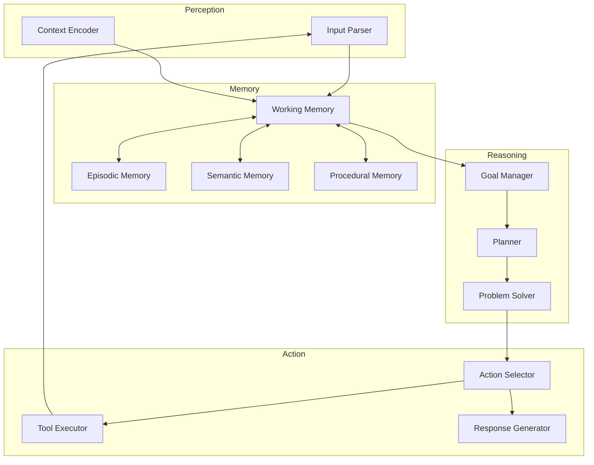

# Agent Architectures

> **Patterns for reasoning, planning, and tool use in LLM agents**

---

## Learning Objectives

By the end of this module, you will be able to:

- **Implement** the ReAct pattern for iterative reasoning and action
- **Compare** Plan-and-Execute vs ReAct for different task complexities
- **Explain** MRKL architecture for modular expert systems
- **Describe** how Toolformer enables self-supervised tool learning
- **Design** cognitive architectures for complex agent behaviors

---

## Overview of Agent Architectures



---

## 1. ReAct: Reasoning and Acting

::: info Key Insight
ReAct interleaves reasoning traces with actions, allowing the model to create, maintain, and adjust plans dynamically while incorporating external information.
:::

### The ReAct Loop



### ReAct Implementation

```python
from openai import OpenAI
from typing import Callable
import json

class ReActAgent:
    """
    ReAct agent implementation following the Thought-Action-Observation loop.
    """

    def __init__(self, model: str = "gpt-4"):
        self.client = OpenAI()
        self.model = model
        self.tools: dict[str, Callable] = {}
        self.max_iterations = 10

    def register_tool(self, name: str, func: Callable, description: str):
        """Register a tool with the agent."""
        self.tools[name] = {
            "function": func,
            "description": description
        }

    def _build_system_prompt(self) -> str:
        tool_descriptions = "\n".join([
            f"- {name}: {info['description']}"
            for name, info in self.tools.items()
        ])

        return f"""You are a ReAct agent that solves tasks by thinking step-by-step.

Available tools:
{tool_descriptions}

For each step, you must output:
Thought: [Your reasoning about what to do next]
Action: [tool_name(parameters)] OR Answer: [final answer]

After an action, you will receive an Observation with the result.
Continue until you can provide the final Answer.

Rules:
1. Always think before acting
2. Use tools when you need external information
3. Be concise but thorough in reasoning
4. If stuck, try a different approach"""

    def _parse_response(self, response: str) -> tuple[str, str, dict]:
        """Parse the agent's response into thought, action type, and action content."""
        lines = response.strip().split('\n')
        thought = ""
        action_type = None
        action_content = {}

        for line in lines:
            if line.startswith("Thought:"):
                thought = line[8:].strip()
            elif line.startswith("Action:"):
                action_str = line[7:].strip()
                if action_str.startswith("Answer:"):
                    action_type = "answer"
                    action_content = {"answer": action_str[7:].strip()}
                else:
                    # Parse tool call: tool_name(param1, param2)
                    action_type = "tool"
                    if "(" in action_str:
                        tool_name = action_str[:action_str.index("(")]
                        params_str = action_str[action_str.index("(")+1:action_str.rindex(")")]
                        action_content = {
                            "tool": tool_name,
                            "params": params_str
                        }
                    else:
                        action_content = {"tool": action_str, "params": ""}
            elif line.startswith("Answer:"):
                action_type = "answer"
                action_content = {"answer": line[7:].strip()}

        return thought, action_type, action_content

    def _execute_tool(self, tool_name: str, params: str) -> str:
        """Execute a tool and return the observation."""
        if tool_name not in self.tools:
            return f"Error: Tool '{tool_name}' not found"

        try:
            result = self.tools[tool_name]["function"](params)
            return str(result)
        except Exception as e:
            return f"Error executing {tool_name}: {str(e)}"

    def run(self, task: str) -> str:
        """Execute the ReAct loop for a given task."""
        messages = [
            {"role": "system", "content": self._build_system_prompt()},
            {"role": "user", "content": f"Task: {task}"}
        ]

        trajectory = []

        for i in range(self.max_iterations):
            # Get agent response
            response = self.client.chat.completions.create(
                model=self.model,
                messages=messages,
                temperature=0.0
            )

            agent_output = response.choices[0].message.content
            thought, action_type, action_content = self._parse_response(agent_output)

            trajectory.append({
                "iteration": i + 1,
                "thought": thought,
                "action_type": action_type,
                "action_content": action_content
            })

            # Check if done
            if action_type == "answer":
                return action_content["answer"]

            # Execute tool and get observation
            if action_type == "tool":
                observation = self._execute_tool(
                    action_content["tool"],
                    action_content["params"]
                )

                # Add to conversation
                messages.append({"role": "assistant", "content": agent_output})
                messages.append({"role": "user", "content": f"Observation: {observation}"})

        return "Max iterations reached without finding answer"


# Example usage
def search_web(query: str) -> str:
    """Simulated web search."""
    return f"Search results for '{query}': [relevant information...]"

def calculate(expression: str) -> str:
    """Safe calculator."""
    try:
        # Only allow safe operations
        allowed = set("0123456789+-*/.(). ")
        if all(c in allowed for c in expression):
            return str(eval(expression))
        return "Invalid expression"
    except:
        return "Calculation error"

# Initialize and run
agent = ReActAgent()
agent.register_tool("search", search_web, "Search the web for information")
agent.register_tool("calculate", calculate, "Perform mathematical calculations")

result = agent.run("What is the population of France divided by 1000?")
```

### ReAct Trace Example

```
Task: What is 15% of the GDP of Germany?

Thought: I need to find Germany's GDP first, then calculate 15% of it.
Action: search(Germany GDP 2024)
Observation: Germany's GDP in 2024 is approximately $4.5 trillion USD.

Thought: Now I have the GDP. I need to calculate 15% of $4.5 trillion.
Action: calculate(4.5 * 0.15)
Observation: 0.675

Thought: The calculation gives 0.675 trillion, which is $675 billion.
Action: Answer: 15% of Germany's GDP is approximately $675 billion USD.
```

---

## 2. Plan-and-Execute

::: info When to Use
Plan-and-Execute works better than ReAct for complex tasks requiring multiple coordinated steps where the overall structure should be determined upfront.
:::

### Architecture Comparison



### Plan-and-Execute Implementation

```python
from openai import OpenAI
from dataclasses import dataclass
from typing import Optional

@dataclass
class Step:
    id: int
    description: str
    tool: Optional[str]
    dependencies: list[int]
    result: Optional[str] = None
    status: str = "pending"

class PlanAndExecuteAgent:
    """
    Plan-and-Execute agent that creates a plan first, then executes steps.
    Supports replanning when steps fail.
    """

    def __init__(self, model: str = "gpt-4"):
        self.client = OpenAI()
        self.model = model
        self.tools = {}

    def register_tool(self, name: str, func, description: str):
        self.tools[name] = {"function": func, "description": description}

    def _create_plan(self, task: str) -> list[Step]:
        """Use LLM to create a structured plan."""
        tool_list = "\n".join([
            f"- {name}: {info['description']}"
            for name, info in self.tools.items()
        ])

        prompt = f"""Create a detailed plan to accomplish this task.

Task: {task}

Available tools:
{tool_list}

Output a JSON array of steps. Each step should have:
- id: step number (1, 2, 3...)
- description: what this step accomplishes
- tool: which tool to use (or null if reasoning only)
- dependencies: list of step IDs that must complete first

Example format:
[
  {{"id": 1, "description": "Search for X", "tool": "search", "dependencies": []}},
  {{"id": 2, "description": "Calculate Y using result from step 1", "tool": "calculate", "dependencies": [1]}}
]

Output only the JSON array:"""

        response = self.client.chat.completions.create(
            model=self.model,
            messages=[{"role": "user", "content": prompt}],
            temperature=0.0
        )

        import json
        plan_data = json.loads(response.choices[0].message.content)

        return [
            Step(
                id=s["id"],
                description=s["description"],
                tool=s.get("tool"),
                dependencies=s.get("dependencies", [])
            )
            for s in plan_data
        ]

    def _execute_step(self, step: Step, context: dict) -> str:
        """Execute a single step with context from previous steps."""
        # Build context from dependencies
        dep_context = "\n".join([
            f"Step {dep_id} result: {context.get(dep_id, 'N/A')}"
            for dep_id in step.dependencies
        ])

        if step.tool and step.tool in self.tools:
            # Use LLM to extract tool parameters
            param_prompt = f"""Extract parameters for the tool call.

Step: {step.description}
Tool: {step.tool}
Context from previous steps:
{dep_context}

Output only the parameter string to pass to the tool:"""

            response = self.client.chat.completions.create(
                model=self.model,
                messages=[{"role": "user", "content": param_prompt}],
                temperature=0.0
            )

            params = response.choices[0].message.content.strip()
            result = self.tools[step.tool]["function"](params)
        else:
            # Reasoning step
            reasoning_prompt = f"""Complete this reasoning step.

Step: {step.description}
Context from previous steps:
{dep_context}

Provide a clear, concise result:"""

            response = self.client.chat.completions.create(
                model=self.model,
                messages=[{"role": "user", "content": reasoning_prompt}],
                temperature=0.0
            )
            result = response.choices[0].message.content.strip()

        return result

    def _synthesize(self, task: str, context: dict) -> str:
        """Synthesize final answer from all step results."""
        results_summary = "\n".join([
            f"Step {k}: {v}" for k, v in sorted(context.items())
        ])

        prompt = f"""Synthesize the final answer.

Original task: {task}

Step results:
{results_summary}

Provide a clear, comprehensive final answer:"""

        response = self.client.chat.completions.create(
            model=self.model,
            messages=[{"role": "user", "content": prompt}],
            temperature=0.0
        )

        return response.choices[0].message.content.strip()

    def run(self, task: str) -> dict:
        """Execute the full plan-and-execute loop."""
        # Phase 1: Planning
        plan = self._create_plan(task)

        # Phase 2: Execution
        context = {}
        for step in plan:
            # Check dependencies are complete
            deps_complete = all(
                dep_id in context for dep_id in step.dependencies
            )

            if deps_complete:
                result = self._execute_step(step, context)
                context[step.id] = result
                step.result = result
                step.status = "complete"
            else:
                step.status = "blocked"

        # Phase 3: Synthesis
        final_answer = self._synthesize(task, context)

        return {
            "plan": [
                {"id": s.id, "description": s.description, "result": s.result}
                for s in plan
            ],
            "answer": final_answer
        }
```

---

## 3. MRKL: Modular Reasoning, Knowledge and Language

::: info Architecture Pattern
MRKL (pronounced "miracle") combines an LLM with specialized expert modules, routing queries to the most appropriate module.
:::

### MRKL Architecture



### MRKL Implementation

```python
from openai import OpenAI
from abc import ABC, abstractmethod
from typing import Optional
import json

class Expert(ABC):
    """Base class for MRKL expert modules."""

    @property
    @abstractmethod
    def name(self) -> str:
        pass

    @property
    @abstractmethod
    def description(self) -> str:
        pass

    @property
    @abstractmethod
    def capabilities(self) -> list[str]:
        pass

    @abstractmethod
    def execute(self, query: str) -> str:
        pass

class MathExpert(Expert):
    """Handles mathematical computations."""

    @property
    def name(self) -> str:
        return "math_expert"

    @property
    def description(self) -> str:
        return "Handles mathematical calculations, equations, and numerical analysis"

    @property
    def capabilities(self) -> list[str]:
        return ["arithmetic", "algebra", "statistics", "calculus"]

    def execute(self, query: str) -> str:
        # In practice, use a proper math engine like SymPy
        import sympy
        try:
            result = sympy.sympify(query)
            return f"Result: {result}"
        except:
            return "Could not evaluate mathematical expression"

class SearchExpert(Expert):
    """Handles web searches and information retrieval."""

    @property
    def name(self) -> str:
        return "search_expert"

    @property
    def description(self) -> str:
        return "Searches the web for current information and facts"

    @property
    def capabilities(self) -> list[str]:
        return ["web_search", "fact_checking", "current_events"]

    def execute(self, query: str) -> str:
        # In practice, integrate with search API
        return f"Search results for: {query}"

class CodeExpert(Expert):
    """Handles code execution and analysis."""

    @property
    def name(self) -> str:
        return "code_expert"

    @property
    def description(self) -> str:
        return "Executes Python code and analyzes code snippets"

    @property
    def capabilities(self) -> list[str]:
        return ["python_execution", "code_analysis", "debugging"]

    def execute(self, query: str) -> str:
        # Sandboxed code execution
        try:
            # CAUTION: In production, use proper sandboxing
            exec_globals = {"__builtins__": {}}
            exec(query, exec_globals)
            return f"Code executed successfully"
        except Exception as e:
            return f"Execution error: {e}"

class MRKLSystem:
    """
    MRKL System: Routes queries to specialized expert modules.
    """

    def __init__(self, model: str = "gpt-4"):
        self.client = OpenAI()
        self.model = model
        self.experts: dict[str, Expert] = {}

    def register_expert(self, expert: Expert):
        """Register an expert module."""
        self.experts[expert.name] = expert

    def _route_query(self, query: str) -> tuple[str, str]:
        """Use LLM to route query to appropriate expert."""
        expert_descriptions = "\n".join([
            f"- {name}: {exp.description}\n  Capabilities: {', '.join(exp.capabilities)}"
            for name, exp in self.experts.items()
        ])

        prompt = f"""You are a query router. Analyze the query and determine which expert should handle it.

Available experts:
{expert_descriptions}
- direct_response: For queries that don't need any expert (general knowledge, conversation)

Query: {query}

Respond with JSON:
{{"expert": "expert_name", "sub_query": "query to send to expert"}}

If using direct_response, sub_query should be null."""

        response = self.client.chat.completions.create(
            model=self.model,
            messages=[{"role": "user", "content": prompt}],
            temperature=0.0
        )

        result = json.loads(response.choices[0].message.content)
        return result["expert"], result.get("sub_query")

    def _synthesize_response(self, query: str, expert_name: str,
                            expert_response: str) -> str:
        """Synthesize final response from expert output."""
        prompt = f"""Create a helpful response based on the expert's output.

Original query: {query}
Expert used: {expert_name}
Expert output: {expert_response}

Provide a clear, user-friendly response:"""

        response = self.client.chat.completions.create(
            model=self.model,
            messages=[{"role": "user", "content": prompt}],
            temperature=0.2
        )

        return response.choices[0].message.content

    def query(self, user_query: str) -> dict:
        """Process a query through the MRKL system."""
        # Step 1: Route to expert
        expert_name, sub_query = self._route_query(user_query)

        # Step 2: Execute with expert or direct response
        if expert_name == "direct_response" or expert_name not in self.experts:
            # Direct LLM response
            response = self.client.chat.completions.create(
                model=self.model,
                messages=[{"role": "user", "content": user_query}],
                temperature=0.7
            )
            expert_response = response.choices[0].message.content
        else:
            expert = self.experts[expert_name]
            expert_response = expert.execute(sub_query)

        # Step 3: Synthesize response
        final_response = self._synthesize_response(
            user_query, expert_name, expert_response
        )

        return {
            "expert_used": expert_name,
            "expert_query": sub_query,
            "expert_response": expert_response,
            "final_response": final_response
        }


# Usage
mrkl = MRKLSystem()
mrkl.register_expert(MathExpert())
mrkl.register_expert(SearchExpert())
mrkl.register_expert(CodeExpert())

result = mrkl.query("What is the integral of x^2 from 0 to 5?")
```

---

## 4. Toolformer

::: info Self-Supervised Learning
Toolformer teaches LLMs to use tools through self-supervised learning, automatically generating training data for API calls.
:::

### Toolformer Training Process



### Toolformer Concept Implementation

```python
from openai import OpenAI
from dataclasses import dataclass
import re

@dataclass
class APICall:
    """Represents an API call inserted into text."""
    api_name: str
    input_text: str
    output: str
    position: int

class ToolformerTrainer:
    """
    Demonstrates Toolformer's self-supervised learning approach.
    In practice, this would fine-tune a model on generated data.
    """

    def __init__(self, model: str = "gpt-4"):
        self.client = OpenAI()
        self.model = model
        self.apis = {
            "Calculator": self._calculator,
            "WikiSearch": self._wiki_search,
            "Calendar": self._calendar,
        }

    def _calculator(self, expression: str) -> str:
        try:
            return str(eval(expression))
        except:
            return "Error"

    def _wiki_search(self, query: str) -> str:
        return f"[Wikipedia result for {query}]"

    def _calendar(self, query: str) -> str:
        return "[Current date: 2024-01-15]"

    def _sample_api_positions(self, text: str) -> list[int]:
        """
        Sample positions where API calls might be useful.
        Uses heuristics: numbers, questions, dates, etc.
        """
        positions = []

        # After numbers (might need calculation)
        for match in re.finditer(r'\d+', text):
            positions.append(match.end())

        # After question words
        for match in re.finditer(r'\b(what|when|where|who|how)\b', text.lower()):
            positions.append(match.end())

        return list(set(positions))

    def _generate_api_call(self, text: str, position: int) -> APICall | None:
        """Generate an API call for a given position."""
        context = text[max(0, position-100):position+100]

        prompt = f"""Given this text context, generate an API call that would be helpful.

Context: ...{context}...
Position: {position}

Available APIs:
- Calculator(expression): Computes math expressions
- WikiSearch(query): Searches Wikipedia
- Calendar(): Returns current date

If an API call would be helpful at this position, output:
API_NAME(input)

If no API call is needed, output: NONE"""

        response = self.client.chat.completions.create(
            model=self.model,
            messages=[{"role": "user", "content": prompt}],
            temperature=0.0
        )

        result = response.choices[0].message.content.strip()

        if result == "NONE":
            return None

        # Parse API call
        match = re.match(r'(\w+)\((.*)\)', result)
        if match:
            api_name, input_text = match.groups()
            if api_name in self.apis:
                output = self.apis[api_name](input_text)
                return APICall(api_name, input_text, output, position)

        return None

    def _evaluate_usefulness(self, text: str, api_call: APICall) -> float:
        """
        Evaluate if API call improves prediction.
        Returns perplexity reduction (higher = more useful).
        """
        # Simplified: In practice, compute actual perplexity
        # Text with API result should have lower perplexity

        text_before = text[:api_call.position]
        text_after = text[api_call.position:]

        # Check if API output appears later in text (relevance proxy)
        if api_call.output in text_after:
            return 1.0

        return 0.5  # Moderate usefulness

    def generate_training_data(self, texts: list[str],
                               threshold: float = 0.6) -> list[dict]:
        """
        Generate training data for Toolformer fine-tuning.
        """
        training_examples = []

        for text in texts:
            positions = self._sample_api_positions(text)

            for pos in positions:
                api_call = self._generate_api_call(text, pos)

                if api_call:
                    usefulness = self._evaluate_usefulness(text, api_call)

                    if usefulness >= threshold:
                        # Create training example with API call inserted
                        augmented_text = (
                            text[:api_call.position] +
                            f" [{api_call.api_name}({api_call.input_text}) -> {api_call.output}] " +
                            text[api_call.position:]
                        )

                        training_examples.append({
                            "original": text,
                            "augmented": augmented_text,
                            "api_call": {
                                "name": api_call.api_name,
                                "input": api_call.input_text,
                                "output": api_call.output
                            },
                            "usefulness_score": usefulness
                        })

        return training_examples


# Example
trainer = ToolformerTrainer()
texts = [
    "The population of France is 67 million. This means each person would get 50000 euros if we divided 3.35 trillion equally.",
    "World War II ended in 1945. How many years ago was that?"
]

training_data = trainer.generate_training_data(texts)
```

---

## 5. Cognitive Architectures

::: info Advanced Agents
Cognitive architectures combine multiple components (perception, memory, reasoning, action) into unified agent systems inspired by human cognition.
:::

### Cognitive Architecture Components



### Key Cognitive Architecture Patterns

| Pattern | Description | Use Case |
|---------|-------------|----------|
| **ACT-R** | Production rule system with memory modules | Task learning, skill acquisition |
| **SOAR** | State-space problem solving | Complex reasoning tasks |
| **CLARION** | Dual-process (implicit/explicit) | Learning from experience |
| **BDI** | Belief-Desire-Intention model | Goal-directed behavior |

---

## Architecture Comparison

| Architecture | Planning | Tool Use | Memory | Learning | Complexity |
|--------------|----------|----------|--------|----------|------------|
| **ReAct** | Implicit (per-step) | Yes | Context only | None | Low |
| **Plan-and-Execute** | Explicit upfront | Yes | Context only | None | Medium |
| **MRKL** | Router-based | Expert modules | Module-specific | None | Medium |
| **Toolformer** | Implicit | Self-learned | Trained | Self-supervised | High |
| **Cognitive** | Multi-level | Integrated | Multi-store | Continuous | Very High |

---

## Interview Q&A

### Q1: When would you choose Plan-and-Execute over ReAct?

**Strong Answer:**

"I'd choose Plan-and-Execute over ReAct in these scenarios:

1. **Complex multi-step tasks**: When the task requires 5+ coordinated steps that benefit from upfront planning (e.g., 'Research competitors, analyze their pricing, and create a comparison report').

2. **Parallelizable sub-tasks**: Plan-and-Execute can identify independent steps and execute them in parallel, improving efficiency.

3. **Resource-constrained environments**: Planning upfront reduces unnecessary tool calls, important when APIs are expensive or rate-limited.

4. **Auditability requirements**: The explicit plan provides a clear audit trail of what the agent intends to do before execution.

However, ReAct is better when:
- Tasks are exploratory and the path isn't clear upfront
- Information discovered mid-task changes the approach
- The task is simple enough that planning overhead isn't justified

A hybrid approach often works best: use Plan-and-Execute for the overall structure but allow ReAct-style reasoning within individual steps."

---

### Q2: How does MRKL handle queries that require multiple experts?

**Strong Answer:**

"MRKL's original design routes to a single expert per query, but handling multi-expert queries requires extensions:

**Approach 1: Query Decomposition**
```
User: 'Calculate 15% of France's GDP and search for recent economic news'
Decomposed:
  - Query 1 → Search Expert: 'France GDP'
  - Query 2 → Math Expert: 'result * 0.15'
  - Query 3 → Search Expert: 'France recent economic news'
```

**Approach 2: Expert Chaining**
The router identifies the sequence of experts needed and passes outputs as context between them.

**Approach 3: Parallel Execution**
For independent sub-queries, execute multiple experts simultaneously and synthesize results.

**Implementation Consideration:**
```python
def multi_expert_route(query):
    # Decompose query into sub-queries
    sub_queries = decompose(query)

    # Route each sub-query
    routes = [(q, route(q)) for q in sub_queries]

    # Identify dependencies
    execution_order = topological_sort(routes)

    # Execute and synthesize
    results = execute_in_order(execution_order)
    return synthesize(results)
```

The key insight is that MRKL's modularity actually facilitates multi-expert coordination - each expert's clean interface makes composition straightforward."

---

### Q3: What are the key challenges in implementing Toolformer-style self-supervised tool learning?

**Strong Answer:**

"Toolformer faces several key challenges:

**1. Position Sampling Efficiency**
- Sampling every position is computationally expensive
- Heuristics may miss valid positions or include useless ones
- Solution: Use lightweight classifiers to pre-filter positions

**2. API Call Generation Quality**
- LLM may generate syntactically valid but semantically wrong calls
- Hallucinated API parameters
- Solution: Constrained decoding, schema validation

**3. Usefulness Filtering**
- Computing exact perplexity reduction is expensive
- Threshold selection affects recall vs precision
- Solution: Proxy metrics, calibrated thresholds per API

**4. API Output Integration**
- Model must learn to incorporate API outputs naturally
- Risk of over-relying on APIs or ignoring them
- Solution: Diverse training examples, dropout on API outputs

**5. Generalization**
- Model may overfit to specific API patterns
- May not generalize to new APIs without retraining
- Solution: Meta-learning approaches, diverse API training

**6. Safety**
- Self-generated API calls may have unintended side effects
- Challenge: Distinguish read-only vs write operations
- Solution: Sandboxed execution during training, action classification"

---

## Summary

| Architecture | Key Innovation | Best For | Main Limitation |
|--------------|----------------|----------|-----------------|
| **ReAct** | Interleaved reasoning and action | Simple iterative tasks | No upfront planning |
| **Plan-and-Execute** | Explicit planning phase | Complex structured tasks | Rigid to changes |
| **MRKL** | Modular expert routing | Diverse tool requirements | Routing errors |
| **Toolformer** | Self-supervised tool learning | Learned tool use | Training cost |
| **Cognitive** | Full cognitive modeling | Complex autonomous agents | Implementation complexity |

---

## Sources

- Yao et al., "ReAct: Synergizing Reasoning and Acting in Language Models" (2022)
- Wang et al., "Plan-and-Solve Prompting" (2023)
- Karpas et al., "MRKL Systems" (2022)
- Schick et al., "Toolformer: Language Models Can Teach Themselves to Use Tools" (2023)
- Sumers et al., "Cognitive Architectures for Language Agents" (2023)
