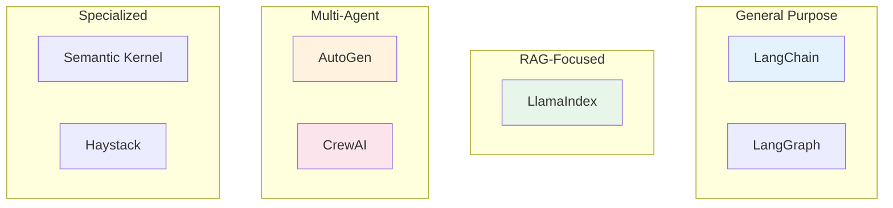
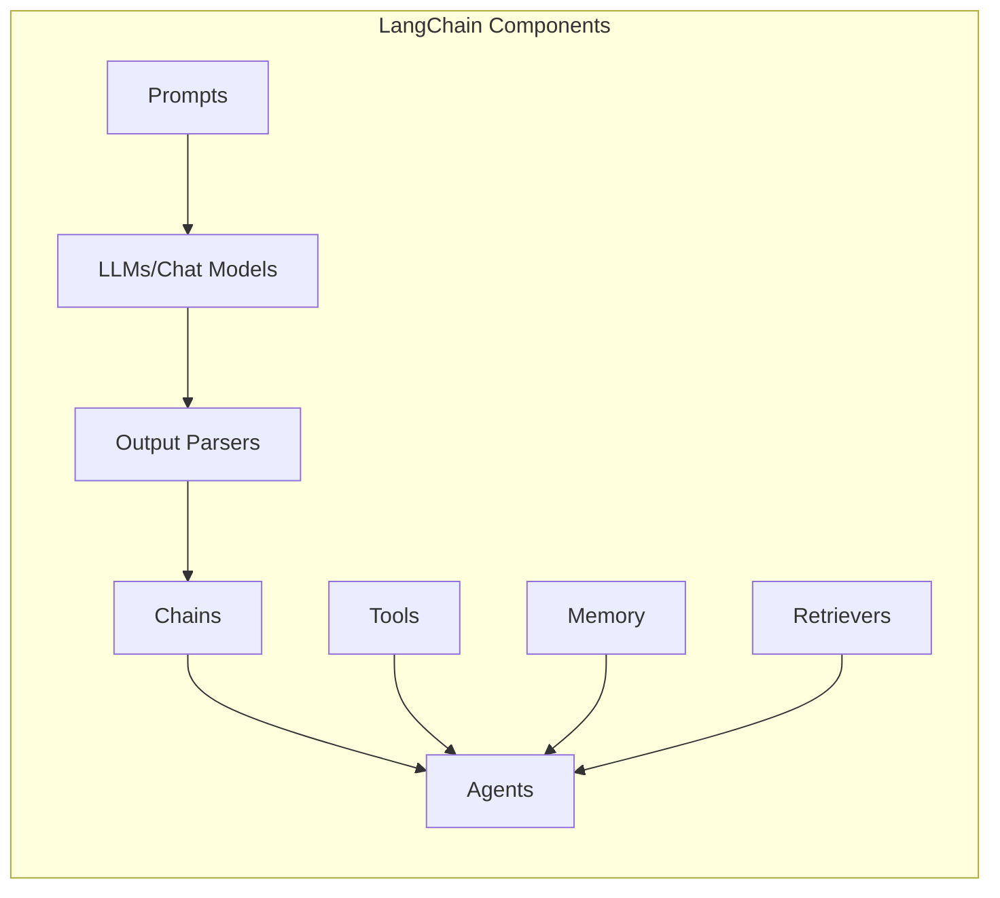
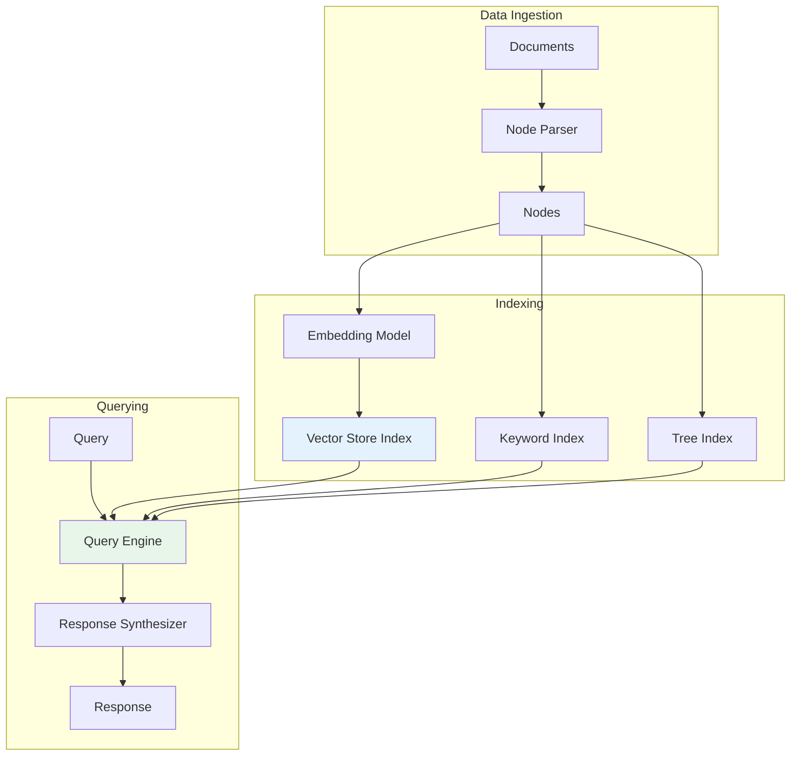
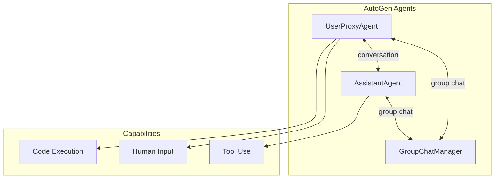
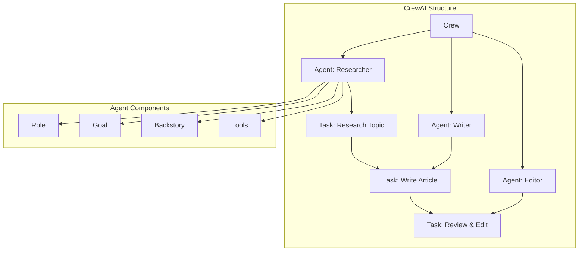
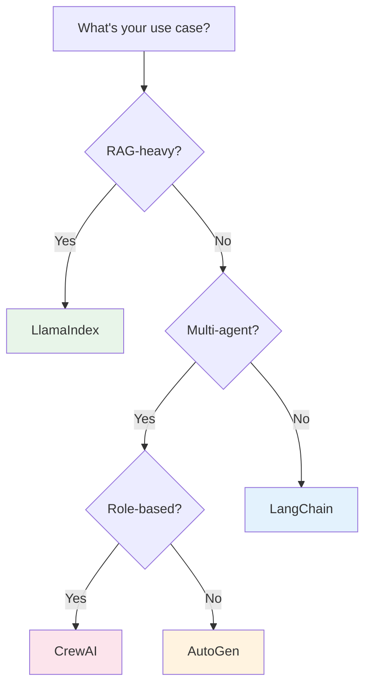

# Agent Frameworks

> **Comparing tools for building production LLM agents**

---

## Learning Objectives

By the end of this module, you will be able to:

- **Compare** major agent frameworks (LangChain, LlamaIndex, AutoGen, CrewAI)
- **Select** the right framework for different use cases and requirements
- **Implement** agents using each framework's idioms and patterns
- **Evaluate** framework trade-offs: flexibility vs simplicity, features vs overhead
- **Migrate** between frameworks when requirements change

---

## Framework Landscape

::: info Market Overview
The agent framework landscape is rapidly evolving. LangChain dominates in general-purpose agents, LlamaIndex excels at RAG, AutoGen leads multi-agent systems, and CrewAI provides role-based orchestration.
:::



---

## LangChain

### Overview

LangChain is the most widely adopted framework for building LLM applications, offering extensive tooling for chains, agents, and RAG systems.

### Key Concepts



### LangChain Agent Implementation

```python
from langchain_openai import ChatOpenAI
from langchain.agents import AgentExecutor, create_openai_tools_agent
from langchain_core.prompts import ChatPromptTemplate, MessagesPlaceholder
from langchain.tools import tool
from langchain.memory import ConversationBufferMemory

# Define tools
@tool
def search_database(query: str) -> str:
    """Search the product database for items matching the query."""
    # Simulated database search
    return f"Found 5 products matching '{query}': Product A, B, C, D, E"

@tool
def get_weather(location: str) -> str:
    """Get current weather for a location."""
    return f"Weather in {location}: 22°C, sunny"

@tool
def calculate(expression: str) -> str:
    """Evaluate a mathematical expression."""
    try:
        return str(eval(expression))
    except:
        return "Error evaluating expression"

# Create prompt template
prompt = ChatPromptTemplate.from_messages([
    ("system", """You are a helpful assistant with access to tools.
Use tools when needed to answer user questions accurately.
Always explain your reasoning."""),
    MessagesPlaceholder(variable_name="chat_history"),
    ("human", "{input}"),
    MessagesPlaceholder(variable_name="agent_scratchpad"),
])

# Initialize components
llm = ChatOpenAI(model="gpt-4", temperature=0)
tools = [search_database, get_weather, calculate]
memory = ConversationBufferMemory(
    memory_key="chat_history",
    return_messages=True
)

# Create agent
agent = create_openai_tools_agent(llm, tools, prompt)

# Create executor
agent_executor = AgentExecutor(
    agent=agent,
    tools=tools,
    memory=memory,
    verbose=True,
    handle_parsing_errors=True,
    max_iterations=5
)

# Run agent
response = agent_executor.invoke({
    "input": "What's the weather in Tokyo and find me some headphones"
})
print(response["output"])
```

### LangGraph for Complex Workflows

```python
from langgraph.graph import StateGraph, END
from typing import TypedDict, Annotated
from operator import add

class AgentState(TypedDict):
    messages: Annotated[list, add]
    current_step: str
    results: dict

def research_node(state: AgentState) -> AgentState:
    """Node that performs research."""
    # Research logic here
    return {
        "messages": [{"role": "assistant", "content": "Research complete"}],
        "results": {"research": "findings..."}
    }

def analyze_node(state: AgentState) -> AgentState:
    """Node that analyzes research."""
    return {
        "messages": [{"role": "assistant", "content": "Analysis complete"}],
        "results": {"analysis": "insights..."}
    }

def should_continue(state: AgentState) -> str:
    """Determine next step."""
    if state.get("results", {}).get("analysis"):
        return END
    return "analyze"

# Build graph
workflow = StateGraph(AgentState)

workflow.add_node("research", research_node)
workflow.add_node("analyze", analyze_node)

workflow.set_entry_point("research")
workflow.add_conditional_edges(
    "research",
    should_continue,
    {"analyze": "analyze", END: END}
)
workflow.add_edge("analyze", END)

# Compile and run
app = workflow.compile()
result = app.invoke({"messages": [], "current_step": "start", "results": {}})
```

---

## LlamaIndex

### Overview

LlamaIndex (formerly GPT Index) specializes in connecting LLMs with external data through sophisticated indexing and retrieval mechanisms.

### Architecture



### LlamaIndex Agent Implementation

```python
from llama_index.core import (
    VectorStoreIndex,
    SimpleDirectoryReader,
    Settings
)
from llama_index.core.agent import ReActAgent
from llama_index.core.tools import QueryEngineTool, ToolMetadata, FunctionTool
from llama_index.llms.openai import OpenAI

# Configure LLM
Settings.llm = OpenAI(model="gpt-4", temperature=0)

# Load and index documents
documents = SimpleDirectoryReader("./data").load_data()
index = VectorStoreIndex.from_documents(documents)

# Create query engine
query_engine = index.as_query_engine(similarity_top_k=3)

# Define tools
query_tool = QueryEngineTool(
    query_engine=query_engine,
    metadata=ToolMetadata(
        name="document_search",
        description="Search through company documents for information. Use this for questions about policies, procedures, or internal information."
    )
)

def calculate(expression: str) -> str:
    """Evaluate a math expression."""
    try:
        return str(eval(expression))
    except:
        return "Error"

calc_tool = FunctionTool.from_defaults(
    fn=calculate,
    name="calculator",
    description="Perform mathematical calculations"
)

# Create ReAct agent
agent = ReActAgent.from_tools(
    [query_tool, calc_tool],
    llm=Settings.llm,
    verbose=True,
    max_iterations=10
)

# Query the agent
response = agent.chat("What is our vacation policy and how many days would that be for 3 years of service?")
print(response)
```

### LlamaIndex with Multiple Indices

```python
from llama_index.core.tools import QueryEngineTool
from llama_index.core.selectors import LLMSingleSelector
from llama_index.core.query_engine import RouterQueryEngine

# Create multiple indices for different data sources
hr_index = VectorStoreIndex.from_documents(hr_documents)
finance_index = VectorStoreIndex.from_documents(finance_documents)
tech_index = VectorStoreIndex.from_documents(tech_documents)

# Create query engines
hr_engine = hr_index.as_query_engine()
finance_engine = finance_index.as_query_engine()
tech_engine = tech_index.as_query_engine()

# Define as tools with descriptions
query_engine_tools = [
    QueryEngineTool.from_defaults(
        query_engine=hr_engine,
        name="hr_policies",
        description="Contains HR policies, benefits, vacation, and employee guidelines"
    ),
    QueryEngineTool.from_defaults(
        query_engine=finance_engine,
        name="finance_docs",
        description="Contains financial reports, budgets, and expense policies"
    ),
    QueryEngineTool.from_defaults(
        query_engine=tech_engine,
        name="tech_docs",
        description="Contains technical documentation, API docs, and architecture guides"
    ),
]

# Create router that selects appropriate engine
router_engine = RouterQueryEngine(
    selector=LLMSingleSelector.from_defaults(),
    query_engine_tools=query_engine_tools,
    verbose=True
)

# Query automatically routes to correct index
response = router_engine.query("What is the API rate limit for the search endpoint?")
```

---

## AutoGen

### Overview

AutoGen by Microsoft Research focuses on multi-agent conversations with built-in support for human-in-the-loop and code execution.

### Conversation Architecture



### AutoGen Implementation

```python
import autogen
from autogen import AssistantAgent, UserProxyAgent, GroupChat, GroupChatManager

# Configuration
config_list = [
    {
        "model": "gpt-4",
        "api_key": "your-api-key"
    }
]

llm_config = {
    "config_list": config_list,
    "temperature": 0,
    "timeout": 120,
}

# Create specialized agents
planner = AssistantAgent(
    name="Planner",
    system_message="""You are a planning agent. Your role is to:
1. Break down complex tasks into steps
2. Assign steps to appropriate agents
3. Track progress and adjust plans as needed

Always start by outlining a clear plan.""",
    llm_config=llm_config,
)

coder = AssistantAgent(
    name="Coder",
    system_message="""You are an expert Python programmer.
Write clean, efficient, and well-documented code.
Always include error handling and type hints.
Test your code mentally before providing it.""",
    llm_config=llm_config,
)

reviewer = AssistantAgent(
    name="Reviewer",
    system_message="""You are a code reviewer. Review code for:
- Correctness and edge cases
- Performance and efficiency
- Security vulnerabilities
- Code style and readability
Provide specific, actionable feedback.""",
    llm_config=llm_config,
)

# User proxy that can execute code
user_proxy = UserProxyAgent(
    name="User",
    human_input_mode="TERMINATE",
    max_consecutive_auto_reply=10,
    is_termination_msg=lambda x: x.get("content", "").rstrip().endswith("TERMINATE"),
    code_execution_config={
        "work_dir": "workspace",
        "use_docker": False,
    },
)

# Create group chat
group_chat = GroupChat(
    agents=[user_proxy, planner, coder, reviewer],
    messages=[],
    max_round=20,
    speaker_selection_method="auto",
)

manager = GroupChatManager(
    groupchat=group_chat,
    llm_config=llm_config
)

# Start conversation
user_proxy.initiate_chat(
    manager,
    message="""Create a Python function that:
1. Fetches data from a REST API
2. Parses the JSON response
3. Saves results to a CSV file
Include error handling and tests."""
)
```

### AutoGen with Custom Tools

```python
from autogen import register_function

# Define a tool function
def web_search(query: str) -> str:
    """Search the web for information."""
    # Implementation here
    return f"Search results for: {query}"

def database_query(sql: str) -> str:
    """Execute a SQL query safely."""
    # Implementation with safety checks
    return f"Query results: ..."

# Create assistant with tools
assistant = AssistantAgent(
    name="Assistant",
    llm_config=llm_config,
)

# Register tools
register_function(
    web_search,
    caller=assistant,
    executor=user_proxy,
    name="web_search",
    description="Search the web for current information"
)

register_function(
    database_query,
    caller=assistant,
    executor=user_proxy,
    name="database_query",
    description="Query the database for structured data"
)
```

---

## CrewAI

### Overview

CrewAI provides a role-based approach to multi-agent systems, modeling agents as team members with specific roles and goals.

### Crew Structure



### CrewAI Implementation

```python
from crewai import Agent, Task, Crew, Process
from crewai_tools import SerperDevTool, WebsiteSearchTool

# Define tools
search_tool = SerperDevTool()
web_tool = WebsiteSearchTool()

# Create agents with roles
researcher = Agent(
    role="Senior Research Analyst",
    goal="Uncover cutting-edge developments in AI and data science",
    backstory="""You work at a leading tech think tank.
Your expertise lies in identifying emerging trends and technologies.
You have a knack for dissecting complex data and presenting
actionable insights.""",
    verbose=True,
    allow_delegation=False,
    tools=[search_tool, web_tool]
)

writer = Agent(
    role="Tech Content Strategist",
    goal="Craft compelling content on tech advancements",
    backstory="""You are a renowned content strategist, known for
your insightful and engaging articles. You transform complex
concepts into compelling narratives.""",
    verbose=True,
    allow_delegation=True
)

editor = Agent(
    role="Senior Editor",
    goal="Ensure content quality and accuracy",
    backstory="""You are a meticulous editor with years of experience
in tech publishing. You have an eye for detail and ensure
all content meets the highest standards.""",
    verbose=True,
    allow_delegation=False
)

# Define tasks
research_task = Task(
    description="""Conduct comprehensive research on the latest
    advancements in AI agents and autonomous systems in 2024.
    Identify key players, breakthrough technologies, and potential
    industry impacts. Your final answer should be a detailed
    report with sources.""",
    expected_output="Detailed research report with citations",
    agent=researcher
)

writing_task = Task(
    description="""Using the research provided, write an engaging
    blog post about AI agents. The post should be informative yet
    accessible, targeting tech-savvy professionals. Include
    practical examples and future implications.""",
    expected_output="Blog post of 1000-1500 words",
    agent=writer
)

editing_task = Task(
    description="""Review the blog post for accuracy, clarity,
    and engagement. Ensure technical accuracy while maintaining
    readability. Provide the final polished version.""",
    expected_output="Final edited blog post ready for publication",
    agent=editor
)

# Create and run crew
crew = Crew(
    agents=[researcher, writer, editor],
    tasks=[research_task, writing_task, editing_task],
    process=Process.sequential,
    verbose=2
)

result = crew.kickoff()
print(result)
```

### CrewAI with Custom Process

```python
from crewai import Crew, Process

# Hierarchical process with manager
crew = Crew(
    agents=[researcher, writer, editor],
    tasks=[research_task, writing_task, editing_task],
    process=Process.hierarchical,
    manager_llm="gpt-4",
    verbose=2
)

# The manager agent will:
# 1. Analyze the tasks
# 2. Delegate to appropriate agents
# 3. Validate outputs
# 4. Coordinate handoffs
```

---

## Framework Comparison

### Feature Matrix

| Feature | LangChain | LlamaIndex | AutoGen | CrewAI |
|---------|-----------|------------|---------|--------|
| **Primary Focus** | General agents | RAG/Data | Multi-agent | Role-based teams |
| **Learning Curve** | Medium | Medium | Low | Low |
| **Flexibility** | Very High | High | Medium | Medium |
| **RAG Support** | Good | Excellent | Basic | Basic |
| **Multi-agent** | Via LangGraph | Limited | Excellent | Excellent |
| **Code Execution** | Via tools | Limited | Built-in | Via tools |
| **Human-in-loop** | Manual | Manual | Built-in | Built-in |
| **Memory** | Comprehensive | Good | Conversation | Task-based |
| **Streaming** | Yes | Yes | Limited | Limited |
| **Production Ready** | Yes | Yes | Maturing | Maturing |

### Decision Matrix



---

## Interview Q&A

### Q1: When would you choose LangChain vs LlamaIndex?

**Strong Answer:**

"The choice depends on the primary use case:

**Choose LangChain when:**
- Building general-purpose agents with diverse tool use
- Need maximum flexibility and customization
- Complex chain/workflow composition is required
- Want a large ecosystem of integrations
- Building agents that do more than just RAG

```python
# LangChain excels at complex chains
chain = (
    prompt
    | llm
    | parser
    | tool_executor
    | summarizer
)
```

**Choose LlamaIndex when:**
- Primary focus is RAG over structured/unstructured data
- Working with multiple data sources needing different indices
- Need sophisticated retrieval strategies (tree, keyword, hybrid)
- Want built-in data connectors (PDF, web, databases)
- Simpler API for common RAG patterns

```python
# LlamaIndex excels at data-centric agents
index = VectorStoreIndex.from_documents(docs)
agent = index.as_query_engine()  # One line!
```

**Hybrid Approach:**
Many production systems use both - LlamaIndex for document retrieval as a tool within a LangChain agent:

```python
from langchain.tools import Tool

llama_tool = Tool(
    name='document_search',
    func=llama_index.as_query_engine().query,
    description='Search company documents'
)
```"

---

### Q2: How do you handle the trade-off between framework abstraction and control?

**Strong Answer:**

"This is a fundamental tension in framework selection. My approach:

**1. Start with High Abstraction, Drop Down as Needed**
```python
# Level 1: Framework abstractions
agent = create_openai_tools_agent(llm, tools, prompt)

# Level 2: Custom chains when needed
chain = RunnableSequence([
    custom_step_1,
    custom_step_2,
    agent
])

# Level 3: Raw API calls for full control
response = openai.chat.completions.create(...)
```

**2. Identify Control Points**
- Where does the framework make decisions?
- Which decisions do I need to override?
- What's the escape hatch?

**3. Framework Evaluation Criteria**
| Criterion | High Abstraction | Low Level |
|-----------|------------------|-----------|
| Speed to MVP | Fast | Slow |
| Debugging | Harder | Easier |
| Customization | Limited | Full |
| Maintenance | Framework manages | You manage |

**4. Practical Pattern**
```python
class HybridAgent:
    def __init__(self):
        self.framework_agent = create_agent()  # For common cases
        self.custom_handler = CustomHandler()  # For edge cases

    def run(self, query):
        if self._needs_custom_handling(query):
            return self.custom_handler.run(query)
        return self.framework_agent.run(query)
```

**Key insight:** Most production systems end up using frameworks for 80% of cases and custom code for the remaining 20% where control matters most."

---

### Q3: What are the main challenges when migrating between agent frameworks?

**Strong Answer:**

"Migration challenges fall into several categories:

**1. Data Model Differences**
- Memory serialization formats differ
- Tool/function definitions have different schemas
- Message history structures vary

```python
# LangChain message
{'role': 'user', 'content': '...'}

# AutoGen message
{'content': '...', 'role': 'user', 'name': 'User'}

# Migration requires transformation layer
def migrate_messages(langchain_msgs):
    return [transform(m) for m in langchain_msgs]
```

**2. Abstraction Level Mismatch**
- LangChain: Very composable, many small pieces
- CrewAI: Coarse-grained roles and tasks
- Migration may require restructuring the entire agent

**3. Tool/Function Compatibility**
```python
# LangChain tool
@tool
def search(query: str) -> str:
    ...

# AutoGen function
def search(query: str) -> str:
    ...
register_function(search, ...)

# Adapter pattern helps
class ToolAdapter:
    @staticmethod
    def langchain_to_autogen(lc_tool):
        ...
```

**4. Memory and State**
- Each framework has different memory abstractions
- Need to export/import state carefully
- Consider a framework-agnostic persistence layer

**5. Migration Strategy**
1. Abstract common interfaces first
2. Build adapters for tools and memory
3. Migrate incrementally (one capability at a time)
4. Maintain parallel systems during transition
5. Extensive testing of edge cases"

---

## Summary

| Framework | Best For | Strengths | Limitations |
|-----------|----------|-----------|-------------|
| **LangChain** | General agents, complex workflows | Flexibility, ecosystem, composability | Steep learning curve, complexity |
| **LlamaIndex** | RAG, data-intensive apps | Indexing, retrieval, data connectors | Less flexible for non-RAG agents |
| **AutoGen** | Multi-agent conversations | Built-in code execution, human-in-loop | Less mature, fewer integrations |
| **CrewAI** | Role-based teams | Intuitive mental model, easy setup | Less flexible, newer framework |

---

## Sources

- LangChain Documentation: https://python.langchain.com/docs/
- LlamaIndex Documentation: https://docs.llamaindex.ai/
- AutoGen Documentation: https://microsoft.github.io/autogen/
- CrewAI Documentation: https://docs.crewai.com/
- "Building LLM Applications" - Chip Huyen (2023)
