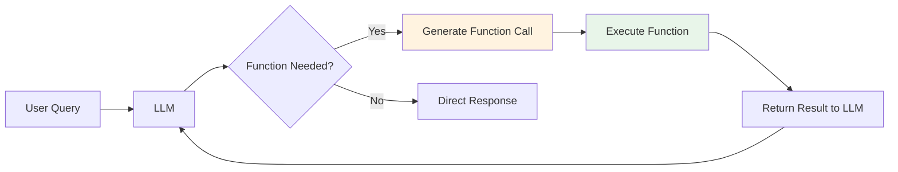
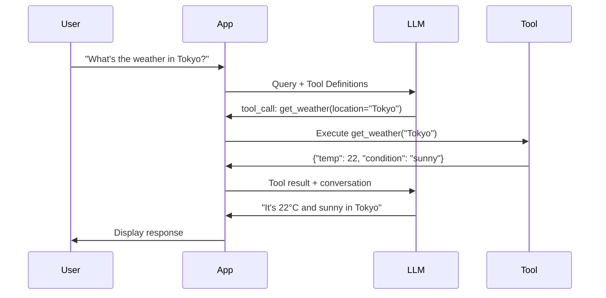
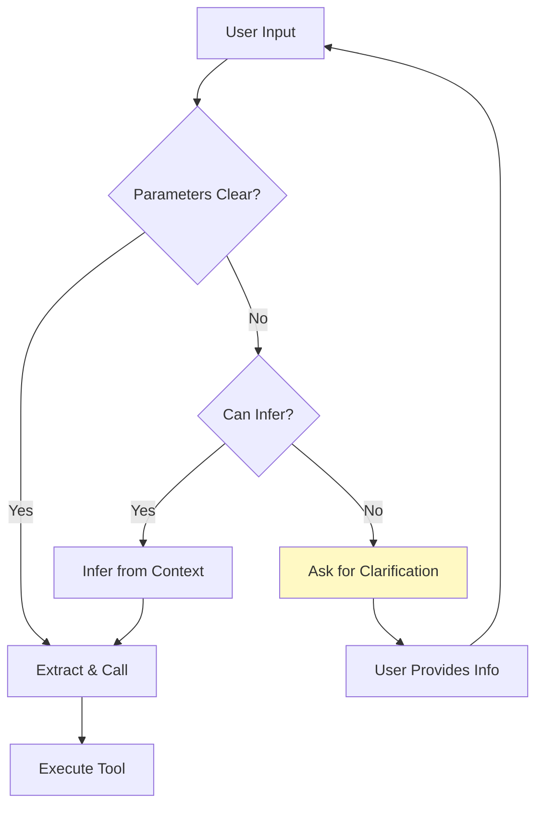
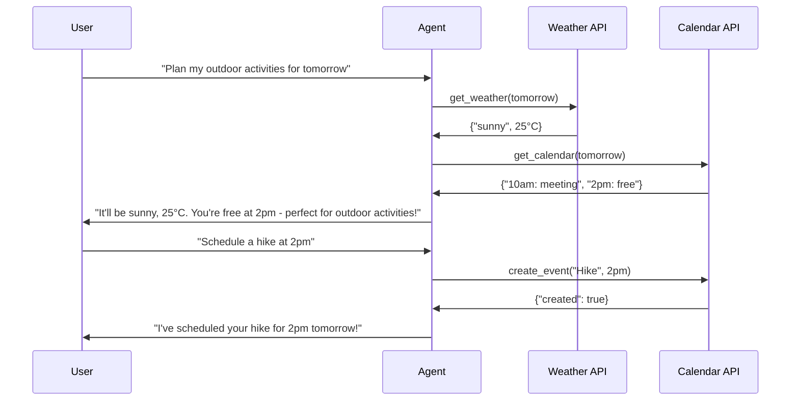

# Function Calling

> **Enabling LLMs to reliably interact with external tools and APIs**

---

## Learning Objectives

By the end of this module, you will be able to:

- **Design** JSON schemas for function definitions that LLMs can reliably call
- **Implement** robust parameter extraction from natural language queries
- **Handle** function call errors gracefully with fallbacks and retries
- **Build** multi-turn conversations with tool use
- **Compare** function calling approaches across different LLM providers

---

## Why Function Calling Matters

::: info Core Capability
Function calling transforms LLMs from text generators into action-capable agents. It's the bridge between natural language understanding and programmatic execution.
:::



---

## OpenAI Function Calling

### Basic Structure

```python
from openai import OpenAI

client = OpenAI()

# Define the function schema
tools = [
    {
        "type": "function",
        "function": {
            "name": "get_weather",
            "description": "Get the current weather for a location",
            "parameters": {
                "type": "object",
                "properties": {
                    "location": {
                        "type": "string",
                        "description": "City and state, e.g., 'San Francisco, CA'"
                    },
                    "unit": {
                        "type": "string",
                        "enum": ["celsius", "fahrenheit"],
                        "description": "Temperature unit"
                    }
                },
                "required": ["location"]
            }
        }
    }
]

# Make the API call
response = client.chat.completions.create(
    model="gpt-4",
    messages=[{"role": "user", "content": "What's the weather in Tokyo?"}],
    tools=tools,
    tool_choice="auto"  # Let model decide when to use tools
)

# Check if a function was called
message = response.choices[0].message
if message.tool_calls:
    tool_call = message.tool_calls[0]
    function_name = tool_call.function.name
    arguments = json.loads(tool_call.function.arguments)
    print(f"Function: {function_name}, Args: {arguments}")
```

### Function Call Flow



---

## Designing Effective Tool Schemas

### Schema Best Practices

```python
# Well-designed schema with clear descriptions and constraints
search_tool = {
    "type": "function",
    "function": {
        "name": "search_database",
        "description": """Search the product database. Use this when users ask about
        products, inventory, or want to find items. Returns up to 10 results by default.""",
        "parameters": {
            "type": "object",
            "properties": {
                "query": {
                    "type": "string",
                    "description": "Search query - can be product name, category, or keywords",
                    "minLength": 1,
                    "maxLength": 100
                },
                "category": {
                    "type": "string",
                    "enum": ["electronics", "clothing", "home", "food", "all"],
                    "description": "Filter by product category. Use 'all' for no filter.",
                    "default": "all"
                },
                "price_range": {
                    "type": "object",
                    "description": "Optional price filter",
                    "properties": {
                        "min": {"type": "number", "minimum": 0},
                        "max": {"type": "number", "minimum": 0}
                    }
                },
                "sort_by": {
                    "type": "string",
                    "enum": ["relevance", "price_low", "price_high", "rating"],
                    "default": "relevance"
                },
                "limit": {
                    "type": "integer",
                    "minimum": 1,
                    "maximum": 50,
                    "default": 10,
                    "description": "Maximum number of results to return"
                }
            },
            "required": ["query"]
        }
    }
}
```

### Common Schema Patterns

| Pattern | Use Case | Example |
|---------|----------|---------|
| **Enum constraints** | Limited valid values | `"enum": ["asc", "desc"]` |
| **Default values** | Optional params with sensible defaults | `"default": 10` |
| **Nested objects** | Complex parameters | `price_range: {min, max}` |
| **Arrays** | Multiple values | `"type": "array", "items": {"type": "string"}` |
| **Descriptions** | Guide extraction | Detailed property descriptions |

---

## Complete Function Calling Implementation

```python
from openai import OpenAI
import json
from typing import Callable
from dataclasses import dataclass

@dataclass
class Tool:
    name: str
    description: str
    parameters: dict
    function: Callable

class FunctionCallingAgent:
    """
    Production-ready function calling agent with error handling,
    multi-turn support, and parallel tool execution.
    """

    def __init__(self, model: str = "gpt-4"):
        self.client = OpenAI()
        self.model = model
        self.tools: dict[str, Tool] = {}
        self.conversation_history: list[dict] = []
        self.max_tool_iterations = 5

    def register_tool(self, tool: Tool):
        """Register a tool with the agent."""
        self.tools[tool.name] = tool

    def _get_tool_definitions(self) -> list[dict]:
        """Convert tools to OpenAI format."""
        return [
            {
                "type": "function",
                "function": {
                    "name": tool.name,
                    "description": tool.description,
                    "parameters": tool.parameters
                }
            }
            for tool in self.tools.values()
        ]

    def _execute_tool(self, name: str, arguments: dict) -> str:
        """Execute a tool with error handling."""
        if name not in self.tools:
            return json.dumps({"error": f"Unknown tool: {name}"})

        tool = self.tools[name]
        try:
            result = tool.function(**arguments)
            return json.dumps({"success": True, "result": result})
        except TypeError as e:
            return json.dumps({"error": f"Invalid arguments: {str(e)}"})
        except Exception as e:
            return json.dumps({"error": f"Execution error: {str(e)}"})

    def _execute_tool_calls(self, tool_calls: list) -> list[dict]:
        """Execute multiple tool calls, potentially in parallel."""
        results = []

        for tool_call in tool_calls:
            function_name = tool_call.function.name
            try:
                arguments = json.loads(tool_call.function.arguments)
            except json.JSONDecodeError:
                arguments = {}

            result = self._execute_tool(function_name, arguments)

            results.append({
                "tool_call_id": tool_call.id,
                "role": "tool",
                "content": result
            })

        return results

    def chat(self, user_message: str) -> str:
        """
        Process a user message, handling any function calls.
        Supports multi-turn tool use.
        """
        # Add user message to history
        self.conversation_history.append({
            "role": "user",
            "content": user_message
        })

        tool_iterations = 0

        while tool_iterations < self.max_tool_iterations:
            # Call the LLM
            response = self.client.chat.completions.create(
                model=self.model,
                messages=self.conversation_history,
                tools=self._get_tool_definitions() if self.tools else None,
                tool_choice="auto"
            )

            message = response.choices[0].message

            # Add assistant message to history
            self.conversation_history.append({
                "role": "assistant",
                "content": message.content,
                "tool_calls": [
                    {
                        "id": tc.id,
                        "type": "function",
                        "function": {
                            "name": tc.function.name,
                            "arguments": tc.function.arguments
                        }
                    }
                    for tc in (message.tool_calls or [])
                ]
            })

            # Check if we need to execute tools
            if not message.tool_calls:
                return message.content

            # Execute all tool calls
            tool_results = self._execute_tool_calls(message.tool_calls)

            # Add tool results to history
            self.conversation_history.extend(tool_results)

            tool_iterations += 1

        return "Max tool iterations reached. Please try a simpler query."

    def clear_history(self):
        """Clear conversation history."""
        self.conversation_history = []


# Example usage with real tools
def get_weather(location: str, unit: str = "celsius") -> dict:
    """Simulated weather API."""
    # In production, call actual weather API
    return {
        "location": location,
        "temperature": 22 if unit == "celsius" else 72,
        "unit": unit,
        "condition": "sunny",
        "humidity": 65
    }

def search_products(
    query: str,
    category: str = "all",
    limit: int = 5
) -> list[dict]:
    """Simulated product search."""
    return [
        {"name": f"{query} Product {i}", "price": 29.99 + i * 10, "rating": 4.5}
        for i in range(1, limit + 1)
    ]

def send_email(to: str, subject: str, body: str) -> dict:
    """Simulated email sending."""
    return {"status": "sent", "to": to, "message_id": "msg_12345"}


# Initialize agent
agent = FunctionCallingAgent()

# Register tools
agent.register_tool(Tool(
    name="get_weather",
    description="Get current weather for a location",
    parameters={
        "type": "object",
        "properties": {
            "location": {"type": "string", "description": "City name"},
            "unit": {"type": "string", "enum": ["celsius", "fahrenheit"], "default": "celsius"}
        },
        "required": ["location"]
    },
    function=get_weather
))

agent.register_tool(Tool(
    name="search_products",
    description="Search for products in the catalog",
    parameters={
        "type": "object",
        "properties": {
            "query": {"type": "string"},
            "category": {"type": "string", "enum": ["electronics", "clothing", "home", "all"]},
            "limit": {"type": "integer", "minimum": 1, "maximum": 20}
        },
        "required": ["query"]
    },
    function=search_products
))

# Chat
response = agent.chat("What's the weather in Paris and find me some headphones under $100")
print(response)
```

---

## Parameter Extraction Strategies

### Handling Ambiguous Inputs



### Parameter Extraction Implementation

```python
class ParameterExtractor:
    """
    Robust parameter extraction with validation and clarification.
    """

    def __init__(self, model: str = "gpt-4"):
        self.client = OpenAI()
        self.model = model

    def extract_parameters(
        self,
        user_input: str,
        schema: dict,
        context: dict = None
    ) -> dict:
        """
        Extract parameters from natural language input.
        Returns extracted params or clarification questions.
        """
        prompt = f"""Extract function parameters from the user input.

Schema:
{json.dumps(schema, indent=2)}

User input: "{user_input}"

{"Context: " + json.dumps(context) if context else ""}

Output a JSON object with:
1. "parameters": extracted parameter values (use null for missing required params)
2. "confidence": 0-1 confidence score for each parameter
3. "clarification_needed": list of questions for ambiguous/missing required params

Example output:
{{
    "parameters": {{"location": "New York", "date": null}},
    "confidence": {{"location": 0.95, "date": 0.0}},
    "clarification_needed": ["What date would you like to check?"]
}}"""

        response = self.client.chat.completions.create(
            model=self.model,
            messages=[{"role": "user", "content": prompt}],
            temperature=0.0
        )

        return json.loads(response.choices[0].message.content)

    def validate_parameters(self, params: dict, schema: dict) -> list[str]:
        """Validate extracted parameters against schema."""
        errors = []
        properties = schema.get("properties", {})
        required = schema.get("required", [])

        # Check required parameters
        for param in required:
            if param not in params or params[param] is None:
                errors.append(f"Missing required parameter: {param}")

        # Validate types and constraints
        for param, value in params.items():
            if param in properties and value is not None:
                prop_schema = properties[param]

                # Type validation
                expected_type = prop_schema.get("type")
                if expected_type == "string" and not isinstance(value, str):
                    errors.append(f"{param} must be a string")
                elif expected_type == "integer" and not isinstance(value, int):
                    errors.append(f"{param} must be an integer")
                elif expected_type == "number" and not isinstance(value, (int, float)):
                    errors.append(f"{param} must be a number")

                # Enum validation
                if "enum" in prop_schema and value not in prop_schema["enum"]:
                    errors.append(f"{param} must be one of: {prop_schema['enum']}")

                # Range validation
                if "minimum" in prop_schema and value < prop_schema["minimum"]:
                    errors.append(f"{param} must be >= {prop_schema['minimum']}")
                if "maximum" in prop_schema and value > prop_schema["maximum"]:
                    errors.append(f"{param} must be <= {prop_schema['maximum']}")

        return errors


# Usage
extractor = ParameterExtractor()

schema = {
    "type": "object",
    "properties": {
        "destination": {"type": "string", "description": "Travel destination"},
        "departure_date": {"type": "string", "description": "Date in YYYY-MM-DD format"},
        "travelers": {"type": "integer", "minimum": 1, "maximum": 10}
    },
    "required": ["destination", "departure_date"]
}

result = extractor.extract_parameters(
    "I want to book a trip to Hawaii next month for my family",
    schema,
    context={"family_size": 4, "current_date": "2024-01-15"}
)
```

---

## Error Handling Patterns

### Comprehensive Error Handling

```python
from enum import Enum
from typing import Optional
import time

class ErrorType(Enum):
    PARSE_ERROR = "parse_error"
    VALIDATION_ERROR = "validation_error"
    EXECUTION_ERROR = "execution_error"
    TIMEOUT_ERROR = "timeout_error"
    RATE_LIMIT = "rate_limit"

class RobustFunctionCaller:
    """
    Function caller with comprehensive error handling and retry logic.
    """

    def __init__(self):
        self.client = OpenAI()
        self.max_retries = 3
        self.retry_delays = [1, 2, 4]  # Exponential backoff

    def call_with_retry(
        self,
        func: Callable,
        arguments: dict,
        schema: dict
    ) -> tuple[bool, any, Optional[str]]:
        """
        Execute function with retry logic and error handling.
        Returns: (success, result, error_message)
        """
        # Validate arguments first
        validation_errors = self._validate_args(arguments, schema)
        if validation_errors:
            return False, None, f"Validation failed: {validation_errors}"

        # Attempt execution with retries
        last_error = None
        for attempt in range(self.max_retries):
            try:
                result = func(**arguments)
                return True, result, None

            except TypeError as e:
                # Argument mismatch - don't retry
                return False, None, f"Argument error: {str(e)}"

            except TimeoutError as e:
                last_error = f"Timeout: {str(e)}"
                if attempt < self.max_retries - 1:
                    time.sleep(self.retry_delays[attempt])

            except ConnectionError as e:
                last_error = f"Connection error: {str(e)}"
                if attempt < self.max_retries - 1:
                    time.sleep(self.retry_delays[attempt])

            except Exception as e:
                last_error = f"Execution error: {str(e)}"
                if attempt < self.max_retries - 1:
                    time.sleep(self.retry_delays[attempt])

        return False, None, last_error

    def _validate_args(self, args: dict, schema: dict) -> list[str]:
        """Validate arguments against schema."""
        errors = []
        required = schema.get("required", [])
        properties = schema.get("properties", {})

        for req in required:
            if req not in args:
                errors.append(f"Missing required: {req}")

        for key, value in args.items():
            if key in properties:
                prop = properties[key]
                if "enum" in prop and value not in prop["enum"]:
                    errors.append(f"Invalid value for {key}: {value}")

        return errors

    def handle_error_gracefully(
        self,
        error_type: ErrorType,
        error_message: str,
        context: dict
    ) -> str:
        """
        Generate user-friendly error response using LLM.
        """
        prompt = f"""Generate a helpful response for this error.

Error type: {error_type.value}
Error message: {error_message}
User's original request: {context.get('user_request', 'Unknown')}
Tool attempted: {context.get('tool_name', 'Unknown')}

Provide:
1. A friendly explanation of what went wrong
2. Suggestions for how the user can fix or work around the issue
3. An alternative if applicable

Be concise and helpful."""

        response = self.client.chat.completions.create(
            model="gpt-4",
            messages=[{"role": "user", "content": prompt}],
            temperature=0.3
        )

        return response.choices[0].message.content
```

---

## Multi-Turn Tool Conversations



---

## Provider Comparison

| Feature | OpenAI | Anthropic | Google |
|---------|--------|-----------|--------|
| **Function format** | JSON Schema | XML/JSON | JSON Schema |
| **Parallel calls** | Yes | Yes | Yes |
| **Streaming** | Yes | Yes | Yes |
| **Force function** | `tool_choice: {name}` | System prompt | `tool_config` |
| **Auto/none** | Yes | Yes | Yes |
| **Nested objects** | Full support | Full support | Full support |

### Anthropic Tool Use Example

```python
import anthropic

client = anthropic.Anthropic()

response = client.messages.create(
    model="claude-3-opus-20240229",
    max_tokens=1024,
    tools=[
        {
            "name": "get_weather",
            "description": "Get the current weather in a location",
            "input_schema": {
                "type": "object",
                "properties": {
                    "location": {
                        "type": "string",
                        "description": "The city and state"
                    }
                },
                "required": ["location"]
            }
        }
    ],
    messages=[
        {"role": "user", "content": "What's the weather in San Francisco?"}
    ]
)

# Handle tool use
for block in response.content:
    if block.type == "tool_use":
        tool_name = block.name
        tool_input = block.input
        tool_use_id = block.id

        # Execute tool and continue conversation
        tool_result = execute_tool(tool_name, tool_input)

        # Send result back
        followup = client.messages.create(
            model="claude-3-opus-20240229",
            max_tokens=1024,
            messages=[
                {"role": "user", "content": "What's the weather in San Francisco?"},
                {"role": "assistant", "content": response.content},
                {
                    "role": "user",
                    "content": [
                        {
                            "type": "tool_result",
                            "tool_use_id": tool_use_id,
                            "content": json.dumps(tool_result)
                        }
                    ]
                }
            ]
        )
```

---

## Interview Q&A

### Q1: How do you design a function schema to minimize parameter extraction errors?

**Strong Answer:**

"I follow several principles for robust schema design:

**1. Clear, Specific Descriptions**
```json
{
  "location": {
    "type": "string",
    "description": "City and country in format 'City, Country' (e.g., 'Paris, France'). For US cities, include state: 'Austin, TX, USA'"
  }
}
```

**2. Constrained Value Spaces**
- Use enums for categorical parameters
- Set min/max for numeric parameters
- Provide defaults for optional params

**3. Atomic Parameters**
Instead of: `'date_range': 'Jan 1 to Jan 15'`
Use: `'start_date': '2024-01-01', 'end_date': '2024-01-15'`

**4. Examples in Descriptions**
Include 2-3 examples of valid values in the description.

**5. Validation Layer**
Always validate extracted parameters before execution:
```python
def validate_and_normalize(params, schema):
    # Type coercion
    # Range clamping
    # Default filling
    # Format normalization
```

**6. Graceful Degradation**
If extraction confidence is low, either:
- Ask for clarification
- Use sensible defaults
- Proceed with partial information and note uncertainty"

---

### Q2: How do you handle a scenario where the LLM hallucinates a function call for a tool that doesn't exist?

**Strong Answer:**

"This requires multiple layers of defense:

**1. Strict Tool Matching**
```python
def execute_tool_call(tool_call, available_tools):
    if tool_call.name not in available_tools:
        return {
            'error': 'tool_not_found',
            'message': f'Tool {tool_call.name} is not available',
            'available_tools': list(available_tools.keys())
        }
```

**2. Feed Error Back to LLM**
```python
messages.append({
    'role': 'tool',
    'tool_call_id': tool_call.id,
    'content': json.dumps({
        'error': 'Tool not found. Available tools: get_weather, search_products'
    })
})
# Let LLM self-correct
```

**3. Constrained Decoding (if available)**
Some providers support restricting output to valid function names.

**4. System Prompt Reinforcement**
```
You can ONLY use these exact tools: [list]. Do not invent or assume other tools exist.
```

**5. Monitoring and Logging**
Track hallucinated tool calls to:
- Identify patterns (maybe users expect that tool)
- Improve system prompts
- Consider adding the tool if frequently requested

**6. Fallback Response**
If self-correction fails after N attempts, provide a graceful response:
'I attempted to use a capability I don't have. Let me answer directly instead...'"

---

### Q3: What's the trade-off between using `tool_choice: "auto"` vs forcing specific tool calls?

**Strong Answer:**

"The choice depends on the use case:

**`tool_choice: 'auto'` (Default)**

Pros:
- Model decides when tools are actually needed
- Handles conversational queries without tools
- More natural multi-turn behavior

Cons:
- May skip tools when you want them used
- Less predictable behavior
- Can waste tokens on reasoning about whether to use tools

Best for: General assistants, open-ended conversations

**`tool_choice: {'type': 'function', 'name': 'specific_tool'}`**

Pros:
- Guaranteed tool execution
- Faster (no decision-making)
- Consistent behavior

Cons:
- Forces tool use even when inappropriate
- Requires application logic to decide when to force

Best for: Specific workflows, form-filling, deterministic pipelines

**Hybrid Approach:**
```python
def get_tool_choice(user_intent, available_tools):
    # Detect explicit tool requests
    if 'search for' in user_intent.lower():
        return {'type': 'function', 'function': {'name': 'search'}}

    # Detect questions that likely need tools
    if any(kw in user_intent.lower() for kw in ['weather', 'price', 'stock']):
        return 'required'  # Must use some tool

    # Let model decide for ambiguous cases
    return 'auto'
```

In production, I often use intent detection to dynamically set `tool_choice`."

---

## Summary

| Aspect | Best Practice |
|--------|---------------|
| **Schema Design** | Clear descriptions, enums, defaults, examples |
| **Parameter Extraction** | Validate, ask for clarification, normalize |
| **Error Handling** | Retry with backoff, graceful degradation, user feedback |
| **Multi-turn** | Maintain context, handle tool dependencies |
| **Provider Choice** | OpenAI for ecosystem, Anthropic for safety, Google for multimodal |

---

## Sources

- OpenAI Function Calling Documentation
- Anthropic Tool Use Documentation
- Google Vertex AI Function Calling Guide
- Schick et al., "Toolformer" (2023)
- Qin et al., "ToolLLM: Facilitating Large Language Models to Master 16000+ Real-world APIs" (2023)
