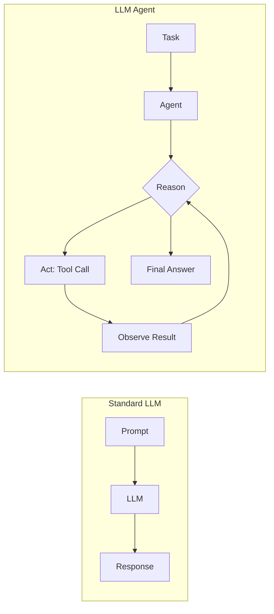
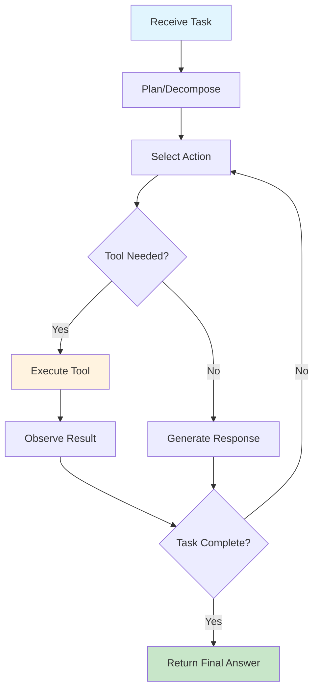

# Agents & Tool Use

> **Building autonomous AI systems that reason, act, and use tools**

---

## Overview

This section covers the design, implementation, and evaluation of LLM-powered agents. Agents extend LLMs beyond text generation to autonomous task completion through reasoning, tool use, and interaction with external environments. This is a rapidly evolving area critical for GenAI engineering interviews.

---

## Learning Objectives

By completing this module, you will be able to:

- **Explain** the key agent architectures (ReAct, MRKL, Plan-and-Execute) and their trade-offs
- **Implement** function calling with proper schema design and parameter extraction
- **Design** multi-agent systems with appropriate communication and orchestration patterns
- **Build** memory systems for maintaining context and state across interactions
- **Evaluate** agent performance using task completion, efficiency, and safety metrics

---

## Module Structure

| Module | Focus | Key Concepts |
|--------|-------|--------------|
| [Agent Architectures](./agent-architectures) | Core reasoning patterns | ReAct, Plan-and-Execute, MRKL, Toolformer |
| [Function Calling](./function-calling) | Tool integration | Schemas, parameter extraction, OpenAI API |
| [Multi-Agent Systems](./multi-agent-systems) | Collaboration patterns | Orchestration, debate, AutoGen |
| [Memory & State](./memory-and-state) | Context management | Short/long-term, episodic, vector stores |
| [Agent Frameworks](./agent-frameworks) | Implementation tools | LangChain, LlamaIndex, CrewAI comparison |
| [Agent Evaluation](./agent-evaluation) | Performance measurement | Task success, efficiency, safety metrics |

---

## What Makes Agents Different from LLMs

| Aspect | Standard LLM | LLM Agent |
|--------|-------------|-----------|
| **Interaction** | Single turn | Multi-turn with environment |
| **Capabilities** | Text generation only | Tool use, API calls, code execution |
| **Memory** | Context window only | Persistent memory systems |
| **Autonomy** | None | Task decomposition, self-correction |
| **Error handling** | User must retry | Self-debugging and retry |

---

## Core Agent Loop

---

## Interview Focus Areas

| Topic | Frequency | Question Types |
|-------|-----------|----------------|
| **ReAct Pattern** | Very High | Explain, implement, compare |
| **Function Calling** | Very High | Design schemas, handle errors |
| **Multi-Agent Design** | High | Architecture, coordination |
| **Memory Systems** | High | Design, trade-offs |
| **Framework Selection** | Medium | Compare, justify choices |
| **Safety & Evaluation** | Medium | Metrics, failure modes |

---

## Quick Reference: Agent Patterns

| Pattern | When to Use | Key Advantage |
|---------|-------------|---------------|
| **ReAct** | Single-agent, iterative tasks | Simple, interpretable |
| **Plan-and-Execute** | Complex, multi-step tasks | Structured planning |
| **MRKL** | Diverse tool requirements | Modular, extensible |
| **Multi-Agent** | Specialized subtasks | Expertise distribution |
| **Reflexion** | Learning from failures | Self-improvement |

---

## Prerequisites

Before diving into agents, ensure familiarity with:

- LLM fundamentals (tokenization, context windows, temperature)
- Prompt engineering (few-shot, chain-of-thought)
- API usage (OpenAI, Anthropic, or similar)
- Basic Python async programming

---

## Recommended Learning Path

1. **Start with [Agent Architectures](./agent-architectures)** to understand reasoning patterns
2. **Master [Function Calling](./function-calling)** for practical tool integration
3. **Study [Multi-Agent Systems](./multi-agent-systems)** for complex coordination
4. **Learn [Memory & State](./memory-and-state)** for persistent agents
5. **Compare [Agent Frameworks](./agent-frameworks)** for implementation choices
6. **Finish with [Agent Evaluation](./agent-evaluation)** for production readiness

---

## Sources

- Yao et al., "ReAct: Synergizing Reasoning and Acting in Language Models" (2022)
- Schick et al., "Toolformer: Language Models Can Teach Themselves to Use Tools" (2023)
- OpenAI Function Calling Documentation
- LangChain Agent Documentation
