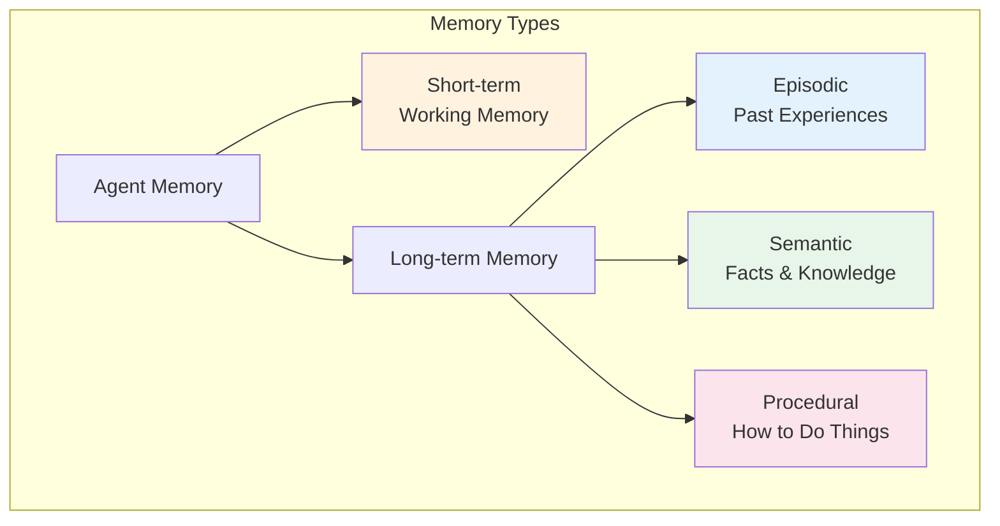
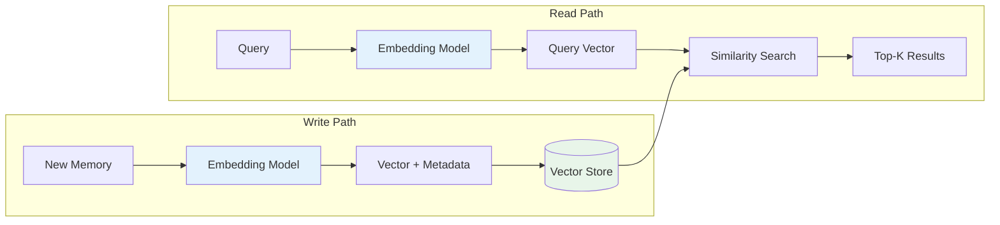
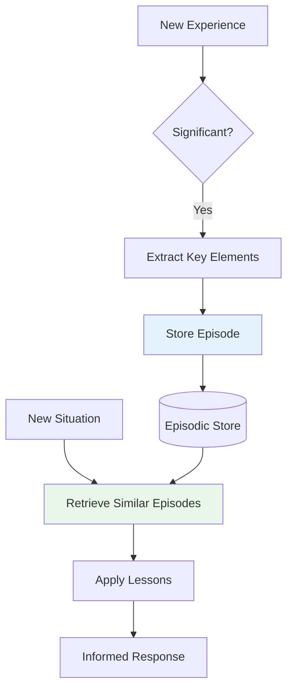
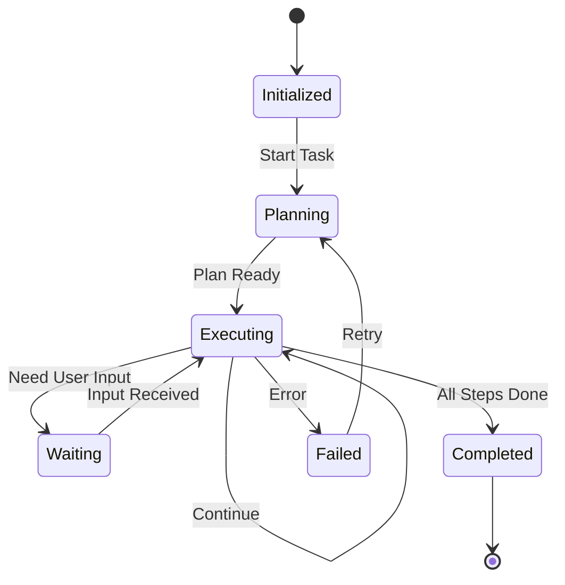

# Memory & State Management

> **Enabling persistent, contextual, and adaptive agent behavior**

---

## Learning Objectives

By the end of this module, you will be able to:

- **Implement** short-term and long-term memory systems for agents
- **Design** episodic memory for experience-based learning
- **Build** state management systems for complex multi-turn interactions
- **Use** vector databases for semantic memory retrieval
- **Evaluate** trade-offs between different memory architectures

---

## Why Memory Matters for Agents

::: info Core Insight
Memory transforms stateless LLMs into contextual, learning agents. Without memory, every interaction starts from zero. With memory, agents accumulate knowledge, learn from experience, and maintain coherent long-term behavior.
:::

### Memory's Role in Agent Behavior

```mermaid
flowchart TB
    subgraph "Without Memory"
        A1[User: "Call me Alex"]
        B1[Agent: "Ok, Alex!"]
        C1[User: "What's my name?"]
        D1[Agent: "I don't know your name"]
    end

    subgraph "With Memory"
        A2[User: "Call me Alex"]
        B2[Agent: "Ok, Alex!"]
        C2[Memory: Store name=Alex]
        D2[User: "What's my name?"]
        E2[Memory: Retrieve name]
        F2[Agent: "Your name is Alex"]
    end

    style C2 fill:#e8f5e9
    style E2 fill:#e8f5e9
```

---

## Memory Types



### Memory Type Comparison

| Type | Content | Duration | Access Pattern | Storage |
|------|---------|----------|----------------|---------|
| **Short-term** | Current conversation | Session | Sequential | Context window |
| **Episodic** | Past experiences | Persistent | Similarity search | Vector DB |
| **Semantic** | Facts, knowledge | Persistent | Key-value lookup | Database |
| **Procedural** | Skills, workflows | Persistent | Pattern match | Code/Prompts |

---

## Short-Term / Working Memory

### Conversation Buffer Implementation

```python
from collections import deque
from dataclasses import dataclass
from typing import Optional
import tiktoken

@dataclass
class Message:
    role: str
    content: str
    timestamp: float
    metadata: dict = None

class ConversationMemory:
    """
    Short-term memory using a sliding window approach.
    Manages conversation history within token limits.
    """

    def __init__(
        self,
        max_tokens: int = 4000,
        max_messages: int = 50,
        model: str = "gpt-4"
    ):
        self.max_tokens = max_tokens
        self.max_messages = max_messages
        self.messages: deque[Message] = deque(maxlen=max_messages)
        self.encoder = tiktoken.encoding_for_model(model)

    def add_message(self, role: str, content: str, metadata: dict = None):
        """Add a message to memory."""
        import time
        message = Message(
            role=role,
            content=content,
            timestamp=time.time(),
            metadata=metadata or {}
        )
        self.messages.append(message)
        self._enforce_token_limit()

    def _count_tokens(self) -> int:
        """Count total tokens in memory."""
        total = 0
        for msg in self.messages:
            total += len(self.encoder.encode(msg.content))
            total += 4  # Role tokens overhead
        return total

    def _enforce_token_limit(self):
        """Remove oldest messages to stay within token limit."""
        while self._count_tokens() > self.max_tokens and len(self.messages) > 1:
            self.messages.popleft()

    def get_messages(self) -> list[dict]:
        """Get messages in API format."""
        return [
            {"role": msg.role, "content": msg.content}
            for msg in self.messages
        ]

    def get_summary(self, client) -> str:
        """Generate a summary of the conversation so far."""
        if len(self.messages) < 5:
            return ""

        conversation = "\n".join([
            f"{msg.role}: {msg.content}"
            for msg in self.messages
        ])

        response = client.chat.completions.create(
            model="gpt-3.5-turbo",
            messages=[{
                "role": "user",
                "content": f"Summarize this conversation in 2-3 sentences:\n\n{conversation}"
            }],
            temperature=0.3
        )

        return response.choices[0].message.content

    def clear(self):
        """Clear all messages."""
        self.messages.clear()


# Usage
memory = ConversationMemory(max_tokens=4000)
memory.add_message("user", "My name is Alex and I work at TechCorp")
memory.add_message("assistant", "Nice to meet you, Alex! What do you do at TechCorp?")
memory.add_message("user", "I'm a software engineer focusing on ML systems")
```

### Windowed Memory with Summarization

```python
class SummarizingMemory:
    """
    Memory that automatically summarizes old conversations
    to maintain context while staying within limits.
    """

    def __init__(self, model: str = "gpt-4"):
        self.client = OpenAI()
        self.model = model
        self.recent_messages: list[Message] = []
        self.summary: str = ""
        self.summary_threshold = 10  # Messages before summarizing

    def add_message(self, role: str, content: str):
        """Add message, potentially triggering summarization."""
        self.recent_messages.append(Message(
            role=role,
            content=content,
            timestamp=time.time()
        ))

        if len(self.recent_messages) >= self.summary_threshold:
            self._summarize_and_trim()

    def _summarize_and_trim(self):
        """Summarize older messages and keep only recent ones."""
        # Keep last 3 messages
        to_summarize = self.recent_messages[:-3]
        self.recent_messages = self.recent_messages[-3:]

        # Generate summary
        conversation = "\n".join([
            f"{msg.role}: {msg.content}"
            for msg in to_summarize
        ])

        prompt = f"""Previous summary: {self.summary if self.summary else 'None'}

New conversation to incorporate:
{conversation}

Create an updated summary that captures key information, user preferences, and important context. Be concise but comprehensive."""

        response = self.client.chat.completions.create(
            model="gpt-3.5-turbo",
            messages=[{"role": "user", "content": prompt}],
            temperature=0.3
        )

        self.summary = response.choices[0].message.content

    def get_context(self) -> list[dict]:
        """Get full context for API call."""
        messages = []

        if self.summary:
            messages.append({
                "role": "system",
                "content": f"Conversation summary: {self.summary}"
            })

        messages.extend([
            {"role": msg.role, "content": msg.content}
            for msg in self.recent_messages
        ])

        return messages
```

---

## Long-Term Memory with Vector Stores

::: info Implementation Note
Vector stores enable semantic search over large memory collections, finding relevant past experiences and knowledge based on meaning rather than keywords.
:::

### Vector Memory Architecture



### Vector Memory Implementation

```python
from openai import OpenAI
import numpy as np
from dataclasses import dataclass, field
from typing import Optional
import uuid
import json

@dataclass
class MemoryEntry:
    id: str
    content: str
    embedding: list[float]
    timestamp: float
    memory_type: str  # "episodic", "semantic", "user_fact"
    metadata: dict = field(default_factory=dict)
    importance: float = 1.0

class VectorMemory:
    """
    Long-term memory using vector embeddings for semantic retrieval.
    """

    def __init__(self, model: str = "text-embedding-3-small"):
        self.client = OpenAI()
        self.embedding_model = model
        self.memories: dict[str, MemoryEntry] = {}
        self.embedding_dim = 1536

    def _get_embedding(self, text: str) -> list[float]:
        """Generate embedding for text."""
        response = self.client.embeddings.create(
            model=self.embedding_model,
            input=text
        )
        return response.data[0].embedding

    def add_memory(
        self,
        content: str,
        memory_type: str = "episodic",
        metadata: dict = None,
        importance: float = 1.0
    ) -> str:
        """Add a new memory."""
        import time

        memory_id = str(uuid.uuid4())
        embedding = self._get_embedding(content)

        entry = MemoryEntry(
            id=memory_id,
            content=content,
            embedding=embedding,
            timestamp=time.time(),
            memory_type=memory_type,
            metadata=metadata or {},
            importance=importance
        )

        self.memories[memory_id] = entry
        return memory_id

    def _cosine_similarity(self, a: list[float], b: list[float]) -> float:
        """Compute cosine similarity between two vectors."""
        a_np = np.array(a)
        b_np = np.array(b)
        return np.dot(a_np, b_np) / (np.linalg.norm(a_np) * np.linalg.norm(b_np))

    def search(
        self,
        query: str,
        top_k: int = 5,
        memory_type: Optional[str] = None,
        min_similarity: float = 0.5
    ) -> list[tuple[MemoryEntry, float]]:
        """Search for relevant memories."""
        query_embedding = self._get_embedding(query)

        results = []
        for memory in self.memories.values():
            # Filter by type if specified
            if memory_type and memory.memory_type != memory_type:
                continue

            similarity = self._cosine_similarity(query_embedding, memory.embedding)

            # Apply importance weighting
            weighted_score = similarity * memory.importance

            if weighted_score >= min_similarity:
                results.append((memory, weighted_score))

        # Sort by score and return top-k
        results.sort(key=lambda x: x[1], reverse=True)
        return results[:top_k]

    def forget(self, memory_id: str):
        """Remove a memory."""
        if memory_id in self.memories:
            del self.memories[memory_id]

    def decay_memories(self, decay_rate: float = 0.99):
        """Apply time-based decay to memory importance."""
        import time
        current_time = time.time()

        for memory in self.memories.values():
            age_hours = (current_time - memory.timestamp) / 3600
            decay_factor = decay_rate ** age_hours
            memory.importance *= decay_factor


# Integration with agent
class MemoryAugmentedAgent:
    """Agent that uses long-term memory for context."""

    def __init__(self):
        self.client = OpenAI()
        self.memory = VectorMemory()
        self.conversation = ConversationMemory()

    def _build_context(self, user_message: str) -> str:
        """Build context from relevant memories."""
        relevant_memories = self.memory.search(user_message, top_k=3)

        if not relevant_memories:
            return ""

        context_parts = []
        for mem, score in relevant_memories:
            context_parts.append(f"[Relevance: {score:.2f}] {mem.content}")

        return "Relevant context from memory:\n" + "\n".join(context_parts)

    def chat(self, user_message: str) -> str:
        """Process user message with memory augmentation."""
        # Add to conversation memory
        self.conversation.add_message("user", user_message)

        # Get relevant long-term memories
        memory_context = self._build_context(user_message)

        # Build messages
        messages = [
            {
                "role": "system",
                "content": f"""You are a helpful assistant with access to conversation history and long-term memory.

{memory_context if memory_context else 'No relevant memories found.'}

Use this context to provide personalized, informed responses."""
            }
        ]
        messages.extend(self.conversation.get_messages())

        # Generate response
        response = self.client.chat.completions.create(
            model="gpt-4",
            messages=messages,
            temperature=0.7
        )

        assistant_message = response.choices[0].message.content

        # Store interaction in long-term memory if significant
        self._maybe_store_memory(user_message, assistant_message)

        # Add to conversation memory
        self.conversation.add_message("assistant", assistant_message)

        return assistant_message

    def _maybe_store_memory(self, user_message: str, assistant_message: str):
        """Decide whether to store this interaction in long-term memory."""
        # Heuristics for what to remember
        importance_keywords = [
            "remember", "my name", "i work", "i live", "i prefer",
            "important", "always", "never", "deadline"
        ]

        combined = (user_message + assistant_message).lower()
        if any(kw in combined for kw in importance_keywords):
            self.memory.add_memory(
                content=f"User said: {user_message}\nAssistant responded: {assistant_message}",
                memory_type="episodic",
                importance=1.5
            )
```

---

## Episodic Memory

::: info Definition
Episodic memory stores specific experiences and events, enabling agents to learn from past interactions and apply lessons to similar situations.
:::

### Episodic Memory System



```python
from dataclasses import dataclass
from typing import Optional
import json

@dataclass
class Episode:
    id: str
    situation: str  # What was the context
    action: str     # What action was taken
    outcome: str    # What was the result
    lesson: str     # What was learned
    success: bool   # Was it successful
    timestamp: float
    embedding: list[float]

class EpisodicMemory:
    """
    Memory system for storing and retrieving past experiences.
    Enables learning from success and failure.
    """

    def __init__(self):
        self.client = OpenAI()
        self.episodes: list[Episode] = []

    def _extract_lesson(self, situation: str, action: str, outcome: str, success: bool) -> str:
        """Extract a generalizable lesson from an episode."""
        prompt = f"""Analyze this experience and extract a brief, generalizable lesson.

Situation: {situation}
Action taken: {action}
Outcome: {outcome}
Success: {success}

Provide a one-sentence lesson that could apply to similar future situations."""

        response = self.client.chat.completions.create(
            model="gpt-4",
            messages=[{"role": "user", "content": prompt}],
            temperature=0.3
        )

        return response.choices[0].message.content

    def store_episode(
        self,
        situation: str,
        action: str,
        outcome: str,
        success: bool
    ) -> str:
        """Store a new episode with extracted lesson."""
        import time
        import uuid

        lesson = self._extract_lesson(situation, action, outcome, success)

        # Create embedding from situation for similarity search
        embedding_response = self.client.embeddings.create(
            model="text-embedding-3-small",
            input=situation
        )
        embedding = embedding_response.data[0].embedding

        episode = Episode(
            id=str(uuid.uuid4()),
            situation=situation,
            action=action,
            outcome=outcome,
            lesson=lesson,
            success=success,
            timestamp=time.time(),
            embedding=embedding
        )

        self.episodes.append(episode)
        return episode.id

    def retrieve_relevant_episodes(
        self,
        current_situation: str,
        top_k: int = 3,
        success_only: bool = False
    ) -> list[Episode]:
        """Find episodes similar to current situation."""
        # Get embedding for current situation
        embedding_response = self.client.embeddings.create(
            model="text-embedding-3-small",
            input=current_situation
        )
        query_embedding = embedding_response.data[0].embedding

        # Calculate similarities
        results = []
        for episode in self.episodes:
            if success_only and not episode.success:
                continue

            similarity = self._cosine_similarity(query_embedding, episode.embedding)
            results.append((episode, similarity))

        results.sort(key=lambda x: x[1], reverse=True)
        return [ep for ep, _ in results[:top_k]]

    def _cosine_similarity(self, a: list[float], b: list[float]) -> float:
        a_np = np.array(a)
        b_np = np.array(b)
        return np.dot(a_np, b_np) / (np.linalg.norm(a_np) * np.linalg.norm(b_np))

    def get_lessons_for_situation(self, situation: str) -> list[str]:
        """Get applicable lessons for a new situation."""
        relevant_episodes = self.retrieve_relevant_episodes(situation, top_k=5)

        lessons = []
        for ep in relevant_episodes:
            prefix = "[SUCCESS]" if ep.success else "[FAILURE]"
            lessons.append(f"{prefix} {ep.lesson}")

        return lessons


# Usage example
episodic = EpisodicMemory()

# Store a successful episode
episodic.store_episode(
    situation="User asked for help debugging a Python recursion error",
    action="First checked base case, found it was missing, added base case",
    outcome="Bug was fixed, user was satisfied",
    success=True
)

# Store a failed episode
episodic.store_episode(
    situation="User asked to optimize a slow database query",
    action="Added more indexes without analyzing query plan first",
    outcome="Query got slower due to index overhead on writes",
    success=False
)

# Later, retrieve lessons for similar situation
lessons = episodic.get_lessons_for_situation(
    "User needs help with a function that's causing stack overflow"
)
```

---

## State Management for Complex Tasks

### Task State Machine



```python
from enum import Enum
from dataclasses import dataclass, field
from typing import Any, Optional
import json

class TaskState(Enum):
    INITIALIZED = "initialized"
    PLANNING = "planning"
    EXECUTING = "executing"
    WAITING_USER = "waiting_user"
    COMPLETED = "completed"
    FAILED = "failed"

@dataclass
class TaskStep:
    id: str
    description: str
    status: str = "pending"
    result: Any = None
    error: Optional[str] = None

@dataclass
class TaskContext:
    task_id: str
    description: str
    state: TaskState = TaskState.INITIALIZED
    steps: list[TaskStep] = field(default_factory=list)
    current_step_index: int = 0
    variables: dict = field(default_factory=dict)
    history: list[dict] = field(default_factory=list)
    created_at: float = 0
    updated_at: float = 0

class StatefulAgent:
    """
    Agent with explicit state management for complex multi-step tasks.
    Supports persistence, resumption, and rollback.
    """

    def __init__(self, model: str = "gpt-4"):
        self.client = OpenAI()
        self.model = model
        self.tasks: dict[str, TaskContext] = {}

    def create_task(self, description: str) -> str:
        """Initialize a new task."""
        import time
        import uuid

        task_id = str(uuid.uuid4())
        task = TaskContext(
            task_id=task_id,
            description=description,
            created_at=time.time(),
            updated_at=time.time()
        )
        self.tasks[task_id] = task

        self._log_event(task, "task_created", {"description": description})
        return task_id

    def plan_task(self, task_id: str) -> list[TaskStep]:
        """Generate execution plan for task."""
        task = self.tasks[task_id]
        task.state = TaskState.PLANNING

        prompt = f"""Create a step-by-step plan for this task:
{task.description}

Output a JSON array of steps, each with:
- id: step identifier (step_1, step_2, etc.)
- description: what this step accomplishes

Keep steps atomic and actionable."""

        response = self.client.chat.completions.create(
            model=self.model,
            messages=[{"role": "user", "content": prompt}],
            temperature=0.3
        )

        steps_data = json.loads(response.choices[0].message.content)
        task.steps = [
            TaskStep(id=s["id"], description=s["description"])
            for s in steps_data
        ]

        self._log_event(task, "plan_created", {"step_count": len(task.steps)})
        task.state = TaskState.EXECUTING
        return task.steps

    def execute_step(self, task_id: str) -> dict:
        """Execute the current step."""
        task = self.tasks[task_id]

        if task.current_step_index >= len(task.steps):
            task.state = TaskState.COMPLETED
            return {"status": "completed", "message": "All steps completed"}

        step = task.steps[task.current_step_index]

        # Build context from previous steps
        context = {
            "task": task.description,
            "current_step": step.description,
            "previous_results": {
                s.id: s.result
                for s in task.steps[:task.current_step_index]
                if s.result
            },
            "variables": task.variables
        }

        prompt = f"""Execute this step and provide the result.

Context:
{json.dumps(context, indent=2)}

If you need user input, respond with:
{{"needs_input": true, "question": "your question"}}

Otherwise respond with:
{{"result": "step result", "variables_to_store": {{"key": "value"}}}}"""

        try:
            response = self.client.chat.completions.create(
                model=self.model,
                messages=[{"role": "user", "content": prompt}],
                temperature=0.5
            )

            result = json.loads(response.choices[0].message.content)

            if result.get("needs_input"):
                task.state = TaskState.WAITING_USER
                return {"status": "waiting", "question": result["question"]}

            # Store result
            step.result = result.get("result")
            step.status = "completed"

            # Update variables
            if "variables_to_store" in result:
                task.variables.update(result["variables_to_store"])

            # Move to next step
            task.current_step_index += 1
            self._log_event(task, "step_completed", {"step_id": step.id})

            return {"status": "success", "result": step.result}

        except Exception as e:
            step.status = "failed"
            step.error = str(e)
            task.state = TaskState.FAILED
            return {"status": "failed", "error": str(e)}

    def provide_input(self, task_id: str, user_input: str):
        """Provide user input for a waiting task."""
        task = self.tasks[task_id]

        if task.state != TaskState.WAITING_USER:
            raise ValueError("Task is not waiting for input")

        step = task.steps[task.current_step_index]
        step.result = f"User provided: {user_input}"
        step.status = "completed"

        task.current_step_index += 1
        task.state = TaskState.EXECUTING

        self._log_event(task, "input_received", {"input": user_input})

    def _log_event(self, task: TaskContext, event_type: str, data: dict):
        """Log a task event."""
        import time
        task.history.append({
            "timestamp": time.time(),
            "event": event_type,
            "data": data
        })
        task.updated_at = time.time()

    def get_task_status(self, task_id: str) -> dict:
        """Get current task status."""
        task = self.tasks[task_id]
        return {
            "task_id": task.task_id,
            "state": task.state.value,
            "progress": f"{task.current_step_index}/{len(task.steps)}",
            "current_step": task.steps[task.current_step_index].description
                if task.current_step_index < len(task.steps) else None,
            "variables": task.variables
        }

    def serialize_task(self, task_id: str) -> str:
        """Serialize task for persistence."""
        task = self.tasks[task_id]
        return json.dumps({
            "task_id": task.task_id,
            "description": task.description,
            "state": task.state.value,
            "steps": [
                {"id": s.id, "description": s.description, "status": s.status, "result": s.result}
                for s in task.steps
            ],
            "current_step_index": task.current_step_index,
            "variables": task.variables,
            "history": task.history
        })
```

---

## Interview Q&A

### Q1: How do you handle the trade-off between memory capacity and retrieval accuracy?

**Strong Answer:**

"This is a fundamental tension in memory system design. Here's my approach:

**1. Hierarchical Memory Structure**
```
                    Hot (Fast, Limited)
                         ↑
Recent Context  ─────────┼───────────  High Accuracy
                         ↓
                    Cold (Slow, Large)
Long-term Store ─────────────────────  Lower Accuracy
```

**2. Tiered Retrieval Strategy**
```python
def retrieve(query, context):
    # Tier 1: Check working memory (exact match)
    if match := working_memory.exact_match(query):
        return match

    # Tier 2: Recent context (high relevance)
    recent = recent_memory.search(query, threshold=0.8)
    if recent:
        return recent

    # Tier 3: Long-term with re-ranking
    candidates = vector_store.search(query, top_k=20)
    reranked = rerank_with_llm(query, candidates)
    return reranked[:5]
```

**3. Adaptive Thresholds**
- Adjust similarity thresholds based on query confidence
- Lower threshold for rare queries, higher for common ones

**4. Memory Compression**
- Summarize old memories while preserving key facts
- Use hierarchical summarization for very old content

**5. Periodic Maintenance**
- Consolidate similar memories
- Prune low-value entries
- Update embeddings when model changes

The key insight is that perfect recall isn't always necessary - we optimize for the memories most likely to be useful."

---

### Q2: How would you implement memory that persists across agent restarts?

**Strong Answer:**

"I'd implement a persistence layer with these components:

**1. Serialization Format**
```python
class PersistentMemory:
    def serialize(self) -> dict:
        return {
            'version': '1.0',
            'timestamp': time.time(),
            'short_term': {
                'messages': [m.to_dict() for m in self.messages],
                'summary': self.summary
            },
            'long_term': {
                'entries': [e.to_dict() for e in self.entries],
                'index_config': self.index_config
            },
            'episodic': {
                'episodes': [ep.to_dict() for ep in self.episodes]
            }
        }
```

**2. Storage Backend Options**
| Backend | Use Case | Pros | Cons |
|---------|----------|------|------|
| SQLite | Single user | Simple, portable | Limited scale |
| PostgreSQL | Multi-user | ACID, pgvector | Setup complexity |
| Redis | Session state | Fast, TTL support | Volatile |
| Pinecone | Vector search | Managed, scalable | Cost |

**3. Checkpoint Strategy**
- Checkpoint after significant events (not every message)
- Background async writes to avoid blocking
- WAL for crash recovery

**4. Versioning and Migration**
```python
def migrate_v1_to_v2(old_data):
    # Handle schema evolution
    ...
```

**5. Warm-up on Restart**
- Load summary first for fast startup
- Lazy-load detailed memories
- Pre-warm frequently accessed memories"

---

### Q3: How do you prevent memory systems from surfacing outdated or incorrect information?

**Strong Answer:**

"This is critical for production systems. My approach:

**1. Temporal Metadata**
```python
@dataclass
class MemoryEntry:
    content: str
    created_at: datetime
    last_accessed: datetime
    source_reliability: float  # 0-1
    verification_status: str   # 'verified', 'unverified', 'deprecated'
    valid_until: Optional[datetime]  # For time-sensitive info
```

**2. Retrieval-Time Filtering**
```python
def retrieve_with_freshness(query, max_age_days=30):
    candidates = vector_search(query)

    # Filter by freshness
    fresh = [c for c in candidates
             if (now - c.created_at).days <= max_age_days
             or c.verification_status == 'verified']

    # Add recency boost to ranking
    scored = [(c, score * recency_boost(c)) for c, score in fresh]
    return sorted(scored, key=lambda x: x[1], reverse=True)
```

**3. Contradiction Detection**
- When storing new memories, check for contradictions
- Flag and resolve or version the information

**4. User Correction Handling**
```python
def handle_correction(old_fact, new_fact, source='user'):
    # Don't delete - mark as superseded
    old_memory = find_memory(old_fact)
    old_memory.verification_status = 'superseded'
    old_memory.superseded_by = store_memory(new_fact, source)
```

**5. Periodic Validation**
- Background job to validate factual memories against current sources
- Decay confidence over time for unverified facts

**6. Source Attribution**
- Track where each memory came from
- Higher weight for verified sources"

---

## Summary

| Memory Type | Implementation | Retrieval | Best For |
|-------------|----------------|-----------|----------|
| **Short-term** | Sliding window | Sequential | Current conversation |
| **Summarized** | LLM compression | Prepended context | Long conversations |
| **Vector** | Embeddings + similarity | Top-k search | Semantic retrieval |
| **Episodic** | Experience tuples | Situation matching | Learning from past |
| **Stateful** | State machine | Task context | Complex workflows |

---

## Sources

- Park et al., "Generative Agents: Interactive Simulacra of Human Behavior" (2023)
- Lewis et al., "Retrieval-Augmented Generation for Knowledge-Intensive NLP Tasks" (2020)
- Zhang et al., "Memory and Knowledge Augmented Language Models" (2023)
- LangChain Memory Documentation
- Weaviate Vector Database Documentation
