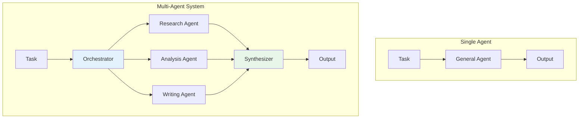
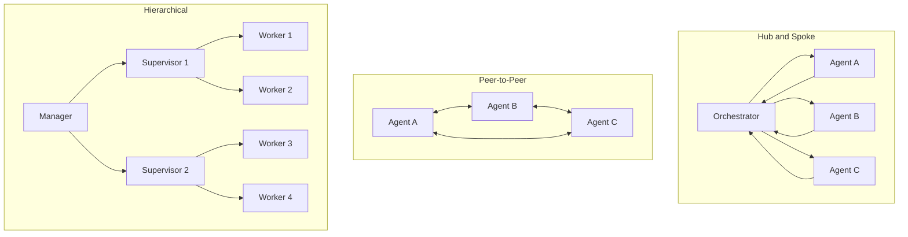
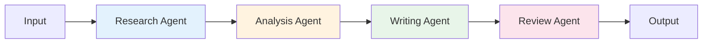
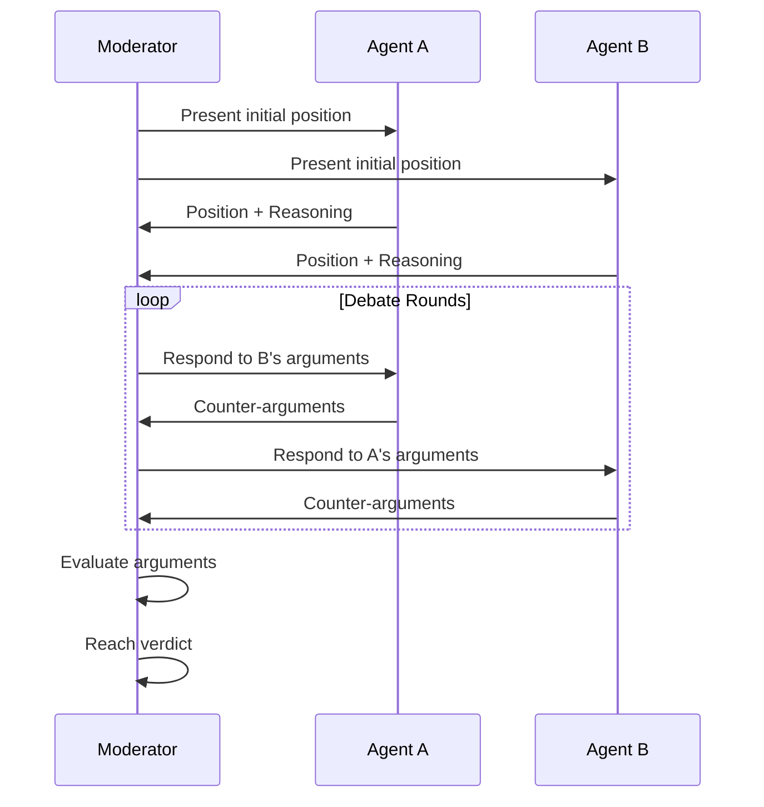
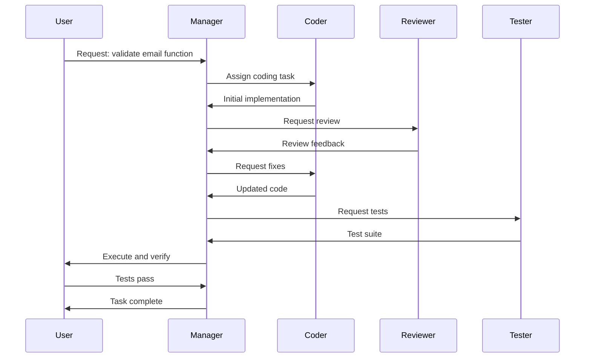

# Multi-Agent Systems

> **Coordinating multiple AI agents for complex problem-solving**

---

## Learning Objectives

By the end of this module, you will be able to:

- **Design** communication topologies for multi-agent systems (hub-spoke, peer-to-peer, hierarchical)
- **Implement** orchestration patterns for coordinating agent workflows
- **Build** debate and consensus mechanisms for improved reasoning
- **Use** AutoGen and similar frameworks for multi-agent applications
- **Evaluate** trade-offs between single-agent and multi-agent approaches

---

## Why Multi-Agent Systems?

::: info Core Insight
Multi-agent systems distribute complex tasks across specialized agents, enabling division of labor, diverse perspectives, and emergent collaborative behaviors that exceed single-agent capabilities.
:::

### Single Agent vs Multi-Agent



| Aspect | Single Agent | Multi-Agent |
|--------|-------------|-------------|
| **Complexity handling** | Limited by one context | Distributed across specialists |
| **Expertise depth** | Generalist | Deep specialists |
| **Fault tolerance** | Single point of failure | Graceful degradation |
| **Latency** | Lower | Higher (coordination overhead) |
| **Cost** | Lower | Higher (multiple LLM calls) |
| **Interpretability** | Single reasoning trace | Clear division of responsibilities |

---

## Communication Topologies

### Topology Patterns



### Topology Comparison

| Topology | Best For | Pros | Cons |
|----------|----------|------|------|
| **Hub-Spoke** | Centralized control | Simple coordination, clear authority | Bottleneck at hub |
| **Peer-to-Peer** | Collaborative refinement | No single point of failure | Complex coordination |
| **Hierarchical** | Large-scale systems | Scalable, clear responsibility | Deep hierarchies slow |
| **Broadcast** | Information dissemination | Fast propagation | High message volume |
| **Pipeline** | Sequential processing | Clear flow, easy debugging | Rigid structure |

---

## Orchestration Patterns

### Pattern 1: Sequential Pipeline



```python
from openai import OpenAI
from dataclasses import dataclass
from typing import Optional

@dataclass
class AgentOutput:
    content: str
    metadata: dict

class PipelineOrchestrator:
    """
    Sequential pipeline where each agent processes output from the previous.
    """

    def __init__(self, model: str = "gpt-4"):
        self.client = OpenAI()
        self.model = model
        self.pipeline: list[dict] = []

    def add_stage(self, name: str, system_prompt: str, output_key: str):
        """Add a stage to the pipeline."""
        self.pipeline.append({
            "name": name,
            "system_prompt": system_prompt,
            "output_key": output_key
        })

    def run(self, initial_input: str) -> dict:
        """Execute the pipeline."""
        context = {"input": initial_input}
        results = []

        for stage in self.pipeline:
            # Build prompt with accumulated context
            context_str = "\n".join([
                f"{k}: {v}" for k, v in context.items()
            ])

            messages = [
                {"role": "system", "content": stage["system_prompt"]},
                {"role": "user", "content": f"Context:\n{context_str}"}
            ]

            response = self.client.chat.completions.create(
                model=self.model,
                messages=messages,
                temperature=0.7
            )

            output = response.choices[0].message.content
            context[stage["output_key"]] = output

            results.append({
                "stage": stage["name"],
                "output": output
            })

        return {
            "stages": results,
            "final_output": results[-1]["output"]
        }


# Usage
orchestrator = PipelineOrchestrator()

orchestrator.add_stage(
    name="researcher",
    system_prompt="You are a research agent. Gather relevant facts and information about the topic.",
    output_key="research"
)

orchestrator.add_stage(
    name="analyst",
    system_prompt="You are an analysis agent. Analyze the research and identify key insights and patterns.",
    output_key="analysis"
)

orchestrator.add_stage(
    name="writer",
    system_prompt="You are a writing agent. Create a clear, well-structured report based on the analysis.",
    output_key="report"
)

result = orchestrator.run("Impact of AI on software development jobs")
```

### Pattern 2: Parallel Fan-Out/Fan-In

```python
import asyncio
from concurrent.futures import ThreadPoolExecutor

class ParallelOrchestrator:
    """
    Fan-out to multiple agents, then fan-in to synthesize results.
    """

    def __init__(self, model: str = "gpt-4"):
        self.client = OpenAI()
        self.model = model
        self.agents: list[dict] = []

    def add_agent(self, name: str, system_prompt: str, focus: str):
        """Add a parallel agent."""
        self.agents.append({
            "name": name,
            "system_prompt": system_prompt,
            "focus": focus
        })

    def _run_agent(self, agent: dict, task: str) -> dict:
        """Run a single agent."""
        messages = [
            {"role": "system", "content": agent["system_prompt"]},
            {"role": "user", "content": f"Task: {task}\nFocus: {agent['focus']}"}
        ]

        response = self.client.chat.completions.create(
            model=self.model,
            messages=messages,
            temperature=0.7
        )

        return {
            "agent": agent["name"],
            "focus": agent["focus"],
            "output": response.choices[0].message.content
        }

    def _synthesize(self, task: str, results: list[dict]) -> str:
        """Synthesize all agent outputs."""
        results_summary = "\n\n".join([
            f"=== {r['agent']} ({r['focus']}) ===\n{r['output']}"
            for r in results
        ])

        messages = [
            {
                "role": "system",
                "content": "You are a synthesis agent. Combine multiple perspectives into a comprehensive response."
            },
            {
                "role": "user",
                "content": f"Original task: {task}\n\nAgent outputs:\n{results_summary}\n\nSynthesize into a unified response."
            }
        ]

        response = self.client.chat.completions.create(
            model=self.model,
            messages=messages,
            temperature=0.5
        )

        return response.choices[0].message.content

    def run(self, task: str) -> dict:
        """Execute parallel agents and synthesize."""
        # Fan-out: Run agents in parallel
        with ThreadPoolExecutor(max_workers=len(self.agents)) as executor:
            futures = [
                executor.submit(self._run_agent, agent, task)
                for agent in self.agents
            ]
            results = [f.result() for f in futures]

        # Fan-in: Synthesize results
        synthesis = self._synthesize(task, results)

        return {
            "individual_results": results,
            "synthesis": synthesis
        }


# Usage: Multi-perspective analysis
orchestrator = ParallelOrchestrator()

orchestrator.add_agent(
    name="optimist",
    system_prompt="You analyze topics from an optimistic perspective, focusing on opportunities and benefits.",
    focus="Positive aspects and opportunities"
)

orchestrator.add_agent(
    name="skeptic",
    system_prompt="You analyze topics critically, identifying risks, challenges, and potential issues.",
    focus="Risks and challenges"
)

orchestrator.add_agent(
    name="pragmatist",
    system_prompt="You analyze topics practically, focusing on implementation and real-world considerations.",
    focus="Practical implementation"
)

result = orchestrator.run("Should our company adopt AI coding assistants?")
```

---

## Debate and Consensus Mechanisms

::: info Research Finding
Agent debate can improve reasoning accuracy by 10-20% on complex tasks by forcing explicit justification and error correction.
:::

### Debate Pattern



### Debate Implementation

```python
from dataclasses import dataclass
from enum import Enum

class Position(Enum):
    FOR = "for"
    AGAINST = "against"

@dataclass
class DebateArgument:
    agent: str
    position: Position
    argument: str
    round: int

class DebateSystem:
    """
    Multi-agent debate for improved reasoning and decision-making.
    """

    def __init__(self, model: str = "gpt-4"):
        self.client = OpenAI()
        self.model = model
        self.debate_rounds = 3

    def _get_initial_position(self, topic: str, position: Position) -> str:
        """Get initial argument for a position."""
        prompt = f"""You are debating the topic: "{topic}"
Your position: {position.value.upper()}

Provide your initial argument with:
1. Clear thesis statement
2. 3-4 supporting points with evidence
3. Anticipate counterarguments

Be persuasive but honest."""

        response = self.client.chat.completions.create(
            model=self.model,
            messages=[{"role": "user", "content": prompt}],
            temperature=0.7
        )

        return response.choices[0].message.content

    def _get_rebuttal(
        self,
        topic: str,
        position: Position,
        opponent_argument: str,
        previous_arguments: list[DebateArgument]
    ) -> str:
        """Generate a rebuttal to opponent's argument."""
        history = "\n\n".join([
            f"Round {a.round} - {a.agent} ({a.position.value}):\n{a.argument}"
            for a in previous_arguments
        ])

        prompt = f"""Topic: "{topic}"
Your position: {position.value.upper()}

Debate history:
{history}

Opponent's latest argument:
{opponent_argument}

Provide a rebuttal that:
1. Directly addresses opponent's strongest points
2. Identifies logical flaws or missing evidence
3. Reinforces your position with new arguments
4. Acknowledges valid points while maintaining your position"""

        response = self.client.chat.completions.create(
            model=self.model,
            messages=[{"role": "user", "content": prompt}],
            temperature=0.7
        )

        return response.choices[0].message.content

    def _judge_debate(self, topic: str, arguments: list[DebateArgument]) -> dict:
        """Judge the debate and determine winner."""
        debate_transcript = "\n\n".join([
            f"Round {a.round} - {a.agent} ({a.position.value}):\n{a.argument}"
            for a in arguments
        ])

        prompt = f"""You are an impartial judge evaluating a debate.

Topic: "{topic}"

Debate transcript:
{debate_transcript}

Evaluate based on:
1. Strength of arguments and evidence
2. Logical consistency
3. Effective rebuttals
4. Acknowledgment of nuance

Provide:
1. Score for each side (1-10)
2. Key strengths of each side
3. Key weaknesses of each side
4. Overall verdict with reasoning
5. Synthesized conclusion that incorporates the best arguments

Output as JSON."""

        response = self.client.chat.completions.create(
            model=self.model,
            messages=[{"role": "user", "content": prompt}],
            temperature=0.3
        )

        return json.loads(response.choices[0].message.content)

    def debate(self, topic: str) -> dict:
        """Run a full debate on a topic."""
        arguments = []

        # Initial positions
        for_arg = self._get_initial_position(topic, Position.FOR)
        arguments.append(DebateArgument("Agent A", Position.FOR, for_arg, 0))

        against_arg = self._get_initial_position(topic, Position.AGAINST)
        arguments.append(DebateArgument("Agent B", Position.AGAINST, against_arg, 0))

        # Debate rounds
        for round_num in range(1, self.debate_rounds + 1):
            # Agent A rebuts Agent B
            rebuttal_a = self._get_rebuttal(
                topic, Position.FOR,
                arguments[-1].argument,
                arguments
            )
            arguments.append(DebateArgument("Agent A", Position.FOR, rebuttal_a, round_num))

            # Agent B rebuts Agent A
            rebuttal_b = self._get_rebuttal(
                topic, Position.AGAINST,
                arguments[-1].argument,
                arguments
            )
            arguments.append(DebateArgument("Agent B", Position.AGAINST, rebuttal_b, round_num))

        # Judge the debate
        verdict = self._judge_debate(topic, arguments)

        return {
            "topic": topic,
            "arguments": [
                {"agent": a.agent, "position": a.position.value, "round": a.round, "argument": a.argument}
                for a in arguments
            ],
            "verdict": verdict
        }


# Usage
debate_system = DebateSystem()
result = debate_system.debate("Remote work is better than office work for software developers")
```

---

## AutoGen Implementation

::: info Framework
AutoGen by Microsoft enables building multi-agent applications with conversation-based coordination and human-in-the-loop capabilities.
:::

```python
from autogen import AssistantAgent, UserProxyAgent, GroupChat, GroupChatManager

# Define agents with specific roles
coder = AssistantAgent(
    name="Coder",
    system_message="""You are an expert Python programmer.
    Write clean, efficient, well-documented code.
    Always include error handling and type hints.""",
    llm_config={"model": "gpt-4"}
)

reviewer = AssistantAgent(
    name="Reviewer",
    system_message="""You are a code reviewer.
    Review code for:
    - Bugs and edge cases
    - Performance issues
    - Security vulnerabilities
    - Code style and best practices
    Provide specific, actionable feedback.""",
    llm_config={"model": "gpt-4"}
)

tester = AssistantAgent(
    name="Tester",
    system_message="""You are a QA engineer.
    Write comprehensive test cases including:
    - Unit tests
    - Edge cases
    - Error conditions
    Use pytest and include docstrings.""",
    llm_config={"model": "gpt-4"}
)

# User proxy for human interaction and code execution
user_proxy = UserProxyAgent(
    name="User",
    human_input_mode="TERMINATE",  # or "ALWAYS" for human-in-the-loop
    code_execution_config={
        "work_dir": "workspace",
        "use_docker": False
    }
)

# Create group chat
group_chat = GroupChat(
    agents=[user_proxy, coder, reviewer, tester],
    messages=[],
    max_round=10
)

manager = GroupChatManager(
    groupchat=group_chat,
    llm_config={"model": "gpt-4"}
)

# Start conversation
user_proxy.initiate_chat(
    manager,
    message="Create a Python function to validate email addresses with comprehensive tests."
)
```

### AutoGen Conversation Flow



---

## Advanced: Custom Multi-Agent Framework

```python
from abc import ABC, abstractmethod
from typing import Optional
from dataclasses import dataclass, field
from queue import Queue
import uuid

@dataclass
class Message:
    """Message passed between agents."""
    id: str = field(default_factory=lambda: str(uuid.uuid4()))
    sender: str = ""
    recipient: str = ""  # Empty for broadcast
    content: str = ""
    message_type: str = "default"
    metadata: dict = field(default_factory=dict)

class BaseAgent(ABC):
    """Base class for all agents in the system."""

    def __init__(self, name: str, model: str = "gpt-4"):
        self.name = name
        self.model = model
        self.client = OpenAI()
        self.inbox: Queue[Message] = Queue()
        self.memory: list[Message] = []

    @property
    @abstractmethod
    def system_prompt(self) -> str:
        """Define the agent's role and behavior."""
        pass

    def receive(self, message: Message):
        """Receive a message."""
        self.inbox.put(message)
        self.memory.append(message)

    def send(self, recipient: str, content: str, message_type: str = "default") -> Message:
        """Create a message to send."""
        return Message(
            sender=self.name,
            recipient=recipient,
            content=content,
            message_type=message_type
        )

    def process_message(self, message: Message) -> Optional[Message]:
        """Process an incoming message and optionally respond."""
        # Build context from memory
        context = "\n".join([
            f"[{m.sender}]: {m.content}"
            for m in self.memory[-10:]  # Last 10 messages
        ])

        prompt = f"""Context of conversation:
{context}

New message from {message.sender}:
{message.content}

Respond appropriately based on your role."""

        response = self.client.chat.completions.create(
            model=self.model,
            messages=[
                {"role": "system", "content": self.system_prompt},
                {"role": "user", "content": prompt}
            ],
            temperature=0.7
        )

        return self.send(
            recipient=message.sender,
            content=response.choices[0].message.content
        )

class Orchestrator:
    """Manages multi-agent communication and task coordination."""

    def __init__(self):
        self.agents: dict[str, BaseAgent] = {}
        self.message_history: list[Message] = []

    def register_agent(self, agent: BaseAgent):
        """Register an agent with the orchestrator."""
        self.agents[agent.name] = agent

    def broadcast(self, message: Message):
        """Send message to all agents."""
        for agent in self.agents.values():
            if agent.name != message.sender:
                agent.receive(message)
        self.message_history.append(message)

    def send_direct(self, message: Message):
        """Send message to specific agent."""
        if message.recipient in self.agents:
            self.agents[message.recipient].receive(message)
            self.message_history.append(message)

    def run_round(self) -> list[Message]:
        """Process one round of messages across all agents."""
        responses = []

        for agent in self.agents.values():
            while not agent.inbox.empty():
                message = agent.inbox.get()
                response = agent.process_message(message)
                if response:
                    responses.append(response)

        # Distribute responses
        for response in responses:
            if response.recipient:
                self.send_direct(response)
            else:
                self.broadcast(response)

        return responses

    def run_task(self, task: str, max_rounds: int = 10) -> dict:
        """Run a complete task with multiple rounds."""
        # Initialize with task
        initial_message = Message(
            sender="system",
            content=task,
            message_type="task"
        )
        self.broadcast(initial_message)

        all_responses = []
        for round_num in range(max_rounds):
            responses = self.run_round()
            all_responses.extend(responses)

            # Check for completion (could be more sophisticated)
            if not responses:
                break

        return {
            "task": task,
            "rounds": round_num + 1,
            "messages": [
                {"sender": m.sender, "recipient": m.recipient, "content": m.content}
                for m in self.message_history
            ]
        }
```

---

## Interview Q&A

### Q1: When should you use multi-agent systems instead of a single powerful agent?

**Strong Answer:**

"Multi-agent systems are preferable in these scenarios:

**1. Specialized Expertise Needed**
- Task requires deep knowledge in multiple domains
- Example: Legal document analysis needs a legal expert, a financial analyst, and a writing specialist

**2. Quality Through Diverse Perspectives**
- Debate/critique improves output quality
- Reduces hallucination through cross-verification
- Example: One agent generates, another critiques

**3. Long-Running Complex Tasks**
- Exceeds single context window
- Requires maintaining different types of state
- Example: Multi-day research project

**4. Parallelizable Subtasks**
- Independent components can run concurrently
- Reduces total latency
- Example: Analyzing multiple documents simultaneously

**5. Human-in-the-Loop Requirements**
- Different agents for different approval levels
- Clear handoff points

**When to stick with single agent:**
- Simple, well-defined tasks
- Latency-critical applications
- Cost-sensitive deployments
- When coordination overhead exceeds benefits"

---

### Q2: How do you handle disagreements between agents in a consensus system?

**Strong Answer:**

"I use a structured approach to resolve agent disagreements:

**1. Identify Disagreement Type**
```python
disagreement_types = {
    'factual': 'Agents disagree on facts',
    'interpretive': 'Same facts, different conclusions',
    'priority': 'Different weighting of concerns',
    'methodological': 'Different approaches to solution'
}
```

**2. Resolution Strategies**

For **factual disagreements**:
- Use verification agent with tool access
- Query external sources
- Escalate to human if critical

For **interpretive disagreements**:
- Run structured debate with explicit reasoning
- Use voting with weighted expertise
- Synthesize perspectives rather than choosing one

For **priority disagreements**:
- Defer to domain expert agent
- Apply predefined priority rules
- Present trade-offs to user

**3. Implementation Pattern**
```python
def resolve_disagreement(positions, disagreement_type):
    if disagreement_type == 'factual':
        return verify_with_tools(positions)
    elif disagreement_type == 'interpretive':
        return run_debate_and_synthesize(positions)
    elif disagreement_type == 'priority':
        return apply_priority_rules(positions)
    else:
        return human_escalation(positions)
```

**4. Consensus Metrics**
- Track agreement levels over rounds
- Set thresholds for acceptable consensus
- Log unresolved disagreements for analysis"

---

### Q3: What are the main challenges in scaling multi-agent systems?

**Strong Answer:**

"Scaling multi-agent systems faces several key challenges:

**1. Communication Overhead**
- O(n^2) messages in fully connected topology
- Solutions: Hierarchical structure, topic-based routing, message batching

**2. Coordination Complexity**
- Deadlocks and livelocks
- Race conditions in shared state
- Solutions: Clear ownership, timeout mechanisms, eventual consistency

**3. Cost Management**
- Each agent = LLM calls
- 10 agents x 5 rounds = 50+ API calls per task
- Solutions: Caching, smaller models for simple agents, lazy evaluation

**4. Latency Accumulation**
- Sequential dependencies add latency
- Solutions: Parallelize where possible, streaming, async processing

**5. Context Management**
- Summarizing vs full history trade-off
- Memory synchronization across agents
- Solutions: Shared memory store, hierarchical summarization

**6. Debugging and Observability**
```python
class MonitoredOrchestrator:
    def log_message(self, message):
        self.trace.append({
            'timestamp': time.time(),
            'sender': message.sender,
            'recipient': message.recipient,
            'content_hash': hash(message.content),
            'message_type': message.message_type
        })
```

**7. Emergence vs Control**
- Agent behaviors can be unpredictable when combined
- Solutions: Guardrails, output validation, sandbox testing"

---

## Summary

| Pattern | Use Case | Complexity | Coordination |
|---------|----------|------------|--------------|
| **Pipeline** | Sequential processing | Low | Simple |
| **Fan-out/Fan-in** | Parallel perspectives | Medium | Aggregation |
| **Debate** | Quality improvement | Medium | Structured |
| **Hierarchical** | Large-scale systems | High | Manager-based |
| **AutoGen** | Flexible conversations | Medium | Framework-managed |

---

## Sources

- Wu et al., "AutoGen: Enabling Next-Gen LLM Applications via Multi-Agent Conversation" (2023)
- Du et al., "Improving Factuality and Reasoning in Language Models through Multiagent Debate" (2023)
- Park et al., "Generative Agents: Interactive Simulacra of Human Behavior" (2023)
- Hong et al., "MetaGPT: Meta Programming for Multi-Agent Collaborative Framework" (2023)
- Liang et al., "Encouraging Divergent Thinking in Large Language Models through Multi-Agent Debate" (2023)
