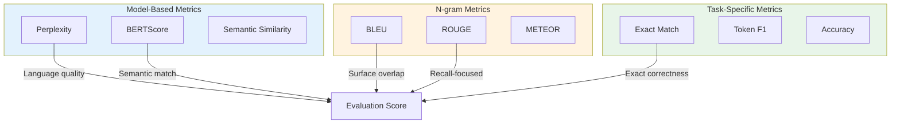
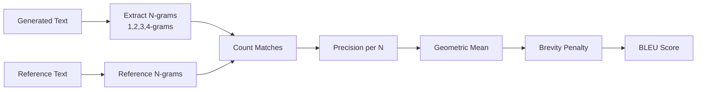
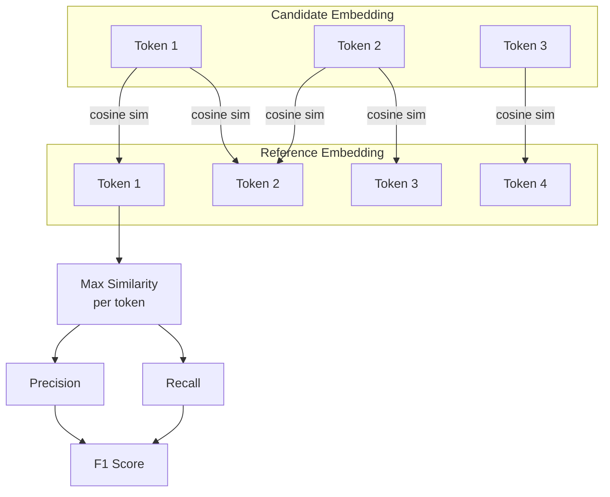
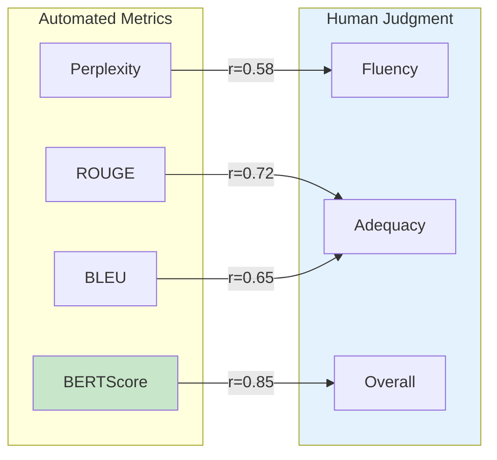

# Automated Metrics

> **Quantitative measurement for fast iteration**

---

## Learning Objectives

- **Understand perplexity** and its role in language model evaluation
- **Apply n-gram metrics** (BLEU, ROUGE) appropriately for generation tasks
- **Use embedding-based metrics** (BERTScore, semantic similarity) for semantic evaluation
- **Recognize limitations** of automated metrics and when they fail
- **Combine metrics** into evaluation suites for comprehensive assessment

---

## Overview

Automated metrics are the backbone of rapid model iteration. They're fast, reproducible, and can run in CI/CD pipelines. However, they're proxies for human judgment and can miss important quality dimensions. Knowing their strengths and limitations is essential for interviews.



---

## Perplexity

Perplexity measures how "surprised" a language model is by a text. Lower perplexity means the model assigns higher probability to the actual text.

### Mathematical Definition

$$\text{Perplexity} = \exp\left(-\frac{1}{N}\sum_{i=1}^{N}\log P(w_i|w_{<i})\right)$$

Where:
- $N$ = number of tokens
- $P(w_i|w_{<i})$ = probability of token $i$ given previous tokens

### Implementation

```python
import numpy as np
from transformers import AutoModelForCausalLM, AutoTokenizer
import torch

def compute_perplexity(
    model_name: str,
    texts: list[str],
    device: str = "cuda"
) -> dict:
    """
    Compute perplexity for a list of texts.

    Args:
        model_name: HuggingFace model identifier
        texts: List of texts to evaluate
        device: Device to run model on

    Returns:
        Dictionary with per-text and average perplexity
    """
    model = AutoModelForCausalLM.from_pretrained(model_name).to(device)
    tokenizer = AutoTokenizer.from_pretrained(model_name)
    model.eval()

    perplexities = []

    for text in texts:
        inputs = tokenizer(text, return_tensors="pt").to(device)

        with torch.no_grad():
            outputs = model(**inputs, labels=inputs["input_ids"])
            loss = outputs.loss  # Cross-entropy loss

        perplexity = torch.exp(loss).item()
        perplexities.append(perplexity)

    return {
        "per_text": perplexities,
        "mean": np.mean(perplexities),
        "std": np.std(perplexities),
        "median": np.median(perplexities)
    }


# Example usage
results = compute_perplexity(
    model_name="gpt2",
    texts=[
        "The quick brown fox jumps over the lazy dog.",
        "Colorless green ideas sleep furiously.",  # Grammatical but nonsensical
        "Dog lazy the over jumps fox brown quick the."  # Ungrammatical
    ]
)
# Expected: First sentence has lowest perplexity, third has highest
```

::: warning Perplexity Limitations
- **Domain sensitivity**: A model trained on code will have high perplexity on poetry
- **Not task-specific**: Low perplexity doesn't guarantee good task performance
- **Length bias**: Shorter texts can have misleadingly low perplexity
- **Vocabulary mismatch**: Out-of-vocabulary tokens inflate perplexity
:::

---

## N-gram Metrics

N-gram metrics compare generated text to reference text based on overlapping word sequences.

### BLEU (Bilingual Evaluation Understudy)

Originally designed for machine translation. Measures precision of n-grams in generated text against references.



```python
from collections import Counter
import numpy as np

def compute_bleu(
    candidate: str,
    references: list[str],
    max_n: int = 4,
    weights: list[float] = None
) -> dict:
    """
    Compute BLEU score.

    Args:
        candidate: Generated text
        references: List of reference texts
        max_n: Maximum n-gram size
        weights: Weights for each n-gram (default: uniform)

    Returns:
        BLEU score and component scores
    """
    if weights is None:
        weights = [1.0 / max_n] * max_n

    candidate_tokens = candidate.lower().split()

    # Calculate precision for each n-gram size
    precisions = []

    for n in range(1, max_n + 1):
        candidate_ngrams = _get_ngrams(candidate_tokens, n)
        candidate_counts = Counter(candidate_ngrams)

        # Max count from any reference
        max_ref_counts = Counter()
        for ref in references:
            ref_tokens = ref.lower().split()
            ref_ngrams = _get_ngrams(ref_tokens, n)
            ref_counts = Counter(ref_ngrams)

            for ngram, count in ref_counts.items():
                max_ref_counts[ngram] = max(max_ref_counts[ngram], count)

        # Clipped counts
        clipped_counts = {
            ngram: min(count, max_ref_counts[ngram])
            for ngram, count in candidate_counts.items()
        }

        precision = (
            sum(clipped_counts.values()) / max(sum(candidate_counts.values()), 1)
        )
        precisions.append(precision)

    # Geometric mean of precisions
    if min(precisions) > 0:
        log_precision = sum(w * np.log(p) for w, p in zip(weights, precisions))
        geo_mean = np.exp(log_precision)
    else:
        geo_mean = 0

    # Brevity penalty
    candidate_len = len(candidate_tokens)
    ref_lens = [len(ref.lower().split()) for ref in references]
    closest_ref_len = min(ref_lens, key=lambda r: abs(r - candidate_len))

    if candidate_len > closest_ref_len:
        brevity_penalty = 1.0
    else:
        brevity_penalty = np.exp(1 - closest_ref_len / max(candidate_len, 1))

    bleu = brevity_penalty * geo_mean

    return {
        "bleu": bleu,
        "precisions": precisions,
        "brevity_penalty": brevity_penalty,
    }


def _get_ngrams(tokens: list[str], n: int) -> list[tuple]:
    """Extract n-grams from token list."""
    return [tuple(tokens[i:i+n]) for i in range(len(tokens) - n + 1)]


# Example
candidate = "The cat sat on the mat"
references = ["The cat is on the mat", "There is a cat on the mat"]

result = compute_bleu(candidate, references)
print(f"BLEU: {result['bleu']:.4f}")
```

### ROUGE (Recall-Oriented Understudy for Gisting Evaluation)

Designed for summarization. Focuses on **recall** - how much of the reference is captured.

| Variant | What It Measures |
|---------|------------------|
| ROUGE-N | N-gram recall |
| ROUGE-L | Longest common subsequence |
| ROUGE-W | Weighted longest common subsequence |
| ROUGE-S | Skip-bigram co-occurrence |

```python
from rouge_score import rouge_scorer

def compute_rouge(
    candidates: list[str],
    references: list[str],
    rouge_types: list[str] = ["rouge1", "rouge2", "rougeL"]
) -> dict:
    """
    Compute ROUGE scores for generated summaries.

    Args:
        candidates: Generated summaries
        references: Reference summaries
        rouge_types: Which ROUGE variants to compute

    Returns:
        Dictionary with precision, recall, F1 for each variant
    """
    scorer = rouge_scorer.RougeScorer(rouge_types, use_stemmer=True)

    results = {rt: {"precision": [], "recall": [], "f1": []}
               for rt in rouge_types}

    for cand, ref in zip(candidates, references):
        scores = scorer.score(ref, cand)

        for rt in rouge_types:
            results[rt]["precision"].append(scores[rt].precision)
            results[rt]["recall"].append(scores[rt].recall)
            results[rt]["f1"].append(scores[rt].fmeasure)

    # Aggregate
    aggregated = {}
    for rt in rouge_types:
        aggregated[rt] = {
            "precision": np.mean(results[rt]["precision"]),
            "recall": np.mean(results[rt]["recall"]),
            "f1": np.mean(results[rt]["f1"])
        }

    return aggregated


# Example: Summarization evaluation
generated = [
    "Scientists discovered a new species of frog in the Amazon.",
    "The economy grew by 3% in Q4."
]
references = [
    "Researchers found a previously unknown frog species in the Amazon rainforest.",
    "Economic growth reached 3 percent in the fourth quarter of the year."
]

rouge_scores = compute_rouge(generated, references)
print(f"ROUGE-1 F1: {rouge_scores['rouge1']['f1']:.4f}")
print(f"ROUGE-2 F1: {rouge_scores['rouge2']['f1']:.4f}")
print(f"ROUGE-L F1: {rouge_scores['rougeL']['f1']:.4f}")
```

::: info BLEU vs ROUGE
- **BLEU** is precision-focused: "How much of what I generated is correct?"
- **ROUGE** is recall-focused: "How much of the reference did I capture?"
- For **translation**, BLEU is standard; for **summarization**, ROUGE is preferred.
:::

---

## BERTScore

BERTScore uses contextual embeddings to measure semantic similarity, overcoming n-gram limitations.



```python
from bert_score import score as bert_score
import torch

def compute_bertscore(
    candidates: list[str],
    references: list[str],
    model_type: str = "microsoft/deberta-xlarge-mnli",
    lang: str = "en"
) -> dict:
    """
    Compute BERTScore for semantic similarity.

    Args:
        candidates: Generated texts
        references: Reference texts
        model_type: Model to use for embeddings
        lang: Language code

    Returns:
        Precision, recall, F1 scores
    """
    P, R, F1 = bert_score(
        candidates,
        references,
        model_type=model_type,
        lang=lang,
        verbose=False
    )

    return {
        "precision": P.mean().item(),
        "recall": R.mean().item(),
        "f1": F1.mean().item(),
        "per_sample": {
            "precision": P.tolist(),
            "recall": R.tolist(),
            "f1": F1.tolist()
        }
    }


# Example: BERTScore captures paraphrases
candidates = [
    "The quick brown fox jumps over the lazy dog.",
    "A fast brown fox leaps over a sleepy dog."  # Paraphrase
]
references = [
    "The quick brown fox jumps over the lazy dog.",
    "The quick brown fox jumps over the lazy dog."  # Same reference
]

scores = compute_bertscore(candidates, references)
# Both should score high - BERTScore recognizes semantic similarity
```

---

## Semantic Similarity

For tasks where you need to compare meaning without exact references, embedding-based similarity is powerful.

```python
from sentence_transformers import SentenceTransformer
import numpy as np
from sklearn.metrics.pairwise import cosine_similarity

class SemanticSimilarityEvaluator:
    """Evaluate semantic similarity using sentence embeddings."""

    def __init__(self, model_name: str = "all-MiniLM-L6-v2"):
        self.model = SentenceTransformer(model_name)

    def compute_similarity(
        self,
        text1: str,
        text2: str
    ) -> float:
        """Compute cosine similarity between two texts."""
        embeddings = self.model.encode([text1, text2])
        similarity = cosine_similarity([embeddings[0]], [embeddings[1]])[0][0]
        return float(similarity)

    def evaluate_batch(
        self,
        candidates: list[str],
        references: list[str]
    ) -> dict:
        """Evaluate similarity for a batch of text pairs."""
        candidate_embs = self.model.encode(candidates)
        reference_embs = self.model.encode(references)

        similarities = []
        for c_emb, r_emb in zip(candidate_embs, reference_embs):
            sim = cosine_similarity([c_emb], [r_emb])[0][0]
            similarities.append(sim)

        return {
            "similarities": similarities,
            "mean": np.mean(similarities),
            "std": np.std(similarities),
            "min": np.min(similarities),
            "max": np.max(similarities)
        }

    def find_most_similar(
        self,
        query: str,
        candidates: list[str],
        top_k: int = 5
    ) -> list[tuple]:
        """Find most similar texts to a query."""
        query_emb = self.model.encode([query])
        candidate_embs = self.model.encode(candidates)

        similarities = cosine_similarity(query_emb, candidate_embs)[0]

        # Sort by similarity
        indexed_sims = list(enumerate(similarities))
        indexed_sims.sort(key=lambda x: x[1], reverse=True)

        return [
            (candidates[idx], sim)
            for idx, sim in indexed_sims[:top_k]
        ]


# Example usage
evaluator = SemanticSimilarityEvaluator()

# Test semantic similarity
pairs = [
    ("The cat sat on the mat.", "A feline rested on the rug."),  # High sim
    ("The cat sat on the mat.", "Stock prices rose sharply."),   # Low sim
]

for text1, text2 in pairs:
    sim = evaluator.compute_similarity(text1, text2)
    print(f"Similarity: {sim:.4f}")
    print(f"  '{text1}'")
    print(f"  '{text2}'")
```

---

## Comprehensive Metric Suite

In practice, combine multiple metrics for robust evaluation.

```python
from dataclasses import dataclass
from typing import Optional
import json

@dataclass
class MetricResult:
    name: str
    score: float
    details: Optional[dict] = None

class MetricSuite:
    """Comprehensive evaluation suite combining multiple metrics."""

    def __init__(self):
        self.metrics = {}

    def add_metric(self, name: str, compute_fn, weight: float = 1.0):
        """Register a metric computation function."""
        self.metrics[name] = {
            "compute": compute_fn,
            "weight": weight
        }

    def evaluate(
        self,
        candidates: list[str],
        references: list[str],
        source_texts: Optional[list[str]] = None
    ) -> dict:
        """Run all metrics and return results."""
        results = {}

        for name, metric_info in self.metrics.items():
            compute_fn = metric_info["compute"]
            weight = metric_info["weight"]

            try:
                if source_texts and "source" in compute_fn.__code__.co_varnames:
                    score = compute_fn(candidates, references, source_texts)
                else:
                    score = compute_fn(candidates, references)

                results[name] = MetricResult(
                    name=name,
                    score=score if isinstance(score, float) else score.get("mean", score.get("f1")),
                    details=score if isinstance(score, dict) else None
                )
            except Exception as e:
                results[name] = MetricResult(
                    name=name,
                    score=0.0,
                    details={"error": str(e)}
                )

        # Compute weighted aggregate
        total_weight = sum(m["weight"] for m in self.metrics.values())
        weighted_sum = sum(
            results[name].score * self.metrics[name]["weight"]
            for name in self.metrics
        )
        results["aggregate"] = MetricResult(
            name="aggregate",
            score=weighted_sum / total_weight
        )

        return results

    def to_report(self, results: dict) -> str:
        """Generate human-readable report."""
        lines = ["=" * 50, "EVALUATION REPORT", "=" * 50, ""]

        for name, result in results.items():
            if name == "aggregate":
                continue
            lines.append(f"{name}: {result.score:.4f}")

        lines.append("")
        lines.append("-" * 50)
        lines.append(f"AGGREGATE SCORE: {results['aggregate'].score:.4f}")
        lines.append("=" * 50)

        return "\n".join(lines)


# Example: Build evaluation suite for summarization
suite = MetricSuite()
suite.add_metric("rouge1_f1", lambda c, r: compute_rouge(c, r)["rouge1"]["f1"], weight=1.0)
suite.add_metric("rouge2_f1", lambda c, r: compute_rouge(c, r)["rouge2"]["f1"], weight=1.5)
suite.add_metric("rougeL_f1", lambda c, r: compute_rouge(c, r)["rougeL"]["f1"], weight=1.0)
suite.add_metric("bertscore", lambda c, r: compute_bertscore(c, r)["f1"], weight=2.0)
```

---

## Metric Correlation Analysis

Understanding how metrics correlate with human judgment is critical.



| Metric | Correlates Well With | Correlates Poorly With |
|--------|---------------------|----------------------|
| BLEU | Fluency, grammaticality | Meaning preservation |
| ROUGE | Content coverage | Fluency, conciseness |
| BERTScore | Semantic similarity | Factual accuracy |
| Perplexity | Language model fit | Task-specific quality |

---

## Interview Q&A

### Q1: "When would you use BLEU vs ROUGE vs BERTScore?"

**Strong Answer:**

"Each metric captures different quality aspects:

**BLEU** for translation and constrained generation:
- Precision-focused: 'How much of my output is correct?'
- Good when outputs should closely match references
- Limitation: Penalizes valid paraphrases

**ROUGE** for summarization and information extraction:
- Recall-focused: 'How much of the reference did I capture?'
- Good for open-ended generation where coverage matters
- Limitation: Doesn't penalize hallucinated content

**BERTScore** for semantic quality:
- Embedding-based: Captures meaning beyond surface forms
- Best correlation with human judgment for overall quality
- Limitation: Computationally expensive, needs GPU

In practice, I use all three in combination. If they disagree significantly, that's a signal to dig deeper with human evaluation."

---

### Q2: "What are the limitations of automated metrics for LLM evaluation?"

**Strong Answer:**

"Automated metrics have several fundamental limitations:

1. **Reference dependency**: Most metrics need gold references, which are expensive to create and may not exist for open-ended tasks.

2. **Surface vs substance**: N-gram metrics miss paraphrases and semantic equivalence. 'The dog bit the man' and 'The man was bitten by the dog' would score poorly against each other.

3. **Factuality blindness**: Metrics like ROUGE can score hallucinated content highly if it shares words with the reference.

4. **Domain mismatch**: Metrics trained on general text may not transfer to specialized domains (legal, medical, code).

5. **Gaming potential**: Models can be optimized to score well on metrics without improving actual quality - a form of Goodhart's Law.

That's why I always treat automated metrics as **screening tools**, not final arbiters. They're great for quick iteration and regression testing, but deployment decisions need human evaluation on critical cases."

---

### Q3: "How would you design an automated evaluation pipeline for a production LLM?"

**Strong Answer:**

"I'd design a layered pipeline:

**Layer 1: Fast checks (every commit)**
- Basic metrics: response length, format compliance
- Safety classifiers: toxicity, PII detection
- Latency and cost tracking

**Layer 2: Quality metrics (nightly)**
- Task-specific metrics: ROUGE for summarization, pass@k for code
- BERTScore for semantic quality
- Regression tests against known-good outputs

**Layer 3: Deep evaluation (weekly)**
- LLM-as-judge on sampled outputs
- Human evaluation on edge cases
- A/B test metric correlation

The key insight is **metric diversity**. No single metric captures all quality dimensions. I'd track correlations between automated metrics and downstream business metrics (user satisfaction, task completion) to ensure our automated pipeline stays aligned with real-world performance."

---

## Summary Table

| Metric | Type | Best For | Limitations | Compute Cost |
|--------|------|----------|-------------|--------------|
| Perplexity | Model-based | Language model comparison | Not task-specific | Low |
| BLEU | N-gram precision | Translation | Misses paraphrases | Low |
| ROUGE | N-gram recall | Summarization | No factuality check | Low |
| BERTScore | Embedding | Semantic similarity | GPU required | Medium |
| Semantic Sim | Embedding | Open-ended comparison | Domain sensitivity | Medium |
| Exact Match | Task-specific | QA, classification | Too strict | Very Low |

---

## Sources

- Papineni et al., "BLEU: a Method for Automatic Evaluation of Machine Translation", ACL 2002
- Lin, "ROUGE: A Package for Automatic Evaluation of Summaries", 2004
- Zhang et al., "BERTScore: Evaluating Text Generation with BERT", ICLR 2020
- Sellam et al., "BLEURT: Learning Robust Metrics for Text Generation", ACL 2020
