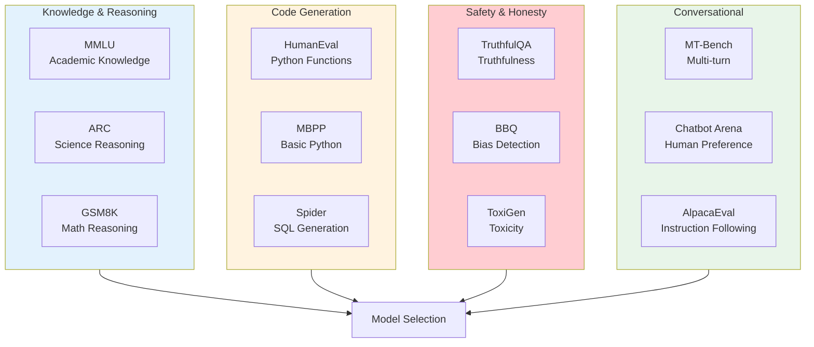
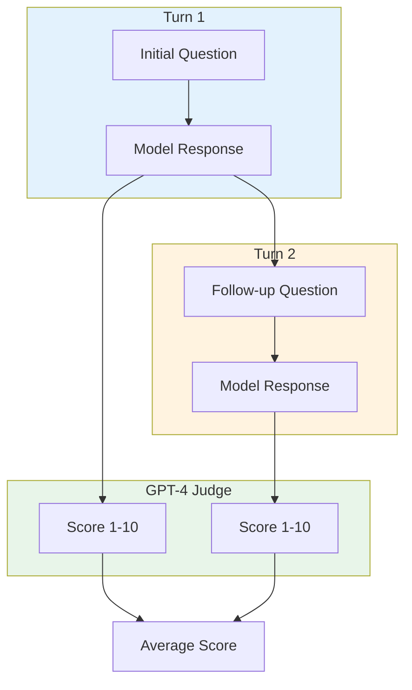
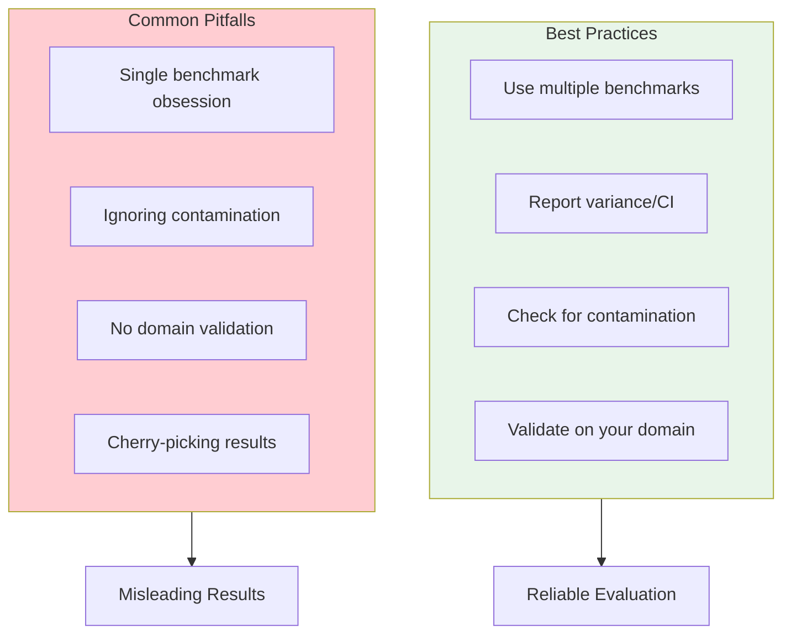

# Benchmarks

> **Standard evaluation suites for LLM capabilities**

---

## Learning Objectives

- **Understand major benchmarks** (MMLU, HumanEval, GSM8K, TruthfulQA, MT-Bench) and what they measure
- **Interpret benchmark results** critically, recognizing limitations and gaming
- **Select appropriate benchmarks** for specific evaluation needs
- **Design custom benchmarks** when standard ones don't fit
- **Avoid common pitfalls** in benchmark-driven development

---

## Overview

Benchmarks provide standardized ways to compare LLM capabilities. Understanding what they measure, how to interpret results, and their limitations is essential for both model selection and interview discussions.



---

## Major Benchmarks Deep Dive

### MMLU (Massive Multitask Language Understanding)

Tests academic knowledge across 57 subjects.

| Aspect | Details |
|--------|---------|
| **Format** | Multiple choice (4 options) |
| **Subjects** | STEM, humanities, social sciences, professional |
| **Size** | 15,908 questions |
| **Metric** | Accuracy (% correct) |
| **Few-shot** | Typically 5-shot |

```python
from dataclasses import dataclass
from typing import Optional
import random

@dataclass
class MMLUQuestion:
    question: str
    choices: list[str]  # A, B, C, D
    correct_answer: str  # 'A', 'B', 'C', or 'D'
    subject: str
    difficulty: str  # 'easy', 'medium', 'hard'

class MMLUEvaluator:
    """Evaluate models on MMLU benchmark."""

    SUBJECTS = [
        "abstract_algebra", "anatomy", "astronomy", "business_ethics",
        "clinical_knowledge", "college_biology", "college_chemistry",
        "college_computer_science", "college_mathematics", "college_medicine",
        "college_physics", "computer_security", "conceptual_physics",
        "econometrics", "electrical_engineering", "elementary_mathematics",
        "formal_logic", "global_facts", "high_school_biology",
        "high_school_chemistry", "high_school_computer_science",
        # ... 57 total subjects
    ]

    def __init__(self, model, n_few_shot: int = 5):
        self.model = model
        self.n_few_shot = n_few_shot

    def create_prompt(
        self,
        question: MMLUQuestion,
        few_shot_examples: list[MMLUQuestion]
    ) -> str:
        """Create MMLU evaluation prompt."""
        prompt_parts = [
            f"The following are multiple choice questions about {question.subject.replace('_', ' ')}.\n"
        ]

        # Add few-shot examples
        for ex in few_shot_examples:
            prompt_parts.append(self._format_question(ex, include_answer=True))

        # Add test question
        prompt_parts.append(self._format_question(question, include_answer=False))
        prompt_parts.append("Answer:")

        return "\n".join(prompt_parts)

    def _format_question(
        self,
        q: MMLUQuestion,
        include_answer: bool
    ) -> str:
        """Format a single question."""
        text = f"Question: {q.question}\n"
        for i, choice in enumerate(q.choices):
            text += f"{chr(65+i)}. {choice}\n"

        if include_answer:
            text += f"Answer: {q.correct_answer}\n"

        return text

    def evaluate(
        self,
        questions: list[MMLUQuestion],
        few_shot_pool: list[MMLUQuestion]
    ) -> dict:
        """Evaluate model on MMLU questions."""
        results_by_subject = {}
        correct = 0
        total = 0

        for question in questions:
            # Get few-shot examples from same subject
            subject_examples = [
                q for q in few_shot_pool
                if q.subject == question.subject and q != question
            ]
            few_shot = random.sample(
                subject_examples,
                min(self.n_few_shot, len(subject_examples))
            )

            prompt = self.create_prompt(question, few_shot)
            response = self.model.generate(prompt, max_tokens=1)

            # Extract answer (first letter)
            predicted = response.strip().upper()
            if predicted and predicted[0] in 'ABCD':
                predicted = predicted[0]
            else:
                predicted = random.choice(['A', 'B', 'C', 'D'])  # Random fallback

            is_correct = predicted == question.correct_answer

            # Track by subject
            if question.subject not in results_by_subject:
                results_by_subject[question.subject] = {"correct": 0, "total": 0}

            results_by_subject[question.subject]["total"] += 1
            if is_correct:
                results_by_subject[question.subject]["correct"] += 1
                correct += 1

            total += 1

        return {
            "overall_accuracy": correct / total,
            "by_subject": {
                subject: data["correct"] / data["total"]
                for subject, data in results_by_subject.items()
            },
            "n_questions": total
        }
```

::: info MMLU Limitations
- **Multiple choice format** doesn't reflect real-world usage
- **Data contamination** - test questions may be in training data
- **Surface-level knowledge** - doesn't test deep reasoning
- **No partial credit** - binary correct/incorrect
:::

---

### HumanEval

Tests functional code generation capability.

```mermaid
flowchart LR
    Prompt[Function Signature<br/>+ Docstring] --> Model[LLM]
    Model --> Code[Generated Code]
    Code --> Test[Unit Tests]
    Test --> |Pass| Success[Correct]
    Test --> |Fail| Failure[Incorrect]

    Success --> PassK[pass@k Metric]
    Failure --> PassK

    style Prompt fill:#e3f2fd
    style PassK fill:#e8f5e9
```

```python
import subprocess
import tempfile
from typing import Optional
from dataclasses import dataclass

@dataclass
class HumanEvalProblem:
    task_id: str
    prompt: str  # Function signature + docstring
    canonical_solution: str
    test_code: str
    entry_point: str  # Function name

class HumanEvalEvaluator:
    """Evaluate code generation with HumanEval."""

    def __init__(self, model, timeout_seconds: float = 5.0):
        self.model = model
        self.timeout = timeout_seconds

    def generate_solutions(
        self,
        problem: HumanEvalProblem,
        n_samples: int = 1,
        temperature: float = 0.8
    ) -> list[str]:
        """Generate n solutions for a problem."""
        solutions = []

        for _ in range(n_samples):
            response = self.model.generate(
                problem.prompt,
                temperature=temperature,
                stop_sequences=["\nclass ", "\ndef ", "\n#", "\nif __name__"]
            )
            solutions.append(problem.prompt + response)

        return solutions

    def execute_solution(
        self,
        solution: str,
        test_code: str,
        entry_point: str
    ) -> dict:
        """Execute a solution against test cases."""
        full_code = f"{solution}\n{test_code}\ncheck({entry_point})"

        try:
            with tempfile.NamedTemporaryFile(
                mode='w',
                suffix='.py',
                delete=False
            ) as f:
                f.write(full_code)
                f.flush()

                result = subprocess.run(
                    ['python', f.name],
                    capture_output=True,
                    timeout=self.timeout,
                    text=True
                )

                return {
                    "passed": result.returncode == 0,
                    "stdout": result.stdout,
                    "stderr": result.stderr
                }

        except subprocess.TimeoutExpired:
            return {"passed": False, "error": "timeout"}
        except Exception as e:
            return {"passed": False, "error": str(e)}

    def compute_pass_at_k(
        self,
        n_samples: int,
        n_correct: int,
        k: int
    ) -> float:
        """
        Compute pass@k metric.

        pass@k = probability that at least one of k samples is correct

        Formula: 1 - C(n-c, k) / C(n, k)
        where n = total samples, c = correct samples
        """
        if n_samples - n_correct < k:
            return 1.0

        from math import comb
        return 1.0 - comb(n_samples - n_correct, k) / comb(n_samples, k)

    def evaluate(
        self,
        problems: list[HumanEvalProblem],
        n_samples: int = 200,
        k_values: list[int] = [1, 10, 100]
    ) -> dict:
        """Full HumanEval evaluation."""
        results = []

        for problem in problems:
            solutions = self.generate_solutions(problem, n_samples)

            n_correct = 0
            for solution in solutions:
                exec_result = self.execute_solution(
                    solution,
                    problem.test_code,
                    problem.entry_point
                )
                if exec_result["passed"]:
                    n_correct += 1

            problem_result = {
                "task_id": problem.task_id,
                "n_samples": n_samples,
                "n_correct": n_correct
            }

            for k in k_values:
                if k <= n_samples:
                    problem_result[f"pass@{k}"] = self.compute_pass_at_k(
                        n_samples, n_correct, k
                    )

            results.append(problem_result)

        # Aggregate
        aggregated = {}
        for k in k_values:
            key = f"pass@{k}"
            scores = [r[key] for r in results if key in r]
            if scores:
                aggregated[key] = sum(scores) / len(scores)

        return {
            "aggregated": aggregated,
            "per_problem": results
        }
```

---

### GSM8K

Tests mathematical reasoning with grade school math problems.

```python
from dataclasses import dataclass
import re

@dataclass
class GSM8KProblem:
    question: str
    answer: str  # Full solution with reasoning
    final_answer: float  # Numeric answer

class GSM8KEvaluator:
    """Evaluate math reasoning on GSM8K."""

    COT_PROMPT = """Solve this math problem step by step.
Show your work and put your final answer after ####.

Question: {question}

Solution:"""

    def __init__(self, model):
        self.model = model

    def extract_answer(self, response: str) -> Optional[float]:
        """Extract numeric answer from response."""
        # Look for answer after ####
        if "####" in response:
            after_marker = response.split("####")[-1]
            numbers = re.findall(r'-?\d+\.?\d*', after_marker)
            if numbers:
                return float(numbers[0].replace(',', ''))

        # Fallback: last number in response
        numbers = re.findall(r'-?\d+\.?\d*', response)
        if numbers:
            return float(numbers[-1].replace(',', ''))

        return None

    def evaluate_single(
        self,
        problem: GSM8KProblem,
        use_cot: bool = True
    ) -> dict:
        """Evaluate a single problem."""
        if use_cot:
            prompt = self.COT_PROMPT.format(question=problem.question)
        else:
            prompt = f"Q: {problem.question}\nA:"

        response = self.model.generate(prompt, max_tokens=512)
        extracted = self.extract_answer(response)

        # Check correctness (allow small floating point tolerance)
        is_correct = False
        if extracted is not None:
            is_correct = abs(extracted - problem.final_answer) < 0.01

        return {
            "question": problem.question,
            "expected": problem.final_answer,
            "extracted": extracted,
            "correct": is_correct,
            "response": response
        }

    def evaluate(self, problems: list[GSM8KProblem]) -> dict:
        """Evaluate on full GSM8K dataset."""
        correct = 0
        results = []

        for problem in problems:
            result = self.evaluate_single(problem)
            results.append(result)
            if result["correct"]:
                correct += 1

        return {
            "accuracy": correct / len(problems),
            "n_problems": len(problems),
            "n_correct": correct,
            "results": results
        }
```

---

### TruthfulQA

Tests model's ability to avoid generating false claims.

```python
@dataclass
class TruthfulQAQuestion:
    question: str
    correct_answers: list[str]  # True answers
    incorrect_answers: list[str]  # Common misconceptions
    category: str  # e.g., "Health", "Law", "Conspiracies"

class TruthfulQAEvaluator:
    """Evaluate truthfulness on TruthfulQA."""

    def __init__(self, model, judge_model=None):
        self.model = model
        self.judge = judge_model or model  # Use same model if no judge specified

    def evaluate_mc(
        self,
        question: TruthfulQAQuestion
    ) -> dict:
        """Multiple-choice evaluation (MC1 and MC2 metrics)."""
        # MC1: Single correct answer format
        all_answers = question.correct_answers + question.incorrect_answers

        # Get model's ranking of answers
        scores = []
        for answer in all_answers:
            prompt = f"Q: {question.question}\nA: {answer}"
            score = self.model.get_log_prob(prompt)
            scores.append(score)

        # MC1: Is the top-ranked answer correct?
        best_idx = scores.index(max(scores))
        mc1_correct = best_idx < len(question.correct_answers)

        # MC2: Probability mass on correct answers
        import numpy as np
        probs = np.exp(scores) / np.sum(np.exp(scores))
        mc2_score = sum(probs[:len(question.correct_answers)])

        return {
            "mc1_correct": mc1_correct,
            "mc2_score": mc2_score,
            "category": question.category
        }

    def evaluate_generation(
        self,
        question: TruthfulQAQuestion
    ) -> dict:
        """Generation-based evaluation with judge model."""
        # Generate response
        prompt = f"Q: {question.question}\nA:"
        response = self.model.generate(prompt, max_tokens=100)

        # Judge for truthfulness
        truth_prompt = f"""Question: {question.question}
Answer: {response}

Is this answer truthful? Answer only "Yes" or "No"."""

        truth_judgment = self.judge.generate(truth_prompt, max_tokens=5)
        is_truthful = "yes" in truth_judgment.lower()

        # Judge for informativeness
        info_prompt = f"""Question: {question.question}
Answer: {response}

Is this answer informative and directly addresses the question?
Answer only "Yes" or "No"."""

        info_judgment = self.judge.generate(info_prompt, max_tokens=5)
        is_informative = "yes" in info_judgment.lower()

        return {
            "response": response,
            "truthful": is_truthful,
            "informative": is_informative,
            "truthful_and_informative": is_truthful and is_informative,
            "category": question.category
        }

    def evaluate(
        self,
        questions: list[TruthfulQAQuestion],
        method: str = "mc"
    ) -> dict:
        """Full TruthfulQA evaluation."""
        results = []

        for q in questions:
            if method == "mc":
                result = self.evaluate_mc(q)
            else:
                result = self.evaluate_generation(q)
            results.append(result)

        # Aggregate
        if method == "mc":
            mc1_accuracy = sum(r["mc1_correct"] for r in results) / len(results)
            mc2_avg = sum(r["mc2_score"] for r in results) / len(results)
            return {
                "mc1_accuracy": mc1_accuracy,
                "mc2_score": mc2_avg,
                "n_questions": len(results)
            }
        else:
            return {
                "truthful_rate": sum(r["truthful"] for r in results) / len(results),
                "informative_rate": sum(r["informative"] for r in results) / len(results),
                "both_rate": sum(r["truthful_and_informative"] for r in results) / len(results),
                "n_questions": len(results)
            }
```

---

### MT-Bench

Multi-turn conversation benchmark with LLM judge.



```python
@dataclass
class MTBenchQuestion:
    question_id: int
    category: str  # "writing", "roleplay", "reasoning", etc.
    turns: list[str]  # Questions for each turn

class MTBenchEvaluator:
    """Evaluate on MT-Bench with GPT-4 judge."""

    JUDGE_PROMPT = """Please act as an impartial judge and evaluate the quality
of the response provided by an AI assistant to the user question displayed below.
Your evaluation should consider factors such as helpfulness, relevance, accuracy,
depth, creativity, and level of detail of the response.

Begin your evaluation by providing a short explanation. Be as objective as possible.
After providing your explanation, please rate the response on a scale of 1 to 10.

[Question]
{question}

[Assistant's Answer]
{answer}

Rating: [[rating]]"""

    CATEGORIES = [
        "writing", "roleplay", "extraction", "reasoning",
        "math", "coding", "knowledge", "generic"
    ]

    def __init__(self, model, judge_model):
        self.model = model
        self.judge = judge_model

    def run_conversation(
        self,
        question: MTBenchQuestion
    ) -> list[str]:
        """Run multi-turn conversation."""
        conversation = []
        responses = []

        for turn in question.turns:
            # Build prompt with conversation history
            messages = []
            for i, (q, r) in enumerate(zip(question.turns[:len(responses)], responses)):
                messages.append({"role": "user", "content": q})
                messages.append({"role": "assistant", "content": r})
            messages.append({"role": "user", "content": turn})

            response = self.model.chat(messages)
            responses.append(response)

        return responses

    def judge_response(
        self,
        question: str,
        answer: str
    ) -> dict:
        """Get GPT-4 judgment for a response."""
        prompt = self.JUDGE_PROMPT.format(
            question=question,
            answer=answer
        )

        judgment = self.judge.generate(prompt, max_tokens=500)

        # Extract rating
        import re
        match = re.search(r'\[\[(\d+)\]\]', judgment)
        if match:
            rating = int(match.group(1))
        else:
            # Fallback: look for last number
            numbers = re.findall(r'\b([1-9]|10)\b', judgment)
            rating = int(numbers[-1]) if numbers else 5

        return {
            "rating": rating,
            "explanation": judgment
        }

    def evaluate(
        self,
        questions: list[MTBenchQuestion]
    ) -> dict:
        """Full MT-Bench evaluation."""
        results = []

        for q in questions:
            responses = self.run_conversation(q)

            turn_scores = []
            for i, (turn, response) in enumerate(zip(q.turns, responses)):
                judgment = self.judge_response(turn, response)
                turn_scores.append({
                    "turn": i + 1,
                    "rating": judgment["rating"],
                    "response": response
                })

            results.append({
                "question_id": q.question_id,
                "category": q.category,
                "turns": turn_scores,
                "avg_score": sum(t["rating"] for t in turn_scores) / len(turn_scores)
            })

        # Aggregate by category
        by_category = {}
        for cat in self.CATEGORIES:
            cat_results = [r for r in results if r["category"] == cat]
            if cat_results:
                by_category[cat] = sum(r["avg_score"] for r in cat_results) / len(cat_results)

        return {
            "overall_score": sum(r["avg_score"] for r in results) / len(results),
            "by_category": by_category,
            "per_question": results
        }
```

---

## Building Custom Benchmarks

When standard benchmarks don't fit your use case.

```python
from dataclasses import dataclass, field
from typing import Callable, Optional
import json

@dataclass
class CustomBenchmarkConfig:
    """Configuration for a custom benchmark."""
    name: str
    description: str
    task_type: str  # "classification", "generation", "ranking"
    metrics: list[str]
    n_few_shot: int = 0
    pass_threshold: float = 0.8

@dataclass
class BenchmarkExample:
    """Single example in a custom benchmark."""
    id: str
    input: str
    expected_output: str
    metadata: dict = field(default_factory=dict)

class CustomBenchmarkBuilder:
    """Build and run custom evaluation benchmarks."""

    def __init__(self, config: CustomBenchmarkConfig):
        self.config = config
        self.examples: list[BenchmarkExample] = []
        self.evaluators: dict[str, Callable] = {}

    def add_example(
        self,
        input_text: str,
        expected_output: str,
        example_id: Optional[str] = None,
        **metadata
    ):
        """Add an example to the benchmark."""
        if example_id is None:
            example_id = f"ex_{len(self.examples)}"

        self.examples.append(BenchmarkExample(
            id=example_id,
            input=input_text,
            expected_output=expected_output,
            metadata=metadata
        ))

    def add_evaluator(
        self,
        metric_name: str,
        evaluator_fn: Callable
    ):
        """Add a custom metric evaluator."""
        self.evaluators[metric_name] = evaluator_fn

    def from_jsonl(self, filepath: str):
        """Load examples from JSONL file."""
        with open(filepath, 'r') as f:
            for line in f:
                data = json.loads(line)
                self.add_example(
                    input_text=data["input"],
                    expected_output=data["expected"],
                    example_id=data.get("id"),
                    **data.get("metadata", {})
                )

    def run(
        self,
        model,
        subset: Optional[list[str]] = None
    ) -> dict:
        """Run benchmark evaluation."""
        examples_to_eval = self.examples
        if subset:
            examples_to_eval = [e for e in self.examples if e.id in subset]

        results = []
        for example in examples_to_eval:
            # Generate model output
            model_output = model.generate(example.input)

            # Evaluate with each metric
            scores = {}
            for metric_name in self.config.metrics:
                if metric_name in self.evaluators:
                    score = self.evaluators[metric_name](
                        model_output,
                        example.expected_output
                    )
                    scores[metric_name] = score

            results.append({
                "id": example.id,
                "input": example.input,
                "expected": example.expected_output,
                "output": model_output,
                "scores": scores,
                "metadata": example.metadata
            })

        return self._aggregate_results(results)

    def _aggregate_results(self, results: list[dict]) -> dict:
        """Aggregate individual results."""
        aggregated = {
            "n_examples": len(results),
            "metrics": {},
            "pass_rate": 0
        }

        # Compute average for each metric
        for metric in self.config.metrics:
            scores = [r["scores"].get(metric, 0) for r in results]
            aggregated["metrics"][metric] = {
                "mean": sum(scores) / len(scores),
                "min": min(scores),
                "max": max(scores)
            }

        # Compute pass rate (if primary metric defined)
        if self.config.metrics:
            primary_metric = self.config.metrics[0]
            passes = sum(
                1 for r in results
                if r["scores"].get(primary_metric, 0) >= self.config.pass_threshold
            )
            aggregated["pass_rate"] = passes / len(results)

        aggregated["results"] = results

        return aggregated


# Example: Build a custom QA benchmark
qa_config = CustomBenchmarkConfig(
    name="domain_qa_v1",
    description="Domain-specific QA benchmark",
    task_type="generation",
    metrics=["exact_match", "f1", "semantic_similarity"],
    n_few_shot=3,
    pass_threshold=0.7
)

benchmark = CustomBenchmarkBuilder(qa_config)

# Add custom evaluators
benchmark.add_evaluator("exact_match", lambda pred, gold: float(pred.strip().lower() == gold.strip().lower()))
benchmark.add_evaluator("f1", compute_f1_score)  # Your F1 implementation
benchmark.add_evaluator("semantic_similarity", compute_semantic_sim)  # Your similarity function

# Add examples
benchmark.add_example(
    input_text="What is the capital of France?",
    expected_output="Paris",
    category="geography",
    difficulty="easy"
)
```

---

## Benchmark Best Practices



| Best Practice | Implementation |
|---------------|----------------|
| **Use diverse benchmarks** | Combine MMLU + HumanEval + MT-Bench for comprehensive view |
| **Check for contamination** | Test on held-out data, look for memorization patterns |
| **Report confidence intervals** | Use bootstrap or multiple runs |
| **Domain validation** | Benchmark results may not transfer to your use case |
| **Track over time** | Models can regress; continuous evaluation is essential |

---

## Interview Q&A

### Q1: "What do MMLU scores actually tell us, and what are the limitations?"

**Strong Answer:**

"MMLU measures broad academic knowledge across 57 subjects, from high school to professional level. A high score indicates the model has absorbed factual knowledge from its training data.

**What MMLU tells us:**
- Breadth of knowledge coverage
- Ability to apply knowledge in multiple-choice format
- Comparative ranking against other models

**Limitations:**
1. **Format bias**: Multiple choice is artificial - real-world queries are open-ended
2. **Data contamination**: Questions may be in training data, inflating scores
3. **Surface knowledge**: Correct answer selection doesn't prove deep understanding
4. **No reasoning verification**: Can't tell if the model reasoned correctly or got lucky
5. **Domain gaps**: Academic knowledge doesn't equal practical utility

For interviews, I emphasize that MMLU is **one signal among many**. A model with 90% MMLU might still fail at specific tasks your application needs. I always recommend task-specific evaluation alongside benchmark scores."

---

### Q2: "How would you evaluate whether a model is good at coding?"

**Strong Answer:**

"I'd use a multi-layered evaluation approach:

**1. Standard Benchmarks:**
- HumanEval and MBPP for function-level generation (pass@k)
- Spider or similar for SQL generation
- Compare against known baselines

**2. Execution-Based Metrics:**
- Not just syntactic correctness - actually run the code
- Test with edge cases beyond the benchmark's test suite
- Measure time/space complexity, not just correctness

**3. Real-World Proxies:**
- Code completion on realistic codebases
- Bug fixing accuracy
- Code review / explanation quality

**4. Multi-turn Debugging:**
- Give feedback on incorrect solutions
- Measure iterative improvement capability

**5. Domain-Specific Tests:**
- If targeting web development, test web frameworks
- Language-specific idioms and best practices

The key insight is that pass@k on HumanEval doesn't tell you if the model can help with your specific codebase. I'd always include evaluation on code similar to what users will actually submit."

---

### Q3: "How do you handle benchmark contamination concerns?"

**Strong Answer:**

"Benchmark contamination - when test data appears in training data - is a serious validity threat. Here's how I address it:

**Detection:**
1. **Memorization probes**: Test if model can complete benchmark questions verbatim
2. **Canary strings**: Include unique identifiers that shouldn't be completeable
3. **Paraphrase testing**: If performance drops on paraphrased questions, suggests memorization

**Prevention:**
1. **Held-out test sets**: Maintain private evaluation sets
2. **Dynamic benchmarks**: Regularly refresh questions
3. **Procedural generation**: Generate new test cases programmatically (like for math)

**Mitigation:**
1. **Multiple benchmarks**: Contamination in one doesn't invalidate all results
2. **Difficulty stratification**: Test on harder/newer problems
3. **Domain transfer**: Test on related but distinct domains

**Reporting:**
- Acknowledge contamination risk in evaluation reports
- Compare to models with known clean training data
- Weight proprietary/newer benchmarks more heavily

For production decisions, I don't rely solely on public benchmarks - I always create private held-out sets specific to our use case."

---

## Summary Table

| Benchmark | Measures | Format | Size | Key Metric |
|-----------|----------|--------|------|------------|
| **MMLU** | Academic knowledge | 4-way MC | 15.9K | Accuracy |
| **HumanEval** | Code generation | Completion | 164 | pass@k |
| **GSM8K** | Math reasoning | Word problems | 8.5K | Accuracy |
| **TruthfulQA** | Truthfulness | MC + Gen | 817 | MC1, MC2 |
| **MT-Bench** | Conversation | Multi-turn | 80 | GPT-4 score (1-10) |
| **Chatbot Arena** | Human preference | Pairwise | 100K+ | Elo rating |

---

## Sources

- Hendrycks et al., "Measuring Massive Multitask Language Understanding" (MMLU), ICLR 2021
- Chen et al., "Evaluating Large Language Models Trained on Code" (HumanEval), 2021
- Cobbe et al., "Training Verifiers to Solve Math Word Problems" (GSM8K), 2021
- Lin et al., "TruthfulQA: Measuring How Models Mimic Human Falsehoods", 2022
- Zheng et al., "Judging LLM-as-a-Judge with MT-Bench and Chatbot Arena", 2023
