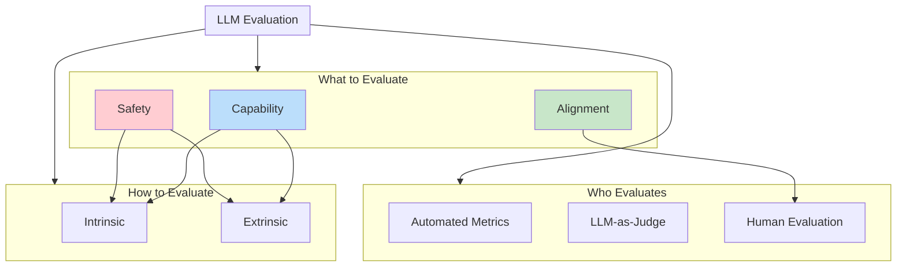
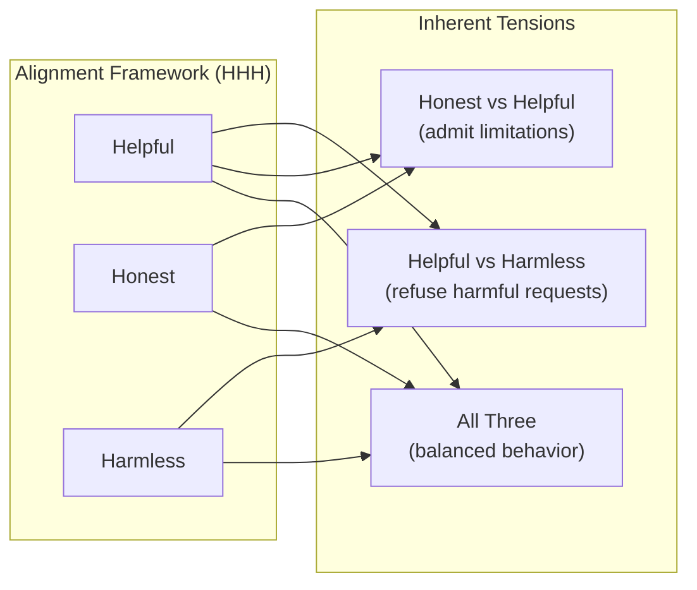
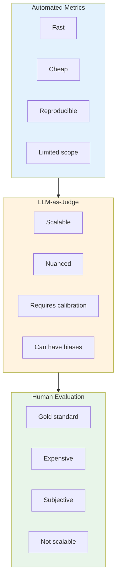

# Evaluation Taxonomy

> **Organizing the landscape of LLM evaluation**

---

## Learning Objectives

- **Distinguish between capability, safety, and alignment evaluation** and know when each applies
- **Understand intrinsic vs extrinsic evaluation** and their trade-offs
- **Map evaluation types to appropriate methods** (automated, LLM-judge, human)
- **Design multi-dimensional evaluation frameworks** for production systems
- **Recognize the limitations** of single-metric evaluation

---

## The Evaluation Landscape

LLM evaluation isn't one-size-fits-all. Different aspects of model behavior require different evaluation approaches. This taxonomy helps you navigate the landscape and choose the right evaluation strategy.



---

## Dimension 1: What to Evaluate

### Capability Evaluation

Measures what the model *can do* - its functional abilities across various tasks.

| Capability | Example Tasks | Key Metrics |
|------------|---------------|-------------|
| **Reasoning** | Math problems, logic puzzles | Accuracy, step correctness |
| **Knowledge** | QA, fact recall | Accuracy, F1 |
| **Coding** | Code generation, debugging | pass@k, functional correctness |
| **Language** | Translation, summarization | BLEU, ROUGE, BERTScore |
| **Instruction Following** | Task completion | Success rate, constraint adherence |

::: info Interview Insight
When asked "How would you evaluate GPT-4?", start by clarifying *which capabilities* matter for the use case. A coding assistant needs different evaluation than a customer service bot.
:::

### Safety Evaluation

Measures what the model *should not do* - its resistance to harmful outputs.

| Safety Dimension | What It Measures | Example Tests |
|-----------------|------------------|---------------|
| **Toxicity** | Harmful language generation | Toxic prompt completion |
| **Bias** | Demographic disparities | Fairness across groups |
| **Jailbreaking** | Bypass resistance | Adversarial prompts |
| **Privacy** | Data leakage | PII extraction attempts |
| **Misinformation** | False claim generation | Factuality checks |

```python
# Example: Safety evaluation framework
class SafetyEvaluator:
    def __init__(self, model, safety_classifier):
        self.model = model
        self.classifier = safety_classifier

    def evaluate_toxicity(self, prompts: list[str]) -> dict:
        """Evaluate model's toxicity across prompt types."""
        results = {
            "toxic_responses": 0,
            "total_responses": len(prompts),
            "by_category": {}
        }

        for prompt in prompts:
            response = self.model.generate(prompt)
            toxicity_score = self.classifier.score(response)

            if toxicity_score > 0.7:
                results["toxic_responses"] += 1

        results["toxicity_rate"] = (
            results["toxic_responses"] / results["total_responses"]
        )
        return results

    def evaluate_jailbreak_resistance(
        self,
        jailbreak_prompts: list[str],
        baseline_refusal_rate: float = 0.95
    ) -> dict:
        """Test resistance to jailbreak attempts."""
        refusals = 0

        for prompt in jailbreak_prompts:
            response = self.model.generate(prompt)
            if self._is_refusal(response):
                refusals += 1

        refusal_rate = refusals / len(jailbreak_prompts)

        return {
            "refusal_rate": refusal_rate,
            "meets_baseline": refusal_rate >= baseline_refusal_rate,
            "delta_from_baseline": refusal_rate - baseline_refusal_rate
        }

    def _is_refusal(self, response: str) -> bool:
        """Detect if response is a refusal."""
        refusal_patterns = [
            "I cannot", "I'm not able to", "I won't",
            "against my guidelines", "I don't think I should"
        ]
        return any(p.lower() in response.lower() for p in refusal_patterns)
```

### Alignment Evaluation

Measures whether the model behaves *as intended* - following human preferences and values.

| Alignment Aspect | Definition | Evaluation Method |
|-----------------|------------|-------------------|
| **Helpfulness** | Provides useful, complete answers | Human preference ratings |
| **Honesty** | Admits uncertainty, avoids deception | Calibration analysis |
| **Harmlessness** | Avoids causing harm | Safety + human review |
| **Value Adherence** | Follows specified principles | Constitutional AI checks |



---

## Dimension 2: How to Evaluate

### Intrinsic Evaluation

Measures model properties *directly*, without task-specific context.

| Metric | What It Measures | Use Case |
|--------|------------------|----------|
| **Perplexity** | Language modeling quality | Model comparison |
| **Embedding Quality** | Representation power | Retrieval systems |
| **Calibration** | Confidence accuracy | Uncertainty estimation |
| **Consistency** | Output stability | Production reliability |

```python
import numpy as np
from typing import Callable

def compute_perplexity(
    model: Callable,
    texts: list[str]
) -> float:
    """
    Compute perplexity across a corpus.

    Lower perplexity = better language modeling.
    """
    total_log_prob = 0
    total_tokens = 0

    for text in texts:
        log_probs = model.get_log_probs(text)
        total_log_prob += sum(log_probs)
        total_tokens += len(log_probs)

    avg_neg_log_prob = -total_log_prob / total_tokens
    perplexity = np.exp(avg_neg_log_prob)

    return perplexity


def evaluate_calibration(
    model: Callable,
    questions: list[str],
    correct_answers: list[str],
    n_bins: int = 10
) -> dict:
    """
    Measure calibration: Does confidence match accuracy?

    Perfect calibration: 80% confidence = 80% correct
    """
    bins = [[] for _ in range(n_bins)]

    for q, correct in zip(questions, correct_answers):
        answer, confidence = model.answer_with_confidence(q)
        is_correct = answer == correct

        bin_idx = min(int(confidence * n_bins), n_bins - 1)
        bins[bin_idx].append((confidence, is_correct))

    ece = 0  # Expected Calibration Error
    for bin_data in bins:
        if not bin_data:
            continue

        avg_confidence = np.mean([c for c, _ in bin_data])
        accuracy = np.mean([int(correct) for _, correct in bin_data])

        ece += len(bin_data) * abs(avg_confidence - accuracy)

    ece /= sum(len(b) for b in bins)

    return {
        "ece": ece,  # Lower is better
        "is_well_calibrated": ece < 0.1
    }
```

### Extrinsic Evaluation

Measures model performance *on downstream tasks*.

| Task Type | Example | Metrics |
|-----------|---------|---------|
| **Classification** | Sentiment analysis | Accuracy, F1, AUC |
| **Generation** | Summarization | ROUGE, BERTScore |
| **Retrieval** | Document search | MRR, NDCG, Recall@k |
| **Reasoning** | Math problems | Accuracy, Chain-of-thought validity |

::: warning Intrinsic vs Extrinsic Trade-off
Intrinsic metrics (like perplexity) are cheap and fast but don't always correlate with task performance. A model with lower perplexity might still perform worse on your specific task. Always validate with extrinsic evaluation on representative data.
:::

---

## Dimension 3: Who Evaluates



### Choosing Your Evaluator

| Scenario | Recommended Approach |
|----------|---------------------|
| CI/CD pipeline | Automated metrics |
| Model iteration | LLM-as-judge + subset human eval |
| Launch decision | Human evaluation on critical cases |
| Continuous monitoring | Automated + sampled human review |
| Novel capability | Human evaluation first, then transfer |

---

## Building a Multi-Dimensional Evaluation Framework

Real-world evaluation requires combining multiple dimensions.

```python
from dataclasses import dataclass
from enum import Enum
from typing import Optional

class EvalDimension(Enum):
    CAPABILITY = "capability"
    SAFETY = "safety"
    ALIGNMENT = "alignment"

class EvalMethod(Enum):
    INTRINSIC = "intrinsic"
    EXTRINSIC = "extrinsic"

class Evaluator(Enum):
    AUTOMATED = "automated"
    LLM_JUDGE = "llm_judge"
    HUMAN = "human"

@dataclass
class EvaluationSpec:
    """Specification for a single evaluation."""
    name: str
    dimension: EvalDimension
    method: EvalMethod
    evaluator: Evaluator
    weight: float = 1.0
    threshold: Optional[float] = None

@dataclass
class EvaluationFramework:
    """Multi-dimensional evaluation framework."""
    specs: list[EvaluationSpec]

    def validate(self) -> bool:
        """Ensure framework covers all dimensions."""
        dimensions_covered = set(s.dimension for s in self.specs)
        return len(dimensions_covered) == len(EvalDimension)

    def get_by_dimension(
        self,
        dimension: EvalDimension
    ) -> list[EvaluationSpec]:
        return [s for s in self.specs if s.dimension == dimension]


# Example: Chatbot evaluation framework
chatbot_framework = EvaluationFramework(specs=[
    # Capability evaluations
    EvaluationSpec(
        name="response_quality",
        dimension=EvalDimension.CAPABILITY,
        method=EvalMethod.EXTRINSIC,
        evaluator=Evaluator.LLM_JUDGE,
        weight=1.5,
        threshold=0.8
    ),
    EvaluationSpec(
        name="factual_accuracy",
        dimension=EvalDimension.CAPABILITY,
        method=EvalMethod.EXTRINSIC,
        evaluator=Evaluator.AUTOMATED,
        threshold=0.9
    ),

    # Safety evaluations
    EvaluationSpec(
        name="toxicity_check",
        dimension=EvalDimension.SAFETY,
        method=EvalMethod.INTRINSIC,
        evaluator=Evaluator.AUTOMATED,
        threshold=0.01  # Max 1% toxic
    ),
    EvaluationSpec(
        name="jailbreak_resistance",
        dimension=EvalDimension.SAFETY,
        method=EvalMethod.EXTRINSIC,
        evaluator=Evaluator.AUTOMATED,
        threshold=0.95
    ),

    # Alignment evaluations
    EvaluationSpec(
        name="helpfulness",
        dimension=EvalDimension.ALIGNMENT,
        method=EvalMethod.EXTRINSIC,
        evaluator=Evaluator.HUMAN,
        weight=2.0,
        threshold=0.85
    ),
])
```

---

## Interview Q&A

### Q1: "How do you decide between capability, safety, and alignment evaluation for a new LLM application?"

**Strong Answer:**

"It depends on the application's risk profile and use case:

1. **Start with capability**: Every application needs the model to work. Define task-specific capability metrics first.

2. **Safety scales with risk**: A creative writing assistant needs less safety evaluation than a medical chatbot. I'd assess:
   - Who are the users? (children vs professionals)
   - What's the worst-case output? (mild annoyance vs real harm)
   - What's the deployment context? (internal tool vs public-facing)

3. **Alignment becomes critical for high-stakes or autonomous use**: When users trust the model's judgment or it acts autonomously, alignment evaluation is essential.

For a customer service bot, I'd weight it roughly: 50% capability, 30% safety, 20% alignment. For an AI tutor for children, I'd shift to: 30% capability, 50% safety, 20% alignment."

---

### Q2: "What's the difference between intrinsic and extrinsic evaluation? When would you prefer each?"

**Strong Answer:**

"**Intrinsic evaluation** measures properties of the model itself - like perplexity or embedding quality. It's fast and doesn't require task-specific data. **Extrinsic evaluation** measures performance on downstream tasks - like accuracy on QA or ROUGE on summarization.

I use intrinsic evaluation for:
- Early model development (quick feedback loops)
- Comparing model architectures or training runs
- When downstream tasks aren't well-defined yet

I use extrinsic evaluation for:
- Production deployment decisions
- When intrinsic metrics don't correlate with task performance
- Comparing models for specific applications

The key insight is that **intrinsic metrics are proxies**. A model with lower perplexity might still be worse at your specific task due to domain mismatch, fine-tuning differences, or task-specific quirks. I always validate intrinsic findings with extrinsic evaluation before making deployment decisions."

---

### Q3: "How would you design an evaluation framework for a new LLM feature?"

**Strong Answer:**

"I follow a four-step process:

1. **Define success criteria**: Work with stakeholders to define what 'good' looks like. This includes both functional requirements and safety constraints.

2. **Map to evaluation dimensions**:
   - What capabilities does this feature need?
   - What could go wrong (safety)?
   - How should it behave in edge cases (alignment)?

3. **Select evaluation methods per dimension**:
   - Automated metrics for quick iteration
   - LLM-as-judge for scalable quality assessment
   - Human evaluation for nuanced judgment

4. **Build the feedback loop**: Connect evaluation to the development process - CI/CD for automated checks, regular human eval reviews, and continuous monitoring in production.

I'd also establish baselines before making changes, so we can measure improvement accurately."

---

## Summary Table

| Dimension | What It Measures | Primary Methods | When to Prioritize |
|-----------|-----------------|-----------------|-------------------|
| **Capability** | What model can do | Benchmarks, task metrics | Always - core functionality |
| **Safety** | What model shouldn't do | Red teaming, classifiers | High-risk applications |
| **Alignment** | How model should behave | Human preference, constitutional | User-facing, autonomous |
| **Intrinsic** | Model properties directly | Perplexity, calibration | Early development |
| **Extrinsic** | Task performance | Task-specific metrics | Deployment decisions |

---

## Sources

- Askell et al., "A General Language Assistant as a Laboratory for Alignment", Anthropic, 2021
- Liang et al., "Holistic Evaluation of Language Models" (HELM), 2022
- Perez et al., "Red Teaming Language Models with Language Models", 2022
- Bai et al., "Constitutional AI: Harmlessness from AI Feedback", 2022
