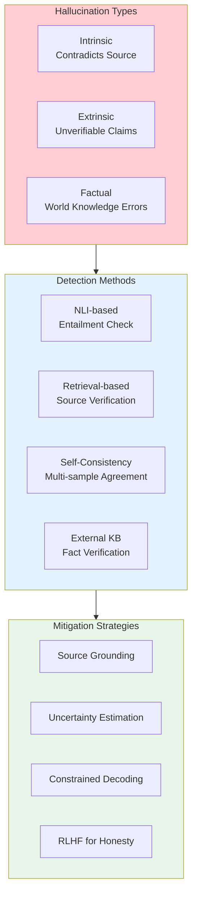
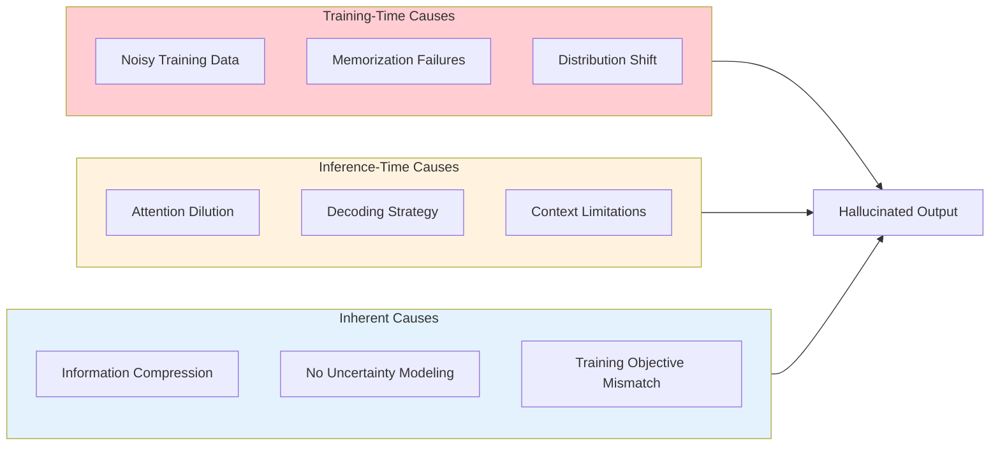
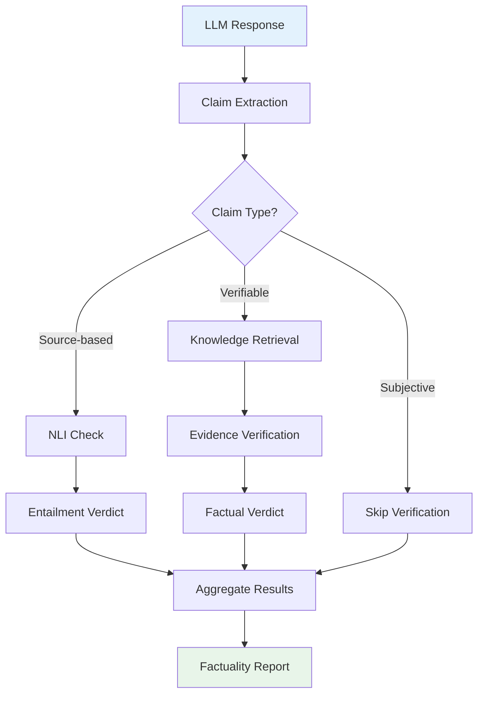

# Hallucination Detection

> **Identifying and preventing LLM fabrications**

---

## Learning Objectives

- **Classify types of hallucinations** and understand their root causes
- **Implement detection methods** using entailment, retrieval, and self-consistency
- **Build factuality verification pipelines** for production systems
- **Apply mitigation strategies** at inference and training time
- **Design evaluation benchmarks** for hallucination rates

---

## Overview

Hallucinations - confident generation of false or unsupported information - are a critical challenge for LLM deployment. Understanding hallucination types, detection methods, and mitigation strategies is essential for building trustworthy AI systems.



---

## Types of Hallucinations

### Taxonomy

| Type | Definition | Example | Detection Difficulty |
|------|------------|---------|---------------------|
| **Intrinsic** | Contradicts provided source | Summary says "10 people" when source says "5" | Easier - can verify against source |
| **Extrinsic** | Adds information not in source | Summary includes details not in document | Medium - requires knowing source scope |
| **Factual** | Contradicts world knowledge | "Paris is the capital of Germany" | Hard - requires world knowledge |
| **Fabricated** | Invents entities/events | "According to the Smith et al. 2023 study..." (doesn't exist) | Very hard - requires verification |

```python
from enum import Enum
from dataclasses import dataclass
from typing import Optional

class HallucinationType(Enum):
    INTRINSIC = "intrinsic"  # Contradicts source
    EXTRINSIC = "extrinsic"  # Not supported by source
    FACTUAL = "factual"      # World knowledge error
    FABRICATED = "fabricated"  # Made-up entities

@dataclass
class HallucinationInstance:
    """Represents a detected hallucination."""
    text_span: str
    hallucination_type: HallucinationType
    confidence: float
    source_text: Optional[str] = None
    correct_information: Optional[str] = None
    detection_method: str = ""

    def to_dict(self) -> dict:
        return {
            "span": self.text_span,
            "type": self.hallucination_type.value,
            "confidence": self.confidence,
            "source": self.source_text,
            "correction": self.correct_information,
            "method": self.detection_method
        }
```

### Root Causes



---

## Detection Methods

### 1. NLI-Based Detection

Use Natural Language Inference to check if claims are entailed by source.

```python
from transformers import pipeline
from typing import Optional
import numpy as np

class NLIHallucinationDetector:
    """
    Detect hallucinations using Natural Language Inference.

    A claim is hallucinated if it's not entailed by the source.
    """

    def __init__(self, model_name: str = "facebook/bart-large-mnli"):
        self.nli = pipeline("zero-shot-classification", model=model_name)

    def check_entailment(
        self,
        premise: str,
        hypothesis: str
    ) -> dict:
        """
        Check if premise entails hypothesis.

        Args:
            premise: Source text (what we know is true)
            hypothesis: Claim to verify

        Returns:
            Entailment scores and verdict
        """
        result = self.nli(
            hypothesis,
            candidate_labels=["entailment", "neutral", "contradiction"],
            hypothesis_template="{}",
            multi_label=False
        )

        # Map labels to scores
        label_scores = dict(zip(result["labels"], result["scores"]))

        return {
            "entailment": label_scores.get("entailment", 0),
            "neutral": label_scores.get("neutral", 0),
            "contradiction": label_scores.get("contradiction", 0),
            "is_hallucination": label_scores.get("entailment", 0) < 0.5,
            "hallucination_type": self._classify_type(label_scores)
        }

    def _classify_type(self, scores: dict) -> Optional[HallucinationType]:
        """Classify hallucination type based on NLI scores."""
        if scores["entailment"] >= 0.5:
            return None  # Not a hallucination
        elif scores["contradiction"] > scores["neutral"]:
            return HallucinationType.INTRINSIC
        else:
            return HallucinationType.EXTRINSIC

    def detect_in_summary(
        self,
        source: str,
        summary: str,
        sentence_level: bool = True
    ) -> list[dict]:
        """
        Detect hallucinations in a summary given source document.

        Args:
            source: Original document
            summary: Generated summary to check
            sentence_level: Check each sentence separately

        Returns:
            List of detected hallucinations
        """
        if sentence_level:
            # Split summary into sentences
            import nltk
            sentences = nltk.sent_tokenize(summary)
        else:
            sentences = [summary]

        results = []
        for sent in sentences:
            check = self.check_entailment(source, sent)
            if check["is_hallucination"]:
                results.append({
                    "sentence": sent,
                    "type": check["hallucination_type"].value if check["hallucination_type"] else "unknown",
                    "scores": {
                        "entailment": check["entailment"],
                        "contradiction": check["contradiction"]
                    }
                })

        return results


# Example usage
detector = NLIHallucinationDetector()

source = """
The company reported revenue of $5 billion in Q4 2024,
up 15% from the previous year. The CEO announced plans
to expand into European markets.
"""

summary = """
The company achieved $5 billion in Q4 revenue, representing
20% year-over-year growth. The CEO confirmed expansion into
Asian markets starting next quarter.
"""

hallucinations = detector.detect_in_summary(source, summary)
for h in hallucinations:
    print(f"Hallucination: {h['sentence']}")
    print(f"Type: {h['type']}")
```

### 2. Self-Consistency Detection

Sample multiple responses and check for contradictions.

```python
from collections import Counter
import numpy as np
from typing import Callable

class SelfConsistencyDetector:
    """
    Detect hallucinations via self-consistency checking.

    If the model contradicts itself across samples, low-agreement
    claims are likely hallucinations.
    """

    def __init__(
        self,
        model_fn: Callable,
        n_samples: int = 5,
        temperature: float = 0.7
    ):
        self.model_fn = model_fn
        self.n_samples = n_samples
        self.temperature = temperature

    def generate_samples(self, prompt: str) -> list[str]:
        """Generate multiple responses to the same prompt."""
        responses = []
        for _ in range(self.n_samples):
            response = self.model_fn(
                prompt,
                temperature=self.temperature
            )
            responses.append(response)
        return responses

    def extract_claims(self, text: str) -> list[str]:
        """
        Extract factual claims from text.

        In production, use a more sophisticated claim extractor.
        """
        import nltk
        sentences = nltk.sent_tokenize(text)
        # Filter to declarative sentences (simplified)
        claims = [s for s in sentences if not s.endswith("?")]
        return claims

    def check_consistency(
        self,
        prompt: str,
        claim_similarity_threshold: float = 0.8
    ) -> dict:
        """
        Check self-consistency of model responses.

        Returns:
            Dictionary with consistent and inconsistent claims
        """
        responses = self.generate_samples(prompt)

        # Extract claims from each response
        all_claims = []
        for i, response in enumerate(responses):
            claims = self.extract_claims(response)
            for claim in claims:
                all_claims.append({
                    "claim": claim,
                    "response_idx": i
                })

        # Cluster similar claims
        claim_clusters = self._cluster_claims(
            all_claims,
            threshold=claim_similarity_threshold
        )

        # Analyze consistency
        consistent_claims = []
        inconsistent_claims = []

        for cluster in claim_clusters:
            n_responses_with_claim = len(set(c["response_idx"] for c in cluster))
            consistency_ratio = n_responses_with_claim / self.n_samples

            representative_claim = cluster[0]["claim"]

            if consistency_ratio >= 0.6:
                consistent_claims.append({
                    "claim": representative_claim,
                    "consistency": consistency_ratio,
                    "appears_in": n_responses_with_claim
                })
            else:
                inconsistent_claims.append({
                    "claim": representative_claim,
                    "consistency": consistency_ratio,
                    "appears_in": n_responses_with_claim,
                    "likely_hallucination": True
                })

        return {
            "n_samples": self.n_samples,
            "consistent_claims": consistent_claims,
            "inconsistent_claims": inconsistent_claims,
            "hallucination_rate": len(inconsistent_claims) / max(len(all_claims), 1)
        }

    def _cluster_claims(
        self,
        claims: list[dict],
        threshold: float
    ) -> list[list[dict]]:
        """Cluster semantically similar claims."""
        from sentence_transformers import SentenceTransformer
        from sklearn.cluster import AgglomerativeClustering

        if not claims:
            return []

        model = SentenceTransformer("all-MiniLM-L6-v2")
        embeddings = model.encode([c["claim"] for c in claims])

        clustering = AgglomerativeClustering(
            n_clusters=None,
            distance_threshold=1 - threshold,
            metric="cosine",
            linkage="average"
        )
        labels = clustering.fit_predict(embeddings)

        clusters = {}
        for claim, label in zip(claims, labels):
            if label not in clusters:
                clusters[label] = []
            clusters[label].append(claim)

        return list(clusters.values())
```

### 3. Retrieval-Based Verification

Verify claims against external knowledge sources.

```python
from typing import Optional
import requests

class RetrievalBasedVerifier:
    """
    Verify factual claims using retrieval from knowledge bases.
    """

    def __init__(
        self,
        retriever,
        verifier_model,
        top_k: int = 5
    ):
        self.retriever = retriever
        self.verifier = verifier_model
        self.top_k = top_k

    def verify_claim(self, claim: str) -> dict:
        """
        Verify a claim against retrieved evidence.

        Args:
            claim: Factual claim to verify

        Returns:
            Verification result with evidence
        """
        # Step 1: Retrieve relevant passages
        passages = self.retriever.search(claim, top_k=self.top_k)

        if not passages:
            return {
                "claim": claim,
                "verdict": "UNVERIFIABLE",
                "confidence": 0.0,
                "evidence": []
            }

        # Step 2: Check each passage for support
        evidence_results = []
        for passage in passages:
            result = self.verifier.check_support(
                evidence=passage["text"],
                claim=claim
            )
            evidence_results.append({
                "passage": passage["text"],
                "source": passage.get("source", "unknown"),
                "supports": result["supports"],
                "score": result["score"]
            })

        # Step 3: Aggregate evidence
        supporting = [e for e in evidence_results if e["supports"]]
        refuting = [e for e in evidence_results if not e["supports"] and e["score"] > 0.5]

        if supporting:
            verdict = "SUPPORTED"
            confidence = max(e["score"] for e in supporting)
        elif refuting:
            verdict = "REFUTED"
            confidence = max(e["score"] for e in refuting)
        else:
            verdict = "UNVERIFIABLE"
            confidence = 0.0

        return {
            "claim": claim,
            "verdict": verdict,
            "confidence": confidence,
            "evidence": evidence_results,
            "is_hallucination": verdict == "REFUTED"
        }

    def verify_response(
        self,
        response: str,
        claim_extractor: Optional[Callable] = None
    ) -> dict:
        """Verify all claims in a response."""
        if claim_extractor:
            claims = claim_extractor(response)
        else:
            import nltk
            claims = nltk.sent_tokenize(response)

        results = []
        for claim in claims:
            result = self.verify_claim(claim)
            results.append(result)

        # Aggregate statistics
        n_supported = len([r for r in results if r["verdict"] == "SUPPORTED"])
        n_refuted = len([r for r in results if r["verdict"] == "REFUTED"])
        n_unverifiable = len([r for r in results if r["verdict"] == "UNVERIFIABLE"])

        return {
            "response": response,
            "claims": results,
            "statistics": {
                "total_claims": len(claims),
                "supported": n_supported,
                "refuted": n_refuted,
                "unverifiable": n_unverifiable,
                "hallucination_rate": n_refuted / max(len(claims), 1)
            }
        }
```

---

## Factuality Checking Pipeline



```python
from dataclasses import dataclass
from typing import Optional
from enum import Enum

class ClaimType(Enum):
    VERIFIABLE = "verifiable"      # Can check against KB
    SOURCE_BASED = "source_based"  # Check against provided context
    SUBJECTIVE = "subjective"      # Opinion, can't verify
    FUTURE = "future"              # Prediction, can't verify yet

@dataclass
class FactualityResult:
    claim: str
    claim_type: ClaimType
    verdict: str  # SUPPORTED, REFUTED, UNVERIFIABLE
    confidence: float
    evidence: list[str]
    hallucination_detected: bool

class FactualityPipeline:
    """
    End-to-end factuality checking pipeline.
    """

    def __init__(
        self,
        claim_extractor,
        claim_classifier,
        nli_detector: NLIHallucinationDetector,
        retrieval_verifier: RetrievalBasedVerifier
    ):
        self.claim_extractor = claim_extractor
        self.claim_classifier = claim_classifier
        self.nli_detector = nli_detector
        self.retrieval_verifier = retrieval_verifier

    def check_factuality(
        self,
        response: str,
        source_context: Optional[str] = None
    ) -> dict:
        """
        Run full factuality check on a response.

        Args:
            response: LLM-generated response
            source_context: Optional source document for NLI checking

        Returns:
            Comprehensive factuality report
        """
        # Step 1: Extract claims
        claims = self.claim_extractor.extract(response)

        results = []
        for claim in claims:
            # Step 2: Classify claim type
            claim_type = self.claim_classifier.classify(claim)

            # Step 3: Route to appropriate verifier
            if claim_type == ClaimType.SUBJECTIVE or claim_type == ClaimType.FUTURE:
                result = FactualityResult(
                    claim=claim,
                    claim_type=claim_type,
                    verdict="UNVERIFIABLE",
                    confidence=0.0,
                    evidence=[],
                    hallucination_detected=False
                )
            elif claim_type == ClaimType.SOURCE_BASED and source_context:
                nli_result = self.nli_detector.check_entailment(
                    premise=source_context,
                    hypothesis=claim
                )
                result = FactualityResult(
                    claim=claim,
                    claim_type=claim_type,
                    verdict="SUPPORTED" if nli_result["entailment"] > 0.5 else "REFUTED",
                    confidence=max(nli_result["entailment"], nli_result["contradiction"]),
                    evidence=[source_context[:200] + "..."],
                    hallucination_detected=nli_result["is_hallucination"]
                )
            else:  # VERIFIABLE
                retrieval_result = self.retrieval_verifier.verify_claim(claim)
                result = FactualityResult(
                    claim=claim,
                    claim_type=claim_type,
                    verdict=retrieval_result["verdict"],
                    confidence=retrieval_result["confidence"],
                    evidence=[e["passage"][:100] for e in retrieval_result["evidence"][:3]],
                    hallucination_detected=retrieval_result["is_hallucination"]
                )

            results.append(result)

        # Step 4: Compile report
        return self._compile_report(response, results)

    def _compile_report(
        self,
        response: str,
        results: list[FactualityResult]
    ) -> dict:
        """Compile results into a factuality report."""
        hallucinations = [r for r in results if r.hallucination_detected]

        return {
            "response": response,
            "n_claims": len(results),
            "n_hallucinations": len(hallucinations),
            "hallucination_rate": len(hallucinations) / max(len(results), 1),
            "factuality_score": 1 - (len(hallucinations) / max(len(results), 1)),
            "claims": [
                {
                    "text": r.claim,
                    "type": r.claim_type.value,
                    "verdict": r.verdict,
                    "confidence": r.confidence,
                    "is_hallucination": r.hallucination_detected
                }
                for r in results
            ],
            "hallucination_details": [
                {
                    "claim": r.claim,
                    "evidence": r.evidence
                }
                for r in hallucinations
            ]
        }
```

---

## Mitigation Strategies

### Inference-Time Mitigation

```python
class HallucinationMitigator:
    """
    Inference-time strategies to reduce hallucinations.
    """

    def __init__(self, model, retriever, factuality_checker):
        self.model = model
        self.retriever = retriever
        self.checker = factuality_checker

    def generate_with_retrieval_grounding(
        self,
        query: str,
        top_k: int = 5
    ) -> dict:
        """
        Generate response grounded in retrieved documents.
        """
        # Retrieve relevant context
        passages = self.retriever.search(query, top_k=top_k)
        context = "\n\n".join([p["text"] for p in passages])

        # Generate with explicit grounding instruction
        prompt = f"""Answer the question based ONLY on the provided context.
If the answer is not in the context, say "I don't have information about that."

Context:
{context}

Question: {query}

Answer:"""

        response = self.model.generate(prompt)

        return {
            "response": response,
            "sources": passages,
            "grounded": True
        }

    def generate_with_self_verification(
        self,
        query: str,
        max_iterations: int = 3
    ) -> dict:
        """
        Generate and iteratively verify/correct response.
        """
        response = self.model.generate(query)

        for iteration in range(max_iterations):
            # Check factuality
            report = self.checker.check_factuality(response)

            if report["hallucination_rate"] == 0:
                break  # No hallucinations found

            # Ask model to correct
            correction_prompt = f"""Your previous response contained some inaccuracies.

Original response: {response}

Issues found:
{self._format_issues(report['hallucination_details'])}

Please provide a corrected response that addresses these issues.
Only include information you are confident about."""

            response = self.model.generate(correction_prompt)

        return {
            "response": response,
            "iterations": iteration + 1,
            "final_factuality": report["factuality_score"]
        }

    def generate_with_uncertainty(
        self,
        query: str,
        n_samples: int = 5,
        consistency_threshold: float = 0.6
    ) -> dict:
        """
        Generate with uncertainty estimation based on self-consistency.
        """
        # Generate multiple samples
        responses = []
        for _ in range(n_samples):
            response = self.model.generate(query, temperature=0.7)
            responses.append(response)

        # Extract and cluster claims
        claim_consistency = self._analyze_claim_consistency(responses)

        # Build response with confidence annotations
        annotated_response = self._build_annotated_response(
            responses[0],  # Use first as base
            claim_consistency,
            consistency_threshold
        )

        return {
            "response": annotated_response["text"],
            "confidence_annotations": annotated_response["annotations"],
            "low_confidence_claims": [
                c for c in claim_consistency
                if c["consistency"] < consistency_threshold
            ]
        }

    def _format_issues(self, issues: list) -> str:
        """Format hallucination issues for correction prompt."""
        return "\n".join([
            f"- Claim: '{issue['claim']}'"
            for issue in issues
        ])

    def _analyze_claim_consistency(self, responses: list) -> list:
        """Analyze claim consistency across responses."""
        # Implementation similar to SelfConsistencyDetector
        pass

    def _build_annotated_response(
        self,
        base_response: str,
        consistency_data: list,
        threshold: float
    ) -> dict:
        """Build response with confidence annotations."""
        # Add [LOW CONFIDENCE] markers to uncertain claims
        pass
```

### Training-Time Mitigation

| Strategy | Description | Implementation |
|----------|-------------|----------------|
| **RLHF for Honesty** | Reward saying "I don't know" | Train reward model on honesty preferences |
| **Factuality Fine-tuning** | Train on verified factual data | Curate dataset with source attribution |
| **Retrieval-Augmented Training** | Include retrieval in training | Pretraining with retrieved context |
| **Uncertainty Modeling** | Train to output confidence | Add confidence token prediction head |

---

## Interview Q&A

### Q1: "What are the main types of LLM hallucinations and how would you detect each?"

**Strong Answer:**

"I categorize hallucinations into four types, each requiring different detection approaches:

**1. Intrinsic Hallucinations** - Output contradicts the provided source.
- Detection: NLI-based entailment checking between source and output
- Example: Summarization says 'revenue increased' when source says 'decreased'

**2. Extrinsic Hallucinations** - Output adds information not in source.
- Detection: Check if claims are entailed by source (neutral = extrinsic)
- Harder to detect because absence of support isn't always wrong

**3. Factual Hallucinations** - Output contradicts world knowledge.
- Detection: Retrieval-based verification against knowledge bases
- Example: 'Einstein invented the telephone'

**4. Fabricated Hallucinations** - Made-up entities, citations, events.
- Detection: Entity linking, citation verification, cross-reference checks
- Example: 'According to the 2024 Smith et al. study...' (doesn't exist)

For production, I'd use a layered approach: NLI for source-grounded tasks, retrieval verification for factual claims, and self-consistency checking as a catch-all for low-confidence outputs."

---

### Q2: "How would you build a hallucination detection system for a customer-facing chatbot?"

**Strong Answer:**

"I'd build a real-time detection system with these components:

**1. Fast Path (real-time, every response):**
- Lightweight NLI model to check against conversation context
- Simple fact patterns (dates, numbers, named entities) with rule-based validation
- Self-reported uncertainty detection ('I think', 'I'm not sure')

**2. Async Path (near real-time, sampled):**
- Retrieval-based fact verification against knowledge base
- Cross-check against product database for company-specific facts
- Self-consistency checking with parallel samples

**3. Batch Path (daily analysis):**
- Full factuality audit on sample of conversations
- User feedback correlation (complaints often signal hallucinations)
- Trend detection for emerging hallucination patterns

**Response Strategy:**
- High-confidence hallucination: Block or add disclaimer
- Medium-confidence: Add soft disclaimer ('based on my training data...')
- Low-confidence: Log for review, allow through

**Feedback Loop:**
- User reports feed into training data
- Verified hallucinations become negative examples
- High-hallucination topics get retrieval augmentation"

---

### Q3: "What techniques would you use to reduce hallucinations in RAG systems?"

**Strong Answer:**

"RAG already helps with hallucinations by grounding generation, but several techniques improve it further:

**1. Retrieval Quality:**
- Better embeddings and reranking to get more relevant passages
- Diversity in retrieved passages to cover different aspects
- Recency-aware retrieval to avoid outdated information

**2. Generation Constraints:**
- Explicit 'only use provided context' instructions
- Train/fine-tune on attributed generation (cite sources inline)
- Constrained decoding to favor tokens appearing in context

**3. Post-Generation Verification:**
- NLI check that response entails from retrieved passages
- Highlight unsupported claims to users
- Confidence scoring based on retrieval relevance

**4. Architectural Improvements:**
- FiD (Fusion-in-Decoder) for better context utilization
- Iterative retrieval: retrieve, generate draft, retrieve again based on draft
- Attribution heads: explicitly model which passage supports each token

**5. 'I Don't Know' Training:**
- RLHF to reward admitting uncertainty when context is insufficient
- Add 'insufficient context' as explicit retrieval signal

The key insight is that RAG alone doesn't eliminate hallucinations - the model can still ignore context. Active verification is essential."

---

## Summary Table

| Method | Detects | Strengths | Limitations |
|--------|---------|-----------|-------------|
| **NLI-based** | Intrinsic, extrinsic | Fast, interpretable | Needs source text |
| **Self-consistency** | All types | No external KB needed | Expensive (multi-sample) |
| **Retrieval verification** | Factual, fabricated | World knowledge | KB coverage gaps |
| **Claim extraction** | Enables all methods | Structured analysis | Extraction errors |
| **Human verification** | All types (gold standard) | Most reliable | Expensive, slow |

---

## Sources

- Ji et al., "Survey of Hallucination in Natural Language Generation", ACM Computing Surveys, 2023
- Min et al., "FActScore: Fine-grained Atomic Evaluation of Factual Precision", 2023
- Manakul et al., "SelfCheckGPT: Zero-Resource Black-Box Hallucination Detection", 2023
- Maynez et al., "On Faithfulness and Factuality in Abstractive Summarization", ACL 2020
