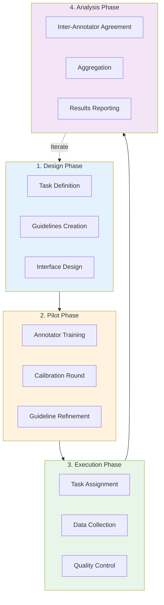
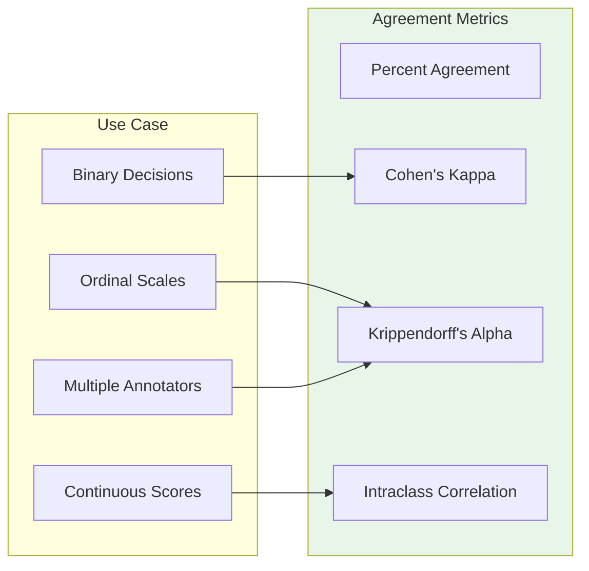
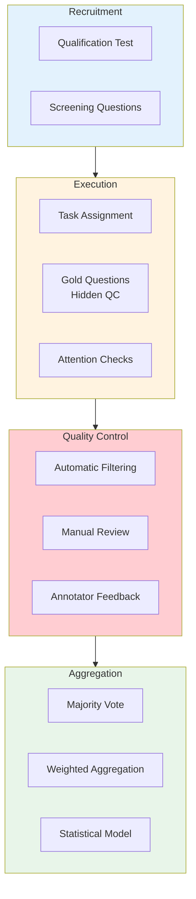
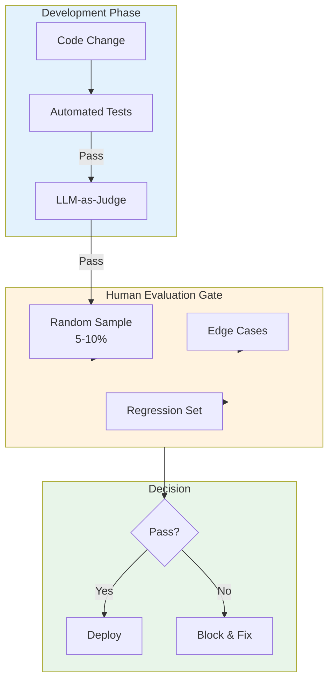

# Human Evaluation

> **The gold standard for LLM assessment**

---

## Learning Objectives

- **Design annotation guidelines** that produce consistent, high-quality labels
- **Measure inter-annotator agreement** using appropriate statistical methods
- **Set up crowdsourcing workflows** with quality control mechanisms
- **Balance cost and quality** in human evaluation design
- **Integrate human evaluation** into continuous development workflows

---

## Overview

Human evaluation remains the gold standard for assessing LLM outputs, especially for subjective qualities like helpfulness, creativity, and nuanced correctness. However, it's expensive and slow, making thoughtful design essential.



---

## Annotation Guideline Design

Well-designed guidelines are critical for consistent annotation.

### Guideline Structure

```python
from dataclasses import dataclass
from typing import Optional

@dataclass
class AnnotationGuideline:
    """Structure for annotation guidelines."""
    task_description: str
    evaluation_criteria: list[dict]
    scoring_rubric: dict
    examples: list[dict]  # Labeled examples for each score level
    edge_cases: list[dict]
    common_mistakes: list[str]

# Example: Helpfulness evaluation guideline
helpfulness_guideline = AnnotationGuideline(
    task_description="""
    You will evaluate AI assistant responses for helpfulness.
    A helpful response directly addresses the user's needs,
    provides accurate information, and is appropriately detailed.
    """,

    evaluation_criteria=[
        {
            "name": "Task Completion",
            "description": "Does the response fully address what was asked?",
            "weight": 0.4
        },
        {
            "name": "Accuracy",
            "description": "Is the information provided correct?",
            "weight": 0.3
        },
        {
            "name": "Clarity",
            "description": "Is the response easy to understand?",
            "weight": 0.2
        },
        {
            "name": "Appropriate Detail",
            "description": "Is the level of detail right for the question?",
            "weight": 0.1
        }
    ],

    scoring_rubric={
        5: "Excellent - Fully addresses the task with accurate, clear, well-detailed response",
        4: "Good - Addresses the task well with minor issues in accuracy, clarity, or detail",
        3: "Acceptable - Partially addresses the task or has notable issues",
        2: "Poor - Significantly fails to address the task or has major errors",
        1: "Very Poor - Does not address the task or is completely incorrect"
    },

    examples=[
        {
            "score": 5,
            "user_query": "How do I reset my password?",
            "response": "To reset your password: 1) Go to login page, 2) Click 'Forgot Password', 3) Enter your email, 4) Check your inbox for reset link, 5) Create new password with 8+ characters including a number.",
            "explanation": "Provides clear step-by-step instructions that fully address the query."
        },
        {
            "score": 3,
            "user_query": "How do I reset my password?",
            "response": "You can reset your password through the forgot password option.",
            "explanation": "Technically correct but lacks actionable detail."
        },
        {
            "score": 1,
            "user_query": "How do I reset my password?",
            "response": "I'm sorry, I cannot help with that.",
            "explanation": "Fails to address a straightforward request."
        }
    ],

    edge_cases=[
        {
            "scenario": "Response is helpful but contains minor factual error",
            "guidance": "Score based on severity of error. Minor errors affecting non-critical details: 3-4. Errors affecting main advice: 1-2."
        },
        {
            "scenario": "Response is correct but unnecessarily verbose",
            "guidance": "Deduct for verbosity only if it significantly impacts clarity. Slight verbosity: 4. Excessive verbosity that buries key info: 2-3."
        }
    ],

    common_mistakes=[
        "Rating based on personal preference rather than criteria",
        "Being too harsh on responses that are correct but brief",
        "Ignoring factual errors when response 'sounds good'",
        "Inconsistent scoring across similar responses"
    ]
)
```

### Guideline Best Practices

| Principle | Implementation | Why It Matters |
|-----------|----------------|----------------|
| **Concrete examples** | 2-3 examples per score level | Reduces ambiguity |
| **Edge case guidance** | Explicit handling rules | Prevents disagreement |
| **Calibration exercises** | Pre-task training with feedback | Aligns annotators |
| **Living document** | Update based on questions | Captures new cases |

---

## Inter-Annotator Agreement (IAA)

Measuring agreement quantifies annotation quality.



```python
import numpy as np
from sklearn.metrics import cohen_kappa_score
from typing import Optional
import warnings

def compute_percent_agreement(
    annotations_a: list,
    annotations_b: list
) -> float:
    """Simple percent agreement between two annotators."""
    if len(annotations_a) != len(annotations_b):
        raise ValueError("Annotation lists must have same length")

    agreements = sum(a == b for a, b in zip(annotations_a, annotations_b))
    return agreements / len(annotations_a)


def compute_cohens_kappa(
    annotations_a: list,
    annotations_b: list
) -> dict:
    """
    Cohen's Kappa - agreement corrected for chance.

    Interpretation:
    - < 0: Less than chance agreement
    - 0.0-0.20: Slight agreement
    - 0.21-0.40: Fair agreement
    - 0.41-0.60: Moderate agreement
    - 0.61-0.80: Substantial agreement
    - 0.81-1.00: Almost perfect agreement
    """
    kappa = cohen_kappa_score(annotations_a, annotations_b)

    interpretation = ""
    if kappa < 0:
        interpretation = "Less than chance"
    elif kappa < 0.21:
        interpretation = "Slight"
    elif kappa < 0.41:
        interpretation = "Fair"
    elif kappa < 0.61:
        interpretation = "Moderate"
    elif kappa < 0.81:
        interpretation = "Substantial"
    else:
        interpretation = "Almost perfect"

    return {
        "kappa": kappa,
        "interpretation": interpretation,
        "percent_agreement": compute_percent_agreement(annotations_a, annotations_b)
    }


def compute_krippendorff_alpha(
    annotations: list[list],
    level_of_measurement: str = "ordinal"
) -> dict:
    """
    Krippendorff's Alpha for multiple annotators.

    Args:
        annotations: List of annotation lists, one per annotator
        level_of_measurement: 'nominal', 'ordinal', 'interval', 'ratio'

    Returns:
        Alpha coefficient and interpretation
    """
    # Implementation using krippendorff library
    try:
        import krippendorff

        # Convert to numpy array (annotators x items)
        # Use np.nan for missing annotations
        n_annotators = len(annotations)
        n_items = max(len(a) for a in annotations)

        data = np.full((n_annotators, n_items), np.nan)
        for i, ann in enumerate(annotations):
            data[i, :len(ann)] = ann

        alpha = krippendorff.alpha(
            reliability_data=data,
            level_of_measurement=level_of_measurement
        )

        interpretation = ""
        if alpha < 0.667:
            interpretation = "Insufficient for drawing conclusions"
        elif alpha < 0.8:
            interpretation = "Acceptable for tentative conclusions"
        else:
            interpretation = "Good reliability"

        return {
            "alpha": alpha,
            "interpretation": interpretation,
            "n_annotators": n_annotators,
            "n_items": n_items
        }

    except ImportError:
        warnings.warn("krippendorff package not installed")
        return {"error": "krippendorff package required"}


def compute_icc(
    ratings: np.ndarray,
    icc_type: str = "ICC(2,1)"
) -> dict:
    """
    Intraclass Correlation Coefficient for continuous ratings.

    Args:
        ratings: Array of shape (n_items, n_raters)
        icc_type: Type of ICC to compute

    Returns:
        ICC value and confidence interval
    """
    n_items, n_raters = ratings.shape

    # Calculate means
    item_means = ratings.mean(axis=1)
    rater_means = ratings.mean(axis=0)
    grand_mean = ratings.mean()

    # Sum of squares
    ss_total = np.sum((ratings - grand_mean) ** 2)
    ss_between = n_raters * np.sum((item_means - grand_mean) ** 2)
    ss_within = ss_total - ss_between

    # Mean squares
    ms_between = ss_between / (n_items - 1)
    ms_within = ss_within / (n_items * (n_raters - 1))

    # ICC(2,1) - Two-way random effects, single rater
    icc = (ms_between - ms_within) / (ms_between + (n_raters - 1) * ms_within)

    interpretation = ""
    if icc < 0.5:
        interpretation = "Poor"
    elif icc < 0.75:
        interpretation = "Moderate"
    elif icc < 0.9:
        interpretation = "Good"
    else:
        interpretation = "Excellent"

    return {
        "icc": icc,
        "interpretation": interpretation,
        "icc_type": icc_type
    }


# Example usage
annotator1 = [4, 3, 5, 2, 4, 3, 5, 4, 3, 2]
annotator2 = [4, 3, 4, 2, 5, 3, 5, 4, 2, 2]
annotator3 = [5, 3, 5, 2, 4, 4, 5, 4, 3, 3]

# Cohen's Kappa (pairwise)
kappa_result = compute_cohens_kappa(annotator1, annotator2)
print(f"Cohen's Kappa: {kappa_result['kappa']:.3f} ({kappa_result['interpretation']})")

# Krippendorff's Alpha (all annotators)
alpha_result = compute_krippendorff_alpha([annotator1, annotator2, annotator3])
print(f"Krippendorff's Alpha: {alpha_result['alpha']:.3f}")
```

::: warning When Agreement Is Low
Low IAA indicates either:
1. **Ambiguous guidelines** - Clarify criteria and add examples
2. **Subjective task** - Consider whether the task is inherently subjective
3. **Annotator quality** - Additional training or filtering needed
4. **Task difficulty** - Break into simpler sub-tasks

Always investigate before discarding low-agreement data.
:::

---

## Crowdsourcing Workflows

Scaling human evaluation requires robust quality control.



```python
from dataclasses import dataclass, field
from typing import Callable, Optional
from collections import defaultdict
import numpy as np

@dataclass
class QualityControlConfig:
    """Configuration for crowdsourcing quality control."""
    min_agreement_threshold: float = 0.7
    gold_question_frequency: float = 0.1  # 10% of tasks
    min_gold_accuracy: float = 0.8
    min_time_per_task_seconds: float = 10
    max_time_per_task_seconds: float = 300
    attention_check_frequency: float = 0.05

@dataclass
class AnnotatorStats:
    """Track annotator performance."""
    annotator_id: str
    n_tasks_completed: int = 0
    n_gold_correct: int = 0
    n_gold_total: int = 0
    agreement_with_others: float = 0.0
    avg_time_per_task: float = 0.0
    flagged_responses: int = 0

    @property
    def gold_accuracy(self) -> float:
        if self.n_gold_total == 0:
            return 1.0
        return self.n_gold_correct / self.n_gold_total

    @property
    def is_reliable(self) -> bool:
        return (
            self.gold_accuracy >= 0.8 and
            self.agreement_with_others >= 0.6 and
            self.n_tasks_completed >= 10
        )


class CrowdsourcingManager:
    """Manage crowdsourced annotation with quality control."""

    def __init__(self, config: QualityControlConfig):
        self.config = config
        self.annotator_stats: dict[str, AnnotatorStats] = {}
        self.task_annotations: dict[str, list] = defaultdict(list)
        self.gold_questions: dict[str, any] = {}

    def add_gold_question(self, task_id: str, correct_answer: any):
        """Add a gold standard question for quality control."""
        self.gold_questions[task_id] = correct_answer

    def submit_annotation(
        self,
        task_id: str,
        annotator_id: str,
        annotation: any,
        time_taken_seconds: float
    ) -> dict:
        """Process a submitted annotation with QC checks."""
        # Initialize annotator stats if new
        if annotator_id not in self.annotator_stats:
            self.annotator_stats[annotator_id] = AnnotatorStats(
                annotator_id=annotator_id
            )

        stats = self.annotator_stats[annotator_id]
        flags = []

        # Time check
        if time_taken_seconds < self.config.min_time_per_task_seconds:
            flags.append("too_fast")
        if time_taken_seconds > self.config.max_time_per_task_seconds:
            flags.append("too_slow")

        # Gold question check
        if task_id in self.gold_questions:
            stats.n_gold_total += 1
            if annotation == self.gold_questions[task_id]:
                stats.n_gold_correct += 1
            else:
                flags.append("gold_incorrect")

        # Update stats
        stats.n_tasks_completed += 1
        stats.avg_time_per_task = (
            (stats.avg_time_per_task * (stats.n_tasks_completed - 1) + time_taken_seconds)
            / stats.n_tasks_completed
        )

        if flags:
            stats.flagged_responses += 1

        # Store annotation
        self.task_annotations[task_id].append({
            "annotator_id": annotator_id,
            "annotation": annotation,
            "time_taken": time_taken_seconds,
            "flags": flags
        })

        return {
            "accepted": len(flags) == 0,
            "flags": flags,
            "annotator_reliability": stats.is_reliable
        }

    def get_aggregated_annotation(
        self,
        task_id: str,
        method: str = "majority"
    ) -> dict:
        """Aggregate annotations for a task."""
        annotations = self.task_annotations.get(task_id, [])

        if not annotations:
            return {"error": "No annotations for task"}

        if method == "majority":
            return self._majority_vote(annotations)
        elif method == "weighted":
            return self._weighted_aggregation(annotations)
        else:
            raise ValueError(f"Unknown aggregation method: {method}")

    def _majority_vote(self, annotations: list) -> dict:
        """Simple majority vote aggregation."""
        from collections import Counter

        votes = [a["annotation"] for a in annotations if not a["flags"]]

        if not votes:
            # Fall back to all annotations if all flagged
            votes = [a["annotation"] for a in annotations]

        counter = Counter(votes)
        winner, count = counter.most_common(1)[0]

        return {
            "result": winner,
            "confidence": count / len(votes),
            "n_annotations": len(annotations),
            "n_valid": len(votes)
        }

    def _weighted_aggregation(self, annotations: list) -> dict:
        """Weight annotations by annotator reliability."""
        weighted_votes = defaultdict(float)

        for ann in annotations:
            annotator_id = ann["annotator_id"]
            stats = self.annotator_stats.get(annotator_id)

            # Weight by reliability metrics
            weight = 1.0
            if stats:
                weight *= stats.gold_accuracy
                weight *= (1 - len(ann["flags"]) * 0.2)

            weighted_votes[ann["annotation"]] += weight

        # Find winner
        winner = max(weighted_votes, key=weighted_votes.get)
        total_weight = sum(weighted_votes.values())

        return {
            "result": winner,
            "confidence": weighted_votes[winner] / total_weight,
            "n_annotations": len(annotations)
        }

    def get_annotator_report(self, annotator_id: str) -> dict:
        """Generate report for an annotator."""
        stats = self.annotator_stats.get(annotator_id)
        if not stats:
            return {"error": "Annotator not found"}

        return {
            "annotator_id": annotator_id,
            "tasks_completed": stats.n_tasks_completed,
            "gold_accuracy": stats.gold_accuracy,
            "is_reliable": stats.is_reliable,
            "avg_time_per_task": stats.avg_time_per_task,
            "flag_rate": stats.flagged_responses / max(stats.n_tasks_completed, 1)
        }
```

---

## Cost-Quality Trade-offs

```python
from dataclasses import dataclass
from typing import Optional

@dataclass
class EvaluationBudget:
    """Calculate evaluation costs and coverage."""
    cost_per_annotation: float  # USD
    time_per_annotation_minutes: float
    annotations_per_item: int = 3
    n_items: int = 1000

    @property
    def total_cost(self) -> float:
        return self.cost_per_annotation * self.annotations_per_item * self.n_items

    @property
    def total_time_hours(self) -> float:
        return (self.time_per_annotation_minutes *
                self.annotations_per_item *
                self.n_items) / 60

    def with_budget_constraint(self, max_budget: float) -> 'EvaluationBudget':
        """Adjust coverage to fit budget."""
        if self.total_cost <= max_budget:
            return self

        # Calculate how many items we can afford
        affordable_items = int(
            max_budget / (self.cost_per_annotation * self.annotations_per_item)
        )

        return EvaluationBudget(
            cost_per_annotation=self.cost_per_annotation,
            time_per_annotation_minutes=self.time_per_annotation_minutes,
            annotations_per_item=self.annotations_per_item,
            n_items=affordable_items
        )


def design_evaluation_plan(
    n_items: int,
    max_budget: float,
    desired_confidence: float = 0.95,
    estimated_agreement: float = 0.7
) -> dict:
    """Design an evaluation plan within budget constraints."""

    # Cost estimates for different approaches
    approaches = {
        "expert_internal": {
            "cost_per_annotation": 5.0,
            "time_per_annotation": 5,
            "quality": "highest",
            "turnaround": "slow"
        },
        "crowdsource_qualified": {
            "cost_per_annotation": 1.0,
            "time_per_annotation": 3,
            "quality": "high",
            "turnaround": "medium"
        },
        "crowdsource_basic": {
            "cost_per_annotation": 0.20,
            "time_per_annotation": 2,
            "quality": "medium",
            "turnaround": "fast"
        },
        "llm_judge": {
            "cost_per_annotation": 0.02,
            "time_per_annotation": 0.1,
            "quality": "variable",
            "turnaround": "instant"
        }
    }

    # Calculate annotations needed for desired confidence
    # Based on statistical power analysis
    min_annotations = max(3, int(2 / (1 - estimated_agreement)))

    recommendations = []
    for name, config in approaches.items():
        budget = EvaluationBudget(
            cost_per_annotation=config["cost_per_annotation"],
            time_per_annotation_minutes=config["time_per_annotation"],
            annotations_per_item=min_annotations,
            n_items=n_items
        )

        adjusted = budget.with_budget_constraint(max_budget)

        recommendations.append({
            "approach": name,
            "items_covered": adjusted.n_items,
            "coverage_pct": adjusted.n_items / n_items * 100,
            "total_cost": adjusted.total_cost,
            "quality": config["quality"],
            "turnaround": config["turnaround"]
        })

    # Sort by coverage
    recommendations.sort(key=lambda x: x["coverage_pct"], reverse=True)

    return {
        "n_items_requested": n_items,
        "budget": max_budget,
        "min_annotations_per_item": min_annotations,
        "recommendations": recommendations
    }


# Example: Plan evaluation for 1000 items with $500 budget
plan = design_evaluation_plan(
    n_items=1000,
    max_budget=500,
    desired_confidence=0.95,
    estimated_agreement=0.7
)
```

---

## Integrating Human Evaluation in CI/CD



```python
from dataclasses import dataclass
from typing import Optional
import random

@dataclass
class HumanEvalGateConfig:
    """Configuration for human evaluation gate in CI/CD."""
    sample_rate: float = 0.05  # 5% random sample
    edge_case_ids: list[str] = field(default_factory=list)
    regression_set_ids: list[str] = field(default_factory=list)
    min_pass_rate: float = 0.85
    min_agreement: float = 0.7
    timeout_hours: float = 24


class HumanEvalGate:
    """Human evaluation gate for deployment decisions."""

    def __init__(self, config: HumanEvalGateConfig):
        self.config = config
        self.pending_evaluations = {}
        self.completed_evaluations = {}

    def create_evaluation_batch(
        self,
        all_outputs: list[dict],
        change_id: str
    ) -> dict:
        """Create batch of outputs for human evaluation."""
        batch = []

        # Always include edge cases and regression set
        for output in all_outputs:
            if output["id"] in self.config.edge_case_ids:
                batch.append({**output, "reason": "edge_case"})
            elif output["id"] in self.config.regression_set_ids:
                batch.append({**output, "reason": "regression"})

        # Random sample
        remaining = [o for o in all_outputs if o["id"] not in
                    [b["id"] for b in batch]]
        sample_size = int(len(remaining) * self.config.sample_rate)
        sample = random.sample(remaining, min(sample_size, len(remaining)))

        for output in sample:
            batch.append({**output, "reason": "random_sample"})

        self.pending_evaluations[change_id] = {
            "batch": batch,
            "status": "pending",
            "results": []
        }

        return {
            "change_id": change_id,
            "n_items": len(batch),
            "breakdown": {
                "edge_cases": len([b for b in batch if b["reason"] == "edge_case"]),
                "regression": len([b for b in batch if b["reason"] == "regression"]),
                "random": len([b for b in batch if b["reason"] == "random_sample"])
            }
        }

    def submit_evaluation(
        self,
        change_id: str,
        item_id: str,
        score: float,
        annotator_id: str
    ):
        """Submit a human evaluation result."""
        if change_id not in self.pending_evaluations:
            raise ValueError(f"Unknown change_id: {change_id}")

        self.pending_evaluations[change_id]["results"].append({
            "item_id": item_id,
            "score": score,
            "annotator_id": annotator_id
        })

    def check_gate(self, change_id: str) -> dict:
        """Check if deployment gate passes."""
        eval_data = self.pending_evaluations.get(change_id)
        if not eval_data:
            return {"error": "No evaluation data"}

        results = eval_data["results"]
        batch = eval_data["batch"]

        # Check completion
        items_evaluated = set(r["item_id"] for r in results)
        items_needed = set(b["id"] for b in batch)

        if items_evaluated != items_needed:
            return {
                "status": "incomplete",
                "evaluated": len(items_evaluated),
                "needed": len(items_needed)
            }

        # Calculate pass rate
        scores_by_item = {}
        for r in results:
            if r["item_id"] not in scores_by_item:
                scores_by_item[r["item_id"]] = []
            scores_by_item[r["item_id"]].append(r["score"])

        pass_count = sum(
            1 for scores in scores_by_item.values()
            if np.mean(scores) >= 3.5  # Assuming 1-5 scale, 3.5+ is pass
        )
        pass_rate = pass_count / len(scores_by_item)

        # Check by category
        results_by_reason = {}
        for item in batch:
            item_scores = scores_by_item.get(item["id"], [])
            reason = item["reason"]
            if reason not in results_by_reason:
                results_by_reason[reason] = []
            results_by_reason[reason].extend(item_scores)

        gate_passed = (
            pass_rate >= self.config.min_pass_rate and
            all(np.mean(scores) >= 3.0 for scores in results_by_reason.values()
                if scores)
        )

        return {
            "status": "complete",
            "gate_passed": gate_passed,
            "pass_rate": pass_rate,
            "required_pass_rate": self.config.min_pass_rate,
            "by_category": {
                reason: {"mean": np.mean(scores), "n": len(scores)}
                for reason, scores in results_by_reason.items()
            }
        }
```

---

## Interview Q&A

### Q1: "How do you design annotation guidelines that produce consistent labels?"

**Strong Answer:**

"I follow a structured approach to guideline design:

**1. Start with task definition**: Clearly state what annotators are evaluating. Avoid vague terms like 'good' - define exactly what 'good' means for this task.

**2. Create a detailed rubric**: For each score level (1-5), provide:
- Clear description of what warrants this score
- 2-3 concrete examples
- Boundary cases between adjacent scores

**3. Document edge cases explicitly**: Anticipate ambiguous situations and provide guidance. For example, 'If the response is factually correct but poorly formatted, score based on...'

**4. Include common mistakes**: List things annotators often get wrong, based on pilot testing.

**5. Iterate through calibration**: Run pilots with 3-5 annotators, measure IAA, discuss disagreements, and refine guidelines. Repeat until agreement is acceptable (Kappa > 0.7).

The key insight is that guidelines are **living documents**. I build in a feedback mechanism where annotators can flag unclear cases, and we update guidelines weekly during active annotation."

---

### Q2: "What inter-annotator agreement metric would you use, and when is agreement 'good enough'?"

**Strong Answer:**

"The choice of metric depends on the task type:

**For binary/categorical tasks**: Cohen's Kappa for two annotators, Krippendorff's Alpha for multiple. Kappa corrects for chance agreement, which raw percent agreement doesn't.

**For ordinal scales (1-5 ratings)**: Weighted Kappa or Krippendorff's Alpha with ordinal distance function. These recognize that 4 vs 5 disagreement is less severe than 1 vs 5.

**For continuous scores**: Intraclass Correlation Coefficient (ICC), which measures consistency in relative rankings.

**Thresholds for 'good enough':**
- Kappa < 0.4: Poor - guidelines need significant revision
- Kappa 0.4-0.6: Moderate - acceptable for exploratory work, needs improvement for production
- Kappa 0.6-0.8: Substantial - good for most applications
- Kappa > 0.8: Excellent - suitable for high-stakes decisions

However, **context matters**. For subjective tasks like 'creativity assessment,' lower agreement might be inherent to the task. For factual correctness, I'd expect higher agreement. I always investigate *why* disagreements happen before concluding the task is too subjective."

---

### Q3: "How would you set up a human evaluation process with limited budget?"

**Strong Answer:**

"With limited budget, I optimize for maximum signal per dollar:

**1. Strategic sampling**: Instead of evaluating everything uniformly, I allocate more budget to:
- Edge cases and failure modes (high information value)
- Regression test set (prevents known issues)
- Stratified random sample (unbiased coverage)

**2. Tiered evaluation**:
- Tier 1: Cheap LLM-as-judge on 100% of outputs
- Tier 2: Human evaluation on low-confidence LLM judgments + random sample
- This typically reduces human eval volume by 80% while maintaining quality

**3. Efficient annotation design**:
- Pairwise comparisons instead of absolute scoring (faster, more reliable)
- 2 annotators with adjudication only on disagreement
- Batch similar items to reduce cognitive switching

**4. Qualify annotators strictly**: Invest in upfront qualification to reduce downstream quality issues

**5. Calibrate continuously**: Track annotator drift and re-calibrate to maintain consistency

With these optimizations, a $1000 budget that might cover 500 naive annotations could cover 2000+ strategic evaluations with higher effective quality."

---

## Summary Table

| Aspect | Best Practice | Why It Matters |
|--------|---------------|----------------|
| **Guidelines** | Concrete examples, edge cases, living document | Drives annotation consistency |
| **Agreement** | Use chance-corrected metrics (Kappa, Alpha) | Raw agreement is misleading |
| **Quality Control** | Gold questions, time checks, multi-annotation | Catches low-quality work |
| **Aggregation** | Weighted by reliability, not just majority | Better annotators should count more |
| **Integration** | Sample-based gates, not 100% human review | Balances thoroughness and speed |

---

## Sources

- Artstein & Poesio, "Inter-Coder Agreement for Computational Linguistics", 2008
- Snow et al., "Cheap and Fast - But is it Good? Evaluating Non-Expert Annotations for Natural Language Tasks", 2008
- Paun et al., "Comparing Bayesian Models of Annotation", TACL 2018
- Klie et al., "From Zero to Hero: Human-In-The-Loop Entity Linking", 2020
