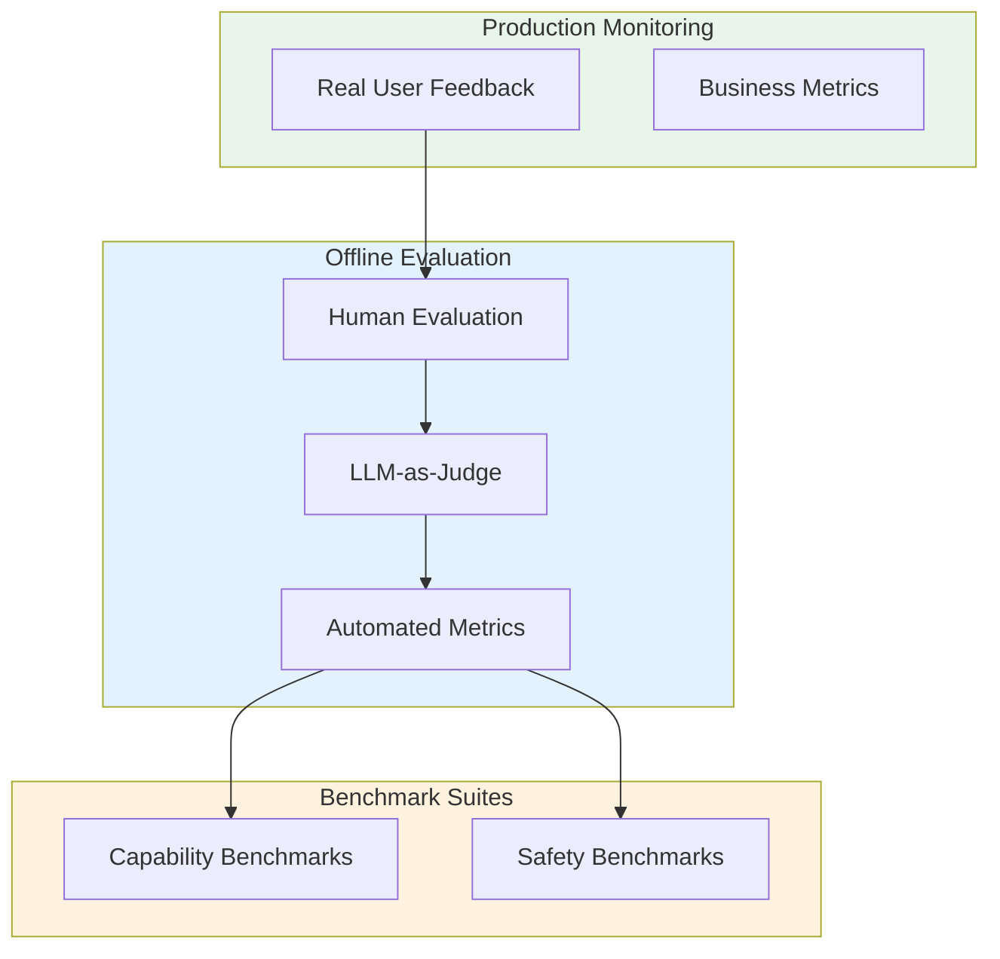
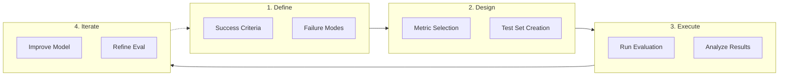

# Evaluation & Benchmarking

> **How to measure what matters in LLM systems**

---

## Overview

Evaluation is the cornerstone of building reliable LLM applications. This module covers the full spectrum of evaluation techniques, from automated metrics to human assessment, and from standard benchmarks to custom evaluation frameworks. Understanding evaluation deeply is critical for interviews because it demonstrates your ability to ship production-quality AI systems.

---

## Learning Objectives

By completing this module, you will be able to:

- **Design evaluation strategies** that combine automated metrics, LLM-as-judge, and human evaluation
- **Select appropriate benchmarks** for different capability assessments (reasoning, coding, safety)
- **Detect and mitigate hallucinations** using multiple verification techniques
- **Build calibrated LLM judges** that correlate with human preferences
- **Implement production monitoring** with the right balance of cost and coverage

---

## Module Overview

| Module | Focus | Key Concepts |
|--------|-------|--------------|
| [Evaluation Taxonomy](./evaluation-taxonomy) | Classification of evaluation types | Capability vs safety, intrinsic vs extrinsic |
| [Automated Metrics](./automated-metrics) | Quantitative measurement | Perplexity, BLEU, ROUGE, BERTScore |
| [LLM-as-Judge](./llm-as-judge) | Using LLMs to evaluate LLMs | G-Eval, judge prompts, calibration |
| [Human Evaluation](./human-evaluation) | Gold standard assessment | Annotation, IAA, crowdsourcing |
| [Hallucination Detection](./hallucination-detection) | Factuality verification | Types, detection methods, mitigation |
| [Benchmarks](./benchmarks) | Standard evaluation suites | MMLU, HumanEval, GSM8K, MT-Bench |

---

## The Evaluation Stack

---

## Quick Reference: When to Use What

| Evaluation Type | When to Use | Cost | Reliability |
|----------------|-------------|------|-------------|
| **Automated Metrics** | Quick iteration, CI/CD | Low | Variable |
| **LLM-as-Judge** | Scalable quality assessment | Medium | Good with calibration |
| **Human Evaluation** | Gold standard, fine-grained | High | Highest |
| **Benchmarks** | Capability comparison | Low | Task-specific |
| **A/B Testing** | Production decisions | Medium | Highest for business |

---

## Evaluation Design Framework

---

## Interview Strategy

::: info Key Interview Topics
1. **Metric selection**: Why use ROUGE vs BERTScore vs LLM-as-judge?
2. **Benchmark limitations**: What can MMLU not tell you?
3. **Hallucination handling**: How do you detect and prevent them?
4. **Evaluation at scale**: How do you balance cost and coverage?
5. **Custom benchmarks**: When and how to build your own?
:::

### Common Interview Questions

| Topic | Sample Question |
|-------|-----------------|
| Metrics | "How would you evaluate a summarization system?" |
| LLM-Judge | "What are the failure modes of using GPT-4 to evaluate outputs?" |
| Benchmarks | "MMLU scores are improving - does that mean AGI is near?" |
| Hallucination | "How would you build a hallucination detection system?" |
| Trade-offs | "Human eval is expensive. How do you decide when to use it?" |

---

## Prerequisites

Before diving into evaluation, ensure you understand:

- Basic NLP concepts (tokenization, embeddings)
- LLM fundamentals (prompting, generation)
- Statistical concepts (correlation, agreement metrics)
- Basic ML evaluation (precision, recall, F1)

---

## Sources

- Liang et al., "Holistic Evaluation of Language Models" (HELM), 2022
- Zheng et al., "Judging LLM-as-a-Judge with MT-Bench and Chatbot Arena", 2023
- Hendrycks et al., "Measuring Massive Multitask Language Understanding" (MMLU), 2020
- Ji et al., "Survey of Hallucination in Natural Language Generation", 2023
