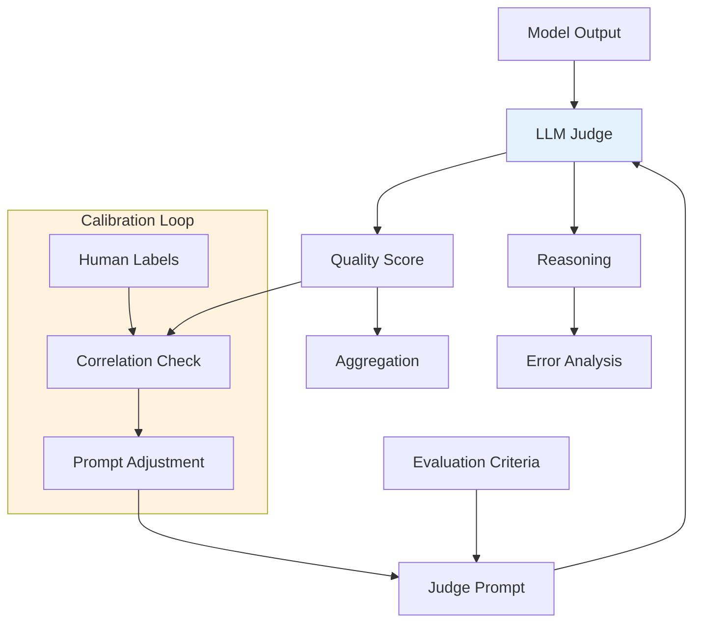
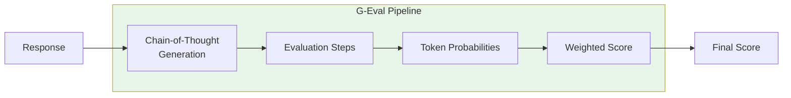
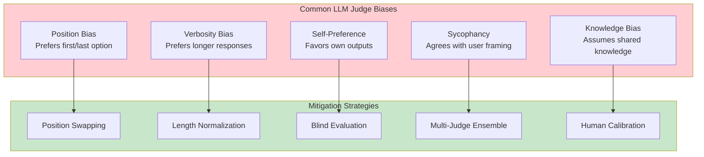

# LLM-as-Judge

> **Using language models to evaluate language models**

---

## Learning Objectives

- **Design effective judge prompts** that produce consistent, calibrated evaluations
- **Implement G-Eval** and other structured evaluation frameworks
- **Understand and mitigate judge biases** (position bias, verbosity bias, self-preference)
- **Calibrate LLM judges** against human preferences
- **Build multi-judge systems** for robust evaluation

---

## Overview

LLM-as-judge bridges the gap between fast automated metrics and expensive human evaluation. By using capable LLMs to assess output quality, we can achieve human-like evaluation at scale. However, LLM judges have their own biases and failure modes that must be understood and mitigated.



---

## Judge Prompt Design

The quality of LLM-as-judge depends heavily on prompt design.

### Basic Judge Prompt Structure

```python
BASIC_JUDGE_PROMPT = """
You are an expert evaluator assessing the quality of AI-generated responses.

## Task
Evaluate the following response based on the given criteria.

## Criteria
{criteria}

## Question/Prompt
{question}

## Response to Evaluate
{response}

## Instructions
1. Analyze the response against each criterion
2. Provide specific evidence for your assessment
3. Give a score from 1-5 for each criterion
4. Provide an overall score

## Output Format
For each criterion:
- Criterion: [name]
- Evidence: [specific quotes or observations]
- Score: [1-5]

Overall Score: [1-5]
Overall Reasoning: [brief explanation]
"""

def create_judge_prompt(
    question: str,
    response: str,
    criteria: list[str]
) -> str:
    """Create a judge prompt for evaluation."""
    criteria_text = "\n".join(f"- {c}" for c in criteria)
    return BASIC_JUDGE_PROMPT.format(
        criteria=criteria_text,
        question=question,
        response=response
    )
```

### Pairwise Comparison Prompt

```python
PAIRWISE_PROMPT = """
You are comparing two AI responses to determine which is better.

## Question
{question}

## Response A
{response_a}

## Response B
{response_b}

## Evaluation Criteria
{criteria}

## Instructions
1. Analyze both responses against the criteria
2. Identify specific strengths and weaknesses of each
3. Determine which response is better overall
4. If they are equal, say "Tie"

## Output Format
Analysis of Response A: [analysis]
Analysis of Response B: [analysis]
Winner: [A/B/Tie]
Reasoning: [explanation]
Confidence: [High/Medium/Low]
"""

def pairwise_evaluate(
    judge_model,
    question: str,
    response_a: str,
    response_b: str,
    criteria: list[str]
) -> dict:
    """Perform pairwise comparison of two responses."""
    prompt = PAIRWISE_PROMPT.format(
        question=question,
        response_a=response_a,
        response_b=response_b,
        criteria="\n".join(f"- {c}" for c in criteria)
    )

    result = judge_model.generate(prompt)

    return parse_pairwise_result(result)
```

---

## G-Eval: Structured Evaluation Framework

G-Eval uses chain-of-thought and form-filling for more reliable evaluation.



```python
from typing import Optional
import numpy as np

class GEvalEvaluator:
    """
    G-Eval implementation for structured LLM evaluation.

    Reference: Liu et al., "G-Eval: NLG Evaluation using GPT-4
               with Better Human Alignment"
    """

    GEVAL_TEMPLATE = """
You will be given a summary written for a news article.

Your task is to rate the summary on one metric.

Please make sure you read and understand these instructions carefully.

## Evaluation Criteria
{criteria_name} ({score_range}): {criteria_description}

## Evaluation Steps
{evaluation_steps}

## Source Document
{source}

## Summary
{summary}

## Evaluation Form
Following the evaluation steps, evaluate the summary.

{criteria_name} (1-5):
"""

    CRITERIA = {
        "coherence": {
            "description": "The quality of all sentences collectively, to fit together and sound natural. Consider the structure and organization of the summary.",
            "steps": """
1. Read the summary carefully
2. Check if ideas flow logically from one to the next
3. Verify there are no abrupt topic changes
4. Assess if the summary reads as a unified piece
"""
        },
        "consistency": {
            "description": "The factual alignment between the summary and the source document. Penalize summaries that contain hallucinated facts.",
            "steps": """
1. Identify key facts in the summary
2. Cross-check each fact against the source
3. Note any information not supported by the source
4. Assess overall factual accuracy
"""
        },
        "fluency": {
            "description": "The quality of individual sentences, whether they are well-written and grammatically correct.",
            "steps": """
1. Read each sentence individually
2. Check for grammatical errors
3. Assess word choice and clarity
4. Evaluate sentence structure variety
"""
        },
        "relevance": {
            "description": "Selection of important content from the source. Penalize summaries that contain redundant or excess information.",
            "steps": """
1. Identify main topics in the source
2. Check if summary covers key points
3. Note any irrelevant information included
4. Assess if important information is missing
"""
        }
    }

    def __init__(self, model, use_token_probs: bool = True):
        self.model = model
        self.use_token_probs = use_token_probs

    def evaluate(
        self,
        source: str,
        summary: str,
        criterion: str = "coherence"
    ) -> dict:
        """Evaluate a summary using G-Eval."""
        if criterion not in self.CRITERIA:
            raise ValueError(f"Unknown criterion: {criterion}")

        criteria_info = self.CRITERIA[criterion]

        prompt = self.GEVAL_TEMPLATE.format(
            criteria_name=criterion.capitalize(),
            score_range="1-5",
            criteria_description=criteria_info["description"],
            evaluation_steps=criteria_info["steps"],
            source=source,
            summary=summary
        )

        if self.use_token_probs:
            # Get probability distribution over scores
            score = self._get_weighted_score(prompt)
        else:
            # Direct generation
            response = self.model.generate(prompt)
            score = self._parse_score(response)

        return {
            "criterion": criterion,
            "score": score,
            "prompt": prompt
        }

    def _get_weighted_score(self, prompt: str) -> float:
        """Get weighted score using token probabilities."""
        # Get logprobs for tokens 1-5
        token_probs = self.model.get_next_token_probs(
            prompt,
            tokens=["1", "2", "3", "4", "5"]
        )

        # Normalize probabilities
        probs = np.array([token_probs.get(str(i), 0) for i in range(1, 6)])
        probs = probs / probs.sum()

        # Weighted average
        scores = np.array([1, 2, 3, 4, 5])
        weighted_score = np.sum(probs * scores)

        return weighted_score

    def _parse_score(self, response: str) -> float:
        """Parse score from model response."""
        import re
        match = re.search(r'[1-5]', response)
        if match:
            return float(match.group())
        return 3.0  # Default to middle score

    def evaluate_all_criteria(
        self,
        source: str,
        summary: str
    ) -> dict:
        """Evaluate summary on all criteria."""
        results = {}
        for criterion in self.CRITERIA:
            results[criterion] = self.evaluate(source, summary, criterion)

        # Compute aggregate
        scores = [r["score"] for r in results.values()]
        results["aggregate"] = {
            "score": np.mean(scores),
            "std": np.std(scores)
        }

        return results
```

---

## Understanding Judge Biases

LLM judges exhibit systematic biases that must be addressed.



### Measuring and Mitigating Position Bias

```python
from typing import Callable
import random

class PositionBiasMitigator:
    """Detect and mitigate position bias in pairwise comparisons."""

    def __init__(self, judge_fn: Callable):
        self.judge_fn = judge_fn

    def evaluate_with_swap(
        self,
        question: str,
        response_a: str,
        response_b: str,
        n_swaps: int = 2
    ) -> dict:
        """
        Evaluate with position swapping to detect bias.

        Returns both the debiased result and bias metrics.
        """
        results = []

        for i in range(n_swaps):
            # Original order
            result_ab = self.judge_fn(question, response_a, response_b)

            # Swapped order
            result_ba = self.judge_fn(question, response_b, response_a)
            # Invert the swapped result
            result_ba_inverted = self._invert_result(result_ba)

            results.append({
                "original": result_ab,
                "swapped_inverted": result_ba_inverted
            })

        # Analyze consistency
        agreement_rate = self._compute_agreement(results)

        # Aggregate results
        if agreement_rate > 0.7:
            # High agreement - use majority vote
            final_winner = self._majority_vote(results)
        else:
            # Low agreement - likely position bias or true tie
            final_winner = "Tie"

        return {
            "winner": final_winner,
            "agreement_rate": agreement_rate,
            "position_bias_detected": agreement_rate < 0.5,
            "raw_results": results
        }

    def _invert_result(self, result: dict) -> dict:
        """Invert A/B in result."""
        winner_map = {"A": "B", "B": "A", "Tie": "Tie"}
        return {
            **result,
            "winner": winner_map.get(result["winner"], result["winner"])
        }

    def _compute_agreement(self, results: list) -> float:
        """Compute agreement rate between original and swapped."""
        agreements = 0
        total = 0

        for r in results:
            if r["original"]["winner"] == r["swapped_inverted"]["winner"]:
                agreements += 1
            total += 1

        return agreements / total if total > 0 else 0

    def _majority_vote(self, results: list) -> str:
        """Get majority vote across all evaluations."""
        from collections import Counter

        all_winners = []
        for r in results:
            all_winners.append(r["original"]["winner"])
            all_winners.append(r["swapped_inverted"]["winner"])

        counts = Counter(all_winners)
        return counts.most_common(1)[0][0]


# Example usage
def simple_judge(question, resp_a, resp_b):
    # Placeholder for actual judge call
    return {"winner": "A", "confidence": "High"}

mitigator = PositionBiasMitigator(simple_judge)
result = mitigator.evaluate_with_swap(
    question="What is machine learning?",
    response_a="ML is a subset of AI...",
    response_b="Machine learning involves..."
)
```

### Verbosity Bias Detection

```python
def detect_verbosity_bias(
    judge_fn: Callable,
    test_cases: list[dict],
    length_threshold: float = 1.5
) -> dict:
    """
    Detect if judge prefers longer responses.

    Args:
        judge_fn: Judge function
        test_cases: List of dicts with 'question', 'short_response', 'long_response'
        length_threshold: Ratio above which 'long' is significantly longer
    """
    prefers_longer = 0
    prefers_shorter = 0
    ties = 0

    for case in test_cases:
        short_len = len(case["short_response"])
        long_len = len(case["long_response"])

        # Only test when length difference is significant
        if long_len / short_len < length_threshold:
            continue

        result = judge_fn(
            case["question"],
            case["short_response"],
            case["long_response"]
        )

        if result["winner"] == "B":  # Long response
            prefers_longer += 1
        elif result["winner"] == "A":  # Short response
            prefers_shorter += 1
        else:
            ties += 1

    total = prefers_longer + prefers_shorter + ties

    return {
        "prefers_longer_rate": prefers_longer / total if total > 0 else 0,
        "prefers_shorter_rate": prefers_shorter / total if total > 0 else 0,
        "tie_rate": ties / total if total > 0 else 0,
        "verbosity_bias_detected": (prefers_longer / total) > 0.6 if total > 0 else False,
        "sample_size": total
    }
```

---

## Multi-Judge Ensemble

Combining multiple judges improves reliability.

```python
from dataclasses import dataclass
from typing import Optional
import numpy as np

@dataclass
class JudgeConfig:
    name: str
    model: str
    weight: float = 1.0
    prompt_template: str = "default"

class MultiJudgeEvaluator:
    """Ensemble of multiple LLM judges for robust evaluation."""

    def __init__(self, judges: list[JudgeConfig]):
        self.judges = judges
        self._load_models()

    def _load_models(self):
        """Load all judge models."""
        self.models = {}
        for judge in self.judges:
            # Placeholder for actual model loading
            self.models[judge.name] = self._create_model(judge.model)

    def _create_model(self, model_name: str):
        """Create model instance."""
        # Implementation depends on your model serving setup
        pass

    def evaluate(
        self,
        question: str,
        response: str,
        criteria: list[str]
    ) -> dict:
        """Get evaluation from all judges and aggregate."""
        individual_results = {}

        for judge in self.judges:
            result = self._single_judge_eval(
                judge,
                question,
                response,
                criteria
            )
            individual_results[judge.name] = result

        # Weighted aggregation
        aggregated = self._aggregate_results(individual_results)

        # Compute agreement metrics
        agreement = self._compute_inter_judge_agreement(individual_results)

        return {
            "individual": individual_results,
            "aggregated": aggregated,
            "agreement": agreement
        }

    def _single_judge_eval(
        self,
        judge: JudgeConfig,
        question: str,
        response: str,
        criteria: list[str]
    ) -> dict:
        """Run single judge evaluation."""
        model = self.models[judge.name]
        prompt = self._create_prompt(judge.prompt_template, question, response, criteria)

        # Get evaluation
        result = model.generate(prompt)
        parsed = self._parse_result(result)

        return {
            "score": parsed["score"],
            "reasoning": parsed["reasoning"],
            "raw_output": result
        }

    def _aggregate_results(self, results: dict) -> dict:
        """Aggregate results using weighted voting."""
        scores = []
        weights = []

        for judge in self.judges:
            if judge.name in results:
                scores.append(results[judge.name]["score"])
                weights.append(judge.weight)

        scores = np.array(scores)
        weights = np.array(weights)

        weighted_mean = np.average(scores, weights=weights)
        weighted_std = np.sqrt(np.average((scores - weighted_mean)**2, weights=weights))

        return {
            "mean_score": weighted_mean,
            "std_score": weighted_std,
            "min_score": np.min(scores),
            "max_score": np.max(scores)
        }

    def _compute_inter_judge_agreement(self, results: dict) -> dict:
        """Compute agreement between judges."""
        scores = [r["score"] for r in results.values()]

        # Pairwise agreement (within 1 point)
        agreements = 0
        pairs = 0
        for i, s1 in enumerate(scores):
            for s2 in scores[i+1:]:
                if abs(s1 - s2) <= 1:
                    agreements += 1
                pairs += 1

        return {
            "pairwise_agreement": agreements / pairs if pairs > 0 else 0,
            "score_range": max(scores) - min(scores),
            "high_agreement": (max(scores) - min(scores)) <= 1
        }

    def _create_prompt(self, template, question, response, criteria):
        """Create evaluation prompt."""
        # Implementation depends on template system
        pass

    def _parse_result(self, result):
        """Parse judge output."""
        # Implementation depends on output format
        pass
```

---

## Calibration Against Human Preferences

```python
from sklearn.metrics import cohen_kappa_score, spearmanr
import numpy as np

class JudgeCalibrator:
    """Calibrate LLM judge against human preferences."""

    def __init__(self, judge_fn: Callable):
        self.judge_fn = judge_fn
        self.calibration_data = []

    def add_calibration_sample(
        self,
        question: str,
        response: str,
        human_score: float,
        judge_score: Optional[float] = None
    ):
        """Add a calibration sample with human label."""
        if judge_score is None:
            judge_result = self.judge_fn(question, response)
            judge_score = judge_result["score"]

        self.calibration_data.append({
            "question": question,
            "response": response,
            "human_score": human_score,
            "judge_score": judge_score
        })

    def compute_calibration_metrics(self) -> dict:
        """Compute calibration quality metrics."""
        if len(self.calibration_data) < 10:
            return {"error": "Need at least 10 samples for calibration"}

        human_scores = [d["human_score"] for d in self.calibration_data]
        judge_scores = [d["judge_score"] for d in self.calibration_data]

        # Spearman correlation
        correlation, p_value = spearmanr(human_scores, judge_scores)

        # Cohen's Kappa (for ordinal agreement)
        # Round to integers for kappa calculation
        human_rounded = [round(s) for s in human_scores]
        judge_rounded = [round(s) for s in judge_scores]
        kappa = cohen_kappa_score(human_rounded, judge_rounded)

        # Mean absolute error
        mae = np.mean(np.abs(np.array(human_scores) - np.array(judge_scores)))

        # Bias detection
        mean_human = np.mean(human_scores)
        mean_judge = np.mean(judge_scores)
        systematic_bias = mean_judge - mean_human

        return {
            "spearman_correlation": correlation,
            "spearman_p_value": p_value,
            "cohens_kappa": kappa,
            "mae": mae,
            "systematic_bias": systematic_bias,
            "is_well_calibrated": correlation > 0.7 and abs(systematic_bias) < 0.5,
            "n_samples": len(self.calibration_data)
        }

    def get_calibration_curve(self, n_bins: int = 5) -> dict:
        """Get calibration curve data."""
        # Bin by judge score and compute average human score per bin
        bins = [[] for _ in range(n_bins)]

        for d in self.calibration_data:
            bin_idx = min(int(d["judge_score"] / 5 * n_bins), n_bins - 1)
            bins[bin_idx].append(d["human_score"])

        curve_data = []
        for i, bin_data in enumerate(bins):
            if bin_data:
                avg_judge = (i + 0.5) * (5 / n_bins)
                avg_human = np.mean(bin_data)
                curve_data.append({
                    "judge_score_bin": avg_judge,
                    "avg_human_score": avg_human,
                    "n_samples": len(bin_data)
                })

        return {"curve": curve_data}
```

---

## Interview Q&A

### Q1: "What are the main failure modes of LLM-as-judge, and how would you address them?"

**Strong Answer:**

"LLM judges have several systematic failure modes:

**1. Position Bias**: Judges often prefer responses in certain positions (usually first). I mitigate this by:
- Swapping response positions and aggregating
- Using multiple evaluation rounds with random ordering

**2. Verbosity Bias**: Longer responses often get higher scores regardless of quality. Solutions:
- Include explicit length-neutral instructions in prompts
- Normalize scores by response length in analysis
- Test with length-matched examples

**3. Self-Preference**: Models prefer outputs similar to their own style. Address by:
- Using diverse judge models (GPT-4, Claude, open-source)
- Blind evaluation without revealing model source

**4. Sycophancy**: Judges agree with framing in the prompt. Mitigate with:
- Neutral prompt framing
- Include negative examples in few-shot prompts

**5. Factuality Blindness**: Judges may miss hallucinations. I address this with:
- Explicit fact-checking instructions
- Source document grounding
- Separate factuality evaluation step

The key is never trusting a single judge evaluation - always use ensembles and calibrate against human labels."

---

### Q2: "How would you design a G-Eval style evaluation for a code generation task?"

**Strong Answer:**

"I'd adapt G-Eval's structured approach for code:

**1. Define criteria specific to code:**
- Correctness: Does the code produce expected output?
- Efficiency: Is the algorithmic complexity reasonable?
- Readability: Is the code well-structured and documented?
- Robustness: Does it handle edge cases?

**2. Create detailed evaluation steps for each criterion:**
```
Correctness Steps:
1. Identify the expected behavior from the problem statement
2. Trace through the code logic manually
3. Check boundary conditions
4. Verify output format matches requirements
```

**3. Use structured output:**
```
Correctness (1-5): [score]
Evidence: [specific code issues or confirmations]
Suggested Fix: [if applicable]
```

**4. Leverage token probabilities** for more reliable scores

**5. Calibrate against execution results** - if we can run the code, use pass/fail as ground truth for calibration

The unique aspect for code is that we often have objective correctness signals (test cases pass/fail), so I'd heavily weight calibration against these signals."

---

### Q3: "How would you build a human-LLM hybrid evaluation pipeline?"

**Strong Answer:**

"I'd build a tiered system that optimizes for both quality and cost:

**Tier 1: Automated Screening (100% coverage)**
- Basic checks: format, length, safety
- Automated metrics: BLEU, ROUGE for applicable tasks
- Filter obvious failures before LLM evaluation

**Tier 2: LLM-as-Judge (100% of passing Tier 1)**
- Multi-judge ensemble (GPT-4 + Claude)
- Position-swapped pairwise comparison
- Confidence scoring for each evaluation

**Tier 3: Human Evaluation (selective sampling)**
- Low-confidence LLM evaluations
- Random sample for calibration (5-10%)
- Edge cases and novel outputs
- Disagreements between judges

**Feedback Loop:**
- Track correlation between LLM and human evaluations
- Retrain/adjust judge prompts when correlation drops
- Expand human eval when entering new domains

**Key Metrics:**
- Cost per evaluation
- LLM-human agreement rate
- Time to evaluation
- Coverage of edge cases

This gives us the scalability of LLM judges while maintaining human oversight for quality and calibration."

---

## Summary Table

| Approach | When to Use | Strengths | Limitations |
|----------|-------------|-----------|-------------|
| **Single Judge** | Quick iteration | Fast, simple | Bias-prone |
| **Position Swap** | Pairwise comparison | Detects position bias | 2x cost |
| **G-Eval** | Structured criteria | Reliable, interpretable | Complex setup |
| **Multi-Judge** | High-stakes decisions | Robust, diverse | Expensive |
| **Human Calibrated** | Production systems | Aligned with users | Ongoing cost |

---

## Sources

- Liu et al., "G-Eval: NLG Evaluation using GPT-4 with Better Human Alignment", 2023
- Zheng et al., "Judging LLM-as-a-Judge with MT-Bench and Chatbot Arena", 2023
- Wang et al., "Large Language Models are not Fair Evaluators", 2023
- Dubois et al., "AlpacaFarm: A Simulation Framework for Methods that Learn from Human Feedback", 2023
