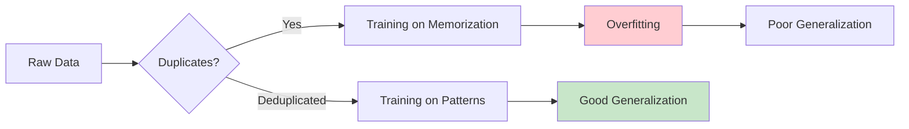
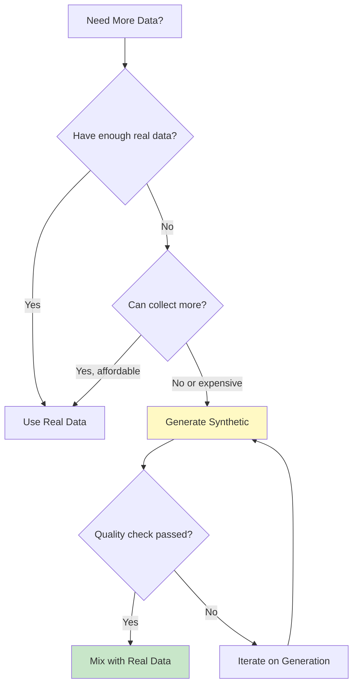
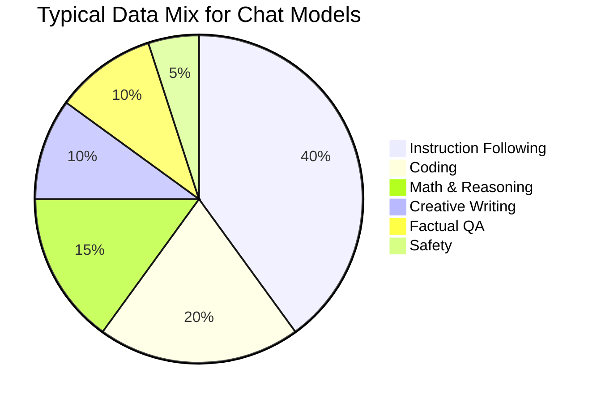
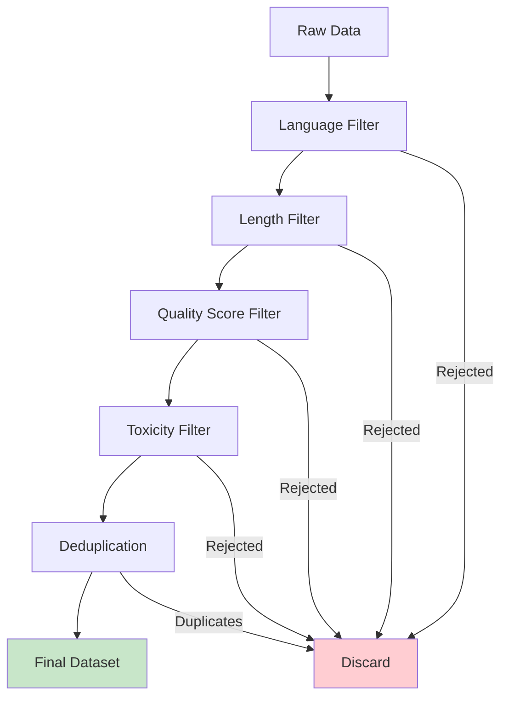

# Data Preparation for Fine-Tuning

> **Quality data is the foundation of successful fine-tuning**

---

## Learning Objectives

- **Evaluate** data quality using systematic criteria and metrics
- **Implement** deduplication pipelines at scale
- **Generate** high-quality synthetic data using stronger models
- **Design** data mixing strategies for multi-task fine-tuning
- **Debug** data issues that manifest as training failures

---

## The Data Quality Hierarchy

```mermaid
pyramid
    title Data Quality Hierarchy
    "Diversity" : 5
    "Balance" : 4
    "Relevance" : 3
    "Accuracy" : 2
    "Cleanliness" : 1
```

::: info Core Principle
A small, high-quality dataset outperforms a large, noisy one. 10K curated examples often beat 100K scraped examples.
:::

---

## Data Quality Assessment

### Quality Dimensions

| Dimension | What It Measures | Red Flags |
|-----------|------------------|-----------|
| **Accuracy** | Factual correctness | Outdated info, hallucinations |
| **Relevance** | Task appropriateness | Off-topic examples |
| **Completeness** | Full, proper responses | Truncated, partial outputs |
| **Consistency** | Format uniformity | Mixed formats, styles |
| **Diversity** | Coverage breadth | Repetitive patterns |
| **Safety** | Harmful content absence | Toxic, biased content |

### Automated Quality Scoring

```python
from transformers import AutoModelForSequenceClassification, AutoTokenizer
import torch

class DataQualityScorer:
    """Score training examples on multiple quality dimensions"""

    def __init__(self):
        # Load quality classifiers
        self.coherence_model = self._load_model("coherence")
        self.relevance_model = self._load_model("relevance")
        self.toxicity_model = self._load_model("toxicity")

    def _load_model(self, task):
        """Load task-specific classifier"""
        model_map = {
            "coherence": "textattack/roberta-base-CoLA",
            "relevance": "cross-encoder/ms-marco-MiniLM-L-6-v2",
            "toxicity": "unitary/toxic-bert"
        }
        return AutoModelForSequenceClassification.from_pretrained(model_map.get(task, model_map["relevance"]))

    def score_example(self, instruction, response):
        """Score a single example on all dimensions"""
        scores = {}

        # Length-based heuristics
        scores["response_length"] = len(response.split())
        scores["length_appropriate"] = 20 < scores["response_length"] < 500

        # Coherence (simplified)
        scores["coherence"] = self._check_coherence(response)

        # Relevance to instruction
        scores["relevance"] = self._check_relevance(instruction, response)

        # Toxicity
        scores["toxicity"] = self._check_toxicity(response)

        # Overall score
        scores["overall"] = self._compute_overall(scores)

        return scores

    def _check_coherence(self, text):
        """Check text coherence using perplexity proxy"""
        # Simplified: check for repetition, grammar markers
        words = text.lower().split()
        if len(words) < 5:
            return 0.0
        unique_ratio = len(set(words)) / len(words)
        return min(1.0, unique_ratio * 1.5)

    def _check_relevance(self, instruction, response):
        """Check if response is relevant to instruction"""
        # Use embedding similarity
        from sentence_transformers import SentenceTransformer
        model = SentenceTransformer('all-MiniLM-L6-v2')
        emb_inst = model.encode(instruction)
        emb_resp = model.encode(response)
        similarity = cosine_similarity([emb_inst], [emb_resp])[0][0]
        return float(similarity)

    def _check_toxicity(self, text):
        """Check for toxic content (return 1 = safe, 0 = toxic)"""
        # Simplified implementation
        toxic_keywords = ["hate", "kill", "stupid"]  # Extend with real list
        text_lower = text.lower()
        for keyword in toxic_keywords:
            if keyword in text_lower:
                return 0.5
        return 1.0

    def _compute_overall(self, scores):
        """Compute weighted overall score"""
        weights = {
            "length_appropriate": 0.2,
            "coherence": 0.3,
            "relevance": 0.3,
            "toxicity": 0.2
        }
        total = sum(
            scores.get(k, 0) * v
            for k, v in weights.items()
            if isinstance(scores.get(k), (int, float))
        )
        return total


# Usage
scorer = DataQualityScorer()
scores = scorer.score_example(
    instruction="Explain machine learning",
    response="Machine learning is a subset of AI..."
)
```

---

## Deduplication

### Why Deduplication Matters



### Deduplication Levels

| Level | What It Removes | Method |
|-------|-----------------|--------|
| **Exact** | Identical strings | Hash-based |
| **Near** | Minor variations | MinHash/LSH |
| **Semantic** | Same meaning, different words | Embeddings |

### Implementation

```python
from datasketch import MinHash, MinHashLSH
from sentence_transformers import SentenceTransformer
import hashlib

class Deduplicator:
    """Multi-level deduplication pipeline"""

    def __init__(self, threshold=0.8):
        self.threshold = threshold
        self.seen_hashes = set()
        self.lsh = MinHashLSH(threshold=threshold, num_perm=128)
        self.embedding_model = SentenceTransformer('all-MiniLM-L6-v2')

    def exact_dedup(self, texts):
        """Remove exact duplicates using MD5 hash"""
        unique_texts = []
        for text in texts:
            text_hash = hashlib.md5(text.encode()).hexdigest()
            if text_hash not in self.seen_hashes:
                self.seen_hashes.add(text_hash)
                unique_texts.append(text)
        return unique_texts

    def near_dedup(self, texts, key_field="text"):
        """Remove near-duplicates using MinHash LSH"""
        unique_texts = []

        for i, text in enumerate(texts):
            # Create MinHash
            minhash = self._create_minhash(text)

            # Check for near-duplicates
            duplicates = self.lsh.query(minhash)

            if not duplicates:
                self.lsh.insert(str(i), minhash)
                unique_texts.append(text)

        return unique_texts

    def _create_minhash(self, text, num_perm=128):
        """Create MinHash signature for text"""
        minhash = MinHash(num_perm=num_perm)
        # Use word n-grams
        words = text.lower().split()
        for i in range(len(words) - 2):
            ngram = " ".join(words[i:i+3])
            minhash.update(ngram.encode('utf-8'))
        return minhash

    def semantic_dedup(self, texts, threshold=0.95):
        """Remove semantically duplicate texts using embeddings"""
        if len(texts) == 0:
            return texts

        # Compute embeddings
        embeddings = self.embedding_model.encode(texts)

        # Find clusters of similar texts
        from sklearn.cluster import AgglomerativeClustering
        clustering = AgglomerativeClustering(
            n_clusters=None,
            distance_threshold=1 - threshold,
            metric="cosine",
            linkage="average"
        )
        labels = clustering.fit_predict(embeddings)

        # Keep one example per cluster (first one)
        unique_texts = []
        seen_clusters = set()
        for text, label in zip(texts, labels):
            if label not in seen_clusters:
                seen_clusters.add(label)
                unique_texts.append(text)

        return unique_texts

    def full_pipeline(self, texts):
        """Run complete deduplication pipeline"""
        print(f"Starting with {len(texts)} examples")

        texts = self.exact_dedup(texts)
        print(f"After exact dedup: {len(texts)}")

        texts = self.near_dedup(texts)
        print(f"After near dedup: {len(texts)}")

        texts = self.semantic_dedup(texts)
        print(f"After semantic dedup: {len(texts)}")

        return texts


# Usage
deduplicator = Deduplicator(threshold=0.8)
unique_data = deduplicator.full_pipeline(raw_texts)
```

---

## Synthetic Data Generation

### When to Use Synthetic Data



### Generation Strategies

#### 1. Prompt-Based Generation

```python
from openai import OpenAI

def generate_synthetic_examples(
    seed_examples: list,
    num_to_generate: int,
    task_description: str,
    model: str = "gpt-4"
):
    """Generate synthetic training examples"""
    client = OpenAI()

    generated = []

    prompt_template = """You are generating training data for fine-tuning a language model.

Task: {task_description}

Here are some example input-output pairs:
{examples}

Generate {num} new, diverse examples following the same format.
Each example should be on a new line with the format:
Input: [input text]
Output: [output text]

Make sure examples are:
1. Diverse in content and phrasing
2. Realistic and natural
3. Following the same quality standards as the examples"""

    while len(generated) < num_to_generate:
        # Sample seed examples
        sampled = random.sample(seed_examples, min(5, len(seed_examples)))
        examples_text = "\n\n".join([
            f"Input: {ex['input']}\nOutput: {ex['output']}"
            for ex in sampled
        ])

        response = client.chat.completions.create(
            model=model,
            messages=[{
                "role": "user",
                "content": prompt_template.format(
                    task_description=task_description,
                    examples=examples_text,
                    num=10
                )
            }],
            temperature=0.8,
            max_tokens=2000
        )

        # Parse generated examples
        new_examples = parse_generated_examples(
            response.choices[0].message.content
        )

        # Quality filter
        for ex in new_examples:
            if is_quality_example(ex):
                generated.append(ex)

    return generated[:num_to_generate]
```

#### 2. Self-Instruct Pipeline

```python
def self_instruct_generation(
    model,
    tokenizer,
    seed_tasks: list,
    num_instructions: int = 1000
):
    """Generate diverse instruction data using the model itself"""

    generated_tasks = seed_tasks.copy()

    # Instruction generation prompt
    gen_prompt = """Generate a diverse set of instructions that a language model could complete.
These should cover various tasks like:
- Creative writing
- Question answering
- Analysis and reasoning
- Code generation
- Summarization
- Translation
- Etc.

Here are some examples:
{examples}

Generate 5 new, unique instructions (just the instructions, not the outputs):"""

    while len(generated_tasks) < num_instructions:
        # Sample examples
        examples = random.sample(generated_tasks, min(8, len(generated_tasks)))
        examples_text = "\n".join([f"- {t['instruction']}" for t in examples])

        # Generate new instructions
        inputs = tokenizer(
            gen_prompt.format(examples=examples_text),
            return_tensors="pt"
        ).to(model.device)

        outputs = model.generate(
            **inputs,
            max_new_tokens=500,
            temperature=0.9,
            do_sample=True
        )

        new_instructions = parse_instructions(
            tokenizer.decode(outputs[0], skip_special_tokens=True)
        )

        # Generate input/output for each instruction
        for instruction in new_instructions:
            if not is_duplicate(instruction, generated_tasks):
                io_pair = generate_io(model, tokenizer, instruction)
                generated_tasks.append({
                    "instruction": instruction,
                    **io_pair
                })

    return generated_tasks
```

#### 3. Evol-Instruct (WizardLM approach)

```python
def evolve_instruction(instruction, evolution_type):
    """Evolve instruction to increase complexity/diversity"""

    evolution_prompts = {
        "add_constraints": f"""Rewrite this instruction by adding constraints or requirements:
Original: {instruction}
Evolved (with new constraints):""",

        "deepen": f"""Rewrite this instruction to require deeper reasoning:
Original: {instruction}
Evolved (more complex):""",

        "concretize": f"""Rewrite this instruction with more specific details:
Original: {instruction}
Evolved (more specific):""",

        "increase_steps": f"""Rewrite this instruction to require more steps:
Original: {instruction}
Evolved (multi-step):""",

        "rephrase": f"""Rephrase this instruction while keeping the same meaning:
Original: {instruction}
Rephrased:"""
    }

    prompt = evolution_prompts.get(evolution_type, evolution_prompts["rephrase"])
    evolved = llm_generate(prompt)

    return evolved


def evol_instruct_pipeline(seed_instructions, num_evolutions=3):
    """Apply evol-instruct to expand dataset"""
    all_instructions = seed_instructions.copy()

    evolution_types = ["add_constraints", "deepen", "concretize",
                      "increase_steps", "rephrase"]

    for instruction in seed_instructions:
        for _ in range(num_evolutions):
            evo_type = random.choice(evolution_types)
            evolved = evolve_instruction(instruction, evo_type)
            if is_valid_instruction(evolved):
                all_instructions.append(evolved)

    return all_instructions
```

---

## Data Mixing Strategies

### Mixing Ratios



### Implementation

```python
from datasets import interleave_datasets, concatenate_datasets

def create_data_mixture(
    datasets: dict,
    mixing_strategy: str = "proportional",
    temperature: float = 1.0,
    target_size: int = None
):
    """Create a mixed dataset from multiple sources"""

    if mixing_strategy == "proportional":
        # Sample proportional to dataset size
        total = sum(len(d) for d in datasets.values())
        probabilities = {k: len(v) / total for k, v in datasets.items()}

    elif mixing_strategy == "equal":
        # Equal sampling from each dataset
        probabilities = {k: 1.0 / len(datasets) for k in datasets}

    elif mixing_strategy == "temperature":
        # Temperature-scaled sampling (higher T = more uniform)
        sizes = {k: len(v) for k, v in datasets.items()}
        total = sum(s ** (1/temperature) for s in sizes.values())
        probabilities = {k: (s ** (1/temperature)) / total
                        for k, s in sizes.items()}

    elif mixing_strategy == "manual":
        # Manually specified ratios
        probabilities = {
            "instruction": 0.4,
            "coding": 0.2,
            "math": 0.15,
            "creative": 0.1,
            "factual": 0.1,
            "safety": 0.05,
        }

    # Interleave datasets
    dataset_list = list(datasets.values())
    prob_list = [probabilities[k] for k in datasets.keys()]

    mixed = interleave_datasets(
        dataset_list,
        probabilities=prob_list,
        seed=42,
        stopping_strategy="all_exhausted"
    )

    if target_size:
        mixed = mixed.shuffle(seed=42).select(range(min(target_size, len(mixed))))

    return mixed


# Example usage
datasets = {
    "instruction": load_dataset("dolly", split="train"),
    "coding": load_dataset("code_alpaca", split="train"),
    "math": load_dataset("gsm8k", "main", split="train"),
}

mixed_dataset = create_data_mixture(
    datasets,
    mixing_strategy="temperature",
    temperature=2.0  # More uniform mixing
)
```

### Domain Weighting

```python
def compute_domain_weights(
    validation_performance: dict,
    target_performance: dict
):
    """Compute domain weights based on performance gaps"""
    weights = {}

    for domain in validation_performance:
        current = validation_performance[domain]
        target = target_performance[domain]

        # Higher weight for domains with larger gaps
        gap = max(0, target - current)
        weights[domain] = 1.0 + gap * 2.0  # Scale factor

    # Normalize
    total = sum(weights.values())
    return {k: v / total for k, v in weights.items()}


# Example
validation_perf = {"coding": 0.6, "math": 0.4, "writing": 0.8}
target_perf = {"coding": 0.8, "math": 0.7, "writing": 0.85}

weights = compute_domain_weights(validation_perf, target_perf)
# Result: more weight on math (bigger gap), less on writing
```

---

## Data Filtering Pipeline



### Complete Filtering Pipeline

```python
class DataFilterPipeline:
    """Complete data filtering pipeline for fine-tuning"""

    def __init__(self, config=None):
        self.config = config or {
            "min_length": 20,
            "max_length": 2048,
            "min_quality_score": 0.7,
            "max_toxicity": 0.3,
            "dedup_threshold": 0.8,
            "language": "en"
        }

        self.quality_scorer = DataQualityScorer()
        self.deduplicator = Deduplicator(self.config["dedup_threshold"])

    def filter_language(self, examples):
        """Filter to target language"""
        from langdetect import detect

        filtered = []
        for ex in examples:
            try:
                lang = detect(ex["text"][:500])
                if lang == self.config["language"]:
                    filtered.append(ex)
            except:
                pass  # Skip if detection fails
        return filtered

    def filter_length(self, examples):
        """Filter by token/word length"""
        filtered = []
        for ex in examples:
            length = len(ex["text"].split())
            if self.config["min_length"] <= length <= self.config["max_length"]:
                filtered.append(ex)
        return filtered

    def filter_quality(self, examples):
        """Filter by quality score"""
        filtered = []
        for ex in examples:
            scores = self.quality_scorer.score_example(
                ex.get("instruction", ""),
                ex.get("response", ex.get("text", ""))
            )
            if scores["overall"] >= self.config["min_quality_score"]:
                ex["quality_score"] = scores["overall"]
                filtered.append(ex)
        return filtered

    def filter_toxicity(self, examples):
        """Remove toxic content"""
        from detoxify import Detoxify

        model = Detoxify('original')
        filtered = []

        for ex in examples:
            results = model.predict(ex["text"])
            max_toxicity = max(results.values())
            if max_toxicity < self.config["max_toxicity"]:
                filtered.append(ex)

        return filtered

    def run_pipeline(self, examples):
        """Run complete filtering pipeline"""
        print(f"Starting with {len(examples)} examples")

        examples = self.filter_language(examples)
        print(f"After language filter: {len(examples)}")

        examples = self.filter_length(examples)
        print(f"After length filter: {len(examples)}")

        examples = self.filter_quality(examples)
        print(f"After quality filter: {len(examples)}")

        examples = self.filter_toxicity(examples)
        print(f"After toxicity filter: {len(examples)}")

        texts = [ex["text"] for ex in examples]
        unique_texts = self.deduplicator.full_pipeline(texts)
        # Map kept texts back to their example dicts (first occurrence wins)
        text_to_example = {}
        for ex in examples:
            text_to_example.setdefault(ex["text"], ex)
        examples = [text_to_example[text] for text in unique_texts]
        print(f"After deduplication: {len(examples)}")

        return examples
```

---

## Interview Q&A

### Q1: How do you evaluate data quality for fine-tuning?

**Strong Answer:**
"I evaluate data quality across multiple dimensions:

1. **Accuracy**: Are the outputs factually correct? I sample-check manually and use automated fact-checking where possible.

2. **Relevance**: Do outputs match the instructions? I compute embedding similarity between instruction and response.

3. **Completeness**: Are responses truncated or incomplete? Length heuristics plus checking for ending patterns.

4. **Consistency**: Is the format uniform? Regex patterns and format validators.

5. **Diversity**: Is there enough variety? I cluster embeddings and ensure coverage.

6. **Safety**: Any toxic or harmful content? Run through content classifiers.

For automated scoring, I compute a weighted combination of these metrics and filter examples below a threshold. But I always manually review a sample because automated metrics miss nuances.

The key insight is that data quality issues compound during training. One wrong fact repeated 100 times becomes 'knowledge' the model is confident about."

---

### Q2: When and how do you use synthetic data for fine-tuning?

**Strong Answer:**
"I use synthetic data when:

1. **Insufficient real data**: Need 10K examples but only have 1K
2. **Coverage gaps**: Real data lacks certain scenarios
3. **Privacy constraints**: Can't use actual user data
4. **Cost constraints**: Human labeling is too expensive

For generation, I follow this process:

1. **Use a stronger model**: Generate with GPT-4 to train smaller models
2. **Seed with real examples**: Include 5-10 real examples in the generation prompt
3. **Request diversity explicitly**: Ask for varied topics, formats, complexity levels
4. **Quality filter aggressively**: 30-50% rejection rate is normal
5. **Human validation**: Review 1-2% of generated data manually
6. **Mix with real data**: Never use 100% synthetic; aim for 30-50% synthetic max

Key pitfalls to avoid:
- **Collapse to patterns**: Synthetic data can be repetitive; aggressive deduplication needed
- **Model artifacts**: Generated data inherits source model's biases
- **Quality degradation**: Models training on their own outputs can degrade

The evolution methods (Evol-Instruct) are particularly effective because they create complexity gradients that help model generalization."

---

### Q3: How do you decide on data mixing ratios for multi-task fine-tuning?

**Strong Answer:**
"Data mixing is crucial and I approach it systematically:

**Starting point**: Use temperature-based sampling from the T5 paper. With temperature T:
- Higher T (e.g., 2.0) = more uniform sampling
- Lower T (e.g., 0.5) = proportional to dataset size

**Iterative refinement**:
1. Train with initial mix
2. Evaluate on each task category separately
3. Increase weight for underperforming categories
4. Decrease weight for overperforming categories (or categories with diminishing returns)
5. Repeat

**Key considerations**:
- **Task difficulty**: Harder tasks need more data weight
- **Task similarity**: Similar tasks can share capacity; weight can be lower
- **Production importance**: Weight by how often users will use each capability
- **Safety data**: Always include safety examples (5-10%) regardless of other ratios

**Anti-patterns to avoid**:
- Over-weighting one task causes forgetting of others
- Under-weighting rare but important tasks
- Ignoring the distribution of real user queries

In practice, I often start with equal weighting, then shift based on validation performance gaps."

---

## Summary

| Topic | Key Point |
|-------|-----------|
| **Quality > Quantity** | 10K curated examples beat 100K noisy ones |
| **Deduplication** | Essential for generalization; use multi-level approach |
| **Synthetic Data** | Useful for augmentation; requires quality filtering |
| **Data Mixing** | Temperature sampling with iterative refinement |
| **Filtering Pipeline** | Language, length, quality, toxicity, dedup in sequence |
| **Validation** | Always manually review a sample; metrics miss nuances |

---

## Sources

- Lee et al., "Deduplicating Training Data Makes Language Models Better" (2022)
- Wang et al., "Self-Instruct: Aligning LLMs with Self-Generated Instructions" (2022)
- Xu et al., "WizardLM: Empowering Large Language Models to Follow Complex Instructions" (2023)
- Raffel et al., "Exploring the Limits of Transfer Learning with T5" (2020)
- Penedo et al., "The RefinedWeb Dataset for Falcon LLM" (2023)
- Together AI, "RedPajama: An Open Source Recipe for Reproducing LLaMA" (2023)
