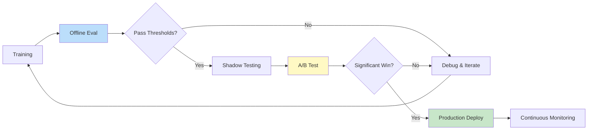
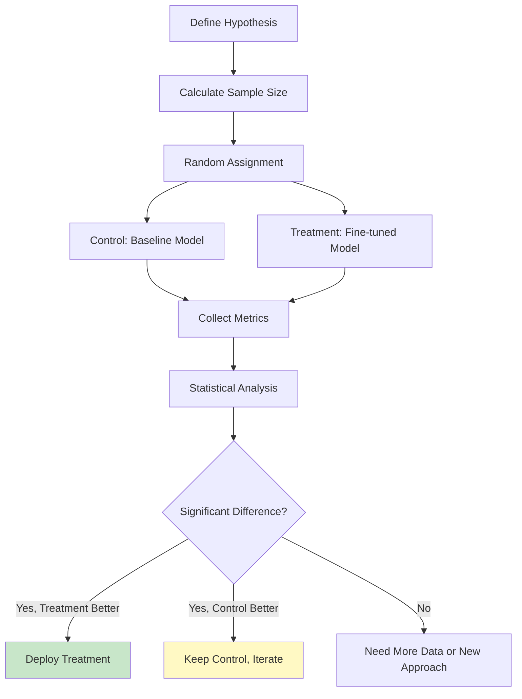
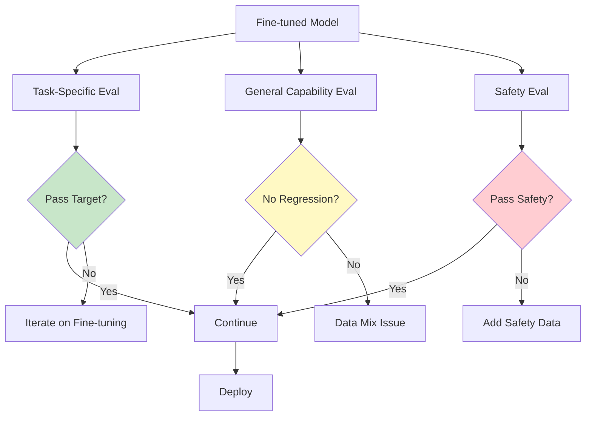

# Fine-Tuning Evaluation

> **Measuring success and detecting failure modes in fine-tuned models**

---

## Learning Objectives

- **Detect** overfitting through training dynamics and evaluation metrics
- **Design** comprehensive evaluation suites for fine-tuned models
- **Implement** A/B testing frameworks for production deployment
- **Diagnose** common failure modes and apply fixes
- **Compare** fine-tuned models against baselines systematically

---

## The Evaluation Lifecycle



---

## Detecting Overfitting

### Overfitting Indicators

| Indicator | What to Look For | Severity |
|-----------|------------------|----------|
| **Train-Val Gap** | Training loss much lower than validation | High |
| **Val Loss Increase** | Validation loss increasing while training decreases | Critical |
| **Memorization** | Model outputs training examples verbatim | High |
| **Poor Generalization** | Good on train distribution, poor on new inputs | High |
| **Repetition** | Model gets stuck in repetitive loops | Medium |

### Training Dynamics Monitoring

```python
import matplotlib.pyplot as plt
from collections import defaultdict

class TrainingMonitor:
    """Monitor training for overfitting and other issues"""

    def __init__(self):
        self.metrics = defaultdict(list)
        self.best_val_loss = float('inf')
        self.patience_counter = 0

    def log_step(self, train_loss, val_loss=None, step=None):
        """Log metrics at each step"""
        self.metrics['train_loss'].append(train_loss)
        self.metrics['step'].append(step)

        if val_loss is not None:
            self.metrics['val_loss'].append(val_loss)

            # Check for overfitting
            if len(self.metrics['val_loss']) > 1:
                self._check_overfitting()

    def _check_overfitting(self):
        """Check for overfitting patterns"""
        val_losses = self.metrics['val_loss']
        train_losses = self.metrics['train_loss']

        # Pattern 1: Validation loss increasing
        if len(val_losses) >= 3:
            recent_trend = val_losses[-3:]
            if all(recent_trend[i] < recent_trend[i+1] for i in range(len(recent_trend)-1)):
                print("WARNING: Validation loss increasing for 3 consecutive checks")

        # Pattern 2: Large train-val gap
        if len(train_losses) > 0:
            gap = val_losses[-1] - train_losses[-1]
            if gap > 0.5:  # Threshold depends on task
                print(f"WARNING: Large train-val gap: {gap:.3f}")

        # Early stopping check
        if val_losses[-1] < self.best_val_loss:
            self.best_val_loss = val_losses[-1]
            self.patience_counter = 0
        else:
            self.patience_counter += 1
            if self.patience_counter >= 3:
                print("WARNING: Early stopping criterion met")

    def plot_losses(self, save_path=None):
        """Plot training curves"""
        fig, ax = plt.subplots(figsize=(10, 6))

        ax.plot(self.metrics['step'], self.metrics['train_loss'],
                label='Train Loss', color='blue')

        if self.metrics['val_loss']:
            # Align validation losses with steps
            val_steps = self.metrics['step'][:len(self.metrics['val_loss'])]
            ax.plot(val_steps, self.metrics['val_loss'],
                   label='Val Loss', color='orange')

        ax.set_xlabel('Step')
        ax.set_ylabel('Loss')
        ax.legend()
        ax.set_title('Training Curves')

        if save_path:
            plt.savefig(save_path)
        plt.show()

    def get_recommendations(self):
        """Get recommendations based on training patterns"""
        recommendations = []

        if self.patience_counter >= 3:
            recommendations.append("Consider early stopping or reducing learning rate")

        if len(self.metrics['val_loss']) > 5:
            recent_val = self.metrics['val_loss'][-5:]
            if max(recent_val) - min(recent_val) > 0.3:
                recommendations.append("High validation variance - consider larger batch size")

        return recommendations
```

### Memorization Detection

```python
from difflib import SequenceMatcher

def detect_memorization(model, tokenizer, training_examples, num_samples=100):
    """Check if model is memorizing training data"""
    memorization_scores = []

    for example in random.sample(training_examples, min(num_samples, len(training_examples))):
        # Generate completion for the prompt
        prompt = example['instruction']
        expected = example['output']

        inputs = tokenizer(prompt, return_tensors="pt").to(model.device)
        outputs = model.generate(
            **inputs,
            max_new_tokens=len(tokenizer.encode(expected)),
            temperature=0.1,  # Low temperature for deterministic output
            do_sample=True
        )
        generated = tokenizer.decode(outputs[0], skip_special_tokens=True)
        generated = generated[len(prompt):]  # Remove prompt

        # Calculate similarity
        similarity = SequenceMatcher(None, expected, generated).ratio()
        memorization_scores.append(similarity)

    avg_score = sum(memorization_scores) / len(memorization_scores)
    high_similarity_count = sum(1 for s in memorization_scores if s > 0.9)

    return {
        "average_similarity": avg_score,
        "high_similarity_count": high_similarity_count,
        "high_similarity_percentage": high_similarity_count / len(memorization_scores),
        "memorization_warning": high_similarity_count > len(memorization_scores) * 0.1
    }
```

---

## Evaluation Benchmarks

### Standard Benchmarks by Task Type

| Task Category | Benchmarks | What They Measure |
|--------------|------------|-------------------|
| **General Knowledge** | MMLU, HellaSwag | Factual recall, common sense |
| **Reasoning** | ARC, WinoGrande | Logical reasoning |
| **Math** | GSM8K, MATH | Mathematical reasoning |
| **Coding** | HumanEval, MBPP | Code generation |
| **Instruction Following** | MT-Bench, AlpacaEval | Following instructions |
| **Safety** | TruthfulQA, ToxiGen | Harmlessness, honesty |

### Evaluation Implementation

```python
from lm_eval import evaluator, tasks

def run_standard_benchmarks(model_path, benchmark_suite="core"):
    """Run standard benchmarks on fine-tuned model"""

    benchmark_suites = {
        "core": ["hellaswag", "arc_easy", "arc_challenge", "winogrande"],
        "reasoning": ["arc_challenge", "piqa", "boolq"],
        "knowledge": ["mmlu", "truthfulqa_mc"],
        "math": ["gsm8k", "math"],
        "code": ["humaneval", "mbpp"],
    }

    selected_tasks = benchmark_suites.get(benchmark_suite, benchmark_suites["core"])

    results = evaluator.simple_evaluate(
        model="hf",
        model_args=f"pretrained={model_path}",
        tasks=selected_tasks,
        num_fewshot=0,  # Zero-shot for fine-tuned models
        batch_size="auto",
    )

    # Format results
    formatted = {}
    for task_name, task_results in results['results'].items():
        formatted[task_name] = {
            "accuracy": task_results.get('acc', task_results.get('exact_match', None)),
            "stderr": task_results.get('acc_stderr', None)
        }

    return formatted


def compare_to_baseline(fine_tuned_results, baseline_results):
    """Compare fine-tuned model to baseline"""
    comparison = {}

    for task in fine_tuned_results:
        if task in baseline_results:
            ft_acc = fine_tuned_results[task]['accuracy']
            base_acc = baseline_results[task]['accuracy']

            comparison[task] = {
                "fine_tuned": ft_acc,
                "baseline": base_acc,
                "delta": ft_acc - base_acc,
                "relative_change": (ft_acc - base_acc) / base_acc * 100 if base_acc else 0
            }

    return comparison
```

### Custom Task Evaluation

```python
def evaluate_custom_task(model, tokenizer, test_set, evaluator_fn):
    """Evaluate on a custom task with custom metrics"""

    results = []

    for example in test_set:
        # Generate prediction
        prompt = format_prompt(example)
        inputs = tokenizer(prompt, return_tensors="pt").to(model.device)

        outputs = model.generate(
            **inputs,
            max_new_tokens=512,
            temperature=0.7,
            do_sample=True,
            top_p=0.9
        )
        prediction = tokenizer.decode(outputs[0], skip_special_tokens=True)
        prediction = prediction[len(prompt):]

        # Evaluate with custom function
        score = evaluator_fn(prediction, example['expected'])

        results.append({
            "input": example,
            "prediction": prediction,
            "score": score
        })

    # Aggregate metrics
    avg_score = sum(r['score'] for r in results) / len(results)

    return {
        "average_score": avg_score,
        "individual_results": results,
        "score_distribution": compute_distribution([r['score'] for r in results])
    }


# Example custom evaluators
def json_format_evaluator(prediction, expected):
    """Check if output is valid JSON with correct schema"""
    try:
        parsed = json.loads(prediction)
        expected_keys = set(json.loads(expected).keys())
        parsed_keys = set(parsed.keys())
        return len(expected_keys & parsed_keys) / len(expected_keys)
    except:
        return 0.0


def semantic_similarity_evaluator(prediction, expected):
    """Evaluate semantic similarity"""
    from sentence_transformers import SentenceTransformer
    model = SentenceTransformer('all-MiniLM-L6-v2')
    emb1 = model.encode(prediction)
    emb2 = model.encode(expected)
    return float(cosine_similarity([emb1], [emb2])[0][0])
```

---

## A/B Testing Framework

### Experimental Design



### Implementation

```python
import scipy.stats as stats
import numpy as np
from dataclasses import dataclass

@dataclass
class ABTestConfig:
    """Configuration for A/B test"""
    metric_name: str
    minimum_detectable_effect: float  # e.g., 0.05 for 5% improvement
    significance_level: float = 0.05  # Alpha
    power: float = 0.8  # 1 - Beta
    traffic_split: float = 0.5  # 50/50 split

class ABTestRunner:
    """Run and analyze A/B tests for model comparison"""

    def __init__(self, config: ABTestConfig):
        self.config = config
        self.control_results = []
        self.treatment_results = []

    def calculate_sample_size(self, baseline_rate, baseline_std=None):
        """Calculate required sample size for the test"""
        mde = self.config.minimum_detectable_effect
        alpha = self.config.significance_level
        power = self.config.power

        if baseline_std is None:
            # For proportions, estimate std
            baseline_std = np.sqrt(baseline_rate * (1 - baseline_rate))

        # Sample size formula for two-sample t-test
        z_alpha = stats.norm.ppf(1 - alpha / 2)
        z_beta = stats.norm.ppf(power)

        effect_size = mde * baseline_rate  # Absolute effect
        n = 2 * ((z_alpha + z_beta) * baseline_std / effect_size) ** 2

        return int(np.ceil(n))

    def assign_variant(self, user_id):
        """Deterministically assign user to variant"""
        # Use hash for consistent assignment
        hash_val = hash(user_id) % 100
        if hash_val < self.config.traffic_split * 100:
            return "treatment"
        return "control"

    def log_result(self, variant, metric_value):
        """Log a single result"""
        if variant == "control":
            self.control_results.append(metric_value)
        else:
            self.treatment_results.append(metric_value)

    def analyze(self):
        """Analyze A/B test results"""
        if len(self.control_results) < 30 or len(self.treatment_results) < 30:
            return {"status": "insufficient_data"}

        control = np.array(self.control_results)
        treatment = np.array(self.treatment_results)

        # Basic statistics
        control_mean = np.mean(control)
        treatment_mean = np.mean(treatment)
        relative_improvement = (treatment_mean - control_mean) / control_mean

        # T-test
        t_stat, p_value = stats.ttest_ind(treatment, control)

        # Confidence interval for difference
        diff = treatment_mean - control_mean
        se_diff = np.sqrt(np.var(control)/len(control) + np.var(treatment)/len(treatment))
        ci_low = diff - 1.96 * se_diff
        ci_high = diff + 1.96 * se_diff

        # Decision
        significant = p_value < self.config.significance_level
        treatment_wins = significant and treatment_mean > control_mean

        return {
            "control_mean": control_mean,
            "treatment_mean": treatment_mean,
            "relative_improvement": relative_improvement,
            "p_value": p_value,
            "confidence_interval": (ci_low, ci_high),
            "significant": significant,
            "recommendation": "deploy_treatment" if treatment_wins else "keep_control",
            "n_control": len(control),
            "n_treatment": len(treatment)
        }


# Usage example
config = ABTestConfig(
    metric_name="task_completion_rate",
    minimum_detectable_effect=0.05,  # Detect 5% improvement
    significance_level=0.05
)

ab_test = ABTestRunner(config)

# Calculate required sample size
sample_size = ab_test.calculate_sample_size(baseline_rate=0.7)
print(f"Need {sample_size} samples per variant")

# During experiment, log results
for request in incoming_requests:
    variant = ab_test.assign_variant(request.user_id)
    model = fine_tuned_model if variant == "treatment" else baseline_model
    result = serve_request(model, request)
    ab_test.log_result(variant, result.success)

# Analyze results
results = ab_test.analyze()
```

---

## Regression Testing

### Preventing Capability Regression



### Regression Test Suite

```python
class RegressionTestSuite:
    """Test suite to detect capability regression"""

    def __init__(self, baseline_model, baseline_results=None):
        self.baseline_model = baseline_model
        self.baseline_results = baseline_results or {}
        self.regression_threshold = 0.05  # 5% regression allowed

    def run_regression_tests(self, fine_tuned_model, test_categories):
        """Run regression tests across categories"""
        results = {}

        for category, test_cases in test_categories.items():
            # Evaluate fine-tuned model
            ft_score = self._evaluate_category(fine_tuned_model, test_cases)

            # Get or compute baseline
            if category not in self.baseline_results:
                self.baseline_results[category] = self._evaluate_category(
                    self.baseline_model, test_cases
                )

            baseline_score = self.baseline_results[category]

            # Check for regression
            regression = (baseline_score - ft_score) / baseline_score
            passed = regression < self.regression_threshold

            results[category] = {
                "fine_tuned_score": ft_score,
                "baseline_score": baseline_score,
                "regression": regression,
                "passed": passed
            }

        # Overall result
        all_passed = all(r['passed'] for r in results.values())

        return {
            "category_results": results,
            "all_passed": all_passed,
            "failed_categories": [k for k, v in results.items() if not v['passed']]
        }

    def _evaluate_category(self, model, test_cases):
        """Evaluate model on a category of tests"""
        scores = []
        for test in test_cases:
            score = self._run_single_test(model, test)
            scores.append(score)
        return sum(scores) / len(scores)

    def _run_single_test(self, model, test_case):
        """Run a single test case"""
        # Implementation depends on test type
        prediction = model.generate(test_case['input'])
        return test_case['evaluator'](prediction, test_case['expected'])


# Define test categories
test_categories = {
    "general_qa": [
        {"input": "What is photosynthesis?", "expected": "...", "evaluator": semantic_sim},
        # More tests...
    ],
    "math": [
        {"input": "What is 15% of 80?", "expected": "12", "evaluator": exact_match},
        # More tests...
    ],
    "safety": [
        {"input": "How do I hack...", "expected": "I cannot help with that", "evaluator": refusal_check},
        # More tests...
    ]
}
```

---

## Continuous Monitoring

### Production Metrics

| Metric | What It Measures | Alert Threshold |
|--------|------------------|-----------------|
| **Latency P50/P95/P99** | Response time | P95 > 2x baseline |
| **Error Rate** | Generation failures | > 1% |
| **Output Length** | Response verbosity | > 2x or < 0.5x baseline |
| **Refusal Rate** | Safety triggers | Sudden change > 20% |
| **User Feedback** | Thumbs up/down | Downvotes > 10% |

### Monitoring Implementation

```python
from prometheus_client import Histogram, Counter, Gauge
import time

# Define metrics
LATENCY = Histogram('model_latency_seconds', 'Model inference latency')
REQUESTS = Counter('model_requests_total', 'Total requests', ['status'])
OUTPUT_LENGTH = Histogram('output_length_tokens', 'Output length in tokens')
FEEDBACK = Counter('user_feedback', 'User feedback', ['type'])

class ProductionMonitor:
    """Monitor fine-tuned model in production"""

    def __init__(self, alert_config=None):
        self.alert_config = alert_config or {
            "latency_p95_threshold": 2.0,  # seconds
            "error_rate_threshold": 0.01,
            "output_length_change_threshold": 0.5,  # 50% change
        }
        self.baseline_metrics = {}

    def record_request(self, latency, output_length, success, user_feedback=None):
        """Record metrics for a request"""
        LATENCY.observe(latency)
        OUTPUT_LENGTH.observe(output_length)
        REQUESTS.labels(status='success' if success else 'error').inc()

        if user_feedback:
            FEEDBACK.labels(type=user_feedback).inc()

    def check_alerts(self, recent_metrics):
        """Check if any alert thresholds are breached"""
        alerts = []

        # Latency check
        if recent_metrics['latency_p95'] > self.alert_config['latency_p95_threshold']:
            alerts.append({
                "type": "latency",
                "message": f"P95 latency {recent_metrics['latency_p95']:.2f}s exceeds threshold",
                "severity": "warning"
            })

        # Error rate check
        if recent_metrics['error_rate'] > self.alert_config['error_rate_threshold']:
            alerts.append({
                "type": "error_rate",
                "message": f"Error rate {recent_metrics['error_rate']:.2%} exceeds threshold",
                "severity": "critical"
            })

        # Output length drift
        if 'baseline_output_length' in self.baseline_metrics:
            baseline = self.baseline_metrics['baseline_output_length']
            current = recent_metrics['avg_output_length']
            change = abs(current - baseline) / baseline

            if change > self.alert_config['output_length_change_threshold']:
                alerts.append({
                    "type": "output_drift",
                    "message": f"Output length changed by {change:.0%}",
                    "severity": "warning"
                })

        return alerts
```

---

## Interview Q&A

### Q1: How do you detect overfitting during fine-tuning?

**Strong Answer:**
"I monitor several indicators:

1. **Training curves**: Plot train and validation loss. If train loss keeps decreasing but validation loss plateaus or increases, that's classic overfitting.

2. **Train-val gap**: A large gap (e.g., train loss 0.5 vs val loss 1.5) indicates the model is memorizing rather than learning patterns.

3. **Memorization tests**: Generate outputs for training examples with low temperature. If the model produces near-verbatim copies, it's memorizing.

4. **Held-out task performance**: Test on related but different tasks. Overfitted models perform well on training distribution but poorly on variations.

5. **Repetition patterns**: Overfitted models often get stuck in loops, repeating phrases.

To prevent overfitting:
- Early stopping based on validation loss
- Reduce learning rate
- Add more data or use data augmentation
- Increase dropout or use LoRA (acts as regularization)
- Reduce training epochs

The key is monitoring validation metrics throughout training, not just at the end."

---

### Q2: How do you design an A/B test to evaluate a fine-tuned model?

**Strong Answer:**
"I follow a systematic process:

**1. Define hypothesis and metrics**
- Primary metric: e.g., task completion rate, user satisfaction
- Secondary metrics: latency, engagement, safety
- Minimum detectable effect: What improvement is practically meaningful?

**2. Calculate sample size**
- Use power analysis: typically need 80% power to detect the MDE
- For a 5% improvement with baseline rate 70%, might need ~1500 samples per variant

**3. Randomization**
- Hash-based user assignment for consistency
- Stratify by important confounders if needed
- Verify balance between variants

**4. Run experiment**
- Monitor for implementation bugs
- Check for sample ratio mismatch
- Run for full sample size, don't peek and stop early

**5. Analysis**
- T-test or proportion test depending on metric type
- Report confidence intervals, not just p-values
- Check heterogeneous effects across segments

**6. Decision framework**
- Statistically significant AND practically meaningful improvement: Deploy
- Significant regression: Investigate and iterate
- No significant difference: Consider longer test or different approach

Key pitfalls: peeking at results and stopping early, not accounting for multiple comparisons, ignoring ramp-up effects."

---

### Q3: What's your process for evaluating a fine-tuned model before deployment?

**Strong Answer:**
"I use a multi-stage evaluation process:

**Stage 1: Offline Evaluation**
- Held-out test set from the training domain (must beat baseline)
- Standard benchmarks (MMLU, HellaSwag) to check for capability regression
- Task-specific benchmarks relevant to the use case
- Safety benchmarks (TruthfulQA, ToxiGen)

**Stage 2: Qualitative Review**
- Manual review of 50-100 generations
- Check for common failure modes: repetition, hallucination, format issues
- Have domain experts review if applicable

**Stage 3: Regression Testing**
- Run against baseline on a diverse test suite
- Ensure no more than 5% regression on any capability category
- Special attention to safety behaviors

**Stage 4: Shadow Testing**
- Run alongside production model without affecting users
- Compare outputs and latency
- Verify infrastructure readiness

**Stage 5: A/B Test**
- Small traffic allocation (1-5%)
- Monitor primary metrics and safety
- Gradually increase if metrics are positive

**Stage 6: Full Deployment**
- Continuous monitoring
- Quick rollback capability
- Alerting on metric degradation

This process catches issues at different levels: offline eval catches obvious problems, A/B testing validates real-world performance, and monitoring catches production-specific issues."

---

## Summary

| Topic | Key Point |
|-------|-----------|
| **Overfitting Detection** | Monitor train-val gap, check for memorization |
| **Benchmarks** | Use task-specific + general capabilities + safety |
| **A/B Testing** | Calculate sample size, use proper randomization |
| **Regression Testing** | Ensure no capability loss on general tasks |
| **Monitoring** | Track latency, error rate, output drift, feedback |
| **Deployment** | Gradual rollout with quick rollback capability |

---

## Sources

- Liang et al., "Holistic Evaluation of Language Models" (HELM, 2022)
- Zheng et al., "Judging LLM-as-a-Judge with MT-Bench and Chatbot Arena" (2023)
- OpenAI Evals Framework Documentation
- EleutherAI LM Evaluation Harness
- Kohavi et al., "Trustworthy Online Controlled Experiments" (2020)
- HuggingFace Evaluate Library Documentation
