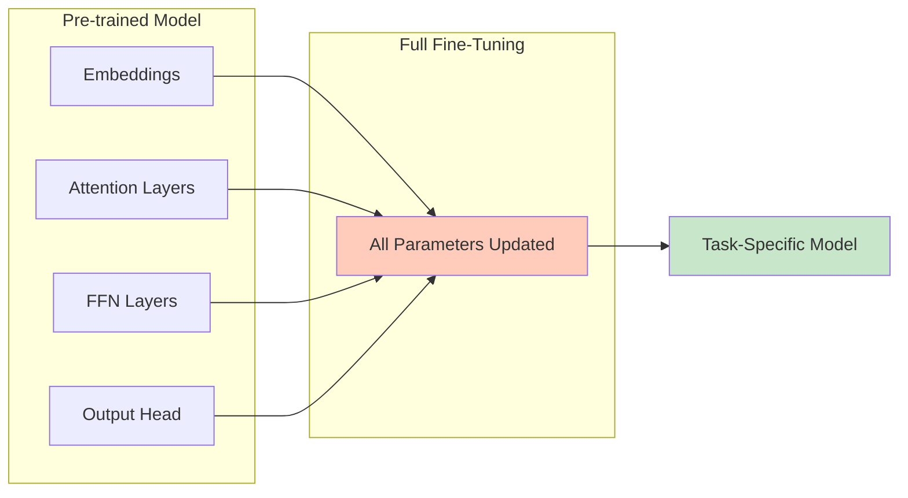
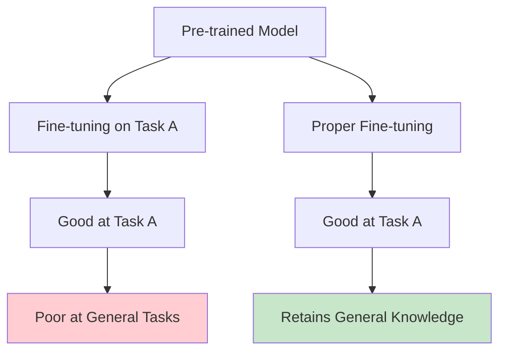
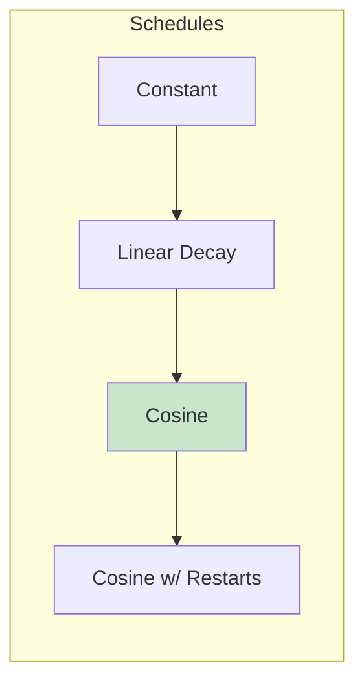

# Full Fine-Tuning

> **Training all model parameters for maximum capability transfer**

---

## Learning Objectives

- **Implement** a complete fine-tuning training loop from scratch
- **Diagnose** catastrophic forgetting and apply mitigation strategies
- **Configure** optimal hyperparameters for different model sizes
- **Design** data pipelines that prevent training-serving skew
- **Evaluate** when full fine-tuning is necessary vs parameter-efficient methods

---

## What is Full Fine-Tuning?

Full fine-tuning updates **all parameters** of a pre-trained model on your task-specific data. This provides maximum flexibility but requires significant compute and careful handling to avoid forgetting pre-trained knowledge.



---

## Training Loop Implementation

### Basic Training Loop

```python
import torch
from torch.utils.data import DataLoader
from transformers import AutoModelForCausalLM, AutoTokenizer, get_scheduler
from tqdm import tqdm

def fine_tune(
    model_name: str,
    train_dataset,
    val_dataset,
    output_dir: str,
    num_epochs: int = 3,
    batch_size: int = 4,
    learning_rate: float = 2e-5,
    gradient_accumulation_steps: int = 4,
    max_grad_norm: float = 1.0,
    warmup_ratio: float = 0.1,
):
    # Load model and tokenizer
    tokenizer = AutoTokenizer.from_pretrained(model_name)
    model = AutoModelForCausalLM.from_pretrained(
        model_name,
        torch_dtype=torch.bfloat16,
        device_map="auto"
    )

    # Prepare data loaders
    train_loader = DataLoader(
        train_dataset,
        batch_size=batch_size,
        shuffle=True,
        collate_fn=lambda x: collate_fn(x, tokenizer)
    )
    val_loader = DataLoader(
        val_dataset,
        batch_size=batch_size,
        collate_fn=lambda x: collate_fn(x, tokenizer)
    )

    # Optimizer and scheduler
    optimizer = torch.optim.AdamW(model.parameters(), lr=learning_rate)
    num_training_steps = len(train_loader) * num_epochs // gradient_accumulation_steps
    num_warmup_steps = int(num_training_steps * warmup_ratio)

    scheduler = get_scheduler(
        "cosine",
        optimizer=optimizer,
        num_warmup_steps=num_warmup_steps,
        num_training_steps=num_training_steps
    )

    # Training loop
    model.train()
    global_step = 0
    best_val_loss = float('inf')

    for epoch in range(num_epochs):
        total_loss = 0
        optimizer.zero_grad()

        for step, batch in enumerate(tqdm(train_loader, desc=f"Epoch {epoch+1}")):
            # Forward pass
            outputs = model(**batch)
            loss = outputs.loss / gradient_accumulation_steps
            total_loss += loss.item()

            # Backward pass
            loss.backward()

            # Gradient accumulation
            if (step + 1) % gradient_accumulation_steps == 0:
                torch.nn.utils.clip_grad_norm_(model.parameters(), max_grad_norm)
                optimizer.step()
                scheduler.step()
                optimizer.zero_grad()
                global_step += 1

        # Validation
        val_loss = evaluate(model, val_loader)
        print(f"Epoch {epoch+1}: Train Loss = {total_loss:.4f}, Val Loss = {val_loss:.4f}")

        # Save best model
        if val_loss < best_val_loss:
            best_val_loss = val_loss
            model.save_pretrained(output_dir)
            tokenizer.save_pretrained(output_dir)

    return model


def collate_fn(examples, tokenizer, max_length=512):
    """Collate function for causal LM training"""
    texts = [ex["text"] for ex in examples]
    encodings = tokenizer(
        texts,
        truncation=True,
        max_length=max_length,
        padding="max_length",
        return_tensors="pt"
    )

    # Labels are the same as input_ids for causal LM
    encodings["labels"] = encodings["input_ids"].clone()

    # Mask padding tokens in labels
    encodings["labels"][encodings["attention_mask"] == 0] = -100

    return encodings


def evaluate(model, val_loader):
    """Evaluate model on validation set"""
    model.eval()
    total_loss = 0
    with torch.no_grad():
        for batch in val_loader:
            outputs = model(**batch)
            total_loss += outputs.loss.item()
    model.train()
    return total_loss / len(val_loader)
```

### Using HuggingFace Trainer

```python
from transformers import (
    AutoModelForCausalLM,
    AutoTokenizer,
    TrainingArguments,
    Trainer,
    DataCollatorForLanguageModeling
)

def fine_tune_with_trainer(
    model_name: str,
    train_dataset,
    val_dataset,
    output_dir: str
):
    # Load model and tokenizer
    tokenizer = AutoTokenizer.from_pretrained(model_name)
    tokenizer.pad_token = tokenizer.eos_token

    model = AutoModelForCausalLM.from_pretrained(
        model_name,
        torch_dtype=torch.bfloat16,
        device_map="auto"
    )

    # Training arguments
    training_args = TrainingArguments(
        output_dir=output_dir,
        num_train_epochs=3,
        per_device_train_batch_size=4,
        per_device_eval_batch_size=4,
        gradient_accumulation_steps=4,
        learning_rate=2e-5,
        weight_decay=0.01,
        warmup_ratio=0.1,
        lr_scheduler_type="cosine",
        logging_steps=10,
        eval_strategy="steps",
        eval_steps=100,
        save_strategy="steps",
        save_steps=100,
        save_total_limit=3,
        load_best_model_at_end=True,
        metric_for_best_model="eval_loss",
        bf16=True,
        gradient_checkpointing=True,
        report_to="wandb",  # or "tensorboard"
    )

    # Data collator
    data_collator = DataCollatorForLanguageModeling(
        tokenizer=tokenizer,
        mlm=False  # Causal LM, not masked LM
    )

    # Initialize trainer
    trainer = Trainer(
        model=model,
        args=training_args,
        train_dataset=train_dataset,
        eval_dataset=val_dataset,
        data_collator=data_collator,
    )

    # Train
    trainer.train()

    # Save final model
    trainer.save_model()

    return trainer
```

---

## Catastrophic Forgetting

### What is Catastrophic Forgetting?

When fine-tuning overwrites pre-trained knowledge, causing the model to lose general capabilities.



### Symptoms of Catastrophic Forgetting

| Symptom | Example |
|---------|---------|
| **Vocabulary loss** | Model forgets rare words |
| **Capability regression** | Poor at tasks it previously excelled at |
| **Repetition** | Gets stuck in loops |
| **Coherence loss** | Generates grammatically incorrect text |
| **Style collapse** | All outputs sound the same |

### Mitigation Strategies

#### 1. Lower Learning Rate

```python
# Too high: Catastrophic forgetting
learning_rate = 1e-4  # BAD for large models

# Recommended ranges by model size
learning_rates = {
    "7B": 2e-5,
    "13B": 1e-5,
    "70B": 5e-6,
}
```

#### 2. Learning Rate Warmup

```python
training_args = TrainingArguments(
    warmup_ratio=0.1,  # 10% of training steps
    # or
    warmup_steps=100,
)
```

#### 3. Data Mixing (Replay)

```python
def create_mixed_dataset(task_data, general_data, task_ratio=0.8):
    """Mix task-specific data with general pre-training data"""
    task_size = len(task_data)
    general_size = int(task_size * (1 - task_ratio) / task_ratio)

    # Sample from general data
    general_sample = general_data.shuffle().select(range(general_size))

    # Concatenate and shuffle
    mixed = concatenate_datasets([task_data, general_sample])
    return mixed.shuffle()

# Usage
from datasets import load_dataset

task_data = load_dataset("your_task_dataset")
general_data = load_dataset("c4", "en", split="train", streaming=True)
mixed_data = create_mixed_dataset(task_data, general_data)
```

#### 4. Elastic Weight Consolidation (EWC)

```python
class EWCLoss:
    """Elastic Weight Consolidation to prevent forgetting"""

    def __init__(self, model, fisher_matrix, old_params, lambda_ewc=0.4):
        self.fisher = fisher_matrix
        self.old_params = old_params
        self.lambda_ewc = lambda_ewc

    def penalty(self, model):
        loss = 0
        for name, param in model.named_parameters():
            if name in self.fisher:
                loss += (
                    self.fisher[name] *
                    (param - self.old_params[name]) ** 2
                ).sum()
        return self.lambda_ewc * loss


def compute_fisher_matrix(model, dataloader, num_samples=1000):
    """Compute Fisher information matrix"""
    fisher = {n: torch.zeros_like(p) for n, p in model.named_parameters()}

    model.eval()
    for i, batch in enumerate(dataloader):
        if i >= num_samples:
            break
        outputs = model(**batch)
        loss = outputs.loss
        loss.backward()

        for name, param in model.named_parameters():
            if param.grad is not None:
                fisher[name] += param.grad ** 2

    # Normalize
    for name in fisher:
        fisher[name] /= num_samples

    return fisher
```

#### 5. Gradient Checkpointing

```python
# Reduces memory, allows larger batches, more stable training
model.gradient_checkpointing_enable()

# Or in TrainingArguments
training_args = TrainingArguments(
    gradient_checkpointing=True,
    # ...
)
```

---

## Data Requirements

### Minimum Dataset Sizes

| Task Type | Minimum Examples | Recommended |
|-----------|------------------|-------------|
| **Format adaptation** | 500 | 1,000-5,000 |
| **Style transfer** | 1,000 | 5,000-10,000 |
| **Domain adaptation** | 5,000 | 10,000-50,000 |
| **New capability** | 10,000 | 50,000-100,000 |

### Data Format for Causal LM

```python
# Simple completion format
training_example = {
    "text": "### Instruction:\nSummarize the following text.\n\n### Input:\n[long text]\n\n### Response:\n[summary]"
}

# Chat format
training_example = {
    "text": "<|user|>\nSummarize this: [text]<|end|>\n<|assistant|>\n[summary]<|end|>"
}
```

### Data Quality Checklist

```python
def validate_training_data(dataset):
    """Validate training data quality"""
    issues = []

    for i, example in enumerate(dataset):
        text = example["text"]

        # Check minimum length
        if len(text) < 50:
            issues.append(f"Example {i}: Too short")

        # Check for empty responses
        if "### Response:" in text:
            response = text.split("### Response:")[-1]
            if len(response.strip()) < 10:
                issues.append(f"Example {i}: Empty response")

        # Check for duplicates (approximate)
        # In practice, use deduplication tools

        # Check for special tokens
        if "<|pad|>" in text:
            issues.append(f"Example {i}: Contains pad token")

    return issues
```

---

## Hyperparameter Guidelines

### By Model Size

| Parameter | 7B Model | 13B Model | 70B Model |
|-----------|----------|-----------|-----------|
| **Learning Rate** | 2e-5 | 1e-5 | 5e-6 |
| **Batch Size** | 32-64 | 16-32 | 8-16 |
| **Warmup Ratio** | 0.03-0.1 | 0.03-0.1 | 0.1-0.2 |
| **Weight Decay** | 0.01 | 0.01 | 0.01 |
| **Epochs** | 1-3 | 1-2 | 1 |

### Learning Rate Schedule Comparison



::: info Recommendation
Cosine schedule with warmup is generally the best default for fine-tuning LLMs. It provides smooth decay and avoids sudden drops.
:::

---

## Memory Optimization

### Gradient Checkpointing

```python
# Trade compute for memory
model.gradient_checkpointing_enable()

# Memory savings: ~50-70%
# Compute overhead: ~20-30%
```

### Mixed Precision Training

```python
training_args = TrainingArguments(
    bf16=True,  # Preferred for modern GPUs
    # or
    fp16=True,  # For older GPUs
)
```

### DeepSpeed Integration

```python
# deepspeed_config.json
{
    "bf16": {"enabled": true},
    "zero_optimization": {
        "stage": 2,
        "offload_optimizer": {"device": "cpu"},
        "allgather_partitions": true,
        "allgather_bucket_size": 2e8,
        "reduce_scatter": true,
        "reduce_bucket_size": 2e8,
        "overlap_comm": true
    },
    "gradient_accumulation_steps": 4,
    "train_batch_size": "auto",
    "train_micro_batch_size_per_gpu": "auto"
}

# Training command
# deepspeed train.py --deepspeed deepspeed_config.json
```

### Memory Requirements by Model Size

| Model Size | Full FT (bf16) | Gradient Checkpointing | DeepSpeed ZeRO-2 |
|------------|----------------|------------------------|-------------------|
| 7B | ~56GB | ~32GB | ~24GB |
| 13B | ~104GB | ~60GB | ~40GB |
| 70B | ~560GB | ~320GB | ~200GB |

---

## Interview Q&A

### Q1: What is catastrophic forgetting and how do you prevent it?

**Strong Answer:**
"Catastrophic forgetting occurs when fine-tuning overwrites the pre-trained weights that encode general language understanding. The model becomes good at the specific task but loses broader capabilities.

I prevent it through several techniques:

1. **Lower learning rate**: Use 1e-5 to 5e-6 instead of the typical 1e-4 for training from scratch. This makes smaller updates to weights.

2. **Learning rate warmup**: Start with very small updates and gradually increase, allowing the model to adapt to the new data distribution smoothly.

3. **Data mixing**: Include 10-20% of general pre-training data mixed with task-specific data. This forces the model to maintain general capabilities.

4. **Early stopping**: Monitor validation loss on both task-specific AND general benchmarks. Stop when task performance plateaus, even if it could improve slightly more.

5. **Smaller models or PEFT**: If catastrophic forgetting is severe, consider LoRA which only updates a small subset of parameters.

The key is balancing task-specific learning with general capability preservation."

---

### Q2: How do you determine the right learning rate for fine-tuning?

**Strong Answer:**
"I use a systematic approach:

1. **Start with established baselines**: For a 7B model, I'd start around 2e-5. For larger models like 70B, closer to 5e-6. Larger models need smaller learning rates.

2. **Learning rate finder**: Run a learning rate range test where I exponentially increase LR from 1e-7 to 1e-3 over a few hundred steps, plotting loss. The optimal LR is typically about 10x lower than where the loss starts increasing.

3. **Watch for signs of issues**:
   - Loss spikes or NaN: LR too high
   - Loss decreases very slowly: LR too low
   - Good training loss but bad validation: Could be LR too high causing overfitting

4. **Consider the dataset size**: Smaller datasets need smaller learning rates to prevent overfitting.

5. **Use warmup**: 3-10% of training steps as warmup helps stabilize early training regardless of the peak LR chosen.

In practice, 2e-5 with cosine decay and 10% warmup is a robust starting point for most 7B models."

---

### Q3: When would you choose full fine-tuning over LoRA?

**Strong Answer:**
"Full fine-tuning over LoRA makes sense in these scenarios:

1. **Maximum capability change**: When I need the model to learn fundamentally new behaviors that LoRA's low-rank updates can't capture. For example, teaching a model a new language or significantly different reasoning pattern.

2. **Sufficient compute budget**: Full fine-tuning typically produces slightly better results than LoRA (1-3% on benchmarks). If I have the GPU budget and time, full fine-tuning is worth it.

3. **Large training dataset**: With >100K high-quality examples, full fine-tuning can better utilize all that data. LoRA might underfit with very large datasets.

4. **Deployment simplicity**: LoRA requires loading the base model + adapter at inference time. Full fine-tuned models are self-contained, which can simplify deployment.

However, I'd use LoRA when:
- Limited GPU memory (can't fit full model gradients)
- Quick iteration cycles needed
- Want to maintain multiple task-specific adapters
- Dataset is small (LoRA acts as regularization)

In practice, I often start with LoRA to validate the approach works, then optionally move to full fine-tuning for the final production model."

---

## Summary

| Topic | Key Points |
|-------|------------|
| **Full Fine-Tuning** | Updates all parameters, maximum flexibility |
| **Learning Rate** | Critical hyperparameter, use 5e-6 to 2e-5 for LLMs (smaller LR for larger models) |
| **Catastrophic Forgetting** | Mitigate with lower LR, warmup, data mixing |
| **Data Requirements** | Minimum 1K examples, 10K+ for new capabilities |
| **Memory Optimization** | Gradient checkpointing, bf16, DeepSpeed |
| **Training Loop** | Warmup + cosine decay, gradient clipping |

---

## Sources

- Kirkpatrick et al., "Overcoming catastrophic forgetting in neural networks" (EWC paper)
- HuggingFace Transformers Trainer Documentation
- DeepSpeed Documentation
- "Scaling Language Models: Methods, Analysis & Insights from Training Gopher"
- "Training Compute-Optimal Large Language Models" (Chinchilla paper)
