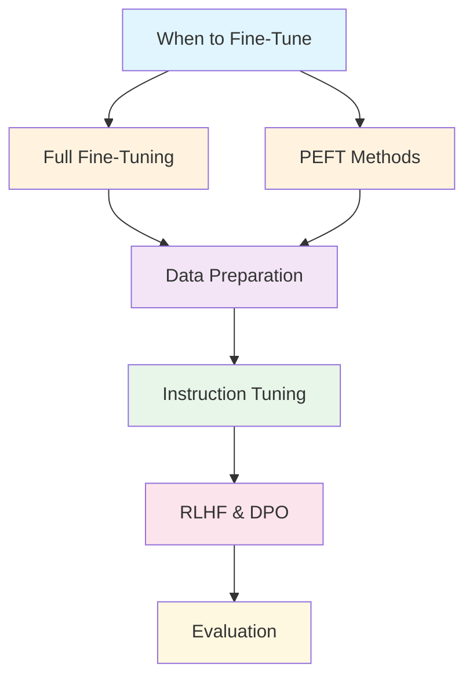
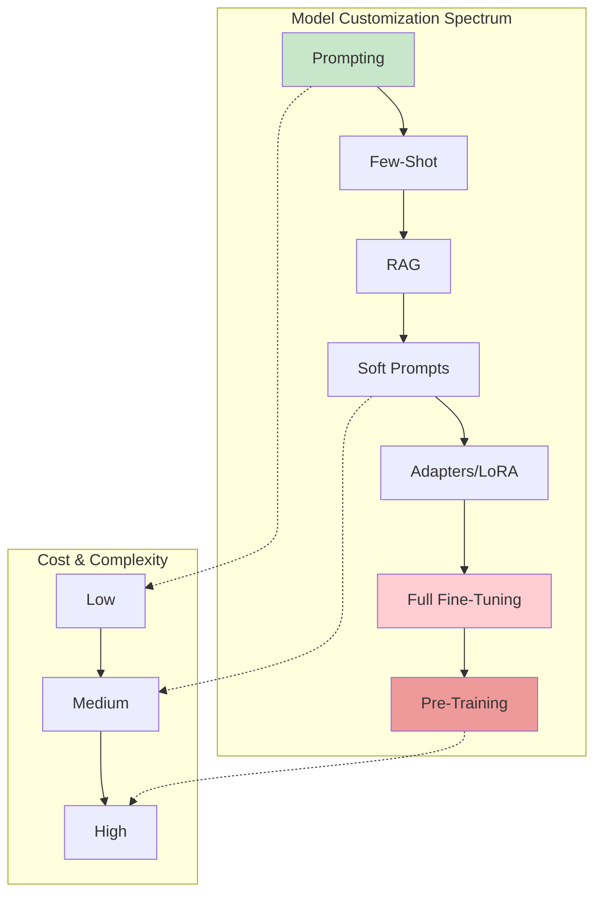

# Fine-Tuning LLMs

> **Master the art of adapting foundation models to your specific use cases**

---

## Overview

Fine-tuning transforms general-purpose language models into specialized tools for your domain. This section covers everything from deciding when to fine-tune to advanced techniques like RLHF and DPO, with practical code examples and interview-focused content.

---

## Learning Objectives

By completing this module, you will be able to:

- **Evaluate** when fine-tuning is the right approach vs prompting or RAG
- **Implement** full fine-tuning and parameter-efficient methods (LoRA, QLoRA)
- **Design** instruction-tuning datasets and preference data pipelines
- **Apply** RLHF and DPO to align models with human preferences
- **Diagnose** common failure modes like overfitting and catastrophic forgetting

---

## Module Structure

---

## Modules

| Module | Description | Key Topics |
|--------|-------------|------------|
| [When to Fine-Tune](./when-to-fine-tune) | Decision framework for customization strategies | Prompt engineering vs RAG vs fine-tuning |
| [Full Fine-Tuning](./full-fine-tuning) | Complete model weight updates | Training loops, catastrophic forgetting |
| [PEFT Methods](./peft-methods) | Parameter-efficient fine-tuning | LoRA, QLoRA, AdaLoRA, IA3, adapters |
| [Data Preparation](./data-preparation) | Dataset quality and curation | Deduplication, synthetic data, mixing |
| [Instruction Tuning](./instruction-tuning) | Teaching models to follow instructions | FLAN, T0, template design |
| [RLHF & DPO](./rlhf-dpo) | Human preference alignment | Reward modeling, PPO, DPO |
| [Evaluation](./fine-tuning-evaluation) | Measuring fine-tuning success | Overfitting, benchmarks, A/B testing |

---

## Fine-Tuning Landscape

---

## Quick Decision Matrix

| Approach | Data Needed | Compute Cost | Use When |
|----------|-------------|--------------|----------|
| **Prompting** | None | $ | Task is expressible in natural language |
| **RAG** | Documents | $$ | Need external/dynamic knowledge |
| **LoRA/PEFT** | 1K-100K examples | $$ | Style/format changes, domain adaptation |
| **Full Fine-Tuning** | 10K-1M examples | $$$$ | Fundamental capability changes |
| **RLHF/DPO** | Preference pairs | $$$$$ | Alignment with human values |

---

## Interview Focus Areas

::: info Common Interview Topics
1. **Trade-off Analysis**: When to use which customization approach
2. **Technical Implementation**: LoRA math, training loops, hyperparameters
3. **Failure Modes**: Catastrophic forgetting, overfitting, mode collapse
4. **Data Quality**: How data issues manifest in fine-tuned models
5. **Alignment**: RLHF vs DPO, reward hacking, preference data quality
:::

---

## Prerequisites

Before diving into fine-tuning, ensure familiarity with:

- Transformer architecture fundamentals
- PyTorch basics (tensors, autograd, nn.Module)
- Basic NLP concepts (tokenization, embeddings)
- Familiarity with HuggingFace ecosystem

---

## Tools & Libraries

| Library | Purpose |
|---------|---------|
| `transformers` | Model loading, tokenizers, Trainer API |
| `peft` | LoRA, AdaLoRA, IA3 implementations |
| `trl` | RLHF, DPO, reward modeling |
| `datasets` | Data loading and preprocessing |
| `accelerate` | Distributed training |
| `bitsandbytes` | Quantization for QLoRA |

---

## Summary

| Concept | Key Insight |
|---------|-------------|
| **Fine-Tuning Purpose** | Adapt general models to specific tasks/domains |
| **PEFT Advantage** | 10-1000x fewer trainable parameters |
| **Data Quality** | More important than data quantity |
| **Evaluation** | Must test beyond training distribution |
| **Alignment** | RLHF/DPO for human preference optimization |

---

## Sources

- Hu et al., "LoRA: Low-Rank Adaptation of Large Language Models" (2021)
- Dettmers et al., "QLoRA: Efficient Finetuning of Quantized LLMs" (2023)
- Ouyang et al., "Training language models to follow instructions with human feedback" (2022)
- Rafailov et al., "Direct Preference Optimization" (2023)
- Wei et al., "Finetuned Language Models Are Zero-Shot Learners" (FLAN) (2021)
