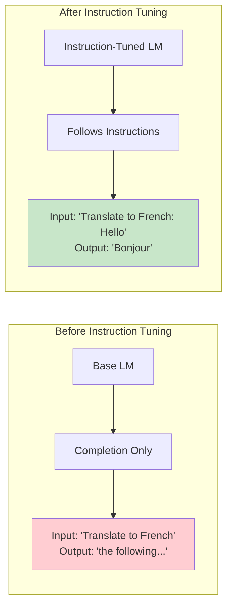
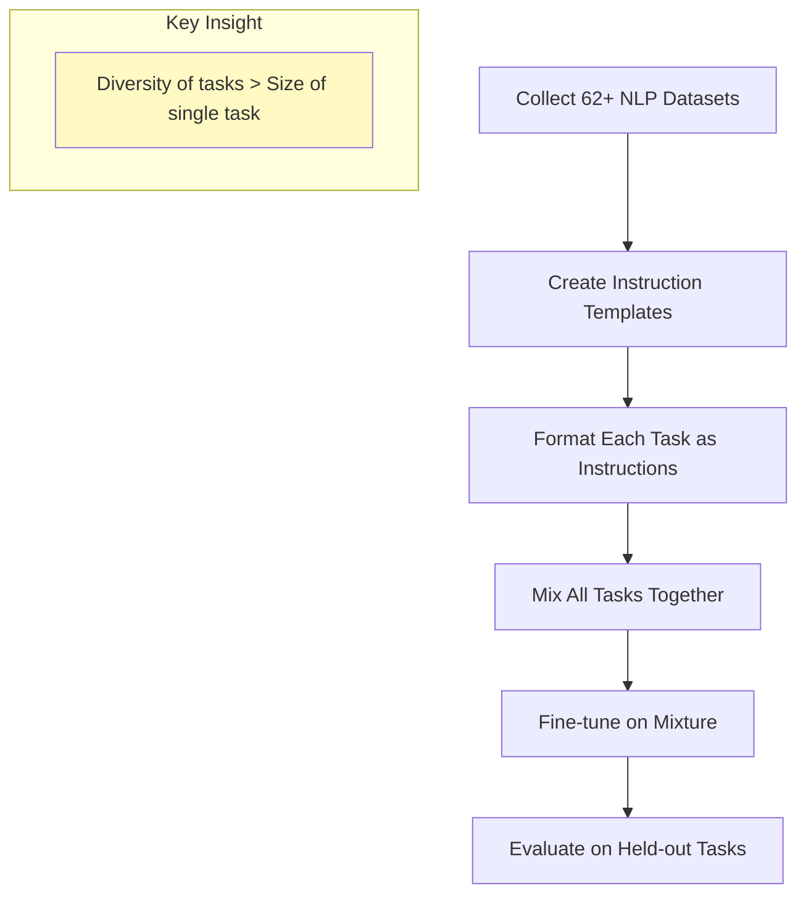
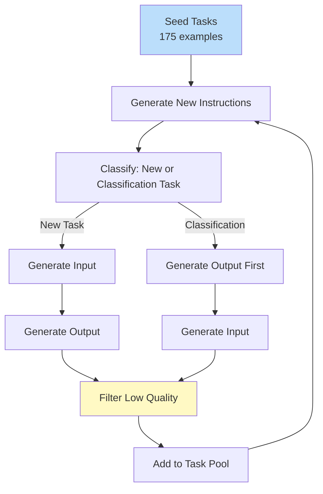
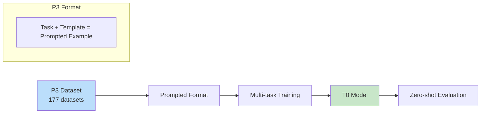

# Instruction Tuning

> **Teaching language models to follow natural language instructions**

---

## Learning Objectives

- **Explain** how instruction tuning transforms base models into helpful assistants
- **Design** instruction datasets with proper templates and diversity
- **Apply** FLAN/T0 methodology to multi-task instruction tuning
- **Create** synthetic instruction data using self-instruct approaches
- **Evaluate** instruction-following capabilities systematically

---

## What is Instruction Tuning?

Instruction tuning fine-tunes language models on (instruction, response) pairs, enabling them to generalize to new instructions they haven't seen.



---

## The FLAN Approach

FLAN (Fine-tuned Language Net) demonstrated that instruction tuning on diverse tasks improves zero-shot performance on held-out tasks.

### FLAN Methodology



### Task Cluster Organization

| Cluster | Example Tasks | Purpose |
|---------|---------------|---------|
| **Translation** | WMT, IWSLT | Language understanding |
| **Summarization** | CNN/DM, XSum | Compression |
| **QA** | SQuAD, NaturalQ | Reading comprehension |
| **Sentiment** | SST-2, Yelp | Classification |
| **NLI** | MNLI, SNLI | Reasoning |
| **Coreference** | Winograd | Entity understanding |
| **Struct-to-text** | ToTTo, WebNLG | Generation |

---

## Template Design

### Template Components

```python
template = {
    "instruction": "The main directive telling what to do",
    "input": "Optional context or data to process",
    "output": "Expected response format",
    "examples": "Optional few-shot demonstrations"
}
```

### Example Templates for Summarization

```python
summarization_templates = [
    # Template 1: Direct
    {
        "pattern": "Summarize the following article:\n\n{article}\n\nSummary:",
        "response": "{summary}"
    },
    # Template 2: Persona-based
    {
        "pattern": "You are a helpful assistant. Please provide a brief summary of this text:\n\n{article}",
        "response": "{summary}"
    },
    # Template 3: Specific length
    {
        "pattern": "Write a 2-3 sentence summary of:\n{article}",
        "response": "{summary}"
    },
    # Template 4: Question format
    {
        "pattern": "What are the main points of this article?\n\n{article}",
        "response": "{summary}"
    },
    # Template 5: Structured
    {
        "pattern": "Article: {article}\n\nTask: Summarize the above article.\nSummary:",
        "response": "{summary}"
    }
]
```

### Template Diversity Principles

::: info Why Template Diversity Matters
Using multiple templates for the same task:
1. Prevents overfitting to specific phrasing
2. Improves generalization to new instruction styles
3. Better captures the distribution of how users phrase requests
:::

```python
def apply_random_template(example, templates):
    """Randomly select and apply a template"""
    import random
    template = random.choice(templates)

    formatted = template["pattern"].format(**example)
    response = template["response"].format(**example)

    return {
        "text": f"{formatted}{response}",
        "instruction": formatted,
        "response": response
    }
```

---

## Building Instruction Datasets

### Dataset Structure

```python
from datasets import Dataset

# Standard instruction format
instruction_data = [
    {
        "instruction": "Translate the following English text to French.",
        "input": "Hello, how are you?",
        "output": "Bonjour, comment allez-vous?"
    },
    {
        "instruction": "Classify the sentiment of this review as positive or negative.",
        "input": "This movie was absolutely fantastic! I loved every minute.",
        "output": "positive"
    },
    {
        "instruction": "Write a haiku about autumn.",
        "input": "",
        "output": "Crimson leaves falling\nCrisp air whispers of changes\nNature's final bow"
    }
]

dataset = Dataset.from_list(instruction_data)
```

### Formatting for Training

```python
def format_instruction(example):
    """Format instruction data for training"""
    if example["input"]:
        text = f"""### Instruction:
{example["instruction"]}

### Input:
{example["input"]}

### Response:
{example["output"]}"""
    else:
        text = f"""### Instruction:
{example["instruction"]}

### Response:
{example["output"]}"""

    return {"text": text}


# Apply formatting
formatted_dataset = dataset.map(format_instruction)
```

### Chat Template Format

```python
def format_as_chat(example, tokenizer):
    """Format as chat messages for chat-tuned models"""
    messages = [
        {"role": "system", "content": "You are a helpful assistant."},
        {"role": "user", "content": example["instruction"] + (
            f"\n\n{example['input']}" if example["input"] else ""
        )},
        {"role": "assistant", "content": example["output"]}
    ]

    # Use tokenizer's chat template
    formatted = tokenizer.apply_chat_template(
        messages,
        tokenize=False,
        add_generation_prompt=False
    )

    return {"text": formatted}
```

---

## Self-Instruct: Synthetic Data Generation

### The Self-Instruct Pipeline



### Implementation

```python
from openai import OpenAI

def generate_instructions(
    seed_tasks: list,
    num_instructions: int = 100,
    model: str = "gpt-4"
):
    """Generate new instructions using self-instruct"""
    client = OpenAI()

    generated_tasks = []
    task_pool = seed_tasks.copy()

    prompt_template = """You are asked to come up with a set of diverse task instructions. These task instructions will be given to a GPT model and we will evaluate the GPT model for completing the instructions.

Here are the requirements:
1. Try not to repeat the verb for each instruction to maximize diversity.
2. The language used should be diverse. Combine questions with imperative instructions.
3. The type of instructions should be diverse, including open-ended generation, classification, editing, etc.
4. A GPT language model should be able to complete the instruction. Do not ask for information the model cannot access.
5. The instructions should be 1-2 sentences, be clear and concise.

Here are some examples:
{examples}

Generate {num_new} new diverse instructions:"""

    while len(generated_tasks) < num_instructions:
        # Sample examples from task pool
        examples = random.sample(task_pool, min(8, len(task_pool)))
        example_text = "\n".join([f"{i+1}. {t['instruction']}" for i, t in enumerate(examples)])

        response = client.chat.completions.create(
            model=model,
            messages=[{
                "role": "user",
                "content": prompt_template.format(
                    examples=example_text,
                    num_new=10
                )
            }],
            temperature=0.7
        )

        # Parse new instructions
        new_instructions = parse_instructions(response.choices[0].message.content)

        # Generate input/output for each
        for instruction in new_instructions:
            task = generate_io_pair(client, model, instruction)
            if is_valid_task(task):
                generated_tasks.append(task)
                task_pool.append(task)

    return generated_tasks


def generate_io_pair(client, model, instruction):
    """Generate input/output pair for an instruction"""
    prompt = f"""Given the instruction, generate an appropriate input and output pair.

Instruction: {instruction}

Generate a realistic input (if applicable) and a high-quality output.
Format:
Input: [input text or "N/A" if not needed]
Output: [output text]"""

    response = client.chat.completions.create(
        model=model,
        messages=[{"role": "user", "content": prompt}],
        temperature=0.7
    )

    # Parse response
    text = response.choices[0].message.content
    input_text, output_text = parse_io(text)

    return {
        "instruction": instruction,
        "input": input_text if input_text != "N/A" else "",
        "output": output_text
    }
```

### Quality Filtering

```python
def is_valid_task(task):
    """Filter out low-quality generated tasks"""
    instruction = task["instruction"]
    output = task["output"]

    # Check instruction quality
    if len(instruction) < 10:
        return False
    if instruction.lower().startswith(("write", "generate", "create")) and len(output) < 50:
        return False

    # Check output quality
    if len(output) < 5:
        return False
    if output.lower() in ["i cannot", "i'm unable", "as an ai"]:
        return False

    # Check for common failure patterns
    if "```" in instruction:  # Code in instruction
        return False
    if instruction.count("\n") > 3:  # Too many newlines
        return False

    return True


def deduplicate_instructions(tasks, threshold=0.7):
    """Remove near-duplicate instructions using embedding similarity"""
    from sentence_transformers import SentenceTransformer
    from sklearn.metrics.pairwise import cosine_similarity
    import numpy as np

    model = SentenceTransformer('all-MiniLM-L6-v2')
    instructions = [t["instruction"] for t in tasks]
    embeddings = model.encode(instructions)

    # Find duplicates
    similarity_matrix = cosine_similarity(embeddings)
    to_remove = set()

    for i in range(len(tasks)):
        if i in to_remove:
            continue
        for j in range(i + 1, len(tasks)):
            if similarity_matrix[i][j] > threshold:
                to_remove.add(j)

    return [t for i, t in enumerate(tasks) if i not in to_remove]
```

---

## Training an Instruction-Tuned Model

### Complete Training Pipeline

```python
from transformers import (
    AutoModelForCausalLM,
    AutoTokenizer,
    TrainingArguments,
)
from peft import LoraConfig, get_peft_model
from trl import SFTTrainer
from datasets import load_dataset

def train_instruction_model(
    model_name: str = "meta-llama/Llama-2-7b-hf",
    dataset_path: str = "your_instruction_dataset",
    output_dir: str = "./instruction_model",
):
    # Load model and tokenizer
    model = AutoModelForCausalLM.from_pretrained(
        model_name,
        torch_dtype=torch.bfloat16,
        device_map="auto"
    )
    tokenizer = AutoTokenizer.from_pretrained(model_name)
    tokenizer.pad_token = tokenizer.eos_token

    # Configure LoRA
    lora_config = LoraConfig(
        r=32,
        lora_alpha=64,
        target_modules=["q_proj", "k_proj", "v_proj", "o_proj",
                       "gate_proj", "up_proj", "down_proj"],
        lora_dropout=0.05,
        bias="none",
        task_type="CAUSAL_LM"
    )
    model = get_peft_model(model, lora_config)

    # Load and format dataset
    dataset = load_dataset(dataset_path)

    def format_example(example):
        if example["input"]:
            prompt = f"### Instruction:\n{example['instruction']}\n\n### Input:\n{example['input']}\n\n### Response:\n"
        else:
            prompt = f"### Instruction:\n{example['instruction']}\n\n### Response:\n"
        return {"text": prompt + example["output"]}

    train_dataset = dataset["train"].map(format_example)
    eval_dataset = dataset["validation"].map(format_example)

    # Training arguments
    training_args = TrainingArguments(
        output_dir=output_dir,
        num_train_epochs=3,
        per_device_train_batch_size=4,
        gradient_accumulation_steps=8,
        learning_rate=2e-4,
        warmup_ratio=0.03,
        lr_scheduler_type="cosine",
        logging_steps=10,
        eval_strategy="steps",
        eval_steps=200,
        save_strategy="steps",
        save_steps=200,
        bf16=True,
        gradient_checkpointing=True,
    )

    # Initialize trainer
    trainer = SFTTrainer(
        model=model,
        args=training_args,
        train_dataset=train_dataset,
        eval_dataset=eval_dataset,
        tokenizer=tokenizer,
        dataset_text_field="text",
        max_seq_length=2048,
    )

    trainer.train()
    trainer.save_model()

    return model
```

---

## T0 and Multi-Task Prompted Training

### T0 Approach

T0 (T5 for Zero-shot) showed that training on prompted datasets from P3 enables strong zero-shot transfer.



### Multi-Task Mixing Strategy

```python
from datasets import interleave_datasets

def create_multitask_dataset(task_datasets, sampling_strategy="proportional"):
    """Mix multiple task datasets with different strategies"""

    if sampling_strategy == "proportional":
        # Sample proportional to dataset size
        total = sum(len(d) for d in task_datasets)
        probabilities = [len(d) / total for d in task_datasets]

    elif sampling_strategy == "equal":
        # Equal sampling from each task
        probabilities = [1.0 / len(task_datasets)] * len(task_datasets)

    elif sampling_strategy == "temperature":
        # Temperature-based sampling (T5 approach)
        temperature = 1.0
        sizes = [len(d) for d in task_datasets]
        total = sum(s ** (1/temperature) for s in sizes)
        probabilities = [(s ** (1/temperature)) / total for s in sizes]

    # Interleave datasets
    mixed_dataset = interleave_datasets(
        task_datasets,
        probabilities=probabilities,
        seed=42
    )

    return mixed_dataset
```

---

## Evaluation

### Instruction Following Metrics

```python
def evaluate_instruction_following(model, tokenizer, test_examples):
    """Evaluate instruction following capabilities"""
    results = {
        "format_accuracy": [],
        "task_completion": [],
        "instruction_adherence": []
    }

    for example in test_examples:
        # Generate response
        prompt = format_instruction_prompt(example)
        inputs = tokenizer(prompt, return_tensors="pt").to(model.device)

        with torch.no_grad():
            outputs = model.generate(
                **inputs,
                max_new_tokens=512,
                temperature=0.7,
                do_sample=True
            )

        response = tokenizer.decode(outputs[0], skip_special_tokens=True)
        response = response[len(prompt):]  # Remove prompt

        # Evaluate format (e.g., expected JSON, list, etc.)
        format_correct = check_format(response, example.get("expected_format"))
        results["format_accuracy"].append(format_correct)

        # Evaluate task completion (semantic similarity to reference)
        if "reference" in example:
            completion_score = compute_semantic_similarity(
                response, example["reference"]
            )
            results["task_completion"].append(completion_score)

        # Evaluate instruction adherence (did it follow constraints?)
        if "constraints" in example:
            adherence_score = check_constraints(response, example["constraints"])
            results["instruction_adherence"].append(adherence_score)

    return {k: sum(v)/len(v) for k, v in results.items() if v}


def check_format(response, expected_format):
    """Check if response matches expected format"""
    if expected_format is None:
        return 1.0

    if expected_format == "json":
        try:
            json.loads(response)
            return 1.0
        except:
            return 0.0

    elif expected_format == "list":
        lines = response.strip().split("\n")
        if len(lines) > 1 and any(l.startswith(("- ", "* ", "1.")) for l in lines):
            return 1.0
        return 0.0

    elif expected_format == "yes_no":
        first_word = response.strip().split()[0].lower()
        return 1.0 if first_word in ["yes", "no"] else 0.0

    return 1.0
```

---

## Interview Q&A

### Q1: What makes instruction tuning different from standard fine-tuning?

**Strong Answer:**
"The key differences are:

1. **Goal**: Standard fine-tuning optimizes for a single task. Instruction tuning optimizes for following diverse natural language instructions, enabling generalization to new tasks.

2. **Data format**: Standard fine-tuning uses task-specific input/output pairs. Instruction tuning wraps examples in instruction templates, explicitly teaching the model what to do.

3. **Evaluation**: Standard fine-tuning measures task-specific metrics. Instruction tuning measures zero-shot performance on held-out task categories.

4. **Generalization**: A standard fine-tuned model excels at one task but may regress on others. An instruction-tuned model can handle many tasks, including ones never seen during training.

5. **Practical impact**: Instruction tuning is what transforms base language models (which just complete text) into assistants (which follow user requests). This is why ChatGPT feels different from GPT-3 base."

---

### Q2: How do you design templates for instruction tuning?

**Strong Answer:**
"Template design follows several principles:

1. **Diversity in phrasing**: For each task, create 5-10 templates with different phrasings. This prevents overfitting to specific wording and improves generalization. For summarization: 'Summarize:', 'What are the main points?', 'Write a brief summary', etc.

2. **Vary structure**: Mix question formats ('What is...?'), imperative formats ('Generate...'), and declarative formats ('The summary is...'). Include templates with and without explicit task labels.

3. **Include/exclude components systematically**:
   - With/without system context
   - With/without few-shot examples
   - With/without output format specification

4. **Natural language**: Templates should sound like real user requests, not formal task descriptions. Study how people actually phrase requests.

5. **Task-appropriate**: Classification tasks might use 'Is this positive or negative?' while generation tasks use 'Write a story about...'

6. **Balance difficulty**: Include simple and complex templates to help the model learn both basic instruction following and nuanced interpretation."

---

### Q3: How much data is needed for effective instruction tuning?

**Strong Answer:**
"It depends on goals and approach:

**For task-specific instruction tuning (single domain)**:
- Minimum: 1,000-5,000 high-quality examples
- Recommended: 10,000-50,000 examples
- Focus on quality over quantity

**For general instruction tuning (FLAN-style)**:
- 50,000-500,000 examples across many tasks
- Diversity of tasks matters more than per-task quantity
- FLAN-T5 used 1.8K tasks with ~60 templates each

**Key factors**:
1. **Base model capability**: Stronger base models need less instruction tuning data
2. **Task complexity**: Simple format changes need less; new capabilities need more
3. **Template diversity**: 10 templates per task is more effective than 1
4. **Quality**: 5,000 high-quality examples beat 50,000 noisy ones

**Practical approach**: Start with 5,000 curated examples. If performance plateaus, add data. If it's still insufficient, consider whether the task needs different training (maybe RLHF instead)."

---

## Summary

| Concept | Key Point |
|---------|-----------|
| **Instruction Tuning** | Fine-tune on (instruction, response) pairs for generalization |
| **FLAN Approach** | Diverse tasks > large single-task datasets |
| **Templates** | Multiple templates per task prevent overfitting |
| **Self-Instruct** | Generate synthetic data using the model itself |
| **Data Quality** | Quality and diversity trump raw quantity |
| **Evaluation** | Test on held-out task types, not just held-out examples |

---

## Sources

- Wei et al., "Finetuned Language Models Are Zero-Shot Learners" (FLAN, 2021)
- Sanh et al., "Multitask Prompted Training Enables Zero-Shot Task Generalization" (T0, 2021)
- Wang et al., "Self-Instruct: Aligning Language Models with Self-Generated Instructions" (2022)
- Longpre et al., "The FLAN Collection: Designing Data and Methods for Effective Instruction Tuning" (2023)
- Taori et al., "Stanford Alpaca: An Instruction-following LLaMA model" (2023)
