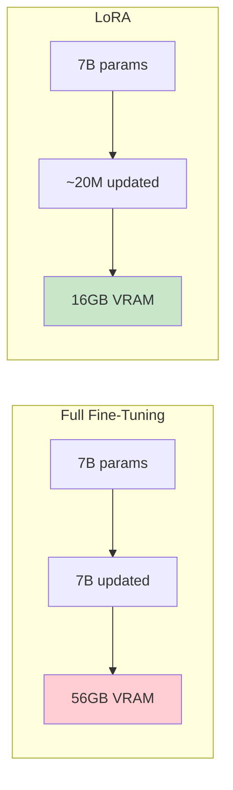
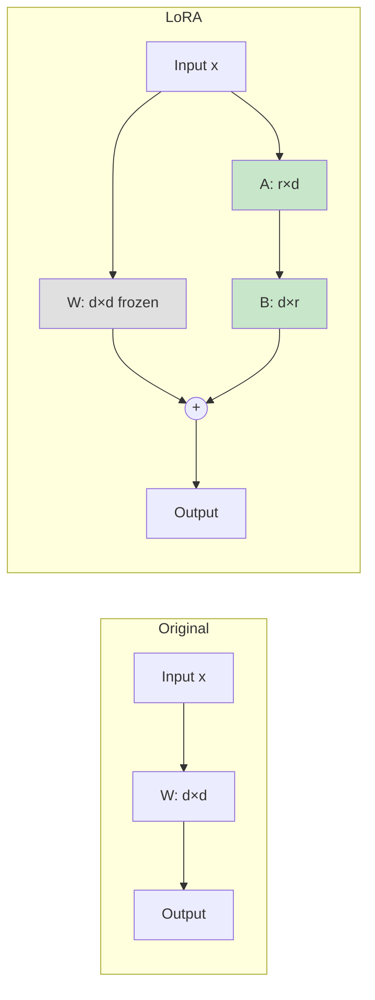
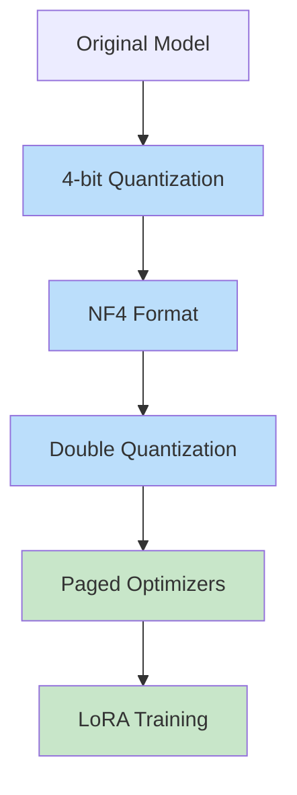
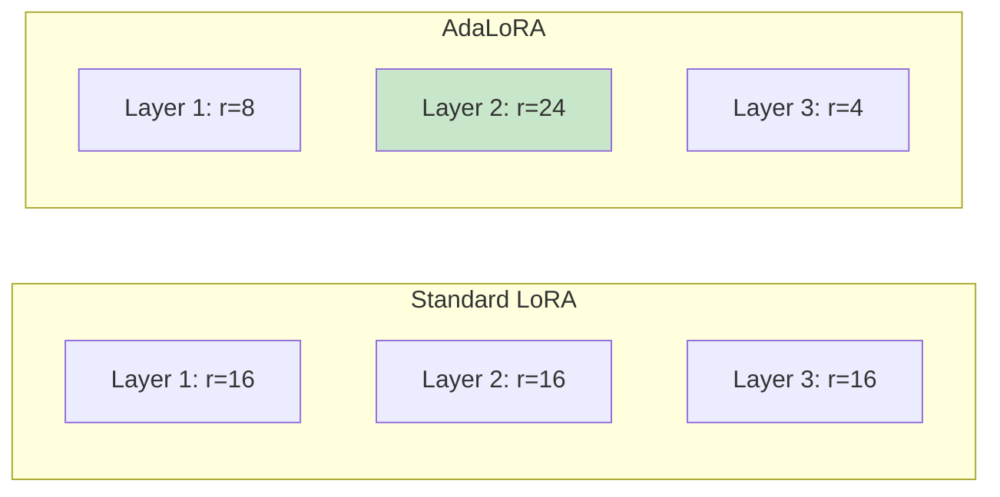
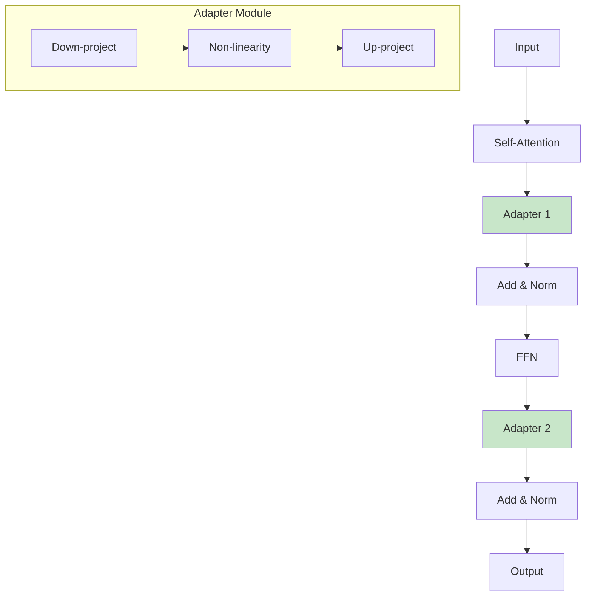
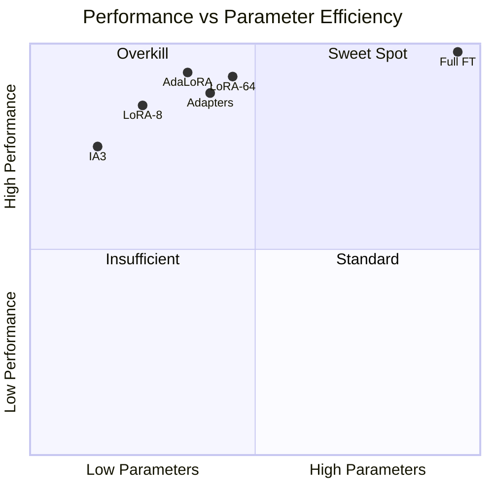

# Parameter-Efficient Fine-Tuning (PEFT)

> **Training 0.1-1% of parameters while achieving 90-99% of full fine-tuning performance**

---

## Learning Objectives

- **Explain** the mathematical foundations of LoRA and why low-rank works
- **Implement** LoRA, QLoRA, and other PEFT methods using HuggingFace
- **Compare** different PEFT methods and choose appropriately for each scenario
- **Configure** rank, alpha, and target modules for optimal performance
- **Debug** common PEFT training issues and performance gaps

---

## Why Parameter-Efficient Fine-Tuning?

Full fine-tuning a 7B parameter model requires:
- ~56GB GPU memory (bf16)
- Hours of training time
- Risk of catastrophic forgetting

PEFT methods achieve comparable results by training only 0.1-1% of parameters.



---

## LoRA: Low-Rank Adaptation

### The Core Idea

Instead of updating weight matrix W directly, decompose the update into two low-rank matrices:

$$W' = W + \Delta W = W + BA$$

Where:
- W: Original frozen weights (d x d)
- B: Low-rank matrix (d x r)
- A: Low-rank matrix (r x d)
- r: Rank (typically 8-64, much smaller than d)



### Mathematical Intuition

::: info Why Low-Rank Works
Research shows that weight updates during fine-tuning have low "intrinsic rank." Most of the information in the update can be captured by a low-rank approximation. This is analogous to how PCA captures most variance with few components.
:::

### Implementation

```python
from transformers import AutoModelForCausalLM, AutoTokenizer
from peft import LoraConfig, get_peft_model, TaskType

# Load base model
model = AutoModelForCausalLM.from_pretrained(
    "meta-llama/Llama-2-7b-hf",
    torch_dtype=torch.bfloat16,
    device_map="auto"
)

# Configure LoRA
lora_config = LoraConfig(
    task_type=TaskType.CAUSAL_LM,
    r=16,                          # Rank
    lora_alpha=32,                 # Scaling factor
    lora_dropout=0.1,              # Dropout for regularization
    target_modules=[               # Which layers to adapt
        "q_proj",
        "k_proj",
        "v_proj",
        "o_proj",
        "gate_proj",
        "up_proj",
        "down_proj",
    ],
    bias="none",                   # Don't train biases
)

# Create PEFT model
peft_model = get_peft_model(model, lora_config)

# Check trainable parameters
peft_model.print_trainable_parameters()
# Output: trainable params: 20,971,520 || all params: 6,758,404,096 || trainable%: 0.31
```

### Key Hyperparameters

| Parameter | Description | Typical Range | Guidelines |
|-----------|-------------|---------------|------------|
| **r (rank)** | Dimension of low-rank matrices | 4-64 | Higher = more capacity, more params |
| **lora_alpha** | Scaling factor | 16-64 | Usually 2x rank |
| **target_modules** | Layers to adapt | attention, FFN | More modules = better, slower |
| **lora_dropout** | Regularization | 0.05-0.1 | Higher for small datasets |

### Rank Selection Guide

```python
def recommend_rank(dataset_size, task_complexity):
    """Recommend LoRA rank based on task"""
    if dataset_size < 1000:
        base_rank = 8
    elif dataset_size < 10000:
        base_rank = 16
    else:
        base_rank = 32

    complexity_multiplier = {
        "simple": 0.5,      # Format changes
        "medium": 1.0,      # Style transfer
        "complex": 2.0,     # New capabilities
    }

    return int(base_rank * complexity_multiplier.get(task_complexity, 1.0))

# Examples
print(recommend_rank(5000, "simple"))   # 8
print(recommend_rank(50000, "complex")) # 64
```

---

## QLoRA: Quantized LoRA

QLoRA combines 4-bit quantization with LoRA for extreme memory efficiency.

### How QLoRA Works



### Key Innovations

1. **NF4 (4-bit NormalFloat)**: Optimized quantization for normally distributed weights
2. **Double Quantization**: Quantize the quantization constants for additional savings
3. **Paged Optimizers**: Handle memory spikes gracefully

### Implementation

```python
from transformers import AutoModelForCausalLM, BitsAndBytesConfig
from peft import LoraConfig, get_peft_model, prepare_model_for_kbit_training

# 4-bit quantization config
bnb_config = BitsAndBytesConfig(
    load_in_4bit=True,
    bnb_4bit_quant_type="nf4",           # NormalFloat4
    bnb_4bit_compute_dtype=torch.bfloat16,
    bnb_4bit_use_double_quant=True,       # Double quantization
)

# Load quantized model
model = AutoModelForCausalLM.from_pretrained(
    "meta-llama/Llama-2-70b-hf",
    quantization_config=bnb_config,
    device_map="auto"
)

# Prepare for training (handles quantized gradients)
model = prepare_model_for_kbit_training(model)

# Standard LoRA config
lora_config = LoraConfig(
    r=16,
    lora_alpha=32,
    target_modules=["q_proj", "v_proj", "k_proj", "o_proj"],
    lora_dropout=0.05,
    bias="none",
    task_type="CAUSAL_LM"
)

model = get_peft_model(model, lora_config)
```

### Memory Comparison

| Model | Full FT (bf16) | LoRA (bf16) | QLoRA (4-bit) |
|-------|----------------|-------------|---------------|
| 7B | 56GB | 16GB | 6GB |
| 13B | 104GB | 28GB | 10GB |
| 70B | 560GB | 160GB | 48GB |

---

## AdaLoRA: Adaptive Rank Allocation

AdaLoRA dynamically adjusts rank across layers based on importance.

### Key Insight

Not all layers need the same rank. AdaLoRA:
1. Starts with higher rank everywhere
2. Prunes less important singular values during training
3. Allocates more capacity to important layers



### Implementation

```python
from peft import AdaLoraConfig, get_peft_model

adalora_config = AdaLoraConfig(
    r=64,                    # Initial rank (will be pruned)
    lora_alpha=32,
    target_modules=["q_proj", "v_proj"],
    lora_dropout=0.1,
    bias="none",
    task_type="CAUSAL_LM",
    # AdaLoRA specific
    target_r=16,             # Target average rank after pruning
    init_r=64,               # Initial rank
    tinit=200,               # Steps before pruning starts
    tfinal=1000,             # Steps when pruning ends
    deltaT=100,              # Pruning interval
    beta1=0.85,
    beta2=0.85,
)

model = get_peft_model(base_model, adalora_config)
```

---

## IA3: Infused Adapter by Inhibiting and Amplifying Inner Activations

IA3 rescales activations instead of adding low-rank matrices.

### How IA3 Works

Instead of: $h = Wx$
IA3 does: $h = (l_w \odot W)x$ for keys/values and $h = l_{ff} \odot f(Wx)$ for FFN

Where $l_w$ and $l_{ff}$ are learned vectors (not matrices).

### Advantages

- **Fewer parameters**: Only 3 vectors per layer vs 2 matrices for LoRA
- **Faster training**: Less computation
- **Works well for few-shot**: Good for small datasets

### Implementation

```python
from peft import IA3Config, get_peft_model

ia3_config = IA3Config(
    target_modules=["k_proj", "v_proj", "down_proj"],
    feedforward_modules=["down_proj"],
    task_type="CAUSAL_LM",
)

model = get_peft_model(base_model, ia3_config)
model.print_trainable_parameters()
# Output: trainable params: ~500K (much fewer than LoRA)
```

---

## Adapters

Adapters insert small trainable modules between transformer layers.

### Architecture



### Implementation

```python
from transformers.adapters import AdapterConfig

# Bottleneck adapter config
adapter_config = AdapterConfig(
    mh_adapter=True,
    output_adapter=True,
    reduction_factor=16,    # Bottleneck dimension = hidden_dim / 16
    non_linearity="relu"
)

# Add adapter to model
model.add_adapter("task_adapter", config=adapter_config)
model.train_adapter("task_adapter")
```

---

## Method Comparison

### Performance vs Efficiency



### Comparison Table

| Method | Trainable Params | Memory | Training Speed | Performance |
|--------|------------------|--------|----------------|-------------|
| **LoRA** | 0.1-1% | Low | Fast | 95-99% |
| **QLoRA** | 0.1-1% | Very Low | Medium | 93-98% |
| **AdaLoRA** | Adaptive | Low | Medium | 96-99% |
| **IA3** | 0.01% | Very Low | Very Fast | 90-95% |
| **Adapters** | 0.5-2% | Low | Medium | 94-98% |
| **Full FT** | 100% | High | Slow | 100% |

### When to Use Each Method

| Scenario | Recommended Method |
|----------|-------------------|
| Limited VRAM, large model | QLoRA |
| Need best performance, have compute | LoRA (r=64) or Full FT |
| Many task-specific models | LoRA (easy adapter switching) |
| Very small dataset (<500 examples) | IA3 |
| Unknown which layers matter | AdaLoRA |
| Sequential multi-task | Adapters |

---

## Complete Training Example

```python
import torch
from datasets import load_dataset
from transformers import (
    AutoModelForCausalLM,
    AutoTokenizer,
    TrainingArguments,
    BitsAndBytesConfig,
)
from peft import LoraConfig, get_peft_model, prepare_model_for_kbit_training
from trl import SFTTrainer

def train_with_qlora(
    model_name: str,
    dataset_name: str,
    output_dir: str,
    lora_r: int = 16,
    lora_alpha: int = 32,
    num_epochs: int = 3,
):
    # Quantization config
    bnb_config = BitsAndBytesConfig(
        load_in_4bit=True,
        bnb_4bit_quant_type="nf4",
        bnb_4bit_compute_dtype=torch.bfloat16,
        bnb_4bit_use_double_quant=True,
    )

    # Load model
    model = AutoModelForCausalLM.from_pretrained(
        model_name,
        quantization_config=bnb_config,
        device_map="auto",
        trust_remote_code=True,
    )
    model = prepare_model_for_kbit_training(model)

    # Load tokenizer
    tokenizer = AutoTokenizer.from_pretrained(model_name)
    tokenizer.pad_token = tokenizer.eos_token
    tokenizer.padding_side = "right"

    # LoRA config
    lora_config = LoraConfig(
        r=lora_r,
        lora_alpha=lora_alpha,
        target_modules=[
            "q_proj", "k_proj", "v_proj", "o_proj",
            "gate_proj", "up_proj", "down_proj",
        ],
        lora_dropout=0.05,
        bias="none",
        task_type="CAUSAL_LM",
    )

    model = get_peft_model(model, lora_config)
    model.print_trainable_parameters()

    # Load dataset
    dataset = load_dataset(dataset_name, split="train")

    # Training arguments
    training_args = TrainingArguments(
        output_dir=output_dir,
        num_train_epochs=num_epochs,
        per_device_train_batch_size=4,
        gradient_accumulation_steps=4,
        learning_rate=2e-4,
        weight_decay=0.01,
        warmup_ratio=0.03,
        lr_scheduler_type="cosine",
        logging_steps=10,
        save_strategy="epoch",
        bf16=True,
        optim="paged_adamw_8bit",  # Memory-efficient optimizer
        gradient_checkpointing=True,
        max_grad_norm=0.3,
    )

    # Trainer
    trainer = SFTTrainer(
        model=model,
        train_dataset=dataset,
        args=training_args,
        tokenizer=tokenizer,
        dataset_text_field="text",
        max_seq_length=512,
    )

    # Train
    trainer.train()

    # Save adapter
    model.save_pretrained(output_dir)

    return model


# Usage
model = train_with_qlora(
    model_name="meta-llama/Llama-2-7b-hf",
    dataset_name="your_dataset",
    output_dir="./lora_output"
)
```

---

## Merging and Inference

### Merge LoRA Weights

```python
from peft import PeftModel

# Load base model
base_model = AutoModelForCausalLM.from_pretrained("meta-llama/Llama-2-7b-hf")

# Load adapter
model = PeftModel.from_pretrained(base_model, "path/to/lora_adapter")

# Merge adapter into base model
merged_model = model.merge_and_unload()

# Save merged model (no longer needs PEFT)
merged_model.save_pretrained("merged_model")
```

### Multiple Adapters

```python
from peft import PeftModel

# Load base model with first adapter
model = PeftModel.from_pretrained(base_model, "adapter_1")

# Load additional adapter
model.load_adapter("adapter_2", adapter_name="task2")

# Switch between adapters
model.set_adapter("task2")
output = model.generate(...)

model.set_adapter("default")  # Back to adapter_1
output = model.generate(...)
```

---

## Interview Q&A

### Q1: Explain the mathematical intuition behind LoRA. Why does low-rank work?

**Strong Answer:**
"LoRA works because the weight updates during fine-tuning have low intrinsic dimensionality. Here's the intuition:

1. **Pre-trained weights encode general knowledge** in a high-dimensional space. Fine-tuning only needs to make small adjustments in specific directions.

2. **Low intrinsic rank**: Research showed that you can project weight updates to a much lower dimension (r=8-64 vs d=4096) and still recover most of the update's effect. This is similar to PCA where few components capture most variance.

3. **The math**: Instead of updating W directly (d x d = 16M params for a layer), we decompose the update as BA where B is d x r and A is r x d. With r=16, that's only 2 x d x 16 = ~130K params per layer.

4. **Scaling factor**: We use alpha/r to scale the LoRA output. This ensures the magnitude of the update is comparable to full fine-tuning regardless of rank.

The practical implication is that we can train 0.1% of parameters and achieve 95%+ of full fine-tuning performance, with dramatically lower memory requirements."

---

### Q2: How do you choose between LoRA, QLoRA, and AdaLoRA?

**Strong Answer:**
"My decision process:

**QLoRA** when:
- GPU memory is the primary constraint
- Training a model larger than 13B on consumer hardware
- Willing to accept slightly longer training time
- Example: Training 70B model on a single 48GB GPU

**Standard LoRA** when:
- Have adequate VRAM (e.g., A100 for 7B models)
- Want fastest training speed
- Need to merge adapters for deployment simplicity
- Example: Production fine-tuning with established infrastructure

**AdaLoRA** when:
- Unsure which layers are most important for your task
- Want automatic rank allocation optimization
- Have time for longer training (pruning adds overhead)
- Example: Research or new domain where optimal architecture is unknown

**IA3** when:
- Very small datasets (<500 examples)
- Need absolute minimum parameters
- Task is relatively simple (format changes, not new capabilities)

In practice, I usually start with standard LoRA (r=16, alpha=32) as it's well-understood and debugged. I move to QLoRA if memory is insufficient, or AdaLoRA if LoRA underperforms."

---

### Q3: You've fine-tuned a model with LoRA but it's underperforming. How do you debug?

**Strong Answer:**
"I'd systematically investigate:

1. **Check rank is sufficient**:
   - Try doubling the rank (r=16 to r=32)
   - If performance jumps, the original rank was too restrictive
   - Use AdaLoRA to see which layers need more capacity

2. **Target modules**:
   - Ensure I'm targeting both attention AND FFN layers
   - For Llama: q_proj, k_proj, v_proj, o_proj, gate_proj, up_proj, down_proj
   - Missing FFN layers is a common mistake

3. **Learning rate issues**:
   - LoRA often needs higher LR than full fine-tuning (2e-4 vs 2e-5)
   - Check if loss is decreasing during training

4. **Data quality**:
   - Verify training examples are formatted correctly
   - Check for data leakage or trivial examples
   - Ensure diversity in training distribution

5. **Evaluation mismatch**:
   - Ensure test set is from the same distribution
   - Check if the task is genuinely achievable with the base model

6. **Compare to baseline**:
   - What does the base model achieve with prompting?
   - What does full fine-tuning achieve?
   - If full fine-tuning also underperforms, it's a data/task issue, not LoRA

If none of these help, the task might require more fundamental model changes that PEFT can't provide."

---

## Summary

| Method | Params | Memory | Best For |
|--------|--------|--------|----------|
| **LoRA** | 0.1-1% | 16GB (7B) | Default choice, production |
| **QLoRA** | 0.1-1% | 6GB (7B) | Memory-constrained |
| **AdaLoRA** | Adaptive | 16GB | Unknown layer importance |
| **IA3** | 0.01% | 12GB | Very small data, simple tasks |
| **Adapters** | 0.5-2% | 20GB | Multi-task sequential |

---

## Sources

- Hu et al., "LoRA: Low-Rank Adaptation of Large Language Models" (2021)
- Dettmers et al., "QLoRA: Efficient Finetuning of Quantized LLMs" (2023)
- Zhang et al., "AdaLoRA: Adaptive Budget Allocation for Parameter-Efficient Fine-Tuning" (2023)
- Liu et al., "Few-Shot Parameter-Efficient Fine-Tuning is Better and Cheaper than In-Context Learning" (IA3)
- Houlsby et al., "Parameter-Efficient Transfer Learning for NLP" (Adapters)
- HuggingFace PEFT Documentation
