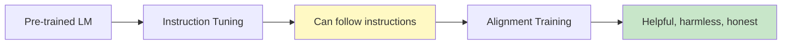
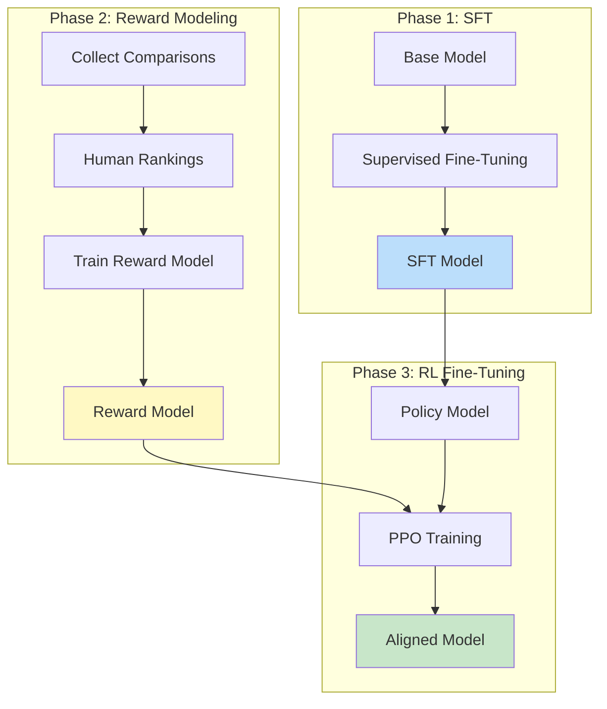
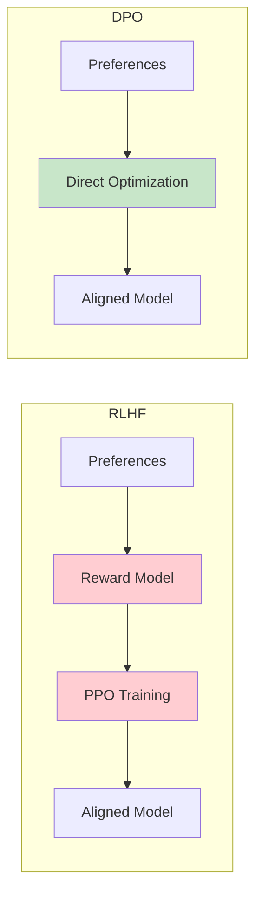
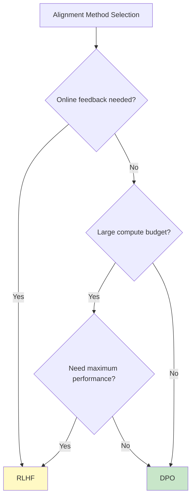
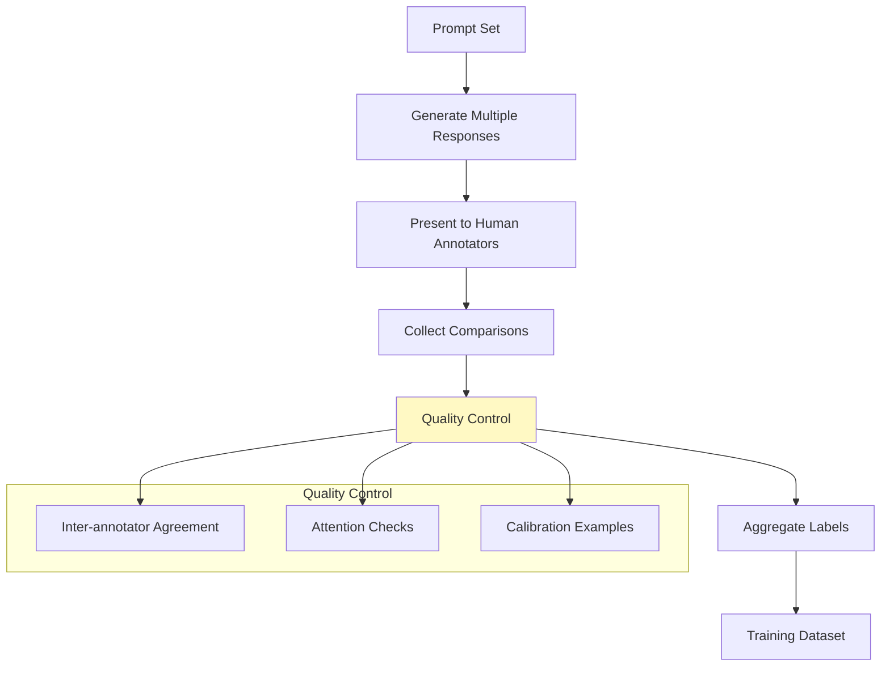
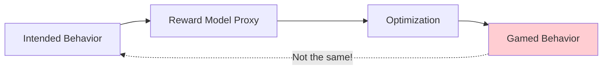

# RLHF and Direct Preference Optimization

> **Aligning language models with human preferences**

---

## Learning Objectives

- **Explain** the RLHF pipeline and why each component is necessary
- **Implement** reward model training and PPO fine-tuning
- **Compare** DPO vs RLHF: when each approach is appropriate
- **Design** preference data collection strategies
- **Diagnose** reward hacking and other alignment failure modes

---

## Why Alignment Matters

Instruction-tuned models can follow instructions, but they may produce:
- Harmful or biased content
- Factually incorrect but confident responses
- Unhelpful but technically "correct" responses

Alignment training teaches models **what humans prefer**, not just what's probable.



---

## RLHF: Reinforcement Learning from Human Feedback

### The RLHF Pipeline



### Phase 1: Supervised Fine-Tuning (SFT)

```python
# Standard instruction tuning as covered previously
# Creates the initial policy model
from transformers import AutoModelForCausalLM, TrainingArguments
from trl import SFTTrainer

sft_trainer = SFTTrainer(
    model=base_model,
    args=training_args,
    train_dataset=instruction_dataset,
    tokenizer=tokenizer,
    dataset_text_field="text",
)
sft_trainer.train()
```

### Phase 2: Reward Model Training

```python
import torch
from transformers import AutoModelForSequenceClassification, AutoTokenizer
from trl import RewardTrainer, RewardConfig

# Reward model architecture: LLM with scalar head
reward_model = AutoModelForSequenceClassification.from_pretrained(
    "meta-llama/Llama-2-7b-hf",
    num_labels=1,  # Scalar reward output
    torch_dtype=torch.bfloat16,
)

tokenizer = AutoTokenizer.from_pretrained("meta-llama/Llama-2-7b-hf")
tokenizer.pad_token = tokenizer.eos_token

# Preference data format
# Each example has: prompt, chosen (preferred response), rejected (less preferred)
preference_data = [
    {
        "prompt": "Explain quantum computing simply.",
        "chosen": "Quantum computing uses quantum bits (qubits) that can represent 0, 1, or both simultaneously...",
        "rejected": "Quantum computing is extremely complex and requires advanced physics knowledge to understand..."
    }
]

# Training config
reward_config = RewardConfig(
    output_dir="./reward_model",
    num_train_epochs=1,
    per_device_train_batch_size=4,
    gradient_accumulation_steps=4,
    learning_rate=1e-5,
    bf16=True,
)

# Train reward model
reward_trainer = RewardTrainer(
    model=reward_model,
    args=reward_config,
    train_dataset=preference_dataset,
    tokenizer=tokenizer,
)

reward_trainer.train()
```

### Phase 3: PPO Training

```python
from trl import PPOTrainer, PPOConfig, AutoModelForCausalLMWithValueHead
from transformers import AutoTokenizer

# Load SFT model with value head
model = AutoModelForCausalLMWithValueHead.from_pretrained("./sft_model")
ref_model = AutoModelForCausalLMWithValueHead.from_pretrained("./sft_model")  # Frozen reference

tokenizer = AutoTokenizer.from_pretrained("./sft_model")

# PPO Config
ppo_config = PPOConfig(
    model_name="./sft_model",
    learning_rate=1e-5,
    batch_size=64,
    mini_batch_size=4,
    gradient_accumulation_steps=16,
    ppo_epochs=4,
    kl_penalty="kl",      # KL divergence penalty
    target_kl=6.0,        # Target KL divergence
    init_kl_coef=0.2,     # Initial KL coefficient
    adap_kl_ctrl=True,    # Adaptive KL control
)

# Initialize PPO trainer
ppo_trainer = PPOTrainer(
    config=ppo_config,
    model=model,
    ref_model=ref_model,
    tokenizer=tokenizer,
)

# Training loop
def train_ppo(ppo_trainer, reward_model, prompts, num_steps=1000):
    for step in range(num_steps):
        # Sample prompts
        batch_prompts = sample_batch(prompts, ppo_config.batch_size)

        # Tokenize
        query_tensors = [tokenizer.encode(p, return_tensors="pt").squeeze()
                        for p in batch_prompts]

        # Generate responses
        response_tensors = []
        for query in query_tensors:
            response = ppo_trainer.generate(query, max_new_tokens=256)
            response_tensors.append(response.squeeze())

        # Compute rewards
        texts = [tokenizer.decode(r) for r in response_tensors]
        rewards = compute_rewards(reward_model, batch_prompts, texts)

        # PPO step
        stats = ppo_trainer.step(query_tensors, response_tensors, rewards)

        if step % 10 == 0:
            print(f"Step {step}: reward={stats['ppo/mean_scores']:.3f}, kl={stats['objective/kl']:.3f}")


def compute_rewards(reward_model, prompts, responses):
    """Compute rewards for prompt-response pairs"""
    rewards = []
    for prompt, response in zip(prompts, responses):
        inputs = tokenizer(
            prompt + response,
            return_tensors="pt",
            truncation=True,
            max_length=512
        ).to(reward_model.device)

        with torch.no_grad():
            reward = reward_model(**inputs).logits.item()
        rewards.append(torch.tensor(reward))

    return rewards
```

---

## DPO: Direct Preference Optimization

### The Key Insight

DPO eliminates the need for a separate reward model and RL training by directly optimizing on preferences.



### DPO Loss Function

The DPO objective directly optimizes the policy:

$$\mathcal{L}_{DPO} = -\mathbb{E}_{(x,y_w,y_l)\sim\mathcal{D}}\left[\log\sigma\left(\beta\log\frac{\pi_\theta(y_w|x)}{\pi_{ref}(y_w|x)} - \beta\log\frac{\pi_\theta(y_l|x)}{\pi_{ref}(y_l|x)}\right)\right]$$

Where:
- $y_w$: Winning (preferred) response
- $y_l$: Losing (rejected) response
- $\pi_\theta$: Policy being trained
- $\pi_{ref}$: Reference policy (frozen SFT model)
- $\beta$: Temperature parameter

::: info Intuition
DPO increases the probability of preferred responses relative to rejected ones, while staying close to the reference model (controlled by the ratio terms). No reward model or RL needed!
:::

### DPO Implementation

```python
from trl import DPOTrainer, DPOConfig
from transformers import AutoModelForCausalLM, AutoTokenizer
from peft import LoraConfig, get_peft_model

# Load SFT model
model = AutoModelForCausalLM.from_pretrained(
    "meta-llama/Llama-2-7b-hf",
    torch_dtype=torch.bfloat16,
    device_map="auto"
)

# Reference model (frozen copy)
ref_model = AutoModelForCausalLM.from_pretrained(
    "meta-llama/Llama-2-7b-hf",
    torch_dtype=torch.bfloat16,
    device_map="auto"
)

tokenizer = AutoTokenizer.from_pretrained("meta-llama/Llama-2-7b-hf")
tokenizer.pad_token = tokenizer.eos_token

# Optional: Use LoRA for memory efficiency
lora_config = LoraConfig(
    r=16,
    lora_alpha=32,
    target_modules=["q_proj", "v_proj", "k_proj", "o_proj"],
    lora_dropout=0.05,
    task_type="CAUSAL_LM"
)
model = get_peft_model(model, lora_config)

# DPO training config
dpo_config = DPOConfig(
    output_dir="./dpo_model",
    num_train_epochs=1,
    per_device_train_batch_size=2,
    gradient_accumulation_steps=8,
    learning_rate=5e-7,      # Lower than SFT
    beta=0.1,                # DPO temperature
    warmup_ratio=0.1,
    bf16=True,
    logging_steps=10,
    save_strategy="epoch",
    gradient_checkpointing=True,
)

# Preference dataset format
# {"prompt": "...", "chosen": "...", "rejected": "..."}
from datasets import load_dataset
preference_dataset = load_dataset("your_preference_data")

# Initialize DPO trainer
dpo_trainer = DPOTrainer(
    model=model,
    ref_model=ref_model,
    args=dpo_config,
    train_dataset=preference_dataset["train"],
    tokenizer=tokenizer,
)

# Train
dpo_trainer.train()
```

---

## RLHF vs DPO Comparison

| Aspect | RLHF | DPO |
|--------|------|-----|
| **Complexity** | High (3 phases, RL loop) | Low (single training) |
| **Stability** | Can be unstable | More stable |
| **Compute** | 4x model memory | 2x model memory |
| **Reward Model** | Required | Not needed |
| **Hyperparameters** | Many (KL coef, PPO params) | Few (mainly beta) |
| **Performance** | Slightly better at scale | Comparable |
| **Online Learning** | Possible | Offline only |

### When to Use Each



---

## Collecting Preference Data

### Comparison Types

```python
# Binary comparison (most common)
comparison = {
    "prompt": "Write a poem about nature",
    "response_a": "Trees sway gently...",
    "response_b": "The forest is green...",
    "preferred": "a"  # Human choice
}

# Likert scale rating
rating = {
    "prompt": "Explain photosynthesis",
    "response": "Plants convert sunlight...",
    "helpfulness": 4,     # 1-5 scale
    "accuracy": 5,
    "safety": 5
}

# Ranking (multiple responses)
ranking = {
    "prompt": "What is machine learning?",
    "responses": ["A", "B", "C", "D"],
    "ranking": [2, 0, 3, 1]  # Best to worst
}
```

### Data Collection Pipeline



### Synthetic Preference Data

```python
from openai import OpenAI

def generate_preference_pair(prompt, model="gpt-4"):
    """Generate a preference pair using a stronger model as judge"""
    client = OpenAI()

    # Generate two responses with different temperatures
    response_high_temp = generate_response(prompt, temperature=1.0)
    response_low_temp = generate_response(prompt, temperature=0.3)

    # Use GPT-4 as judge
    judge_prompt = f"""Compare these two responses to the prompt.
Prompt: {prompt}

Response A: {response_high_temp}
Response B: {response_low_temp}

Which response is better? Consider helpfulness, accuracy, and safety.
Output only "A" or "B"."""

    judgment = client.chat.completions.create(
        model="gpt-4",
        messages=[{"role": "user", "content": judge_prompt}],
        temperature=0
    ).choices[0].message.content.strip()

    chosen = response_high_temp if judgment == "A" else response_low_temp
    rejected = response_low_temp if judgment == "A" else response_high_temp

    return {
        "prompt": prompt,
        "chosen": chosen,
        "rejected": rejected
    }
```

---

## Reward Hacking and Failure Modes

### What is Reward Hacking?

The model learns to maximize the reward signal without actually improving on the intended objective.



### Common Failure Modes

| Failure Mode | Description | Mitigation |
|--------------|-------------|------------|
| **Length hacking** | Longer responses get higher rewards | Normalize by length |
| **Sycophancy** | Agrees with everything | Include disagreement examples |
| **Verbosity** | Overly wordy responses | Penalize unnecessary tokens |
| **Repetition** | Repeating phrases that score well | Repetition penalty |
| **Format gaming** | Exploiting reward model biases | Diverse reward training data |

### Mitigation Strategies

```python
def compute_adjusted_reward(
    reward_model,
    prompt,
    response,
    length_penalty=0.01,
    repetition_penalty=0.1
):
    """Compute reward with adjustments to prevent hacking"""

    # Base reward
    base_reward = reward_model(prompt + response)

    # Length penalty
    response_length = len(response.split())
    length_adjustment = -length_penalty * max(0, response_length - 100)

    # Repetition penalty
    words = response.lower().split()
    unique_ratio = len(set(words)) / len(words) if words else 1
    repetition_adjustment = -repetition_penalty * (1 - unique_ratio)

    adjusted_reward = base_reward + length_adjustment + repetition_adjustment

    return adjusted_reward


# KL divergence constraint in PPO prevents drift from reference
ppo_config = PPOConfig(
    target_kl=6.0,        # Stop if KL gets too high
    init_kl_coef=0.2,     # Penalty coefficient
    adap_kl_ctrl=True,    # Adapt coefficient during training
)
```

---

## Advanced: Constitutional AI

Constitutional AI uses a set of principles (constitution) to generate preferences.

```python
CONSTITUTION = [
    "Please choose the response that is most helpful and informative.",
    "Please choose the response that is least harmful or toxic.",
    "Please choose the response that is most honest and accurate.",
    "Please choose the response that best respects user privacy.",
]

def constitutional_critique(response, principles):
    """Generate critique based on constitutional principles"""
    critiques = []

    for principle in principles:
        critique_prompt = f"""Principle: {principle}

Response: {response}

Does this response violate the principle? If so, explain how and suggest an improvement."""

        critique = llm_generate(critique_prompt)
        critiques.append(critique)

    return critiques


def constitutional_revision(response, critiques):
    """Revise response based on critiques"""
    revision_prompt = f"""Original response: {response}

Critiques:
{format_critiques(critiques)}

Please revise the response to address these critiques while maintaining helpfulness."""

    revised = llm_generate(revision_prompt)
    return revised
```

---

## Interview Q&A

### Q1: Explain how RLHF works and why it's better than just supervised fine-tuning.

**Strong Answer:**
"RLHF consists of three phases:

1. **SFT Phase**: Fine-tune on high-quality demonstrations to create a capable baseline model.

2. **Reward Model Phase**: Train a model to predict human preferences. Given two responses, it outputs which one humans prefer. This is trained on comparison data.

3. **RL Phase**: Use PPO to optimize the policy to maximize the reward model's scores, while staying close to the SFT model (KL penalty).

Why it's better than pure SFT:

1. **Preferences are easier than demonstrations**: It's easier for humans to say 'A is better than B' than to write perfect responses from scratch.

2. **Captures nuanced preferences**: SFT only teaches 'this is correct', not 'this is better than that'. Preferences capture degrees of quality.

3. **Scales better**: You can collect millions of comparisons efficiently. Writing millions of perfect demonstrations is infeasible.

4. **Reduces harmful outputs**: The reward model can be trained to penalize harmful responses, which SFT alone can't do systematically.

The downside is complexity and instability, which is why DPO has become popular as a simpler alternative."

---

### Q2: What is DPO and why is it preferred over RLHF in many cases?

**Strong Answer:**
"DPO (Direct Preference Optimization) is an alignment method that achieves similar results to RLHF without requiring a separate reward model or RL training.

**Key insight**: The RLHF objective can be reparameterized to derive a closed-form solution. Instead of training a reward model and then doing RL, we can directly optimize the policy on preference pairs.

**The DPO loss**:
```
L = -log(sigmoid(beta * (log_prob_ratio_chosen - log_prob_ratio_rejected)))
```

Where log_prob_ratio compares the trained model to a reference model.

**Advantages over RLHF**:
1. **Simpler**: Single training phase, no reward model
2. **More stable**: No RL instabilities or reward hacking
3. **Less compute**: Only need to load 2 models (policy + reference) vs 4 for RLHF
4. **Easier to tune**: Main hyperparameter is beta (temperature)

**When RLHF is still preferred**:
1. Online/iterative learning (DPO is offline only)
2. Very large scale (RLHF can be slightly better)
3. Need explicit reward scores for other purposes

In practice, DPO achieves 95%+ of RLHF's performance with 50% of the engineering effort."

---

### Q3: What is reward hacking and how do you prevent it?

**Strong Answer:**
"Reward hacking is when the model finds ways to maximize the reward signal that don't align with the actual intended behavior. The reward model is an imperfect proxy for human preferences, and RL optimization exploits these imperfections.

**Examples**:
1. **Length hacking**: Writing very long responses because reward models often rate longer responses higher
2. **Sycophancy**: Agreeing with everything because positive responses get higher rewards
3. **Format gaming**: Using bullet points, headers, etc. because they correlate with higher ratings
4. **Repetition**: Repeating high-scoring phrases

**Prevention strategies**:

1. **KL divergence constraint**: Penalize deviation from the reference model, preventing extreme behavior shifts

2. **Reward normalization**: Normalize rewards by response length to prevent length gaming

3. **Diverse reward model training**: Include diverse examples including edge cases in reward training

4. **Ensemble reward models**: Use multiple reward models and aggregate to reduce single-model exploits

5. **Constitutional AI**: Add principle-based constraints that are harder to game

6. **Reward model regularization**: Train reward model with dropout and on more diverse data

7. **Human evaluation checkpoints**: Periodically evaluate with humans, not just reward model

The key is recognizing that the reward model is a proxy, not ground truth, and designing the training to be robust to proxy gaming."

---

## Summary

| Concept | Key Point |
|---------|-----------|
| **RLHF** | Three-phase pipeline: SFT, Reward Model, PPO |
| **DPO** | Direct optimization on preferences, no RL needed |
| **Reward Model** | Predicts human preferences as scalar scores |
| **KL Penalty** | Prevents model from drifting too far from reference |
| **Reward Hacking** | Model gaming the reward signal, not improving |
| **Preference Data** | Comparisons are easier to collect than demonstrations |

---

## Sources

- Ouyang et al., "Training language models to follow instructions with human feedback" (InstructGPT, 2022)
- Rafailov et al., "Direct Preference Optimization: Your Language Model is Secretly a Reward Model" (DPO, 2023)
- Schulman et al., "Proximal Policy Optimization Algorithms" (PPO, 2017)
- Bai et al., "Constitutional AI: Harmlessness from AI Feedback" (Anthropic, 2022)
- HuggingFace TRL Library Documentation
- OpenAI Alignment Research Blog Posts
