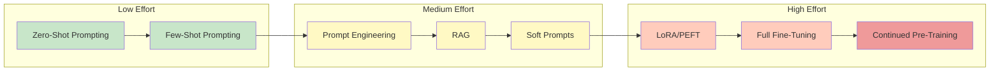
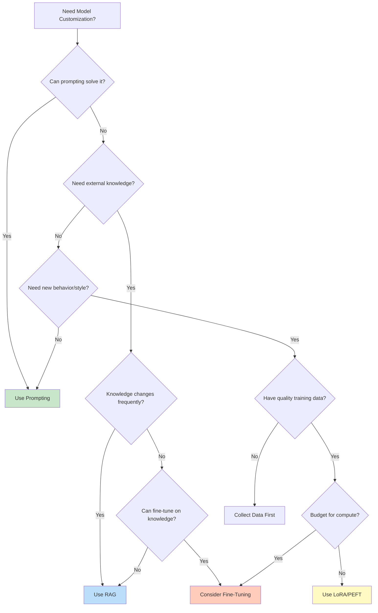
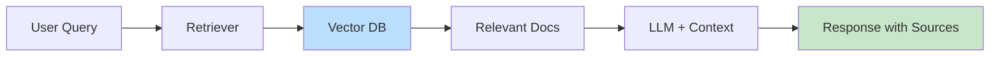
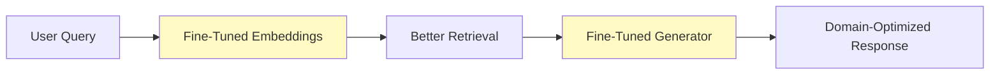

# When to Fine-Tune

> **A decision framework for choosing between prompting, RAG, and fine-tuning**

---

## Learning Objectives

- **Evaluate** the trade-offs between prompting, RAG, and fine-tuning
- **Apply** a systematic decision framework for customization strategies
- **Calculate** cost-benefit analysis for fine-tuning projects
- **Identify** scenarios where fine-tuning provides clear advantages
- **Recognize** anti-patterns that lead to failed fine-tuning attempts

---

## The Customization Spectrum

Before jumping to fine-tuning, consider the full spectrum of model customization options:



---

## Decision Framework

### When NOT to Fine-Tune

::: warning Before Fine-Tuning, Try These First
1. **Better prompting**: 80% of tasks can be solved with good prompts
2. **Few-shot examples**: Add 3-5 examples in context
3. **RAG**: If the model needs external knowledge
4. **Output parsing**: If the issue is format, not capability
:::

### Decision Tree



---

## Comparison Matrix

| Criterion | Prompting | RAG | Fine-Tuning |
|-----------|-----------|-----|-------------|
| **Setup Time** | Minutes | Hours-Days | Days-Weeks |
| **Data Required** | 0-5 examples | Documents | 1K-100K+ examples |
| **Compute Cost** | Per-token only | Per-token + retrieval | Training + serving |
| **Knowledge Updates** | Instant | Near-instant | Requires retraining |
| **Behavioral Changes** | Limited | Limited | Strong |
| **Latency** | Baseline | +retrieval time | Baseline |
| **Hallucination Control** | Prompt-based | Source-grounded | Training-based |

---

## When Fine-Tuning Excels

### 1. Consistent Output Format

```python
# Problem: Model doesn't consistently produce JSON
# Prompting attempt:
prompt = """Return a JSON object with fields: name, age, city.
User: John is 25 and lives in NYC"""

# Often fails with explanatory text around JSON

# Fine-tuning solution: Train on 1000s of input/output pairs
training_example = {
    "input": "John is 25 and lives in NYC",
    "output": '{"name": "John", "age": 25, "city": "NYC"}'
}
# After fine-tuning: Consistent JSON output without prompting overhead
```

### 2. Domain-Specific Language

```python
# Medical domain example
training_data = [
    {
        "input": "Patient presents with SOB and bilateral LE edema",
        "output": "The patient is experiencing shortness of breath and swelling in both lower extremities, which may indicate heart failure."
    },
    # ... thousands more examples
]
# Fine-tuned model understands medical abbreviations natively
```

### 3. Specific Writing Style

```python
# Brand voice adaptation
training_data = [
    {
        "input": "Write about our new product launch",
        "output": "Hey there! Guess what? We've got something AMAZING..."  # Brand voice
    }
]
```

### 4. Complex Reasoning Patterns

```python
# Legal document analysis
training_data = [
    {
        "input": "Contract clause: [complex legal text]",
        "output": "Risk Level: HIGH\nIssues: [structured analysis]\nRecommendation: [action items]"
    }
]
```

---

## When RAG is Better

### 1. Dynamic Knowledge

```python
from langchain.vectorstores import Chroma
from langchain.embeddings import OpenAIEmbeddings

# Knowledge that changes frequently
# Fine-tuning would be stale immediately
documents = load_latest_company_docs()  # Updated daily
vectorstore = Chroma.from_documents(documents, OpenAIEmbeddings())

# Query with latest information
retriever = vectorstore.as_retriever()
relevant_docs = retriever.get_relevant_documents("Q3 revenue")
```

### 2. Source Attribution Required

```python
# RAG provides citations; fine-tuning doesn't
response = rag_chain.invoke({
    "question": "What's our refund policy?",
    "context": retrieved_docs  # Can cite exact source
})
```

### 3. Knowledge is External



---

## Cost-Benefit Analysis

### Fine-Tuning Cost Model

```python
def estimate_fine_tuning_cost(
    model_size_b: float,  # Billions of parameters
    dataset_size: int,    # Number of examples
    epochs: int,
    gpu_hourly_cost: float = 2.0,  # A100 cost
    tokens_per_example: int = 500
):
    """Estimate fine-tuning costs"""
    # Training time estimation (rough)
    tokens_total = dataset_size * tokens_per_example * epochs
    tokens_per_second = 1000 / model_size_b  # Rough estimate
    hours = tokens_total / tokens_per_second / 3600

    training_cost = hours * gpu_hourly_cost

    # Serving cost difference (fine-tuned often cheaper per token)
    # No need for long prompts with examples

    return {
        "training_hours": hours,
        "training_cost": training_cost,
        "break_even_queries": training_cost / 0.001  # vs $0.001 saved per query
    }

# Example calculation
cost = estimate_fine_tuning_cost(
    model_size_b=7,
    dataset_size=10000,
    epochs=3
)
print(f"Training cost: ${cost['training_cost']:.2f}")
print(f"Break-even after: {cost['break_even_queries']:.0f} queries")
```

### ROI Decision Framework

| Factor | Favors Fine-Tuning | Favors Prompting/RAG |
|--------|-------------------|---------------------|
| **Query Volume** | >10K queries/day | <1K queries/day |
| **Data Availability** | Have labeled data | No training data |
| **Task Stability** | Task won't change | Requirements evolving |
| **Latency Requirements** | Need minimum latency | Latency flexible |
| **Prompt Length** | Currently >1K tokens | Short prompts work |

---

## Anti-Patterns to Avoid

### 1. Fine-Tuning for Factual Knowledge

```python
# BAD: Training facts into model
bad_training = [
    {"input": "What is the capital of France?", "output": "Paris"},
    {"input": "When was the company founded?", "output": "2015"},
]
# Problems:
# - Knowledge gets stale
# - Can't cite sources
# - May hallucinate related "facts"

# BETTER: Use RAG for factual queries
```

### 2. Insufficient Data

```python
# BAD: Fine-tuning with tiny dataset
dataset_size = 50  # Way too small

# Results:
# - Overfitting to examples
# - Poor generalization
# - Mode collapse

# Minimum recommended:
# - Simple format changes: 500-1000 examples
# - Style transfer: 1000-5000 examples
# - Complex behaviors: 10000+ examples
```

### 3. Ignoring Base Model Capabilities

```python
# BAD: Fine-tuning for tasks the model already does well
# Example: Basic sentiment classification with GPT-4
# The base model already excels at this!

# GOOD: Fine-tune for specialized variants
# Example: Domain-specific sentiment (financial news, medical records)
```

---

## Hybrid Approaches

### Fine-Tuning + RAG



```python
# Fine-tune both retriever and generator
from sentence_transformers import SentenceTransformer

# Fine-tuned embeddings for domain
embedder = SentenceTransformer("base-model")
embedder.fit(domain_pairs)  # (query, relevant_doc) pairs

# Fine-tuned generator for response style
from peft import LoraConfig, get_peft_model
generator = get_peft_model(base_llm, lora_config)
generator.train(domain_qa_pairs)

# Combined pipeline
def hybrid_pipeline(query):
    docs = retrieve(query, embedder)  # Domain-aware retrieval
    response = generator(query, docs)  # Domain-aware generation
    return response
```

---

## Interview Q&A

### Q1: When would you choose fine-tuning over RAG?

**Strong Answer:**
"I'd choose fine-tuning over RAG in three main scenarios:

1. **Behavioral changes**: When I need the model to consistently produce outputs in a specific format or style that prompting can't achieve reliably. For example, always outputting valid JSON or following a brand voice.

2. **Latency requirements**: Fine-tuned models don't have retrieval overhead. If I need sub-100ms responses and RAG adds 50-100ms, fine-tuning might be necessary.

3. **Learned reasoning patterns**: When the task requires learning a specific reasoning approach that's hard to describe but can be demonstrated through examples. For instance, legal document analysis where the reasoning pattern is complex but consistent.

However, I'd use RAG when knowledge needs to be updatable, when I need source attribution, or when the knowledge base is large and diverse."

---

### Q2: How would you evaluate if fine-tuning is worth the investment?

**Strong Answer:**
"I'd approach this as a cost-benefit analysis with four components:

1. **Training costs**: Compute for fine-tuning (GPUs, time), data preparation effort, and iteration cycles.

2. **Serving costs**: Compare per-token costs. Fine-tuned models often reduce prompt length significantly (no few-shot examples needed), which can reduce inference costs.

3. **Quality improvement**: Measure the performance gap between prompting baseline and fine-tuned model on a held-out test set. If prompting achieves 90% and fine-tuning achieves 95%, is that 5% worth the investment?

4. **Maintenance costs**: Fine-tuned models need retraining when requirements change. Factor in the ongoing cost of maintaining the pipeline.

The break-even calculation typically favors fine-tuning at high query volumes (>10K/day) or when prompt engineering would require very long prompts (>1000 tokens of examples)."

---

### Q3: What's the biggest mistake teams make when deciding to fine-tune?

**Strong Answer:**
"The biggest mistake is **not investing in prompting first**. Many teams jump to fine-tuning because it feels more 'serious' or technical, but:

1. **Prompting is faster to iterate**: You can test dozens of prompt variations in a day; fine-tuning takes days per experiment.

2. **Prompting establishes baselines**: You need to know how well prompting works to justify fine-tuning investment.

3. **Prompting informs data needs**: Failed prompts reveal what behaviors need training data.

4. **Many tasks don't need it**: In my experience, 70-80% of tasks can be solved with good prompting + RAG.

The second biggest mistake is **fine-tuning on the wrong data quality**. Garbage in, garbage out applies strongly to fine-tuning. A smaller, high-quality dataset beats a larger noisy one."

---

## Decision Checklist

Before starting a fine-tuning project, answer these questions:

| Question | Yes Action | No Action |
|----------|------------|-----------|
| Have you tried few-shot prompting? | Document baseline | Try it first |
| Is the gap significant? | Quantify improvement needed | Prompting may suffice |
| Do you have quality training data? | Proceed | Collect/create data |
| Is the task stable? | Proceed | Wait for stability |
| Do you have compute budget? | Full fine-tune or PEFT | Consider PEFT only |
| Will you maintain it? | Plan retraining | Consider alternatives |

---

## Summary

| Decision Point | Recommendation |
|----------------|----------------|
| **Start Here** | Always try prompting first |
| **Add Knowledge** | Use RAG for external/dynamic knowledge |
| **Change Behavior** | Fine-tune for format, style, reasoning |
| **Budget Constrained** | Use PEFT methods (LoRA) |
| **High Volume** | Fine-tuning ROI improves at scale |
| **Changing Requirements** | Prefer prompting/RAG flexibility |

---

## Sources

- "A Survey of Large Language Model Alignment" (Wang et al., 2023)
- "When Do You Need Retrieval vs. Fine-Tuning?" (Liu et al., 2023)
- OpenAI Fine-Tuning Guide Documentation
- HuggingFace PEFT Documentation
- Anthropic's Constitutional AI Paper
