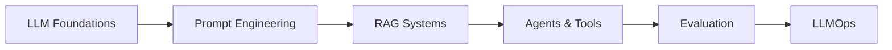
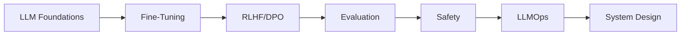
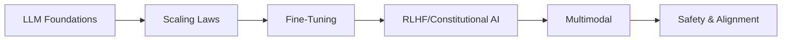
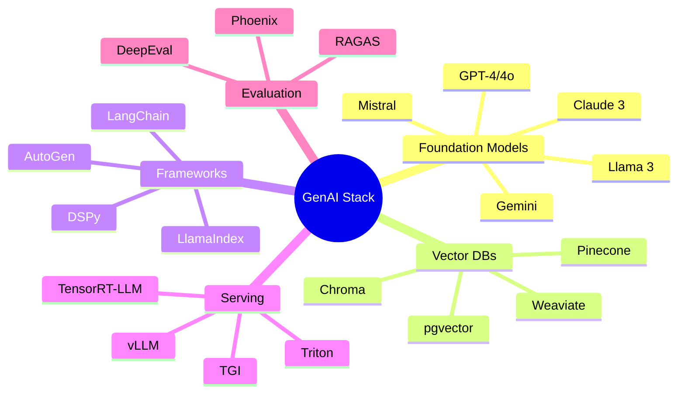

# GenAI Engineering

> **Complete interview preparation for GenAI Engineer, LLM Engineer, and Applied AI Scientist roles**

---

## Overview

This section bridges the gap between ML/transformer theory and production GenAI systems. Whether you're preparing for interviews at OpenAI, Anthropic, Google DeepMind, or building LLM applications at startups, this guide covers everything you need.

::: tip Prerequisites
Before diving in, ensure you've completed:
- [Transformers Deep Dive](/ml-fundamentals/transformers/) - Attention mechanisms, architecture, training
- [ML Fundamentals](/ml-fundamentals/) - Core ML concepts
- Basic Python and PyTorch proficiency
:::

---

## Learning Paths

### Path 1: LLM Application Developer (4-6 weeks)
*For engineers building products with LLM APIs*

| Week | Topics | Key Skills |
|------|--------|------------|
| 1-2 | LLM Foundations, Prompt Engineering | Sampling, CoT, few-shot |
| 3-4 | RAG Systems | Embeddings, chunking, retrieval |
| 5 | Agents & Tools | Function calling, ReAct |
| 6 | Evaluation, LLMOps | Metrics, deployment |

### Path 2: LLM/ML Engineer (6-8 weeks)
*For engineers fine-tuning and deploying models*

| Week | Topics | Key Skills |
|------|--------|------------|
| 1-2 | LLM Foundations | Architecture, inference |
| 3-4 | Fine-Tuning, PEFT | LoRA, instruction tuning |
| 5 | RLHF/DPO, Evaluation | Preference learning, benchmarks |
| 6-7 | Safety, LLMOps | Guardrails, serving |
| 8 | System Design | End-to-end architectures |

### Path 3: Research Engineer (8+ weeks)
*For researchers pushing the frontier*

| Week | Topics | Key Skills |
|------|--------|------------|
| 1-2 | LLM Foundations, Scaling | Architecture deep dive |
| 3-4 | Fine-Tuning, RLHF | Training dynamics |
| 5-6 | Safety, Constitutional AI | Alignment techniques |
| 7-8 | Multimodal, Advanced | Vision-language, video |

---

## Topics

### 1. [LLM Foundations](./llm-foundations/)
Bridge from transformer theory to practical LLM understanding.

| Module | Description |
|--------|-------------|
| [How LLMs Actually Work](./llm-foundations/how-llms-work) | Inference pipeline, sampling strategies |
| [Tokenization Deep Dive](./llm-foundations/tokenization-deep-dive) | BPE, SentencePiece, vocabulary |
| [Scaling Laws](./llm-foundations/scaling-laws) | Chinchilla, emergent abilities |
| [Model Families](./llm-foundations/model-families) | GPT, Claude, Llama, Gemini |
| [Context & Memory](./llm-foundations/context-and-memory) | Context windows, attention patterns |
| [Inference Optimization](./llm-foundations/inference-optimization) | KV-cache, speculative decoding |

---

### 2. [Prompt Engineering](./prompt-engineering/)
The art and science of communicating with LLMs.

| Module | Description |
|--------|-------------|
| [Prompt Anatomy](./prompt-engineering/prompt-anatomy) | Roles, structure, delimiters |
| [Few-Shot Learning](./prompt-engineering/few-shot-learning) | Example selection, ordering |
| [Chain-of-Thought](./prompt-engineering/chain-of-thought) | CoT, self-consistency, ToT |
| [Advanced Techniques](./prompt-engineering/advanced-techniques) | ReAct, decomposition |
| [Prompt Optimization](./prompt-engineering/prompt-optimization) | APE, DSPy, A/B testing |
| [Prompt Security](./prompt-engineering/prompt-security) | Injection, jailbreaks, defense |
| [Prompt Evaluation](./prompt-engineering/prompt-evaluation) | Metrics, versioning |

---

### 3. [RAG Systems](./rag-systems/)
Building retrieval-augmented generation pipelines.

| Module | Description |
|--------|-------------|
| [RAG Architecture](./rag-systems/rag-architecture) | E2E pipeline, decision framework |
| [Embedding Models](./rag-systems/embedding-models) | OpenAI, Cohere, BGE, similarity |
| [Vector Databases](./rag-systems/vector-databases) | Pinecone, Weaviate, HNSW |
| [Chunking Strategies](./rag-systems/chunking-strategies) | Fixed, semantic, recursive |
| [Retrieval Optimization](./rag-systems/retrieval-optimization) | Hybrid search, reranking |
| [Advanced RAG Patterns](./rag-systems/advanced-rag-patterns) | FLARE, Self-RAG, GraphRAG |
| [RAG Evaluation](./rag-systems/rag-evaluation) | RAGAS, MRR, faithfulness |

---

### 4. [Fine-Tuning LLMs](./fine-tuning/)
When and how to adapt foundation models.

| Module | Description |
|--------|-------------|
| [When to Fine-Tune](./fine-tuning/when-to-fine-tune) | Decision framework |
| [Full Fine-Tuning](./fine-tuning/full-fine-tuning) | Training, catastrophic forgetting |
| [PEFT Methods](./fine-tuning/peft-methods) | LoRA, QLoRA, adapters |
| [Instruction Tuning](./fine-tuning/instruction-tuning) | Dataset creation, FLAN |
| [RLHF & DPO](./fine-tuning/rlhf-dpo) | Reward modeling, preferences |
| [Data Preparation](./fine-tuning/data-preparation) | Quality, synthetic data |
| [Fine-Tuning Evaluation](./fine-tuning/fine-tuning-evaluation) | Overfitting, benchmarks |

---

### 5. [Agents & Tool Use](./agents-and-tools/)
Building autonomous AI systems.

| Module | Description |
|--------|-------------|
| [Agent Architectures](./agents-and-tools/agent-architectures) | ReAct, MRKL, cognitive |
| [Function Calling](./agents-and-tools/function-calling) | Schemas, extraction |
| [Multi-Agent Systems](./agents-and-tools/multi-agent-systems) | Orchestration, debate |
| [Memory & State](./agents-and-tools/memory-and-state) | Short/long-term memory |
| [Agent Frameworks](./agents-and-tools/agent-frameworks) | LangChain, AutoGen |
| [Agent Evaluation](./agents-and-tools/agent-evaluation) | Task completion, safety |

---

### 6. [Evaluation & Benchmarking](./evaluation/)
Measuring LLM capabilities systematically.

| Module | Description |
|--------|-------------|
| [Evaluation Taxonomy](./evaluation/evaluation-taxonomy) | Categories, dimensions |
| [Automated Metrics](./evaluation/automated-metrics) | BLEU, ROUGE, BERTScore |
| [LLM-as-Judge](./evaluation/llm-as-judge) | G-Eval, calibration |
| [Human Evaluation](./evaluation/human-evaluation) | Annotation, agreement |
| [Hallucination Detection](./evaluation/hallucination-detection) | Detection, mitigation |
| [Benchmarks](./evaluation/benchmarks) | MMLU, HumanEval, MT-Bench |

---

### 7. [Safety & Alignment](./safety-and-alignment/)
Building responsible AI systems.

| Module | Description |
|--------|-------------|
| [Safety Fundamentals](./safety-and-alignment/safety-fundamentals) | Landscape, risks |
| [Content Filtering](./safety-and-alignment/content-filtering) | Moderation, PII |
| [Guardrails](./safety-and-alignment/guardrails) | NeMo, validators |
| [Red Teaming](./safety-and-alignment/red-teaming) | Adversarial testing |
| [Constitutional AI](./safety-and-alignment/constitutional-ai) | Principle-based training |
| [Responsible AI](./safety-and-alignment/responsible-ai) | Fairness, governance |

---

### 8. [LLMOps & Production](./llmops/)
Operating LLMs at scale.

| Module | Description |
|--------|-------------|
| [Serving Infrastructure](./llmops/serving-infrastructure) | vLLM, TGI, Triton |
| [Cost Optimization](./llmops/cost-optimization) | Token economics, caching |
| [Latency Optimization](./llmops/latency-optimization) | TTFT, streaming |
| [Caching Strategies](./llmops/caching-strategies) | Semantic, KV-cache |
| [Monitoring](./llmops/monitoring) | Metrics, observability |
| [Scaling Patterns](./llmops/scaling-patterns) | Horizontal, auto-scaling |

---

### 9. [Multimodal AI](./multimodal/)
Beyond text: vision, audio, and video.

| Module | Description |
|--------|-------------|
| [Vision-Language Models](./multimodal/vision-language-models) | CLIP, GPT-4V, LLaVA |
| [Image Generation](./multimodal/image-generation) | Diffusion, DALL-E |
| [Audio Models](./multimodal/audio-models) | Whisper, TTS |
| [Video Understanding](./multimodal/video-understanding) | Video-LLMs, temporal |
| [Multimodal RAG](./multimodal/multimodal-rag) | Cross-modal retrieval |

---

### 10. [GenAI System Design](./system-design/)
End-to-end design for GenAI interviews.

| Module | Description |
|--------|-------------|
| [Design Framework](./system-design/design-framework) | Methodology, trade-offs |
| [Chatbot Design](./system-design/chatbot-design) | Multi-turn, personas |
| [Enterprise RAG](./system-design/enterprise-rag) | Knowledge bases, scale |
| [Code Assistant](./system-design/code-assistant) | Copilot architecture |
| [Content Pipeline](./system-design/content-pipeline) | Generation at scale |
| [Interview Questions](./system-design/interview-questions) | 15+ solved designs |

---

## Quick Reference

### Interview Question Bank

| Category | Count | Difficulty |
|----------|-------|------------|
| LLM Fundamentals | 10-12 | Medium |
| Prompt Engineering | 12-15 | Medium-Hard |
| RAG Systems | 15-18 | Hard |
| Fine-Tuning | 12-15 | Hard |
| Agents | 10-12 | Hard |
| Evaluation | 10-12 | Medium |
| Safety | 8-10 | Medium |
| LLMOps | 10-12 | Hard |
| Multimodal | 8-10 | Hard |
| System Design | 15-20 | Very Hard |

**Total: 100+ interview questions with detailed solutions**

---

### Key Concepts Cheat Sheet

| Concept | One-Liner |
|---------|-----------|
| **Temperature** | Controls randomness in token sampling (0 = deterministic, 1+ = creative) |
| **Top-k** | Sample from k highest probability tokens |
| **Top-p (Nucleus)** | Sample from smallest set with cumulative prob >= p |
| **CoT** | Chain-of-thought: "Let's think step by step" |
| **RAG** | Retrieval-Augmented Generation: retrieve then generate |
| **LoRA** | Low-Rank Adaptation: efficient fine-tuning with small matrices |
| **DPO** | Direct Preference Optimization: simpler alternative to RLHF |
| **ReAct** | Reasoning + Acting: interleave thought and action |
| **TTFT** | Time To First Token: initial response latency |
| **KV-Cache** | Key-Value cache: stores attention computations |

---

### Technology Landscape

---

## How to Use This Section

1. **Pick your learning path** based on your target role
2. **Work through modules sequentially** within each topic
3. **Complete the interview Q&A** at the end of each module
4. **Build mini-projects** to solidify understanding
5. **Review system design** before interviews

::: warning Interview Focus
Each module includes an "Interview Angle" section highlighting how concepts appear in real interviews. Pay special attention to these sections.
:::

---

## Related Sections

| Section | Connection |
|---------|------------|
| [Transformers](/ml-fundamentals/transformers/) | Foundational architecture for all LLMs |
| [ML System Design](/ml-design/) | General ML system design principles |
| [ML Coding](/ml-coding/) | Implementation practice |

---

*Section created: January 2025*
*Estimated completion time: 4-8 weeks depending on path*
