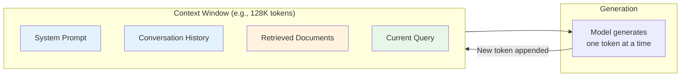
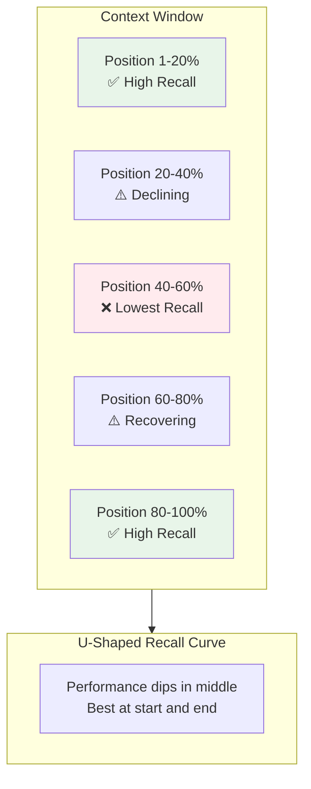
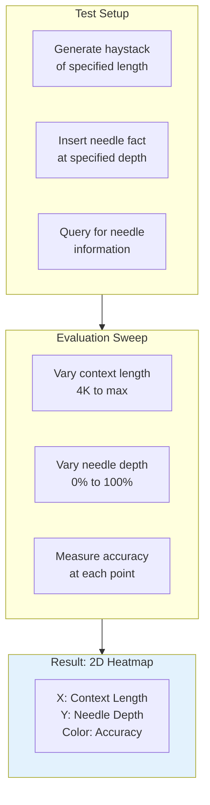
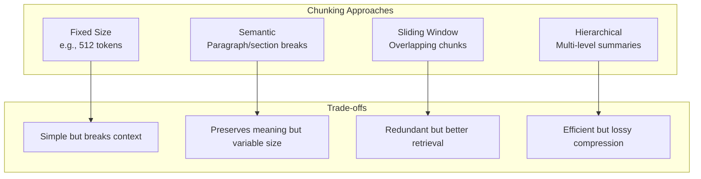

# Context and Memory

Understanding how LLMs utilize their context window is crucial for building effective applications. This module explores context limitations, the "lost in the middle" phenomenon, and strategies for maximizing information retrieval from long contexts.

## Learning Objectives

- **Explain context window limitations** and their computational origins
- **Analyze the "lost in the middle" phenomenon** and its implications for RAG systems
- **Design effective context placement strategies** to maximize information retrieval
- **Evaluate long-context models** using needle-in-haystack and other benchmarks
- **Implement chunking and placement heuristics** for production systems

## What Is a Context Window?

The context window is the maximum number of tokens an LLM can process in a single forward pass. Think of it as the model's "working memory" - everything it can see at once.



### Context Window Sizes

| Model | Context Window | Equivalent Text |
|-------|---------------|-----------------|
| GPT-3 | 4,096 | ~3,000 words / 6 pages |
| GPT-4 | 8,192 | ~6,000 words / 12 pages |
| GPT-4 Turbo | 128,000 | ~96,000 words / 190 pages |
| Claude 3 | 200,000 | ~150,000 words / 300 pages |
| Gemini 1.5 Pro | 2,000,000 | ~1.5M words / 3,000 pages |

::: info Complexity Analysis
**Why context is limited:**
- Self-attention is O(n^2) in sequence length
- KV cache grows linearly: 2 * layers * heads * head_dim * seq_len * bytes
- For a 70B model at 100K context: ~40GB just for KV cache

**Cost scaling:**
- Memory: O(n) for KV cache
- Compute: O(n^2) for attention
- This is why APIs charge per-token
:::

## The Lost in the Middle Problem

Research by Liu et al. (2023) revealed a critical finding: **LLMs are worse at retrieving information from the middle of their context window** compared to the beginning or end.



### Demonstrating the Effect

```python
import random
from typing import List, Tuple
from dataclasses import dataclass

@dataclass
class RetrievalTest:
    """Test case for measuring position-based retrieval."""
    documents: List[str]
    needle_position: int  # Index where answer is placed
    needle: str
    query: str
    expected_answer: str

def create_lost_in_middle_test(
    num_documents: int = 20,
    needle_position: int = 10,
) -> RetrievalTest:
    """
    Create a test to measure lost-in-the-middle effect.

    The "needle" is a unique fact placed at a specific position
    among distractor documents.
    """
    # Generate distractor documents
    distractors = [
        f"Document {i}: This contains general information about topic {i}. "
        f"The key points are X, Y, and Z related to subject {i}."
        for i in range(num_documents)
    ]

    # The needle - unique information we'll query for
    needle = (
        "Document NEEDLE: The secret code for the vault is 7392. "
        "This information is critical and must be remembered."
    )

    # Insert needle at specified position
    documents = distractors[:needle_position] + [needle] + distractors[needle_position:]

    return RetrievalTest(
        documents=documents,
        needle_position=needle_position,
        needle=needle,
        query="What is the secret code for the vault?",
        expected_answer="7392"
    )


def run_position_sweep(
    model_fn,  # Function that takes context + query, returns answer
    num_documents: int = 20,
    num_trials: int = 5,
) -> dict:
    """
    Test retrieval accuracy at different context positions.

    Returns accuracy for each position bucket.
    """
    results = {pos: [] for pos in range(num_documents + 1)}

    for position in range(num_documents + 1):
        for _ in range(num_trials):
            test = create_lost_in_middle_test(
                num_documents=num_documents,
                needle_position=position
            )

            context = "\n\n".join(test.documents)
            prompt = f"{context}\n\nQuestion: {test.query}\nAnswer:"

            answer = model_fn(prompt)
            correct = test.expected_answer in answer

            results[position].append(correct)

    # Calculate accuracy per position
    accuracies = {
        pos: sum(trials) / len(trials)
        for pos, trials in results.items()
    }

    return accuracies


# Expected results show U-shaped curve:
# Position 0-3: ~90% accuracy
# Position 8-12: ~60% accuracy
# Position 17-20: ~85% accuracy
```

### Why Does This Happen?

```python
"""
The lost-in-the-middle effect has several hypothesized causes:

1. POSITIONAL ATTENTION BIAS
   - Attention patterns tend to focus on recent tokens (recency bias)
   - And on tokens near the beginning (primacy bias from pretraining)
   - Middle positions receive less attention weight

2. TRAINING DISTRIBUTION
   - Pretraining data rarely has critical info buried in the middle
   - Documents naturally front-load important information
   - The model learns this pattern

3. ATTENTION DILUTION
   - With more tokens, attention is spread thinner
   - Important middle tokens compete with more distractors
   - Signal-to-noise ratio decreases

4. CAUSAL MASKING EFFECTS
   - Early tokens attend to nothing before them
   - Late tokens can attend to everything
   - Middle tokens are in an awkward position
"""

def analyze_attention_patterns(
    attention_weights,  # [batch, heads, seq_len, seq_len]
    layer_idx: int = -1,  # Last layer typically shows this pattern
):
    """
    Analyze attention patterns to understand lost-in-the-middle.
    """
    import numpy as np

    # Average over batch and heads
    avg_attention = attention_weights[0, :, :, :].mean(axis=0)

    # For each query position, where does it attend most?
    for query_pos in range(0, len(avg_attention), len(avg_attention) // 5):
        attention_to_positions = avg_attention[query_pos]
        top_attended = np.argsort(attention_to_positions)[-5:][::-1]
        print(f"Position {query_pos} attends most to: {top_attended}")

    # You'll typically see: strong attention to position 0 and nearby positions
```

## Needle in a Haystack Benchmark

The "Needle in a Haystack" (NIAH) test has become the standard for evaluating long-context performance.



### Implementation

```python
import json
from typing import Callable, List, Optional
from dataclasses import dataclass
import numpy as np

@dataclass
class NIAHConfig:
    """Configuration for Needle in a Haystack evaluation."""
    context_lengths: List[int]  # e.g., [4000, 8000, 16000, 32000]
    depth_percentages: List[float]  # e.g., [0.0, 0.25, 0.5, 0.75, 1.0]
    needle_template: str = "The special magic number is: {value}"
    query: str = "What is the special magic number?"
    haystack_source: str = "essays"  # Source of filler text

class NeedleInHaystack:
    """
    Needle in a Haystack evaluation framework.

    Tests a model's ability to retrieve information from
    various positions across various context lengths.
    """

    def __init__(self, config: NIAHConfig):
        self.config = config
        self.results = {}

    def generate_haystack(self, target_length: int) -> str:
        """
        Generate filler text of approximately target_length tokens.

        In practice, use:
        - Paul Graham essays
        - Random Wikipedia articles
        - Repeated neutral passages
        """
        # Simplified: generate repeated filler
        filler_unit = (
            "This is a passage of text that serves as filler content. "
            "It discusses various topics without containing any specific "
            "information that would answer queries about magic numbers. "
            "The content continues with general observations about life, "
            "technology, and other subjects. "
        )

        # Rough estimate: 1 token ≈ 4 characters
        target_chars = target_length * 4
        repetitions = target_chars // len(filler_unit) + 1

        haystack = filler_unit * repetitions
        return haystack[:target_chars]

    def insert_needle(
        self,
        haystack: str,
        needle: str,
        depth_percentage: float
    ) -> str:
        """
        Insert needle at specified depth in haystack.

        depth_percentage = 0.0 -> beginning
        depth_percentage = 1.0 -> end
        """
        insertion_point = int(len(haystack) * depth_percentage)

        # Insert at sentence boundary for naturalness
        # Find nearest period
        if insertion_point > 0:
            period_before = haystack.rfind('. ', 0, insertion_point)
            period_after = haystack.find('. ', insertion_point)

            if period_before != -1:
                insertion_point = period_before + 2
            elif period_after != -1:
                insertion_point = period_after + 2

        return haystack[:insertion_point] + needle + " " + haystack[insertion_point:]

    def run_single_test(
        self,
        model_fn: Callable[[str], str],
        context_length: int,
        depth_percentage: float,
        needle_value: str = "42",
    ) -> dict:
        """Run a single NIAH test."""
        # Generate components
        haystack = self.generate_haystack(context_length)
        needle = self.config.needle_template.format(value=needle_value)

        # Insert needle
        context = self.insert_needle(haystack, needle, depth_percentage)

        # Query model
        prompt = f"{context}\n\n{self.config.query}"
        response = model_fn(prompt)

        # Check if answer is correct
        correct = needle_value in response

        return {
            "context_length": context_length,
            "depth_percentage": depth_percentage,
            "correct": correct,
            "response": response[:200],  # Truncate for logging
        }

    def run_full_evaluation(
        self,
        model_fn: Callable[[str], str],
        num_trials: int = 3,
    ) -> np.ndarray:
        """
        Run complete NIAH evaluation sweep.

        Returns 2D array of accuracies [depths x context_lengths]
        """
        n_depths = len(self.config.depth_percentages)
        n_lengths = len(self.config.context_lengths)
        results = np.zeros((n_depths, n_lengths))

        for i, depth in enumerate(self.config.depth_percentages):
            for j, length in enumerate(self.config.context_lengths):
                trial_results = []
                for trial in range(num_trials):
                    # Use different needle values each trial
                    needle_value = str(1000 + trial * 111)
                    result = self.run_single_test(
                        model_fn, length, depth, needle_value
                    )
                    trial_results.append(result["correct"])

                accuracy = sum(trial_results) / len(trial_results)
                results[i, j] = accuracy

                print(f"Depth {depth:.0%}, Length {length}: {accuracy:.0%}")

        return results


# Usage
config = NIAHConfig(
    context_lengths=[4000, 8000, 16000, 32000, 64000],
    depth_percentages=[0.0, 0.25, 0.5, 0.75, 1.0],
)

evaluator = NeedleInHaystack(config)
# results = evaluator.run_full_evaluation(model_fn)
```

## Strategies for Effective Context Use

### 1. Strategic Placement

```python
from typing import List, Tuple
from dataclasses import dataclass

@dataclass
class ContextItem:
    """An item to place in context with metadata."""
    content: str
    relevance_score: float
    category: str  # "system", "history", "retrieval", "query"

class ContextOptimizer:
    """
    Optimize context placement for better retrieval.

    Key insight: Place most important information at the
    beginning and end of the context, not the middle.
    """

    def __init__(self, max_tokens: int = 128000):
        self.max_tokens = max_tokens

    def arrange_for_retrieval(
        self,
        items: List[ContextItem],
        strategy: str = "edges"
    ) -> List[ContextItem]:
        """
        Arrange context items to maximize retrieval accuracy.

        Strategies:
        - "edges": Most relevant at start and end
        - "chronological": Maintain order (for conversation)
        - "hierarchical": System prompt first, then by relevance
        """
        if strategy == "edges":
            return self._edges_strategy(items)
        elif strategy == "chronological":
            return items  # Maintain original order
        elif strategy == "hierarchical":
            return self._hierarchical_strategy(items)
        else:
            raise ValueError(f"Unknown strategy: {strategy}")

    def _edges_strategy(self, items: List[ContextItem]) -> List[ContextItem]:
        """
        Place most relevant items at edges, least in middle.

        The "lost in the middle" research shows this maximizes
        information retrieval.
        """
        # Sort by relevance
        sorted_items = sorted(items, key=lambda x: x.relevance_score, reverse=True)

        # Interleave: 1st at start, 2nd at end, 3rd at start...
        result = []
        start_items = []
        end_items = []

        for i, item in enumerate(sorted_items):
            if i % 2 == 0:
                start_items.append(item)
            else:
                end_items.append(item)

        # Combine: start items, then reversed end items
        result = start_items + end_items[::-1]
        return result

    def _hierarchical_strategy(self, items: List[ContextItem]) -> List[ContextItem]:
        """
        System prompt first, then by category and relevance.
        """
        # Group by category
        system = [i for i in items if i.category == "system"]
        query = [i for i in items if i.category == "query"]
        history = sorted(
            [i for i in items if i.category == "history"],
            key=lambda x: x.relevance_score,
            reverse=True
        )
        retrieval = sorted(
            [i for i in items if i.category == "retrieval"],
            key=lambda x: x.relevance_score,
            reverse=True
        )

        # Order: system (start) -> high-rel retrieval -> history -> low-rel retrieval -> query (end)
        mid_point = len(retrieval) // 2
        return (
            system +
            retrieval[:mid_point] +
            history +
            retrieval[mid_point:] +
            query
        )


# Example usage
optimizer = ContextOptimizer()

items = [
    ContextItem("You are a helpful assistant.", 1.0, "system"),
    ContextItem("User asked about X earlier.", 0.3, "history"),
    ContextItem("Document A: highly relevant info.", 0.9, "retrieval"),
    ContextItem("Document B: somewhat relevant.", 0.5, "retrieval"),
    ContextItem("Document C: tangentially related.", 0.2, "retrieval"),
    ContextItem("What is the answer to X?", 1.0, "query"),
]

arranged = optimizer.arrange_for_retrieval(items, strategy="edges")
for item in arranged:
    print(f"[{item.category}] Score: {item.relevance_score:.1f} - {item.content[:50]}...")
```

### 2. Chunking Strategies



```python
from typing import List, Iterator
import re

class ChunkingStrategies:
    """
    Different strategies for splitting documents into chunks
    for embedding and retrieval.
    """

    @staticmethod
    def fixed_size(
        text: str,
        chunk_size: int = 512,
        overlap: int = 50
    ) -> List[str]:
        """
        Split into fixed-size chunks with overlap.

        Overlap helps preserve context across chunk boundaries.
        """
        # Tokenize (simplified: split on whitespace)
        words = text.split()

        chunks = []
        start = 0

        while start < len(words):
            end = start + chunk_size
            chunk = ' '.join(words[start:end])
            chunks.append(chunk)
            start = end - overlap  # Overlap

        return chunks

    @staticmethod
    def semantic(text: str, separators: List[str] = None) -> List[str]:
        """
        Split on semantic boundaries (paragraphs, sections).

        Preserves logical units of meaning.
        """
        if separators is None:
            separators = ['\n\n', '\n', '. ', '! ', '? ']

        def recursive_split(text: str, sep_idx: int = 0) -> List[str]:
            if sep_idx >= len(separators):
                return [text] if text.strip() else []

            separator = separators[sep_idx]
            parts = text.split(separator)

            if len(parts) == 1:
                return recursive_split(text, sep_idx + 1)

            chunks = []
            for part in parts:
                if part.strip():
                    chunks.extend(recursive_split(part, sep_idx + 1))
            return chunks

        return recursive_split(text)

    @staticmethod
    def sliding_window(
        text: str,
        window_size: int = 512,
        stride: int = 256
    ) -> List[str]:
        """
        Overlapping windows for better boundary handling.

        Each position is covered by multiple chunks,
        improving retrieval robustness.
        """
        words = text.split()
        chunks = []

        for start in range(0, len(words) - window_size + 1, stride):
            chunk = ' '.join(words[start:start + window_size])
            chunks.append(chunk)

        # Handle remaining text
        if len(words) > 0 and (len(words) - 1) % stride != 0:
            chunks.append(' '.join(words[-window_size:]))

        return chunks

    @staticmethod
    def parent_child(
        text: str,
        parent_size: int = 2048,
        child_size: int = 256
    ) -> dict:
        """
        Hierarchical chunking: small chunks for retrieval,
        large chunks for context.

        When a child chunk matches, include the parent for
        more context in the prompt.
        """
        # Create parent chunks
        words = text.split()
        parents = []
        for i in range(0, len(words), parent_size):
            parent_text = ' '.join(words[i:i + parent_size])
            parent_id = f"parent_{i // parent_size}"
            parents.append({"id": parent_id, "text": parent_text})

        # Create child chunks with parent references
        children = []
        for parent in parents:
            parent_words = parent["text"].split()
            for j in range(0, len(parent_words), child_size):
                child_text = ' '.join(parent_words[j:j + child_size])
                children.append({
                    "parent_id": parent["id"],
                    "text": child_text
                })

        return {"parents": parents, "children": children}
```

### 3. Context Compression

```python
class ContextCompressor:
    """
    Techniques to fit more information in limited context.
    """

    @staticmethod
    def extractive_compression(
        documents: List[str],
        query: str,
        model_fn,  # Embedding or summarization model
        target_sentences: int = 5
    ) -> str:
        """
        Select most relevant sentences from each document.

        More efficient than full documents but may lose context.
        """
        import re

        all_sentences = []
        for doc in documents:
            sentences = re.split(r'[.!?]+', doc)
            all_sentences.extend([s.strip() for s in sentences if s.strip()])

        # Score sentences by relevance to query (simplified)
        # In practice, use embeddings and cosine similarity
        scored = []
        for sentence in all_sentences:
            # Naive scoring: word overlap
            query_words = set(query.lower().split())
            sentence_words = set(sentence.lower().split())
            overlap = len(query_words & sentence_words)
            scored.append((overlap, sentence))

        # Select top sentences
        scored.sort(reverse=True)
        selected = [s[1] for s in scored[:target_sentences]]

        return '. '.join(selected)

    @staticmethod
    def abstractive_summary(
        documents: List[str],
        summarization_fn,  # LLM summarization function
        max_summary_tokens: int = 500
    ) -> str:
        """
        Generate summaries of documents to fit more info.

        Trade-off: Potential information loss vs. space savings.
        """
        combined = '\n\n'.join(documents)
        prompt = f"""Summarize the following documents concisely,
preserving key facts and details:

{combined}

Summary:"""

        return summarization_fn(prompt, max_tokens=max_summary_tokens)

    @staticmethod
    def iterative_refinement(
        context: str,
        query: str,
        refinement_fn,
        target_reduction: float = 0.5
    ) -> str:
        """
        Iteratively remove less relevant parts until target size.

        Useful for very long contexts that must be significantly compressed.
        """
        current = context
        original_length = len(current)
        target_length = int(original_length * target_reduction)

        iteration = 0
        while len(current) > target_length and iteration < 5:
            prompt = f"""Given this context and query, remove the least
relevant portions while preserving information needed to answer the query.

Query: {query}

Context:
{current}

Compressed context:"""

            current = refinement_fn(prompt)
            iteration += 1

        return current
```

## Interview Q&A

### Q1: Explain the "lost in the middle" phenomenon and how you would mitigate it in a RAG system.

**Strong Answer:**

The "lost in the middle" phenomenon, identified by Liu et al. (2023), shows that LLMs have **significantly worse recall for information placed in the middle of their context window** compared to the beginning or end.

**Why it happens:**
1. **Attention bias**: Models develop primacy (attend to start) and recency (attend to end) biases during training
2. **Training data patterns**: Documents naturally front-load important information
3. **Attention dilution**: With long contexts, attention spreads thin, and middle positions get less focus

**Mitigation strategies for RAG:**

1. **Strategic placement**: Place most relevant retrieved documents at the start and end
```python
def reorder_documents(docs_by_relevance):
    # Highest relevance at position 0, second at position -1, etc.
    reordered = []
    for i, doc in enumerate(docs_by_relevance):
        if i % 2 == 0:
            reordered.insert(0, doc)  # Add to front
        else:
            reordered.append(doc)  # Add to back
    return reordered
```

2. **Reduce context when possible**: If you can answer with 3 documents, don't stuff 20

3. **Use hierarchical retrieval**: Retrieve with small chunks, but include parent paragraphs for context

4. **Query near the needle**: Place the question immediately after relevant documents

5. **Consider multi-hop**: For very long contexts, break into multiple queries

---

### Q2: How would you evaluate a model's long-context capabilities?

**Strong Answer:**

I'd use a multi-faceted evaluation approach:

**1. Needle in a Haystack (NIAH)**
- Insert unique facts at varying positions and lengths
- Create 2D heatmap: context length vs. insertion depth
- Test retrieval accuracy at each point
- Shows: Where does the model "lose" information?

**2. Multi-needle retrieval**
- Insert multiple facts across the context
- Query for all of them
- Tests: Can the model aggregate distributed information?

**3. Long-document QA**
- Use naturally long documents (papers, books, codebases)
- Ask questions requiring synthesis across sections
- Tests: Real-world long-context understanding

**4. Reasoning over long context**
- Provide a long chain of logical dependencies
- Ask questions requiring multiple hops
- Tests: Not just retrieval, but reasoning with context

**5. Perplexity at position**
- Measure next-token perplexity at various context depths
- If perplexity increases with depth, the model isn't using early context well

**Key metrics:**
- Accuracy (binary: found/not found)
- F1 score (for partial matches)
- Latency scaling (how inference time grows)
- Memory usage (KV cache growth)

**Red flags to watch:**
- Sharp accuracy drop beyond certain length
- Systematic blind spots at specific depths
- Hallucination when information is "lost"

---

### Q3: You have 50 documents to use as context but only 32K tokens. How do you decide what to include?

**Strong Answer:**

This is a common production scenario. Here's my systematic approach:

**Step 1: Relevance scoring**
```python
# Score each document by relevance to query
scores = embedding_model.similarity(query, documents)
ranked = sorted(zip(documents, scores), key=lambda x: -x[1])
```

**Step 2: Select with budget**
```python
def select_documents(ranked, token_budget, min_docs=3):
    selected = []
    used_tokens = 0

    for doc, score in ranked:
        doc_tokens = count_tokens(doc)
        if used_tokens + doc_tokens <= token_budget:
            selected.append(doc)
            used_tokens += doc_tokens
        elif len(selected) >= min_docs:
            break
        else:
            # Must include: summarize to fit
            summary = summarize(doc, token_budget - used_tokens)
            selected.append(summary)
            break

    return selected
```

**Step 3: Strategic arrangement**
- Place most relevant at start (position 0)
- Second most relevant at end
- Less relevant in middle
- Query immediately after last document

**Step 4: Dynamic compression**
If top documents still exceed budget:
1. Extract relevant passages from each (not full documents)
2. Use sentence-level retrieval within documents
3. Summarize low-relevance but necessary context

**Trade-off decisions:**
- **Precision vs. coverage**: Few complete docs or many excerpts?
- **Relevance vs. diversity**: Similar docs might be redundant
- **Recency vs. importance**: For time-sensitive queries, newer might be better

**My rule of thumb:**
Include the minimum documents that could answer the query, with margin for context. More is not always better - it dilutes attention and increases cost.

## Summary Table

| Concept | Key Insight | Practical Application |
|---------|-------------|----------------------|
| Context Window | Model's working memory | Plan token budgets carefully |
| Lost in Middle | Middle positions have lower recall | Place important info at edges |
| NIAH Benchmark | Standard for long-context eval | Test before deploying long-context features |
| Chunk Overlap | Prevents information loss at boundaries | Use 10-20% overlap typically |
| Parent-Child | Small chunks retrieve, large chunks contextualize | Common in production RAG |
| Edge Placement | Most relevant at start and end | Reorder retrieved documents |

## Sources

- Liu et al. "Lost in the Middle: How Language Models Use Long Contexts" (2023)
- Kamradt "Needle in a Haystack - Pressure Testing LLMs" (2023)
- Anthropic "Long Context Prompting for Claude" (2024)
- Lewis et al. "Retrieval-Augmented Generation for Knowledge-Intensive NLP Tasks" (2020)
- Izacard et al. "Unsupervised Dense Information Retrieval with Contrastive Learning" (2022)
- Chen et al. "Extending Context Window of Large Language Models via Positional Interpolation" (2023)
