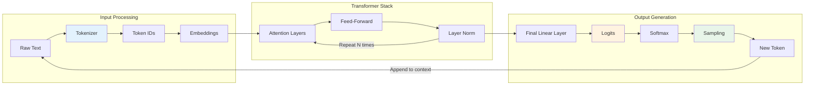
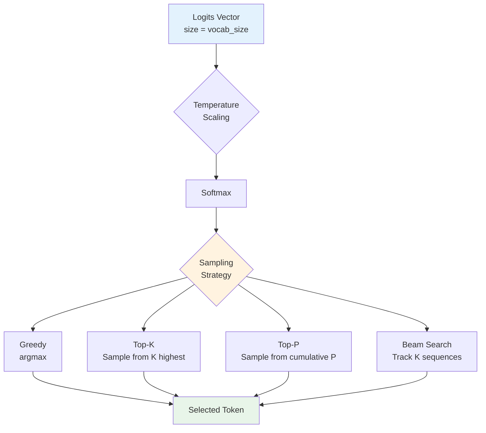
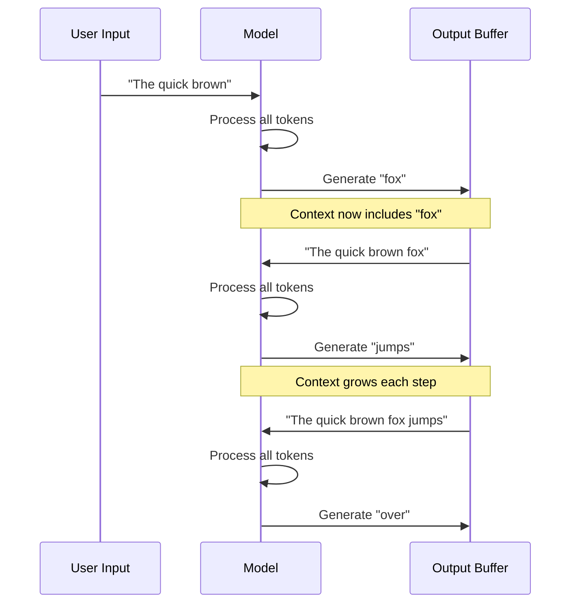

# How LLMs Work

Understanding the inference pipeline is fundamental to working with Large Language Models. This module breaks down the journey from raw text input to generated output, focusing on the mechanisms that make LLMs tick.

## Learning Objectives

- **Trace the complete inference pipeline** from text input through tokenization, embedding, transformer layers, to output generation
- **Explain logits and their transformation** into probability distributions via softmax
- **Compare sampling strategies** (greedy, top-k, top-p, temperature) and their impact on generation quality
- **Implement basic sampling algorithms** from scratch to demonstrate understanding
- **Debug common generation issues** like repetition, incoherence, and hallucination

## The Inference Pipeline

Think of LLM inference like a factory assembly line: raw text enters, gets processed through multiple stages, and a new token exits. This process repeats until the model generates a complete response.



### Stage 1: Tokenization

The model can't read text directly - it needs numbers. Tokenization converts text into a sequence of integer IDs from a fixed vocabulary.

```python
# Example using tiktoken (OpenAI's tokenizer)
import tiktoken

encoder = tiktoken.get_encoding("cl100k_base")  # GPT-4 encoding

text = "Hello, how are you today?"
tokens = encoder.encode(text)
print(f"Text: {text}")
print(f"Tokens: {tokens}")  # [9906, 11, 1268, 527, 499, 3432, 30]
print(f"Token count: {len(tokens)}")  # 7

# Decode back
for token_id in tokens:
    print(f"{token_id} -> '{encoder.decode([token_id])}'")
```

### Stage 2: Embedding Lookup

Each token ID maps to a dense vector in embedding space. This is a simple table lookup.

```python
import torch
import torch.nn as nn

class EmbeddingLayer(nn.Module):
    def __init__(self, vocab_size: int, embed_dim: int):
        super().__init__()
        self.token_embed = nn.Embedding(vocab_size, embed_dim)
        self.pos_embed = nn.Embedding(8192, embed_dim)  # Positional

    def forward(self, token_ids: torch.Tensor) -> torch.Tensor:
        seq_len = token_ids.shape[1]
        positions = torch.arange(seq_len, device=token_ids.device)

        token_embeddings = self.token_embed(token_ids)
        position_embeddings = self.pos_embed(positions)

        return token_embeddings + position_embeddings

# Usage
embed = EmbeddingLayer(vocab_size=50000, embed_dim=768)
token_ids = torch.tensor([[1, 42, 100, 7]])
embeddings = embed(token_ids)  # Shape: [1, 4, 768]
```

::: info Complexity Analysis
**Embedding lookup**: O(sequence_length) - just array indexing
**Memory**: vocab_size * embed_dim * bytes_per_param
For GPT-4 style: 100K * 12288 * 2 = ~2.4GB just for embeddings
:::

### Stage 3: Transformer Forward Pass

The embedded tokens flow through N transformer layers. Each layer applies self-attention followed by a feed-forward network.

```python
import torch.nn.functional as F

class TransformerBlock(nn.Module):
    def __init__(self, embed_dim: int, num_heads: int, ff_dim: int):
        super().__init__()
        self.attention = nn.MultiheadAttention(embed_dim, num_heads, batch_first=True)
        self.ff = nn.Sequential(
            nn.Linear(embed_dim, ff_dim),
            nn.GELU(),
            nn.Linear(ff_dim, embed_dim)
        )
        self.ln1 = nn.LayerNorm(embed_dim)
        self.ln2 = nn.LayerNorm(embed_dim)

    def forward(self, x: torch.Tensor, mask: torch.Tensor = None) -> torch.Tensor:
        # Self-attention with residual
        attn_out, _ = self.attention(x, x, x, attn_mask=mask)
        x = self.ln1(x + attn_out)

        # Feed-forward with residual
        ff_out = self.ff(x)
        x = self.ln2(x + ff_out)

        return x
```

### Stage 4: Logits to Probabilities

The final layer projects the hidden state to vocabulary size, producing **logits** - unnormalized scores for each possible next token.

```python
class LMHead(nn.Module):
    def __init__(self, embed_dim: int, vocab_size: int):
        super().__init__()
        self.linear = nn.Linear(embed_dim, vocab_size)

    def forward(self, hidden_states: torch.Tensor) -> torch.Tensor:
        # Take the last position's hidden state
        last_hidden = hidden_states[:, -1, :]  # [batch, embed_dim]
        logits = self.linear(last_hidden)  # [batch, vocab_size]
        return logits

# Convert logits to probabilities
def logits_to_probs(logits: torch.Tensor, temperature: float = 1.0) -> torch.Tensor:
    """Apply temperature scaling and softmax."""
    scaled_logits = logits / temperature
    probs = F.softmax(scaled_logits, dim=-1)
    return probs
```

## From Logits to Tokens: Sampling Strategies

The model outputs a probability distribution over the entire vocabulary. How we select the next token from this distribution dramatically affects output quality.



### Temperature

Temperature controls the "sharpness" of the probability distribution. Think of it as a confidence dial.

```python
def apply_temperature(logits: torch.Tensor, temperature: float) -> torch.Tensor:
    """
    Temperature scaling:
    - T < 1.0: Sharper distribution (more confident, less diverse)
    - T = 1.0: Original distribution
    - T > 1.0: Flatter distribution (less confident, more diverse)
    - T -> 0: Becomes greedy (argmax)
    - T -> inf: Becomes uniform random
    """
    if temperature == 0:
        # Return one-hot at argmax
        return torch.zeros_like(logits).scatter_(-1, logits.argmax(-1, keepdim=True), 1.0)

    return logits / temperature

# Demonstration
logits = torch.tensor([2.0, 1.0, 0.5, 0.1])

for temp in [0.5, 1.0, 2.0]:
    probs = F.softmax(logits / temp, dim=-1)
    print(f"T={temp}: {probs.numpy().round(3)}")

# Output:
# T=0.5: [0.828, 0.112, 0.041, 0.019]  <- Very peaked
# T=1.0: [0.575, 0.211, 0.128, 0.086]  <- Original
# T=2.0: [0.406, 0.246, 0.192, 0.157]  <- Flatter
```

### Greedy Decoding

Always select the highest probability token. Fast but can lead to repetitive, boring text.

```python
def greedy_decode(logits: torch.Tensor) -> int:
    """Select the token with highest probability."""
    return logits.argmax(dim=-1).item()

# Problem: Greedy can get stuck
# "The cat sat on the mat. The cat sat on the mat. The cat..."
```

::: warning Interview Insight
**Q: Why does greedy decoding cause repetition?**

A: Once a pattern starts, the model assigns high probability to continuing it. Without randomness, it has no mechanism to break out. The self-attention sees recent tokens and "locks in" to the pattern.
:::

### Top-K Sampling

Sample only from the K most probable tokens. This prevents sampling extremely unlikely tokens while maintaining diversity.

```python
def top_k_sampling(logits: torch.Tensor, k: int, temperature: float = 1.0) -> int:
    """
    Sample from the top-k most likely tokens.

    Args:
        logits: Raw logits from the model [vocab_size]
        k: Number of tokens to consider
        temperature: Sampling temperature

    Returns:
        Selected token ID
    """
    # Apply temperature
    scaled_logits = logits / temperature

    # Get top-k values and indices
    top_k_logits, top_k_indices = torch.topk(scaled_logits, k)

    # Convert to probabilities
    probs = F.softmax(top_k_logits, dim=-1)

    # Sample from the distribution
    selected_idx = torch.multinomial(probs, num_samples=1).item()

    return top_k_indices[selected_idx].item()

# Example
logits = torch.randn(50000)  # Vocabulary of 50K
token_id = top_k_sampling(logits, k=50, temperature=0.8)
```

### Top-P (Nucleus) Sampling

Sample from the smallest set of tokens whose cumulative probability exceeds P. This adapts the number of candidates based on the distribution shape.

```python
def top_p_sampling(logits: torch.Tensor, p: float, temperature: float = 1.0) -> int:
    """
    Nucleus sampling: sample from tokens comprising top-p probability mass.

    This is adaptive - sharp distributions select fewer tokens,
    flat distributions select more.

    Args:
        logits: Raw logits [vocab_size]
        p: Cumulative probability threshold (e.g., 0.9)
        temperature: Sampling temperature

    Returns:
        Selected token ID
    """
    # Apply temperature
    scaled_logits = logits / temperature
    probs = F.softmax(scaled_logits, dim=-1)

    # Sort by probability (descending)
    sorted_probs, sorted_indices = torch.sort(probs, descending=True)

    # Compute cumulative probabilities
    cumsum_probs = torch.cumsum(sorted_probs, dim=-1)

    # Find cutoff index where cumsum exceeds p
    # Include one more token to ensure we exceed p
    cutoff_mask = cumsum_probs <= p
    cutoff_mask[1:] = cutoff_mask[:-1].clone()  # Shift to include the crossing token
    cutoff_mask[0] = True  # Always include at least one

    # Zero out tokens beyond cutoff
    sorted_probs[~cutoff_mask] = 0
    sorted_probs = sorted_probs / sorted_probs.sum()  # Renormalize

    # Sample
    selected_idx = torch.multinomial(sorted_probs, num_samples=1).item()

    return sorted_indices[selected_idx].item()
```

### Combining Strategies

In practice, most implementations combine multiple strategies:

```python
def advanced_sampling(
    logits: torch.Tensor,
    temperature: float = 1.0,
    top_k: int = 0,
    top_p: float = 1.0,
    repetition_penalty: float = 1.0,
    past_tokens: list = None
) -> int:
    """
    Production-ready sampling combining multiple strategies.

    Order of operations:
    1. Apply repetition penalty
    2. Apply temperature
    3. Apply top-k filtering
    4. Apply top-p filtering
    5. Sample from remaining distribution
    """
    # 1. Repetition penalty - reduce probability of recently used tokens
    if past_tokens and repetition_penalty != 1.0:
        for token_id in set(past_tokens):
            if logits[token_id] > 0:
                logits[token_id] /= repetition_penalty
            else:
                logits[token_id] *= repetition_penalty

    # 2. Temperature scaling
    if temperature != 1.0:
        logits = logits / temperature

    # 3. Top-K filtering
    if top_k > 0:
        top_k_values, _ = torch.topk(logits, top_k)
        min_top_k = top_k_values[-1]
        logits[logits < min_top_k] = float('-inf')

    # 4. Convert to probabilities and apply top-p
    probs = F.softmax(logits, dim=-1)

    if top_p < 1.0:
        sorted_probs, sorted_indices = torch.sort(probs, descending=True)
        cumsum = torch.cumsum(sorted_probs, dim=-1)

        # Remove tokens beyond the nucleus
        remove_mask = cumsum > top_p
        remove_mask[1:] = remove_mask[:-1].clone()
        remove_mask[0] = False

        # Scatter back to original indices
        indices_to_remove = sorted_indices[remove_mask]
        probs[indices_to_remove] = 0
        probs = probs / probs.sum()  # Renormalize

    # 5. Sample
    return torch.multinomial(probs, num_samples=1).item()
```

## Complete Generation Loop

Putting it all together into a working text generator:

```python
class SimpleGenerator:
    def __init__(self, model, tokenizer, device='cuda'):
        self.model = model.to(device).eval()
        self.tokenizer = tokenizer
        self.device = device

    @torch.no_grad()
    def generate(
        self,
        prompt: str,
        max_new_tokens: int = 100,
        temperature: float = 0.7,
        top_p: float = 0.9,
        stop_tokens: list = None
    ) -> str:
        """Generate text continuation for a prompt."""

        # Encode prompt
        input_ids = self.tokenizer.encode(prompt)
        input_tensor = torch.tensor([input_ids], device=self.device)

        generated_tokens = []

        for _ in range(max_new_tokens):
            # Forward pass
            logits = self.model(input_tensor)[:, -1, :]  # Last position

            # Sample next token
            next_token = top_p_sampling(
                logits[0],
                p=top_p,
                temperature=temperature
            )

            # Check for stop condition
            if stop_tokens and next_token in stop_tokens:
                break

            # Append to sequence
            generated_tokens.append(next_token)
            input_tensor = torch.cat([
                input_tensor,
                torch.tensor([[next_token]], device=self.device)
            ], dim=1)

        # Decode and return
        return self.tokenizer.decode(generated_tokens)
```

## Autoregressive Nature

LLMs generate text **one token at a time**, always conditioning on all previous tokens. This is the "autoregressive" property.



::: info Complexity Analysis
**Time complexity per token**: O(seq_len^2 * d_model) for attention
**This is why KV-caching matters** - without it, generating N tokens costs O(N^3)!
With KV-cache: O(N^2) total, O(N) per new token
:::

## Interview Q&A

### Q1: Why would you use top-p over top-k sampling?

**Strong Answer:**

Top-p (nucleus) sampling is **adaptive** to the distribution shape, while top-k uses a fixed number regardless of confidence.

Consider two scenarios:
1. **High confidence**: Model assigns 95% probability to one token. Top-k=50 would still sample from 50 tokens, potentially picking something nonsensical. Top-p=0.9 would only consider that one token.

2. **Low confidence**: Probability spread across many tokens. Top-k=50 might cut off viable options. Top-p=0.9 expands to include all reasonable candidates.

In practice, top-p better maintains coherence when the model is confident while preserving diversity when uncertain. Most production systems use top-p in the range of 0.9-0.95.

---

### Q2: Explain what happens when temperature approaches 0 vs infinity.

**Strong Answer:**

Temperature controls the entropy of the output distribution by scaling logits before softmax:

**Temperature -> 0:**
- Softmax becomes more peaked
- Eventually converges to one-hot at the argmax
- Equivalent to greedy decoding
- Output is deterministic and reproducible
- Risk: repetitive, "safe" outputs

**Temperature -> infinity:**
- Softmax becomes uniform
- All tokens equally likely regardless of logits
- Completely random sampling
- Risk: incoherent, nonsensical output

**The math:** For softmax with temperature: `p_i = exp(z_i/T) / sum(exp(z_j/T))`
- As T->0: largest logit dominates exponentially
- As T->inf: all exp(z/T) -> 1, so p -> 1/vocab_size

**Practical ranges:** 0.7-1.0 for most applications, lower (0.2-0.5) for factual tasks, higher (1.0-1.3) for creative tasks.

---

### Q3: How would you debug an LLM that keeps generating repetitive text?

**Strong Answer:**

Repetition in LLMs typically stems from a few causes. Here's my debugging approach:

1. **Check sampling parameters:**
   - Is temperature too low? Increase to 0.7-0.9
   - Is top-k too restrictive? Try top-p instead
   - Add repetition penalty (1.1-1.3)

2. **Analyze the attention patterns:**
   - Strong attention to recent tokens can cause loops
   - Visualize attention weights to identify if the model is "stuck"

3. **Check for training data artifacts:**
   - Repetitive training data leads to repetitive generation
   - Common with web-scraped data containing boilerplate

4. **Implement n-gram blocking:**
```python
def block_repeated_ngrams(logits, generated, n=3):
    """Prevent generating n-grams that already exist."""
    if len(generated) >= n - 1:
        recent = tuple(generated[-(n-1):])
        for token_id in range(len(logits)):
            potential_ngram = recent + (token_id,)
            if potential_ngram in seen_ngrams:
                logits[token_id] = float('-inf')
    return logits
```

5. **Use presence/frequency penalties:**
   - Presence penalty: flat reduction for any repeated token
   - Frequency penalty: reduction proportional to occurrence count

## Summary Table

| Concept | Description | When to Use |
|---------|-------------|-------------|
| **Greedy** | Always pick highest probability | Deterministic tasks, debugging |
| **Top-K** | Sample from K most likely | General use, K=40-100 |
| **Top-P** | Sample from nucleus | Adaptive diversity, p=0.9-0.95 |
| **Temperature** | Scale logit sharpness | T<1 for facts, T>1 for creativity |
| **Repetition Penalty** | Reduce repeated token probability | Combat loops, 1.1-1.3 |
| **Beam Search** | Track multiple hypotheses | Translation, structured output |

## Sources

- Holtzman et al. "The Curious Case of Neural Text Degeneration" (2020) - Introduced nucleus sampling
- Radford et al. "Language Models are Unsupervised Multitask Learners" (GPT-2, 2019)
- Vaswani et al. "Attention Is All You Need" (2017)
- Keskar et al. "CTRL: A Conditional Transformer Language Model for Controllable Generation" (2019)
- OpenAI API Documentation - Temperature and sampling parameters
