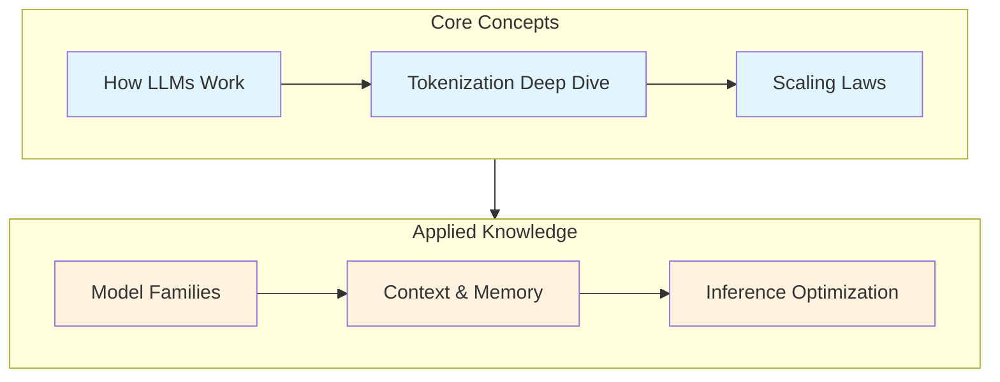
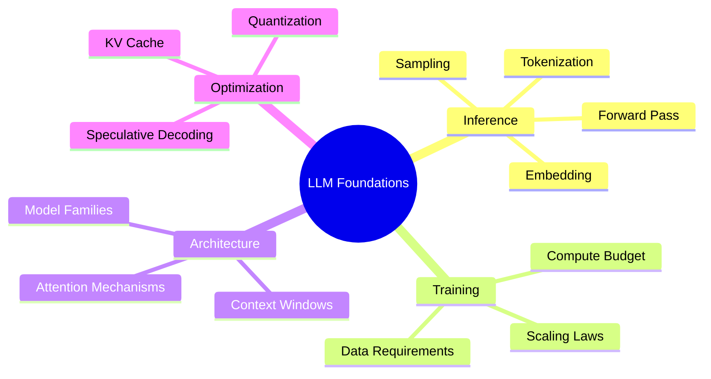

# LLM Foundations

Master the core concepts that power modern Large Language Models. This module provides the technical foundation needed to understand, evaluate, and optimize LLMs in production systems.

## Learning Objectives

By completing this module, you will be able to:

- **Explain the complete inference pipeline** from text input to token generation, including the role of tokenization, embeddings, and sampling strategies
- **Analyze scaling laws** and predict model performance based on compute budget, parameter count, and training data
- **Compare model architectures** across major families (GPT, Claude, Llama, Gemini) and articulate their trade-offs
- **Optimize inference performance** using techniques like KV-caching, quantization, and speculative decoding
- **Design context-aware systems** that maximize information utilization within context windows

## Module Overview

## Modules

| Module | Description | Key Topics | Est. Time |
|--------|-------------|------------|-----------|
| [How LLMs Work](./how-llms-work.md) | The inference pipeline from input to output | Logits, softmax, sampling strategies | 45 min |
| [Tokenization Deep Dive](./tokenization-deep-dive.md) | How text becomes numbers | BPE, SentencePiece, vocabulary design | 40 min |
| [Scaling Laws](./scaling-laws.md) | The science of model sizing | Chinchilla, compute-optimal training | 35 min |
| [Model Families](./model-families.md) | Comparing major LLM architectures | GPT, Claude, Llama, Mistral, Gemini | 50 min |
| [Context & Memory](./context-and-memory.md) | Working with long contexts | Lost-in-the-middle, needle-in-haystack | 40 min |
| [Inference Optimization](./inference-optimization.md) | Making LLMs fast and efficient | KV-cache, quantization, speculative decoding | 55 min |

## Prerequisites

Before diving into this module, ensure you understand:

- **Transformer Architecture** - Self-attention, positional encodings, layer normalization
- **Neural Network Fundamentals** - Backpropagation, gradient descent, loss functions
- **Linear Algebra** - Matrix operations, softmax, probability distributions
- **Python** - Comfortable with NumPy, PyTorch basics

## Interview Focus Areas

::: info Interview Tip
LLM foundations questions typically fall into three categories:

1. **Conceptual Understanding** - "Explain how temperature affects generation"
2. **System Design** - "Design an inference pipeline for 10K QPS"
3. **Trade-off Analysis** - "When would you choose smaller models?"

This module covers all three with practical examples and code.
:::

## Quick Reference

### Key Metrics to Know

| Metric | Formula | Typical Values |
|--------|---------|----------------|
| Perplexity | $e^{-\frac{1}{N}\sum \log p(x_i)}$ | 10-30 for good models |
| FLOPS/token | $6 \times N$ (forward) | ~600B for 100B model |
| Memory (fp16) | $2 \times N$ bytes | ~200GB for 100B model |
| Context length | Architecture dependent | 4K-200K tokens |

### Common Interview Questions Preview

1. **Why do LLMs sometimes repeat themselves?** (See: [Sampling Strategies](./how-llms-work.md#sampling-strategies))
2. **How does BPE handle unknown words?** (See: [Tokenization](./tokenization-deep-dive.md#bpe-algorithm))
3. **Why is the KV-cache necessary?** (See: [Inference Optimization](./inference-optimization.md#kv-cache))

## Visualization Resources

This module includes interactive visualizations:

- BPE merge process animation
- Sampling strategy comparison charts
- Scaling law 3D surfaces
- KV-cache memory growth plots
- Model family evolution tree
- Context utilization heatmaps

---

## Summary

| Topic | Core Insight | Interview Relevance |
|-------|--------------|---------------------|
| Inference Pipeline | LLMs are autoregressive - they generate one token at a time | High - fundamental understanding |
| Tokenization | Subword tokenization balances vocabulary size and coverage | Medium - affects multilingual performance |
| Scaling Laws | More compute requires balanced parameter/data scaling | High - system design decisions |
| Model Families | Different architectures optimize for different trade-offs | Medium - model selection rationale |
| Context Windows | Information position affects retrieval quality | High - RAG system design |
| Optimization | Multiple techniques combine for production efficiency | Very High - deployed systems |

## Sources

- Vaswani et al. "Attention Is All You Need" (2017)
- Hoffmann et al. "Training Compute-Optimal Large Language Models" (Chinchilla paper, 2022)
- Touvron et al. "LLaMA: Open and Efficient Foundation Language Models" (2023)
- Liu et al. "Lost in the Middle" (2023)
- Kwon et al. "Efficient Memory Management for Large Language Model Serving with PagedAttention" (2023)
