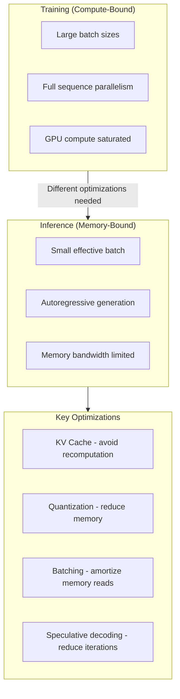
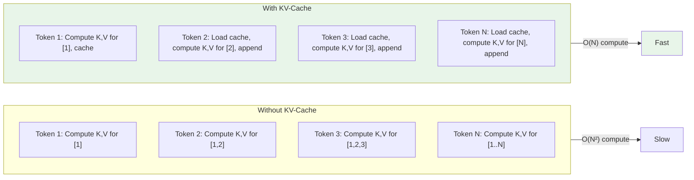
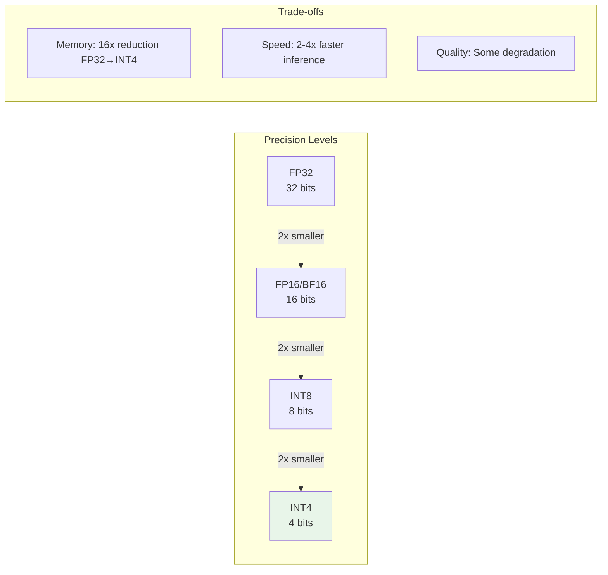
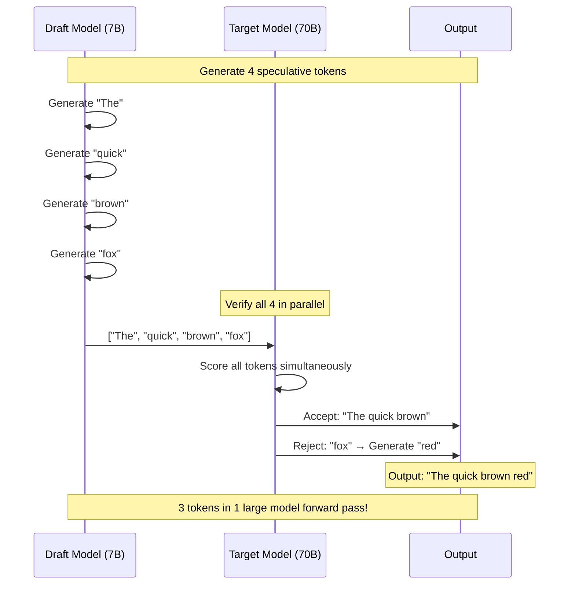
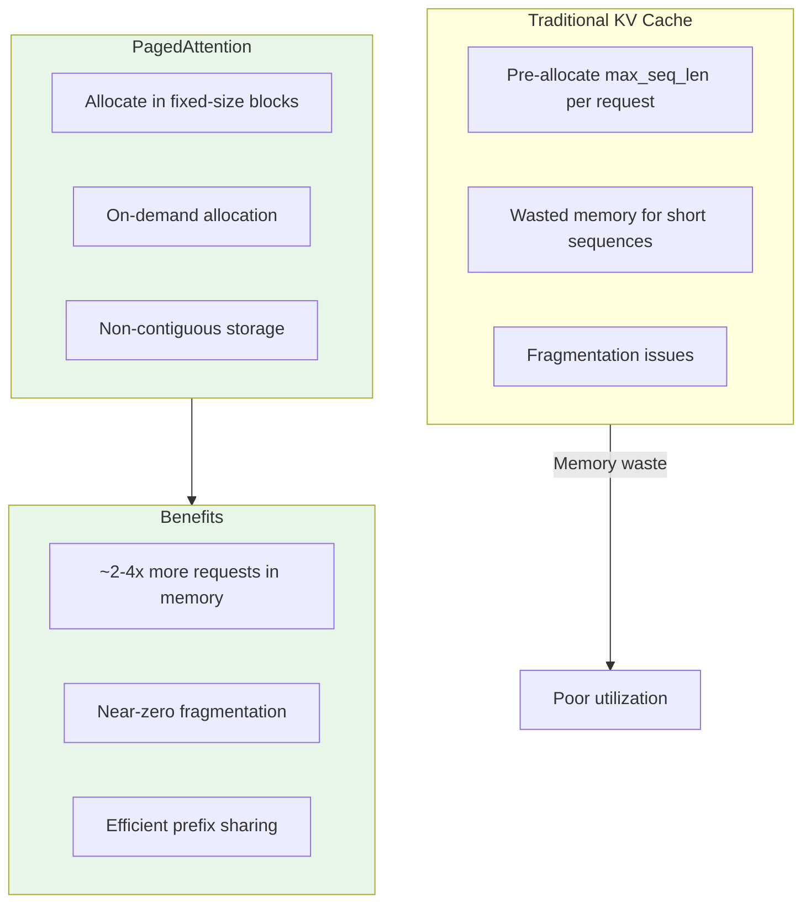

# Inference Optimization

Optimizing LLM inference is critical for production deployment. This module covers the key techniques that make serving LLMs at scale feasible: KV-caching, quantization, speculative decoding, and memory management.

## Learning Objectives

- **Implement KV-caching** and understand its memory-compute trade-off
- **Apply quantization techniques** (INT8, INT4, GPTQ, AWQ) with awareness of quality trade-offs
- **Explain speculative decoding** and when it provides speedups
- **Optimize memory usage** with PagedAttention and continuous batching
- **Design inference pipelines** that balance latency, throughput, and cost

## The Inference Bottleneck

LLM inference is fundamentally different from training: it's **memory-bound, not compute-bound**.



### Memory Bandwidth Analysis

```python
from dataclasses import dataclass
from typing import Tuple

@dataclass
class ModelConfig:
    """Configuration for memory analysis."""
    params_billions: float
    hidden_size: int
    num_layers: int
    num_heads: int
    head_dim: int
    vocab_size: int
    precision_bytes: int = 2  # fp16

def analyze_memory_bandwidth(config: ModelConfig) -> dict:
    """
    Analyze why inference is memory-bound.

    Key insight: For a single token generation, we must read
    ALL model weights from memory, but only do a small amount
    of compute (one forward pass for one token).
    """
    # Model weights in bytes
    param_bytes = config.params_billions * 1e9 * config.precision_bytes

    # A100 memory bandwidth: 2 TB/s
    memory_bandwidth = 2e12  # bytes/sec

    # Time to read all weights
    weight_read_time = param_bytes / memory_bandwidth

    # Compute for one token (rough: 2 FLOPs per parameter)
    flops_per_token = 2 * config.params_billions * 1e9

    # A100 compute: 312 TFLOPS for fp16
    compute_capacity = 312e12

    # Time for compute
    compute_time = flops_per_token / compute_capacity

    # Arithmetic intensity: FLOPs per byte
    arithmetic_intensity = flops_per_token / param_bytes

    return {
        "model_size_gb": param_bytes / 1e9,
        "weight_read_time_ms": weight_read_time * 1000,
        "compute_time_ms": compute_time * 1000,
        "bottleneck": "memory" if weight_read_time > compute_time else "compute",
        "arithmetic_intensity": arithmetic_intensity,
        "memory_bound_ratio": weight_read_time / compute_time,
    }


# Analysis for LLaMA 70B
llama_70b = ModelConfig(
    params_billions=70,
    hidden_size=8192,
    num_layers=80,
    num_heads=64,
    head_dim=128,
    vocab_size=32000,
)

results = analyze_memory_bandwidth(llama_70b)
print(f"LLaMA 70B Analysis:")
print(f"  Model size: {results['model_size_gb']:.0f} GB")
print(f"  Weight read time: {results['weight_read_time_ms']:.1f} ms")
print(f"  Compute time: {results['compute_time_ms']:.2f} ms")
print(f"  Bottleneck: {results['bottleneck']}")
print(f"  Memory-bound ratio: {results['memory_bound_ratio']:.0f}x")

# You'll see: weight read takes ~100x longer than compute!
```

::: info Complexity Analysis
**Key insight: Arithmetic Intensity**
- Training: High batch size means many FLOPs per weight read
- Inference: Low effective batch means few FLOPs per weight read

For efficient GPU utilization, you need ~100-1000 FLOPs/byte.
Single-token inference: ~2 FLOPs/byte (memory-bound!)
Solution: Batch more tokens together
:::

## KV-Cache

The KV-cache is the most important optimization for autoregressive inference. Without it, generating N tokens would require O(N^2) compute.

### Why KV-Cache Matters



### Implementation

```python
import torch
import torch.nn as nn
from typing import Optional, Tuple

class KVCache:
    """
    Key-Value cache for efficient autoregressive generation.

    Stores computed K and V tensors from previous positions,
    avoiding redundant computation.
    """

    def __init__(
        self,
        batch_size: int,
        max_seq_len: int,
        num_layers: int,
        num_heads: int,
        head_dim: int,
        device: torch.device,
        dtype: torch.dtype = torch.float16,
    ):
        self.max_seq_len = max_seq_len
        self.current_len = 0

        # Pre-allocate cache tensors
        # Shape: [num_layers, 2, batch, num_heads, max_seq_len, head_dim]
        # The 2 is for K and V
        self.cache = torch.zeros(
            num_layers, 2, batch_size, num_heads, max_seq_len, head_dim,
            device=device, dtype=dtype
        )

    def update(
        self,
        layer_idx: int,
        new_k: torch.Tensor,  # [batch, num_heads, seq_len, head_dim]
        new_v: torch.Tensor,
    ) -> Tuple[torch.Tensor, torch.Tensor]:
        """
        Add new K,V to cache and return full K,V for attention.
        """
        seq_len = new_k.shape[2]
        start = self.current_len
        end = start + seq_len

        # Store new K,V
        self.cache[layer_idx, 0, :, :, start:end, :] = new_k
        self.cache[layer_idx, 1, :, :, start:end, :] = new_v

        # Return full K,V up to current position
        full_k = self.cache[layer_idx, 0, :, :, :end, :]
        full_v = self.cache[layer_idx, 1, :, :, :end, :]

        return full_k, full_v

    def advance(self, num_tokens: int = 1):
        """Advance the sequence position after processing tokens."""
        self.current_len += num_tokens

    def get_memory_usage(self) -> int:
        """Return memory usage in bytes."""
        return self.cache.element_size() * self.cache.nelement()


class CachedAttention(nn.Module):
    """
    Multi-head attention with KV-caching support.
    """

    def __init__(self, hidden_size: int, num_heads: int):
        super().__init__()
        self.num_heads = num_heads
        self.head_dim = hidden_size // num_heads

        self.q_proj = nn.Linear(hidden_size, hidden_size)
        self.k_proj = nn.Linear(hidden_size, hidden_size)
        self.v_proj = nn.Linear(hidden_size, hidden_size)
        self.o_proj = nn.Linear(hidden_size, hidden_size)

    def forward(
        self,
        x: torch.Tensor,
        kv_cache: Optional[KVCache] = None,
        layer_idx: int = 0,
    ) -> torch.Tensor:
        batch_size, seq_len, _ = x.shape

        # Project Q, K, V
        q = self.q_proj(x).view(batch_size, seq_len, self.num_heads, self.head_dim)
        k = self.k_proj(x).view(batch_size, seq_len, self.num_heads, self.head_dim)
        v = self.v_proj(x).view(batch_size, seq_len, self.num_heads, self.head_dim)

        # Transpose for attention: [batch, heads, seq, dim]
        q = q.transpose(1, 2)
        k = k.transpose(1, 2)
        v = v.transpose(1, 2)

        # Use KV cache if available
        if kv_cache is not None:
            k, v = kv_cache.update(layer_idx, k, v)

        # Scaled dot-product attention
        scale = self.head_dim ** -0.5
        attn_weights = torch.matmul(q, k.transpose(-2, -1)) * scale

        # Causal mask (only needed for prompt processing, not generation)
        if seq_len > 1:
            mask = torch.triu(torch.ones(seq_len, k.shape[2]), diagonal=1).bool()
            attn_weights.masked_fill_(mask.to(x.device), float('-inf'))

        attn_weights = torch.softmax(attn_weights, dim=-1)
        attn_output = torch.matmul(attn_weights, v)

        # Reshape and project
        attn_output = attn_output.transpose(1, 2).contiguous()
        attn_output = attn_output.view(batch_size, seq_len, -1)

        return self.o_proj(attn_output)


def calculate_kv_cache_size(
    batch_size: int,
    seq_len: int,
    num_layers: int,
    num_heads: int,
    head_dim: int,
    precision: str = "fp16"
) -> dict:
    """
    Calculate KV cache memory requirements.

    This is often the memory bottleneck for long contexts!
    """
    bytes_per_element = {"fp32": 4, "fp16": 2, "bf16": 2, "int8": 1}[precision]

    # K and V each: [batch, num_heads, seq_len, head_dim]
    kv_elements = 2 * batch_size * num_layers * num_heads * seq_len * head_dim
    kv_bytes = kv_elements * bytes_per_element

    return {
        "total_bytes": kv_bytes,
        "total_gb": kv_bytes / 1e9,
        "per_layer_mb": (kv_bytes / num_layers) / 1e6,
        "per_token_kb": (kv_bytes / seq_len) / 1e3,
    }


# Example: LLaMA 70B at 32K context
kv_size = calculate_kv_cache_size(
    batch_size=1,
    seq_len=32768,
    num_layers=80,
    num_heads=64,
    head_dim=128,
    precision="fp16"
)
print(f"KV Cache size: {kv_size['total_gb']:.1f} GB")
print(f"Per token: {kv_size['per_token_kb']:.0f} KB")
# This is often larger than you'd expect!
```

## Quantization

Quantization reduces model precision from FP16/FP32 to INT8/INT4, dramatically reducing memory and improving throughput.



### Basic Quantization

```python
import torch
from typing import Tuple

def quantize_symmetric_int8(
    tensor: torch.Tensor
) -> Tuple[torch.Tensor, torch.Tensor]:
    """
    Symmetric INT8 quantization.

    Maps floating point values to [-127, 127] using a single scale.
    """
    # Find the maximum absolute value
    max_abs = tensor.abs().max()

    # Compute scale
    scale = max_abs / 127.0

    # Quantize
    quantized = torch.round(tensor / scale).clamp(-127, 127).to(torch.int8)

    return quantized, scale


def dequantize_symmetric_int8(
    quantized: torch.Tensor,
    scale: torch.Tensor
) -> torch.Tensor:
    """Dequantize INT8 back to floating point."""
    return quantized.float() * scale


def quantize_asymmetric_int8(
    tensor: torch.Tensor
) -> Tuple[torch.Tensor, torch.Tensor, torch.Tensor]:
    """
    Asymmetric INT8 quantization.

    Maps [min, max] to [0, 255], better for ReLU activations.
    """
    min_val = tensor.min()
    max_val = tensor.max()

    scale = (max_val - min_val) / 255.0
    zero_point = torch.round(-min_val / scale).clamp(0, 255)

    quantized = torch.round((tensor / scale) + zero_point).clamp(0, 255).to(torch.uint8)

    return quantized, scale, zero_point


# Demonstration
original = torch.randn(1000)
quant, scale = quantize_symmetric_int8(original)
dequant = dequantize_symmetric_int8(quant, scale)

error = (original - dequant).abs().mean()
print(f"Mean quantization error: {error:.6f}")
print(f"Memory reduction: {original.element_size() / quant.element_size():.0f}x")
```

### Advanced Quantization: GPTQ and AWQ

```python
class GPTQQuantizer:
    """
    GPTQ: Accurate Post-Training Quantization for Generative Pre-trained Transformers

    Key idea: Quantize weights while minimizing output reconstruction error
    using second-order information (Hessian).

    Process:
    1. Collect calibration data (small subset of training data)
    2. For each layer, compute optimal quantization that minimizes
       ||WX - Q(W)X||² where Q is the quantization function
    3. Use Hessian to guide which weights to quantize first
    """

    def __init__(self, bits: int = 4, group_size: int = 128):
        self.bits = bits
        self.group_size = group_size

    def quantize_layer(
        self,
        weight: torch.Tensor,
        activations: torch.Tensor
    ) -> Tuple[torch.Tensor, torch.Tensor]:
        """
        Quantize a weight matrix using GPTQ algorithm.

        Args:
            weight: [out_features, in_features]
            activations: [batch * seq_len, in_features] calibration data
        """
        # Compute Hessian approximation: H = 2 * X^T X
        H = 2 * activations.T @ activations

        # GPTQ quantizes columns in order of descending Hessian diagonal
        # (quantize "easy" weights first, compensate "hard" weights)

        # Simplified: just demonstrate the concept
        scale = weight.abs().max() / (2 ** (self.bits - 1) - 1)
        quantized = torch.round(weight / scale).clamp(
            -(2 ** (self.bits - 1)),
            2 ** (self.bits - 1) - 1
        )

        return quantized, scale


class AWQQuantizer:
    """
    AWQ: Activation-aware Weight Quantization

    Key insight: Not all weights are equally important!
    Weights that interact with high-magnitude activations
    should be protected (scaled up before quantization).

    Process:
    1. Analyze activation statistics from calibration data
    2. Identify "salient" weight channels
    3. Scale up salient weights, scale down activations
    4. Quantize the scaled weights (salient ones preserved better)
    5. At inference, reverse the scaling in activations
    """

    def __init__(self, bits: int = 4, group_size: int = 128):
        self.bits = bits
        self.group_size = group_size

    def compute_scales(
        self,
        weight: torch.Tensor,
        activations: torch.Tensor
    ) -> torch.Tensor:
        """
        Compute per-channel scaling factors based on activation importance.
        """
        # Find activation magnitudes per input channel
        act_scales = activations.abs().mean(dim=0)

        # Normalize to get relative importance
        scales = act_scales / act_scales.mean()

        # Clip to reasonable range
        scales = scales.clamp(0.1, 10.0)

        return scales

    def quantize_with_scaling(
        self,
        weight: torch.Tensor,
        scales: torch.Tensor
    ) -> Tuple[torch.Tensor, torch.Tensor, torch.Tensor]:
        """
        Apply scaling then quantize.

        The key insight: scaling up important weights before quantization
        preserves their precision better.
        """
        # Scale weights (row scaling for output channels)
        scaled_weight = weight * scales.unsqueeze(0)

        # Now quantize
        qscale = scaled_weight.abs().max() / (2 ** (self.bits - 1) - 1)
        quantized = torch.round(scaled_weight / qscale)

        return quantized, qscale, scales
```

::: info Complexity Analysis
**Quantization Memory Savings:**
| Precision | Memory | vs FP16 | Typical Quality Loss |
|-----------|--------|---------|---------------------|
| FP16 | 2 bytes | 1x | Baseline |
| INT8 | 1 byte | 2x | ~0.1-0.5% |
| INT4 | 0.5 byte | 4x | ~0.5-2% |
| INT3 | 0.375 byte | 5.3x | ~2-5% |

For a 70B model: FP16 = 140GB, INT4 = 35GB (fits on 1 A100!)
:::

## Speculative Decoding

Speculative decoding uses a smaller "draft" model to propose multiple tokens, which the larger model verifies in parallel.



### Implementation

```python
import torch
from typing import List, Tuple
from dataclasses import dataclass

@dataclass
class SpeculativeConfig:
    """Configuration for speculative decoding."""
    num_speculative_tokens: int = 4
    temperature: float = 1.0

class SpeculativeDecoder:
    """
    Speculative decoding for faster inference.

    Uses a small draft model to propose tokens,
    then verifies with the large target model.

    Speedup: ~2-3x when draft acceptance rate is high.
    """

    def __init__(
        self,
        target_model,  # Large model (e.g., 70B)
        draft_model,   # Small model (e.g., 7B)
        config: SpeculativeConfig
    ):
        self.target = target_model
        self.draft = draft_model
        self.config = config

    def generate_draft_tokens(
        self,
        input_ids: torch.Tensor,
        num_tokens: int
    ) -> Tuple[torch.Tensor, torch.Tensor]:
        """
        Generate speculative tokens using draft model.

        Returns:
            draft_tokens: [num_tokens] token IDs
            draft_probs: [num_tokens, vocab_size] probability distributions
        """
        draft_tokens = []
        draft_probs = []

        current_ids = input_ids

        for _ in range(num_tokens):
            with torch.no_grad():
                logits = self.draft(current_ids)[:, -1, :]
                probs = torch.softmax(logits / self.config.temperature, dim=-1)

                # Sample next token
                next_token = torch.multinomial(probs, num_samples=1)

                draft_tokens.append(next_token.item())
                draft_probs.append(probs)

                # Append for next iteration
                current_ids = torch.cat([current_ids, next_token], dim=-1)

        return (
            torch.tensor(draft_tokens),
            torch.stack(draft_probs)
        )

    def verify_and_accept(
        self,
        input_ids: torch.Tensor,
        draft_tokens: torch.Tensor,
        draft_probs: torch.Tensor
    ) -> Tuple[torch.Tensor, int]:
        """
        Verify draft tokens with target model.

        Uses the speculative sampling algorithm to decide
        which tokens to accept/reject.

        Returns:
            accepted_tokens: tokens that passed verification
            num_accepted: count of accepted tokens
        """
        # Construct full sequence with draft tokens
        full_sequence = torch.cat([input_ids, draft_tokens.unsqueeze(0)], dim=-1)

        # Get target model probabilities for all positions at once
        with torch.no_grad():
            target_logits = self.target(full_sequence)

        # Extract logits for draft token positions
        start_pos = input_ids.shape[-1]
        target_probs = torch.softmax(
            target_logits[:, start_pos-1:-1, :] / self.config.temperature,
            dim=-1
        )

        # Speculative sampling acceptance
        accepted_tokens = []
        num_accepted = 0

        for i, (draft_token, draft_p, target_p) in enumerate(
            zip(draft_tokens, draft_probs, target_probs[0])
        ):
            # Acceptance probability: min(1, target_p / draft_p)
            draft_prob = draft_p[draft_token].item()
            target_prob = target_p[draft_token].item()

            accept_prob = min(1.0, target_prob / draft_prob)

            if torch.rand(1).item() < accept_prob:
                accepted_tokens.append(draft_token.item())
                num_accepted += 1
            else:
                # Rejection: sample from adjusted distribution
                # p_adjusted = max(0, target_p - draft_p)
                adjusted = torch.clamp(target_p - draft_p, min=0)
                adjusted = adjusted / adjusted.sum()
                new_token = torch.multinomial(adjusted, num_samples=1)
                accepted_tokens.append(new_token.item())
                break  # Stop at first rejection

        return torch.tensor(accepted_tokens), num_accepted

    def generate(
        self,
        input_ids: torch.Tensor,
        max_new_tokens: int
    ) -> torch.Tensor:
        """
        Generate tokens using speculative decoding.
        """
        generated = []
        current_ids = input_ids

        while len(generated) < max_new_tokens:
            # Draft phase
            draft_tokens, draft_probs = self.generate_draft_tokens(
                current_ids,
                self.config.num_speculative_tokens
            )

            # Verify phase
            accepted, num_accepted = self.verify_and_accept(
                current_ids, draft_tokens, draft_probs
            )

            # Update state
            generated.extend(accepted.tolist())
            current_ids = torch.cat([
                current_ids,
                accepted.unsqueeze(0)
            ], dim=-1)

            # Log acceptance rate
            acceptance_rate = num_accepted / len(draft_tokens)
            # print(f"Accepted {num_accepted}/{len(draft_tokens)} = {acceptance_rate:.0%}")

        return torch.tensor(generated[:max_new_tokens])
```

### When Speculative Decoding Helps

```python
def analyze_speedup(
    target_time_per_token: float,  # ms
    draft_time_per_token: float,   # ms
    num_speculative: int,
    acceptance_rate: float
) -> dict:
    """
    Analyze when speculative decoding provides speedup.

    For speedup, the cost of drafting + one target verification
    must be less than generating tokens individually.
    """
    # Cost of speculative approach (per "round")
    draft_cost = num_speculative * draft_time_per_token
    verify_cost = target_time_per_token  # Parallel verification
    speculative_round_cost = draft_cost + verify_cost

    # Expected tokens per round
    expected_tokens = acceptance_rate * num_speculative + 1  # +1 for correction

    # Cost per token
    speculative_cost_per_token = speculative_round_cost / expected_tokens
    baseline_cost_per_token = target_time_per_token

    speedup = baseline_cost_per_token / speculative_cost_per_token

    return {
        "speedup": speedup,
        "speculative_ms_per_token": speculative_cost_per_token,
        "baseline_ms_per_token": baseline_cost_per_token,
        "break_even_acceptance": draft_time_per_token / target_time_per_token,
    }


# Example: 70B target (50ms), 7B draft (5ms)
result = analyze_speedup(
    target_time_per_token=50,
    draft_time_per_token=5,
    num_speculative=4,
    acceptance_rate=0.7
)

print(f"Speedup: {result['speedup']:.2f}x")
print(f"Break-even acceptance rate: {result['break_even_acceptance']:.0%}")
```

## PagedAttention

PagedAttention (from vLLM) treats the KV cache like virtual memory, enabling efficient memory management for variable-length sequences.



### Conceptual Implementation

```python
from typing import Dict, List, Optional
import torch

class KVBlock:
    """
    A fixed-size block for KV cache.

    Instead of allocating max_seq_len, we allocate in small blocks
    and chain them together like memory pages.
    """

    def __init__(
        self,
        block_size: int,
        num_heads: int,
        head_dim: int,
        dtype: torch.dtype = torch.float16
    ):
        self.block_size = block_size
        self.filled = 0

        # K and V tensors for this block
        self.k = torch.zeros(
            num_heads, block_size, head_dim,
            dtype=dtype
        )
        self.v = torch.zeros(
            num_heads, block_size, head_dim,
            dtype=dtype
        )

    def append(
        self,
        k: torch.Tensor,
        v: torch.Tensor
    ) -> int:
        """Append K,V to this block. Returns number of tokens added."""
        space = self.block_size - self.filled
        num_tokens = min(space, k.shape[1])

        self.k[:, self.filled:self.filled + num_tokens, :] = k[:, :num_tokens, :]
        self.v[:, self.filled:self.filled + num_tokens, :] = v[:, :num_tokens, :]
        self.filled += num_tokens

        return num_tokens

    def is_full(self) -> bool:
        return self.filled >= self.block_size


class PagedKVCache:
    """
    Paged KV cache manager.

    Key ideas:
    1. Pre-allocate a pool of blocks
    2. Assign blocks to sequences on-demand
    3. Free blocks when sequence completes
    4. Share prefix blocks across sequences
    """

    def __init__(
        self,
        num_blocks: int,
        block_size: int,
        num_layers: int,
        num_heads: int,
        head_dim: int,
    ):
        self.block_size = block_size
        self.num_layers = num_layers

        # Block pool (pre-allocated)
        self.block_pool: List[List[KVBlock]] = [
            [
                KVBlock(block_size, num_heads, head_dim)
                for _ in range(num_blocks)
            ]
            for _ in range(num_layers)
        ]

        # Track which blocks are free
        self.free_blocks: List[List[int]] = [
            list(range(num_blocks)) for _ in range(num_layers)
        ]

        # Sequence to block mapping
        # {seq_id: {layer_idx: [block_indices]}}
        self.sequence_blocks: Dict[int, Dict[int, List[int]]] = {}

    def allocate_block(self, layer_idx: int) -> Optional[int]:
        """Get a free block from the pool."""
        if not self.free_blocks[layer_idx]:
            return None
        return self.free_blocks[layer_idx].pop()

    def free_sequence(self, seq_id: int):
        """Return all blocks from a completed sequence to the pool."""
        if seq_id not in self.sequence_blocks:
            return

        for layer_idx, block_indices in self.sequence_blocks[seq_id].items():
            self.free_blocks[layer_idx].extend(block_indices)

        del self.sequence_blocks[seq_id]

    def append_kv(
        self,
        seq_id: int,
        layer_idx: int,
        k: torch.Tensor,
        v: torch.Tensor
    ):
        """
        Append K,V to a sequence, allocating new blocks as needed.
        """
        if seq_id not in self.sequence_blocks:
            self.sequence_blocks[seq_id] = {i: [] for i in range(self.num_layers)}

        blocks = self.sequence_blocks[seq_id][layer_idx]
        remaining_k, remaining_v = k, v

        while remaining_k.shape[1] > 0:
            # Get or allocate block
            if not blocks or self.block_pool[layer_idx][blocks[-1]].is_full():
                new_block_idx = self.allocate_block(layer_idx)
                if new_block_idx is None:
                    raise RuntimeError("Out of KV cache blocks!")
                blocks.append(new_block_idx)

            # Append to current block
            block = self.block_pool[layer_idx][blocks[-1]]
            num_added = block.append(remaining_k, remaining_v)

            remaining_k = remaining_k[:, num_added:, :]
            remaining_v = remaining_v[:, num_added:, :]

    def get_utilization(self) -> float:
        """Calculate memory utilization across all sequences."""
        total_blocks = len(self.block_pool[0])
        used_blocks = total_blocks - len(self.free_blocks[0])
        return used_blocks / total_blocks
```

## Continuous Batching

Continuous batching (also from vLLM) allows new requests to join a batch as others complete, maximizing GPU utilization.

```python
from dataclasses import dataclass
from typing import List, Optional
from collections import deque
import time

@dataclass
class Request:
    """An inference request."""
    id: int
    input_ids: List[int]
    max_new_tokens: int
    generated_tokens: List[int] = None
    completed: bool = False

    def __post_init__(self):
        if self.generated_tokens is None:
            self.generated_tokens = []

class ContinuousBatcher:
    """
    Continuous batching for efficient LLM serving.

    Unlike static batching (wait for N requests, process together),
    continuous batching:
    1. Adds new requests as slots become available
    2. Removes completed requests immediately
    3. Maximizes GPU utilization
    """

    def __init__(
        self,
        model,
        max_batch_size: int = 32,
        max_waiting_time: float = 0.1  # seconds
    ):
        self.model = model
        self.max_batch_size = max_batch_size
        self.max_waiting_time = max_waiting_time

        self.waiting_queue: deque[Request] = deque()
        self.running_batch: List[Request] = []

    def add_request(self, request: Request):
        """Add a new request to the waiting queue."""
        self.waiting_queue.append(request)

    def _fill_batch(self):
        """Fill available batch slots from waiting queue."""
        while (
            len(self.running_batch) < self.max_batch_size
            and self.waiting_queue
        ):
            request = self.waiting_queue.popleft()
            self.running_batch.append(request)

    def _remove_completed(self):
        """Remove completed requests from the batch."""
        self.running_batch = [
            req for req in self.running_batch
            if not req.completed
        ]

    def step(self) -> List[Request]:
        """
        Run one generation step.

        Returns list of newly completed requests.
        """
        self._fill_batch()

        if not self.running_batch:
            return []

        # Prepare batch input (simplified)
        # In practice, need padding and attention masks
        batch_input = self._prepare_batch_input()

        # Run one forward pass for all sequences
        next_tokens = self._generate_step(batch_input)

        # Update each request
        completed = []
        for request, token in zip(self.running_batch, next_tokens):
            request.generated_tokens.append(token)

            # Check completion
            if (
                len(request.generated_tokens) >= request.max_new_tokens
                or token == self.model.eos_token_id
            ):
                request.completed = True
                completed.append(request)

        self._remove_completed()
        return completed

    def _prepare_batch_input(self):
        """Prepare batched input for the model."""
        # Simplified - real implementation handles variable lengths
        pass

    def _generate_step(self, batch_input):
        """Generate one token for each sequence in batch."""
        # Simplified
        pass

    def run_server(self):
        """Main serving loop."""
        while True:
            completed = self.step()
            for request in completed:
                # Return result to caller
                print(f"Completed request {request.id}: {request.generated_tokens}")

            # Brief sleep if nothing to do
            if not self.running_batch and not self.waiting_queue:
                time.sleep(0.01)
```

## Interview Q&A

### Q1: Explain the KV cache and why it's essential for efficient LLM inference.

**Strong Answer:**

The KV cache stores the Key and Value projections from previous tokens, avoiding recomputation during autoregressive generation.

**Why it matters:**
- Without cache: Token N requires computing K,V for positions 1 through N
- Total work for generating N tokens: O(N^2)
- With cache: Token N only computes its own K,V, retrieves cached K,V for 1 to N-1
- Total work: O(N)

**The memory trade-off:**
- Cache size: 2 * layers * heads * seq_len * head_dim * bytes
- For LLaMA 70B at 32K: ~40GB just for KV cache
- This is why long contexts are expensive!

**Optimizations:**
1. **Grouped Query Attention**: Share K,V across Q heads (4-8x smaller cache)
2. **Quantized KV cache**: INT8 KV cache (2x smaller, minor quality loss)
3. **PagedAttention**: Allocate in blocks, avoid fragmentation

**Interview follow-up: "When would you NOT use KV cache?"**
- Parallel scoring (not generation) - e.g., computing perplexity
- Very short sequences where the cache overhead isn't worth it
- Memory-constrained scenarios where you'd rather recompute

---

### Q2: Compare different quantization approaches (INT8, INT4, GPTQ, AWQ) and when to use each.

**Strong Answer:**

**INT8 (basic symmetric/asymmetric):**
- Simple: scale values to [-127, 127] or [0, 255]
- 2x memory reduction, ~0.5% quality loss
- Works well for most models
- Use when: Need quick deployment, acceptable quality trade-off

**GPTQ (Accurate Post-Training Quantization):**
- Uses calibration data and Hessian information
- Minimizes output reconstruction error
- 4-bit with ~1-2% quality loss
- Use when: Need INT4 with best possible quality

**AWQ (Activation-aware Weight Quantization):**
- Identifies and protects "salient" weights
- Uses activation statistics to guide scaling
- Often slightly better than GPTQ for similar bit-widths
- Use when: Have compute for calibration, want top INT4 quality

**Trade-off summary:**

| Method | Bits | Memory | Calibration | Quality | Speed |
|--------|------|--------|-------------|---------|-------|
| INT8 basic | 8 | 2x | None | ~99.5% | Fast |
| INT8 calibrated | 8 | 2x | ~100 samples | ~99.8% | Fast |
| GPTQ | 4 | 4x | ~1000 samples | ~98-99% | Medium |
| AWQ | 4 | 4x | ~1000 samples | ~98.5-99.5% | Medium |

**My recommendation:**
- Start with INT8 for quick wins
- Use AWQ/GPTQ for INT4 when you need to fit on smaller GPUs
- Always benchmark on your specific tasks

---

### Q3: How does speculative decoding work, and when does it provide speedup?

**Strong Answer:**

Speculative decoding uses a smaller draft model to propose multiple tokens, which the larger target model verifies in parallel.

**The algorithm:**
1. Draft model generates K tokens autoregressively (cheap)
2. Target model scores all K tokens in one forward pass (expensive but parallel)
3. Accept tokens where P_target(token) >= P_draft(token)
4. On first rejection, sample a correction from adjusted distribution
5. Continue from the last accepted position

**Why it helps:**
- Target model forward pass is the bottleneck
- With ~70% acceptance rate and K=4 draft tokens:
- Expected ~3 tokens per target forward pass
- ~2-3x speedup

**When it works well:**
- Draft model is much faster (10x+ speedup)
- High acceptance rate (similar distributions)
- Works best for deterministic tasks (low temperature)

**When it doesn't help:**
- Draft model too slow relative to savings
- Low acceptance rate (distributions differ)
- High temperature (more randomness = more rejections)
- I/O bound scenarios (already saturating memory bandwidth)

**Practical considerations:**
- Need a compatible draft model (same tokenizer)
- Draft model quality matters - too weak = low acceptance
- Overhead of running two models
- Some systems use early exit from the same model as "draft"

## Summary Table

| Technique | Speedup | Memory Impact | Complexity | Best For |
|-----------|---------|---------------|------------|----------|
| **KV Cache** | 10-100x | Increases | Low | All inference |
| **INT8 Quant** | 1.5-2x | 2x smaller | Low | Quick deployment |
| **INT4 Quant** | 2-4x | 4x smaller | Medium | GPU memory constrained |
| **Speculative** | 2-3x | 2x (two models) | Medium | Low-temp generation |
| **PagedAttention** | 1x (throughput ++) | Dynamic | High | Multi-tenant serving |
| **Continuous Batching** | 2-4x throughput | Same | Medium | High-QPS serving |

## Sources

- Pope et al. "Efficiently Scaling Transformer Inference" (2022)
- Dettmers et al. "GPTQ: Accurate Post-Training Quantization for Generative Pre-trained Transformers" (2023)
- Lin et al. "AWQ: Activation-aware Weight Quantization for LLM Compression and Acceleration" (2023)
- Leviathan et al. "Fast Inference from Transformers via Speculative Decoding" (2023)
- Kwon et al. "Efficient Memory Management for Large Language Model Serving with PagedAttention" (2023)
- Yu et al. "Orca: A Distributed Serving System for Transformer-Based Generative Models" (2022)
- Sheng et al. "FlexGen: High-Throughput Generative Inference of Large Language Models with a Single GPU" (2023)
