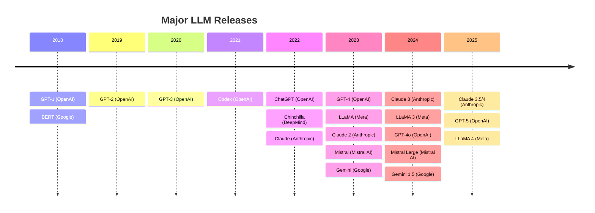
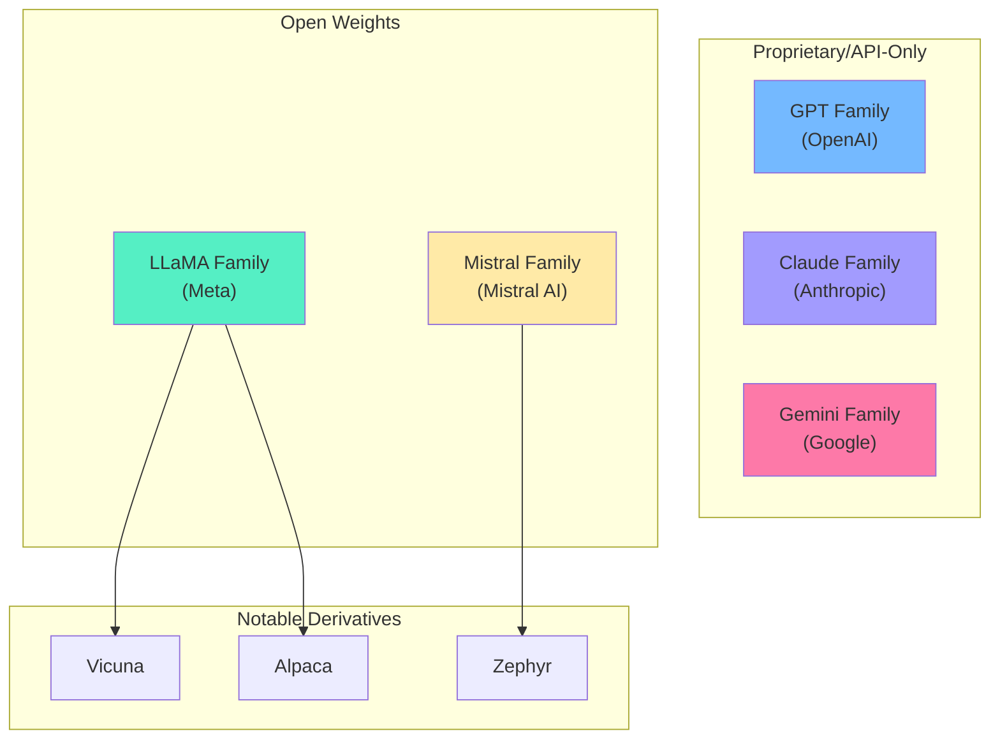
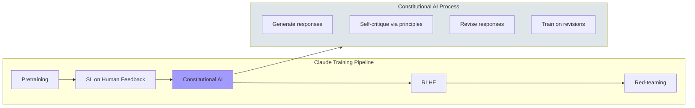
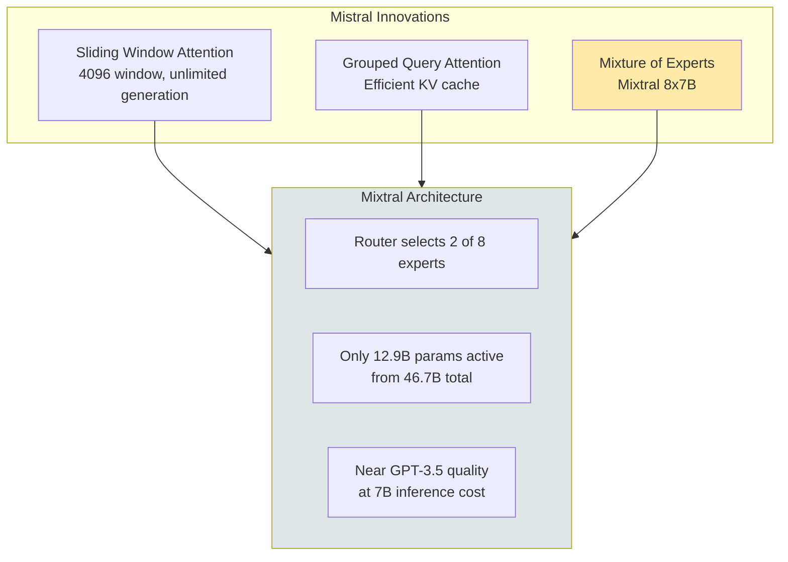

# Model Families

Understanding the major LLM families - their architectures, training approaches, and trade-offs - is essential for making informed decisions about model selection and deployment. This module provides a comparative analysis of GPT, Claude, LLaMA, Mistral, and Gemini.

## Learning Objectives

- **Compare architectural differences** across major model families and their implications
- **Evaluate models** based on benchmarks, licensing, and deployment constraints
- **Understand training innovations** that differentiate each family
- **Make informed model selection decisions** based on use case requirements
- **Articulate trade-offs** between open-source and proprietary models

## The LLM Landscape

The modern LLM landscape has evolved into distinct camps: proprietary frontier models pushing capabilities, and open models democratizing access. Understanding both is crucial.



## Model Family Comparison



## GPT Family (OpenAI)

OpenAI's GPT family established the modern paradigm of decoder-only transformers and few-shot learning.

### Architecture Evolution

| Model | Parameters | Context | Training Data | Key Innovation |
|-------|-----------|---------|---------------|----------------|
| GPT-1 | 117M | 512 | BooksCorpus | Pretraining + fine-tuning |
| GPT-2 | 1.5B | 1024 | WebText (40GB) | Zero-shot capabilities |
| GPT-3 | 175B | 2048 | 300B tokens | In-context learning |
| GPT-3.5 | ~175B | 4096 | + RLHF | Chat optimization |
| GPT-4 | ~1.7T (MoE?) | 8K-128K | Unknown | Multimodal, reasoning |
| GPT-4o | Unknown | 128K | Unknown | Native multimodal |

### Key Innovations

```python
# GPT-3's in-context learning paradigm
def gpt3_few_shot_prompt(examples: list, query: str) -> str:
    """
    GPT-3 pioneered few-shot learning without gradient updates.
    The model learns from examples provided in the prompt.
    """
    prompt = "Translate English to French:\n\n"

    for eng, fr in examples:
        prompt += f"English: {eng}\nFrench: {fr}\n\n"

    prompt += f"English: {query}\nFrench:"
    return prompt

examples = [
    ("Hello", "Bonjour"),
    ("Goodbye", "Au revoir"),
    ("Thank you", "Merci"),
]

prompt = gpt3_few_shot_prompt(examples, "How are you?")
# Model generates: "Comment allez-vous?"
```

### GPT-4 Characteristics

- **Multimodal**: Native vision capabilities
- **Reasoning**: Improved multi-step reasoning
- **Instruction following**: Better alignment with user intent
- **Safety**: Stronger refusals and guardrails
- **Likely MoE**: Rumored to use mixture-of-experts architecture

::: info Complexity Analysis
**GPT-4 inference (estimated):**
- If MoE with ~1.7T total, ~220B active per forward pass
- Context window scaling: 8K base, 128K turbo (likely attention optimizations)
- API pricing suggests ~10x compute vs GPT-3.5
:::

## Claude Family (Anthropic)

Anthropic focuses on AI safety, developing Claude with Constitutional AI (CAI) and extensive harmlessness training.

### Design Philosophy



### Model Comparison

| Model | Context | Strengths | Best For |
|-------|---------|-----------|----------|
| Claude 3 Haiku | 200K | Speed, cost | Simple tasks, high volume |
| Claude 3 Sonnet | 200K | Balance | General purpose |
| Claude 3 Opus | 200K | Reasoning | Complex analysis |
| Claude 3.5 Sonnet | 200K | Near-Opus quality, Sonnet speed | Best value |

### Constitutional AI Implementation Concept

```python
from dataclasses import dataclass
from typing import List

@dataclass
class Principle:
    """A principle from Claude's constitution."""
    name: str
    description: str
    critique_prompt: str
    revision_prompt: str

class ConstitutionalAI:
    """
    Simplified implementation of Constitutional AI concept.

    The real system uses this for self-improvement:
    1. Generate initial response
    2. Apply principles to critique
    3. Generate improved response
    4. Train on the improvements
    """

    def __init__(self):
        self.principles = [
            Principle(
                name="helpfulness",
                description="Responses should be genuinely helpful",
                critique_prompt="Is this response as helpful as it could be?",
                revision_prompt="Revise to be more helpful while remaining safe."
            ),
            Principle(
                name="harmlessness",
                description="Avoid harmful or dangerous content",
                critique_prompt="Could this response cause harm?",
                revision_prompt="Revise to remove potential harms."
            ),
            Principle(
                name="honesty",
                description="Be truthful and acknowledge uncertainty",
                critique_prompt="Is this response honest about limitations?",
                revision_prompt="Revise to be more honest about uncertainty."
            ),
        ]

    def critique_response(
        self,
        response: str,
        principles: List[Principle]
    ) -> List[str]:
        """
        Apply principles to critique a response.
        In practice, this uses the model itself to critique.
        """
        critiques = []
        for principle in principles:
            # Model evaluates its own response against principle
            critique = f"Applying {principle.name}: {principle.critique_prompt}"
            critiques.append(critique)
        return critiques

    def revise_response(
        self,
        response: str,
        critiques: List[str]
    ) -> str:
        """
        Revise response based on critiques.
        The model generates an improved version.
        """
        # In practice: model revises based on critiques
        return f"[Revised response incorporating {len(critiques)} critiques]"


# The power: self-improvement without human labeling every example
cai = ConstitutionalAI()
```

## LLaMA Family (Meta)

Meta's LLaMA series democratized access to high-quality open-weight models, enabling widespread research and deployment.

### Evolution

| Model | Parameters | Context | Training Tokens | License |
|-------|-----------|---------|-----------------|---------|
| LLaMA 1 | 7B-65B | 2048 | 1.4T | Research only |
| LLaMA 2 | 7B-70B | 4096 | 2T | Commercial OK |
| LLaMA 3 | 8B-405B | 8K-128K | 15T+ | Llama 3 License |
| CodeLlama | 7B-34B | 16K-100K | Code-focused | Research/Commercial |

### Architectural Details

```python
from dataclasses import dataclass
import torch
import torch.nn as nn

@dataclass
class LlamaConfig:
    """LLaMA model configuration."""
    vocab_size: int = 32000
    hidden_size: int = 4096
    intermediate_size: int = 11008  # For FFN
    num_hidden_layers: int = 32
    num_attention_heads: int = 32
    num_key_value_heads: int = 8  # GQA in LLaMA 2+
    max_position_embeddings: int = 4096
    rms_norm_eps: float = 1e-6
    rope_theta: float = 10000.0

class RMSNorm(nn.Module):
    """
    RMSNorm - simpler and more efficient than LayerNorm.
    Used in LLaMA instead of standard LayerNorm.
    """
    def __init__(self, hidden_size: int, eps: float = 1e-6):
        super().__init__()
        self.weight = nn.Parameter(torch.ones(hidden_size))
        self.eps = eps

    def forward(self, x: torch.Tensor) -> torch.Tensor:
        # RMS = sqrt(mean(x^2))
        rms = torch.sqrt(torch.mean(x ** 2, dim=-1, keepdim=True) + self.eps)
        return x / rms * self.weight

class RotaryEmbedding(nn.Module):
    """
    Rotary Position Embedding (RoPE) - key innovation in LLaMA.

    Instead of adding positional embeddings, RoPE rotates
    query and key vectors based on position. This enables
    better length generalization.
    """
    def __init__(self, dim: int, max_seq_len: int = 4096, base: float = 10000.0):
        super().__init__()

        # Compute rotation frequencies
        inv_freq = 1.0 / (base ** (torch.arange(0, dim, 2).float() / dim))
        self.register_buffer("inv_freq", inv_freq)

        # Precompute rotation matrices
        t = torch.arange(max_seq_len).float()
        freqs = torch.outer(t, inv_freq)
        emb = torch.cat([freqs, freqs], dim=-1)
        self.register_buffer("cos_cached", emb.cos())
        self.register_buffer("sin_cached", emb.sin())

    def forward(self, q: torch.Tensor, k: torch.Tensor, seq_len: int):
        """Apply rotary embeddings to query and key."""
        cos = self.cos_cached[:seq_len]
        sin = self.sin_cached[:seq_len]

        def rotate_half(x):
            x1, x2 = x[..., :x.shape[-1]//2], x[..., x.shape[-1]//2:]
            return torch.cat([-x2, x1], dim=-1)

        q_embed = q * cos + rotate_half(q) * sin
        k_embed = k * cos + rotate_half(k) * sin
        return q_embed, k_embed


class GroupedQueryAttention(nn.Module):
    """
    Grouped Query Attention (GQA) - LLaMA 2's key optimization.

    Instead of separate K,V heads for each Q head, multiple Q heads
    share K,V heads. This reduces KV cache size significantly.

    MHA: heads_q == heads_kv (standard)
    MQA: heads_kv == 1 (single KV head)
    GQA: heads_q > heads_kv > 1 (grouped)
    """
    def __init__(
        self,
        hidden_size: int,
        num_attention_heads: int,
        num_kv_heads: int
    ):
        super().__init__()
        self.num_heads = num_attention_heads
        self.num_kv_heads = num_kv_heads
        self.head_dim = hidden_size // num_attention_heads
        self.num_groups = num_attention_heads // num_kv_heads

        # Q has full heads, K/V have reduced heads
        self.q_proj = nn.Linear(hidden_size, num_attention_heads * self.head_dim)
        self.k_proj = nn.Linear(hidden_size, num_kv_heads * self.head_dim)
        self.v_proj = nn.Linear(hidden_size, num_kv_heads * self.head_dim)
        self.o_proj = nn.Linear(hidden_size, hidden_size)

    def forward(self, x: torch.Tensor) -> torch.Tensor:
        batch_size, seq_len, _ = x.shape

        q = self.q_proj(x).view(batch_size, seq_len, self.num_heads, self.head_dim)
        k = self.k_proj(x).view(batch_size, seq_len, self.num_kv_heads, self.head_dim)
        v = self.v_proj(x).view(batch_size, seq_len, self.num_kv_heads, self.head_dim)

        # Expand K/V to match Q heads by repeating
        k = k.repeat_interleave(self.num_groups, dim=2)
        v = v.repeat_interleave(self.num_groups, dim=2)

        # Standard attention from here
        # ... (attention computation)
        return x
```

::: info Complexity Analysis
**GQA Memory Savings:**
- MHA (LLaMA 1): KV cache = 2 * layers * heads * seq_len * head_dim
- GQA (LLaMA 2): KV cache = 2 * layers * kv_heads * seq_len * head_dim

For LLaMA 2 70B: 8 KV heads vs 64 Q heads = 8x smaller KV cache
This enables 8x longer contexts or 8x batch size for same memory
:::

## Mistral Family

Mistral AI, founded by ex-DeepMind and Meta researchers, focuses on efficient, high-performance open models.

### Key Innovations



### Sliding Window Attention

```python
class SlidingWindowAttention(nn.Module):
    """
    Sliding Window Attention - Mistral's efficiency innovation.

    Instead of attending to all previous tokens (O(n^2)),
    each token only attends to the last W tokens.

    Benefits:
    - O(n * W) complexity instead of O(n^2)
    - Fixed memory for arbitrarily long sequences
    - Stacked layers still create long-range dependencies

    With L layers and window W, effective context = L * W
    Mistral 7B: 32 layers * 4096 window ≈ 131K effective context
    """
    def __init__(self, window_size: int = 4096):
        super().__init__()
        self.window_size = window_size

    def get_attention_mask(self, seq_len: int) -> torch.Tensor:
        """
        Create sliding window causal mask.

        For position i, can attend to max(0, i-W) through i.
        """
        # Create base causal mask
        mask = torch.ones(seq_len, seq_len, dtype=torch.bool)
        mask = torch.triu(mask, diagonal=1)  # Upper triangular = future

        # Apply sliding window
        for i in range(seq_len):
            start = max(0, i - self.window_size + 1)
            mask[i, :start] = True  # Mask positions before window

        return mask


# Demonstration
swa = SlidingWindowAttention(window_size=4)
mask = swa.get_attention_mask(8)
print("Sliding Window Mask (True = masked):")
print(mask.int())
# Position 7 can attend to positions 4, 5, 6, 7 (window of 4)
```

### Mixture of Experts (Mixtral)

```python
import torch.nn.functional as F

class MoELayer(nn.Module):
    """
    Mixture of Experts layer (simplified Mixtral-style).

    Instead of one FFN, have multiple "expert" FFNs.
    A router network selects which experts to use for each token.

    Mixtral 8x7B:
    - 8 expert FFNs, each 7B-scale
    - Router selects top-2 experts per token
    - Only 2/8 = 25% of FFN compute per token
    - Total params: ~46.7B, active params: ~12.9B
    """
    def __init__(
        self,
        hidden_size: int,
        intermediate_size: int,
        num_experts: int = 8,
        top_k: int = 2
    ):
        super().__init__()
        self.num_experts = num_experts
        self.top_k = top_k

        # Router: predicts which experts to use
        self.router = nn.Linear(hidden_size, num_experts, bias=False)

        # Expert FFNs
        self.experts = nn.ModuleList([
            nn.Sequential(
                nn.Linear(hidden_size, intermediate_size),
                nn.GELU(),
                nn.Linear(intermediate_size, hidden_size)
            )
            for _ in range(num_experts)
        ])

    def forward(self, x: torch.Tensor) -> torch.Tensor:
        batch_size, seq_len, hidden_size = x.shape

        # Flatten for routing
        x_flat = x.view(-1, hidden_size)

        # Router computes expert scores
        router_logits = self.router(x_flat)
        router_probs = F.softmax(router_logits, dim=-1)

        # Select top-k experts
        top_k_probs, top_k_indices = torch.topk(router_probs, self.top_k, dim=-1)
        top_k_probs = top_k_probs / top_k_probs.sum(dim=-1, keepdim=True)  # Renormalize

        # Compute expert outputs (simplified - real impl is more efficient)
        output = torch.zeros_like(x_flat)
        for i, expert in enumerate(self.experts):
            # Find tokens routed to this expert
            mask = (top_k_indices == i).any(dim=-1)
            if mask.any():
                expert_input = x_flat[mask]
                expert_output = expert(expert_input)

                # Weight by router probability
                weights = top_k_probs[mask, (top_k_indices[mask] == i).int().argmax(dim=-1)]
                output[mask] += expert_output * weights.unsqueeze(-1)

        return output.view(batch_size, seq_len, hidden_size)
```

## Gemini Family (Google)

Google's Gemini represents their most capable multimodal models, natively trained on text, images, audio, and video.

### Architecture Highlights

| Model | Modalities | Context | Strengths |
|-------|-----------|---------|-----------|
| Gemini Nano | Text, Vision | 32K | On-device |
| Gemini Pro | Text, Vision, Audio | 1M | Balance of capability/speed |
| Gemini Ultra | All | 1M | Frontier capabilities |
| Gemini 1.5 Pro | All | 2M | Long context |

### Key Differentiators

```python
class GeminiFeatures:
    """
    Gemini's unique characteristics.
    """

    # Native multimodality
    MODALITIES = ["text", "image", "audio", "video"]

    # Extreme long context (1M - 2M tokens)
    MAX_CONTEXT = 2_000_000

    # Notable capabilities
    CAPABILITIES = [
        "Cross-modal reasoning",  # Understanding video content
        "Interleaved generation",  # Mix text and images
        "Long-document understanding",  # Full codebases, books
        "Spatial reasoning",  # 3D understanding from 2D
    ]

    @staticmethod
    def context_comparison():
        """Compare context windows across models."""
        contexts = {
            "GPT-4 Turbo": 128_000,
            "Claude 3": 200_000,
            "Gemini 1.5 Pro": 2_000_000,
        }

        for model, ctx in contexts.items():
            # Rough: 1 page ≈ 500 tokens
            pages = ctx // 500
            hours_audio = ctx / (160 * 60)  # ~160 tokens/min audio
            print(f"{model}: {ctx:,} tokens ≈ {pages} pages or {hours_audio:.1f}h audio")
```

::: info Complexity Analysis
**Long Context Challenges:**
- Standard attention: O(n^2) memory and compute
- 2M tokens with naive attention: 4 * 10^12 operations per layer
- Solutions: Sparse attention, ring attention, efficient attention kernels

Gemini uses a combination of techniques to make extreme context feasible.
:::

## Model Selection Framework

```python
from enum import Enum
from dataclasses import dataclass
from typing import List, Optional

class UseCase(Enum):
    CHAT = "chat"
    CODE = "code"
    ANALYSIS = "analysis"
    MULTIMODAL = "multimodal"
    EMBEDDING = "embedding"
    FINE_TUNING = "fine_tuning"

class Constraint(Enum):
    OPEN_WEIGHTS = "open_weights"
    SELF_HOSTED = "self_hosted"
    LOW_LATENCY = "low_latency"
    LOW_COST = "low_cost"
    HIGH_QUALITY = "high_quality"
    LONG_CONTEXT = "long_context"

@dataclass
class ModelRecommendation:
    model: str
    reason: str
    alternatives: List[str]

def recommend_model(
    use_case: UseCase,
    constraints: List[Constraint],
    context_needed: int = 4096,
) -> ModelRecommendation:
    """
    Recommend appropriate model based on requirements.
    """
    recommendations = {
        (UseCase.CHAT, frozenset([Constraint.HIGH_QUALITY])): ModelRecommendation(
            model="Claude 3.5 Sonnet",
            reason="Best quality-to-cost ratio for chat",
            alternatives=["GPT-4o", "Gemini Pro"]
        ),
        (UseCase.CODE, frozenset([Constraint.OPEN_WEIGHTS])): ModelRecommendation(
            model="CodeLlama 34B",
            reason="Best open-weight code model",
            alternatives=["DeepSeek Coder", "StarCoder 2"]
        ),
        (UseCase.ANALYSIS, frozenset([Constraint.LONG_CONTEXT])): ModelRecommendation(
            model="Gemini 1.5 Pro",
            reason="2M context for document analysis",
            alternatives=["Claude 3 (200K)", "GPT-4 Turbo (128K)"]
        ),
        (UseCase.CHAT, frozenset([Constraint.SELF_HOSTED, Constraint.LOW_LATENCY])): ModelRecommendation(
            model="Mistral 7B",
            reason="Fast, efficient, self-hostable",
            alternatives=["LLaMA 3 8B", "Phi-3"]
        ),
    }

    # Simplified lookup (real impl would be more sophisticated)
    key = (use_case, frozenset(constraints))
    if key in recommendations:
        return recommendations[key]

    # Default recommendation
    return ModelRecommendation(
        model="Claude 3.5 Sonnet or GPT-4o",
        reason="General purpose, high capability",
        alternatives=["LLaMA 3 70B for open weights"]
    )
```

## Interview Q&A

### Q1: When would you choose an open-weight model over a proprietary API?

**Strong Answer:**

I'd choose open weights in these scenarios:

**1. Data Privacy/Compliance**
- Regulated industries (healthcare, finance) may prohibit sending data to third parties
- Self-hosting keeps data within your infrastructure
- Examples: Llama 3 70B, Mistral for on-premise deployment

**2. Cost at Scale**
- API costs are ~$0.01-0.06 per 1K tokens
- At 100M tokens/day: $1K-6K/day = $365K-2M/year
- Self-hosted A100s: ~$1/hour, can process much more
- Break-even typically around 10-50M tokens/day

**3. Customization Needs**
- Fine-tuning on proprietary data
- Custom tokenizers for domain-specific vocabulary
- Modified architectures (adding retrieval heads, etc.)

**4. Latency Requirements**
- API round-trips add 50-200ms
- Self-hosted can achieve <50ms with optimization
- Critical for real-time applications

**When I'd choose APIs:**
- Rapid prototyping
- Low/variable volume
- Need frontier capabilities (GPT-4, Claude Opus level)
- Don't want to manage infrastructure

---

### Q2: Explain the key architectural differences between GPT, LLaMA, and Mistral.

**Strong Answer:**

All three are decoder-only transformers, but with important differences:

**Position Encoding:**
- GPT-2/3: Learned absolute position embeddings
- GPT-4/LLaMA/Mistral: Rotary Position Embedding (RoPE)
- RoPE enables better length generalization

**Normalization:**
- GPT: Layer Normalization
- LLaMA/Mistral: RMSNorm (simpler, faster, no mean computation)
- Placement: Pre-norm (before attention) for stability

**Attention:**
- GPT-3: Multi-head attention (MHA)
- LLaMA 2+, Mistral: Grouped Query Attention (GQA)
- GQA: Multiple Q heads share K,V heads, reducing KV cache 4-8x

**Mistral-specific:**
- Sliding Window Attention: Only attends to last 4096 tokens per layer
- Stacked layers create effective long-range dependencies
- O(n) memory vs O(n^2) for full attention

**Activation:**
- GPT-2: GELU
- GPT-3+, LLaMA, Mistral: SwiGLU (smoother, slightly better)

**The practical impact:**
- LLaMA/Mistral can handle 4-8x longer contexts for same memory
- Mistral's sliding window enables infinite generation
- All use similar training approaches (next token prediction)

---

### Q3: How does Mixture of Experts (MoE) architecture work, and what are the trade-offs?

**Strong Answer:**

MoE replaces dense FFN layers with multiple "expert" FFNs and a router that selects which experts process each token.

**How it works:**
1. Input token embedding goes to router network
2. Router outputs scores for each expert (softmax)
3. Top-k experts (usually 2) are selected
4. Selected experts process the input
5. Outputs are combined weighted by router scores

**Mixtral 8x7B example:**
- 8 expert FFNs, each roughly 7B parameters
- Router selects 2 experts per token
- Total: 46.7B parameters, but only 12.9B active
- Performance near GPT-3.5 at 7B inference cost

**Benefits:**
1. **Compute efficiency**: Only fraction of params used per token
2. **Scaling**: Can add experts without slowing inference
3. **Specialization**: Experts can learn different domains/tasks

**Trade-offs:**
1. **Memory**: All experts loaded in VRAM (46.7B, not 12.9B)
2. **Communication**: In distributed training, expert routing requires all-to-all communication
3. **Load balancing**: Need auxiliary loss to prevent all tokens going to few experts
4. **Batch efficiency**: Different tokens use different experts, harder to batch

**When to use:**
- Large-scale inference where memory isn't the bottleneck
- When you need quality-per-FLOP efficiency
- Training at scale (Google's GLaM, Meta's scattered work)

## Summary Table

| Family | Key Innovation | Open? | Best For |
|--------|---------------|-------|----------|
| **GPT** | In-context learning, RLHF | No | General purpose, frontier |
| **Claude** | Constitutional AI, safety | No | Safe, long-context, reasoning |
| **LLaMA** | Open weights, GQA | Yes | Fine-tuning, self-hosting |
| **Mistral** | Sliding window, MoE | Yes | Efficiency, open MoE |
| **Gemini** | Native multimodal, 2M context | No | Long context, multimodal |

## Sources

- Brown et al. "Language Models are Few-Shot Learners" (GPT-3, 2020)
- OpenAI "GPT-4 Technical Report" (2023)
- Anthropic "Constitutional AI" (2022)
- Anthropic "Claude 3 Technical Report" (2024)
- Touvron et al. "LLaMA" (2023), "LLaMA 2" (2023)
- Meta "Introducing LLaMA 3" (2024)
- Jiang et al. "Mistral 7B" (2023)
- Mistral AI "Mixtral of Experts" (2024)
- Google "Gemini: A Family of Highly Capable Multimodal Models" (2024)
- Google "Gemini 1.5: Unlocking multimodal understanding across millions of tokens" (2024)
