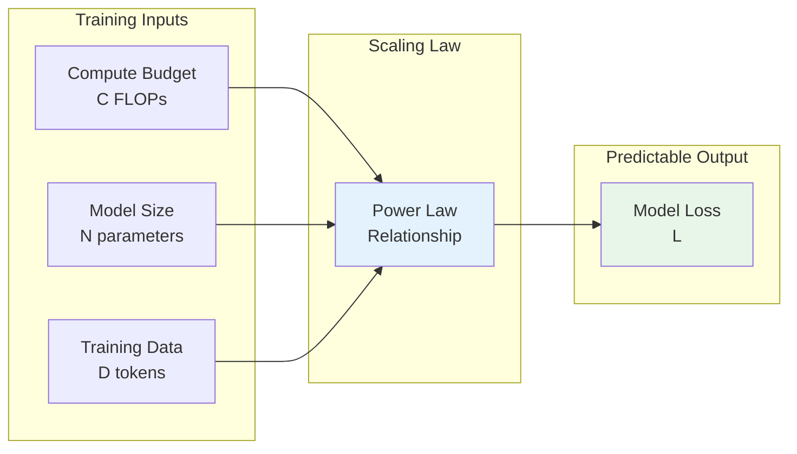
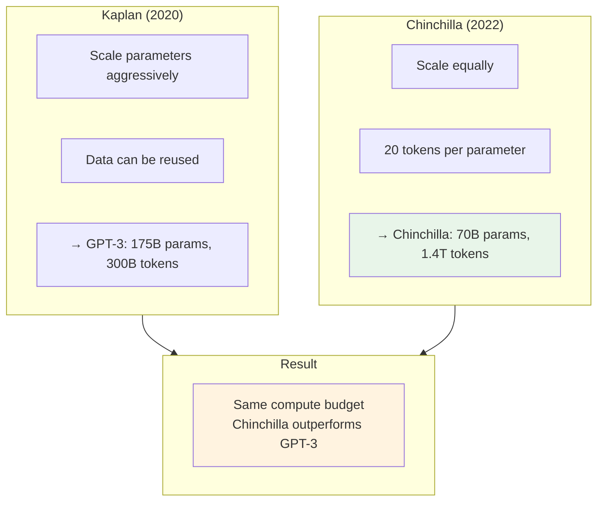
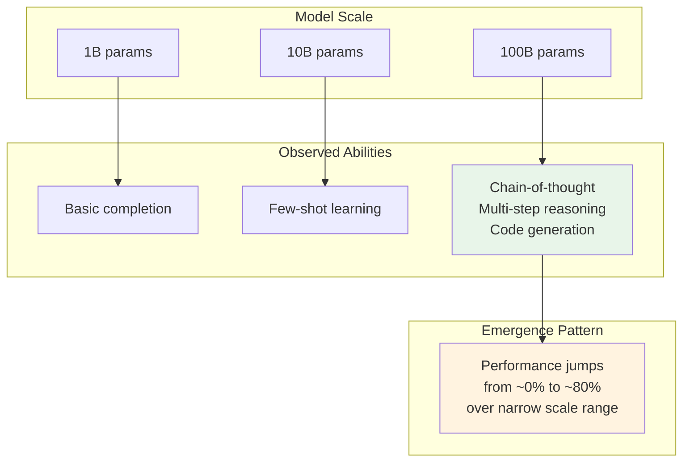
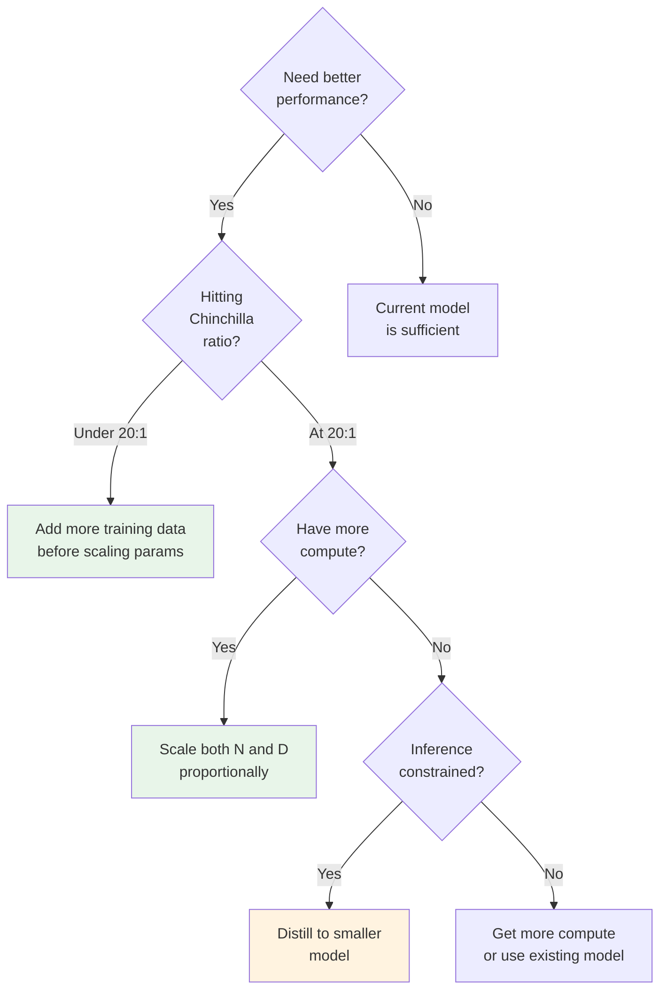

# Scaling Laws

Scaling laws are the "physics" of deep learning - mathematical relationships that predict model performance based on compute budget, parameter count, and training data. Understanding these laws is crucial for making informed decisions about model training and selection.

## Learning Objectives

- **Apply the Chinchilla scaling law** to determine optimal model size for a given compute budget
- **Calculate compute requirements** (FLOPs) for training and inference
- **Explain emergent abilities** and their implications for model capability prediction
- **Make cost-performance trade-offs** in practical model selection decisions
- **Predict diminishing returns** and plan efficient training runs

## The Core Insight

Before scaling laws, training large models was largely trial and error. Scaling laws revealed a profound insight: **model performance is predictable from scale**.



## The Kaplan Scaling Laws (2020)

OpenAI's original scaling laws described loss as a function of three variables:

$$L(N, D) = \left(\frac{N_c}{N}\right)^{\alpha_N} + \left(\frac{D_c}{D}\right)^{\alpha_D} + L_\infty$$

Where:
- $N$ = number of parameters (non-embedding)
- $D$ = dataset size in tokens
- $N_c, D_c$ = critical scaling constants
- $\alpha_N \approx 0.076$, $\alpha_D \approx 0.095$
- $L_\infty$ = irreducible loss (entropy of natural language)

### Key Finding: Parameters > Data

Kaplan et al. concluded that **scaling parameters is more efficient than scaling data**. This led to the GPT-3 approach: train very large models on relatively less data.

```python
import numpy as np

def kaplan_loss(N: float, D: float) -> float:
    """
    Compute expected loss using Kaplan scaling law.

    Args:
        N: Number of parameters (non-embedding)
        D: Dataset size in tokens

    Returns:
        Expected cross-entropy loss
    """
    # Constants from the paper
    N_c = 8.8e13  # Critical parameters
    D_c = 5.4e13  # Critical tokens
    alpha_N = 0.076
    alpha_D = 0.095
    L_inf = 1.69  # Irreducible loss

    loss = (N_c / N) ** alpha_N + (D_c / D) ** alpha_D + L_inf
    return loss

# Example: GPT-3 175B
gpt3_loss = kaplan_loss(N=175e9, D=300e9)
print(f"GPT-3 predicted loss: {gpt3_loss:.3f}")
```

## The Chinchilla Scaling Laws (2022)

DeepMind's Chinchilla paper revolutionized our understanding by showing that **Kaplan's conclusions were wrong** for compute-optimal training.

### The Key Insight

For a fixed compute budget, you should scale parameters and data **equally**, not prioritize parameters.

$$N_{opt} \propto C^{0.5}, \quad D_{opt} \propto C^{0.5}$$

This means the optimal tokens-to-parameters ratio is roughly **20:1** (20 tokens per parameter).



### The Chinchilla Formula

$$L(N, D) = E + \frac{A}{N^\alpha} + \frac{B}{D^\beta}$$

Where:
- $E \approx 1.69$ (irreducible loss)
- $A \approx 406.4$, $B \approx 410.7$
- $\alpha \approx 0.34$, $\beta \approx 0.28$

```python
from dataclasses import dataclass
from typing import Tuple
import numpy as np

@dataclass
class ChinchillaParams:
    """Parameters from the Chinchilla paper."""
    E: float = 1.69    # Irreducible loss
    A: float = 406.4   # Parameter scaling constant
    B: float = 410.7   # Data scaling constant
    alpha: float = 0.34  # Parameter exponent
    beta: float = 0.28   # Data exponent

def chinchilla_loss(N: float, D: float, params: ChinchillaParams = None) -> float:
    """
    Compute expected loss using Chinchilla scaling law.

    Args:
        N: Number of parameters
        D: Dataset size in tokens
        params: Scaling law parameters

    Returns:
        Expected cross-entropy loss
    """
    if params is None:
        params = ChinchillaParams()

    loss = params.E + params.A / (N ** params.alpha) + params.B / (D ** params.beta)
    return loss

def compute_optimal_allocation(
    compute_budget: float,
    flops_per_token_per_param: float = 6.0
) -> Tuple[float, float]:
    """
    Given a compute budget, find optimal N and D.

    The relationship is: C = 6 * N * D (approximately)

    For Chinchilla-optimal training:
    N_opt = (C / 6)^0.5 * k_N
    D_opt = (C / 6)^0.5 * k_D

    Where the ratio D/N ≈ 20
    """
    # Simplified: assume 20 tokens per parameter
    tokens_per_param = 20

    # C ≈ 6 * N * D, and D = 20 * N
    # C ≈ 6 * N * 20 * N = 120 * N^2
    # N = sqrt(C / 120)

    N_opt = np.sqrt(compute_budget / (flops_per_token_per_param * tokens_per_param))
    D_opt = tokens_per_param * N_opt

    return N_opt, D_opt


# Example: Given 10^24 FLOPs (roughly GPT-3 training budget)
compute_budget = 3.64e23  # GPT-3's actual compute

N_opt, D_opt = compute_optimal_allocation(compute_budget)

print(f"Compute budget: {compute_budget:.2e} FLOPs")
print(f"Chinchilla-optimal allocation:")
print(f"  Parameters: {N_opt:.2e} ({N_opt/1e9:.1f}B)")
print(f"  Tokens: {D_opt:.2e} ({D_opt/1e12:.2f}T)")
print(f"  Ratio (D/N): {D_opt/N_opt:.1f}")

# Compare: GPT-3 was 175B params, 300B tokens (ratio ~1.7)
# Chinchilla-optimal would be ~55B params, 1.1T tokens (ratio ~20)
```

::: info Complexity Analysis
**Training compute**: C ≈ 6 * N * D FLOPs
- Factor of 6: 2 for forward pass * 3 for forward + backward

**For GPT-3 (175B, 300B tokens)**: 6 * 175e9 * 300e9 ≈ 3.15e23 FLOPs
**GPU hours**: ~3.64e23 / (A100 @ 312 TFLOPS) ≈ 1.2M GPU-hours
:::

## Compute Estimation

Understanding compute requirements is essential for planning training runs and estimating costs.

```python
from typing import Dict
from dataclasses import dataclass

@dataclass
class ModelConfig:
    """Configuration for compute estimation."""
    name: str
    params_billions: float
    tokens_billions: float
    precision: str = "fp16"  # fp32, fp16, bf16

def estimate_training_compute(config: ModelConfig) -> Dict[str, float]:
    """
    Estimate training compute requirements.

    Returns:
        Dictionary with FLOPs, GPU-hours, and estimated cost
    """
    N = config.params_billions * 1e9
    D = config.tokens_billions * 1e9

    # Compute in FLOPs (6 * N * D approximation)
    flops = 6 * N * D

    # A100 performance (TFLOPS)
    gpu_tflops = {
        "fp32": 19.5,
        "fp16": 312,  # With tensor cores
        "bf16": 312,
    }[config.precision]

    gpu_flops_per_second = gpu_tflops * 1e12

    # Assume 50% utilization (realistic for large-scale training)
    utilization = 0.5
    effective_flops = gpu_flops_per_second * utilization

    gpu_seconds = flops / effective_flops
    gpu_hours = gpu_seconds / 3600

    # Cost estimation (A100 @ ~$2/hr on cloud)
    hourly_rate = 2.0
    estimated_cost = gpu_hours * hourly_rate

    return {
        "total_flops": flops,
        "gpu_hours_single": gpu_hours,
        "estimated_cost_usd": estimated_cost,
        "days_1000_gpus": gpu_hours / (1000 * 24),
    }


# Analyze famous models
models = [
    ModelConfig("GPT-2", 1.5, 40),
    ModelConfig("GPT-3", 175, 300),
    ModelConfig("Chinchilla", 70, 1400),
    ModelConfig("LLaMA 2 70B", 70, 2000),
    ModelConfig("LLaMA 3 405B", 405, 15000),
]

for model in models:
    results = estimate_training_compute(model)
    print(f"\n{model.name}:")
    print(f"  Params: {model.params_billions}B, Tokens: {model.tokens_billions}B")
    print(f"  Total FLOPs: {results['total_flops']:.2e}")
    print(f"  GPU-hours (A100): {results['gpu_hours_single']:,.0f}")
    print(f"  Time (1000 GPUs): {results['days_1000_gpus']:.1f} days")
    print(f"  Est. cost: ${results['estimated_cost_usd']:,.0f}")
```

## Emergent Abilities

One of the most fascinating aspects of scaling is **emergent abilities** - capabilities that appear suddenly at certain scales, unpredictable from smaller model performance.



### Examples of Emergent Abilities

| Ability | Emerges Around | Description |
|---------|----------------|-------------|
| Few-shot learning | ~10B params | Learning from examples in context |
| Chain-of-thought | ~50B params | Multi-step reasoning |
| Word unscrambling | ~60B params | Anagram solving |
| Arithmetic (3+ digit) | ~100B params | Multi-digit math |
| Code synthesis | ~100B params | Generating working programs |

::: warning Recent Debate
The "emergence" phenomenon is contested. Some researchers argue that emergent abilities are artifacts of the evaluation metrics used (discontinuous metrics on continuous improvements). The debate continues, but the practical implication remains: larger models unlock qualitatively different capabilities.
:::

```python
def analyze_emergence(
    model_sizes: list,
    performance_scores: list,
    threshold: float = 0.5
) -> dict:
    """
    Analyze whether a capability shows emergent behavior.

    Emergence is characterized by:
    1. Near-zero performance below a threshold
    2. Rapid improvement over a narrow scale range
    3. High performance above the threshold
    """
    import numpy as np

    sizes = np.array(model_sizes)
    scores = np.array(performance_scores)

    # Find the "emergence point" - where performance first exceeds threshold
    above_threshold = np.where(scores > threshold)[0]

    if len(above_threshold) == 0:
        return {"emergent": False, "reason": "Never exceeds threshold"}

    emergence_idx = above_threshold[0]

    # Check if performance was near-zero before
    if emergence_idx > 0:
        pre_emergence_mean = np.mean(scores[:emergence_idx])
        if pre_emergence_mean > 0.1:  # 10% is not "near-zero"
            return {"emergent": False, "reason": "Gradual improvement"}

    # Calculate the "sharpness" of emergence
    if emergence_idx > 0:
        scale_ratio = sizes[emergence_idx] / sizes[emergence_idx - 1]
        performance_jump = scores[emergence_idx] - scores[emergence_idx - 1]

        return {
            "emergent": True,
            "emergence_scale": sizes[emergence_idx],
            "scale_ratio": scale_ratio,
            "performance_jump": performance_jump,
        }

    return {"emergent": True, "emergence_scale": sizes[0]}


# Example: Hypothetical chain-of-thought emergence
sizes = [1e9, 3e9, 10e9, 30e9, 70e9, 175e9]  # Parameters
cot_scores = [0.02, 0.03, 0.05, 0.08, 0.45, 0.82]  # Accuracy

result = analyze_emergence(sizes, cot_scores)
print(f"Emergence analysis: {result}")
```

## Practical Decision Making

### Model Selection Framework

```python
def recommend_model(
    compute_budget_flops: float,
    inference_budget_per_query: float,  # FLOPs
    latency_requirement_ms: float,
    use_case: str,
) -> dict:
    """
    Recommend model size based on constraints.

    Balances:
    - Training compute budget
    - Inference cost per query
    - Latency requirements
    - Use case complexity
    """
    # Chinchilla-optimal for training
    N_train_opt, D_train_opt = compute_optimal_allocation(compute_budget_flops)

    # Inference constraints may require smaller model
    # Rough: inference FLOPs ≈ 2 * N * context_length
    max_inference_params = inference_budget_per_query / (2 * 4096)

    # Latency constraint (rough: 1ms per 1B params on A100)
    max_latency_params = latency_requirement_ms * 1e9

    # Take minimum of all constraints
    practical_max_params = min(N_train_opt, max_inference_params, max_latency_params)

    # Use case adjustment
    use_case_multipliers = {
        "simple_classification": 0.3,
        "general_qa": 0.7,
        "complex_reasoning": 1.0,
        "code_generation": 1.2,
    }
    multiplier = use_case_multipliers.get(use_case, 1.0)

    recommended_params = practical_max_params * multiplier

    # Round to nearest standard size
    standard_sizes = [1e9, 3e9, 7e9, 13e9, 30e9, 70e9, 175e9]
    recommended_size = min(standard_sizes, key=lambda x: abs(x - recommended_params))

    return {
        "chinchilla_optimal_params": N_train_opt,
        "inference_constrained_max": max_inference_params,
        "latency_constrained_max": max_latency_params,
        "recommended_params": recommended_size,
        "recommended_params_B": recommended_size / 1e9,
    }


# Example scenario
result = recommend_model(
    compute_budget_flops=1e22,  # Modest training budget
    inference_budget_per_query=1e12,  # ~1 TFLOP per query
    latency_requirement_ms=50,  # 50ms response time
    use_case="general_qa",
)

print(f"Recommendation: {result['recommended_params_B']:.0f}B parameters")
```

### When to Scale vs. When to Stop



## Interview Q&A

### Q1: Explain the Chinchilla scaling law and why it changed how we train LLMs.

**Strong Answer:**

The Chinchilla scaling law (Hoffmann et al., 2022) fundamentally changed our understanding of compute-optimal training.

**The core finding:** For a fixed compute budget, you should scale model parameters (N) and training tokens (D) **equally**, maintaining roughly 20 tokens per parameter.

**Why this was revolutionary:**
- Previous understanding (Kaplan, 2020) suggested scaling parameters was more efficient
- This led to GPT-3: 175B parameters trained on only 300B tokens (ratio ~1.7)
- Chinchilla showed that a 70B model trained on 1.4T tokens (ratio ~20) **outperforms** GPT-3 despite using the same compute

**The formula:** L(N,D) = E + A/N^α + B/D^β
- Both N and D contribute to loss reduction
- Ignoring data starves the model's potential

**Practical implications:**
1. LLaMA, Mistral, and later models followed Chinchilla ratios
2. Data became the bottleneck, spurring synthetic data research
3. Inference costs dropped (smaller models perform better)
4. Training data quality became more critical than quantity

**The trade-off:** Chinchilla-optimal is optimal for **one-time use**. For high-inference workloads, over-training a smaller model may be cost-effective.

---

### Q2: How would you estimate the compute required to train a 70B parameter model?

**Strong Answer:**

I'd break this down systematically:

**Step 1: Determine training tokens (Chinchilla-optimal)**
- Ratio: ~20 tokens per parameter
- D = 20 * 70B = 1.4T tokens

**Step 2: Calculate FLOPs**
- Rule of thumb: C ≈ 6 * N * D
- C = 6 * 70e9 * 1.4e12 = 5.88e23 FLOPs
- (The factor 6 accounts for forward and backward passes)

**Step 3: Convert to GPU-hours**
- A100 (80GB): ~312 TFLOPS for BF16 with tensor cores
- Assume 50% MFU (model FLOP utilization) for large-scale training
- Effective: 156 TFLOPS
- GPU-hours = 5.88e23 / (156e12 * 3600) ≈ 1.05M GPU-hours

**Step 4: Wall-clock time**
- With 1000 A100s: ~1050 hours ≈ 44 days
- With 2000 A100s: ~22 days

**Step 5: Cost estimation**
- A100 cloud cost: ~$2/GPU-hour
- Total: ~$2.1M just for compute
- Add 20-30% for infrastructure, failures, experimentation

**Sanity check:**
- LLaMA 2 70B: trained on 2T tokens, reported ~1.7M GPU-hours on A100-80GB
- Our estimate (1.05M for 1.4T tokens) scales correctly: 1.05 * (2/1.4) ≈ 1.5M

---

### Q3: What are emergent abilities and why do they matter for model selection?

**Strong Answer:**

Emergent abilities are capabilities that appear to suddenly "unlock" at certain model scales, with near-zero performance below a threshold and high performance above it.

**Examples:**
- **Chain-of-thought reasoning**: Models below ~50B struggle; above this threshold, they can solve multi-step problems
- **3+ digit arithmetic**: Emerges around 100B parameters
- **Code synthesis**: Complex code generation becomes reliable at very large scales

**Why they matter for model selection:**

1. **Non-linear value:** A 50B model isn't just "half as good" as a 100B model - it may entirely lack certain capabilities you need

2. **Task-specific thresholds:** Different capabilities emerge at different scales:
   - Simple classification: 1-7B sufficient
   - General QA: 7-30B sweet spot
   - Complex reasoning: 70B+ often required

3. **Cost implications:** If your use case requires an emergent ability, you **must** use a model above that threshold, regardless of cost per query

4. **The debate:** Recent research suggests emergence might be a measurement artifact - capabilities may improve smoothly but our metrics are discontinuous. Practically, this means:
   - Don't assume a capability is binary
   - Test your specific use case across model sizes
   - Smooth metrics (perplexity) show gradual improvement even when task accuracy jumps

**My recommendation:** Before committing to model size, benchmark your specific task across 3+ model scales to identify if emergence affects your use case.

## Summary Table

| Concept | Key Formula/Insight | Practical Application |
|---------|--------------------|-----------------------|
| Kaplan Laws | L ~ N^(-0.076) | Historical context; superseded |
| Chinchilla | 20 tokens per parameter | Standard for training planning |
| Compute (FLOPs) | C ≈ 6 * N * D | Budget estimation |
| Inference FLOPs | ~2 * N per token | Latency/cost planning |
| Emergent abilities | Non-linear scaling | Capability thresholds |
| GPU-hours | C / (TFLOPS * MFU * 3600) | Resource planning |

## Sources

- Kaplan et al. "Scaling Laws for Neural Language Models" (2020)
- Hoffmann et al. "Training Compute-Optimal Large Language Models" (Chinchilla, 2022)
- Wei et al. "Emergent Abilities of Large Language Models" (2022)
- Schaeffer et al. "Are Emergent Abilities of Large Language Models a Mirage?" (2023)
- Touvron et al. "LLaMA 2: Open Foundation and Fine-Tuned Chat Models" (2023)
- Brown et al. "Language Models are Few-Shot Learners" (GPT-3, 2020)
