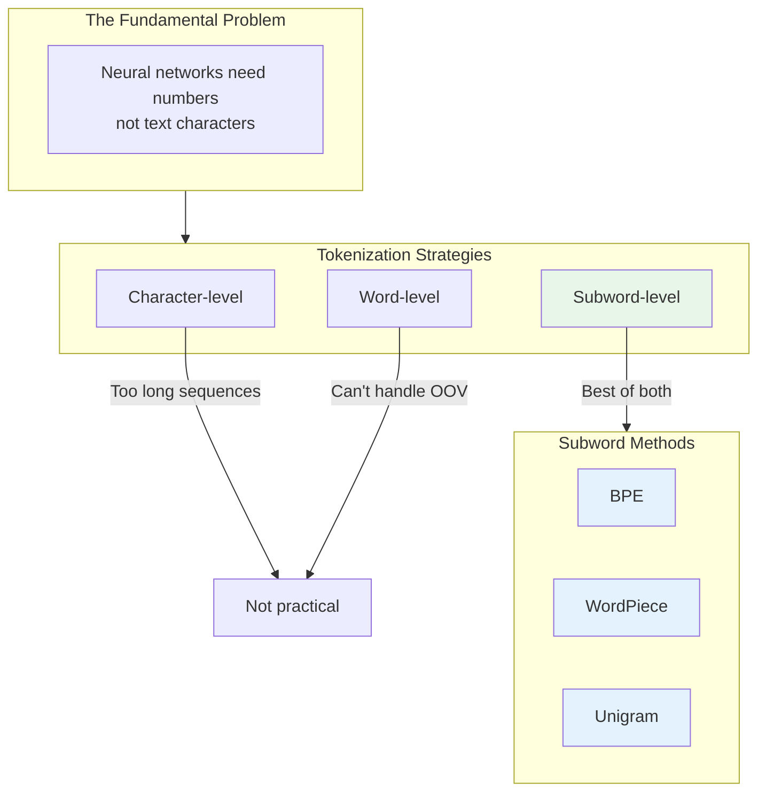
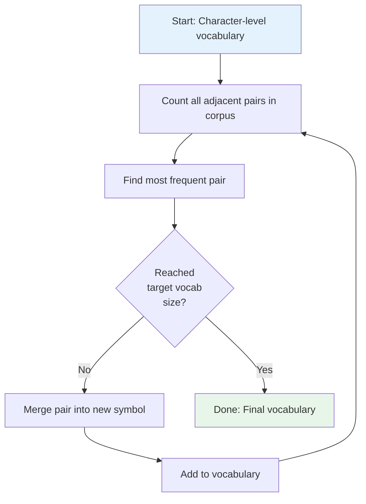
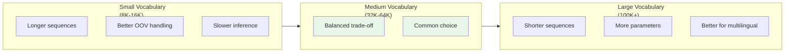

# Tokenization Deep Dive

Tokenization is the bridge between human-readable text and the numerical representations that LLMs understand. This module explores the algorithms, trade-offs, and practical implications of different tokenization strategies.

## Learning Objectives

- **Implement the BPE algorithm from scratch** and understand its iterative merge process
- **Compare tokenization libraries** (tiktoken, SentencePiece, Hugging Face) and their use cases
- **Analyze vocabulary trade-offs** including size, coverage, efficiency, and multilingual support
- **Debug tokenization issues** in production systems including unknown tokens and boundary effects
- **Calculate token counts** for cost estimation and context window management

## Why Tokenization Matters

Think of tokenization as choosing the alphabet for your language model. The choice affects:

1. **Model capacity** - Vocabulary size determines embedding table size
2. **Sequence length** - More tokens per text = more compute = shorter effective context
3. **Generation quality** - Poor tokenization leads to spelling errors and rare word issues
4. **Multilingual fairness** - Some languages get 2-3x more tokens for the same meaning



## The Tokenization Spectrum

| Strategy | Example: "unhappiness" | Pros | Cons |
|----------|------------------------|------|------|
| Character | ['u','n','h','a','p','p','i','n','e','s','s'] | Handles any text | Very long sequences |
| Word | ['unhappiness'] | Semantic units | OOV problems, huge vocab |
| Subword (BPE) | ['un', 'happiness'] or ['un', 'happ', 'iness'] | Balanced | Requires training |

## BPE Algorithm (Byte-Pair Encoding)

BPE was originally a compression algorithm, repurposed for NLP by Sennrich et al. (2016). It iteratively merges the most frequent adjacent pairs of symbols.

### The Algorithm



### Implementation from Scratch

```python
from collections import defaultdict
import re
from typing import Dict, List, Tuple

class BPETokenizer:
    """
    Byte-Pair Encoding tokenizer implementation.

    The algorithm:
    1. Initialize vocabulary with all characters
    2. Count frequency of all adjacent symbol pairs
    3. Merge most frequent pair into new symbol
    4. Repeat until desired vocabulary size
    """

    def __init__(self, vocab_size: int = 1000):
        self.vocab_size = vocab_size
        self.merges: List[Tuple[str, str]] = []
        self.vocab: Dict[str, int] = {}

    def _get_stats(self, word_freqs: Dict[Tuple[str, ...], int]) -> Dict[Tuple[str, str], int]:
        """Count frequency of adjacent pairs."""
        pairs = defaultdict(int)
        for word, freq in word_freqs.items():
            symbols = word
            for i in range(len(symbols) - 1):
                pairs[(symbols[i], symbols[i + 1])] += freq
        return pairs

    def _merge_pair(
        self,
        word_freqs: Dict[Tuple[str, ...], int],
        pair: Tuple[str, str]
    ) -> Dict[Tuple[str, ...], int]:
        """Merge all occurrences of a pair in the vocabulary."""
        new_word_freqs = {}
        bigram = pair
        replacement = pair[0] + pair[1]

        for word, freq in word_freqs.items():
            new_word = []
            i = 0
            while i < len(word):
                if i < len(word) - 1 and (word[i], word[i + 1]) == bigram:
                    new_word.append(replacement)
                    i += 2
                else:
                    new_word.append(word[i])
                    i += 1
            new_word_freqs[tuple(new_word)] = freq

        return new_word_freqs

    def train(self, corpus: List[str]) -> None:
        """Train BPE on a corpus of text."""
        # Step 1: Build initial word frequencies with character splits
        word_freqs = defaultdict(int)
        for text in corpus:
            words = text.lower().split()
            for word in words:
                # Add end-of-word marker
                word_tuple = tuple(word) + ('</w>',)
                word_freqs[word_tuple] += 1

        # Build initial character vocabulary
        self.vocab = {'</w>': 0}
        for word in word_freqs:
            for char in word:
                if char not in self.vocab:
                    self.vocab[char] = len(self.vocab)

        # Step 2: Iteratively merge most frequent pairs
        num_merges = self.vocab_size - len(self.vocab)

        for i in range(num_merges):
            pairs = self._get_stats(word_freqs)
            if not pairs:
                break

            # Find most frequent pair
            best_pair = max(pairs, key=pairs.get)
            self.merges.append(best_pair)

            # Add merged symbol to vocabulary
            new_symbol = best_pair[0] + best_pair[1]
            self.vocab[new_symbol] = len(self.vocab)

            # Update word frequencies
            word_freqs = self._merge_pair(word_freqs, best_pair)

            if (i + 1) % 100 == 0:
                print(f"Merge {i + 1}: {best_pair} -> {new_symbol}")

    def encode(self, text: str) -> List[int]:
        """Encode text to token IDs."""
        tokens = []
        words = text.lower().split()

        for word in words:
            word_tokens = list(word) + ['</w>']

            # Apply merges in order
            for merge in self.merges:
                i = 0
                while i < len(word_tokens) - 1:
                    if (word_tokens[i], word_tokens[i + 1]) == merge:
                        word_tokens = (
                            word_tokens[:i] +
                            [merge[0] + merge[1]] +
                            word_tokens[i + 2:]
                        )
                    else:
                        i += 1

            # Convert to IDs
            for token in word_tokens:
                if token in self.vocab:
                    tokens.append(self.vocab[token])
                else:
                    # Handle unknown (fall back to characters)
                    for char in token:
                        tokens.append(self.vocab.get(char, 0))

        return tokens

    def decode(self, token_ids: List[int]) -> str:
        """Decode token IDs back to text."""
        id_to_token = {v: k for k, v in self.vocab.items()}
        tokens = [id_to_token.get(id, '?') for id in token_ids]
        text = ''.join(tokens).replace('</w>', ' ').strip()
        return text


# Demonstration
corpus = [
    "the cat sat on the mat",
    "the cat ate the rat",
    "the rat sat on the cat",
] * 100  # Repeat for frequency

tokenizer = BPETokenizer(vocab_size=50)
tokenizer.train(corpus)

test = "the cat sat"
encoded = tokenizer.encode(test)
decoded = tokenizer.decode(encoded)
print(f"Original: {test}")
print(f"Encoded: {encoded}")
print(f"Decoded: {decoded}")
```

::: info Complexity Analysis
**Training time**: O(V * N * M) where V is vocab size, N is corpus size, M is average sequence length
**Encoding time**: O(M * V) per word in worst case, but typically much faster with optimizations
**Space**: O(V) for vocabulary + O(merges) for merge rules
:::

## SentencePiece

SentencePiece is a language-agnostic tokenizer that treats the input as a raw stream of characters, including whitespace. This makes it ideal for multilingual models.

```python
import sentencepiece as spm

# Training a SentencePiece model
spm.SentencePieceTrainer.train(
    input='corpus.txt',
    model_prefix='my_tokenizer',
    vocab_size=32000,
    model_type='bpe',  # or 'unigram'
    character_coverage=0.9995,
    pad_id=0,
    unk_id=1,
    bos_id=2,
    eos_id=3,
)

# Loading and using
sp = spm.SentencePieceProcessor(model_file='my_tokenizer.model')

text = "Hello, how are you?"
tokens = sp.encode(text, out_type=str)
ids = sp.encode(text, out_type=int)

print(f"Tokens: {tokens}")  # ['▁Hello', ',', '▁how', '▁are', '▁you', '?']
print(f"IDs: {ids}")        # [123, 45, 67, 89, 101, 112]

# Decode back
decoded = sp.decode(ids)
print(f"Decoded: {decoded}")  # "Hello, how are you?"
```

### Key Features of SentencePiece

| Feature | Description |
|---------|-------------|
| **Whitespace handling** | Uses `▁` (U+2581) to mark word boundaries |
| **Language agnostic** | Works on raw Unicode, no pre-tokenization |
| **Model types** | Supports BPE and Unigram |
| **Subword regularization** | Can sample different segmentations during training |

## tiktoken (OpenAI)

tiktoken is OpenAI's fast BPE tokenizer, used by GPT-3.5, GPT-4, and the OpenAI API.

```python
import tiktoken

# Get encoder for a specific model
enc = tiktoken.encoding_for_model("gpt-4")

# Or by encoding name
enc = tiktoken.get_encoding("cl100k_base")

text = "Hello, how are you today?"

# Encode
tokens = enc.encode(text)
print(f"Tokens: {tokens}")
print(f"Token count: {len(tokens)}")

# Decode
decoded = enc.decode(tokens)
print(f"Decoded: {decoded}")

# Inspect individual tokens
for token_id in tokens:
    token_bytes = enc.decode_single_token_bytes(token_id)
    print(f"{token_id} -> {token_bytes}")

# Special tokens
enc_with_special = tiktoken.get_encoding("cl100k_base")
special_tokens = enc_with_special.encode(
    "<|endoftext|>",
    allowed_special={"<|endoftext|>"}
)
```

### tiktoken Encodings

```python
# Common tiktoken encodings
ENCODINGS = {
    "cl100k_base": {
        "models": ["gpt-4", "gpt-3.5-turbo", "text-embedding-ada-002"],
        "vocab_size": 100277,
        "special_tokens": ["<|endoftext|>", "<|fim_prefix|>", "<|fim_middle|>", "<|fim_suffix|>"]
    },
    "p50k_base": {
        "models": ["text-davinci-003", "code-davinci-002"],
        "vocab_size": 50281,
    },
    "r50k_base": {
        "models": ["davinci", "curie", "babbage", "ada"],
        "vocab_size": 50257,
    }
}

def estimate_tokens(text: str, model: str = "gpt-4") -> int:
    """Estimate token count for cost calculation."""
    enc = tiktoken.encoding_for_model(model)
    return len(enc.encode(text))

def truncate_to_tokens(text: str, max_tokens: int, model: str = "gpt-4") -> str:
    """Truncate text to fit within token limit."""
    enc = tiktoken.encoding_for_model(model)
    tokens = enc.encode(text)
    if len(tokens) <= max_tokens:
        return text
    return enc.decode(tokens[:max_tokens])
```

## Vocabulary Trade-offs



### Vocabulary Size Impact

```python
import tiktoken

def analyze_tokenization_efficiency(text: str):
    """Compare tokenization across different encodings."""
    encodings = ["cl100k_base", "p50k_base", "r50k_base"]

    print(f"Text: {text[:50]}..." if len(text) > 50 else f"Text: {text}")
    print("-" * 60)

    for enc_name in encodings:
        enc = tiktoken.get_encoding(enc_name)
        tokens = enc.encode(text)

        # Calculate compression ratio
        chars_per_token = len(text) / len(tokens)

        print(f"{enc_name}:")
        print(f"  Tokens: {len(tokens)}")
        print(f"  Chars/token: {chars_per_token:.2f}")
        print()

# Test with different text types
english = "The quick brown fox jumps over the lazy dog."
code = "def fibonacci(n): return n if n < 2 else fibonacci(n-1) + fibonacci(n-2)"
multilingual = "Hello world! Bonjour le monde! Hola mundo!"

analyze_tokenization_efficiency(english)
analyze_tokenization_efficiency(code)
analyze_tokenization_efficiency(multilingual)
```

### Multilingual Considerations

Different languages have vastly different tokenization efficiency:

```python
def compare_languages():
    """Show tokenization disparity across languages."""
    enc = tiktoken.get_encoding("cl100k_base")

    # Same meaning, different languages
    texts = {
        "English": "Hello, how are you?",
        "Spanish": "Hola, como estas?",
        "Chinese": "你好，你好吗？",
        "Arabic": "مرحبا، كيف حالك؟",
        "Hindi": "नमस्ते, आप कैसे हैं?",
    }

    for lang, text in texts.items():
        tokens = enc.encode(text)
        print(f"{lang}: '{text}'")
        print(f"  Tokens: {len(tokens)}, Chars: {len(text)}")
        print(f"  Ratio: {len(tokens)/len(text):.2f} tokens/char")
        print()

# This reveals that non-English languages often require
# 2-5x more tokens for equivalent meaning
```

::: warning Interview Insight
**Multilingual tokenization disparity** is a fairness issue. Users of non-Latin script languages:
- Pay more per API call (charged by token)
- Get shorter effective context windows
- May experience worse model performance

This is why models like LLaMA 2 and Gemini invested heavily in multilingual tokenization.
:::

## Handling Special Cases

### Unknown Tokens (UNK)

```python
def handle_unk_tokens(text: str, tokenizer) -> List[int]:
    """
    Strategy for handling out-of-vocabulary tokens.

    Modern BPE tokenizers rarely produce UNK because they
    can fall back to byte-level encoding.
    """
    tokens = []
    for token in tokenizer.encode(text):
        if token == tokenizer.unk_id:
            # Option 1: Skip
            continue
            # Option 2: Replace with special token
            # tokens.append(tokenizer.pad_id)
            # Option 3: Byte-level fallback (if supported)
        else:
            tokens.append(token)
    return tokens
```

### Token Boundaries and Text Generation

```python
def demonstrate_boundary_issues():
    """
    Token boundaries can cause unexpected generation behavior.
    """
    import tiktoken
    enc = tiktoken.get_encoding("cl100k_base")

    # These look similar but tokenize differently
    examples = [
        "ChatGPT",      # Single token or multiple?
        "Chat GPT",     # With space
        "chatgpt",      # Lowercase
        "CHATGPT",      # Uppercase
    ]

    for ex in examples:
        tokens = enc.encode(ex)
        token_strs = [enc.decode([t]) for t in tokens]
        print(f"'{ex}' -> {token_strs}")

# Output shows that capitalization and spacing
# significantly affect tokenization
```

## Practical Token Counting

```python
from typing import List, Dict
import tiktoken

class TokenCounter:
    """Production-ready token counting utilities."""

    def __init__(self, model: str = "gpt-4"):
        self.encoding = tiktoken.encoding_for_model(model)

    def count_tokens(self, text: str) -> int:
        """Count tokens in a string."""
        return len(self.encoding.encode(text))

    def count_messages(self, messages: List[Dict[str, str]]) -> int:
        """
        Count tokens in a chat conversation.

        Based on OpenAI's token counting guidelines.
        """
        tokens_per_message = 3  # <|im_start|>role\n...content<|im_end|>
        tokens_per_name = 1

        num_tokens = 0
        for message in messages:
            num_tokens += tokens_per_message
            for key, value in message.items():
                num_tokens += self.count_tokens(value)
                if key == "name":
                    num_tokens += tokens_per_name

        num_tokens += 3  # <|im_start|>assistant
        return num_tokens

    def estimate_cost(
        self,
        input_tokens: int,
        output_tokens: int,
        model: str = "gpt-4"
    ) -> float:
        """Estimate API cost based on token counts."""
        # Prices as of 2024 (update as needed)
        prices = {
            "gpt-4": {"input": 0.03, "output": 0.06},
            "gpt-4-turbo": {"input": 0.01, "output": 0.03},
            "gpt-3.5-turbo": {"input": 0.0005, "output": 0.0015},
        }

        price = prices.get(model, prices["gpt-4"])
        cost = (input_tokens * price["input"] + output_tokens * price["output"]) / 1000
        return cost


# Usage
counter = TokenCounter()

messages = [
    {"role": "system", "content": "You are a helpful assistant."},
    {"role": "user", "content": "What is the capital of France?"},
]

total_tokens = counter.count_messages(messages)
print(f"Total tokens: {total_tokens}")
print(f"Estimated cost: ${counter.estimate_cost(total_tokens, 50):.4f}")
```

## Interview Q&A

### Q1: Why do modern LLMs use subword tokenization instead of word or character level?

**Strong Answer:**

Subword tokenization (BPE, WordPiece, Unigram) is the sweet spot between word-level and character-level approaches:

**vs. Word-level:**
- Word tokenizers require a fixed vocabulary and can't handle new words (OOV problem)
- Vocabulary would need to be enormous (millions of words) to cover all cases
- Morphologically rich languages become impossible (German compound words, agglutinative languages)
- Subword can represent ANY word by combining subunits: "unhappiness" -> "un" + "happiness"

**vs. Character-level:**
- Characters create very long sequences (5-7x longer)
- Attention is O(n^2), so longer sequences are computationally expensive
- Models struggle to learn long-range dependencies
- Semantic information is diluted across many positions

**Subword benefits:**
1. **Open vocabulary**: Can represent any text, including neologisms and typos
2. **Compact sequences**: Typically 1-4 characters per token
3. **Semantic coherence**: Common words often remain whole tokens
4. **Efficient training**: Reasonable vocabulary sizes (32K-100K)

---

### Q2: How does the choice of vocabulary size affect model performance and efficiency?

**Strong Answer:**

Vocabulary size creates a three-way trade-off:

**Smaller vocabulary (8K-16K):**
- Pros: Smaller embedding table, better generalization on rare words
- Cons: Longer sequences, more compute per text, shorter effective context
- Use case: Resource-constrained, single-language models

**Larger vocabulary (100K+):**
- Pros: Shorter sequences, better for multilingual, common words stay whole
- Cons: More parameters in embedding layer, sparse updates for rare tokens
- Use case: Multilingual models, API cost optimization

**The math:**
- Embedding memory = vocab_size * embed_dim * bytes_per_param
- For vocab=100K, embed=4096, fp16: 100K * 4096 * 2 = 800MB just for embeddings
- Sequence length roughly inversely proportional to vocab size

**Practical impact:**
- GPT-2 (50K vocab): ~4 chars/token for English
- GPT-4 (100K vocab): ~4-5 chars/token for English, better multilingual
- The 2x vocabulary increase from GPT-2 to GPT-4 reduced token counts by ~15-20%

---

### Q3: What are the challenges with tokenizing code, and how do modern tokenizers address them?

**Strong Answer:**

Code tokenization has unique challenges:

1. **Whitespace significance**: Python indentation is semantic, but many tokenizers normalize whitespace
   - Solution: Special tokens for indentation levels or preserving exact whitespace

2. **Identifier fragmentation**: Variable names like `getUserById` get split unpredictably
   - This can cause: `get`, `User`, `By`, `Id` or `getUser`, `ById`
   - Impacts code completion quality and understanding

3. **Syntax tokens**: Brackets, operators need to be single tokens for proper parsing
   - `!=` should be one token, not `!` + `=`

4. **Language diversity**: Python, JavaScript, Rust have different patterns
   - Tokenizers trained on general text may be suboptimal

**Modern solutions:**
- **Code-specific training**: Codex/GitHub Copilot trained on code corpora
- **Fill-in-the-middle tokens**: `<|fim_prefix|>`, `<|fim_suffix|>` for code completion
- **Byte-level fallback**: Can always represent any byte sequence
- **Larger vocabularies**: More code patterns become single tokens

```python
# Example: Codex tokenization preserves code structure better
import tiktoken
enc = tiktoken.get_encoding("cl100k_base")

code = "def fibonacci(n):\n    if n < 2:\n        return n"
tokens = enc.encode(code)
# Ideally: ['def', ' fibonacci', '(n', '):', '\n    ', 'if', ' n', ' <', ' 2', ':']
# Each meaningful unit stays together
```

## Summary Table

| Tokenizer | Algorithm | Vocab Size | Best For |
|-----------|-----------|------------|----------|
| tiktoken (cl100k_base) | BPE | 100K | GPT-4, OpenAI API |
| SentencePiece (BPE) | BPE | Configurable | Multilingual, LLaMA |
| SentencePiece (Unigram) | Unigram LM | Configurable | mT5, multilingual |
| WordPiece | Greedy | 30K | BERT, DistilBERT |
| Byte-level BPE | BPE on bytes | 50K | GPT-2, RoBERTa |

## Sources

- Sennrich et al. "Neural Machine Translation of Rare Words with Subword Units" (2016) - Original BPE for NLP
- Kudo & Richardson "SentencePiece: A simple and language independent subword tokenizer" (2018)
- OpenAI tiktoken documentation and source code
- Hugging Face Tokenizers library documentation
- Radford et al. "Language Models are Unsupervised Multitask Learners" (GPT-2, 2019) - Byte-level BPE
- Wu et al. "Google's Neural Machine Translation System" (2016) - WordPiece
