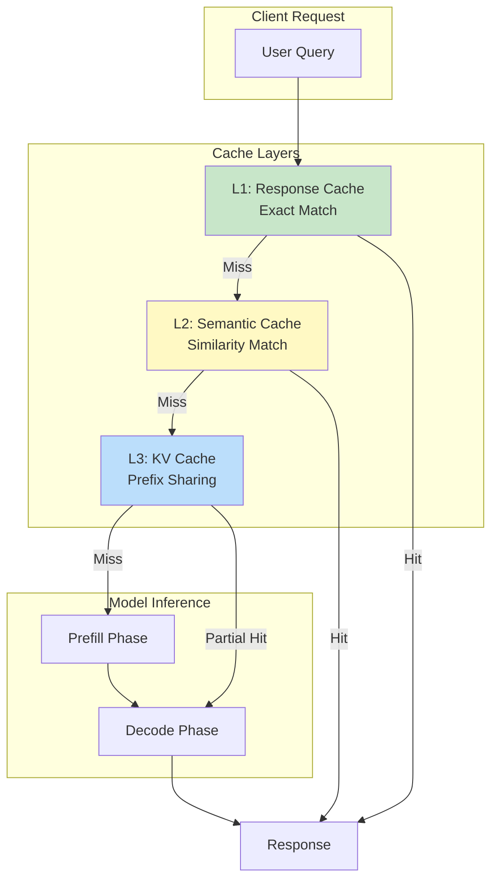
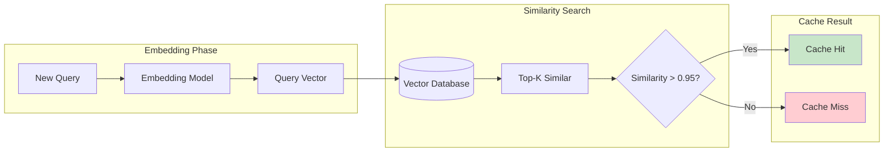

# Caching Strategies

## Learning Objectives

- **Implement** semantic caching using embedding similarity for intelligent cache lookups
- **Configure** KV-cache sharing to reduce redundant computation across requests
- **Design** prompt caching strategies for multi-turn conversations and common prefixes
- **Evaluate** cache effectiveness using hit rates, latency savings, and cost metrics
- **Balance** cache freshness, memory usage, and consistency requirements

## Introduction

Caching is one of the most effective optimizations for LLM workloads. Unlike traditional web caching, LLM caching must handle semantic similarity (similar queries should return cached results) and expensive intermediate computations (KV-cache). A well-designed caching strategy can reduce costs by 30-50% and latency by 50-80% for common workloads.

::: info Why LLM Caching is Different
Traditional caching uses exact key matching. LLM workloads require:
1. **Semantic matching**: "What's the weather?" and "How's the weather today?" are equivalent
2. **Partial matching**: Shared prompt prefixes should reuse cached KV states
3. **Stateful caching**: Multi-turn conversations build on previous context
:::

## Caching Architecture Overview



## Semantic Caching

Semantic caching returns cached responses for queries that are semantically similar to previously seen queries.



### Semantic Cache Implementation

```python
# semantic_cache.py - Production semantic cache
import numpy as np
from typing import Optional, Dict, Any, List
from dataclasses import dataclass, field
from datetime import datetime, timedelta
import hashlib
import json

@dataclass
class CacheEntry:
    query: str
    response: str
    embedding: np.ndarray
    metadata: Dict[str, Any]
    created_at: datetime = field(default_factory=datetime.now)
    hit_count: int = 0
    last_accessed: datetime = field(default_factory=datetime.now)

class SemanticCache:
    """Semantic cache with embedding-based similarity matching."""

    def __init__(
        self,
        embedding_model: str = "text-embedding-3-small",
        similarity_threshold: float = 0.95,
        max_entries: int = 10000,
        ttl_hours: int = 24,
    ):
        self.embedding_model = embedding_model
        self.similarity_threshold = similarity_threshold
        self.max_entries = max_entries
        self.ttl = timedelta(hours=ttl_hours)

        # In production, use a vector database (Pinecone, Qdrant, etc.)
        self.cache: Dict[str, CacheEntry] = {}
        self.embeddings_matrix: Optional[np.ndarray] = None
        self.entry_ids: List[str] = []

        # Metrics
        self.hits = 0
        self.misses = 0

    def _get_embedding(self, text: str) -> np.ndarray:
        """Get embedding for text using embedding model."""
        # In production, call actual embedding API
        # Here using a placeholder
        from openai import OpenAI
        client = OpenAI()

        response = client.embeddings.create(
            model=self.embedding_model,
            input=text,
        )
        return np.array(response.data[0].embedding)

    def _compute_similarity(
        self,
        query_embedding: np.ndarray,
    ) -> tuple[Optional[str], float]:
        """Find most similar cached entry."""
        if self.embeddings_matrix is None or len(self.entry_ids) == 0:
            return None, 0.0

        # Cosine similarity
        query_norm = query_embedding / np.linalg.norm(query_embedding)
        similarities = np.dot(self.embeddings_matrix, query_norm)

        max_idx = np.argmax(similarities)
        max_similarity = similarities[max_idx]

        if max_similarity >= self.similarity_threshold:
            return self.entry_ids[max_idx], max_similarity

        return None, max_similarity

    def _generate_key(self, query: str) -> str:
        """Generate cache key from query."""
        return hashlib.sha256(query.encode()).hexdigest()[:16]

    def get(
        self,
        query: str,
        metadata_filter: Optional[Dict] = None,
    ) -> Optional[Dict[str, Any]]:
        """Look up query in semantic cache."""
        # First try exact match
        exact_key = self._generate_key(query)
        if exact_key in self.cache:
            entry = self.cache[exact_key]
            if datetime.now() - entry.created_at < self.ttl:
                entry.hit_count += 1
                entry.last_accessed = datetime.now()
                self.hits += 1
                return {
                    "response": entry.response,
                    "cache_type": "exact",
                    "similarity": 1.0,
                    "metadata": entry.metadata,
                }

        # Semantic similarity search
        query_embedding = self._get_embedding(query)
        matched_id, similarity = self._compute_similarity(query_embedding)

        if matched_id and matched_id in self.cache:
            entry = self.cache[matched_id]

            # Apply metadata filter if provided
            if metadata_filter:
                for key, value in metadata_filter.items():
                    if entry.metadata.get(key) != value:
                        self.misses += 1
                        return None

            # Check TTL
            if datetime.now() - entry.created_at >= self.ttl:
                self.misses += 1
                return None

            entry.hit_count += 1
            entry.last_accessed = datetime.now()
            self.hits += 1

            return {
                "response": entry.response,
                "cache_type": "semantic",
                "similarity": float(similarity),
                "original_query": entry.query,
                "metadata": entry.metadata,
            }

        self.misses += 1
        return None

    def set(
        self,
        query: str,
        response: str,
        metadata: Optional[Dict] = None,
    ) -> str:
        """Store query-response pair in cache."""
        # Evict if at capacity
        if len(self.cache) >= self.max_entries:
            self._evict_lru()

        key = self._generate_key(query)
        embedding = self._get_embedding(query)

        entry = CacheEntry(
            query=query,
            response=response,
            embedding=embedding,
            metadata=metadata or {},
        )

        self.cache[key] = entry
        self.entry_ids.append(key)

        # Update embeddings matrix
        if self.embeddings_matrix is None:
            self.embeddings_matrix = embedding.reshape(1, -1)
        else:
            normalized = embedding / np.linalg.norm(embedding)
            self.embeddings_matrix = np.vstack([
                self.embeddings_matrix,
                normalized,
            ])

        return key

    def _evict_lru(self, count: int = 100):
        """Evict least recently used entries."""
        # Sort by last accessed time
        sorted_entries = sorted(
            self.cache.items(),
            key=lambda x: x[1].last_accessed,
        )

        for key, _ in sorted_entries[:count]:
            del self.cache[key]
            idx = self.entry_ids.index(key)
            self.entry_ids.pop(idx)
            self.embeddings_matrix = np.delete(
                self.embeddings_matrix, idx, axis=0
            )

    def get_stats(self) -> Dict[str, Any]:
        """Get cache statistics."""
        total = self.hits + self.misses
        return {
            "total_entries": len(self.cache),
            "hits": self.hits,
            "misses": self.misses,
            "hit_rate": self.hits / total if total > 0 else 0,
            "avg_hit_count": np.mean([
                e.hit_count for e in self.cache.values()
            ]) if self.cache else 0,
        }

    def invalidate(
        self,
        query: Optional[str] = None,
        metadata_filter: Optional[Dict] = None,
    ):
        """Invalidate cache entries."""
        if query:
            key = self._generate_key(query)
            if key in self.cache:
                del self.cache[key]
                idx = self.entry_ids.index(key)
                self.entry_ids.pop(idx)
                self.embeddings_matrix = np.delete(
                    self.embeddings_matrix, idx, axis=0
                )
        elif metadata_filter:
            # Invalidate all matching metadata
            keys_to_remove = []
            for key, entry in self.cache.items():
                match = all(
                    entry.metadata.get(k) == v
                    for k, v in metadata_filter.items()
                )
                if match:
                    keys_to_remove.append(key)

            for key in keys_to_remove:
                self.invalidate(query=key)
```

### Redis-based Semantic Cache

```python
# redis_semantic_cache.py - Production-ready Redis implementation
import redis
import json
import numpy as np
from typing import Optional, Dict, Any
import hashlib

class RedisSemanticCache:
    """Redis-backed semantic cache with vector similarity."""

    def __init__(
        self,
        redis_url: str = "redis://localhost:6379",
        index_name: str = "llm_cache",
        similarity_threshold: float = 0.95,
        ttl_seconds: int = 86400,
    ):
        self.redis = redis.from_url(redis_url)
        self.index_name = index_name
        self.similarity_threshold = similarity_threshold
        self.ttl = ttl_seconds

        # Create RediSearch index if not exists
        self._create_index()

    def _create_index(self):
        """Create RediSearch vector index."""
        try:
            self.redis.execute_command(
                "FT.CREATE", self.index_name,
                "ON", "HASH",
                "PREFIX", "1", "cache:",
                "SCHEMA",
                "query", "TEXT",
                "response", "TEXT",
                "embedding", "VECTOR", "FLAT", "6",
                    "TYPE", "FLOAT32",
                    "DIM", "1536",  # OpenAI embedding dimension
                    "DISTANCE_METRIC", "COSINE",
                "metadata", "TEXT",
                "created_at", "NUMERIC", "SORTABLE",
            )
        except redis.ResponseError as e:
            if "Index already exists" not in str(e):
                raise

    def _get_embedding(self, text: str) -> np.ndarray:
        """Get embedding for text."""
        from openai import OpenAI
        client = OpenAI()

        response = client.embeddings.create(
            model="text-embedding-3-small",
            input=text,
        )
        return np.array(response.data[0].embedding, dtype=np.float32)

    def get(self, query: str) -> Optional[Dict[str, Any]]:
        """Search for similar cached entry."""
        query_embedding = self._get_embedding(query)

        # Vector similarity search
        result = self.redis.execute_command(
            "FT.SEARCH", self.index_name,
            f"*=>[KNN 1 @embedding $vec AS score]",
            "PARAMS", "2", "vec", query_embedding.tobytes(),
            "RETURN", "4", "query", "response", "metadata", "score",
            "DIALECT", "2",
        )

        if result[0] == 0:
            return None

        # Parse result
        doc = result[2]
        score = float(doc[doc.index(b"score") + 1])
        similarity = 1 - score  # Convert distance to similarity

        if similarity < self.similarity_threshold:
            return None

        return {
            "response": doc[doc.index(b"response") + 1].decode(),
            "original_query": doc[doc.index(b"query") + 1].decode(),
            "similarity": similarity,
            "metadata": json.loads(
                doc[doc.index(b"metadata") + 1].decode()
            ),
        }

    def set(
        self,
        query: str,
        response: str,
        metadata: Optional[Dict] = None,
    ):
        """Store query-response in cache."""
        key = f"cache:{hashlib.sha256(query.encode()).hexdigest()[:16]}"
        embedding = self._get_embedding(query)

        self.redis.hset(
            key,
            mapping={
                "query": query,
                "response": response,
                "embedding": embedding.tobytes(),
                "metadata": json.dumps(metadata or {}),
                "created_at": int(datetime.now().timestamp()),
            },
        )
        self.redis.expire(key, self.ttl)
```

## KV-Cache Sharing

KV-cache stores the key and value matrices from attention computation. Sharing KV-cache across requests with common prefixes dramatically reduces computation.

```mermaid
flowchart TB
    subgraph SharedPrefix["Shared System Prompt KV-Cache"]
        SP[System Prompt<br/>"You are a helpful assistant..."]
        KV1[Cached KV States<br/>Layers 1-N]
    end

    subgraph Request1["Request 1"]
        U1[User: "What is Python?"]
        Compute1[Compute New KV<br/>for User Message Only]
    end

    subgraph Request2["Request 2"]
        U2[User: "Explain JavaScript"]
        Compute2[Compute New KV<br/>for User Message Only]
    end

    SP --> KV1
    KV1 --> Request1
    KV1 --> Request2

    style SharedPrefix fill:#c8e6c9
    style Request1 fill:#bbdefb
    style Request2 fill:#fff9c4
```

### KV-Cache Sharing Implementation

```python
# kv_cache_sharing.py - KV-cache sharing for common prefixes
from dataclasses import dataclass
from typing import Dict, List, Optional, Tuple
import torch
import hashlib
from collections import OrderedDict

@dataclass
class KVCacheEntry:
    """Cached KV states for a prompt prefix."""
    prefix: str
    kv_cache: List[Tuple[torch.Tensor, torch.Tensor]]  # [(K, V)] per layer
    token_count: int
    created_at: float
    access_count: int = 0

class KVCacheManager:
    """Manage KV-cache sharing across requests."""

    def __init__(
        self,
        max_cache_size_gb: float = 10.0,
        min_prefix_tokens: int = 100,
    ):
        self.max_cache_bytes = int(max_cache_size_gb * 1024**3)
        self.min_prefix_tokens = min_prefix_tokens

        # LRU cache for KV states
        self.cache: OrderedDict[str, KVCacheEntry] = OrderedDict()
        self.current_size_bytes = 0

    def _compute_prefix_key(self, prefix: str) -> str:
        """Generate cache key for prefix."""
        return hashlib.sha256(prefix.encode()).hexdigest()

    def _estimate_kv_size(
        self,
        kv_cache: List[Tuple[torch.Tensor, torch.Tensor]],
    ) -> int:
        """Estimate memory size of KV cache."""
        total = 0
        for k, v in kv_cache:
            total += k.numel() * k.element_size()
            total += v.numel() * v.element_size()
        return total

    def find_longest_prefix_match(
        self,
        prompt: str,
    ) -> Optional[Tuple[str, KVCacheEntry]]:
        """Find the longest cached prefix matching the prompt."""
        best_match = None
        best_length = 0

        for key, entry in self.cache.items():
            if prompt.startswith(entry.prefix):
                if len(entry.prefix) > best_length:
                    best_match = (key, entry)
                    best_length = len(entry.prefix)

        return best_match

    def get_kv_cache(
        self,
        prompt: str,
    ) -> Optional[Tuple[List[Tuple[torch.Tensor, torch.Tensor]], int]]:
        """Get cached KV states for prompt prefix."""
        match = self.find_longest_prefix_match(prompt)

        if match is None:
            return None

        key, entry = match
        entry.access_count += 1

        # Move to end (most recently used)
        self.cache.move_to_end(key)

        return entry.kv_cache, entry.token_count

    def store_kv_cache(
        self,
        prefix: str,
        kv_cache: List[Tuple[torch.Tensor, torch.Tensor]],
        token_count: int,
    ):
        """Store KV cache for prefix."""
        # Skip short prefixes
        if token_count < self.min_prefix_tokens:
            return

        key = self._compute_prefix_key(prefix)

        # Check if already cached
        if key in self.cache:
            self.cache.move_to_end(key)
            return

        # Estimate size
        kv_size = self._estimate_kv_size(kv_cache)

        # Evict if necessary
        while (
            self.current_size_bytes + kv_size > self.max_cache_bytes
            and len(self.cache) > 0
        ):
            self._evict_lru()

        # Store new entry
        import time
        entry = KVCacheEntry(
            prefix=prefix,
            kv_cache=kv_cache,
            token_count=token_count,
            created_at=time.time(),
        )

        self.cache[key] = entry
        self.current_size_bytes += kv_size

    def _evict_lru(self):
        """Evict least recently used entry."""
        if not self.cache:
            return

        key, entry = self.cache.popitem(last=False)
        evicted_size = self._estimate_kv_size(entry.kv_cache)
        self.current_size_bytes -= evicted_size

    def precompute_system_prompts(
        self,
        model,
        system_prompts: List[str],
    ):
        """Pre-compute and cache KV states for common system prompts."""
        for prompt in system_prompts:
            # Tokenize and run forward pass
            inputs = model.tokenizer(prompt, return_tensors="pt")

            with torch.no_grad():
                outputs = model(
                    inputs.input_ids,
                    use_cache=True,
                    return_dict=True,
                )

            # Extract KV cache
            kv_cache = [
                (layer[0].clone(), layer[1].clone())
                for layer in outputs.past_key_values
            ]

            # Store in cache
            self.store_kv_cache(
                prefix=prompt,
                kv_cache=kv_cache,
                token_count=inputs.input_ids.shape[1],
            )

    def get_stats(self) -> Dict:
        """Get cache statistics."""
        return {
            "entries": len(self.cache),
            "size_gb": self.current_size_bytes / (1024**3),
            "max_size_gb": self.max_cache_bytes / (1024**3),
            "utilization": self.current_size_bytes / self.max_cache_bytes,
            "total_accesses": sum(e.access_count for e in self.cache.values()),
        }
```

## Prompt Caching (API-level)

Many LLM providers now offer prompt caching for multi-turn conversations.

```python
# prompt_caching.py - Prompt caching for conversations
from dataclasses import dataclass, field
from typing import List, Dict, Optional
import hashlib
import time

@dataclass
class ConversationTurn:
    role: str  # "system", "user", "assistant"
    content: str
    cached: bool = False
    cache_key: Optional[str] = None

@dataclass
class ConversationCache:
    """Cache for multi-turn conversation prefixes."""
    turns: List[ConversationTurn] = field(default_factory=list)
    cache_key: Optional[str] = None
    created_at: float = field(default_factory=time.time)

class PromptCacheManager:
    """Manage prompt caching for conversations."""

    def __init__(self, cache_prefix_tokens: int = 1024):
        self.cache_prefix_tokens = cache_prefix_tokens
        self.conversations: Dict[str, ConversationCache] = {}

    def _compute_cache_key(self, turns: List[ConversationTurn]) -> str:
        """Compute cache key for conversation prefix."""
        content = "|".join(
            f"{t.role}:{t.content}" for t in turns
        )
        return hashlib.sha256(content.encode()).hexdigest()[:32]

    def prepare_request(
        self,
        conversation_id: str,
        messages: List[Dict[str, str]],
    ) -> Dict:
        """Prepare API request with caching headers."""
        # Convert to turns
        turns = [
            ConversationTurn(role=m["role"], content=m["content"])
            for m in messages
        ]

        # Check for existing conversation cache
        if conversation_id in self.conversations:
            cached_conv = self.conversations[conversation_id]

            # Find common prefix
            common_length = 0
            for i, (cached, new) in enumerate(
                zip(cached_conv.turns, turns)
            ):
                if (
                    cached.role == new.role
                    and cached.content == new.content
                ):
                    common_length = i + 1
                else:
                    break

            if common_length > 0:
                # Mark cached turns
                for i in range(common_length):
                    turns[i].cached = True
                    turns[i].cache_key = cached_conv.cache_key

        # Update conversation cache
        self.conversations[conversation_id] = ConversationCache(
            turns=turns,
            cache_key=self._compute_cache_key(turns),
        )

        # Build request with cache hints
        return {
            "messages": messages,
            "cache_control": {
                "type": "ephemeral",
                "breakpoints": [
                    i for i, t in enumerate(turns) if t.cached
                ],
            },
        }

    def estimate_savings(
        self,
        conversation_id: str,
        avg_tokens_per_turn: int = 200,
    ) -> Dict:
        """Estimate cost savings from caching."""
        if conversation_id not in self.conversations:
            return {"cached_tokens": 0, "savings_percent": 0}

        conv = self.conversations[conversation_id]
        cached_turns = sum(1 for t in conv.turns if t.cached)
        total_turns = len(conv.turns)

        cached_tokens = cached_turns * avg_tokens_per_turn
        total_tokens = total_turns * avg_tokens_per_turn

        return {
            "cached_turns": cached_turns,
            "total_turns": total_turns,
            "cached_tokens": cached_tokens,
            "total_tokens": total_tokens,
            "savings_percent": (
                cached_tokens / total_tokens * 100 if total_tokens > 0 else 0
            ),
        }

# Anthropic API prompt caching example
def anthropic_cached_request(messages: List[Dict]) -> Dict:
    """Example of Anthropic's prompt caching API."""
    return {
        "model": "claude-3-sonnet-20240229",
        "max_tokens": 1024,
        "system": [
            {
                "type": "text",
                "text": "You are a helpful AI assistant.",
                "cache_control": {"type": "ephemeral"},  # Cache this
            }
        ],
        "messages": messages,
    }
```

## Cache Effectiveness Metrics

```python
# cache_metrics.py - Comprehensive cache metrics
from dataclasses import dataclass, field
from typing import Dict, List
from datetime import datetime, timedelta
from collections import defaultdict

@dataclass
class CacheMetrics:
    """Track cache performance metrics."""

    # Counters
    total_requests: int = 0
    cache_hits: int = 0
    cache_misses: int = 0
    semantic_hits: int = 0
    exact_hits: int = 0
    kv_cache_hits: int = 0

    # Latency
    latency_with_cache: List[float] = field(default_factory=list)
    latency_without_cache: List[float] = field(default_factory=list)

    # Cost
    tokens_saved: int = 0
    estimated_cost_saved: float = 0.0

    # Time series (for dashboards)
    hourly_stats: Dict[str, Dict] = field(default_factory=lambda: defaultdict(dict))

    def record_request(
        self,
        cache_hit: bool,
        cache_type: str,  # "exact", "semantic", "kv", "miss"
        latency_ms: float,
        tokens_saved: int = 0,
        cost_saved: float = 0.0,
    ):
        """Record a cache request."""
        self.total_requests += 1
        hour_key = datetime.now().strftime("%Y-%m-%d-%H")

        if cache_hit:
            self.cache_hits += 1
            self.latency_with_cache.append(latency_ms)
            self.tokens_saved += tokens_saved
            self.estimated_cost_saved += cost_saved

            if cache_type == "exact":
                self.exact_hits += 1
            elif cache_type == "semantic":
                self.semantic_hits += 1
            elif cache_type == "kv":
                self.kv_cache_hits += 1
        else:
            self.cache_misses += 1
            self.latency_without_cache.append(latency_ms)

        # Update hourly stats
        if hour_key not in self.hourly_stats:
            self.hourly_stats[hour_key] = {
                "hits": 0, "misses": 0, "latency_sum": 0
            }
        self.hourly_stats[hour_key]["hits" if cache_hit else "misses"] += 1
        self.hourly_stats[hour_key]["latency_sum"] += latency_ms

    def get_summary(self) -> Dict:
        """Get comprehensive metrics summary."""
        total = self.cache_hits + self.cache_misses

        avg_latency_cached = (
            sum(self.latency_with_cache) / len(self.latency_with_cache)
            if self.latency_with_cache else 0
        )
        avg_latency_uncached = (
            sum(self.latency_without_cache) / len(self.latency_without_cache)
            if self.latency_without_cache else 0
        )

        return {
            "hit_rate": self.cache_hits / total if total > 0 else 0,
            "hit_rate_by_type": {
                "exact": self.exact_hits / total if total > 0 else 0,
                "semantic": self.semantic_hits / total if total > 0 else 0,
                "kv_cache": self.kv_cache_hits / total if total > 0 else 0,
            },
            "latency_improvement": {
                "cached_ms": round(avg_latency_cached, 2),
                "uncached_ms": round(avg_latency_uncached, 2),
                "speedup": round(
                    avg_latency_uncached / avg_latency_cached
                    if avg_latency_cached > 0 else 0, 2
                ),
            },
            "cost_savings": {
                "tokens_saved": self.tokens_saved,
                "estimated_cost_saved": round(self.estimated_cost_saved, 2),
            },
            "total_requests": total,
        }

    def get_hourly_trend(self, hours: int = 24) -> List[Dict]:
        """Get hourly hit rate trend."""
        now = datetime.now()
        trend = []

        for i in range(hours):
            hour = now - timedelta(hours=i)
            hour_key = hour.strftime("%Y-%m-%d-%H")

            if hour_key in self.hourly_stats:
                stats = self.hourly_stats[hour_key]
                total = stats["hits"] + stats["misses"]
                hit_rate = stats["hits"] / total if total > 0 else 0
            else:
                total = 0
                hit_rate = 0

            trend.append({
                "hour": hour_key,
                "hit_rate": round(hit_rate, 3),
                "requests": total,
            })

        return list(reversed(trend))
```

## Interview Q&A

### Question 1: How would you design a semantic cache for an LLM application with 1M daily queries?

**Strong Answer:**
For a high-volume semantic cache, I'd design a multi-tier architecture:

**Architecture:**
```
Query -> Exact Match (Redis) -> Semantic Search (Vector DB) -> LLM
```

**Tier 1: Exact Match Cache (Redis)**
- Hash-based lookup for identical queries
- Sub-millisecond latency
- Expected hit rate: 10-20%
- TTL: 24 hours

**Tier 2: Semantic Cache (Vector Database)**
- Embedding-based similarity search
- Use Pinecone/Qdrant for scale
- Similarity threshold: 0.95 (tune based on use case)
- Expected hit rate: 20-40%
- Index size: ~1.5GB for 1M entries (1536-dim embeddings)

**Key Design Decisions:**

1. **Embedding Model**: Use a fast model (text-embedding-3-small) - we're trading minor quality for latency
2. **Similarity Threshold**: Start at 0.95, monitor for false positives/negatives
3. **Cache Invalidation**: Time-based TTL + event-based for data updates
4. **Metadata Filtering**: Support user_id, tenant_id for multi-tenant scenarios

**Cost Analysis:**
- 1M queries/day = 11.5 QPS average
- At 40% cache hit rate: 400K queries avoid LLM
- Savings: ~$4,000/day at $10/1M tokens

**Monitoring:**
- Hit rate by cache tier
- Similarity score distribution
- False positive rate (user feedback)
- Cache size and eviction rate

### Question 2: Explain KV-cache sharing and when it's most effective.

**Strong Answer:**
KV-cache stores the key and value matrices computed during attention. Sharing this cache across requests avoids redundant computation.

**How it works:**
1. During prefill, model computes K and V for each token at each layer
2. These KV states are stored in GPU memory
3. For requests sharing a prefix (e.g., system prompt), KV states can be reused
4. Only the unique suffix tokens need new KV computation

**When it's most effective:**

1. **System Prompts**: Same system prompt across all requests
   - Example: "You are a helpful assistant specialized in..."
   - Savings: 100-500 tokens per request

2. **Few-Shot Examples**: RAG systems with common examples
   - Same examples prepended to different queries
   - Savings: 500-2000 tokens per request

3. **Multi-Turn Conversations**: Previous turns are shared prefix
   - User query builds on conversation history
   - Savings: Grows with conversation length

4. **Batch Processing**: Similar documents with common header
   - Contract analysis with same preamble
   - Savings: Proportional to shared content

**Limitations:**
- Memory overhead: Must store KV states
- Prefix must be exact match (no semantic matching)
- Not effective for highly diverse prompts
- GPU memory becomes bottleneck at scale

**Implementation considerations:**
- Pre-warm popular system prompts at startup
- Use PagedAttention (vLLM) for efficient memory management
- Monitor cache utilization and eviction rates

### Question 3: How do you balance cache hit rate against cache freshness for an LLM application?

**Strong Answer:**
Balancing hit rate and freshness requires understanding the application's tolerance for stale data and implementing appropriate invalidation strategies.

**Framework for decision making:**

| Factor | Favor High Hit Rate | Favor Freshness |
|--------|--------------------|--------------------|
| Query type | Factual, static info | Real-time, dynamic data |
| User expectation | General knowledge | Current information |
| Data volatility | Low (concepts, definitions) | High (prices, news) |
| Cost sensitivity | High | Low |

**Strategies I'd implement:**

1. **TTL-based expiration with smart defaults:**
   - Static content (documentation): 7 days
   - Semi-dynamic (product info): 24 hours
   - Dynamic (news, prices): 1 hour or disable
   - Use query classification to set appropriate TTL

2. **Event-driven invalidation:**
   - Subscribe to data update events
   - Invalidate cache entries matching updated entities
   - Example: Product price change -> invalidate all queries mentioning that product

3. **Freshness indicators:**
   - Return cache timestamp with response
   - Let client decide if refresh needed
   - Support "force refresh" flag for critical queries

4. **Hybrid approach:**
   - Cache the reasoning/format, fetch fresh data
   - Example: Cache "how to format financial summary" but fetch current numbers

5. **A/B testing for threshold tuning:**
   - Test different TTLs and similarity thresholds
   - Measure user satisfaction and correction rates
   - Optimize based on actual user behavior

**Monitoring:**
- Track stale cache hits (responses needing correction)
- User feedback correlation with cache age
- Cache refresh rate vs hit rate trade-off

## Summary

| Cache Type | Hit Rate | Latency Savings | Cost Savings | Complexity |
|------------|----------|-----------------|--------------|------------|
| **Exact Match** | 10-20% | 95%+ | 95%+ | Low |
| **Semantic** | 20-40% | 90%+ | 90%+ | Medium |
| **KV-Cache** | 30-70% | 30-70% | 30-70% | Medium |
| **Prompt Cache (API)** | 40-80% | 20-50% | 50-80% | Low |

## Sources

- [GPTCache: Semantic Caching for LLMs](https://github.com/zilliztech/GPTCache)
- [vLLM PagedAttention Paper](https://arxiv.org/abs/2309.06180)
- [Anthropic Prompt Caching](https://docs.anthropic.com/claude/docs/prompt-caching)
- [Redis Vector Similarity Search](https://redis.io/docs/stack/search/reference/vectors/)
- [Pinecone Vector Database](https://www.pinecone.io/)
- [LangChain Caching Guide](https://python.langchain.com/docs/modules/model_io/llms/llm_caching)
