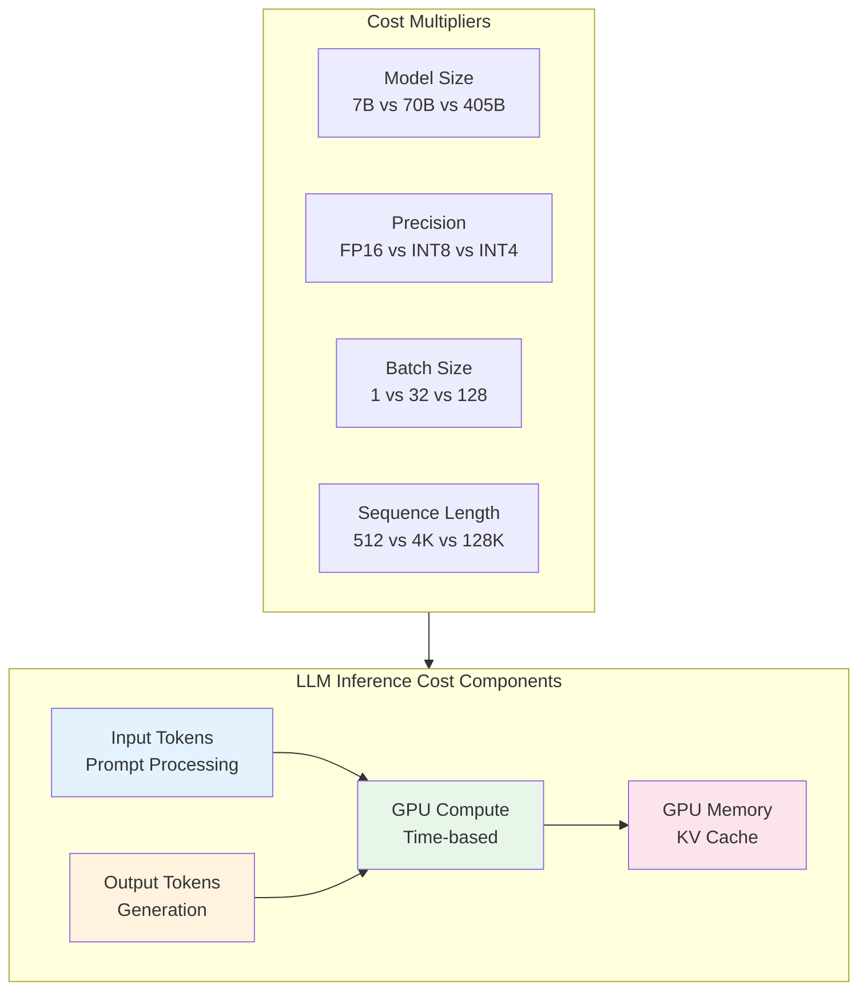
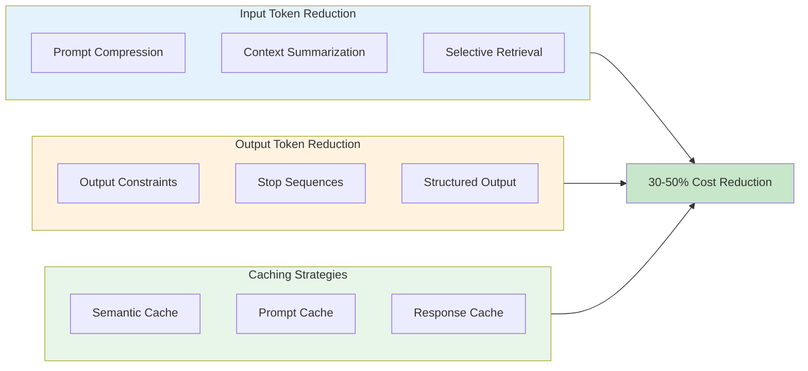

# Cost Optimization

## Learning Objectives

- **Calculate** the true cost of LLM inference including all components
- **Apply** token optimization strategies to reduce input and output costs
- **Implement** intelligent caching to minimize redundant computations
- **Select** appropriate models based on cost-performance trade-offs
- **Design** batch processing pipelines for cost-efficient offline workloads

## Introduction

LLM inference costs can quickly become the largest line item in ML infrastructure budgets. Unlike traditional ML models where compute costs are relatively fixed per request, LLM costs scale with token counts, making optimization critical for sustainable operations.

::: info Cost Reality Check
A single A100 GPU costs ~$3-5/hour in the cloud. Running a 70B parameter model at 1000 requests/hour might seem efficient, but without optimization, costs can reach $100K+/month. Understanding and optimizing these costs is essential.
:::

## Token Economics



### Understanding Token Costs

```python
# cost_calculator.py - LLM inference cost calculator
from dataclasses import dataclass
from typing import Optional
import math

@dataclass
class ModelPricing:
    """Pricing per 1M tokens (example based on typical API pricing)."""
    name: str
    input_cost_per_1m: float
    output_cost_per_1m: float
    context_window: int

# Example pricing (approximate, varies by provider)
PRICING_MODELS = {
    "gpt-4-turbo": ModelPricing("GPT-4 Turbo", 10.00, 30.00, 128000),
    "gpt-4o": ModelPricing("GPT-4o", 2.50, 10.00, 128000),
    "claude-3-opus": ModelPricing("Claude 3 Opus", 15.00, 75.00, 200000),
    "claude-3-sonnet": ModelPricing("Claude 3 Sonnet", 3.00, 15.00, 200000),
    "llama-3-70b": ModelPricing("Llama 3 70B (self-hosted)", 0.80, 0.80, 8192),
    "llama-3-8b": ModelPricing("Llama 3 8B (self-hosted)", 0.10, 0.10, 8192),
    "mixtral-8x7b": ModelPricing("Mixtral 8x7B", 0.50, 0.50, 32768),
}

def calculate_request_cost(
    model: str,
    input_tokens: int,
    output_tokens: int,
) -> dict:
    """Calculate cost for a single request."""
    pricing = PRICING_MODELS[model]

    input_cost = (input_tokens / 1_000_000) * pricing.input_cost_per_1m
    output_cost = (output_tokens / 1_000_000) * pricing.output_cost_per_1m
    total_cost = input_cost + output_cost

    return {
        "model": pricing.name,
        "input_tokens": input_tokens,
        "output_tokens": output_tokens,
        "input_cost": round(input_cost, 6),
        "output_cost": round(output_cost, 6),
        "total_cost": round(total_cost, 6),
    }

def calculate_monthly_cost(
    model: str,
    requests_per_day: int,
    avg_input_tokens: int,
    avg_output_tokens: int,
) -> dict:
    """Calculate estimated monthly costs."""
    daily_cost = calculate_request_cost(model, avg_input_tokens, avg_output_tokens)
    daily_total = daily_cost["total_cost"] * requests_per_day
    monthly_total = daily_total * 30

    return {
        "model": model,
        "requests_per_day": requests_per_day,
        "daily_cost": round(daily_total, 2),
        "monthly_cost": round(monthly_total, 2),
        "annual_cost": round(monthly_total * 12, 2),
    }

# Cost comparison example
def compare_models(
    input_tokens: int,
    output_tokens: int,
    requests_per_month: int,
) -> list:
    """Compare costs across different models."""
    comparisons = []
    for model_id in PRICING_MODELS:
        cost = calculate_request_cost(model_id, input_tokens, output_tokens)
        monthly = cost["total_cost"] * requests_per_month
        comparisons.append({
            "model": PRICING_MODELS[model_id].name,
            "cost_per_request": cost["total_cost"],
            "monthly_cost": round(monthly, 2),
        })

    return sorted(comparisons, key=lambda x: x["monthly_cost"])
```

### Self-Hosted vs API Cost Analysis

```python
# self_hosted_cost.py - Self-hosted infrastructure cost calculator
from dataclasses import dataclass
from typing import List

@dataclass
class GPUInstance:
    name: str
    gpu_type: str
    num_gpus: int
    hourly_cost: float
    tokens_per_second: int  # Approximate throughput

# Common cloud GPU configurations
GPU_INSTANCES = {
    "a100_40gb_1x": GPUInstance("1x A100 40GB", "A100-40GB", 1, 3.50, 50),
    "a100_80gb_1x": GPUInstance("1x A100 80GB", "A100-80GB", 1, 5.00, 60),
    "a100_80gb_4x": GPUInstance("4x A100 80GB", "A100-80GB", 4, 20.00, 200),
    "a100_80gb_8x": GPUInstance("8x A100 80GB", "A100-80GB", 8, 40.00, 350),
    "h100_80gb_1x": GPUInstance("1x H100 80GB", "H100-80GB", 1, 8.00, 100),
    "h100_80gb_8x": GPUInstance("8x H100 80GB", "H100-80GB", 8, 64.00, 700),
}

def calculate_self_hosted_cost(
    instance: str,
    monthly_tokens: int,
    utilization: float = 0.7,  # Realistic utilization
) -> dict:
    """Calculate self-hosted costs vs API costs."""
    config = GPU_INSTANCES[instance]

    # Calculate required hours
    tokens_per_hour = config.tokens_per_second * 3600 * utilization
    required_hours = monthly_tokens / tokens_per_hour

    # Infrastructure costs
    compute_cost = required_hours * config.hourly_cost

    # Add overhead costs (networking, storage, ops)
    overhead_multiplier = 1.3  # 30% overhead
    total_cost = compute_cost * overhead_multiplier

    # Cost per 1M tokens
    cost_per_1m = (total_cost / monthly_tokens) * 1_000_000

    return {
        "instance": config.name,
        "monthly_tokens": monthly_tokens,
        "required_hours": round(required_hours, 1),
        "compute_cost": round(compute_cost, 2),
        "total_cost_with_overhead": round(total_cost, 2),
        "cost_per_1m_tokens": round(cost_per_1m, 4),
    }

def breakeven_analysis(
    api_cost_per_1m: float,
    instance: str,
    fixed_monthly_cost: float = 0,
) -> dict:
    """Find break-even point for self-hosting vs API."""
    config = GPU_INSTANCES[instance]

    # Self-hosted cost components
    monthly_compute = config.hourly_cost * 24 * 30  # Full month
    overhead = monthly_compute * 0.3
    total_fixed = monthly_compute + overhead + fixed_monthly_cost

    # Tokens generated at full utilization
    monthly_tokens = config.tokens_per_second * 3600 * 24 * 30 * 0.7
    self_hosted_per_1m = (total_fixed / monthly_tokens) * 1_000_000

    # Break-even calculation
    if api_cost_per_1m > self_hosted_per_1m:
        breakeven_tokens = total_fixed / (api_cost_per_1m / 1_000_000)
    else:
        breakeven_tokens = float('inf')  # Never breaks even

    return {
        "api_cost_per_1m": api_cost_per_1m,
        "self_hosted_cost_per_1m": round(self_hosted_per_1m, 4),
        "monthly_fixed_cost": round(total_fixed, 2),
        "breakeven_tokens_per_month": round(breakeven_tokens, 0),
        "recommendation": "self-host" if breakeven_tokens < monthly_tokens else "use API",
    }
```

## Token Optimization Strategies



### Prompt Compression Techniques

```python
# prompt_compression.py - Techniques to reduce input tokens
from typing import List, Dict
import tiktoken

class PromptOptimizer:
    def __init__(self, model: str = "gpt-4"):
        self.encoding = tiktoken.encoding_for_model(model)

    def count_tokens(self, text: str) -> int:
        """Count tokens in text."""
        return len(self.encoding.encode(text))

    def compress_whitespace(self, text: str) -> str:
        """Remove unnecessary whitespace."""
        import re
        # Remove multiple spaces
        text = re.sub(r' +', ' ', text)
        # Remove multiple newlines
        text = re.sub(r'\n+', '\n', text)
        return text.strip()

    def abbreviate_common_phrases(self, text: str) -> str:
        """Replace common verbose phrases with shorter versions."""
        replacements = {
            "in order to": "to",
            "as well as": "and",
            "in the event that": "if",
            "at this point in time": "now",
            "in the process of": "while",
            "for the purpose of": "for",
            "with respect to": "regarding",
            "in accordance with": "per",
        }
        for verbose, concise in replacements.items():
            text = text.replace(verbose, concise)
        return text

    def extract_key_context(
        self,
        documents: List[str],
        query: str,
        max_tokens: int = 2000,
    ) -> str:
        """Extract most relevant context within token budget."""
        # Simple relevance scoring (in production, use embeddings)
        query_terms = set(query.lower().split())

        scored_docs = []
        for doc in documents:
            doc_terms = set(doc.lower().split())
            overlap = len(query_terms & doc_terms)
            scored_docs.append((overlap, doc))

        # Sort by relevance
        scored_docs.sort(reverse=True)

        # Build context within budget
        context_parts = []
        current_tokens = 0

        for _, doc in scored_docs:
            doc_tokens = self.count_tokens(doc)
            if current_tokens + doc_tokens <= max_tokens:
                context_parts.append(doc)
                current_tokens += doc_tokens
            else:
                # Truncate to fit
                remaining = max_tokens - current_tokens
                if remaining > 100:
                    truncated = self.truncate_to_tokens(doc, remaining)
                    context_parts.append(truncated)
                break

        return "\n\n".join(context_parts)

    def truncate_to_tokens(self, text: str, max_tokens: int) -> str:
        """Truncate text to fit within token limit."""
        tokens = self.encoding.encode(text)
        if len(tokens) <= max_tokens:
            return text
        return self.encoding.decode(tokens[:max_tokens])

    def optimize_prompt(self, prompt: str) -> Dict:
        """Apply all optimizations and report savings."""
        original_tokens = self.count_tokens(prompt)

        # Apply optimizations
        optimized = self.compress_whitespace(prompt)
        optimized = self.abbreviate_common_phrases(optimized)

        final_tokens = self.count_tokens(optimized)

        return {
            "original_tokens": original_tokens,
            "optimized_tokens": final_tokens,
            "tokens_saved": original_tokens - final_tokens,
            "percent_reduction": round(
                (1 - final_tokens / original_tokens) * 100, 1
            ),
            "optimized_prompt": optimized,
        }

# Usage example
optimizer = PromptOptimizer()
result = optimizer.optimize_prompt("""
    In order to complete this task, please analyze the following
    data as well as the associated metadata. In the event that
    you encounter any issues, please provide a detailed explanation
    with respect to the nature of the problem.
""")
```

## Model Selection Strategy

```python
# model_router.py - Intelligent model selection for cost optimization
from dataclasses import dataclass
from enum import Enum
from typing import Optional, Callable
import re

class TaskComplexity(Enum):
    SIMPLE = "simple"
    MODERATE = "moderate"
    COMPLEX = "complex"

@dataclass
class ModelConfig:
    name: str
    cost_per_1k_tokens: float
    max_context: int
    latency_ms: int
    quality_score: float  # 0-1, relative quality

class ModelRouter:
    """Route requests to appropriate model based on complexity and cost."""

    def __init__(self):
        self.models = {
            "small": ModelConfig(
                "llama-3-8b", 0.10, 8192, 50, 0.7
            ),
            "medium": ModelConfig(
                "llama-3-70b", 0.80, 8192, 200, 0.85
            ),
            "large": ModelConfig(
                "gpt-4-turbo", 10.00, 128000, 500, 0.95
            ),
        }

    def classify_complexity(self, prompt: str) -> TaskComplexity:
        """Classify task complexity based on prompt characteristics."""
        # Simple heuristics (in production, use a classifier)

        # Check for complex reasoning indicators
        complex_patterns = [
            r"analyze.*and.*compare",
            r"explain.*in detail",
            r"multi-step",
            r"comprehensive",
            r"nuanced",
            r"trade-?offs?",
        ]

        moderate_patterns = [
            r"summarize",
            r"explain",
            r"describe",
            r"list.*reasons",
        ]

        prompt_lower = prompt.lower()

        for pattern in complex_patterns:
            if re.search(pattern, prompt_lower):
                return TaskComplexity.COMPLEX

        for pattern in moderate_patterns:
            if re.search(pattern, prompt_lower):
                return TaskComplexity.MODERATE

        return TaskComplexity.SIMPLE

    def select_model(
        self,
        prompt: str,
        min_quality: float = 0.7,
        max_latency_ms: Optional[int] = None,
        max_cost_per_1k: Optional[float] = None,
    ) -> str:
        """Select optimal model based on requirements."""
        complexity = self.classify_complexity(prompt)

        # Map complexity to default model tier
        complexity_to_tier = {
            TaskComplexity.SIMPLE: "small",
            TaskComplexity.MODERATE: "medium",
            TaskComplexity.COMPLEX: "large",
        }

        # Start with default tier
        selected_tier = complexity_to_tier[complexity]

        # Apply constraints
        for tier in ["small", "medium", "large"]:
            model = self.models[tier]

            # Check quality threshold
            if model.quality_score < min_quality:
                continue

            # Check latency constraint
            if max_latency_ms and model.latency_ms > max_latency_ms:
                continue

            # Check cost constraint
            if max_cost_per_1k and model.cost_per_1k_tokens > max_cost_per_1k:
                continue

            # Return first model meeting all constraints
            if tier == selected_tier or tier > selected_tier:
                return model.name

        # Fallback to requested tier
        return self.models[selected_tier].name

    def estimate_savings(
        self,
        prompts: list[str],
        default_model: str = "large",
    ) -> dict:
        """Estimate savings from intelligent routing."""
        default_config = self.models[default_model]
        total_default_cost = 0
        total_routed_cost = 0
        routing_distribution = {"small": 0, "medium": 0, "large": 0}

        for prompt in prompts:
            # Estimate tokens (simple approximation)
            tokens = len(prompt.split()) * 1.3

            # Default cost
            total_default_cost += (tokens / 1000) * default_config.cost_per_1k_tokens

            # Routed cost
            selected = self.select_model(prompt)
            for tier, config in self.models.items():
                if config.name == selected:
                    total_routed_cost += (tokens / 1000) * config.cost_per_1k_tokens
                    routing_distribution[tier] += 1
                    break

        savings = total_default_cost - total_routed_cost
        savings_percent = (savings / total_default_cost) * 100 if total_default_cost > 0 else 0

        return {
            "default_cost": round(total_default_cost, 2),
            "routed_cost": round(total_routed_cost, 2),
            "savings": round(savings, 2),
            "savings_percent": round(savings_percent, 1),
            "routing_distribution": routing_distribution,
        }
```

## Batch Processing for Cost Efficiency

```python
# batch_processor.py - Batch processing for offline workloads
import asyncio
from dataclasses import dataclass
from typing import List, Callable, Any
from datetime import datetime, timedelta
import json

@dataclass
class BatchConfig:
    max_batch_size: int = 32
    max_wait_seconds: float = 5.0
    max_tokens_per_batch: int = 32000
    priority_levels: int = 3

class BatchProcessor:
    """Efficient batch processing for non-real-time LLM workloads."""

    def __init__(
        self,
        inference_fn: Callable,
        config: BatchConfig = BatchConfig(),
    ):
        self.inference_fn = inference_fn
        self.config = config
        self.queues = [asyncio.Queue() for _ in range(config.priority_levels)]
        self.results = {}
        self._running = False

    async def submit(
        self,
        request_id: str,
        prompt: str,
        priority: int = 1,
        **kwargs,
    ) -> str:
        """Submit request to batch queue."""
        if priority >= self.config.priority_levels:
            priority = self.config.priority_levels - 1

        await self.queues[priority].put({
            "id": request_id,
            "prompt": prompt,
            "kwargs": kwargs,
            "submitted_at": datetime.now(),
        })

        return request_id

    async def get_result(self, request_id: str, timeout: float = 60.0) -> Any:
        """Wait for and retrieve result."""
        start = datetime.now()
        while (datetime.now() - start).total_seconds() < timeout:
            if request_id in self.results:
                return self.results.pop(request_id)
            await asyncio.sleep(0.1)
        raise TimeoutError(f"Request {request_id} timed out")

    async def _process_batches(self):
        """Main batch processing loop."""
        while self._running:
            batch = []
            total_tokens = 0

            # Collect items from queues (priority order)
            deadline = datetime.now() + timedelta(
                seconds=self.config.max_wait_seconds
            )

            for queue in self.queues:
                while not queue.empty() and len(batch) < self.config.max_batch_size:
                    try:
                        item = queue.get_nowait()
                        # Estimate tokens
                        tokens = len(item["prompt"].split()) * 1.3
                        if total_tokens + tokens > self.config.max_tokens_per_batch:
                            # Put back and process current batch
                            await queue.put(item)
                            break
                        batch.append(item)
                        total_tokens += tokens
                    except asyncio.QueueEmpty:
                        break

            if batch:
                # Process batch
                try:
                    prompts = [item["prompt"] for item in batch]
                    responses = await self.inference_fn(prompts)

                    for item, response in zip(batch, responses):
                        self.results[item["id"]] = {
                            "response": response,
                            "latency_ms": (
                                datetime.now() - item["submitted_at"]
                            ).total_seconds() * 1000,
                        }
                except Exception as e:
                    for item in batch:
                        self.results[item["id"]] = {"error": str(e)}

            elif datetime.now() < deadline:
                await asyncio.sleep(0.1)

    async def start(self):
        """Start batch processor."""
        self._running = True
        asyncio.create_task(self._process_batches())

    async def stop(self):
        """Stop batch processor."""
        self._running = False

# Cost-optimized batch job runner
class BatchJobRunner:
    """Run large batch jobs during off-peak hours for cost savings."""

    def __init__(self, processor: BatchProcessor):
        self.processor = processor

    async def run_job(
        self,
        items: List[dict],
        prompt_template: str,
        off_peak_hours: tuple = (22, 6),  # 10 PM to 6 AM
    ) -> List[dict]:
        """Run batch job, optionally during off-peak hours."""
        current_hour = datetime.now().hour
        start_hour, end_hour = off_peak_hours

        # Check if we should wait for off-peak
        is_off_peak = (
            current_hour >= start_hour or current_hour < end_hour
        )

        if not is_off_peak:
            # Calculate wait time
            if current_hour < start_hour:
                wait_hours = start_hour - current_hour
            else:
                wait_hours = 24 - current_hour + start_hour
            print(f"Waiting {wait_hours} hours for off-peak pricing...")

        # Submit all jobs
        request_ids = []
        for i, item in enumerate(items):
            prompt = prompt_template.format(**item)
            request_id = f"batch_{i}_{datetime.now().timestamp()}"
            await self.processor.submit(request_id, prompt, priority=2)
            request_ids.append(request_id)

        # Collect results
        results = []
        for request_id in request_ids:
            result = await self.processor.get_result(request_id, timeout=300)
            results.append(result)

        return results
```

## Cost Monitoring and Alerting

```python
# cost_monitor.py - Real-time cost monitoring
from dataclasses import dataclass, field
from datetime import datetime, timedelta
from typing import Dict, List, Optional
from collections import defaultdict
import threading

@dataclass
class CostAlert:
    threshold_type: str  # "daily", "hourly", "per_request"
    threshold_value: float
    current_value: float
    triggered_at: datetime

@dataclass
class CostMetrics:
    total_cost: float = 0.0
    total_tokens: int = 0
    request_count: int = 0
    cost_by_model: Dict[str, float] = field(default_factory=dict)
    cost_by_hour: Dict[str, float] = field(default_factory=dict)

class CostMonitor:
    """Monitor and alert on LLM inference costs."""

    def __init__(
        self,
        daily_budget: float = 1000.0,
        hourly_budget: float = 50.0,
        per_request_limit: float = 1.0,
    ):
        self.daily_budget = daily_budget
        self.hourly_budget = hourly_budget
        self.per_request_limit = per_request_limit

        self.metrics = CostMetrics()
        self.alerts: List[CostAlert] = []
        self.lock = threading.Lock()

        # Reset daily metrics at midnight
        self._daily_reset_time = datetime.now().replace(
            hour=0, minute=0, second=0, microsecond=0
        ) + timedelta(days=1)

    def record_request(
        self,
        model: str,
        input_tokens: int,
        output_tokens: int,
        input_cost_per_1m: float,
        output_cost_per_1m: float,
    ) -> Dict:
        """Record a request and check for alerts."""
        # Calculate cost
        input_cost = (input_tokens / 1_000_000) * input_cost_per_1m
        output_cost = (output_tokens / 1_000_000) * output_cost_per_1m
        total_cost = input_cost + output_cost

        current_hour = datetime.now().strftime("%Y-%m-%d-%H")

        with self.lock:
            # Update metrics
            self.metrics.total_cost += total_cost
            self.metrics.total_tokens += input_tokens + output_tokens
            self.metrics.request_count += 1

            if model not in self.metrics.cost_by_model:
                self.metrics.cost_by_model[model] = 0
            self.metrics.cost_by_model[model] += total_cost

            if current_hour not in self.metrics.cost_by_hour:
                self.metrics.cost_by_hour[current_hour] = 0
            self.metrics.cost_by_hour[current_hour] += total_cost

            # Check alerts
            alerts_triggered = []

            # Per-request alert
            if total_cost > self.per_request_limit:
                alert = CostAlert(
                    "per_request",
                    self.per_request_limit,
                    total_cost,
                    datetime.now(),
                )
                alerts_triggered.append(alert)
                self.alerts.append(alert)

            # Hourly alert
            hourly_cost = self.metrics.cost_by_hour.get(current_hour, 0)
            if hourly_cost > self.hourly_budget:
                alert = CostAlert(
                    "hourly",
                    self.hourly_budget,
                    hourly_cost,
                    datetime.now(),
                )
                alerts_triggered.append(alert)
                self.alerts.append(alert)

            # Daily alert
            if self.metrics.total_cost > self.daily_budget:
                alert = CostAlert(
                    "daily",
                    self.daily_budget,
                    self.metrics.total_cost,
                    datetime.now(),
                )
                alerts_triggered.append(alert)
                self.alerts.append(alert)

        return {
            "cost": total_cost,
            "daily_total": self.metrics.total_cost,
            "hourly_total": hourly_cost,
            "alerts": [
                {
                    "type": a.threshold_type,
                    "threshold": a.threshold_value,
                    "current": a.current_value,
                }
                for a in alerts_triggered
            ],
        }

    def get_summary(self) -> Dict:
        """Get cost summary."""
        with self.lock:
            return {
                "total_cost": round(self.metrics.total_cost, 2),
                "total_tokens": self.metrics.total_tokens,
                "request_count": self.metrics.request_count,
                "avg_cost_per_request": round(
                    self.metrics.total_cost / max(1, self.metrics.request_count), 4
                ),
                "cost_by_model": dict(self.metrics.cost_by_model),
                "budget_utilization": {
                    "daily": round(
                        (self.metrics.total_cost / self.daily_budget) * 100, 1
                    ),
                },
                "recent_alerts": len(self.alerts),
            }
```

## Interview Q&A

### Question 1: How would you reduce LLM inference costs by 50% without sacrificing quality?

**Strong Answer:**
I'd implement a multi-pronged optimization strategy:

**1. Intelligent Model Routing (20-30% savings):**
- Build a complexity classifier to route simple queries to smaller models
- Use Llama-8B for straightforward tasks, GPT-4 only for complex reasoning
- Example: Customer FAQ queries use 8B model; multi-step analysis uses 70B

**2. Aggressive Caching (15-25% savings):**
- Implement semantic caching with embedding similarity (threshold 0.95)
- Cache common prompt prefixes (system prompts, few-shot examples)
- Use response caching for deterministic queries

**3. Token Optimization (10-15% savings):**
- Compress prompts: remove redundant whitespace, abbreviate common phrases
- Limit output tokens with stop sequences and structured outputs
- Summarize long contexts before sending to the model

**4. Batch Processing for Non-real-time (10-15% savings):**
- Queue non-urgent requests for batch processing
- Schedule large jobs during off-peak hours if provider offers discounts
- Maximize batch sizes to improve GPU utilization

**5. Self-hosting Evaluation:**
- For high-volume workloads (>50M tokens/month), evaluate self-hosting
- 70B model on 4x A100 can achieve ~$0.80/1M tokens vs $10+/1M for APIs

I'd implement comprehensive cost monitoring to track savings and continuously optimize.

### Question 2: When does self-hosting an LLM become more cost-effective than using APIs?

**Strong Answer:**
The break-even analysis depends on several factors:

**API Costs (using GPT-4 Turbo as baseline):**
- $10/1M input tokens, $30/1M output tokens
- Blended rate: ~$15-20/1M tokens for typical workloads

**Self-Hosting Costs (70B model on 4x A100 80GB):**
- Cloud cost: ~$20/hour or $14,400/month
- Add 30% for operations, networking, storage: ~$18,700/month
- Throughput: ~200 tokens/second = 518M tokens/month
- Effective cost: ~$0.036/1K tokens or $36/1M tokens

**Wait, that's more expensive!** Let's recalculate with optimizations:
- With INT8 quantization: 2x throughput = $18/1M tokens
- With continuous batching + PagedAttention: another 2x = $9/1M tokens
- Comparable to API pricing, but with full control

**Break-even factors:**
1. **Volume**: Need >100M tokens/month to justify ops overhead
2. **Latency requirements**: Self-hosting eliminates API network latency
3. **Data privacy**: Required for sensitive data that can't leave your infrastructure
4. **Customization**: Fine-tuned models require self-hosting

**My recommendation:**
- <50M tokens/month: Use APIs
- 50-200M tokens/month: Hybrid (APIs + serverless overflow)
- >200M tokens/month: Self-host with reserved instances

### Question 3: Design a cost monitoring system for an LLM application with multiple models and teams.

**Strong Answer:**
I'd design a comprehensive cost attribution and monitoring system:

**Architecture:**
```
Request -> Cost Tagger -> LLM Gateway -> Model -> Cost Aggregator -> Dashboard
              |                                         |
              +-------- Request Metadata ---------------+
```

**Key Components:**

1. **Cost Attribution Tags:**
   - Team/project identifier
   - Use case category (chat, search, analysis)
   - User tier (free, premium, enterprise)
   - Environment (dev, staging, prod)

2. **Real-time Cost Tracking:**
   - Record every request with tokens, model, cost
   - Push metrics to time-series database (Prometheus/InfluxDB)
   - Calculate running totals per dimension

3. **Budget Management:**
   - Set budgets per team/project/use-case
   - Hard limits: reject requests when exceeded
   - Soft limits: alert but allow with approval

4. **Alerting Rules:**
   - Per-request anomaly (>$1 single request)
   - Hourly spike (>150% of hourly average)
   - Daily budget threshold (80%, 90%, 100%)
   - Model-specific anomalies

5. **Dashboard Metrics:**
   - Cost per request distribution
   - Cost by model, team, use case
   - Tokens per dollar trend
   - Cache hit rate and savings
   - Projected monthly cost

6. **Optimization Recommendations:**
   - Identify high-cost, low-complexity queries for routing optimization
   - Flag cacheable repeated queries
   - Suggest model downgrades for specific use cases

## Summary

| Strategy | Potential Savings | Implementation Effort | Best For |
|----------|-------------------|----------------------|----------|
| **Model Routing** | 20-40% | Medium | Variable complexity workloads |
| **Prompt Compression** | 10-20% | Low | Long prompts |
| **Semantic Caching** | 15-40% | Medium | Repeated queries |
| **Batch Processing** | 10-30% | Low | Offline workloads |
| **Self-Hosting** | 30-70% | High | High volume (>200M tokens/mo) |
| **Quantization** | 20-40% | Low-Medium | Self-hosted deployments |

## Sources

- [OpenAI Pricing](https://openai.com/pricing)
- [Anthropic Claude Pricing](https://www.anthropic.com/api)
- [vLLM Cost Optimization Guide](https://docs.vllm.ai/)
- [Token Counting Best Practices - OpenAI Cookbook](https://cookbook.openai.com/)
- [Self-Hosting Economics - Anyscale Blog](https://www.anyscale.com/blog)
