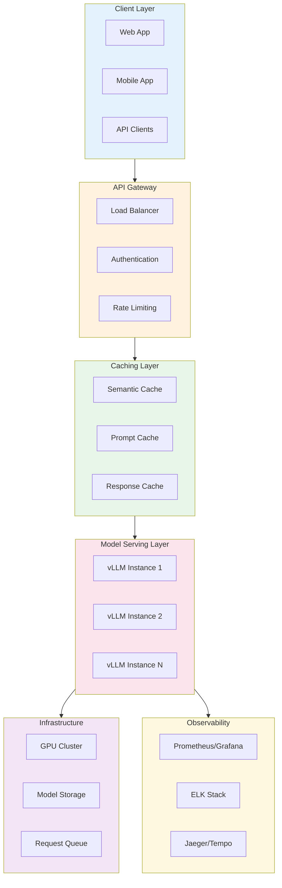

# LLMOps & Production

## Overview

LLMOps (Large Language Model Operations) encompasses the practices, tools, and infrastructure required to deploy, manage, and optimize LLMs in production environments. This topic bridges the gap between model development and real-world deployment, covering everything from serving infrastructure to cost management.

::: info Why This Matters for Interviews
Production LLM deployment is one of the fastest-growing areas in ML engineering. Interviewers increasingly expect candidates to understand not just how models work, but how to deploy them efficiently at scale. These skills are essential for ML Platform, MLOps, and AI Infrastructure roles.
:::

## Learning Objectives

By completing this module, you will be able to:

- **Design** production-ready LLM serving architectures using industry-standard tools
- **Optimize** inference costs through intelligent caching, batching, and model selection
- **Minimize** latency using techniques like speculative decoding, quantization, and streaming
- **Implement** comprehensive monitoring and observability for LLM applications
- **Scale** LLM services horizontally with appropriate load balancing and auto-scaling strategies
- **Articulate** trade-offs between different serving frameworks and deployment patterns

## Module Structure

```mermaid
graph TD
    A[LLMOps & Production] --> B[Serving Infrastructure]
    A --> C[Cost Optimization]
    A --> D[Latency Optimization]
    A --> E[Caching Strategies]
    A --> F[Monitoring]
    A --> G[Scaling Patterns]

    B --> B1[vLLM]
    B --> B2[TGI]
    B --> B3[Triton]
    B --> B4[TensorRT-LLM]

    C --> C1[Token Economics]
    C --> C2[Batch Processing]
    C --> C3[Model Selection]

    D --> D1[TTFT vs TPS]
    D --> D2[Speculative Decoding]
    D --> D3[Quantization]

    E --> E1[Semantic Caching]
    E --> E2[KV-Cache]
    E --> E3[Prompt Caching]

    F --> F1[Metrics]
    F --> F2[Logging]
    F --> F3[Alerting]

    G --> G1[Horizontal Scaling]
    G --> G2[Load Balancing]
    G --> G3[Multi-Region]

    style A fill:#e1f5fe
    style B fill:#fff3e0
    style C fill:#e8f5e9
    style D fill:#fce4ec
    style E fill:#f3e5f5
    style F fill:#fff8e1
    style G fill:#e0f2f1
```

## Modules

| Module | Description | Key Topics |
|--------|-------------|------------|
| [Serving Infrastructure](./serving-infrastructure.md) | Deploy LLMs with production-grade serving frameworks | vLLM, TGI, Triton, TensorRT-LLM, Serverless |
| [Cost Optimization](./cost-optimization.md) | Minimize inference costs without sacrificing quality | Token economics, caching, model selection |
| [Latency Optimization](./latency-optimization.md) | Achieve low-latency inference for real-time applications | TTFT, TPS, streaming, speculative decoding |
| [Caching Strategies](./caching-strategies.md) | Implement intelligent caching for LLM workloads | Semantic cache, KV-cache, prompt caching |
| [Monitoring](./monitoring.md) | Build comprehensive observability for LLM systems | Metrics, logging, tracing, dashboards |
| [Scaling Patterns](./scaling-patterns.md) | Scale LLM services to handle production traffic | Horizontal scaling, auto-scaling, multi-region |

## Production LLM Architecture Overview

## Prerequisites

Before diving into this module, ensure you have foundational knowledge of:

- **LLM Fundamentals**: Understanding of transformer architectures and attention mechanisms
- **Infrastructure Basics**: Familiarity with containers, Kubernetes, and cloud services
- **Python Programming**: Ability to read and write Python for configuration and scripting
- **Basic ML Concepts**: Understanding of model inference, batching, and GPU utilization

## Key Terminology

| Term | Definition |
|------|------------|
| **TTFT** | Time to First Token - latency until the first token is generated |
| **TPS** | Tokens Per Second - throughput of token generation |
| **KV-Cache** | Key-Value cache storing attention computations for reuse |
| **Continuous Batching** | Dynamic batching that adds/removes requests mid-generation |
| **Speculative Decoding** | Using a smaller model to propose tokens verified by larger model |
| **Quantization** | Reducing model precision (e.g., FP16 to INT8) for efficiency |
| **PagedAttention** | Memory-efficient attention mechanism used in vLLM |
| **Tensor Parallelism** | Splitting model weights across multiple GPUs |

## Interview Focus Areas

::: tip High-Impact Topics
Based on industry interview patterns, prioritize these areas:

1. **Serving Framework Trade-offs**: When to use vLLM vs TGI vs TensorRT-LLM
2. **Latency vs Throughput**: Understanding and optimizing both metrics
3. **Cost Modeling**: Calculating and optimizing inference costs
4. **Caching Strategies**: Implementing semantic and KV-cache effectively
5. **Scaling Decisions**: Horizontal vs vertical scaling considerations
:::

## Getting Started

We recommend following the modules in order, as concepts build upon each other:

1. Start with **Serving Infrastructure** to understand the deployment landscape
2. Move to **Cost Optimization** to learn about the economics of LLM inference
3. Study **Latency Optimization** for performance engineering techniques
4. Explore **Caching Strategies** for efficiency improvements
5. Learn **Monitoring** for production observability
6. Complete with **Scaling Patterns** for handling growth

## Summary

| Aspect | Key Considerations |
|--------|-------------------|
| **Serving** | Choose framework based on throughput needs, hardware, and model compatibility |
| **Cost** | Optimize through caching, batching, and appropriate model selection |
| **Latency** | Balance TTFT and TPS based on application requirements |
| **Caching** | Layer semantic, KV, and prompt caching for maximum efficiency |
| **Monitoring** | Track token-level metrics, costs, and quality indicators |
| **Scaling** | Design for horizontal scaling with stateless serving components |

## Sources

- [vLLM Documentation](https://docs.vllm.ai/)
- [Hugging Face TGI Documentation](https://huggingface.co/docs/text-generation-inference)
- [NVIDIA Triton Inference Server](https://developer.nvidia.com/triton-inference-server)
- [TensorRT-LLM GitHub](https://github.com/NVIDIA/TensorRT-LLM)
- [LLM Inference Best Practices - Anyscale](https://www.anyscale.com/blog/continuous-batching-llm-inference)
- [Efficient LLM Serving - Stanford MLSys Seminar](https://mlsys.stanford.edu/)
