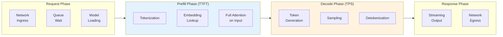
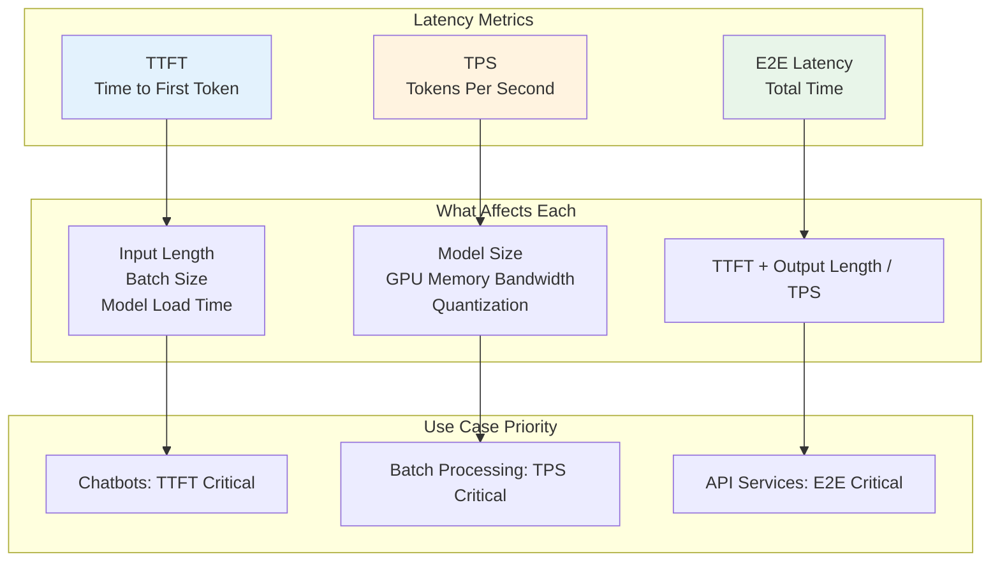
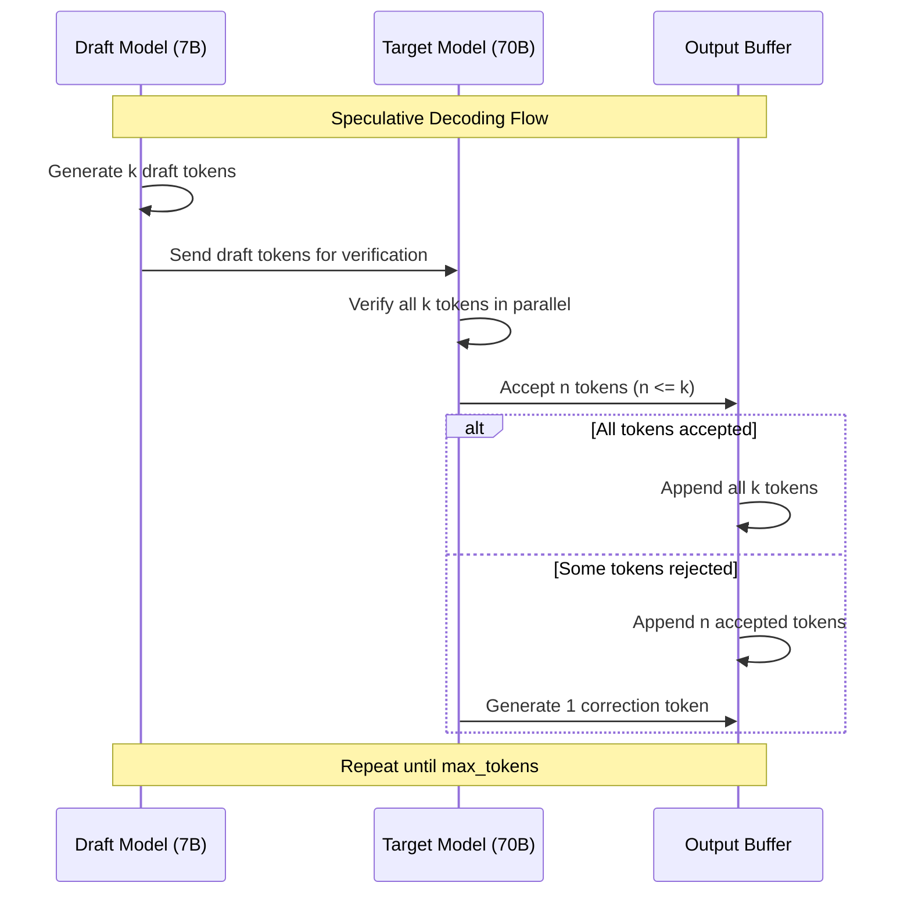
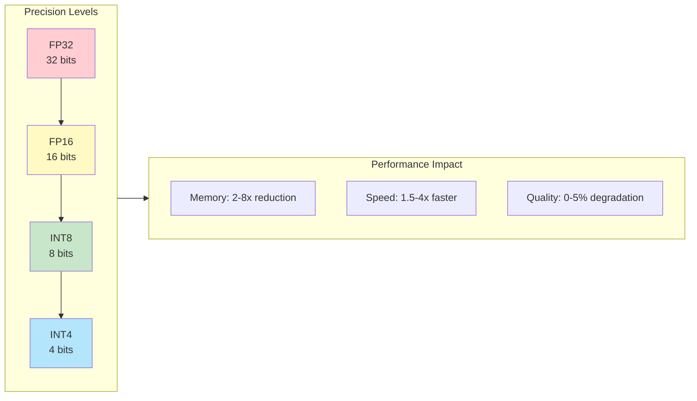

# Latency Optimization

## Learning Objectives

- **Distinguish** between TTFT (Time to First Token) and TPS (Tokens Per Second) and when each matters
- **Implement** streaming responses for improved perceived latency in user-facing applications
- **Apply** speculative decoding to accelerate generation without quality loss
- **Configure** quantization strategies for latency-optimized inference
- **Design** low-latency serving architectures for real-time applications

## Introduction

Latency is often the critical factor in LLM user experience. A response that takes 10 seconds feels sluggish, while streaming the first token in 200ms feels instantaneous. Understanding and optimizing the various components of LLM latency is essential for building responsive applications.

::: info User Perception Matters
Research shows users perceive delays >100ms as noticeable and >1 second as interrupting flow. For conversational AI, TTFT under 500ms is considered good, while total generation time depends heavily on output length and user expectations.
:::

## Latency Components



## TTFT vs TPS: Understanding the Trade-offs



### Latency Benchmarking

```python
# latency_benchmark.py - Comprehensive latency measurement
import time
import statistics
from dataclasses import dataclass
from typing import List, Optional, Callable
import asyncio

@dataclass
class LatencyMetrics:
    ttft_ms: float  # Time to first token
    tps: float  # Tokens per second (decode phase)
    total_latency_ms: float  # End-to-end latency
    input_tokens: int
    output_tokens: int
    queue_wait_ms: float = 0

class LatencyBenchmark:
    """Benchmark LLM inference latency."""

    def __init__(self, inference_fn: Callable):
        self.inference_fn = inference_fn
        self.results: List[LatencyMetrics] = []

    async def measure_single(
        self,
        prompt: str,
        max_tokens: int = 100,
    ) -> LatencyMetrics:
        """Measure latency for a single request."""
        input_tokens = len(prompt.split()) * 1.3  # Rough estimate

        start_time = time.perf_counter()
        first_token_time = None
        output_tokens = 0

        # Stream response to measure TTFT
        async for token in self.inference_fn(prompt, max_tokens):
            if first_token_time is None:
                first_token_time = time.perf_counter()
            output_tokens += 1

        end_time = time.perf_counter()

        # Calculate metrics
        total_latency_ms = (end_time - start_time) * 1000
        ttft_ms = (first_token_time - start_time) * 1000 if first_token_time else total_latency_ms
        decode_time_s = (end_time - first_token_time) if first_token_time else 0
        tps = output_tokens / decode_time_s if decode_time_s > 0 else 0

        metrics = LatencyMetrics(
            ttft_ms=round(ttft_ms, 2),
            tps=round(tps, 2),
            total_latency_ms=round(total_latency_ms, 2),
            input_tokens=int(input_tokens),
            output_tokens=output_tokens,
        )

        self.results.append(metrics)
        return metrics

    async def run_benchmark(
        self,
        prompts: List[str],
        max_tokens: int = 100,
        concurrency: int = 1,
    ) -> dict:
        """Run benchmark across multiple prompts."""
        if concurrency == 1:
            for prompt in prompts:
                await self.measure_single(prompt, max_tokens)
        else:
            # Concurrent requests
            semaphore = asyncio.Semaphore(concurrency)

            async def bounded_measure(prompt):
                async with semaphore:
                    return await self.measure_single(prompt, max_tokens)

            await asyncio.gather(*[bounded_measure(p) for p in prompts])

        return self.get_summary()

    def get_summary(self) -> dict:
        """Get statistical summary of benchmark results."""
        if not self.results:
            return {}

        ttft_values = [r.ttft_ms for r in self.results]
        tps_values = [r.tps for r in self.results]
        total_values = [r.total_latency_ms for r in self.results]

        return {
            "samples": len(self.results),
            "ttft_ms": {
                "mean": round(statistics.mean(ttft_values), 2),
                "p50": round(statistics.median(ttft_values), 2),
                "p95": round(sorted(ttft_values)[int(len(ttft_values) * 0.95)], 2),
                "p99": round(sorted(ttft_values)[int(len(ttft_values) * 0.99)], 2),
            },
            "tps": {
                "mean": round(statistics.mean(tps_values), 2),
                "min": round(min(tps_values), 2),
                "max": round(max(tps_values), 2),
            },
            "total_latency_ms": {
                "mean": round(statistics.mean(total_values), 2),
                "p50": round(statistics.median(total_values), 2),
                "p95": round(sorted(total_values)[int(len(total_values) * 0.95)], 2),
            },
        }
```

## Streaming Implementation

Streaming responses dramatically improves perceived latency by showing output as it's generated.

### Server-Side Streaming

```python
# streaming_server.py - FastAPI streaming implementation
from fastapi import FastAPI, HTTPException
from fastapi.responses import StreamingResponse
from pydantic import BaseModel
from typing import AsyncGenerator
import asyncio
import json

app = FastAPI()

class GenerateRequest(BaseModel):
    prompt: str
    max_tokens: int = 512
    temperature: float = 0.7
    stream: bool = True

async def generate_stream(
    prompt: str,
    max_tokens: int,
    temperature: float,
) -> AsyncGenerator[str, None]:
    """Stream tokens from LLM."""
    from vllm import LLM, SamplingParams

    # Note: In production, LLM should be initialized once
    llm = LLM(model="meta-llama/Llama-2-7b-chat-hf")
    params = SamplingParams(
        max_tokens=max_tokens,
        temperature=temperature,
    )

    # Use vLLM's async streaming
    async for output in llm.generate(prompt, params, stream=True):
        token = output.outputs[0].text
        yield f"data: {json.dumps({'token': token})}\n\n"

    yield "data: [DONE]\n\n"

@app.post("/v1/generate")
async def generate(request: GenerateRequest):
    """Generate endpoint with optional streaming."""
    if request.stream:
        return StreamingResponse(
            generate_stream(
                request.prompt,
                request.max_tokens,
                request.temperature,
            ),
            media_type="text/event-stream",
            headers={
                "Cache-Control": "no-cache",
                "Connection": "keep-alive",
                "X-Accel-Buffering": "no",  # Disable nginx buffering
            },
        )
    else:
        # Non-streaming response
        full_response = ""
        async for chunk in generate_stream(
            request.prompt,
            request.max_tokens,
            request.temperature,
        ):
            if chunk.startswith("data: ") and "[DONE]" not in chunk:
                data = json.loads(chunk[6:])
                full_response += data.get("token", "")

        return {"response": full_response}
```

### Client-Side Streaming

```python
# streaming_client.py - Client for consuming streaming responses
import httpx
import asyncio
from typing import AsyncGenerator

class StreamingClient:
    """Client for consuming SSE streaming responses."""

    def __init__(self, base_url: str):
        self.base_url = base_url

    async def generate_stream(
        self,
        prompt: str,
        max_tokens: int = 512,
    ) -> AsyncGenerator[str, None]:
        """Stream tokens from server."""
        async with httpx.AsyncClient(timeout=120.0) as client:
            async with client.stream(
                "POST",
                f"{self.base_url}/v1/generate",
                json={
                    "prompt": prompt,
                    "max_tokens": max_tokens,
                    "stream": True,
                },
            ) as response:
                async for line in response.aiter_lines():
                    if line.startswith("data: "):
                        data = line[6:]
                        if data == "[DONE]":
                            break
                        import json
                        token_data = json.loads(data)
                        yield token_data.get("token", "")

    async def generate_with_callback(
        self,
        prompt: str,
        on_token: callable,
        on_complete: callable = None,
    ):
        """Stream with callbacks for UI integration."""
        full_response = ""
        async for token in self.generate_stream(prompt):
            full_response += token
            on_token(token)

        if on_complete:
            on_complete(full_response)

        return full_response

# Usage example
async def main():
    client = StreamingClient("http://localhost:8000")

    print("Response: ", end="", flush=True)
    async for token in client.generate_stream("Explain quantum computing:"):
        print(token, end="", flush=True)
    print()  # Newline at end

if __name__ == "__main__":
    asyncio.run(main())
```

## Speculative Decoding

Speculative decoding uses a smaller "draft" model to propose multiple tokens, then verifies them in parallel with the larger model.



### Speculative Decoding Implementation

```python
# speculative_decoding.py - Speculative decoding implementation
import torch
from transformers import AutoModelForCausalLM, AutoTokenizer
from typing import Tuple, List

class SpeculativeDecoder:
    """Speculative decoding for accelerated LLM inference."""

    def __init__(
        self,
        target_model_name: str,
        draft_model_name: str,
        device: str = "cuda",
    ):
        # Load target (large) model
        self.target_model = AutoModelForCausalLM.from_pretrained(
            target_model_name,
            torch_dtype=torch.float16,
            device_map="auto",
        )
        self.target_tokenizer = AutoTokenizer.from_pretrained(target_model_name)

        # Load draft (small) model
        self.draft_model = AutoModelForCausalLM.from_pretrained(
            draft_model_name,
            torch_dtype=torch.float16,
        ).to(device)
        self.draft_tokenizer = AutoTokenizer.from_pretrained(draft_model_name)

        self.device = device

    def generate_draft_tokens(
        self,
        input_ids: torch.Tensor,
        num_tokens: int = 5,
        temperature: float = 0.7,
    ) -> Tuple[torch.Tensor, torch.Tensor]:
        """Generate draft tokens using small model."""
        draft_tokens = []
        draft_probs = []

        current_ids = input_ids.clone()

        with torch.no_grad():
            for _ in range(num_tokens):
                outputs = self.draft_model(current_ids)
                logits = outputs.logits[:, -1, :] / temperature
                probs = torch.softmax(logits, dim=-1)

                # Sample next token
                next_token = torch.multinomial(probs, num_samples=1)
                draft_tokens.append(next_token)
                draft_probs.append(probs[0, next_token.item()])

                current_ids = torch.cat([current_ids, next_token], dim=-1)

        return (
            torch.cat(draft_tokens, dim=-1),
            torch.stack(draft_probs),
        )

    def verify_draft_tokens(
        self,
        input_ids: torch.Tensor,
        draft_tokens: torch.Tensor,
        draft_probs: torch.Tensor,
        temperature: float = 0.7,
    ) -> Tuple[int, torch.Tensor]:
        """Verify draft tokens with target model."""
        # Concatenate input with draft tokens
        full_sequence = torch.cat([input_ids, draft_tokens.unsqueeze(0)], dim=-1)

        with torch.no_grad():
            outputs = self.target_model(full_sequence)
            logits = outputs.logits / temperature

        # Verify each draft token
        num_accepted = 0
        correction_token = None

        for i, draft_token in enumerate(draft_tokens):
            target_pos = input_ids.shape[1] + i - 1
            target_probs = torch.softmax(logits[0, target_pos, :], dim=-1)
            target_prob = target_probs[draft_token.item()]

            # Acceptance criterion (simplified)
            # In practice, use more sophisticated rejection sampling
            acceptance_ratio = target_prob / (draft_probs[i] + 1e-10)

            if torch.rand(1).item() < min(1.0, acceptance_ratio):
                num_accepted += 1
            else:
                # Sample correction from target
                remaining_probs = torch.clamp(
                    target_probs - draft_probs[i] * target_probs,
                    min=0,
                )
                remaining_probs = remaining_probs / remaining_probs.sum()
                correction_token = torch.multinomial(remaining_probs, num_samples=1)
                break

        return num_accepted, correction_token

    def generate(
        self,
        prompt: str,
        max_tokens: int = 100,
        draft_length: int = 5,
        temperature: float = 0.7,
    ) -> str:
        """Generate text using speculative decoding."""
        input_ids = self.target_tokenizer.encode(
            prompt, return_tensors="pt"
        ).to(self.device)

        generated_tokens = []
        total_draft_tokens = 0
        total_accepted_tokens = 0

        while len(generated_tokens) < max_tokens:
            # Generate draft tokens
            draft_tokens, draft_probs = self.generate_draft_tokens(
                input_ids, draft_length, temperature
            )
            total_draft_tokens += draft_length

            # Verify with target model
            num_accepted, correction = self.verify_draft_tokens(
                input_ids, draft_tokens, draft_probs, temperature
            )
            total_accepted_tokens += num_accepted

            # Accept verified tokens
            if num_accepted > 0:
                accepted = draft_tokens[:num_accepted]
                input_ids = torch.cat([input_ids, accepted.unsqueeze(0)], dim=-1)
                generated_tokens.extend(accepted.tolist())

            # Add correction token if needed
            if correction is not None:
                input_ids = torch.cat([input_ids, correction.unsqueeze(0)], dim=-1)
                generated_tokens.append(correction.item())

        # Decode and return
        output_ids = input_ids[0, -len(generated_tokens):]
        acceptance_rate = total_accepted_tokens / total_draft_tokens

        print(f"Acceptance rate: {acceptance_rate:.2%}")
        return self.target_tokenizer.decode(output_ids, skip_special_tokens=True)
```

## Quantization for Latency

Quantization reduces model precision, improving memory bandwidth utilization and latency.



### Quantization Configuration

```python
# quantization_config.py - Configure quantization for inference
from transformers import AutoModelForCausalLM, BitsAndBytesConfig
import torch

def load_quantized_model(
    model_name: str,
    quantization: str = "int8",
) -> AutoModelForCausalLM:
    """Load model with specified quantization."""

    if quantization == "int8":
        # 8-bit quantization with bitsandbytes
        quantization_config = BitsAndBytesConfig(
            load_in_8bit=True,
            llm_int8_threshold=6.0,
            llm_int8_has_fp16_weight=False,
        )
    elif quantization == "int4":
        # 4-bit quantization (NF4 for better quality)
        quantization_config = BitsAndBytesConfig(
            load_in_4bit=True,
            bnb_4bit_compute_dtype=torch.float16,
            bnb_4bit_use_double_quant=True,
            bnb_4bit_quant_type="nf4",
        )
    elif quantization == "awq":
        # AWQ quantization (requires awq library)
        # Model must be pre-quantized with AWQ
        quantization_config = None  # AWQ models are pre-quantized
    else:
        quantization_config = None

    model = AutoModelForCausalLM.from_pretrained(
        model_name,
        quantization_config=quantization_config,
        device_map="auto",
        torch_dtype=torch.float16,
    )

    return model

# vLLM with quantization
def vllm_quantized_config():
    """vLLM configuration with quantization."""
    return {
        "model": "TheBloke/Llama-2-70B-Chat-AWQ",
        "quantization": "awq",
        "tensor_parallel_size": 2,  # Fewer GPUs needed with quantization
        "gpu_memory_utilization": 0.9,
        "dtype": "float16",
        "max_model_len": 4096,
    }

# GPTQ quantization with vLLM
def vllm_gptq_config():
    """vLLM with GPTQ quantization."""
    return {
        "model": "TheBloke/Llama-2-70B-Chat-GPTQ",
        "quantization": "gptq",
        "tensor_parallel_size": 2,
        "gpu_memory_utilization": 0.9,
    }
```

### Quantization Comparison

```python
# quantization_benchmark.py - Compare quantization methods
from dataclasses import dataclass
from typing import Dict, List
import time

@dataclass
class QuantizationResult:
    method: str
    model_size_gb: float
    ttft_ms: float
    tps: float
    perplexity: float  # Quality metric
    memory_usage_gb: float

def benchmark_quantization_methods(
    model_name: str,
    test_prompts: List[str],
) -> Dict[str, QuantizationResult]:
    """Benchmark different quantization methods."""

    results = {}

    methods = {
        "fp16": {"quantization": None, "dtype": "float16"},
        "int8": {"quantization": "bitsandbytes", "load_in_8bit": True},
        "int4": {"quantization": "bitsandbytes", "load_in_4bit": True},
        "awq": {"quantization": "awq"},
        "gptq": {"quantization": "gptq"},
    }

    for method, config in methods.items():
        print(f"Benchmarking {method}...")

        # Load model with quantization
        # model = load_model_with_config(model_name, config)

        # Measure metrics
        # results[method] = QuantizationResult(...)

    return results

# Expected results (approximate for Llama-2-70B)
EXPECTED_RESULTS = {
    "fp16": QuantizationResult(
        method="FP16",
        model_size_gb=140,
        ttft_ms=150,
        tps=30,
        perplexity=5.0,
        memory_usage_gb=145,
    ),
    "int8": QuantizationResult(
        method="INT8",
        model_size_gb=70,
        ttft_ms=120,
        tps=40,
        perplexity=5.1,
        memory_usage_gb=75,
    ),
    "int4_awq": QuantizationResult(
        method="INT4 (AWQ)",
        model_size_gb=35,
        ttft_ms=100,
        tps=55,
        perplexity=5.3,
        memory_usage_gb=40,
    ),
    "int4_gptq": QuantizationResult(
        method="INT4 (GPTQ)",
        model_size_gb=35,
        ttft_ms=105,
        tps=52,
        perplexity=5.4,
        memory_usage_gb=40,
    ),
}
```

## Latency Optimization Checklist

```python
# latency_optimization.py - Comprehensive optimization strategies
from dataclasses import dataclass
from enum import Enum
from typing import List, Optional

class OptimizationCategory(Enum):
    INFRASTRUCTURE = "infrastructure"
    MODEL = "model"
    SERVING = "serving"
    APPLICATION = "application"

@dataclass
class OptimizationTechnique:
    name: str
    category: OptimizationCategory
    ttft_impact: str  # "high", "medium", "low"
    tps_impact: str
    complexity: str  # "low", "medium", "high"
    description: str

OPTIMIZATION_TECHNIQUES = [
    # Infrastructure optimizations
    OptimizationTechnique(
        name="GPU Selection",
        category=OptimizationCategory.INFRASTRUCTURE,
        ttft_impact="medium",
        tps_impact="high",
        complexity="low",
        description="Use H100 > A100 > L40S for best performance",
    ),
    OptimizationTechnique(
        name="Tensor Parallelism",
        category=OptimizationCategory.INFRASTRUCTURE,
        ttft_impact="high",
        tps_impact="medium",
        complexity="medium",
        description="Split model across GPUs for faster prefill",
    ),
    OptimizationTechnique(
        name="NVLink Topology",
        category=OptimizationCategory.INFRASTRUCTURE,
        ttft_impact="medium",
        tps_impact="medium",
        complexity="low",
        description="Use NVLink-connected GPUs for faster communication",
    ),

    # Model optimizations
    OptimizationTechnique(
        name="INT8 Quantization",
        category=OptimizationCategory.MODEL,
        ttft_impact="medium",
        tps_impact="high",
        complexity="low",
        description="2x memory reduction, ~30% speed improvement",
    ),
    OptimizationTechnique(
        name="INT4 Quantization (AWQ/GPTQ)",
        category=OptimizationCategory.MODEL,
        ttft_impact="high",
        tps_impact="high",
        complexity="medium",
        description="4x memory reduction, ~50% speed improvement",
    ),
    OptimizationTechnique(
        name="Model Distillation",
        category=OptimizationCategory.MODEL,
        ttft_impact="high",
        tps_impact="high",
        complexity="high",
        description="Train smaller model to match larger model quality",
    ),

    # Serving optimizations
    OptimizationTechnique(
        name="Continuous Batching",
        category=OptimizationCategory.SERVING,
        ttft_impact="medium",
        tps_impact="high",
        complexity="low",
        description="Use vLLM/TGI for dynamic batch management",
    ),
    OptimizationTechnique(
        name="PagedAttention",
        category=OptimizationCategory.SERVING,
        ttft_impact="low",
        tps_impact="high",
        complexity="low",
        description="Efficient KV-cache memory management",
    ),
    OptimizationTechnique(
        name="Speculative Decoding",
        category=OptimizationCategory.SERVING,
        ttft_impact="low",
        tps_impact="high",
        complexity="medium",
        description="2-3x decode speedup with draft model",
    ),
    OptimizationTechnique(
        name="Flash Attention",
        category=OptimizationCategory.SERVING,
        ttft_impact="high",
        tps_impact="medium",
        complexity="low",
        description="Memory-efficient attention computation",
    ),

    # Application optimizations
    OptimizationTechnique(
        name="Streaming Responses",
        category=OptimizationCategory.APPLICATION,
        ttft_impact="high",
        tps_impact="low",
        complexity="low",
        description="Show tokens as generated for perceived speed",
    ),
    OptimizationTechnique(
        name="Prompt Caching",
        category=OptimizationCategory.APPLICATION,
        ttft_impact="high",
        tps_impact="low",
        complexity="medium",
        description="Cache KV states for common prefixes",
    ),
    OptimizationTechnique(
        name="Request Prioritization",
        category=OptimizationCategory.APPLICATION,
        ttft_impact="high",
        tps_impact="low",
        complexity="medium",
        description="Prioritize interactive over batch requests",
    ),
]

def get_recommendations(
    priority: str = "ttft",  # "ttft", "tps", or "balanced"
    max_complexity: str = "medium",
) -> List[OptimizationTechnique]:
    """Get optimization recommendations based on priority."""
    complexity_order = {"low": 1, "medium": 2, "high": 3}

    # Filter by complexity
    filtered = [
        t for t in OPTIMIZATION_TECHNIQUES
        if complexity_order[t.complexity] <= complexity_order[max_complexity]
    ]

    # Sort by impact
    if priority == "ttft":
        impact_key = lambda t: (
            {"high": 0, "medium": 1, "low": 2}[t.ttft_impact],
            {"low": 0, "medium": 1, "high": 2}[t.complexity],
        )
    elif priority == "tps":
        impact_key = lambda t: (
            {"high": 0, "medium": 1, "low": 2}[t.tps_impact],
            {"low": 0, "medium": 1, "high": 2}[t.complexity],
        )
    else:  # balanced
        impact_key = lambda t: (
            {"high": 0, "medium": 1, "low": 2}[t.ttft_impact] +
            {"high": 0, "medium": 1, "low": 2}[t.tps_impact],
            {"low": 0, "medium": 1, "high": 2}[t.complexity],
        )

    return sorted(filtered, key=impact_key)
```

## Interview Q&A

### Question 1: Explain the difference between TTFT and TPS, and when you would optimize for each.

**Strong Answer:**
TTFT (Time to First Token) and TPS (Tokens Per Second) measure different phases of LLM inference:

**TTFT (Time to First Token):**
- Measures latency from request to first generated token
- Dominated by the prefill phase (processing the entire input)
- Scales with input length (longer prompts = higher TTFT)
- Critical for perceived responsiveness in interactive applications

**TPS (Tokens Per Second):**
- Measures decode throughput after the first token
- Dominated by memory bandwidth (loading KV-cache per token)
- Relatively constant regardless of output length
- Critical for total generation time and throughput

**When to optimize TTFT:**
- Chatbots and conversational AI (users expect quick responses)
- Real-time applications (voice assistants, live translation)
- Short output tasks (classification, entity extraction)

**When to optimize TPS:**
- Batch processing (document summarization, data extraction)
- Long-form generation (article writing, code generation)
- High-throughput APIs where total time matters more than first response

**Optimization trade-offs:**
- Tensor parallelism improves TTFT (parallelizes prefill) but may hurt TPS (communication overhead)
- Larger batch sizes improve TPS but increase TTFT (queue wait)
- Speculative decoding improves TPS with minimal TTFT impact

### Question 2: How does speculative decoding work, and what are its limitations?

**Strong Answer:**
Speculative decoding accelerates LLM inference by using a small "draft" model to propose multiple tokens, then verifying them in parallel with the larger "target" model.

**How it works:**
1. Draft model generates k tokens autoregressively (fast, ~7B model)
2. Target model verifies all k tokens in a single forward pass (parallel)
3. Accept n tokens that match target distribution (n <= k)
4. If rejection occurs, sample correction token from target model
5. Repeat until max tokens reached

**Why it's faster:**
- Draft model runs k iterations but is ~10x faster per iteration
- Target model runs 1 iteration but verifies k tokens
- Net speedup: 2-3x depending on acceptance rate

**Acceptance rate factors:**
- Draft/target model similarity (fine-tuned draft works best)
- Temperature (lower temp = higher acceptance)
- Task complexity (simple continuations have higher acceptance)

**Limitations:**
1. **Overhead**: Requires loading two models (memory cost)
2. **Diminishing returns**: At low acceptance rates (<40%), speedup disappears
3. **Not for all tasks**: Complex reasoning has lower acceptance rates
4. **Latency variance**: Rejection causes variable generation patterns
5. **Implementation complexity**: Requires matching tokenizers and careful sampling

**Best use cases:**
- Code completion (high predictability)
- Structured output generation
- Tasks where draft model can be domain-fine-tuned

### Question 3: Design a low-latency serving architecture for a conversational AI application.

**Strong Answer:**
For a conversational AI with strict latency requirements (TTFT <300ms), I'd design the following architecture:

**Infrastructure:**
- GPU: H100 80GB (highest memory bandwidth)
- Deployment: Kubernetes with GPU node pools
- Region: Multi-region with user-based routing

**Model Serving:**
```
User -> CDN -> Load Balancer -> Model Servers
                    |
            [Semantic Cache]
                    |
        [vLLM with Flash Attention]
                    |
            [Response Cache]
```

**Key optimizations:**

1. **Pre-warming:**
   - Keep models loaded in memory
   - Warm up GPU with dummy requests
   - Pre-compute system prompt KV-cache

2. **Caching layers:**
   - Semantic cache for similar queries (Redis + embeddings)
   - KV-cache sharing for common prefixes
   - Response cache for deterministic queries

3. **Model configuration:**
   - INT4 AWQ quantization (fits on single GPU)
   - Flash Attention 2 enabled
   - Continuous batching with tight scheduling

4. **Network optimization:**
   - gRPC for internal communication
   - Connection pooling
   - Regional deployment (edge inference if possible)

5. **Request handling:**
   - Priority queues (interactive > background)
   - Request timeout with graceful degradation
   - Streaming SSE responses

**Latency budget:**
- Network ingress: 20ms
- Queue wait: 30ms (p95)
- Model loading: 0ms (pre-warmed)
- Prefill: 100ms (for 1K token context)
- First token: 50ms
- **Total TTFT: ~200ms (p95)**

**Monitoring:**
- Real-time TTFT percentiles dashboard
- Auto-scaling triggers on p95 latency
- Alerting on cache miss rates

## Summary

| Optimization | TTFT Impact | TPS Impact | Complexity | Best For |
|-------------|-------------|------------|------------|----------|
| **Streaming** | High (perceived) | None | Low | All user-facing apps |
| **Quantization (INT8)** | Medium | High | Low | Memory-constrained |
| **Quantization (INT4)** | High | High | Medium | Maximum efficiency |
| **Tensor Parallelism** | High | Medium | Medium | Large models |
| **Speculative Decoding** | Low | High | Medium | Predictable tasks |
| **Flash Attention** | High | Medium | Low | Long contexts |
| **Prompt Caching** | High | None | Medium | Common prefixes |
| **Request Prioritization** | High | Low | Medium | Mixed workloads |

## Sources

- [vLLM: PagedAttention for High-Throughput Serving](https://arxiv.org/abs/2309.06180)
- [Speculative Decoding Paper](https://arxiv.org/abs/2211.17192)
- [Flash Attention 2](https://arxiv.org/abs/2307.08691)
- [AWQ: Activation-aware Weight Quantization](https://arxiv.org/abs/2306.00978)
- [GPTQ: Accurate Post-Training Quantization](https://arxiv.org/abs/2210.17323)
- [LLM Inference Optimization Guide - NVIDIA](https://developer.nvidia.com/blog/mastering-llm-techniques-inference-optimization/)
- [Streaming Best Practices - Anthropic](https://docs.anthropic.com/claude/docs/streaming)
