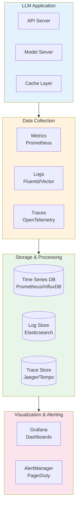
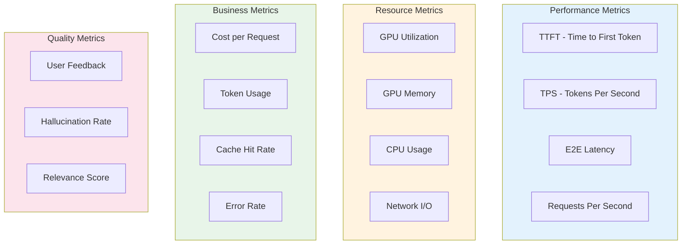

# Monitoring & Observability

## Learning Objectives

- **Identify** the key metrics to track for LLM applications (latency, throughput, quality, cost)
- **Implement** comprehensive logging for debugging and audit trails
- **Set up** distributed tracing for end-to-end request visibility
- **Configure** alerting rules for proactive incident detection
- **Design** dashboards that provide actionable insights for LLM operations

## Introduction

LLM observability goes beyond traditional application monitoring. You need to track not just system health, but also model quality, token economics, and user satisfaction. A robust monitoring strategy enables rapid debugging, capacity planning, and continuous optimization.

::: info The Observability Challenge
LLMs have unique monitoring challenges: non-deterministic outputs, variable latency based on input/output length, and quality that's hard to measure automatically. Your observability stack must account for these factors.
:::

## Monitoring Architecture



## Key Metrics to Track



### Metrics Implementation

```python
# metrics.py - Comprehensive LLM metrics with Prometheus
from prometheus_client import (
    Counter, Histogram, Gauge, Summary,
    CollectorRegistry, generate_latest,
)
from functools import wraps
import time
from typing import Optional

# Create registry
registry = CollectorRegistry()

# Performance metrics
REQUEST_LATENCY = Histogram(
    "llm_request_latency_seconds",
    "End-to-end request latency",
    ["model", "endpoint"],
    buckets=[0.1, 0.25, 0.5, 1.0, 2.5, 5.0, 10.0, 30.0],
    registry=registry,
)

TTFT_LATENCY = Histogram(
    "llm_ttft_seconds",
    "Time to first token",
    ["model"],
    buckets=[0.05, 0.1, 0.25, 0.5, 1.0, 2.0, 5.0],
    registry=registry,
)

TOKENS_PER_SECOND = Histogram(
    "llm_tokens_per_second",
    "Token generation rate",
    ["model"],
    buckets=[10, 25, 50, 100, 200, 500],
    registry=registry,
)

# Token metrics
INPUT_TOKENS = Counter(
    "llm_input_tokens_total",
    "Total input tokens processed",
    ["model", "endpoint"],
    registry=registry,
)

OUTPUT_TOKENS = Counter(
    "llm_output_tokens_total",
    "Total output tokens generated",
    ["model", "endpoint"],
    registry=registry,
)

# Cost metrics
REQUEST_COST = Histogram(
    "llm_request_cost_dollars",
    "Cost per request in dollars",
    ["model"],
    buckets=[0.001, 0.01, 0.05, 0.1, 0.5, 1.0, 5.0],
    registry=registry,
)

DAILY_COST = Gauge(
    "llm_daily_cost_dollars",
    "Running daily cost",
    ["model"],
    registry=registry,
)

# Resource metrics
GPU_UTILIZATION = Gauge(
    "llm_gpu_utilization_percent",
    "GPU utilization percentage",
    ["gpu_id"],
    registry=registry,
)

GPU_MEMORY_USED = Gauge(
    "llm_gpu_memory_used_bytes",
    "GPU memory used",
    ["gpu_id"],
    registry=registry,
)

GPU_MEMORY_TOTAL = Gauge(
    "llm_gpu_memory_total_bytes",
    "GPU memory total",
    ["gpu_id"],
    registry=registry,
)

# Cache metrics
CACHE_HITS = Counter(
    "llm_cache_hits_total",
    "Total cache hits",
    ["cache_type"],  # exact, semantic, kv
    registry=registry,
)

CACHE_MISSES = Counter(
    "llm_cache_misses_total",
    "Total cache misses",
    registry=registry,
)

# Error metrics
REQUEST_ERRORS = Counter(
    "llm_request_errors_total",
    "Total request errors",
    ["model", "error_type"],
    registry=registry,
)

# Queue metrics
QUEUE_SIZE = Gauge(
    "llm_queue_size",
    "Current queue size",
    ["priority"],
    registry=registry,
)

QUEUE_WAIT_TIME = Histogram(
    "llm_queue_wait_seconds",
    "Time spent waiting in queue",
    buckets=[0.01, 0.05, 0.1, 0.5, 1.0, 5.0],
    registry=registry,
)

class MetricsCollector:
    """Collect and report LLM metrics."""

    def __init__(self, model_name: str):
        self.model_name = model_name
        self.daily_costs = {}

    def record_request(
        self,
        endpoint: str,
        latency_seconds: float,
        ttft_seconds: float,
        input_tokens: int,
        output_tokens: int,
        tokens_per_second: float,
        cost_dollars: float,
        cache_hit: Optional[str] = None,
        error: Optional[str] = None,
    ):
        """Record metrics for a single request."""
        # Performance
        REQUEST_LATENCY.labels(
            model=self.model_name,
            endpoint=endpoint,
        ).observe(latency_seconds)

        TTFT_LATENCY.labels(model=self.model_name).observe(ttft_seconds)
        TOKENS_PER_SECOND.labels(model=self.model_name).observe(tokens_per_second)

        # Tokens
        INPUT_TOKENS.labels(
            model=self.model_name,
            endpoint=endpoint,
        ).inc(input_tokens)

        OUTPUT_TOKENS.labels(
            model=self.model_name,
            endpoint=endpoint,
        ).inc(output_tokens)

        # Cost
        REQUEST_COST.labels(model=self.model_name).observe(cost_dollars)
        DAILY_COST.labels(model=self.model_name).inc(cost_dollars)

        # Cache
        if cache_hit:
            CACHE_HITS.labels(cache_type=cache_hit).inc()
        else:
            CACHE_MISSES.inc()

        # Errors
        if error:
            REQUEST_ERRORS.labels(
                model=self.model_name,
                error_type=error,
            ).inc()

    def update_gpu_metrics(self):
        """Update GPU utilization metrics."""
        try:
            import pynvml
            pynvml.nvmlInit()

            device_count = pynvml.nvmlDeviceGetCount()
            for i in range(device_count):
                handle = pynvml.nvmlDeviceGetHandleByIndex(i)

                # Utilization
                util = pynvml.nvmlDeviceGetUtilizationRates(handle)
                GPU_UTILIZATION.labels(gpu_id=str(i)).set(util.gpu)

                # Memory
                mem_info = pynvml.nvmlDeviceGetMemoryInfo(handle)
                GPU_MEMORY_USED.labels(gpu_id=str(i)).set(mem_info.used)
                GPU_MEMORY_TOTAL.labels(gpu_id=str(i)).set(mem_info.total)

            pynvml.nvmlShutdown()
        except Exception as e:
            print(f"Failed to collect GPU metrics: {e}")

def metrics_middleware(metrics: MetricsCollector):
    """FastAPI middleware for automatic metrics collection."""
    def decorator(func):
        @wraps(func)
        async def wrapper(*args, **kwargs):
            start_time = time.time()
            first_token_time = None
            error = None

            try:
                result = await func(*args, **kwargs)
                return result
            except Exception as e:
                error = type(e).__name__
                raise
            finally:
                latency = time.time() - start_time
                # Record metrics (simplified - actual implementation would
                # need access to token counts from the response)

        return wrapper
    return decorator
```

## Structured Logging

```python
# logging_config.py - Structured logging for LLM applications
import structlog
import logging
import json
from datetime import datetime
from typing import Any, Dict, Optional
import uuid

def configure_logging(
    level: str = "INFO",
    json_format: bool = True,
    log_file: Optional[str] = None,
):
    """Configure structured logging."""
    # Configure structlog
    processors = [
        structlog.stdlib.filter_by_level,
        structlog.stdlib.add_logger_name,
        structlog.stdlib.add_log_level,
        structlog.stdlib.PositionalArgumentsFormatter(),
        structlog.processors.TimeStamper(fmt="iso"),
        structlog.processors.StackInfoRenderer(),
        structlog.processors.UnicodeDecoder(),
    ]

    if json_format:
        processors.append(structlog.processors.JSONRenderer())
    else:
        processors.append(structlog.dev.ConsoleRenderer())

    structlog.configure(
        processors=processors,
        wrapper_class=structlog.stdlib.BoundLogger,
        context_class=dict,
        logger_factory=structlog.stdlib.LoggerFactory(),
        cache_logger_on_first_use=True,
    )

    # Configure stdlib logging
    logging.basicConfig(
        format="%(message)s",
        level=getattr(logging, level.upper()),
    )

    if log_file:
        file_handler = logging.FileHandler(log_file)
        file_handler.setFormatter(logging.Formatter("%(message)s"))
        logging.getLogger().addHandler(file_handler)

class LLMLogger:
    """Specialized logger for LLM applications."""

    def __init__(self, service_name: str):
        self.logger = structlog.get_logger(service_name)
        self.service_name = service_name

    def log_request(
        self,
        request_id: str,
        prompt: str,
        model: str,
        user_id: Optional[str] = None,
        metadata: Optional[Dict] = None,
    ):
        """Log incoming request."""
        self.logger.info(
            "llm_request_received",
            request_id=request_id,
            model=model,
            user_id=user_id,
            prompt_length=len(prompt),
            prompt_preview=prompt[:100] + "..." if len(prompt) > 100 else prompt,
            **(metadata or {}),
        )

    def log_response(
        self,
        request_id: str,
        response: str,
        input_tokens: int,
        output_tokens: int,
        latency_ms: float,
        ttft_ms: float,
        cost: float,
        cache_hit: bool = False,
        cache_type: Optional[str] = None,
    ):
        """Log response with metrics."""
        self.logger.info(
            "llm_response_generated",
            request_id=request_id,
            response_length=len(response),
            response_preview=response[:100] + "..." if len(response) > 100 else response,
            input_tokens=input_tokens,
            output_tokens=output_tokens,
            total_tokens=input_tokens + output_tokens,
            latency_ms=round(latency_ms, 2),
            ttft_ms=round(ttft_ms, 2),
            tokens_per_second=round(output_tokens / (latency_ms / 1000), 2) if latency_ms > 0 else 0,
            cost_usd=round(cost, 6),
            cache_hit=cache_hit,
            cache_type=cache_type,
        )

    def log_error(
        self,
        request_id: str,
        error_type: str,
        error_message: str,
        stack_trace: Optional[str] = None,
    ):
        """Log error with context."""
        self.logger.error(
            "llm_request_error",
            request_id=request_id,
            error_type=error_type,
            error_message=error_message,
            stack_trace=stack_trace,
        )

    def log_quality_feedback(
        self,
        request_id: str,
        user_id: str,
        feedback_type: str,  # thumbs_up, thumbs_down, correction
        feedback_value: Any,
    ):
        """Log user feedback for quality monitoring."""
        self.logger.info(
            "llm_quality_feedback",
            request_id=request_id,
            user_id=user_id,
            feedback_type=feedback_type,
            feedback_value=feedback_value,
        )

    def log_cost_alert(
        self,
        alert_type: str,
        threshold: float,
        current_value: float,
        model: str,
    ):
        """Log cost alert."""
        self.logger.warning(
            "llm_cost_alert",
            alert_type=alert_type,
            threshold=threshold,
            current_value=current_value,
            model=model,
            overage_percent=round((current_value / threshold - 1) * 100, 1),
        )

# Example log output (JSON format):
"""
{
    "event": "llm_response_generated",
    "request_id": "req_abc123",
    "response_length": 1523,
    "response_preview": "To implement a binary search tree in Python...",
    "input_tokens": 245,
    "output_tokens": 512,
    "total_tokens": 757,
    "latency_ms": 2340.5,
    "ttft_ms": 187.3,
    "tokens_per_second": 218.7,
    "cost_usd": 0.00757,
    "cache_hit": false,
    "timestamp": "2024-01-15T10:23:45.123Z",
    "level": "info",
    "logger": "llm-service"
}
"""
```

## Distributed Tracing

```python
# tracing.py - OpenTelemetry tracing for LLM applications
from opentelemetry import trace
from opentelemetry.sdk.trace import TracerProvider
from opentelemetry.sdk.trace.export import BatchSpanProcessor
from opentelemetry.exporter.otlp.proto.grpc.trace_exporter import OTLPSpanExporter
from opentelemetry.sdk.resources import Resource
from opentelemetry.instrumentation.fastapi import FastAPIInstrumentor
from opentelemetry.trace import Status, StatusCode
from contextlib import contextmanager
from typing import Optional, Dict, Any
import time

def configure_tracing(
    service_name: str,
    otlp_endpoint: str = "localhost:4317",
):
    """Configure OpenTelemetry tracing."""
    resource = Resource.create({
        "service.name": service_name,
        "service.version": "1.0.0",
    })

    provider = TracerProvider(resource=resource)
    processor = BatchSpanProcessor(
        OTLPSpanExporter(endpoint=otlp_endpoint)
    )
    provider.add_span_processor(processor)
    trace.set_tracer_provider(provider)

    return trace.get_tracer(service_name)

class LLMTracer:
    """Tracer for LLM request lifecycle."""

    def __init__(self, tracer: trace.Tracer):
        self.tracer = tracer

    @contextmanager
    def trace_request(
        self,
        request_id: str,
        model: str,
        operation: str = "llm_inference",
    ):
        """Trace an LLM request with all phases."""
        with self.tracer.start_as_current_span(operation) as span:
            span.set_attribute("request_id", request_id)
            span.set_attribute("model", model)

            try:
                yield span
            except Exception as e:
                span.set_status(Status(StatusCode.ERROR, str(e)))
                span.record_exception(e)
                raise

    @contextmanager
    def trace_cache_lookup(self, cache_type: str):
        """Trace cache lookup operation."""
        with self.tracer.start_as_current_span("cache_lookup") as span:
            span.set_attribute("cache_type", cache_type)
            start_time = time.time()

            try:
                yield span
            finally:
                span.set_attribute(
                    "duration_ms",
                    (time.time() - start_time) * 1000,
                )

    @contextmanager
    def trace_prefill(self, input_tokens: int):
        """Trace prefill phase."""
        with self.tracer.start_as_current_span("prefill") as span:
            span.set_attribute("input_tokens", input_tokens)
            start_time = time.time()

            try:
                yield span
            finally:
                duration = (time.time() - start_time) * 1000
                span.set_attribute("duration_ms", duration)
                span.set_attribute(
                    "tokens_per_ms",
                    input_tokens / duration if duration > 0 else 0,
                )

    @contextmanager
    def trace_decode(self):
        """Trace decode phase."""
        with self.tracer.start_as_current_span("decode") as span:
            start_time = time.time()
            output_tokens = 0

            class TokenCounter:
                def __init__(self):
                    self.count = 0

                def increment(self, n: int = 1):
                    self.count += n

            counter = TokenCounter()

            try:
                yield counter
            finally:
                duration = (time.time() - start_time) * 1000
                span.set_attribute("output_tokens", counter.count)
                span.set_attribute("duration_ms", duration)
                span.set_attribute(
                    "tokens_per_second",
                    counter.count / (duration / 1000) if duration > 0 else 0,
                )

    def add_request_attributes(
        self,
        span: trace.Span,
        input_tokens: int,
        output_tokens: int,
        ttft_ms: float,
        total_latency_ms: float,
        cost: float,
    ):
        """Add final request attributes to span."""
        span.set_attribute("input_tokens", input_tokens)
        span.set_attribute("output_tokens", output_tokens)
        span.set_attribute("total_tokens", input_tokens + output_tokens)
        span.set_attribute("ttft_ms", ttft_ms)
        span.set_attribute("total_latency_ms", total_latency_ms)
        span.set_attribute("cost_usd", cost)
        span.set_attribute(
            "tokens_per_second",
            output_tokens / (total_latency_ms / 1000) if total_latency_ms > 0 else 0,
        )

# Usage example
"""
async def generate(request: GenerateRequest):
    tracer = LLMTracer(get_tracer())

    with tracer.trace_request(request.id, request.model) as root_span:
        # Cache lookup
        with tracer.trace_cache_lookup("semantic") as cache_span:
            cached = semantic_cache.get(request.prompt)
            cache_span.set_attribute("cache_hit", cached is not None)

        if cached:
            return cached

        # Prefill
        with tracer.trace_prefill(len(request.prompt.split())) as prefill_span:
            kv_cache = model.prefill(request.prompt)

        # Decode
        with tracer.trace_decode() as counter:
            for token in model.generate(kv_cache):
                counter.increment()
                yield token

        # Add final attributes
        tracer.add_request_attributes(...)
"""
```

## Alerting Configuration

```python
# alerting.py - Alerting rules for LLM applications
from dataclasses import dataclass
from typing import List, Dict, Callable, Optional
from enum import Enum
import time

class AlertSeverity(Enum):
    INFO = "info"
    WARNING = "warning"
    CRITICAL = "critical"

@dataclass
class AlertRule:
    name: str
    description: str
    severity: AlertSeverity
    condition: str  # PromQL expression
    threshold: float
    for_duration: str  # e.g., "5m"
    labels: Dict[str, str]
    annotations: Dict[str, str]

# Standard LLM alerting rules
LLM_ALERT_RULES = [
    # Latency alerts
    AlertRule(
        name="LLMHighLatency",
        description="LLM request latency is above SLO",
        severity=AlertSeverity.WARNING,
        condition='histogram_quantile(0.95, rate(llm_request_latency_seconds_bucket[5m])) > 5',
        threshold=5.0,
        for_duration="5m",
        labels={"team": "ml-platform", "service": "llm"},
        annotations={
            "summary": "High latency detected",
            "description": "P95 latency is {{ $value }}s, threshold is 5s",
        },
    ),
    AlertRule(
        name="LLMCriticalLatency",
        description="LLM request latency is critically high",
        severity=AlertSeverity.CRITICAL,
        condition='histogram_quantile(0.99, rate(llm_request_latency_seconds_bucket[5m])) > 10',
        threshold=10.0,
        for_duration="2m",
        labels={"team": "ml-platform", "service": "llm"},
        annotations={
            "summary": "Critical latency - immediate attention required",
            "description": "P99 latency is {{ $value }}s",
        },
    ),

    # Error rate alerts
    AlertRule(
        name="LLMHighErrorRate",
        description="LLM error rate is elevated",
        severity=AlertSeverity.WARNING,
        condition='rate(llm_request_errors_total[5m]) / rate(llm_request_latency_seconds_count[5m]) > 0.01',
        threshold=0.01,
        for_duration="5m",
        labels={"team": "ml-platform", "service": "llm"},
        annotations={
            "summary": "Elevated error rate",
            "description": "Error rate is {{ $value | humanizePercentage }}",
        },
    ),
    AlertRule(
        name="LLMCriticalErrorRate",
        description="LLM error rate is critical",
        severity=AlertSeverity.CRITICAL,
        condition='rate(llm_request_errors_total[5m]) / rate(llm_request_latency_seconds_count[5m]) > 0.05',
        threshold=0.05,
        for_duration="2m",
        labels={"team": "ml-platform", "service": "llm"},
        annotations={
            "summary": "Critical error rate - immediate attention required",
            "description": "Error rate is {{ $value | humanizePercentage }}",
        },
    ),

    # GPU resource alerts
    AlertRule(
        name="LLMGPUMemoryHigh",
        description="GPU memory utilization is high",
        severity=AlertSeverity.WARNING,
        condition='llm_gpu_memory_used_bytes / llm_gpu_memory_total_bytes > 0.9',
        threshold=0.9,
        for_duration="5m",
        labels={"team": "ml-platform", "service": "llm"},
        annotations={
            "summary": "High GPU memory usage",
            "description": "GPU {{ $labels.gpu_id }} memory at {{ $value | humanizePercentage }}",
        },
    ),
    AlertRule(
        name="LLMGPUUtilizationLow",
        description="GPU utilization is low - potential waste",
        severity=AlertSeverity.INFO,
        condition='avg_over_time(llm_gpu_utilization_percent[30m]) < 20',
        threshold=20,
        for_duration="30m",
        labels={"team": "ml-platform", "service": "llm"},
        annotations={
            "summary": "Low GPU utilization",
            "description": "Consider scaling down or optimizing batching",
        },
    ),

    # Cost alerts
    AlertRule(
        name="LLMDailyCostHigh",
        description="Daily LLM cost exceeds budget",
        severity=AlertSeverity.WARNING,
        condition='llm_daily_cost_dollars > 1000',
        threshold=1000,
        for_duration="1m",
        labels={"team": "ml-platform", "service": "llm"},
        annotations={
            "summary": "Daily cost budget exceeded",
            "description": "Current daily cost: ${{ $value }}",
        },
    ),
    AlertRule(
        name="LLMCostSpike",
        description="Sudden spike in LLM costs",
        severity=AlertSeverity.WARNING,
        condition='rate(llm_daily_cost_dollars[1h]) > 100',
        threshold=100,
        for_duration="15m",
        labels={"team": "ml-platform", "service": "llm"},
        annotations={
            "summary": "Cost spike detected",
            "description": "Cost increasing at ${{ $value }}/hour",
        },
    ),

    # Cache alerts
    AlertRule(
        name="LLMCacheHitRateLow",
        description="Cache hit rate is below expected",
        severity=AlertSeverity.INFO,
        condition='rate(llm_cache_hits_total[1h]) / (rate(llm_cache_hits_total[1h]) + rate(llm_cache_misses_total[1h])) < 0.3',
        threshold=0.3,
        for_duration="1h",
        labels={"team": "ml-platform", "service": "llm"},
        annotations={
            "summary": "Low cache hit rate",
            "description": "Cache hit rate is {{ $value | humanizePercentage }}",
        },
    ),

    # Queue alerts
    AlertRule(
        name="LLMQueueBacklog",
        description="Request queue is backing up",
        severity=AlertSeverity.WARNING,
        condition='llm_queue_size > 100',
        threshold=100,
        for_duration="5m",
        labels={"team": "ml-platform", "service": "llm"},
        annotations={
            "summary": "Queue backlog detected",
            "description": "{{ $value }} requests in queue",
        },
    ),
]

def generate_prometheus_rules(rules: List[AlertRule]) -> str:
    """Generate Prometheus alerting rules YAML."""
    yaml_content = "groups:\n  - name: llm-alerts\n    rules:\n"

    for rule in rules:
        yaml_content += f"""      - alert: {rule.name}
        expr: {rule.condition}
        for: {rule.for_duration}
        labels:
          severity: {rule.severity.value}
"""
        for k, v in rule.labels.items():
            yaml_content += f"          {k}: {v}\n"

        yaml_content += "        annotations:\n"
        for k, v in rule.annotations.items():
            yaml_content += f'          {k}: "{v}"\n'

    return yaml_content
```

## Dashboard Design

```python
# dashboard.py - Grafana dashboard configuration
from typing import List, Dict, Any
import json

def create_llm_dashboard() -> Dict[str, Any]:
    """Create comprehensive LLM monitoring dashboard."""
    return {
        "title": "LLM Service Dashboard",
        "tags": ["llm", "ml-platform"],
        "timezone": "browser",
        "refresh": "30s",
        "panels": [
            # Row 1: Overview
            {
                "title": "Request Rate",
                "type": "stat",
                "gridPos": {"x": 0, "y": 0, "w": 6, "h": 4},
                "targets": [{
                    "expr": 'sum(rate(llm_request_latency_seconds_count[5m]))',
                    "legendFormat": "Requests/s",
                }],
            },
            {
                "title": "P95 Latency",
                "type": "stat",
                "gridPos": {"x": 6, "y": 0, "w": 6, "h": 4},
                "targets": [{
                    "expr": 'histogram_quantile(0.95, sum(rate(llm_request_latency_seconds_bucket[5m])) by (le))',
                    "legendFormat": "P95 Latency",
                }],
                "fieldConfig": {
                    "defaults": {
                        "unit": "s",
                        "thresholds": {
                            "mode": "absolute",
                            "steps": [
                                {"value": 0, "color": "green"},
                                {"value": 2, "color": "yellow"},
                                {"value": 5, "color": "red"},
                            ],
                        },
                    },
                },
            },
            {
                "title": "Error Rate",
                "type": "stat",
                "gridPos": {"x": 12, "y": 0, "w": 6, "h": 4},
                "targets": [{
                    "expr": 'sum(rate(llm_request_errors_total[5m])) / sum(rate(llm_request_latency_seconds_count[5m]))',
                    "legendFormat": "Error Rate",
                }],
                "fieldConfig": {
                    "defaults": {
                        "unit": "percentunit",
                        "thresholds": {
                            "mode": "absolute",
                            "steps": [
                                {"value": 0, "color": "green"},
                                {"value": 0.01, "color": "yellow"},
                                {"value": 0.05, "color": "red"},
                            ],
                        },
                    },
                },
            },
            {
                "title": "Daily Cost",
                "type": "stat",
                "gridPos": {"x": 18, "y": 0, "w": 6, "h": 4},
                "targets": [{
                    "expr": 'sum(llm_daily_cost_dollars)',
                    "legendFormat": "Daily Cost",
                }],
                "fieldConfig": {
                    "defaults": {
                        "unit": "currencyUSD",
                    },
                },
            },

            # Row 2: Latency breakdown
            {
                "title": "Latency Distribution",
                "type": "timeseries",
                "gridPos": {"x": 0, "y": 4, "w": 12, "h": 8},
                "targets": [
                    {
                        "expr": 'histogram_quantile(0.50, sum(rate(llm_request_latency_seconds_bucket[5m])) by (le))',
                        "legendFormat": "P50",
                    },
                    {
                        "expr": 'histogram_quantile(0.95, sum(rate(llm_request_latency_seconds_bucket[5m])) by (le))',
                        "legendFormat": "P95",
                    },
                    {
                        "expr": 'histogram_quantile(0.99, sum(rate(llm_request_latency_seconds_bucket[5m])) by (le))',
                        "legendFormat": "P99",
                    },
                ],
            },
            {
                "title": "TTFT Distribution",
                "type": "timeseries",
                "gridPos": {"x": 12, "y": 4, "w": 12, "h": 8},
                "targets": [
                    {
                        "expr": 'histogram_quantile(0.50, sum(rate(llm_ttft_seconds_bucket[5m])) by (le))',
                        "legendFormat": "P50",
                    },
                    {
                        "expr": 'histogram_quantile(0.95, sum(rate(llm_ttft_seconds_bucket[5m])) by (le))',
                        "legendFormat": "P95",
                    },
                ],
            },

            # Row 3: Token metrics
            {
                "title": "Token Throughput",
                "type": "timeseries",
                "gridPos": {"x": 0, "y": 12, "w": 12, "h": 8},
                "targets": [
                    {
                        "expr": 'sum(rate(llm_input_tokens_total[5m]))',
                        "legendFormat": "Input Tokens/s",
                    },
                    {
                        "expr": 'sum(rate(llm_output_tokens_total[5m]))',
                        "legendFormat": "Output Tokens/s",
                    },
                ],
            },
            {
                "title": "Tokens Per Second (Generation)",
                "type": "timeseries",
                "gridPos": {"x": 12, "y": 12, "w": 12, "h": 8},
                "targets": [{
                    "expr": 'histogram_quantile(0.50, sum(rate(llm_tokens_per_second_bucket[5m])) by (le))',
                    "legendFormat": "Median TPS",
                }],
            },

            # Row 4: Cache performance
            {
                "title": "Cache Hit Rate",
                "type": "timeseries",
                "gridPos": {"x": 0, "y": 20, "w": 12, "h": 8},
                "targets": [{
                    "expr": 'sum(rate(llm_cache_hits_total[5m])) / (sum(rate(llm_cache_hits_total[5m])) + sum(rate(llm_cache_misses_total[5m])))',
                    "legendFormat": "Hit Rate",
                }],
            },
            {
                "title": "Cache Hits by Type",
                "type": "piechart",
                "gridPos": {"x": 12, "y": 20, "w": 12, "h": 8},
                "targets": [{
                    "expr": 'sum(increase(llm_cache_hits_total[1h])) by (cache_type)',
                    "legendFormat": "{{cache_type}}",
                }],
            },

            # Row 5: GPU metrics
            {
                "title": "GPU Utilization",
                "type": "timeseries",
                "gridPos": {"x": 0, "y": 28, "w": 12, "h": 8},
                "targets": [{
                    "expr": 'llm_gpu_utilization_percent',
                    "legendFormat": "GPU {{gpu_id}}",
                }],
            },
            {
                "title": "GPU Memory Usage",
                "type": "timeseries",
                "gridPos": {"x": 12, "y": 28, "w": 12, "h": 8},
                "targets": [{
                    "expr": 'llm_gpu_memory_used_bytes / llm_gpu_memory_total_bytes',
                    "legendFormat": "GPU {{gpu_id}}",
                }],
                "fieldConfig": {
                    "defaults": {"unit": "percentunit"},
                },
            },
        ],
    }
```

## Interview Q&A

### Question 1: What metrics would you track for an LLM application, and why?

**Strong Answer:**
I'd track metrics across four categories:

**1. Performance Metrics:**
- **TTFT (P50, P95, P99)**: Critical for user-perceived latency
- **Total latency**: End-to-end request time
- **Tokens per second**: Generation throughput
- **Queue wait time**: Identifies capacity issues

**2. Resource Metrics:**
- **GPU utilization**: Detect under/over-provisioning
- **GPU memory**: Track KV-cache growth, prevent OOM
- **CPU/Network**: Identify bottlenecks outside GPU

**3. Business Metrics:**
- **Cost per request**: Track spending, detect anomalies
- **Token usage (input/output)**: Understand workload patterns
- **Cache hit rate**: Measure optimization effectiveness
- **Error rate by type**: Distinguish infrastructure vs model errors

**4. Quality Metrics:**
- **User feedback rate**: Track thumbs up/down
- **Regeneration rate**: Users requesting new responses
- **Response length distribution**: Detect truncation or verbosity issues

**Why these matter:**
- Performance directly impacts user experience
- Resource metrics enable capacity planning
- Business metrics ensure cost control
- Quality metrics catch model degradation

I'd set up dashboards showing all four categories and alerts on critical thresholds (P95 latency >5s, error rate >1%, daily cost exceeding budget).

### Question 2: How would you implement end-to-end tracing for an LLM request?

**Strong Answer:**
I'd implement tracing using OpenTelemetry with spans for each phase of the request lifecycle:

**Span Hierarchy:**
```
llm_request (root span)
├── cache_lookup
│   ├── semantic_search
│   └── exact_match
├── preprocessing
│   └── tokenization
├── inference
│   ├── prefill
│   │   ├── embedding_lookup
│   │   └── attention_compute
│   └── decode
│       └── token_generation (repeated)
├── postprocessing
│   └── detokenization
└── response_streaming
```

**Key attributes to capture:**
- `request_id`: Correlation ID
- `model`: Model name/version
- `input_tokens`, `output_tokens`: Token counts
- `ttft_ms`: Time to first token
- `cache_hit`: Boolean + type if hit
- `queue_wait_ms`: Time in queue

**Implementation approach:**
1. Use context propagation for trace continuity
2. Add custom spans for LLM-specific phases
3. Capture token-level timing in decode phase
4. Include GPU metrics as span attributes
5. Export to Jaeger/Tempo for visualization

**Benefits:**
- Debug slow requests by identifying bottleneck phase
- Compare latency across different cache scenarios
- Track request flow across microservices
- Generate SLI/SLO reports from trace data

### Question 3: Design an alerting strategy for an LLM service with 99.9% availability SLO.

**Strong Answer:**
For a 99.9% availability SLO, I'd implement a tiered alerting strategy:

**SLO Definition:**
- 99.9% = 8.76 hours downtime/year = 43.8 minutes/month
- Define "available" as: successful response within 10 seconds

**Tier 1: Proactive (Prevent Incidents)**
- GPU memory >85%: Scale up or clear cache (Warning)
- Queue depth >50: Scale up inference capacity (Warning)
- Cache hit rate drop >20%: Investigate cache issues (Info)
- Cost spike >50% hourly: Potential abuse or bug (Warning)

**Tier 2: Reactive (Detect Incidents)**
- Error rate >0.1% for 2 minutes: Page on-call (Critical)
- P95 latency >5s for 5 minutes: Page on-call (Critical)
- P99 latency >10s for 2 minutes: Page on-call (Critical)
- No requests for 1 minute: Page on-call (Critical)

**Tier 3: SLO Burn Rate**
- Error budget burn rate >10x: Immediate page (Critical)
- Error budget burn rate >2x: Warning, investigate (Warning)
- Error budget at 50%: Review and plan (Info)

**Alert routing:**
- Critical: PagerDuty -> On-call engineer
- Warning: Slack channel + email
- Info: Dashboard only

**Runbooks for each alert:**
- Include diagnostic commands
- Escalation procedures
- Rollback instructions
- Communication templates

**Silencing rules:**
- During planned maintenance
- After acknowledged and investigating
- For known issues with open tickets

## Summary

| Aspect | Tools | Key Metrics |
|--------|-------|-------------|
| **Metrics** | Prometheus, Grafana | TTFT, TPS, error rate, cost |
| **Logging** | ELK, Loki | Request/response, errors, feedback |
| **Tracing** | Jaeger, Tempo | Request lifecycle, latency breakdown |
| **Alerting** | AlertManager, PagerDuty | SLO violations, resource limits |
| **Dashboards** | Grafana | Real-time overview, trends |

## Sources

- [Prometheus Best Practices](https://prometheus.io/docs/practices/)
- [OpenTelemetry Documentation](https://opentelemetry.io/docs/)
- [Grafana Dashboard Best Practices](https://grafana.com/docs/grafana/latest/dashboards/build-dashboards/best-practices/)
- [SRE Book - Monitoring Chapter](https://sre.google/sre-book/monitoring-distributed-systems/)
- [LLM Observability Guide - Arize AI](https://arize.com/blog-course/llm-observability/)
- [Structlog Documentation](https://www.structlog.org/)
