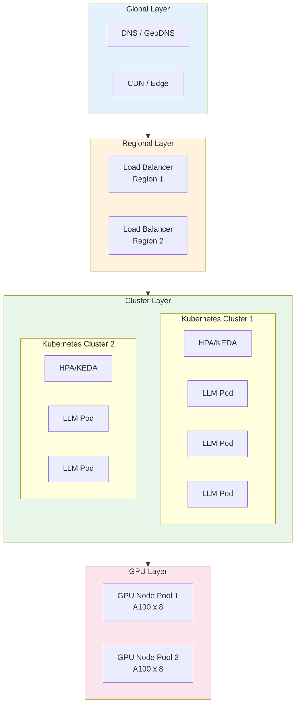
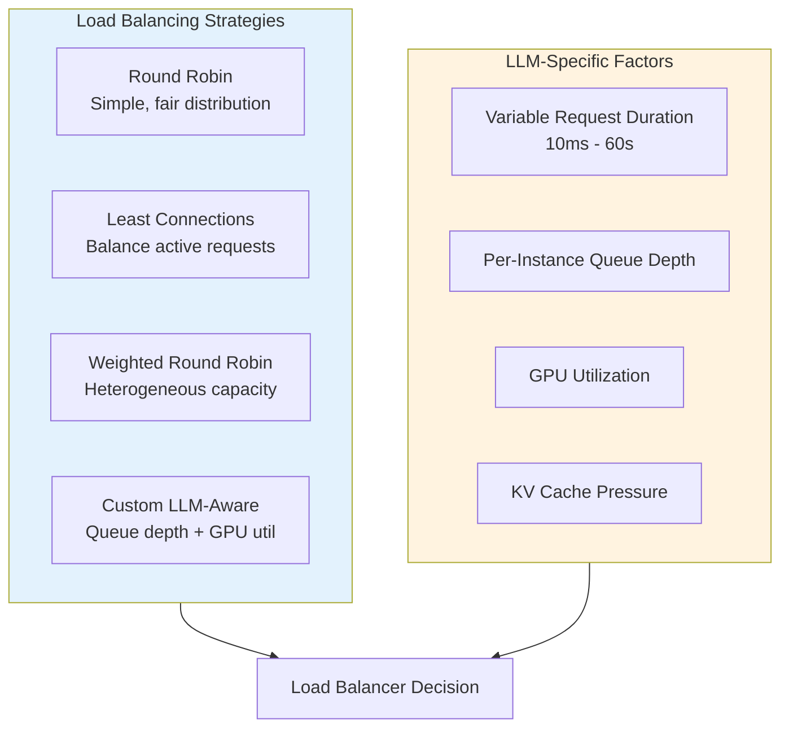
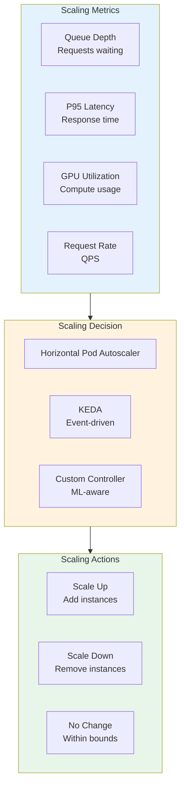
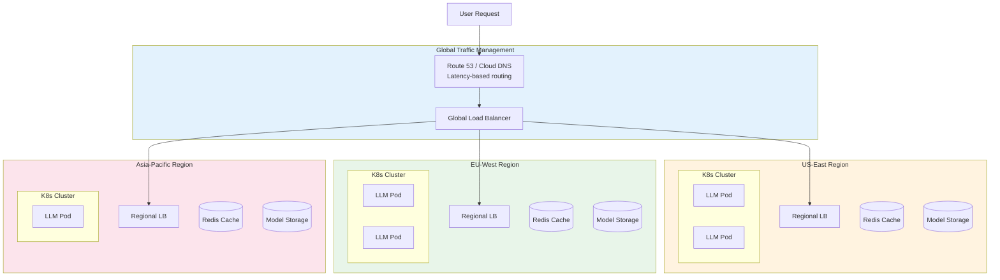

# Scaling Patterns

## Learning Objectives

- **Design** horizontally scalable LLM serving architectures
- **Configure** load balancing strategies optimized for LLM workloads
- **Implement** auto-scaling based on relevant LLM metrics
- **Architect** multi-region deployments for global availability and latency
- **Evaluate** trade-offs between different scaling approaches

## Introduction

Scaling LLM services presents unique challenges compared to traditional web applications. The compute-intensive nature of inference, stateful KV-cache, and variable request durations require specialized scaling strategies. This module covers patterns for scaling LLM services from hundreds to millions of requests per day.

::: info Scaling Reality
A single A100 GPU can handle ~10-50 requests per second depending on the model and request complexity. Scaling to thousands of QPS requires careful architecture design, not just adding more GPUs.
:::

## Scaling Architecture Overview



## Horizontal Scaling

Horizontal scaling adds more inference instances to handle increased load.

### Stateless Serving Design

```python
# stateless_serving.py - Stateless LLM serving for horizontal scaling
from dataclasses import dataclass
from typing import Optional, Dict, Any
import hashlib
import redis

@dataclass
class ServingConfig:
    """Configuration for stateless LLM serving."""
    model_name: str
    model_path: str
    tensor_parallel_size: int = 1
    max_batch_size: int = 32
    max_concurrent_requests: int = 100

    # External state stores (for stateless operation)
    redis_url: str = "redis://localhost:6379"
    s3_model_bucket: str = "models"

class StatelessLLMServer:
    """Stateless LLM server that can be horizontally scaled."""

    def __init__(self, config: ServingConfig):
        self.config = config
        self.redis = redis.from_url(config.redis_url)

        # Model loaded at startup, same across all replicas
        self.model = self._load_model()

    def _load_model(self):
        """Load model from shared storage."""
        from vllm import LLM

        return LLM(
            model=self.config.model_path,
            tensor_parallel_size=self.config.tensor_parallel_size,
            trust_remote_code=True,
        )

    def _get_conversation_context(
        self,
        conversation_id: str,
    ) -> Optional[list]:
        """Retrieve conversation context from Redis."""
        context = self.redis.get(f"conv:{conversation_id}")
        if context:
            import json
            return json.loads(context)
        return None

    def _store_conversation_context(
        self,
        conversation_id: str,
        messages: list,
        ttl_seconds: int = 3600,
    ):
        """Store conversation context in Redis."""
        import json
        self.redis.setex(
            f"conv:{conversation_id}",
            ttl_seconds,
            json.dumps(messages),
        )

    async def generate(
        self,
        request_id: str,
        prompt: str,
        conversation_id: Optional[str] = None,
        **kwargs,
    ) -> Dict[str, Any]:
        """Generate response (stateless operation)."""
        from vllm import SamplingParams

        # Build full context if conversation_id provided
        full_prompt = prompt
        if conversation_id:
            context = self._get_conversation_context(conversation_id)
            if context:
                # Reconstruct conversation
                full_prompt = self._build_conversation_prompt(context, prompt)

        # Generate response
        params = SamplingParams(**kwargs)
        outputs = self.model.generate([full_prompt], params)
        response = outputs[0].outputs[0].text

        # Store updated context if conversation
        if conversation_id:
            updated_context = (context or []) + [
                {"role": "user", "content": prompt},
                {"role": "assistant", "content": response},
            ]
            self._store_conversation_context(conversation_id, updated_context)

        return {
            "request_id": request_id,
            "response": response,
            "tokens": {
                "input": len(full_prompt.split()),
                "output": len(response.split()),
            },
        }

    def _build_conversation_prompt(
        self,
        context: list,
        new_message: str,
    ) -> str:
        """Build prompt from conversation history."""
        prompt_parts = []
        for msg in context:
            role = msg["role"]
            content = msg["content"]
            if role == "user":
                prompt_parts.append(f"User: {content}")
            else:
                prompt_parts.append(f"Assistant: {content}")

        prompt_parts.append(f"User: {new_message}")
        prompt_parts.append("Assistant:")

        return "\n".join(prompt_parts)
```

### Kubernetes Deployment

```yaml
# kubernetes/llm-deployment.yaml
apiVersion: apps/v1
kind: Deployment
metadata:
  name: llm-server
  labels:
    app: llm-server
spec:
  replicas: 3  # Start with 3 replicas
  selector:
    matchLabels:
      app: llm-server
  template:
    metadata:
      labels:
        app: llm-server
    spec:
      nodeSelector:
        accelerator: nvidia-a100
      containers:
        - name: vllm
          image: vllm/vllm-openai:latest
          resources:
            limits:
              nvidia.com/gpu: 4  # 4 GPUs per pod for tensor parallelism
              memory: 200Gi
            requests:
              nvidia.com/gpu: 4
              memory: 180Gi
          ports:
            - containerPort: 8000
          env:
            - name: MODEL_NAME
              value: "meta-llama/Llama-2-70b-chat-hf"
            - name: TENSOR_PARALLEL_SIZE
              value: "4"
            - name: GPU_MEMORY_UTILIZATION
              value: "0.9"
          args:
            - "--model"
            - "$(MODEL_NAME)"
            - "--tensor-parallel-size"
            - "$(TENSOR_PARALLEL_SIZE)"
            - "--gpu-memory-utilization"
            - "$(GPU_MEMORY_UTILIZATION)"
          readinessProbe:
            httpGet:
              path: /health
              port: 8000
            initialDelaySeconds: 120  # Model loading time
            periodSeconds: 10
          livenessProbe:
            httpGet:
              path: /health
              port: 8000
            initialDelaySeconds: 180
            periodSeconds: 30
      tolerations:
        - key: "nvidia.com/gpu"
          operator: "Exists"
          effect: "NoSchedule"
---
apiVersion: v1
kind: Service
metadata:
  name: llm-server
spec:
  selector:
    app: llm-server
  ports:
    - port: 8000
      targetPort: 8000
  type: ClusterIP
```

## Load Balancing

LLM workloads require specialized load balancing due to variable request durations.



### LLM-Aware Load Balancer

```python
# load_balancer.py - Custom load balancer for LLM workloads
from dataclasses import dataclass, field
from typing import List, Optional, Dict
import asyncio
import aiohttp
from collections import defaultdict
import time
import random

@dataclass
class BackendServer:
    """Represents an LLM inference backend."""
    url: str
    weight: float = 1.0
    max_concurrent: int = 100

    # Dynamic state
    active_requests: int = 0
    queue_depth: int = 0
    gpu_utilization: float = 0.0
    last_health_check: float = 0.0
    healthy: bool = True
    avg_latency_ms: float = 0.0

@dataclass
class LoadBalancerConfig:
    health_check_interval: float = 10.0
    unhealthy_threshold: int = 3
    healthy_threshold: int = 2
    request_timeout: float = 60.0

class LLMLoadBalancer:
    """Custom load balancer optimized for LLM workloads."""

    def __init__(
        self,
        backends: List[BackendServer],
        config: LoadBalancerConfig = LoadBalancerConfig(),
    ):
        self.backends = backends
        self.config = config
        self.request_counts = defaultdict(int)
        self._health_check_task = None

    async def start(self):
        """Start the load balancer."""
        self._health_check_task = asyncio.create_task(
            self._health_check_loop()
        )

    async def stop(self):
        """Stop the load balancer."""
        if self._health_check_task:
            self._health_check_task.cancel()

    def _calculate_score(self, backend: BackendServer) -> float:
        """Calculate load balancing score for a backend.

        Lower score = better candidate.
        """
        if not backend.healthy:
            return float('inf')

        # Factors:
        # 1. Active request ratio (0-1)
        active_ratio = backend.active_requests / backend.max_concurrent

        # 2. Queue depth impact
        queue_factor = backend.queue_depth / 100  # Normalize

        # 3. GPU utilization (prefer 70-80% sweet spot)
        gpu_factor = abs(backend.gpu_utilization - 0.75) / 0.25

        # 4. Weight (inverse - higher weight = lower score)
        weight_factor = 1.0 / backend.weight

        # Combined score
        score = (
            active_ratio * 0.4 +
            queue_factor * 0.3 +
            gpu_factor * 0.2 +
            weight_factor * 0.1
        )

        return score

    def select_backend(
        self,
        session_affinity_key: Optional[str] = None,
    ) -> Optional[BackendServer]:
        """Select the best backend for a request."""
        # Session affinity for conversations
        if session_affinity_key:
            # Hash to consistent backend
            hash_val = hash(session_affinity_key)
            healthy_backends = [b for b in self.backends if b.healthy]
            if healthy_backends:
                return healthy_backends[hash_val % len(healthy_backends)]

        # Score-based selection
        candidates = [
            (self._calculate_score(b), b)
            for b in self.backends
            if b.healthy and b.active_requests < b.max_concurrent
        ]

        if not candidates:
            return None

        # Select best with some randomization for fairness
        candidates.sort(key=lambda x: x[0])

        # Power of two choices: pick best of two random candidates
        if len(candidates) >= 2:
            sample = random.sample(candidates[:min(5, len(candidates))], 2)
            return min(sample, key=lambda x: x[0])[1]

        return candidates[0][1]

    async def forward_request(
        self,
        request_data: Dict,
        session_key: Optional[str] = None,
    ) -> Dict:
        """Forward request to selected backend."""
        backend = self.select_backend(session_key)

        if not backend:
            raise Exception("No healthy backends available")

        backend.active_requests += 1
        start_time = time.time()

        try:
            async with aiohttp.ClientSession() as session:
                async with session.post(
                    f"{backend.url}/generate",
                    json=request_data,
                    timeout=aiohttp.ClientTimeout(
                        total=self.config.request_timeout
                    ),
                ) as response:
                    result = await response.json()

                    # Update latency tracking
                    latency = (time.time() - start_time) * 1000
                    backend.avg_latency_ms = (
                        backend.avg_latency_ms * 0.9 + latency * 0.1
                    )

                    return result

        finally:
            backend.active_requests -= 1

    async def _health_check_loop(self):
        """Periodically check backend health."""
        consecutive_failures = defaultdict(int)
        consecutive_successes = defaultdict(int)

        while True:
            for backend in self.backends:
                try:
                    async with aiohttp.ClientSession() as session:
                        async with session.get(
                            f"{backend.url}/health",
                            timeout=aiohttp.ClientTimeout(total=5),
                        ) as response:
                            if response.status == 200:
                                health_data = await response.json()

                                # Update backend stats
                                backend.queue_depth = health_data.get(
                                    "queue_depth", 0
                                )
                                backend.gpu_utilization = health_data.get(
                                    "gpu_utilization", 0
                                )

                                consecutive_successes[backend.url] += 1
                                consecutive_failures[backend.url] = 0

                                if (
                                    not backend.healthy and
                                    consecutive_successes[backend.url] >=
                                    self.config.healthy_threshold
                                ):
                                    backend.healthy = True
                                    print(f"Backend {backend.url} is now healthy")
                            else:
                                raise Exception(f"Health check returned {response.status}")

                except Exception as e:
                    consecutive_failures[backend.url] += 1
                    consecutive_successes[backend.url] = 0

                    if (
                        backend.healthy and
                        consecutive_failures[backend.url] >=
                        self.config.unhealthy_threshold
                    ):
                        backend.healthy = False
                        print(f"Backend {backend.url} marked unhealthy: {e}")

                backend.last_health_check = time.time()

            await asyncio.sleep(self.config.health_check_interval)

    def get_stats(self) -> Dict:
        """Get load balancer statistics."""
        return {
            "backends": [
                {
                    "url": b.url,
                    "healthy": b.healthy,
                    "active_requests": b.active_requests,
                    "queue_depth": b.queue_depth,
                    "gpu_utilization": b.gpu_utilization,
                    "avg_latency_ms": round(b.avg_latency_ms, 2),
                }
                for b in self.backends
            ],
            "total_active": sum(b.active_requests for b in self.backends),
            "healthy_count": sum(1 for b in self.backends if b.healthy),
        }
```

## Auto-Scaling



### KEDA Scaling Configuration

```yaml
# kubernetes/keda-scaler.yaml
apiVersion: keda.sh/v1alpha1
kind: ScaledObject
metadata:
  name: llm-server-scaler
spec:
  scaleTargetRef:
    name: llm-server
  minReplicaCount: 2
  maxReplicaCount: 10
  pollingInterval: 15
  cooldownPeriod: 300  # 5 minutes cooldown
  triggers:
    # Scale based on Prometheus metrics
    - type: prometheus
      metadata:
        serverAddress: http://prometheus:9090
        metricName: llm_queue_depth
        threshold: "50"
        query: |
          sum(llm_queue_size) / count(llm_queue_size)

    - type: prometheus
      metadata:
        serverAddress: http://prometheus:9090
        metricName: llm_latency_p95
        threshold: "5"  # 5 seconds
        query: |
          histogram_quantile(0.95,
            sum(rate(llm_request_latency_seconds_bucket[5m])) by (le)
          )

    - type: prometheus
      metadata:
        serverAddress: http://prometheus:9090
        metricName: llm_gpu_utilization
        threshold: "85"
        query: |
          avg(llm_gpu_utilization_percent)
---
# Custom metrics API for HPA
apiVersion: autoscaling/v2
kind: HorizontalPodAutoscaler
metadata:
  name: llm-server-hpa
spec:
  scaleTargetRef:
    apiVersion: apps/v1
    kind: Deployment
    name: llm-server
  minReplicas: 2
  maxReplicas: 10
  metrics:
    - type: Pods
      pods:
        metric:
          name: llm_queue_depth
        target:
          type: AverageValue
          averageValue: "30"
    - type: Pods
      pods:
        metric:
          name: llm_gpu_utilization
        target:
          type: AverageValue
          averageValue: "75"
  behavior:
    scaleUp:
      stabilizationWindowSeconds: 60
      policies:
        - type: Pods
          value: 2
          periodSeconds: 60
        - type: Percent
          value: 50
          periodSeconds: 60
      selectPolicy: Max
    scaleDown:
      stabilizationWindowSeconds: 300
      policies:
        - type: Pods
          value: 1
          periodSeconds: 120
      selectPolicy: Min
```

### Custom Auto-Scaler

```python
# autoscaler.py - Custom LLM-aware auto-scaler
from dataclasses import dataclass
from typing import Dict, Optional
import asyncio
from datetime import datetime, timedelta
from kubernetes import client, config

@dataclass
class ScalingPolicy:
    min_replicas: int = 2
    max_replicas: int = 10
    scale_up_threshold_queue: int = 50
    scale_up_threshold_latency_p95: float = 5.0  # seconds
    scale_up_threshold_gpu: float = 85.0
    scale_down_threshold_queue: int = 10
    scale_down_threshold_gpu: float = 40.0
    scale_up_cooldown: int = 60  # seconds
    scale_down_cooldown: int = 300  # seconds
    scale_up_step: int = 2
    scale_down_step: int = 1

class LLMAutoScaler:
    """Custom auto-scaler for LLM workloads."""

    def __init__(
        self,
        deployment_name: str,
        namespace: str,
        policy: ScalingPolicy,
        metrics_client,
    ):
        self.deployment_name = deployment_name
        self.namespace = namespace
        self.policy = policy
        self.metrics = metrics_client

        # Kubernetes client
        config.load_incluster_config()
        self.k8s_apps = client.AppsV1Api()

        # State
        self.last_scale_up = datetime.min
        self.last_scale_down = datetime.min
        self.scaling_history = []

    async def get_current_metrics(self) -> Dict:
        """Fetch current metrics from monitoring system."""
        return {
            "queue_depth": await self.metrics.get_avg_queue_depth(),
            "latency_p95": await self.metrics.get_latency_p95(),
            "gpu_utilization": await self.metrics.get_avg_gpu_utilization(),
            "request_rate": await self.metrics.get_request_rate(),
        }

    def get_current_replicas(self) -> int:
        """Get current replica count."""
        deployment = self.k8s_apps.read_namespaced_deployment(
            self.deployment_name,
            self.namespace,
        )
        return deployment.spec.replicas

    def scale_deployment(self, replicas: int):
        """Scale the deployment to specified replicas."""
        # Clamp to policy limits
        replicas = max(
            self.policy.min_replicas,
            min(self.policy.max_replicas, replicas)
        )

        deployment = self.k8s_apps.read_namespaced_deployment(
            self.deployment_name,
            self.namespace,
        )

        if deployment.spec.replicas == replicas:
            return

        deployment.spec.replicas = replicas
        self.k8s_apps.patch_namespaced_deployment(
            self.deployment_name,
            self.namespace,
            deployment,
        )

        self.scaling_history.append({
            "timestamp": datetime.now(),
            "action": "scale",
            "replicas": replicas,
        })

    def should_scale_up(self, metrics: Dict) -> bool:
        """Determine if we should scale up."""
        # Check cooldown
        if datetime.now() - self.last_scale_up < timedelta(
            seconds=self.policy.scale_up_cooldown
        ):
            return False

        # Check if at max
        if self.get_current_replicas() >= self.policy.max_replicas:
            return False

        # Scale up conditions (any of these triggers scale up)
        conditions = [
            metrics["queue_depth"] > self.policy.scale_up_threshold_queue,
            metrics["latency_p95"] > self.policy.scale_up_threshold_latency_p95,
            metrics["gpu_utilization"] > self.policy.scale_up_threshold_gpu,
        ]

        return any(conditions)

    def should_scale_down(self, metrics: Dict) -> bool:
        """Determine if we should scale down."""
        # Check cooldown
        if datetime.now() - self.last_scale_down < timedelta(
            seconds=self.policy.scale_down_cooldown
        ):
            return False

        # Check if at min
        if self.get_current_replicas() <= self.policy.min_replicas:
            return False

        # Scale down conditions (all must be true)
        conditions = [
            metrics["queue_depth"] < self.policy.scale_down_threshold_queue,
            metrics["gpu_utilization"] < self.policy.scale_down_threshold_gpu,
        ]

        return all(conditions)

    async def run_scaling_loop(self):
        """Main auto-scaling loop."""
        while True:
            try:
                metrics = await self.get_current_metrics()
                current_replicas = self.get_current_replicas()

                if self.should_scale_up(metrics):
                    new_replicas = current_replicas + self.policy.scale_up_step
                    print(f"Scaling up: {current_replicas} -> {new_replicas}")
                    print(f"Metrics: {metrics}")
                    self.scale_deployment(new_replicas)
                    self.last_scale_up = datetime.now()

                elif self.should_scale_down(metrics):
                    new_replicas = current_replicas - self.policy.scale_down_step
                    print(f"Scaling down: {current_replicas} -> {new_replicas}")
                    print(f"Metrics: {metrics}")
                    self.scale_deployment(new_replicas)
                    self.last_scale_down = datetime.now()

            except Exception as e:
                print(f"Scaling loop error: {e}")

            await asyncio.sleep(30)  # Check every 30 seconds

    def get_status(self) -> Dict:
        """Get auto-scaler status."""
        return {
            "current_replicas": self.get_current_replicas(),
            "min_replicas": self.policy.min_replicas,
            "max_replicas": self.policy.max_replicas,
            "last_scale_up": self.last_scale_up.isoformat(),
            "last_scale_down": self.last_scale_down.isoformat(),
            "recent_history": self.scaling_history[-10:],
        }
```

## Multi-Region Architecture



### Multi-Region Configuration

```python
# multi_region.py - Multi-region LLM deployment management
from dataclasses import dataclass
from typing import List, Dict, Optional
from enum import Enum

class Region(Enum):
    US_EAST = "us-east-1"
    US_WEST = "us-west-2"
    EU_WEST = "eu-west-1"
    ASIA_PACIFIC = "ap-northeast-1"

@dataclass
class RegionConfig:
    region: Region
    endpoint: str
    gpu_capacity: int  # Total GPUs available
    min_replicas: int
    max_replicas: int
    weight: float = 1.0  # Traffic weight
    active: bool = True

@dataclass
class MultiRegionConfig:
    regions: List[RegionConfig]
    failover_threshold_latency_ms: float = 5000
    failover_threshold_error_rate: float = 0.05
    replication_lag_threshold_ms: float = 100

class MultiRegionManager:
    """Manage multi-region LLM deployment."""

    def __init__(self, config: MultiRegionConfig):
        self.config = config
        self.region_health: Dict[Region, Dict] = {}

    def get_routing_weights(self) -> Dict[Region, float]:
        """Calculate traffic routing weights based on health."""
        weights = {}
        total_weight = 0

        for region_config in self.config.regions:
            if not region_config.active:
                continue

            health = self.region_health.get(region_config.region, {})

            # Adjust weight based on health
            weight = region_config.weight

            # Reduce weight for high latency
            latency = health.get("latency_p95_ms", 0)
            if latency > self.config.failover_threshold_latency_ms:
                weight *= 0.1  # Drastically reduce

            # Reduce weight for high error rate
            error_rate = health.get("error_rate", 0)
            if error_rate > self.config.failover_threshold_error_rate:
                weight *= 0.1

            # Reduce weight if near capacity
            utilization = health.get("gpu_utilization", 0)
            if utilization > 90:
                weight *= 0.5

            weights[region_config.region] = weight
            total_weight += weight

        # Normalize
        if total_weight > 0:
            for region in weights:
                weights[region] /= total_weight

        return weights

    def select_region(
        self,
        user_region: Optional[Region] = None,
        session_key: Optional[str] = None,
    ) -> Region:
        """Select optimal region for a request."""
        weights = self.get_routing_weights()

        # Prefer user's local region if healthy
        if user_region and weights.get(user_region, 0) > 0.1:
            return user_region

        # Session affinity
        if session_key:
            # Consistent hash to region
            import hashlib
            hash_val = int(hashlib.md5(session_key.encode()).hexdigest(), 16)
            active_regions = [r for r, w in weights.items() if w > 0]
            if active_regions:
                return active_regions[hash_val % len(active_regions)]

        # Weighted random selection
        import random
        regions = list(weights.keys())
        region_weights = [weights[r] for r in regions]

        if sum(region_weights) > 0:
            return random.choices(regions, weights=region_weights)[0]

        raise Exception("No healthy regions available")

    def update_region_health(
        self,
        region: Region,
        metrics: Dict,
    ):
        """Update health metrics for a region."""
        self.region_health[region] = {
            "latency_p95_ms": metrics.get("latency_p95_ms", 0),
            "error_rate": metrics.get("error_rate", 0),
            "gpu_utilization": metrics.get("gpu_utilization", 0),
            "queue_depth": metrics.get("queue_depth", 0),
            "last_updated": metrics.get("timestamp"),
        }

    def get_global_status(self) -> Dict:
        """Get global deployment status."""
        return {
            "regions": [
                {
                    "region": rc.region.value,
                    "endpoint": rc.endpoint,
                    "active": rc.active,
                    "weight": self.get_routing_weights().get(rc.region, 0),
                    "health": self.region_health.get(rc.region, {}),
                }
                for rc in self.config.regions
            ],
            "total_gpu_capacity": sum(
                rc.gpu_capacity for rc in self.config.regions if rc.active
            ),
        }

# Terraform configuration example for multi-region
TERRAFORM_TEMPLATE = """
# Multi-region LLM deployment with Terraform

module "llm_us_east" {
  source = "./modules/llm-cluster"

  region           = "us-east-1"
  cluster_name     = "llm-us-east"
  node_count       = 4
  gpu_type         = "nvidia-a100"
  gpus_per_node    = 8
  model_name       = "llama-2-70b"

  providers = {
    aws = aws.us_east
  }
}

module "llm_eu_west" {
  source = "./modules/llm-cluster"

  region           = "eu-west-1"
  cluster_name     = "llm-eu-west"
  node_count       = 2
  gpu_type         = "nvidia-a100"
  gpus_per_node    = 8
  model_name       = "llama-2-70b"

  providers = {
    aws = aws.eu_west
  }
}

# Global load balancer
resource "aws_globalaccelerator_accelerator" "llm" {
  name            = "llm-global"
  ip_address_type = "IPV4"
  enabled         = true
}

resource "aws_globalaccelerator_listener" "llm" {
  accelerator_arn = aws_globalaccelerator_accelerator.llm.id
  protocol        = "TCP"

  port_range {
    from_port = 443
    to_port   = 443
  }
}

resource "aws_globalaccelerator_endpoint_group" "us_east" {
  listener_arn = aws_globalaccelerator_listener.llm.id
  endpoint_group_region = "us-east-1"
  traffic_dial_percentage = 50

  endpoint_configuration {
    endpoint_id = module.llm_us_east.nlb_arn
    weight      = 100
  }
}

resource "aws_globalaccelerator_endpoint_group" "eu_west" {
  listener_arn = aws_globalaccelerator_listener.llm.id
  endpoint_group_region = "eu-west-1"
  traffic_dial_percentage = 50

  endpoint_configuration {
    endpoint_id = module.llm_eu_west.nlb_arn
    weight      = 100
  }
}
"""
```

## Interview Q&A

### Question 1: How would you design a horizontally scalable LLM serving architecture?

**Strong Answer:**
For horizontal scaling of LLM services, I'd design a stateless architecture with external state management:

**Architecture:**
```
Client -> Global LB -> Regional LB -> K8s Service -> LLM Pods (stateless)
                                           |
                         [Redis: sessions, cache] [S3: models]
```

**Key design principles:**

1. **Stateless Pods:**
   - Model loaded at startup (same across all replicas)
   - Conversation state stored in Redis
   - KV-cache regenerated per request or shared via Redis

2. **Load Balancing:**
   - L7 load balancer with session affinity option
   - Custom health checks including GPU utilization
   - Least-connections with queue depth awareness

3. **Auto-scaling:**
   - Scale on queue depth (>50 pending requests)
   - Scale on P95 latency (>5 seconds)
   - Scale on GPU utilization (>85%)
   - Minimum 2 replicas for HA

4. **Resource management:**
   - GPU node pools with taints/tolerations
   - Resource limits to prevent OOM
   - Pod disruption budgets for rolling updates

**Challenges addressed:**
- Long-running requests (30-60s): Graceful shutdown with request draining
- Cold start: Pre-warming and readiness probes with sufficient delay
- Memory: Monitor KV-cache growth, implement eviction

### Question 2: What load balancing strategy would you use for LLM workloads and why?

**Strong Answer:**
For LLM workloads, I'd use a **custom load balancing strategy** that combines multiple signals:

**Why not simple round-robin:**
- LLM requests have highly variable duration (100ms to 60s)
- Round-robin can overload servers with multiple long requests
- Doesn't account for GPU-specific constraints

**My recommended approach - Weighted Least Pending:**

```
Score = (active_requests / max_concurrent) * 0.4
      + (queue_depth / 100) * 0.3
      + |gpu_util - 0.75| * 0.2
      + (1 / weight) * 0.1
```

**Why these factors:**
- **Active requests ratio**: Prevents overload
- **Queue depth**: Indicates processing backlog
- **GPU utilization sweet spot (75%)**: Too low = waste, too high = memory pressure
- **Weight**: Allows heterogeneous capacity (A100 vs H100)

**Additional considerations:**
1. **Session affinity**: Use consistent hashing for conversation continuity
2. **Health-aware**: Exclude unhealthy backends immediately
3. **Circuit breaker**: Reduce traffic to high-error backends
4. **Connection pooling**: Reduce TCP overhead for gRPC

**Implementation:**
- Envoy/NGINX for L7 with custom Lua/WASM extensions
- Or dedicated proxy service with Prometheus metrics integration

### Question 3: Design an auto-scaling strategy for an LLM service with 10-100x traffic variation.

**Strong Answer:**
For high traffic variation, I'd implement a multi-layer scaling strategy:

**Layer 1: Predictive Scaling (Proactive)**
- Analyze historical traffic patterns
- Pre-scale 15 minutes before predicted peaks
- Use ML model trained on: time of day, day of week, events

**Layer 2: Reactive Scaling (Real-time)**
- Primary metrics: Queue depth, P95 latency
- Secondary: GPU utilization, error rate
- Scale up aggressively: 2 pods at a time
- Scale down conservatively: 1 pod with 5min cooldown

**Layer 3: Emergency Scaling (Circuit Breaker)**
- If queue > 500: Trigger emergency scale (max replicas)
- Enable request shedding for overflow
- Activate serverless overflow (Modal/Lambda)

**Configuration:**
```yaml
scaling:
  min_replicas: 3
  max_replicas: 50
  scale_up:
    trigger: queue_depth > 30 OR latency_p95 > 3s
    step: 2 pods
    cooldown: 60s
  scale_down:
    trigger: queue_depth < 10 AND gpu_util < 40%
    step: 1 pod
    cooldown: 300s
```

**Cost optimization:**
- Base capacity on reserved instances (10 pods)
- Burst capacity on spot/preemptible (40 pods)
- Implement pod priority for graceful preemption

**Monitoring:**
- Track scale events correlation with metrics
- Alert on scaling failures
- Dashboard showing scaling headroom

## Summary

| Pattern | Use Case | Complexity | Cost Impact |
|---------|----------|------------|-------------|
| **Horizontal Scaling** | General scaling | Medium | Linear |
| **Least Connections LB** | Variable latency | Low | None |
| **Custom LB** | Optimal routing | High | Minor |
| **HPA/KEDA** | Reactive scaling | Low-Medium | Optimized |
| **Custom Auto-scaler** | Fine-grained control | High | Highly optimized |
| **Multi-Region** | Global availability | High | Significant |

## Sources

- [Kubernetes HPA Documentation](https://kubernetes.io/docs/tasks/run-application/horizontal-pod-autoscale/)
- [KEDA Documentation](https://keda.sh/docs/)
- [Envoy Load Balancing](https://www.envoyproxy.io/docs/envoy/latest/intro/arch_overview/upstream/load_balancing/overview)
- [AWS Global Accelerator](https://aws.amazon.com/global-accelerator/)
- [Google Cloud Load Balancing](https://cloud.google.com/load-balancing/docs)
- [vLLM Distributed Inference](https://docs.vllm.ai/en/latest/serving/distributed_serving.html)
