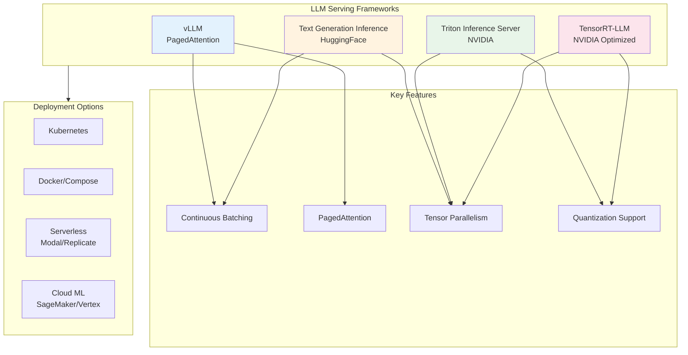
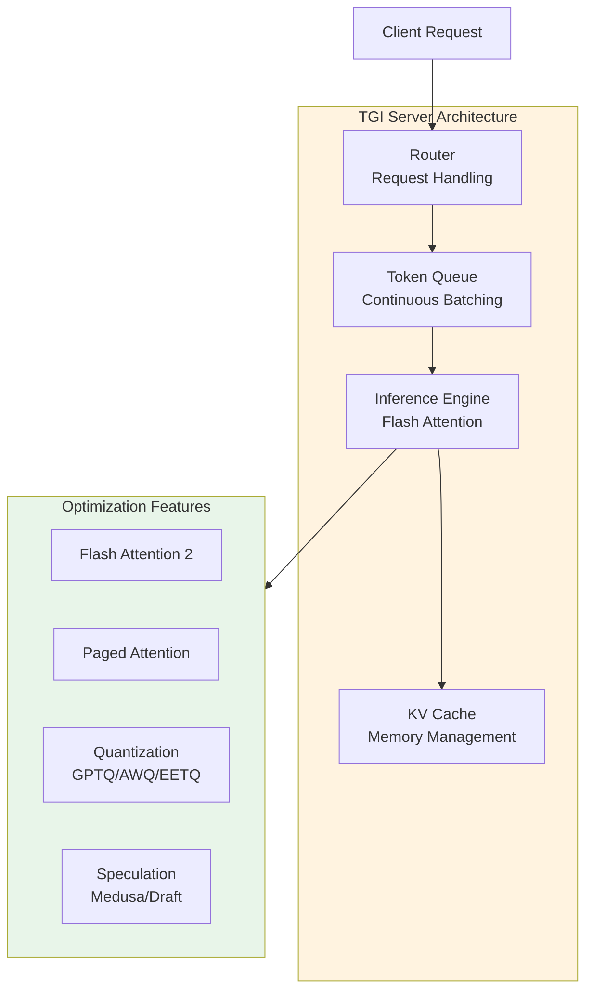
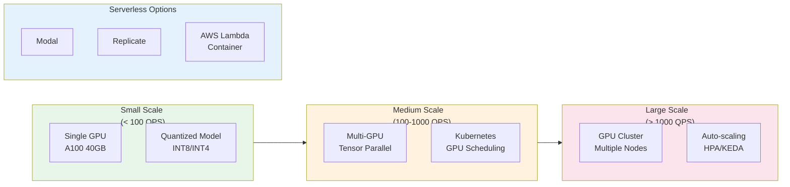

# Serving Infrastructure

## Learning Objectives

- **Compare** major LLM serving frameworks (vLLM, TGI, Triton, TensorRT-LLM) and their trade-offs
- **Deploy** LLMs using production-grade serving infrastructure with proper configuration
- **Understand** GPU provisioning strategies and serverless deployment options
- **Implement** continuous batching and memory-efficient serving techniques
- **Select** the appropriate serving solution based on workload characteristics

## Introduction

LLM serving infrastructure has evolved rapidly to address the unique challenges of transformer inference: variable-length sequences, memory-intensive KV-caches, and the need for high throughput with low latency. This module covers the leading serving frameworks and deployment patterns used in production.

::: info Key Challenge
Unlike traditional ML models, LLMs require specialized serving infrastructure due to their autoregressive nature (generating one token at a time) and massive memory requirements (KV-cache can consume more memory than model weights).
:::

## Serving Framework Landscape



## vLLM: High-Throughput Serving

vLLM is an open-source library for fast LLM inference, known for its PagedAttention algorithm that achieves near-zero memory waste.

### Key Features

- **PagedAttention**: Memory-efficient attention mechanism inspired by OS virtual memory
- **Continuous Batching**: Dynamically batches requests for optimal GPU utilization
- **Speculative Decoding**: Support for draft model acceleration
- **Quantization**: AWQ, GPTQ, and SqueezeLLM support

### vLLM Deployment Configuration

```python
# vllm_server.py - Production vLLM deployment
from vllm import LLM, SamplingParams
from vllm.entrypoints.openai.api_server import app
import uvicorn

# Configuration for production deployment
VLLM_CONFIG = {
    "model": "meta-llama/Llama-2-70b-chat-hf",
    "tensor_parallel_size": 4,  # Number of GPUs for tensor parallelism
    "gpu_memory_utilization": 0.9,  # Reserve 10% for KV-cache growth
    "max_num_seqs": 256,  # Maximum concurrent sequences
    "max_num_batched_tokens": 32768,  # Maximum tokens per batch
    "trust_remote_code": True,
    "dtype": "float16",
    "quantization": "awq",  # Optional: enable quantization
}

# Initialize vLLM engine
llm = LLM(**VLLM_CONFIG)

# Sampling parameters for inference
sampling_params = SamplingParams(
    temperature=0.7,
    top_p=0.95,
    max_tokens=2048,
    stop=["</s>", "[INST]"],
)

def generate(prompts: list[str]) -> list[str]:
    """Generate completions for a batch of prompts."""
    outputs = llm.generate(prompts, sampling_params)
    return [output.outputs[0].text for output in outputs]
```

### Docker Compose for vLLM

```yaml
# docker-compose.vllm.yaml
version: '3.8'

services:
  vllm:
    image: vllm/vllm-openai:latest
    runtime: nvidia
    ports:
      - "8000:8000"
    environment:
      - HUGGING_FACE_HUB_TOKEN=${HF_TOKEN}
    volumes:
      - ~/.cache/huggingface:/root/.cache/huggingface
    command: >
      --model meta-llama/Llama-2-70b-chat-hf
      --tensor-parallel-size 4
      --gpu-memory-utilization 0.9
      --max-num-seqs 256
      --api-key ${VLLM_API_KEY}
    deploy:
      resources:
        reservations:
          devices:
            - driver: nvidia
              count: 4
              capabilities: [gpu]
    healthcheck:
      test: ["CMD", "curl", "-f", "http://localhost:8000/health"]
      interval: 30s
      timeout: 10s
      retries: 3
```

## Text Generation Inference (TGI)

HuggingFace's TGI is a production-ready inference server optimized for text generation models.

### TGI Architecture



### TGI Docker Deployment

```yaml
# docker-compose.tgi.yaml
version: '3.8'

services:
  tgi:
    image: ghcr.io/huggingface/text-generation-inference:latest
    runtime: nvidia
    ports:
      - "8080:80"
    environment:
      - HUGGING_FACE_HUB_TOKEN=${HF_TOKEN}
      - MODEL_ID=meta-llama/Llama-2-70b-chat-hf
      - NUM_SHARD=4
      - MAX_INPUT_LENGTH=4096
      - MAX_TOTAL_TOKENS=8192
      - MAX_BATCH_PREFILL_TOKENS=16384
      - MAX_CONCURRENT_REQUESTS=128
      - QUANTIZE=awq
      - CUDA_MEMORY_FRACTION=0.9
    volumes:
      - ./data:/data
    deploy:
      resources:
        reservations:
          devices:
            - driver: nvidia
              count: 4
              capabilities: [gpu]
    shm_size: '1g'
```

### TGI Python Client

```python
# tgi_client.py - Production TGI client
from huggingface_hub import InferenceClient
import asyncio
from typing import AsyncGenerator

class TGIClient:
    def __init__(self, endpoint: str, token: str = None):
        self.client = InferenceClient(endpoint, token=token)

    def generate(
        self,
        prompt: str,
        max_new_tokens: int = 512,
        temperature: float = 0.7,
        top_p: float = 0.95,
        repetition_penalty: float = 1.1,
    ) -> str:
        """Synchronous generation."""
        return self.client.text_generation(
            prompt,
            max_new_tokens=max_new_tokens,
            temperature=temperature,
            top_p=top_p,
            repetition_penalty=repetition_penalty,
        )

    async def stream_generate(
        self,
        prompt: str,
        max_new_tokens: int = 512,
    ) -> AsyncGenerator[str, None]:
        """Streaming generation for real-time responses."""
        for token in self.client.text_generation(
            prompt,
            max_new_tokens=max_new_tokens,
            stream=True,
        ):
            yield token

# Usage example
client = TGIClient("http://localhost:8080")
response = client.generate("Explain quantum computing in simple terms:")
```

## NVIDIA Triton Inference Server

Triton is NVIDIA's enterprise-grade inference server supporting multiple frameworks and models.

### Triton Model Repository Structure

```
model_repository/
├── llama-70b/
│   ├── config.pbtxt
│   ├── 1/
│   │   └── model.plan  # TensorRT engine
│   └── tokenizer/
│       ├── tokenizer.json
│       └── tokenizer_config.json
└── ensemble_model/
    ├── config.pbtxt
    └── 1/
        └── (empty for ensemble)
```

### Triton Configuration

```protobuf
# config.pbtxt - Triton model configuration
name: "llama-70b"
platform: "tensorrt_llm"
max_batch_size: 64

input [
  {
    name: "input_ids"
    data_type: TYPE_INT32
    dims: [-1]  # Variable sequence length
  },
  {
    name: "input_lengths"
    data_type: TYPE_INT32
    dims: [1]
  },
  {
    name: "request_output_len"
    data_type: TYPE_INT32
    dims: [1]
  }
]

output [
  {
    name: "output_ids"
    data_type: TYPE_INT32
    dims: [-1]
  }
]

instance_group [
  {
    count: 1
    kind: KIND_GPU
    gpus: [0, 1, 2, 3]
  }
]

parameters {
  key: "gpt_model_type"
  value: { string_value: "llama" }
}

parameters {
  key: "gpt_model_path"
  value: { string_value: "/models/llama-70b/1/" }
}

dynamic_batching {
  preferred_batch_size: [8, 16, 32]
  max_queue_delay_microseconds: 100000
}
```

## TensorRT-LLM

NVIDIA's TensorRT-LLM provides the highest performance for NVIDIA GPUs through deep optimization.

### Building TensorRT-LLM Engine

```python
# build_trtllm_engine.py
import tensorrt_llm
from tensorrt_llm.builder import Builder
from tensorrt_llm.models import LLaMAForCausalLM
from tensorrt_llm.quantization import QuantMode

def build_llama_engine(
    hf_model_dir: str,
    output_dir: str,
    tp_size: int = 4,
    pp_size: int = 1,
    dtype: str = "float16",
    quantization: str = None,
):
    """Build optimized TensorRT-LLM engine for LLaMA."""

    # Configure quantization
    quant_mode = QuantMode(0)
    if quantization == "int8":
        quant_mode = QuantMode.use_smooth_quant()
    elif quantization == "int4":
        quant_mode = QuantMode.use_weight_only(use_int4_weights=True)

    # Build configuration
    builder_config = {
        "name": "llama",
        "precision": dtype,
        "tensor_parallel": tp_size,
        "pipeline_parallel": pp_size,
        "max_batch_size": 64,
        "max_input_len": 4096,
        "max_output_len": 2048,
        "max_beam_width": 1,
        "use_gpt_attention_plugin": dtype,
        "use_gemm_plugin": dtype,
        "use_rmsnorm_plugin": dtype,
        "enable_context_fmha": True,
        "use_paged_context_fmha": True,
        "tokens_per_block": 64,
        "quant_mode": quant_mode,
    }

    # Build and save engine
    builder = Builder()
    engine = builder.build_engine(
        LLaMAForCausalLM.from_hugging_face(hf_model_dir),
        builder_config,
    )

    engine.save(output_dir)
    return engine

# Build command example
if __name__ == "__main__":
    build_llama_engine(
        hf_model_dir="/models/Llama-2-70b-chat-hf",
        output_dir="/engines/llama-70b-tp4",
        tp_size=4,
        quantization="int8",
    )
```

## GPU Provisioning Strategies



### GPU Selection Guide

```python
# gpu_provisioning.py - GPU selection helper
from dataclasses import dataclass
from enum import Enum

class GPUType(Enum):
    A100_40GB = "a100-40gb"
    A100_80GB = "a100-80gb"
    H100_80GB = "h100-80gb"
    L40S = "l40s"
    A10G = "a10g"

@dataclass
class GPUConfig:
    gpu_type: GPUType
    memory_gb: int
    fp16_tflops: float
    cost_per_hour: float  # Approximate cloud cost

GPU_SPECS = {
    GPUType.A100_40GB: GPUConfig(GPUType.A100_40GB, 40, 312, 3.50),
    GPUType.A100_80GB: GPUConfig(GPUType.A100_80GB, 80, 312, 5.00),
    GPUType.H100_80GB: GPUConfig(GPUType.H100_80GB, 80, 990, 8.00),
    GPUType.L40S: GPUConfig(GPUType.L40S, 48, 362, 2.50),
    GPUType.A10G: GPUConfig(GPUType.A10G, 24, 125, 1.20),
}

def estimate_gpu_requirements(
    model_params_billions: float,
    precision: str = "float16",
    max_batch_size: int = 32,
    max_seq_len: int = 4096,
) -> dict:
    """Estimate GPU requirements for a model."""

    # Bytes per parameter
    bytes_per_param = {"float32": 4, "float16": 2, "int8": 1, "int4": 0.5}

    # Model weight memory
    weight_memory_gb = (
        model_params_billions * 1e9 * bytes_per_param[precision]
    ) / (1024**3)

    # KV cache memory estimate (per token per layer)
    # Assumes 2 * hidden_size * num_layers * 2 (K and V) * batch_size * seq_len
    kv_cache_gb = (
        max_batch_size * max_seq_len * model_params_billions * 0.05
    )  # Rough estimate

    # Total memory needed
    total_memory_gb = weight_memory_gb + kv_cache_gb

    # Find suitable GPUs
    suitable_gpus = []
    for gpu_type, spec in GPU_SPECS.items():
        num_gpus = max(1, int(total_memory_gb / (spec.memory_gb * 0.9)))
        if num_gpus <= 8:  # Practical limit
            suitable_gpus.append({
                "gpu_type": gpu_type.value,
                "num_gpus": num_gpus,
                "cost_per_hour": spec.cost_per_hour * num_gpus,
            })

    return {
        "model_memory_gb": round(weight_memory_gb, 2),
        "kv_cache_gb": round(kv_cache_gb, 2),
        "total_memory_gb": round(total_memory_gb, 2),
        "recommended_configs": sorted(suitable_gpus, key=lambda x: x["cost_per_hour"]),
    }

# Example usage
if __name__ == "__main__":
    requirements = estimate_gpu_requirements(
        model_params_billions=70,
        precision="float16",
        max_batch_size=32,
        max_seq_len=4096,
    )
    print(f"Memory requirements: {requirements}")
```

## Serverless LLM Deployment

### Modal Deployment

```python
# modal_deploy.py - Serverless LLM with Modal
import modal

app = modal.App("llm-serving")

# Define the container image
vllm_image = (
    modal.Image.debian_slim(python_version="3.10")
    .pip_install("vllm", "torch", "transformers")
    .env({"HF_TOKEN": modal.Secret.from_name("huggingface-token")})
)

@app.cls(
    image=vllm_image,
    gpu=modal.gpu.A100(count=2, memory=80),
    container_idle_timeout=300,
    allow_concurrent_inputs=100,
)
class LLMServer:
    @modal.enter()
    def load_model(self):
        from vllm import LLM
        self.llm = LLM(
            model="meta-llama/Llama-2-70b-chat-hf",
            tensor_parallel_size=2,
            gpu_memory_utilization=0.9,
        )

    @modal.method()
    def generate(self, prompt: str, max_tokens: int = 512) -> str:
        from vllm import SamplingParams
        params = SamplingParams(max_tokens=max_tokens, temperature=0.7)
        outputs = self.llm.generate([prompt], params)
        return outputs[0].outputs[0].text

    @modal.web_endpoint(method="POST")
    def api(self, request: dict) -> dict:
        response = self.generate(
            request["prompt"],
            request.get("max_tokens", 512)
        )
        return {"response": response}

# Deploy with: modal deploy modal_deploy.py
```

## Framework Comparison

| Feature | vLLM | TGI | Triton | TensorRT-LLM |
|---------|------|-----|--------|--------------|
| **Ease of Use** | High | High | Medium | Low |
| **Performance** | Very High | High | Very High | Highest |
| **Quantization** | AWQ, GPTQ | AWQ, GPTQ, EETQ | All | INT8, INT4, FP8 |
| **Multi-GPU** | Tensor Parallel | Tensor Parallel | Both | Both |
| **Continuous Batching** | Yes | Yes | Yes | Yes |
| **OpenAI API Compatible** | Yes | Yes | With wrapper | With wrapper |
| **Production Ready** | Yes | Yes | Yes | Yes |
| **Best For** | General use | HuggingFace models | Enterprise | Max performance |

## Interview Q&A

### Question 1: When would you choose vLLM over TGI for production deployment?

**Strong Answer:**
I would choose vLLM over TGI in several scenarios:

1. **Higher throughput requirements**: vLLM's PagedAttention algorithm achieves near-zero memory waste for KV-cache, allowing for more concurrent requests. In benchmarks, vLLM often achieves 2-4x higher throughput than alternatives.

2. **Memory-constrained environments**: When running large models on limited GPU memory, vLLM's paging mechanism allows efficient memory utilization without pre-allocating maximum sequence length.

3. **OpenAI API compatibility**: vLLM provides a drop-in OpenAI-compatible server, making migration easier for applications already using OpenAI's API.

4. **Speculative decoding needs**: vLLM has robust support for speculative decoding with draft models, which can significantly reduce latency for certain workloads.

However, I'd choose TGI when:
- Working primarily with HuggingFace models and wanting tight ecosystem integration
- Needing advanced features like Medusa speculation or watermarking
- Requiring HuggingFace's enterprise support

### Question 2: Explain how continuous batching improves LLM serving efficiency compared to static batching.

**Strong Answer:**
Continuous batching (also called iteration-level batching) is a breakthrough technique that dramatically improves GPU utilization:

**Static Batching Problems:**
- Requests are batched together and processed until ALL complete
- Fast requests (short outputs) must wait for slow requests (long outputs)
- GPU sits idle while waiting for the slowest request
- Throughput is limited by the longest sequence in the batch

**Continuous Batching Solution:**
- Requests can enter and exit the batch at any iteration
- When a request finishes, a new request can immediately take its slot
- GPU utilization remains high throughout processing
- Memory is dynamically allocated per iteration

**Example scenario:**
- Batch of 8 requests: 7 finish in 50 tokens, 1 needs 500 tokens
- Static: All 8 slots occupied for 500 iterations, 7 slots wasted for 450 iterations
- Continuous: After 50 iterations, 7 new requests can start, achieving ~10x better throughput

This is why frameworks like vLLM and TGI achieve much higher throughput than naive batching implementations.

### Question 3: How would you design GPU provisioning for a service with variable load patterns?

**Strong Answer:**
For variable load patterns, I'd implement a multi-tier provisioning strategy:

**1. Baseline Capacity (Always-on):**
- Provision GPUs for average load (e.g., P50 traffic)
- Use reserved instances for cost efficiency
- Example: 4x A100 GPUs for steady-state 100 QPS

**2. Auto-scaling Layer:**
- Configure HPA/KEDA for CPU/memory/custom metrics
- Scale based on queue depth and latency percentiles
- Target: Scale up when P95 latency exceeds SLO
- Scale down when GPU utilization drops below 50%

**3. Burst Handling:**
- Serverless overflow (Modal, AWS Lambda) for traffic spikes
- Queue-based admission control to prevent overload
- Graceful degradation: shorter max tokens during peaks

**4. Multi-region Distribution:**
- Route traffic to nearest region
- Spillover to other regions during local peaks
- Reduces single-region GPU requirements

**Monitoring triggers:**
- Scale up: queue_depth > 100 OR p95_latency > 2s
- Scale down: gpu_utilization < 40% for 10 minutes

This approach balances cost (avoiding over-provisioning) with reliability (meeting SLOs during traffic spikes).

## Summary

| Aspect | Recommendation |
|--------|---------------|
| **General Purpose** | vLLM - best balance of performance and ease of use |
| **HuggingFace Models** | TGI - tight integration, enterprise support |
| **Maximum Performance** | TensorRT-LLM - requires more setup, highest throughput |
| **Enterprise/Multi-model** | Triton - supports multiple frameworks, battle-tested |
| **Serverless** | Modal/Replicate - pay-per-use, auto-scaling |
| **Small Scale** | Single GPU with quantization (AWQ/GPTQ) |
| **Large Scale** | Multi-GPU with tensor parallelism, Kubernetes |

## Sources

- [vLLM: Easy, Fast, and Cheap LLM Serving](https://docs.vllm.ai/)
- [PagedAttention Paper](https://arxiv.org/abs/2309.06180)
- [HuggingFace TGI Documentation](https://huggingface.co/docs/text-generation-inference)
- [NVIDIA Triton Inference Server](https://developer.nvidia.com/triton-inference-server)
- [TensorRT-LLM](https://github.com/NVIDIA/TensorRT-LLM)
- [Modal Documentation](https://modal.com/docs)
- [Continuous Batching Explained - Anyscale](https://www.anyscale.com/blog/continuous-batching-llm-inference)
