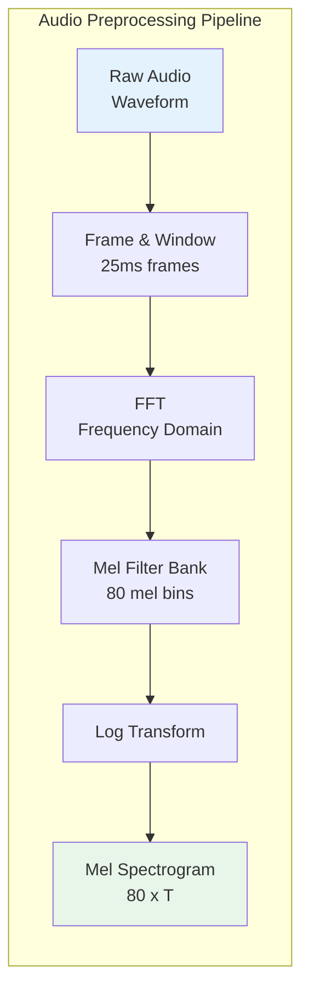
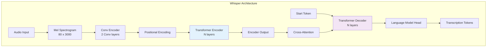
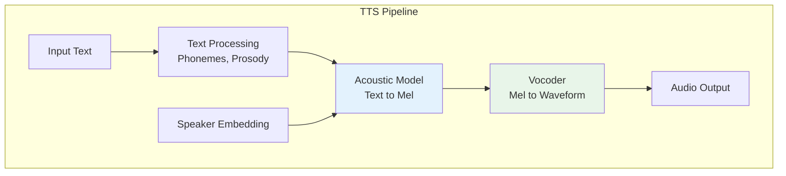

# Audio Models

> **Speech recognition, synthesis, and audio understanding with modern AI**

---

## Learning Objectives

- Understand Whisper's encoder-decoder architecture for speech recognition
- Explain how audio is preprocessed into mel spectrograms
- Describe text-to-speech (TTS) architectures and voice synthesis
- Implement basic audio transcription and synthesis pipelines
- Understand voice cloning techniques and their ethical considerations

---

## Introduction

Audio AI has made remarkable progress, from Whisper's robust speech recognition to natural-sounding text-to-speech systems. Understanding these systems requires knowledge of audio preprocessing, sequence-to-sequence modeling, and the unique challenges of temporal audio data.

::: info Interview Relevance
Audio models are increasingly common in AI interviews, especially for companies building voice assistants, transcription services, or multimedia applications. Focus on understanding mel spectrograms, encoder-decoder architectures, and the challenges of real-time audio processing.
:::

---

## Audio Preprocessing

### From Waveform to Spectrogram



### Implementation

```python
import torch
import torchaudio
import numpy as np

class AudioPreprocessor:
    """
    Convert raw audio waveforms to mel spectrograms.
    """

    def __init__(
        self,
        sample_rate: int = 16000,
        n_fft: int = 400,  # 25ms at 16kHz
        hop_length: int = 160,  # 10ms stride
        n_mels: int = 80,
        max_duration: float = 30.0  # Max audio length in seconds
    ):
        self.sample_rate = sample_rate
        self.n_fft = n_fft
        self.hop_length = hop_length
        self.n_mels = n_mels
        self.max_frames = int(max_duration * sample_rate / hop_length)

        # Mel spectrogram transform
        self.mel_transform = torchaudio.transforms.MelSpectrogram(
            sample_rate=sample_rate,
            n_fft=n_fft,
            hop_length=hop_length,
            n_mels=n_mels,
            f_min=0.0,
            f_max=8000.0
        )

    def load_audio(self, audio_path: str) -> torch.Tensor:
        """Load and resample audio to target sample rate."""
        waveform, sr = torchaudio.load(audio_path)

        # Resample if necessary
        if sr != self.sample_rate:
            resampler = torchaudio.transforms.Resample(sr, self.sample_rate)
            waveform = resampler(waveform)

        # Convert to mono
        if waveform.shape[0] > 1:
            waveform = waveform.mean(dim=0, keepdim=True)

        return waveform

    def waveform_to_mel(self, waveform: torch.Tensor) -> torch.Tensor:
        """
        Convert waveform to log mel spectrogram.

        Args:
            waveform: [1, samples] audio tensor

        Returns:
            Log mel spectrogram [n_mels, time_frames]
        """
        # Compute mel spectrogram
        mel_spec = self.mel_transform(waveform)

        # Log transform (add small epsilon for numerical stability)
        log_mel = torch.log(mel_spec.clamp(min=1e-10))

        # Normalize
        log_mel = (log_mel - log_mel.mean()) / (log_mel.std() + 1e-6)

        return log_mel.squeeze(0)

    def process(self, audio_path: str) -> torch.Tensor:
        """Full preprocessing pipeline."""
        waveform = self.load_audio(audio_path)
        mel_spec = self.waveform_to_mel(waveform)

        # Pad or truncate to max length
        if mel_spec.shape[1] > self.max_frames:
            mel_spec = mel_spec[:, :self.max_frames]
        elif mel_spec.shape[1] < self.max_frames:
            padding = torch.zeros(self.n_mels, self.max_frames - mel_spec.shape[1])
            mel_spec = torch.cat([mel_spec, padding], dim=1)

        return mel_spec


# Example usage
preprocessor = AudioPreprocessor()
# mel_spec = preprocessor.process("audio.wav")
# print(f"Mel spectrogram shape: {mel_spec.shape}")  # [80, 3000] for 30s
```

---

## Whisper Architecture

Whisper is OpenAI's robust speech recognition model, trained on 680,000 hours of multilingual data.



### Whisper Implementation

```python
import torch
import torch.nn as nn
import torch.nn.functional as F

class WhisperEncoder(nn.Module):
    """
    Whisper-style audio encoder.
    """

    def __init__(
        self,
        n_mels: int = 80,
        n_ctx: int = 1500,  # Max context length
        n_state: int = 512,  # Model dimension
        n_head: int = 8,
        n_layer: int = 6
    ):
        super().__init__()

        # Convolutional frontend
        self.conv1 = nn.Conv1d(n_mels, n_state, kernel_size=3, padding=1)
        self.conv2 = nn.Conv1d(n_state, n_state, kernel_size=3, stride=2, padding=1)

        # Positional embedding (learned)
        self.positional_embedding = nn.Embedding(n_ctx, n_state)

        # Transformer encoder layers
        encoder_layer = nn.TransformerEncoderLayer(
            d_model=n_state,
            nhead=n_head,
            dim_feedforward=n_state * 4,
            batch_first=True,
            norm_first=True
        )
        self.encoder = nn.TransformerEncoder(encoder_layer, n_layer)

        self.ln_post = nn.LayerNorm(n_state)

    def forward(self, mel: torch.Tensor) -> torch.Tensor:
        """
        Args:
            mel: [batch, n_mels, time] mel spectrogram

        Returns:
            Encoder output [batch, time/2, n_state]
        """
        # Convolutional frontend
        x = F.gelu(self.conv1(mel))
        x = F.gelu(self.conv2(x))

        # [batch, n_state, time/2] -> [batch, time/2, n_state]
        x = x.permute(0, 2, 1)

        # Add positional embeddings
        seq_len = x.shape[1]
        positions = torch.arange(seq_len, device=x.device)
        x = x + self.positional_embedding(positions)

        # Transformer encoder
        x = self.encoder(x)
        x = self.ln_post(x)

        return x


class WhisperDecoder(nn.Module):
    """
    Whisper-style text decoder with cross-attention to audio.
    """

    def __init__(
        self,
        vocab_size: int = 51865,
        n_ctx: int = 448,  # Max text context
        n_state: int = 512,
        n_head: int = 8,
        n_layer: int = 6
    ):
        super().__init__()

        self.token_embedding = nn.Embedding(vocab_size, n_state)
        self.positional_embedding = nn.Embedding(n_ctx, n_state)

        # Decoder layers with cross-attention
        self.layers = nn.ModuleList([
            nn.TransformerDecoderLayer(
                d_model=n_state,
                nhead=n_head,
                dim_feedforward=n_state * 4,
                batch_first=True,
                norm_first=True
            )
            for _ in range(n_layer)
        ])

        self.ln = nn.LayerNorm(n_state)

    def forward(
        self,
        tokens: torch.Tensor,
        encoder_output: torch.Tensor
    ) -> torch.Tensor:
        """
        Args:
            tokens: [batch, seq_len] input tokens
            encoder_output: [batch, audio_len, n_state] encoder output

        Returns:
            Decoder output [batch, seq_len, n_state]
        """
        seq_len = tokens.shape[1]

        # Token + positional embeddings
        positions = torch.arange(seq_len, device=tokens.device)
        x = self.token_embedding(tokens) + self.positional_embedding(positions)

        # Causal mask for autoregressive decoding
        causal_mask = torch.triu(
            torch.ones(seq_len, seq_len, device=x.device) * float('-inf'),
            diagonal=1
        )

        # Decoder layers
        for layer in self.layers:
            x = layer(x, encoder_output, tgt_mask=causal_mask)

        x = self.ln(x)

        return x


class WhisperModel(nn.Module):
    """Complete Whisper model."""

    def __init__(self, vocab_size: int = 51865, n_state: int = 512):
        super().__init__()
        self.encoder = WhisperEncoder(n_state=n_state)
        self.decoder = WhisperDecoder(vocab_size=vocab_size, n_state=n_state)
        self.proj = nn.Linear(n_state, vocab_size, bias=False)

    def forward(
        self,
        mel: torch.Tensor,
        tokens: torch.Tensor
    ) -> torch.Tensor:
        encoder_output = self.encoder(mel)
        decoder_output = self.decoder(tokens, encoder_output)
        logits = self.proj(decoder_output)
        return logits
```

### Using Whisper for Transcription

```python
import whisper

def transcribe_audio(
    audio_path: str,
    model_size: str = "base",
    language: str = None,
    task: str = "transcribe"  # or "translate" for any->English
) -> dict:
    """
    Transcribe audio using Whisper.

    Args:
        audio_path: Path to audio file
        model_size: tiny, base, small, medium, large
        language: Optional language code (auto-detected if None)
        task: "transcribe" or "translate"

    Returns:
        Dictionary with text and segments
    """
    model = whisper.load_model(model_size)

    result = model.transcribe(
        audio_path,
        language=language,
        task=task,
        verbose=False
    )

    return {
        "text": result["text"],
        "segments": [
            {
                "start": seg["start"],
                "end": seg["end"],
                "text": seg["text"]
            }
            for seg in result["segments"]
        ],
        "language": result["language"]
    }


# Example
# result = transcribe_audio("meeting.mp3", model_size="medium")
# print(result["text"])
```

---

## Text-to-Speech (TTS)

### Modern TTS Architecture



### TTS with Coqui TTS

```python
from TTS.api import TTS

def synthesize_speech(
    text: str,
    model_name: str = "tts_models/en/ljspeech/tacotron2-DDC",
    output_path: str = "output.wav"
) -> str:
    """
    Synthesize speech from text.

    Args:
        text: Text to convert to speech
        model_name: TTS model to use
        output_path: Path to save audio

    Returns:
        Path to generated audio file
    """
    tts = TTS(model_name=model_name)
    tts.tts_to_file(text=text, file_path=output_path)
    return output_path


def synthesize_with_voice_cloning(
    text: str,
    reference_audio: str,
    output_path: str = "cloned_output.wav"
) -> str:
    """
    Synthesize speech with voice cloning from a reference sample.
    """
    # Use a model that supports voice cloning
    tts = TTS(model_name="tts_models/multilingual/multi-dataset/your_tts")

    tts.tts_to_file(
        text=text,
        file_path=output_path,
        speaker_wav=reference_audio,
        language="en"
    )

    return output_path
```

### Tacotron 2 Architecture

```python
class Tacotron2Encoder(nn.Module):
    """
    Tacotron 2 style text encoder.
    Character embeddings -> Conv layers -> BiLSTM
    """

    def __init__(
        self,
        vocab_size: int = 256,
        embedding_dim: int = 512,
        encoder_dim: int = 256,
        n_convolutions: int = 3,
        kernel_size: int = 5
    ):
        super().__init__()

        self.embedding = nn.Embedding(vocab_size, embedding_dim)

        # Convolutional layers
        convolutions = []
        for i in range(n_convolutions):
            in_channels = embedding_dim if i == 0 else encoder_dim
            conv_layer = nn.Sequential(
                nn.Conv1d(
                    in_channels, encoder_dim, kernel_size,
                    padding=kernel_size // 2
                ),
                nn.BatchNorm1d(encoder_dim),
                nn.ReLU(),
                nn.Dropout(0.5)
            )
            convolutions.append(conv_layer)
        self.convolutions = nn.ModuleList(convolutions)

        # Bidirectional LSTM
        self.lstm = nn.LSTM(
            encoder_dim, encoder_dim // 2,
            batch_first=True, bidirectional=True
        )

    def forward(self, text: torch.Tensor) -> torch.Tensor:
        """
        Args:
            text: [batch, seq_len] character indices

        Returns:
            Encoder output [batch, seq_len, encoder_dim]
        """
        # Embedding
        x = self.embedding(text)  # [batch, seq_len, embedding_dim]

        # Conv layers expect [batch, channels, seq_len]
        x = x.transpose(1, 2)
        for conv in self.convolutions:
            x = conv(x)
        x = x.transpose(1, 2)

        # BiLSTM
        x, _ = self.lstm(x)

        return x
```

---

## Voice Cloning

### Speaker Encoder

```python
class SpeakerEncoder(nn.Module):
    """
    Extract speaker embeddings from reference audio.
    Similar to architecture used in SV2TTS.
    """

    def __init__(
        self,
        n_mels: int = 40,
        hidden_size: int = 256,
        embedding_size: int = 256,
        n_layers: int = 3
    ):
        super().__init__()

        self.lstm = nn.LSTM(
            n_mels, hidden_size,
            num_layers=n_layers, batch_first=True
        )
        self.linear = nn.Linear(hidden_size, embedding_size)

    def forward(self, mel: torch.Tensor) -> torch.Tensor:
        """
        Args:
            mel: [batch, n_mels, time] mel spectrogram

        Returns:
            Speaker embedding [batch, embedding_size]
        """
        # LSTM processes time dimension
        x = mel.transpose(1, 2)  # [batch, time, n_mels]
        _, (hidden, _) = self.lstm(x)

        # Use final hidden state
        embedding = self.linear(hidden[-1])

        # L2 normalize
        embedding = F.normalize(embedding, p=2, dim=-1)

        return embedding


def compute_speaker_similarity(emb1: torch.Tensor, emb2: torch.Tensor) -> float:
    """Compute cosine similarity between speaker embeddings."""
    return F.cosine_similarity(emb1, emb2, dim=-1).item()
```

::: warning Ethical Considerations
Voice cloning technology can be misused for fraud, impersonation, or creating non-consensual content. Always:
- Obtain consent before cloning someone's voice
- Implement safeguards to prevent misuse
- Consider watermarking synthesized audio
- Follow platform guidelines and regulations
:::

---

## Audio Understanding

Beyond transcription, audio models can understand and analyze audio content.

```python
from transformers import Wav2Vec2Processor, Wav2Vec2ForSequenceClassification

def classify_emotion(audio_path: str) -> dict:
    """
    Classify emotion from speech audio.
    """
    processor = Wav2Vec2Processor.from_pretrained(
        "superb/wav2vec2-base-superb-er"
    )
    model = Wav2Vec2ForSequenceClassification.from_pretrained(
        "superb/wav2vec2-base-superb-er"
    )

    # Load and process audio
    waveform, sample_rate = torchaudio.load(audio_path)

    # Resample to 16kHz if needed
    if sample_rate != 16000:
        resampler = torchaudio.transforms.Resample(sample_rate, 16000)
        waveform = resampler(waveform)

    # Process
    inputs = processor(
        waveform.squeeze().numpy(),
        sampling_rate=16000,
        return_tensors="pt"
    )

    with torch.no_grad():
        logits = model(**inputs).logits

    predicted_id = torch.argmax(logits, dim=-1).item()
    emotions = ["angry", "happy", "neutral", "sad"]

    probs = F.softmax(logits, dim=-1).squeeze()
    return {emotion: prob.item() for emotion, prob in zip(emotions, probs)}


def detect_speaker_changes(audio_path: str) -> list[float]:
    """
    Detect timestamps where speaker changes occur (diarization).
    Uses pyannote.audio for speaker diarization.
    """
    from pyannote.audio import Pipeline

    pipeline = Pipeline.from_pretrained(
        "pyannote/speaker-diarization",
        use_auth_token="YOUR_TOKEN"
    )

    diarization = pipeline(audio_path)

    # Extract speaker change points
    changes = []
    previous_speaker = None
    for turn, _, speaker in diarization.itertracks(yield_label=True):
        if speaker != previous_speaker and previous_speaker is not None:
            changes.append(turn.start)
        previous_speaker = speaker

    return changes
```

---

## Interview Q&A

### Question 1: How does Whisper handle multiple languages and what is the "translate" task?

**Strong Answer:**

Whisper is trained on 680,000 hours of multilingual and multitask data. It handles multiple languages through:

1. **Special tokens**: The model uses special tokens to specify the task:
   - `<|startoftranscript|>` - Begin transcription
   - `<|en|>`, `<|zh|>`, etc. - Language tokens
   - `<|transcribe|>` vs `<|translate|>` - Task tokens
   - `<|notimestamps|>` or timestamp tokens

2. **Language detection**: If no language is specified, Whisper first predicts the language from the audio, then uses that language token.

3. **Transcribe vs Translate**:
   - **Transcribe**: Output text in the same language as the audio (Spanish audio -> Spanish text)
   - **Translate**: Output English text regardless of input language (Spanish audio -> English text)

The translate task was trained by pairing non-English audio with English text, enabling Whisper to perform speech translation in a single step rather than cascading ASR + MT systems. This is more robust to ASR errors that would propagate through a cascade.

---

### Question 2: What are mel spectrograms and why are they used instead of raw waveforms?

**Strong Answer:**

A mel spectrogram is a time-frequency representation of audio that mimics human auditory perception:

1. **Creation process**:
   - Split audio into overlapping frames (typically 25ms with 10ms stride)
   - Apply FFT to each frame to get frequency content
   - Apply mel filter bank (triangular filters spaced on mel scale)
   - Take log of the result

2. **Why mel scale**: The mel scale is perceptually motivated - humans perceive frequency differences logarithmically (the difference between 100Hz and 200Hz sounds similar to 1000Hz and 2000Hz).

3. **Advantages over raw waveforms**:
   - **Dimensionality reduction**: 16kHz audio has 16,000 samples/second vs ~100 mel frames/second
   - **Perceptual relevance**: Captures what humans actually hear
   - **Translation invariance**: Similar sounds produce similar spectrograms regardless of exact timing
   - **Noise robustness**: Irrelevant high-frequency noise is downweighted

4. **Trade-off**: Some information is lost (exact phase), but this is generally imperceptible and the computational benefits are significant.

---

### Question 3: How does voice cloning work at a high level?

**Strong Answer:**

Voice cloning typically involves a three-stage architecture:

1. **Speaker Encoder**: Extracts a fixed-dimensional embedding that captures the speaker's voice characteristics from reference audio. This is trained on a speaker verification task (is this the same speaker?) using a triplet or contrastive loss.

2. **Synthesizer (TTS)**: A text-to-mel model (like Tacotron 2) conditioned on the speaker embedding. The embedding modulates the synthesis process to produce mel spectrograms that sound like the target speaker.

3. **Vocoder**: Converts mel spectrograms to waveforms. Neural vocoders (WaveNet, HiFi-GAN) produce high-quality audio.

**Key techniques**:
- **Few-shot cloning**: Works with 5-30 seconds of reference audio
- **Zero-shot cloning**: Newer models can clone from just a few seconds without fine-tuning
- **Embedding interpolation**: Can create new voices by interpolating speaker embeddings

**Challenges**:
- Preserving prosody and speaking style
- Handling out-of-distribution text (words the speaker never said)
- Maintaining quality with limited reference audio

---

## Summary Table

| Model | Type | Key Features | Use Case |
|-------|------|--------------|----------|
| Whisper | ASR | Multilingual, robust, multitask | Transcription, translation |
| Wav2Vec2 | Self-supervised | Pre-trained representations | Fine-tuning for various tasks |
| Tacotron 2 | TTS | Attention-based synthesis | Text to speech |
| HiFi-GAN | Vocoder | High-quality waveform generation | Mel to audio |
| SpeechT5 | Unified | Speech + text in one model | Multiple speech tasks |
| Bark | TTS | Generative audio model | Natural speech with emotions |

---

## Sources

- Radford, A., et al. (2022). "Robust Speech Recognition via Large-Scale Weak Supervision." (Whisper)
- Shen, J., et al. (2018). "Natural TTS Synthesis by Conditioning WaveNet on Mel Spectrogram Predictions." (Tacotron 2)
- Baevski, A., et al. (2020). "wav2vec 2.0: A Framework for Self-Supervised Learning of Speech Representations."
- Kong, J., et al. (2020). "HiFi-GAN: Generative Adversarial Networks for Efficient and High Fidelity Speech Synthesis."
- Jia, Y., et al. (2018). "Transfer Learning from Speaker Verification to Multispeaker Text-To-Speech Synthesis." (SV2TTS)
