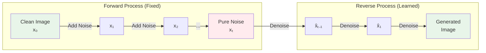
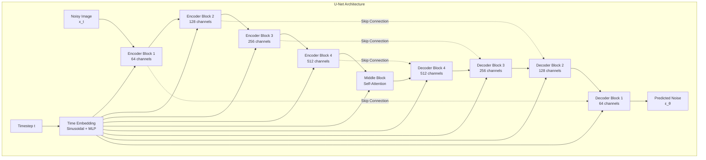
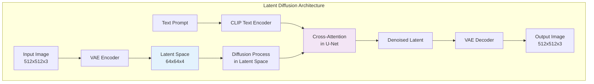

# Image Generation

> **Understanding diffusion models, architectures, and controlled generation techniques**

---

## Learning Objectives

- Explain the forward and reverse diffusion process mathematically
- Understand the U-Net architecture used in Stable Diffusion
- Describe how text conditioning guides image generation via cross-attention
- Implement ControlNets and other conditioning mechanisms
- Apply inpainting and image editing techniques

---

## Introduction

Image generation has undergone a revolution with diffusion models. Unlike GANs which suffered from training instability, or VAEs which produced blurry outputs, diffusion models generate high-quality, diverse images through an elegant denoising process.

::: info Interview Relevance
Diffusion models are a hot interview topic. Be prepared to explain the forward/reverse process, the role of the noise schedule, how text conditioning works, and the difference between pixel-space and latent-space diffusion.
:::

---

## Diffusion Process Overview



---

## Mathematical Foundation

### Forward Diffusion Process

The forward process gradually adds Gaussian noise to an image over T timesteps:

```python
import torch
import torch.nn as nn
import numpy as np

class DiffusionScheduler:
    """
    Implements the noise schedule for diffusion models.
    """

    def __init__(
        self,
        num_timesteps: int = 1000,
        beta_start: float = 0.0001,
        beta_end: float = 0.02,
        schedule: str = "linear"
    ):
        self.num_timesteps = num_timesteps

        # Define beta schedule
        if schedule == "linear":
            self.betas = torch.linspace(beta_start, beta_end, num_timesteps)
        elif schedule == "cosine":
            self.betas = self._cosine_schedule(num_timesteps)
        else:
            raise ValueError(f"Unknown schedule: {schedule}")

        # Pre-compute useful quantities
        self.alphas = 1.0 - self.betas
        self.alphas_cumprod = torch.cumprod(self.alphas, dim=0)
        self.sqrt_alphas_cumprod = torch.sqrt(self.alphas_cumprod)
        self.sqrt_one_minus_alphas_cumprod = torch.sqrt(1.0 - self.alphas_cumprod)

    def _cosine_schedule(self, num_timesteps: int, s: float = 0.008) -> torch.Tensor:
        """
        Cosine schedule as proposed in "Improved Denoising Diffusion Probabilistic Models"
        """
        steps = num_timesteps + 1
        x = torch.linspace(0, num_timesteps, steps)
        alphas_cumprod = torch.cos(((x / num_timesteps) + s) / (1 + s) * np.pi * 0.5) ** 2
        alphas_cumprod = alphas_cumprod / alphas_cumprod[0]
        betas = 1 - (alphas_cumprod[1:] / alphas_cumprod[:-1])
        return torch.clamp(betas, 0.0001, 0.9999)

    def add_noise(
        self,
        x_0: torch.Tensor,
        t: torch.Tensor,
        noise: torch.Tensor = None
    ) -> tuple[torch.Tensor, torch.Tensor]:
        """
        Forward diffusion: q(x_t | x_0) = N(x_t; sqrt(alpha_bar_t) * x_0, (1 - alpha_bar_t) * I)

        Args:
            x_0: Clean images [batch, channels, height, width]
            t: Timestep indices [batch]
            noise: Optional pre-generated noise

        Returns:
            Noisy images x_t and the noise that was added
        """
        if noise is None:
            noise = torch.randn_like(x_0)

        # Get the scaling factors for each sample in the batch
        sqrt_alpha_cumprod = self.sqrt_alphas_cumprod[t].view(-1, 1, 1, 1)
        sqrt_one_minus_alpha_cumprod = self.sqrt_one_minus_alphas_cumprod[t].view(-1, 1, 1, 1)

        # x_t = sqrt(alpha_bar_t) * x_0 + sqrt(1 - alpha_bar_t) * noise
        x_t = sqrt_alpha_cumprod * x_0 + sqrt_one_minus_alpha_cumprod * noise

        return x_t, noise


# Example: visualize noise progression
scheduler = DiffusionScheduler(num_timesteps=1000)
print(f"Alpha at t=0: {scheduler.alphas_cumprod[0]:.4f}")
print(f"Alpha at t=500: {scheduler.alphas_cumprod[500]:.4f}")
print(f"Alpha at t=999: {scheduler.alphas_cumprod[999]:.4f}")
```

### Reverse Diffusion Process

The reverse process learns to denoise:

```python
def reverse_diffusion_step(
    model: nn.Module,
    x_t: torch.Tensor,
    t: torch.Tensor,
    scheduler: DiffusionScheduler,
    clip_denoised: bool = True
) -> torch.Tensor:
    """
    Single step of reverse diffusion: p(x_{t-1} | x_t)

    The model predicts the noise, and we use this to estimate x_{t-1}
    """
    # Predict noise
    predicted_noise = model(x_t, t)

    # Get scheduler values
    alpha = scheduler.alphas[t].view(-1, 1, 1, 1)
    alpha_cumprod = scheduler.alphas_cumprod[t].view(-1, 1, 1, 1)
    alpha_cumprod_prev = scheduler.alphas_cumprod[t - 1].view(-1, 1, 1, 1)
    beta = scheduler.betas[t].view(-1, 1, 1, 1)

    # Predict x_0 from x_t and predicted noise
    x_0_pred = (x_t - torch.sqrt(1 - alpha_cumprod) * predicted_noise) / torch.sqrt(alpha_cumprod)

    if clip_denoised:
        x_0_pred = torch.clamp(x_0_pred, -1, 1)

    # Compute mean of p(x_{t-1} | x_t, x_0)
    mean = (torch.sqrt(alpha_cumprod_prev) * beta / (1 - alpha_cumprod)) * x_0_pred + \
           (torch.sqrt(alpha) * (1 - alpha_cumprod_prev) / (1 - alpha_cumprod)) * x_t

    # Add noise (except at t=0)
    variance = beta * (1 - alpha_cumprod_prev) / (1 - alpha_cumprod)
    noise = torch.randn_like(x_t)

    # x_{t-1} = mean + sqrt(variance) * noise
    x_prev = mean + torch.sqrt(variance) * noise * (t > 0).float().view(-1, 1, 1, 1)

    return x_prev
```

---

## U-Net Architecture

The U-Net is the backbone of most diffusion models, predicting noise at each timestep.



### Implementation

```python
import torch
import torch.nn as nn
import torch.nn.functional as F
import math

class SinusoidalTimeEmbedding(nn.Module):
    """
    Timestep embeddings using sinusoidal position encoding.
    """

    def __init__(self, dim: int):
        super().__init__()
        self.dim = dim

    def forward(self, t: torch.Tensor) -> torch.Tensor:
        """
        Args:
            t: Timestep indices [batch]
        Returns:
            Time embeddings [batch, dim]
        """
        device = t.device
        half_dim = self.dim // 2
        embeddings = math.log(10000) / (half_dim - 1)
        embeddings = torch.exp(torch.arange(half_dim, device=device) * -embeddings)
        embeddings = t[:, None] * embeddings[None, :]
        embeddings = torch.cat([torch.sin(embeddings), torch.cos(embeddings)], dim=-1)
        return embeddings


class ResidualBlock(nn.Module):
    """
    Residual block with time embedding injection.
    """

    def __init__(self, in_channels: int, out_channels: int, time_dim: int):
        super().__init__()

        self.conv1 = nn.Conv2d(in_channels, out_channels, 3, padding=1)
        self.conv2 = nn.Conv2d(out_channels, out_channels, 3, padding=1)

        self.time_mlp = nn.Sequential(
            nn.SiLU(),
            nn.Linear(time_dim, out_channels)
        )

        self.norm1 = nn.GroupNorm(8, in_channels)
        self.norm2 = nn.GroupNorm(8, out_channels)

        if in_channels != out_channels:
            self.shortcut = nn.Conv2d(in_channels, out_channels, 1)
        else:
            self.shortcut = nn.Identity()

    def forward(self, x: torch.Tensor, t_emb: torch.Tensor) -> torch.Tensor:
        h = self.norm1(x)
        h = F.silu(h)
        h = self.conv1(h)

        # Add time embedding
        h = h + self.time_mlp(t_emb)[:, :, None, None]

        h = self.norm2(h)
        h = F.silu(h)
        h = self.conv2(h)

        return h + self.shortcut(x)


class AttentionBlock(nn.Module):
    """
    Self-attention block for U-Net.
    """

    def __init__(self, channels: int, num_heads: int = 4):
        super().__init__()
        self.norm = nn.GroupNorm(8, channels)
        self.attention = nn.MultiheadAttention(channels, num_heads, batch_first=True)

    def forward(self, x: torch.Tensor) -> torch.Tensor:
        batch, channels, height, width = x.shape

        # Reshape for attention
        h = self.norm(x)
        h = h.view(batch, channels, -1).transpose(1, 2)  # [B, H*W, C]

        # Self-attention
        h, _ = self.attention(h, h, h)

        # Reshape back
        h = h.transpose(1, 2).view(batch, channels, height, width)

        return x + h
```

---

## Text Conditioning with Cross-Attention

Stable Diffusion uses cross-attention to condition generation on text embeddings.

```python
class CrossAttentionBlock(nn.Module):
    """
    Cross-attention for text-to-image conditioning.

    The image features (queries) attend to text embeddings (keys/values).
    """

    def __init__(
        self,
        channels: int,
        context_dim: int = 768,  # CLIP text embedding dimension
        num_heads: int = 8
    ):
        super().__init__()
        self.norm = nn.GroupNorm(8, channels)

        self.to_q = nn.Linear(channels, channels)
        self.to_k = nn.Linear(context_dim, channels)
        self.to_v = nn.Linear(context_dim, channels)
        self.to_out = nn.Linear(channels, channels)

        self.num_heads = num_heads
        self.head_dim = channels // num_heads

    def forward(
        self,
        x: torch.Tensor,
        context: torch.Tensor  # Text embeddings [batch, seq_len, context_dim]
    ) -> torch.Tensor:
        batch, channels, height, width = x.shape

        # Normalize and reshape image features
        h = self.norm(x)
        h = h.view(batch, channels, -1).transpose(1, 2)  # [B, H*W, C]

        # Project to queries, keys, values
        q = self.to_q(h)  # [B, H*W, C]
        k = self.to_k(context)  # [B, seq_len, C]
        v = self.to_v(context)  # [B, seq_len, C]

        # Reshape for multi-head attention
        q = q.view(batch, -1, self.num_heads, self.head_dim).transpose(1, 2)
        k = k.view(batch, -1, self.num_heads, self.head_dim).transpose(1, 2)
        v = v.view(batch, -1, self.num_heads, self.head_dim).transpose(1, 2)

        # Attention
        attn_weights = torch.matmul(q, k.transpose(-2, -1)) / math.sqrt(self.head_dim)
        attn_weights = F.softmax(attn_weights, dim=-1)
        out = torch.matmul(attn_weights, v)

        # Reshape and project
        out = out.transpose(1, 2).reshape(batch, -1, channels)
        out = self.to_out(out)

        # Reshape back to image
        out = out.transpose(1, 2).view(batch, channels, height, width)

        return x + out
```

---

## Latent Diffusion (Stable Diffusion)



::: tip Why Latent Space?
Operating in latent space (64x64x4 instead of 512x512x3) reduces computation by ~48x while preserving perceptual quality. The VAE compresses images to a learned representation where diffusion is more efficient.
:::

### Stable Diffusion Pipeline

```python
from diffusers import StableDiffusionPipeline, DPMSolverMultistepScheduler
import torch

def generate_image(
    prompt: str,
    negative_prompt: str = "",
    num_inference_steps: int = 25,
    guidance_scale: float = 7.5,
    seed: int = None
) -> "PIL.Image":
    """
    Generate an image using Stable Diffusion.

    Args:
        prompt: Text description of desired image
        negative_prompt: What to avoid in the generation
        num_inference_steps: Denoising steps (more = higher quality)
        guidance_scale: Classifier-free guidance strength
        seed: Random seed for reproducibility

    Returns:
        Generated PIL Image
    """
    # Load pipeline with efficient scheduler
    pipe = StableDiffusionPipeline.from_pretrained(
        "stabilityai/stable-diffusion-2-1",
        torch_dtype=torch.float16
    )
    pipe.scheduler = DPMSolverMultistepScheduler.from_config(pipe.scheduler.config)
    pipe = pipe.to("cuda")

    # Set seed for reproducibility
    if seed is not None:
        generator = torch.Generator("cuda").manual_seed(seed)
    else:
        generator = None

    # Generate image
    result = pipe(
        prompt=prompt,
        negative_prompt=negative_prompt,
        num_inference_steps=num_inference_steps,
        guidance_scale=guidance_scale,
        generator=generator
    )

    return result.images[0]


# Example usage
# image = generate_image(
#     prompt="A serene mountain lake at sunset, photorealistic",
#     negative_prompt="blurry, low quality, distorted",
#     guidance_scale=7.5
# )
```

---

## Classifier-Free Guidance

Classifier-free guidance improves text-image alignment by combining conditional and unconditional predictions:

```python
def classifier_free_guidance(
    model: nn.Module,
    x_t: torch.Tensor,
    t: torch.Tensor,
    text_embeddings: torch.Tensor,
    null_embeddings: torch.Tensor,  # Empty prompt embeddings
    guidance_scale: float = 7.5
) -> torch.Tensor:
    """
    Apply classifier-free guidance.

    pred = unconditional_pred + guidance_scale * (conditional_pred - unconditional_pred)
    """
    # Conditional prediction (with text)
    noise_pred_cond = model(x_t, t, text_embeddings)

    # Unconditional prediction (empty prompt)
    noise_pred_uncond = model(x_t, t, null_embeddings)

    # Guided prediction
    noise_pred = noise_pred_uncond + guidance_scale * (noise_pred_cond - noise_pred_uncond)

    return noise_pred
```

---

## ControlNet

ControlNet adds spatial conditioning to Stable Diffusion (edges, poses, depth maps).

```mermaid
graph TB
    subgraph "ControlNet Architecture"
        I[Input Image] --> SD[Stable Diffusion<br/>U-Net (Locked)]

        C[Control Image<br/>e.g., Canny edges] --> CE[ControlNet Encoder<br/>(Trainable Copy)]
        CE --> Z1[Zero Conv]
        Z1 --> SD

        CE --> Z2[Zero Conv]
        Z2 --> SD

        T[Text Prompt] --> TE[CLIP Encoder]
        TE --> SD

        SD --> O[Output Image]
    end

    style CE fill:#e3f2fd
    style SD fill:#f3e5f5
```

### Using ControlNet

```python
from diffusers import StableDiffusionControlNetPipeline, ControlNetModel
from diffusers.utils import load_image
import cv2
import numpy as np

def generate_with_controlnet(
    prompt: str,
    control_image_path: str,
    control_type: str = "canny"
) -> "PIL.Image":
    """
    Generate an image with ControlNet spatial conditioning.

    Args:
        prompt: Text description
        control_image_path: Path to the control image
        control_type: Type of control (canny, depth, pose, etc.)

    Returns:
        Generated PIL Image
    """
    # Load appropriate ControlNet
    controlnet_models = {
        "canny": "lllyasviel/control_v11p_sd15_canny",
        "depth": "lllyasviel/control_v11f1p_sd15_depth",
        "pose": "lllyasviel/control_v11p_sd15_openpose"
    }

    controlnet = ControlNetModel.from_pretrained(
        controlnet_models[control_type],
        torch_dtype=torch.float16
    )

    pipe = StableDiffusionControlNetPipeline.from_pretrained(
        "runwayml/stable-diffusion-v1-5",
        controlnet=controlnet,
        torch_dtype=torch.float16
    ).to("cuda")

    # Prepare control image
    control_image = load_image(control_image_path)

    if control_type == "canny":
        # Extract Canny edges
        image = np.array(control_image)
        image = cv2.Canny(image, 100, 200)
        image = image[:, :, None]
        image = np.concatenate([image, image, image], axis=2)
        control_image = Image.fromarray(image)

    # Generate
    result = pipe(
        prompt=prompt,
        image=control_image,
        num_inference_steps=30
    )

    return result.images[0]
```

---

## Inpainting

```python
from diffusers import StableDiffusionInpaintPipeline
from PIL import Image

def inpaint_image(
    image_path: str,
    mask_path: str,
    prompt: str,
    negative_prompt: str = ""
) -> "PIL.Image":
    """
    Inpaint a region of an image based on a mask.

    Args:
        image_path: Path to the original image
        mask_path: Path to the mask (white = inpaint, black = keep)
        prompt: Description of what to generate in masked region
        negative_prompt: What to avoid

    Returns:
        Inpainted PIL Image
    """
    pipe = StableDiffusionInpaintPipeline.from_pretrained(
        "stabilityai/stable-diffusion-2-inpainting",
        torch_dtype=torch.float16
    ).to("cuda")

    # Load images
    image = Image.open(image_path).convert("RGB")
    mask = Image.open(mask_path).convert("L")

    # Resize to model's expected size
    image = image.resize((512, 512))
    mask = mask.resize((512, 512))

    # Generate
    result = pipe(
        prompt=prompt,
        negative_prompt=negative_prompt,
        image=image,
        mask_image=mask,
        num_inference_steps=50,
        guidance_scale=7.5
    )

    return result.images[0]
```

---

## DALL-E Architecture

DALL-E 3 uses a different approach than Stable Diffusion:

| Aspect | Stable Diffusion | DALL-E 3 |
|--------|------------------|----------|
| Text Encoder | CLIP | Custom (possibly T5-based) |
| Denoiser | U-Net | DiT (Diffusion Transformer) |
| Resolution | 512/768/1024 | Up to 1024x1024 |
| Training | Open weights | Proprietary |

### Diffusion Transformer (DiT)

```python
class DiTBlock(nn.Module):
    """
    Simplified Diffusion Transformer block.
    Replaces U-Net with transformer architecture.
    """

    def __init__(self, hidden_size: int, num_heads: int):
        super().__init__()

        self.norm1 = nn.LayerNorm(hidden_size)
        self.attn = nn.MultiheadAttention(hidden_size, num_heads, batch_first=True)

        self.norm2 = nn.LayerNorm(hidden_size)
        self.mlp = nn.Sequential(
            nn.Linear(hidden_size, hidden_size * 4),
            nn.GELU(),
            nn.Linear(hidden_size * 4, hidden_size)
        )

        # Adaptive layer norm parameters (conditioned on timestep)
        self.adaLN_modulation = nn.Sequential(
            nn.SiLU(),
            nn.Linear(hidden_size, 6 * hidden_size)
        )

    def forward(
        self,
        x: torch.Tensor,
        c: torch.Tensor  # Conditioning (timestep + text)
    ) -> torch.Tensor:
        # Get adaptive normalization parameters
        shift_msa, scale_msa, gate_msa, shift_mlp, scale_mlp, gate_mlp = \
            self.adaLN_modulation(c).chunk(6, dim=-1)

        # Self-attention with adaptive norm
        h = self.norm1(x) * (1 + scale_msa.unsqueeze(1)) + shift_msa.unsqueeze(1)
        h, _ = self.attn(h, h, h)
        x = x + gate_msa.unsqueeze(1) * h

        # MLP with adaptive norm
        h = self.norm2(x) * (1 + scale_mlp.unsqueeze(1)) + shift_mlp.unsqueeze(1)
        h = self.mlp(h)
        x = x + gate_mlp.unsqueeze(1) * h

        return x
```

---

## Interview Q&A

### Question 1: Explain the forward and reverse diffusion process.

**Strong Answer:**

**Forward Process (Fixed):**
The forward process gradually adds Gaussian noise to a clean image over T timesteps. At each step, we add a small amount of noise according to a predefined schedule (beta schedule). Mathematically:

```
q(x_t | x_{t-1}) = N(x_t; sqrt(1-beta_t) * x_{t-1}, beta_t * I)
```

A key insight is we can sample x_t directly from x_0:
```
x_t = sqrt(alpha_bar_t) * x_0 + sqrt(1 - alpha_bar_t) * epsilon
```

where alpha_bar_t is the cumulative product of (1 - beta).

**Reverse Process (Learned):**
The reverse process learns to denoise. A neural network (typically U-Net) predicts the noise added at each timestep, allowing us to recover a cleaner image:

```
p_theta(x_{t-1} | x_t) = N(x_{t-1}; mu_theta(x_t, t), sigma_t^2 * I)
```

The model is trained to minimize the difference between predicted noise and actual noise (simple L2 loss), which is equivalent to optimizing a variational lower bound.

---

### Question 2: How does classifier-free guidance work and why is it effective?

**Strong Answer:**

Classifier-free guidance (CFG) improves the alignment between generated images and text prompts without requiring a separate classifier. During training, we randomly drop the text conditioning (replace with null embedding) some percentage of the time. This teaches the model both conditional and unconditional generation.

At inference, we compute both predictions and interpolate:

```
noise_pred = noise_uncond + guidance_scale * (noise_cond - noise_uncond)
```

**Why it works:**
- The difference (noise_cond - noise_uncond) represents the "direction" toward the text condition
- Multiplying by guidance_scale > 1 amplifies this direction
- This pushes generations further toward the prompt, improving text alignment
- Trade-off: Higher guidance = better text alignment but less diversity

Typical guidance scales are 7-15. Too high leads to artifacts and oversaturated images.

---

### Question 3: What are the trade-offs between pixel-space and latent-space diffusion?

**Strong Answer:**

**Pixel-Space Diffusion (Original DDPM):**
- *Pros*: Simpler architecture, no encoder/decoder needed, theoretically can capture all pixel details
- *Cons*: Computationally expensive (512x512x3 = 786K dimensions), slow training and inference, hard to scale to high resolutions

**Latent-Space Diffusion (Stable Diffusion):**
- *Pros*: Much more efficient (64x64x4 = 16K dimensions), faster training/inference, easier to scale to high resolutions, latent space captures semantic structure
- *Cons*: Depends on VAE quality, potential information loss in compression, two-stage training complexity

**The key insight:** Perceptually, most information in an image is redundant. The VAE learns a compressed representation that preserves perceptually important features while discarding imperceptible details. This makes diffusion in latent space both computationally tractable and perceptually equivalent.

---

## Summary Table

| Model | Architecture | Key Innovation | Open Source |
|-------|--------------|----------------|-------------|
| DDPM | U-Net, pixel space | Established diffusion framework | Yes |
| Stable Diffusion | U-Net, latent space | Efficient latent diffusion | Yes |
| DALL-E 2 | CLIP + diffusion | Prior + decoder separation | No |
| DALL-E 3 | DiT + recaptioner | Better prompt following | No |
| Imagen | T5 + cascaded diffusion | Text encoder quality | No |
| ControlNet | SD + trainable copy | Spatial conditioning | Yes |
| SDXL | Enhanced U-Net | Higher quality, larger model | Yes |

---

## Sources

- Ho, J., et al. (2020). "Denoising Diffusion Probabilistic Models." NeurIPS.
- Rombach, R., et al. (2022). "High-Resolution Image Synthesis with Latent Diffusion Models." CVPR.
- Nichol, A., et al. (2021). "Improved Denoising Diffusion Probabilistic Models."
- Ho, J., & Salimans, T. (2022). "Classifier-Free Diffusion Guidance."
- Zhang, L., et al. (2023). "Adding Conditional Control to Text-to-Image Diffusion Models." (ControlNet)
- Peebles, W., & Xie, S. (2023). "Scalable Diffusion Models with Transformers." (DiT)
