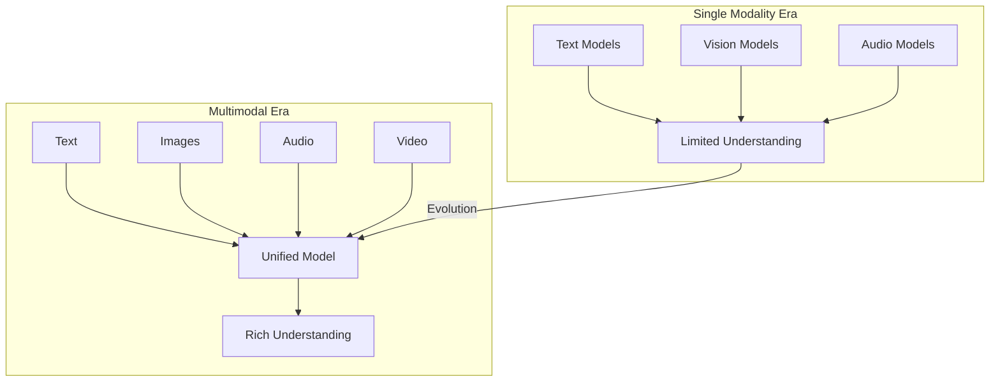
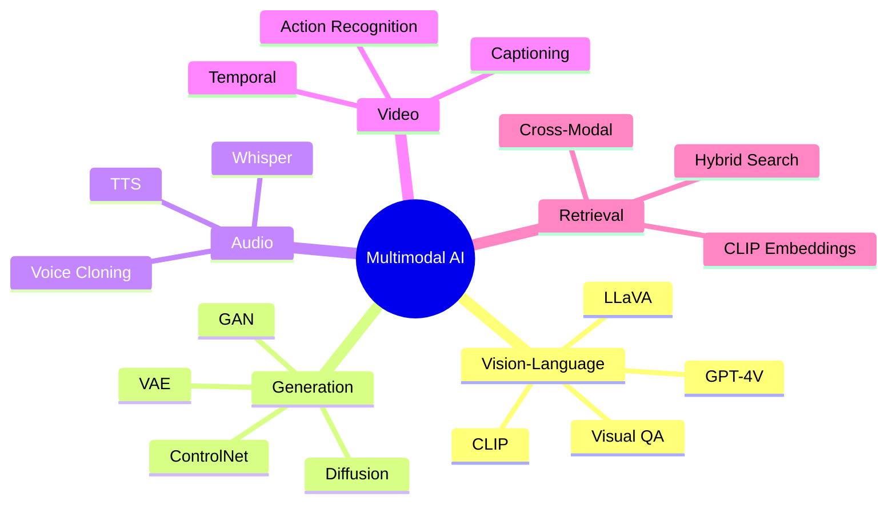
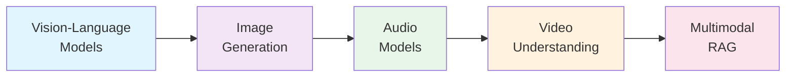

# Multimodal AI

> **Understanding and building AI systems that process multiple modalities: text, images, audio, and video**

---

## Overview

Multimodal AI represents one of the most exciting frontiers in artificial intelligence. These systems can understand, generate, and reason across different types of data simultaneously. From GPT-4V's visual reasoning to DALL-E's image generation, multimodal capabilities are becoming essential for modern AI engineers.

This module covers the architectures, training techniques, and deployment considerations for multimodal systems, with a focus on interview-relevant concepts.

---

## Learning Objectives

By completing this module, you will be able to:

- Explain how vision-language models encode and align different modalities
- Describe the mathematics behind diffusion models for image generation
- Understand speech recognition and synthesis architectures like Whisper
- Design multimodal retrieval systems with cross-modal embeddings
- Apply temporal reasoning techniques for video understanding

---

## Module Structure

| Module | Focus | Key Topics |
|--------|-------|------------|
| [Vision-Language Models](./vision-language-models) | Image + Text understanding | CLIP, GPT-4V, Gemini, LLaVA |
| [Image Generation](./image-generation) | Creating images from text | Diffusion, DALL-E, Stable Diffusion |
| [Audio Models](./audio-models) | Speech and audio processing | Whisper, TTS, voice cloning |
| [Video Understanding](./video-understanding) | Temporal visual reasoning | Video-LLMs, captioning, action recognition |
| [Multimodal RAG](./multimodal-rag) | Cross-modal retrieval | Image search, hybrid embeddings |

---

## Why Multimodal AI Matters

---

## Core Concepts Map

---

## Interview Focus Areas

| Area | Frequency | Key Questions |
|------|-----------|---------------|
| CLIP architecture | Very High | Contrastive learning, embedding alignment |
| Diffusion models | Very High | Forward/reverse process, noise schedules |
| Vision encoders | High | ViT vs CNN, patch embeddings |
| Cross-modal alignment | High | How modalities are fused |
| Whisper architecture | Medium | Encoder-decoder speech models |
| Video understanding | Medium | Temporal modeling approaches |

---

## Prerequisites

Before diving into this module, ensure familiarity with:

- **Transformer architecture** - Attention mechanisms, encoder-decoder models
- **Computer vision basics** - CNNs, feature extraction
- **LLM fundamentals** - Tokenization, training objectives
- **Basic probability** - For understanding diffusion models

::: info Recommended Background
If you need a refresher on transformers, review the LLM Foundations module first. The vision-language section builds heavily on attention mechanisms.
:::

---

## Key Architectures Overview

| Model | Type | Modalities | Key Innovation |
|-------|------|------------|----------------|
| CLIP | Encoder | Image + Text | Contrastive pre-training |
| GPT-4V | Decoder | Image + Text | Unified multimodal reasoning |
| Gemini | Mixed | All | Native multimodality |
| LLaVA | Decoder | Image + Text | Visual instruction tuning |
| DALL-E 3 | Generator | Text -> Image | Diffusion with transformers |
| Whisper | Encoder-Decoder | Audio -> Text | Robust speech recognition |
| Sora | Generator | Text -> Video | Temporal diffusion |

---

## Learning Path

**Recommended order:** Start with Vision-Language Models to understand the fundamental alignment techniques, then progress through generation, audio, video, and finally RAG which synthesizes concepts from all prior modules.

---

## Quick Reference

### Embedding Dimensions

| Model | Image Embedding | Text Embedding | Aligned? |
|-------|-----------------|----------------|----------|
| CLIP ViT-B/32 | 512 | 512 | Yes |
| CLIP ViT-L/14 | 768 | 768 | Yes |
| OpenCLIP ViT-G/14 | 1024 | 1024 | Yes |
| Whisper | N/A | 512-1280 | N/A |

### Common Interview Questions

1. **How does CLIP learn to align image and text representations?**
2. **Explain the forward and reverse diffusion process**
3. **How would you design a multimodal search system?**
4. **What are the challenges in video understanding vs. image understanding?**

---

## Sources

- Radford et al., "Learning Transferable Visual Models From Natural Language Supervision" (CLIP paper)
- Ho et al., "Denoising Diffusion Probabilistic Models"
- OpenAI GPT-4V Technical Report
- Google Gemini Technical Report
- Liu et al., "Visual Instruction Tuning" (LLaVA paper)
