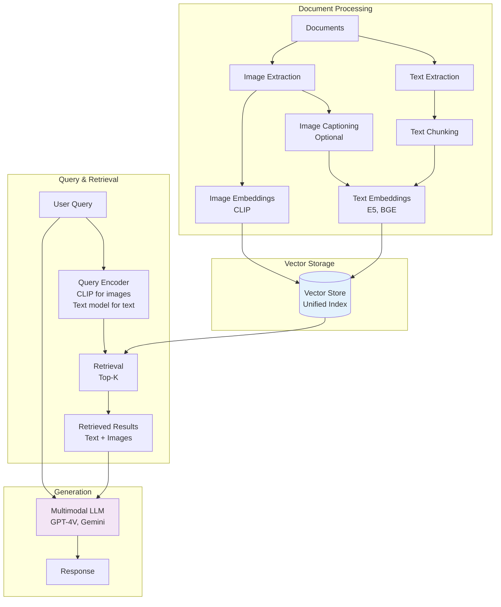
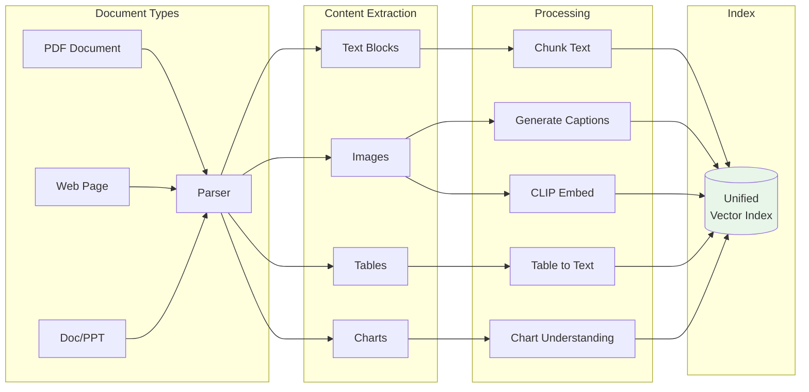
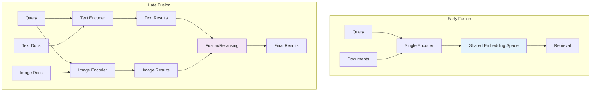

# Multimodal RAG

> **Retrieval-Augmented Generation with images, text, and cross-modal search**

---

## Learning Objectives

- Understand cross-modal embedding spaces and how they enable image-text search
- Design multimodal RAG pipelines that retrieve and reason over mixed content
- Implement CLIP-based retrieval systems for image and text queries
- Compare different fusion strategies for multimodal retrieval
- Handle the unique challenges of indexing and retrieving visual content

---

## Introduction

Multimodal RAG extends traditional text-based RAG to handle images, diagrams, charts, and mixed media. This is critical for knowledge bases with visual content, document understanding systems, and applications where relevant information exists across modalities.

::: info Interview Relevance
Multimodal RAG is a growing area as enterprises need to search across documents with images, charts, and text. Be prepared to discuss CLIP embeddings for cross-modal search, fusion strategies, and the challenges of grounding visual content.
:::

---

## Multimodal RAG Architecture



---

## Cross-Modal Embeddings

### CLIP for Unified Embedding Space

```python
import torch
from transformers import CLIPProcessor, CLIPModel
from PIL import Image
import numpy as np
from typing import List, Union

class CrossModalEncoder:
    """
    Encode both images and text into a shared embedding space using CLIP.
    """

    def __init__(self, model_name: str = "openai/clip-vit-large-patch14"):
        self.model = CLIPModel.from_pretrained(model_name)
        self.processor = CLIPProcessor.from_pretrained(model_name)
        self.model.eval()

        # Get embedding dimension
        self.embedding_dim = self.model.config.projection_dim

    @torch.no_grad()
    def encode_images(self, images: List[Image.Image]) -> np.ndarray:
        """
        Encode images into CLIP embedding space.

        Args:
            images: List of PIL Images

        Returns:
            Normalized embeddings [num_images, embedding_dim]
        """
        inputs = self.processor(images=images, return_tensors="pt", padding=True)
        image_features = self.model.get_image_features(**inputs)

        # Normalize embeddings
        image_features = image_features / image_features.norm(dim=-1, keepdim=True)

        return image_features.cpu().numpy()

    @torch.no_grad()
    def encode_texts(self, texts: List[str]) -> np.ndarray:
        """
        Encode texts into CLIP embedding space.

        Args:
            texts: List of text strings

        Returns:
            Normalized embeddings [num_texts, embedding_dim]
        """
        inputs = self.processor(text=texts, return_tensors="pt", padding=True)
        text_features = self.model.get_text_features(**inputs)

        # Normalize embeddings
        text_features = text_features / text_features.norm(dim=-1, keepdim=True)

        return text_features.cpu().numpy()

    def encode(self, items: List[Union[str, Image.Image]]) -> np.ndarray:
        """
        Encode a mixed list of images and texts.
        """
        images = [item for item in items if isinstance(item, Image.Image)]
        texts = [item for item in items if isinstance(item, str)]

        embeddings = []

        if images:
            image_embs = self.encode_images(images)
            embeddings.append(image_embs)

        if texts:
            text_embs = self.encode_texts(texts)
            embeddings.append(text_embs)

        return np.vstack(embeddings) if embeddings else np.array([])


# Example usage
encoder = CrossModalEncoder()

# Encode an image
# image = Image.open("photo.jpg")
# image_embedding = encoder.encode_images([image])

# Encode text (can search for this text in image database)
# text_embedding = encoder.encode_texts(["a photo of a cat"])

# Cross-modal similarity
# similarity = np.dot(image_embedding, text_embedding.T)
```

---

## Multimodal Document Indexing



### Implementation

```python
import fitz  # PyMuPDF
from PIL import Image
import io
from dataclasses import dataclass
from typing import Optional
import uuid

@dataclass
class DocumentChunk:
    """Represents a chunk of content from a document."""
    id: str
    content_type: str  # "text", "image", "table"
    text: Optional[str] = None
    image: Optional[Image.Image] = None
    embedding: Optional[np.ndarray] = None
    metadata: dict = None

    def __post_init__(self):
        if self.metadata is None:
            self.metadata = {}


class MultimodalDocumentProcessor:
    """
    Process documents and extract multimodal content for RAG.
    """

    def __init__(
        self,
        text_encoder,  # For text embeddings
        image_encoder: CrossModalEncoder,
        chunk_size: int = 512,
        chunk_overlap: int = 50
    ):
        self.text_encoder = text_encoder
        self.image_encoder = image_encoder
        self.chunk_size = chunk_size
        self.chunk_overlap = chunk_overlap

    def process_pdf(self, pdf_path: str) -> List[DocumentChunk]:
        """
        Process a PDF and extract text chunks and images.
        """
        chunks = []
        doc = fitz.open(pdf_path)

        for page_num, page in enumerate(doc):
            # Extract text
            text = page.get_text()
            text_chunks = self._chunk_text(text)

            for i, chunk_text in enumerate(text_chunks):
                chunk = DocumentChunk(
                    id=f"{pdf_path}_p{page_num}_t{i}",
                    content_type="text",
                    text=chunk_text,
                    metadata={
                        "source": pdf_path,
                        "page": page_num,
                        "chunk_index": i
                    }
                )
                chunks.append(chunk)

            # Extract images
            images = page.get_images()
            for img_idx, img in enumerate(images):
                xref = img[0]
                pix = fitz.Pixmap(doc, xref)

                if pix.n - pix.alpha > 3:  # CMYK
                    pix = fitz.Pixmap(fitz.csRGB, pix)

                img_data = pix.tobytes("png")
                pil_image = Image.open(io.BytesIO(img_data))

                # Generate caption for the image
                caption = self._generate_image_caption(pil_image)

                chunk = DocumentChunk(
                    id=f"{pdf_path}_p{page_num}_i{img_idx}",
                    content_type="image",
                    text=caption,  # Store caption for text search
                    image=pil_image,
                    metadata={
                        "source": pdf_path,
                        "page": page_num,
                        "image_index": img_idx,
                        "caption": caption
                    }
                )
                chunks.append(chunk)

        doc.close()
        return chunks

    def _chunk_text(self, text: str) -> List[str]:
        """Split text into overlapping chunks."""
        words = text.split()
        chunks = []

        for i in range(0, len(words), self.chunk_size - self.chunk_overlap):
            chunk = " ".join(words[i:i + self.chunk_size])
            if chunk.strip():
                chunks.append(chunk)

        return chunks

    def _generate_image_caption(self, image: Image.Image) -> str:
        """Generate a caption for an image using a captioning model."""
        # In practice, use BLIP or similar
        # from transformers import BlipProcessor, BlipForConditionalGeneration
        # processor = BlipProcessor.from_pretrained("Salesforce/blip-image-captioning-base")
        # model = BlipForConditionalGeneration.from_pretrained("...")
        # inputs = processor(image, return_tensors="pt")
        # out = model.generate(**inputs)
        # return processor.decode(out[0], skip_special_tokens=True)
        return "Image content"  # Placeholder

    def embed_chunks(self, chunks: List[DocumentChunk]) -> List[DocumentChunk]:
        """Generate embeddings for all chunks."""
        for chunk in chunks:
            if chunk.content_type == "text":
                # Use text encoder for text chunks
                chunk.embedding = self.text_encoder.encode([chunk.text])[0]
            elif chunk.content_type == "image":
                # Use CLIP for images (can be searched with text queries)
                chunk.embedding = self.image_encoder.encode_images([chunk.image])[0]

        return chunks
```

---

## Hybrid Search for Multimodal Content

```python
import faiss
from typing import Tuple

class MultimodalVectorStore:
    """
    Vector store that supports both text and image queries.
    """

    def __init__(self, embedding_dim: int = 768):
        self.embedding_dim = embedding_dim

        # Separate indices for text and image embeddings
        # (in practice, might use a single unified index)
        self.text_index = faiss.IndexFlatIP(embedding_dim)
        self.image_index = faiss.IndexFlatIP(embedding_dim)

        self.text_chunks: List[DocumentChunk] = []
        self.image_chunks: List[DocumentChunk] = []

    def add_chunks(self, chunks: List[DocumentChunk]):
        """Add chunks to appropriate indices."""
        for chunk in chunks:
            if chunk.embedding is None:
                continue

            if chunk.content_type == "text":
                self.text_index.add(chunk.embedding.reshape(1, -1).astype('float32'))
                self.text_chunks.append(chunk)
            elif chunk.content_type == "image":
                self.image_index.add(chunk.embedding.reshape(1, -1).astype('float32'))
                self.image_chunks.append(chunk)

    def search_text(
        self,
        query_embedding: np.ndarray,
        k: int = 5
    ) -> List[Tuple[DocumentChunk, float]]:
        """Search text chunks."""
        scores, indices = self.text_index.search(
            query_embedding.reshape(1, -1).astype('float32'), k
        )
        results = [
            (self.text_chunks[idx], float(score))
            for idx, score in zip(indices[0], scores[0])
            if idx < len(self.text_chunks)
        ]
        return results

    def search_images(
        self,
        query_embedding: np.ndarray,
        k: int = 5
    ) -> List[Tuple[DocumentChunk, float]]:
        """Search image chunks (works with text or image queries via CLIP)."""
        scores, indices = self.image_index.search(
            query_embedding.reshape(1, -1).astype('float32'), k
        )
        results = [
            (self.image_chunks[idx], float(score))
            for idx, score in zip(indices[0], scores[0])
            if idx < len(self.image_chunks)
        ]
        return results

    def hybrid_search(
        self,
        text_query_embedding: np.ndarray,
        clip_query_embedding: np.ndarray,
        k: int = 10,
        text_weight: float = 0.5
    ) -> List[Tuple[DocumentChunk, float]]:
        """
        Hybrid search across text and images.

        Args:
            text_query_embedding: Query embedded with text encoder
            clip_query_embedding: Query embedded with CLIP
            k: Number of results
            text_weight: Weight for text results (1 - text_weight for images)
        """
        text_results = self.search_text(text_query_embedding, k)
        image_results = self.search_images(clip_query_embedding, k)

        # Combine and rerank
        all_results = {}

        for chunk, score in text_results:
            all_results[chunk.id] = (chunk, score * text_weight)

        for chunk, score in image_results:
            if chunk.id in all_results:
                existing_chunk, existing_score = all_results[chunk.id]
                all_results[chunk.id] = (existing_chunk, existing_score + score * (1 - text_weight))
            else:
                all_results[chunk.id] = (chunk, score * (1 - text_weight))

        # Sort by combined score
        sorted_results = sorted(
            all_results.values(),
            key=lambda x: x[1],
            reverse=True
        )[:k]

        return sorted_results
```

---

## Multimodal RAG Pipeline

```mermaid
graph TB
    subgraph "Query Processing"
        Q[User Query<br/>"Show me charts about Q3 revenue"] --> QA[Query Analysis]
        QA --> QT{Query Type?}
        QT -->|Text| TE[Text Embedding]
        QT -->|Image Request| CE[CLIP Embedding]
        QT -->|Both| HE[Hybrid Embedding]
    end

    subgraph "Retrieval"
        TE --> TR[Text Retrieval]
        CE --> IR[Image Retrieval]
        HE --> HR[Hybrid Retrieval]
        TR --> RR[Retrieved Content]
        IR --> RR
        HR --> RR
    end

    subgraph "Generation"
        RR --> CTX[Build Context<br/>Text + Image descriptions]
        Q --> MLLM[Multimodal LLM]
        CTX --> MLLM
        MLLM --> R[Response with<br/>Visual References]
    end

    style QA fill:#e3f2fd
    style MLLM fill:#f3e5f5
```

### Full Pipeline Implementation

```python
class MultimodalRAG:
    """
    Complete Multimodal RAG pipeline.
    """

    def __init__(
        self,
        text_encoder,
        clip_encoder: CrossModalEncoder,
        vector_store: MultimodalVectorStore,
        llm_client  # Multimodal LLM client
    ):
        self.text_encoder = text_encoder
        self.clip_encoder = clip_encoder
        self.vector_store = vector_store
        self.llm = llm_client

    def query(
        self,
        query: str,
        k: int = 5,
        include_images: bool = True
    ) -> dict:
        """
        Process a query through the multimodal RAG pipeline.

        Args:
            query: User query (text)
            k: Number of chunks to retrieve
            include_images: Whether to include image results

        Returns:
            Response with sources
        """
        # Step 1: Encode query
        text_query_emb = self.text_encoder.encode([query])[0]

        if include_images:
            clip_query_emb = self.clip_encoder.encode_texts([query])[0]
            results = self.vector_store.hybrid_search(
                text_query_emb, clip_query_emb, k=k
            )
        else:
            results = self.vector_store.search_text(text_query_emb, k=k)

        # Step 2: Build context
        context_parts = []
        image_references = []

        for i, (chunk, score) in enumerate(results):
            if chunk.content_type == "text":
                context_parts.append(f"[Text {i+1}]: {chunk.text}")
            elif chunk.content_type == "image":
                caption = chunk.metadata.get("caption", "Image content")
                context_parts.append(f"[Image {i+1}]: {caption}")
                image_references.append({
                    "index": i + 1,
                    "source": chunk.metadata.get("source"),
                    "page": chunk.metadata.get("page"),
                    "image": chunk.image
                })

        context = "\n\n".join(context_parts)

        # Step 3: Generate response
        prompt = f"""Based on the following retrieved content, answer the user's question.
If images are referenced, describe how they support your answer.

Retrieved Content:
{context}

User Question: {query}

Answer:"""

        # For a multimodal LLM, you might also pass images directly
        response = self.llm.generate(
            prompt,
            images=[ref["image"] for ref in image_references] if image_references else None
        )

        return {
            "response": response,
            "sources": [
                {
                    "type": chunk.content_type,
                    "source": chunk.metadata.get("source"),
                    "page": chunk.metadata.get("page"),
                    "relevance_score": score
                }
                for chunk, score in results
            ],
            "image_references": image_references
        }


# Example usage
# rag = MultimodalRAG(text_encoder, clip_encoder, vector_store, llm_client)
# result = rag.query("What does the revenue chart show for Q3?")
# print(result["response"])
# for source in result["sources"]:
#     print(f"Source: {source}")
```

---

## Late Fusion vs Early Fusion



### Comparison

| Aspect | Early Fusion | Late Fusion |
|--------|--------------|-------------|
| Architecture | Single unified encoder | Separate encoders |
| Training | End-to-end multimodal | Can use pretrained unimodal |
| Flexibility | Fixed modality handling | Easy to add/modify modalities |
| Performance | Potentially better alignment | More robust to domain shift |
| Examples | CLIP, ImageBind | Hybrid RAG systems |

---

## Interview Q&A

### Question 1: How does CLIP enable cross-modal search?

**Strong Answer:**

CLIP enables cross-modal search by learning a shared embedding space where images and text with similar semantics have similar embeddings. Here's how it works:

1. **Contrastive Training**: CLIP trains on 400M image-text pairs, learning to maximize similarity between matching pairs while minimizing similarity for non-matching pairs.

2. **Shared Embedding Space**: Both image and text encoders project to the same dimensionality (e.g., 768 dimensions), where cosine similarity is meaningful across modalities.

3. **Cross-Modal Retrieval**: Given a text query "a photo of a cat", we encode it with the text encoder. We can then find similar image embeddings even though they were encoded by a different network.

**Key properties:**
- Embeddings are normalized, so cosine similarity equals dot product
- Zero-shot capability: works on images/concepts not seen during training
- Symmetric: can search images with text OR text with images

**Limitations:**
- May not capture fine-grained details (counting, spatial relationships)
- Bias from web training data
- Fixed context length for text

---

### Question 2: What are the challenges in building a multimodal RAG system?

**Strong Answer:**

Key challenges in multimodal RAG include:

1. **Embedding Space Mismatch**: Text embeddings (from E5, BGE) and image embeddings (from CLIP) live in different spaces. Solutions:
   - Use CLIP for both (sacrifices text retrieval quality)
   - Use separate indices with late fusion
   - Train a projection layer to align spaces

2. **Chunking Visual Content**: Unlike text, images don't have natural chunk boundaries. Approaches:
   - Treat each image as one chunk
   - Generate multiple captions/descriptions per image
   - Use image segmentation for complex images

3. **Relevance Scoring**: Comparing relevance across modalities is non-trivial. A text chunk with 0.8 similarity isn't directly comparable to an image with 0.7. Solutions:
   - Calibration based on modality-specific distributions
   - Learned fusion weights
   - Reranking with a multimodal model

4. **Context Length**: Images consume many tokens in multimodal LLMs. Trade-offs:
   - Describe images with captions instead of passing raw images
   - Limit number of image results
   - Use efficient image representations

5. **Grounding**: Ensuring the LLM actually uses visual content and can reference specific images in its response.

---

### Question 3: How would you design a multimodal search system for an e-commerce platform?

**Strong Answer:**

For e-commerce multimodal search, I would design:

**Indexing Pipeline:**
1. **Product Images**: Encode with CLIP, store multiple views per product
2. **Product Descriptions**: Encode with a text encoder (E5 or BGE), chunk long descriptions
3. **Combined Embeddings**: Create a unified representation per product by averaging or attending over all modalities

**Query Processing:**
1. **Text Query**: "red running shoes" -> text embedding + CLIP text embedding
2. **Image Query**: User uploads photo -> CLIP image embedding
3. **Hybrid**: Text description + reference image

**Retrieval Strategy:**
1. Use CLIP for image-image and text-image matching
2. Use text embedder for text-text matching
3. Late fusion with learned weights per query type

**Reranking:**
1. First-stage retrieval returns ~100 candidates
2. Multimodal reranker (fine-tuned on click data) scores relevance
3. Incorporate business logic (popularity, inventory, margins)

**Key Optimizations:**
- Approximate nearest neighbor search (HNSW) for low latency
- Cache popular query embeddings
- Product graph for related item suggestions

---

## Summary Table

| Approach | Use Case | Pros | Cons |
|----------|----------|------|------|
| CLIP-only | Simple cross-modal search | Single encoder, good alignment | Weaker text retrieval |
| Hybrid (Late Fusion) | Enterprise RAG | Best of both worlds | Complex architecture |
| ColPali | Document retrieval | End-to-end, no OCR needed | Computationally expensive |
| ImageBind | Multi-modal (6+) | Handles many modalities | May not be optimal for any single modality |

---

## Sources

- Radford, A., et al. (2021). "Learning Transferable Visual Models From Natural Language Supervision." (CLIP)
- Girdhar, R., et al. (2023). "ImageBind: One Embedding Space To Bind Them All."
- Lewis, P., et al. (2020). "Retrieval-Augmented Generation for Knowledge-Intensive NLP Tasks."
- Faysse, M., et al. (2024). "ColPali: Efficient Document Retrieval with Vision Language Models."
- Chen, J., et al. (2023). "MuRAG: Multimodal Retrieval-Augmented Generator for Open Question Answering over Images and Text."
