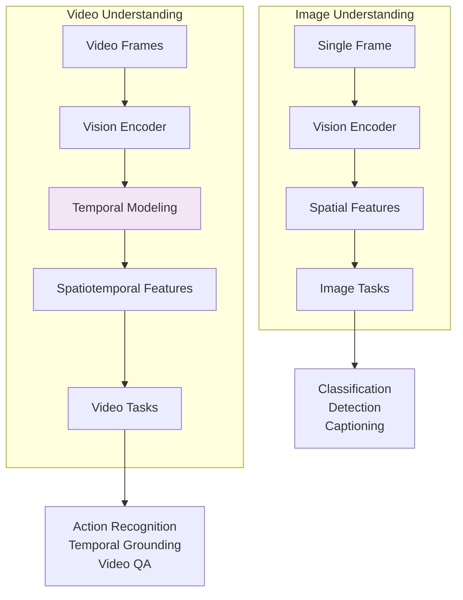
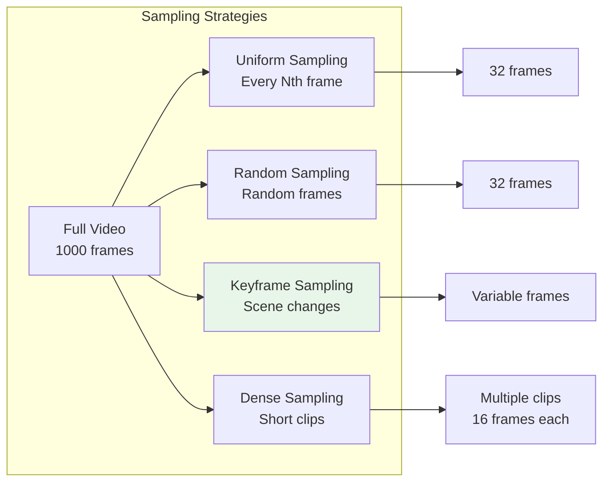
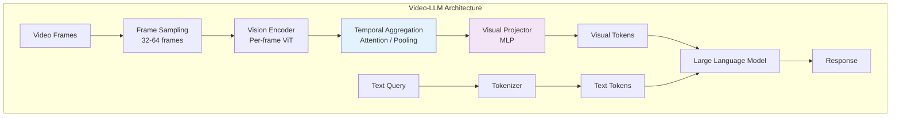

# Video Understanding

> **Temporal reasoning, Video-LLMs, and video captioning systems**

---

## Learning Objectives

- Understand the unique challenges of video understanding vs. image understanding
- Explain temporal modeling approaches: 3D convolutions, temporal attention, and memory mechanisms
- Describe Video-LLM architectures and how they extend image-based VLMs
- Implement basic video captioning and action recognition pipelines
- Analyze trade-offs in frame sampling and temporal aggregation strategies

---

## Introduction

Video understanding extends image understanding with the critical dimension of time. While images capture a single moment, videos contain temporal dynamics, motion patterns, and long-range dependencies that require specialized architectures.

::: info Interview Relevance
Video understanding is increasingly important for content moderation, surveillance, autonomous vehicles, and video generation. Focus on understanding how temporal information is modeled, the trade-offs between different frame sampling strategies, and how Video-LLMs handle long videos.
:::

---

## Video vs. Image Understanding



### Key Challenges

| Challenge | Description | Solution Approaches |
|-----------|-------------|---------------------|
| Temporal Redundancy | Adjacent frames are highly similar | Frame sampling, keyframe detection |
| Long-Range Dependencies | Actions span many frames | Memory mechanisms, hierarchical models |
| Computational Cost | Videos have 10-100x more data than images | Efficient sampling, sparse attention |
| Motion Modeling | Need to capture dynamics, not just appearance | Optical flow, 3D convolutions |
| Audio-Visual Alignment | Video has multiple synchronized modalities | Cross-modal attention |

---

## Frame Sampling Strategies



### Implementation

```python
import torch
import numpy as np
from typing import List, Tuple
import cv2

class VideoSampler:
    """
    Different strategies for sampling frames from videos.
    """

    @staticmethod
    def uniform_sample(
        video_path: str,
        num_frames: int = 32
    ) -> torch.Tensor:
        """
        Sample frames uniformly across the video.
        Good for capturing overall video content.
        """
        cap = cv2.VideoCapture(video_path)
        total_frames = int(cap.get(cv2.CAP_PROP_FRAME_COUNT))

        # Calculate frame indices
        indices = np.linspace(0, total_frames - 1, num_frames, dtype=int)

        frames = []
        for idx in indices:
            cap.set(cv2.CAP_PROP_POS_FRAMES, idx)
            ret, frame = cap.read()
            if ret:
                frame = cv2.cvtColor(frame, cv2.COLOR_BGR2RGB)
                frames.append(frame)

        cap.release()

        # Stack and normalize
        frames = np.stack(frames)  # [T, H, W, C]
        frames = torch.from_numpy(frames).permute(0, 3, 1, 2)  # [T, C, H, W]
        frames = frames.float() / 255.0

        return frames

    @staticmethod
    def dense_sample_clips(
        video_path: str,
        clip_length: int = 16,
        num_clips: int = 4,
        stride: int = 8
    ) -> torch.Tensor:
        """
        Sample multiple dense clips from the video.
        Good for action recognition where temporal dynamics matter.
        """
        cap = cv2.VideoCapture(video_path)
        total_frames = int(cap.get(cv2.CAP_PROP_FRAME_COUNT))

        # Calculate clip start positions
        max_start = total_frames - clip_length * stride
        if max_start < 0:
            clip_starts = [0] * num_clips
        else:
            clip_starts = np.linspace(0, max_start, num_clips, dtype=int)

        all_clips = []
        for start in clip_starts:
            frames = []
            for i in range(clip_length):
                idx = min(start + i * stride, total_frames - 1)
                cap.set(cv2.CAP_PROP_POS_FRAMES, idx)
                ret, frame = cap.read()
                if ret:
                    frame = cv2.cvtColor(frame, cv2.COLOR_BGR2RGB)
                    frames.append(frame)

            if len(frames) == clip_length:
                all_clips.append(np.stack(frames))

        cap.release()

        # [num_clips, T, H, W, C] -> [num_clips, T, C, H, W]
        clips = np.stack(all_clips)
        clips = torch.from_numpy(clips).permute(0, 1, 4, 2, 3).float() / 255.0

        return clips

    @staticmethod
    def keyframe_sample(
        video_path: str,
        threshold: float = 30.0,
        max_frames: int = 64
    ) -> Tuple[torch.Tensor, List[int]]:
        """
        Sample keyframes based on scene changes.
        Good for videos with distinct scenes or events.
        """
        cap = cv2.VideoCapture(video_path)
        total_frames = int(cap.get(cv2.CAP_PROP_FRAME_COUNT))

        keyframe_indices = [0]  # Always include first frame
        prev_frame = None

        for idx in range(total_frames):
            ret, frame = cap.read()
            if not ret:
                break

            gray = cv2.cvtColor(frame, cv2.COLOR_BGR2GRAY)

            if prev_frame is not None:
                # Compute frame difference
                diff = np.mean(np.abs(gray.astype(float) - prev_frame.astype(float)))
                if diff > threshold:
                    keyframe_indices.append(idx)

            prev_frame = gray

        cap.release()

        # Limit number of keyframes
        if len(keyframe_indices) > max_frames:
            indices = np.linspace(0, len(keyframe_indices) - 1, max_frames, dtype=int)
            keyframe_indices = [keyframe_indices[i] for i in indices]

        # Extract keyframes
        frames = VideoSampler._extract_frames(video_path, keyframe_indices)

        return frames, keyframe_indices

    @staticmethod
    def _extract_frames(video_path: str, indices: List[int]) -> torch.Tensor:
        cap = cv2.VideoCapture(video_path)
        frames = []
        for idx in indices:
            cap.set(cv2.CAP_PROP_POS_FRAMES, idx)
            ret, frame = cap.read()
            if ret:
                frame = cv2.cvtColor(frame, cv2.COLOR_BGR2RGB)
                frames.append(frame)
        cap.release()

        frames = np.stack(frames)
        frames = torch.from_numpy(frames).permute(0, 3, 1, 2).float() / 255.0
        return frames
```

---

## Temporal Modeling Approaches

### 1. 3D Convolutions (C3D, I3D)

```python
import torch
import torch.nn as nn

class Conv3DBlock(nn.Module):
    """
    3D convolutional block that captures spatiotemporal features.
    """

    def __init__(
        self,
        in_channels: int,
        out_channels: int,
        kernel_size: Tuple[int, int, int] = (3, 3, 3),
        stride: Tuple[int, int, int] = (1, 1, 1),
        padding: Tuple[int, int, int] = (1, 1, 1)
    ):
        super().__init__()
        self.conv = nn.Conv3d(
            in_channels, out_channels,
            kernel_size=kernel_size,
            stride=stride,
            padding=padding
        )
        self.bn = nn.BatchNorm3d(out_channels)
        self.relu = nn.ReLU(inplace=True)

    def forward(self, x: torch.Tensor) -> torch.Tensor:
        """
        Args:
            x: [batch, channels, time, height, width]
        """
        return self.relu(self.bn(self.conv(x)))


class SimpleC3D(nn.Module):
    """
    Simplified C3D-style video encoder.
    """

    def __init__(self, num_classes: int = 400):
        super().__init__()

        self.features = nn.Sequential(
            Conv3DBlock(3, 64),
            nn.MaxPool3d(kernel_size=(1, 2, 2), stride=(1, 2, 2)),

            Conv3DBlock(64, 128),
            nn.MaxPool3d(kernel_size=(2, 2, 2), stride=(2, 2, 2)),

            Conv3DBlock(128, 256),
            Conv3DBlock(256, 256),
            nn.MaxPool3d(kernel_size=(2, 2, 2), stride=(2, 2, 2)),

            Conv3DBlock(256, 512),
            Conv3DBlock(512, 512),
            nn.MaxPool3d(kernel_size=(2, 2, 2), stride=(2, 2, 2)),
        )

        self.classifier = nn.Sequential(
            nn.AdaptiveAvgPool3d((1, 1, 1)),
            nn.Flatten(),
            nn.Linear(512, num_classes)
        )

    def forward(self, x: torch.Tensor) -> torch.Tensor:
        """
        Args:
            x: [batch, time, channels, height, width]
        Returns:
            Class logits [batch, num_classes]
        """
        # Reorder to [batch, channels, time, height, width]
        x = x.permute(0, 2, 1, 3, 4)
        features = self.features(x)
        return self.classifier(features)
```

### 2. Temporal Attention (TimeSformer)

```python
class TemporalAttention(nn.Module):
    """
    Temporal self-attention layer.
    Each spatial position attends across time.
    """

    def __init__(self, dim: int, num_heads: int = 8):
        super().__init__()
        self.num_heads = num_heads
        self.head_dim = dim // num_heads

        self.qkv = nn.Linear(dim, dim * 3)
        self.proj = nn.Linear(dim, dim)
        self.norm = nn.LayerNorm(dim)

    def forward(
        self,
        x: torch.Tensor,
        temporal_shape: Tuple[int, int, int]  # (T, H, W)
    ) -> torch.Tensor:
        """
        Args:
            x: [batch, T*H*W, dim] flattened spatiotemporal tokens
            temporal_shape: Original (T, H, W) shape

        Returns:
            Output with temporal attention [batch, T*H*W, dim]
        """
        batch, seq_len, dim = x.shape
        T, H, W = temporal_shape

        # Reshape to [batch * H * W, T, dim] for temporal attention
        x = x.view(batch, T, H * W, dim)
        x = x.permute(0, 2, 1, 3)  # [batch, H*W, T, dim]
        x = x.reshape(batch * H * W, T, dim)

        # Layer norm
        x_norm = self.norm(x)

        # QKV projection
        qkv = self.qkv(x_norm).reshape(batch * H * W, T, 3, self.num_heads, self.head_dim)
        qkv = qkv.permute(2, 0, 3, 1, 4)  # [3, batch*H*W, heads, T, head_dim]
        q, k, v = qkv[0], qkv[1], qkv[2]

        # Attention
        attn = (q @ k.transpose(-2, -1)) / (self.head_dim ** 0.5)
        attn = attn.softmax(dim=-1)
        out = (attn @ v).transpose(1, 2).reshape(batch * H * W, T, dim)

        # Project and residual
        out = self.proj(out)
        x = x + out

        # Reshape back
        x = x.view(batch, H * W, T, dim)
        x = x.permute(0, 2, 1, 3)  # [batch, T, H*W, dim]
        x = x.reshape(batch, T * H * W, dim)

        return x


class TimeSformerBlock(nn.Module):
    """
    TimeSformer-style block with divided space-time attention.
    """

    def __init__(self, dim: int, num_heads: int = 8):
        super().__init__()

        # Temporal attention (across time at each spatial position)
        self.temporal_attn = TemporalAttention(dim, num_heads)

        # Spatial attention (across space at each timestep)
        self.spatial_attn = nn.MultiheadAttention(dim, num_heads, batch_first=True)
        self.spatial_norm = nn.LayerNorm(dim)

        # MLP
        self.mlp = nn.Sequential(
            nn.LayerNorm(dim),
            nn.Linear(dim, dim * 4),
            nn.GELU(),
            nn.Linear(dim * 4, dim)
        )

    def forward(
        self,
        x: torch.Tensor,
        temporal_shape: Tuple[int, int, int]
    ) -> torch.Tensor:
        # Temporal attention
        x = self.temporal_attn(x, temporal_shape)

        # Spatial attention (process each frame independently)
        T, H, W = temporal_shape
        batch = x.shape[0]
        x = x.view(batch, T, H * W, -1)

        # Apply spatial attention to each frame
        spatial_out = []
        for t in range(T):
            frame = x[:, t]  # [batch, H*W, dim]
            frame_norm = self.spatial_norm(frame)
            attn_out, _ = self.spatial_attn(frame_norm, frame_norm, frame_norm)
            spatial_out.append(frame + attn_out)

        x = torch.stack(spatial_out, dim=1)  # [batch, T, H*W, dim]
        x = x.view(batch, T * H * W, -1)

        # MLP
        x = x + self.mlp(x)

        return x
```

---

## Video-LLM Architecture



### Video-LLM Implementation

```python
class VideoLLM(nn.Module):
    """
    Video-LLM that processes video frames and generates text responses.
    """

    def __init__(
        self,
        vision_encoder: nn.Module,
        language_model: nn.Module,
        num_frames: int = 32,
        visual_token_dim: int = 1024,
        llm_dim: int = 4096
    ):
        super().__init__()

        self.vision_encoder = vision_encoder
        self.language_model = language_model
        self.num_frames = num_frames

        # Temporal aggregation: learnable query tokens
        self.temporal_queries = nn.Parameter(
            torch.randn(1, 32, visual_token_dim)  # 32 query tokens
        )
        self.temporal_attention = nn.MultiheadAttention(
            visual_token_dim, num_heads=8, batch_first=True
        )

        # Visual projector
        self.visual_projector = nn.Sequential(
            nn.Linear(visual_token_dim, llm_dim),
            nn.GELU(),
            nn.Linear(llm_dim, llm_dim)
        )

    def encode_video(self, video: torch.Tensor) -> torch.Tensor:
        """
        Encode video frames into visual tokens.

        Args:
            video: [batch, T, C, H, W] video frames

        Returns:
            Visual tokens [batch, num_queries, llm_dim]
        """
        batch, T, C, H, W = video.shape

        # Encode each frame
        frame_features = []
        for t in range(T):
            frame = video[:, t]  # [batch, C, H, W]
            features = self.vision_encoder(frame)  # [batch, num_patches, dim]
            frame_features.append(features)

        # Stack: [batch, T, num_patches, dim]
        frame_features = torch.stack(frame_features, dim=1)

        # Flatten temporal and spatial: [batch, T * num_patches, dim]
        batch, T, P, D = frame_features.shape
        frame_features = frame_features.view(batch, T * P, D)

        # Temporal aggregation with learnable queries
        queries = self.temporal_queries.expand(batch, -1, -1)
        aggregated, _ = self.temporal_attention(
            queries, frame_features, frame_features
        )

        # Project to LLM dimension
        visual_tokens = self.visual_projector(aggregated)

        return visual_tokens

    def forward(
        self,
        video: torch.Tensor,
        input_ids: torch.Tensor,
        attention_mask: torch.Tensor = None
    ) -> torch.Tensor:
        """
        Forward pass for video understanding.
        """
        # Encode video
        visual_tokens = self.encode_video(video)

        # Get text embeddings
        text_embeddings = self.language_model.get_input_embeddings()(input_ids)

        # Concatenate visual and text tokens
        inputs_embeds = torch.cat([visual_tokens, text_embeddings], dim=1)

        # Update attention mask
        visual_mask = torch.ones(
            visual_tokens.shape[0], visual_tokens.shape[1],
            device=visual_tokens.device
        )
        if attention_mask is not None:
            attention_mask = torch.cat([visual_mask, attention_mask], dim=1)

        # Forward through LLM
        outputs = self.language_model(
            inputs_embeds=inputs_embeds,
            attention_mask=attention_mask
        )

        return outputs
```

---

## Video Captioning

```python
from transformers import BlipProcessor, BlipForConditionalGeneration
import cv2
from PIL import Image

def caption_video(
    video_path: str,
    num_frames: int = 8,
    model_name: str = "Salesforce/blip-image-captioning-base"
) -> List[dict]:
    """
    Generate captions for sampled video frames.
    Simple approach: caption key frames independently.
    """
    processor = BlipProcessor.from_pretrained(model_name)
    model = BlipForConditionalGeneration.from_pretrained(model_name)

    # Sample frames
    cap = cv2.VideoCapture(video_path)
    total_frames = int(cap.get(cv2.CAP_PROP_FRAME_COUNT))
    fps = cap.get(cv2.CAP_PROP_FPS)

    indices = np.linspace(0, total_frames - 1, num_frames, dtype=int)

    captions = []
    for idx in indices:
        cap.set(cv2.CAP_PROP_POS_FRAMES, idx)
        ret, frame = cap.read()
        if not ret:
            continue

        frame = cv2.cvtColor(frame, cv2.COLOR_BGR2RGB)
        image = Image.fromarray(frame)

        # Generate caption
        inputs = processor(image, return_tensors="pt")
        with torch.no_grad():
            output = model.generate(**inputs, max_length=50)
        caption = processor.decode(output[0], skip_special_tokens=True)

        timestamp = idx / fps
        captions.append({
            "timestamp": timestamp,
            "frame_idx": int(idx),
            "caption": caption
        })

    cap.release()
    return captions


def generate_video_summary(frame_captions: List[dict]) -> str:
    """
    Build a prompt for an LLM to summarize frame-level captions into a
    video summary.

    NOTE: This is an illustrative stub. It returns the assembled prompt
    rather than a generated summary. Wire in your LLM client (e.g.
    `summary = llm.generate(prompt)`) to produce the actual summary.
    """
    # Format captions with timestamps
    caption_text = "\n".join([
        f"[{c['timestamp']:.1f}s] {c['caption']}"
        for c in frame_captions
    ])

    prompt = f"""Given these timestamped descriptions of a video:

{caption_text}

Provide a concise summary of what happens in this video:"""

    # Use any LLM API here:
    # summary = llm.generate(prompt)
    # return summary
    return prompt  # Stub: returns the prompt; replace with the LLM call above
```

---

## Action Recognition

```python
from transformers import VideoMAEForVideoClassification, VideoMAEImageProcessor

def recognize_action(
    video_path: str,
    model_name: str = "MCG-NJU/videomae-base-finetuned-kinetics"
) -> dict:
    """
    Classify the action in a video using VideoMAE.
    """
    processor = VideoMAEImageProcessor.from_pretrained(model_name)
    model = VideoMAEForVideoClassification.from_pretrained(model_name)

    # Sample 16 frames
    frames = VideoSampler.uniform_sample(video_path, num_frames=16)

    # Process frames
    # VideoMAE expects list of PIL images
    frame_list = [
        Image.fromarray((frames[i].permute(1, 2, 0).numpy() * 255).astype(np.uint8))
        for i in range(frames.shape[0])
    ]

    inputs = processor(frame_list, return_tensors="pt")

    with torch.no_grad():
        outputs = model(**inputs)
        logits = outputs.logits

    # Get top-5 predictions
    probs = torch.softmax(logits, dim=-1).squeeze()
    top5_probs, top5_indices = torch.topk(probs, 5)

    results = {}
    for prob, idx in zip(top5_probs, top5_indices):
        label = model.config.id2label[idx.item()]
        results[label] = prob.item()

    return results
```

---

## Interview Q&A

### Question 1: What are the main challenges in video understanding compared to image understanding?

**Strong Answer:**

The main challenges are:

1. **Temporal Redundancy**: Adjacent frames are ~95% similar. Naive processing wastes computation on redundant information. Solutions include frame sampling, temporal downsampling, and keyframe detection.

2. **Long-Range Dependencies**: Actions can span seconds to minutes. A "cooking" action might involve many sub-actions over 30+ seconds. This requires memory mechanisms, hierarchical models, or efficient attention patterns.

3. **Computational Cost**: Videos have 10-100x more data than images. A 10-second video at 30fps has 300 frames vs. 1 image. This necessitates efficient architectures, sparse attention, and careful frame sampling.

4. **Temporal Modeling**: Beyond appearance, we need to capture motion and dynamics. Two frames showing a person standing might indicate "waiting" or be part of "jumping" depending on temporal context. Solutions include 3D convolutions, temporal attention, and optical flow.

5. **Audio-Visual Synchronization**: Videos have multiple modalities that need to be aligned. Cross-modal attention and joint audio-visual encoders address this.

---

### Question 2: Compare 3D convolutions vs. temporal attention for video understanding.

**Strong Answer:**

**3D Convolutions (C3D, I3D):**
- *Pros*: Strong inductive bias for local spatiotemporal patterns, efficient for short-range motion, well-understood training dynamics
- *Cons*: Limited receptive field requires deep networks for long-range dependencies, quadratic memory growth with temporal extent, cannot easily handle variable-length videos

**Temporal Attention (TimeSformer, ViViT):**
- *Pros*: Global temporal receptive field from first layer, can handle variable-length sequences, leverages pre-trained image transformers, flexible attention patterns
- *Cons*: Quadratic complexity in sequence length (though sparse variants exist), may need more data to learn temporal patterns that 3D convs encode as inductive bias

**Hybrid approaches** often work best: use 3D convolutions or local temporal attention for capturing fine-grained motion, combined with global temporal attention for long-range reasoning. The best choice depends on the task:
- Short actions (sports clips): 3D convolutions work well
- Long videos (movies, meetings): Temporal attention with efficient sampling
- Real-time applications: Lightweight 3D CNNs

---

### Question 3: How do Video-LLMs handle long videos efficiently?

**Strong Answer:**

Video-LLMs face the challenge of representing long videos within LLM context limits. Key strategies include:

1. **Sparse Frame Sampling**: Instead of processing all frames, sample 16-64 keyframes uniformly or based on content changes. This reduces a 10-minute video to ~1000 tokens.

2. **Temporal Aggregation**: Use learnable query tokens that attend to all frame features, compressing temporal information into a fixed number of visual tokens regardless of video length.

3. **Hierarchical Processing**: Process video in chunks, summarize each chunk, then combine summaries. Similar to how humans process long videos.

4. **Memory Banks**: Store key visual features in external memory that can be queried during generation, allowing the model to "look back" at relevant moments.

5. **Frame Token Compression**: Use pooling or learned compression to reduce the number of tokens per frame (e.g., 256 patches -> 16 tokens).

Example: Video-LLaMA processes 32 uniformly sampled frames, each producing 32 visual tokens, then uses Q-Former to compress to 32 total video tokens - a 32x compression that fits in standard LLM context.

---

## Summary Table

| Model | Approach | Temporal Modeling | Best For |
|-------|----------|-------------------|----------|
| C3D | 3D CNN | Local 3D convolutions | Short clip classification |
| I3D | Inflated 2D CNN | Pretrained + 3D | Action recognition |
| TimeSformer | Transformer | Divided attention | Long-range dependencies |
| VideoMAE | Masked autoencoder | Masked prediction | Self-supervised pretraining |
| Video-LLaMA | VLM + Q-Former | Query-based aggregation | Video QA |
| VideoChat | VLM + memory | Memory bank | Long video understanding |

---

## Sources

- Tran, D., et al. (2015). "Learning Spatiotemporal Features with 3D Convolutional Networks." (C3D)
- Carreira, J., & Zisserman, A. (2017). "Quo Vadis, Action Recognition? A New Model and the Kinetics Dataset." (I3D)
- Bertasius, G., et al. (2021). "Is Space-Time Attention All You Need for Video Understanding?" (TimeSformer)
- Arnab, A., et al. (2021). "ViViT: A Video Vision Transformer."
- Tong, Z., et al. (2022). "VideoMAE: Masked Autoencoders are Data-Efficient Learners for Self-Supervised Video Pre-Training."
- Zhang, H., et al. (2023). "Video-LLaMA: An Instruction-tuned Audio-Visual Language Model for Video Understanding."
