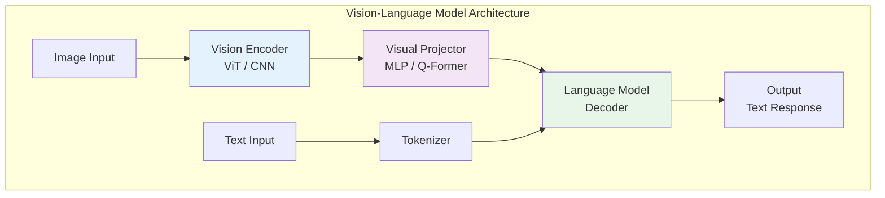
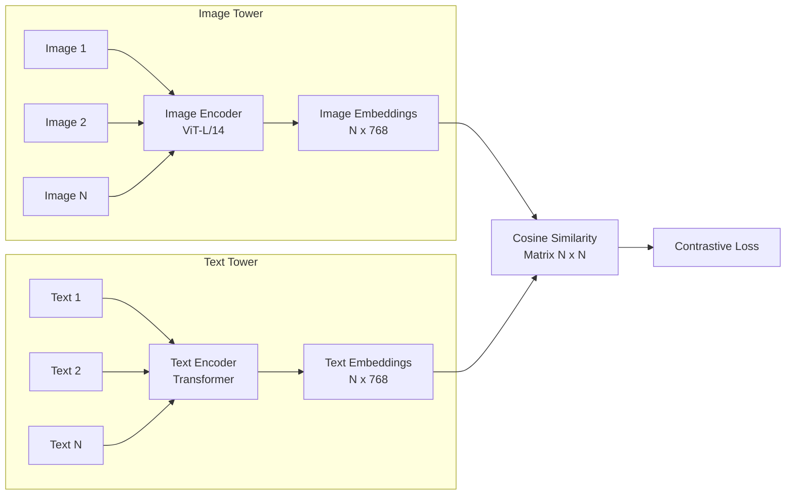
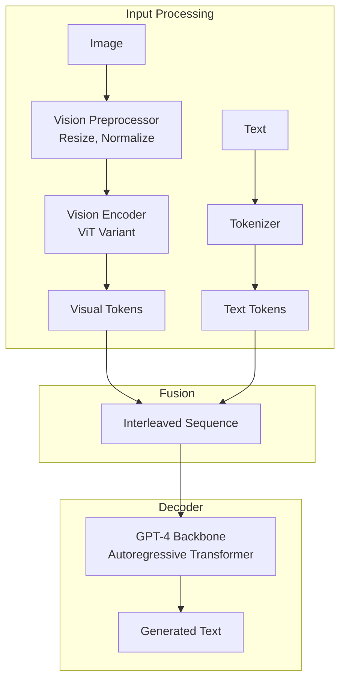
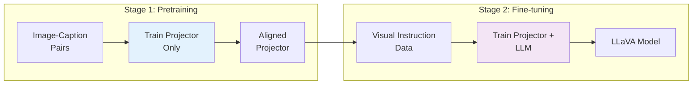

# Vision-Language Models

> **Understanding architectures that bridge visual and textual understanding**

---

## Learning Objectives

- Understand how CLIP aligns image and text embeddings through contrastive learning
- Explain the architecture differences between CLIP, GPT-4V, Gemini, and LLaVA
- Describe vision encoder options (ViT vs. CNN) and their trade-offs
- Implement basic visual reasoning pipelines using open-source VLMs
- Analyze the projection mechanisms that connect vision and language towers

---

## Introduction

Vision-Language Models (VLMs) represent a fundamental shift in AI: instead of training separate models for images and text, we train unified models that understand both modalities simultaneously. This enables powerful applications like visual question answering, image captioning, and multimodal reasoning.

::: info Interview Relevance
VLMs are among the most commonly discussed topics in AI/ML interviews. Expect questions about CLIP's contrastive objective, how visual features are projected into language model space, and trade-offs between different architectures.
:::

---

## Architecture Overview



---

## CLIP: Contrastive Language-Image Pre-training

CLIP revolutionized multimodal AI by learning aligned representations of images and text through contrastive learning.

### Architecture



### Contrastive Learning Objective

CLIP trains by maximizing similarity between matching image-text pairs while minimizing similarity for non-matching pairs.

```python
import torch
import torch.nn.functional as F

def clip_loss(image_embeddings, text_embeddings, temperature=0.07):
    """
    Compute CLIP's symmetric contrastive loss.

    Args:
        image_embeddings: [batch_size, embed_dim] normalized image features
        text_embeddings: [batch_size, embed_dim] normalized text features
        temperature: learnable temperature parameter

    Returns:
        Symmetric contrastive loss
    """
    # Compute similarity matrix
    # Shape: [batch_size, batch_size]
    logits = torch.matmul(image_embeddings, text_embeddings.T) / temperature

    # Labels: diagonal elements are positive pairs
    batch_size = image_embeddings.shape[0]
    labels = torch.arange(batch_size, device=logits.device)

    # Symmetric loss: image-to-text and text-to-image
    loss_i2t = F.cross_entropy(logits, labels)
    loss_t2i = F.cross_entropy(logits.T, labels)

    return (loss_i2t + loss_t2i) / 2


# Example usage
batch_size = 32
embed_dim = 768

# Simulated normalized embeddings
image_emb = F.normalize(torch.randn(batch_size, embed_dim), dim=-1)
text_emb = F.normalize(torch.randn(batch_size, embed_dim), dim=-1)

loss = clip_loss(image_emb, text_emb)
print(f"CLIP Loss: {loss.item():.4f}")
```

### Using CLIP for Zero-Shot Classification

```python
import torch
from PIL import Image
from transformers import CLIPProcessor, CLIPModel

def zero_shot_classify(image_path: str, candidate_labels: list[str]) -> dict:
    """
    Zero-shot image classification using CLIP.

    Args:
        image_path: Path to the image
        candidate_labels: List of possible class labels

    Returns:
        Dictionary mapping labels to probabilities
    """
    model = CLIPModel.from_pretrained("openai/clip-vit-large-patch14")
    processor = CLIPProcessor.from_pretrained("openai/clip-vit-large-patch14")

    # Load and process image
    image = Image.open(image_path)

    # Create text prompts
    text_prompts = [f"a photo of a {label}" for label in candidate_labels]

    # Process inputs
    inputs = processor(
        text=text_prompts,
        images=image,
        return_tensors="pt",
        padding=True
    )

    # Forward pass
    with torch.no_grad():
        outputs = model(**inputs)

    # Get probabilities
    logits_per_image = outputs.logits_per_image
    probs = logits_per_image.softmax(dim=1).squeeze()

    return {label: prob.item() for label, prob in zip(candidate_labels, probs)}


# Example
labels = ["cat", "dog", "bird", "car"]
# results = zero_shot_classify("image.jpg", labels)
```

::: tip Key Insight
CLIP's power comes from its training on 400M image-text pairs from the internet. This diverse training enables remarkable zero-shot transfer to new tasks without task-specific fine-tuning.
:::

---

## GPT-4V Architecture

GPT-4V (GPT-4 Vision) extends GPT-4 to accept image inputs alongside text. While the exact architecture is proprietary, we can understand the general approach.

### Conceptual Architecture



### Key Design Choices

| Aspect | GPT-4V Approach | Rationale |
|--------|-----------------|-----------|
| Vision Encoder | Pre-trained, potentially frozen | Leverage existing visual understanding |
| Token Integration | Interleaved with text | Natural multimodal context |
| Resolution | Variable/tiled | Handle high-res images |
| Training | End-to-end fine-tuning | Tight vision-language integration |

---

## LLaVA: Visual Instruction Tuning

LLaVA (Large Language and Vision Assistant) demonstrates how to efficiently adapt open-source LLMs for visual understanding.

### Architecture

```python
import torch
import torch.nn as nn
from transformers import CLIPVisionModel, LlamaModel, LlamaForCausalLM

class LLaVAModel(nn.Module):
    """
    Simplified LLaVA architecture for illustration.

    Key components:
    1. CLIP Vision Encoder (frozen)
    2. MLP Projector (trainable)
    3. LLaMA Language Model (fine-tuned)
    """

    def __init__(
        self,
        vision_encoder: str = "openai/clip-vit-large-patch14",
        language_model: str = "meta-llama/Llama-2-7b-hf",
        projection_dim: int = 4096
    ):
        super().__init__()

        # Vision encoder (frozen during training)
        self.vision_encoder = CLIPVisionModel.from_pretrained(vision_encoder)
        for param in self.vision_encoder.parameters():
            param.requires_grad = False

        # Projection layer: maps vision features to LLM embedding space
        vision_hidden_size = self.vision_encoder.config.hidden_size  # 1024 for ViT-L
        self.projector = nn.Sequential(
            nn.Linear(vision_hidden_size, projection_dim),
            nn.GELU(),
            nn.Linear(projection_dim, projection_dim)
        )

        # Language model
        self.language_model = LlamaForCausalLM.from_pretrained(language_model)

    def encode_images(self, images: torch.Tensor) -> torch.Tensor:
        """
        Encode images to visual tokens.

        Args:
            images: [batch, channels, height, width]

        Returns:
            Visual tokens [batch, num_patches, llm_dim]
        """
        # Get vision features [batch, num_patches, vision_dim]
        vision_outputs = self.vision_encoder(images)
        image_features = vision_outputs.last_hidden_state

        # Project to LLM dimension [batch, num_patches, llm_dim]
        visual_tokens = self.projector(image_features)

        return visual_tokens

    def forward(
        self,
        input_ids: torch.Tensor,
        images: torch.Tensor = None,
        attention_mask: torch.Tensor = None,
        labels: torch.Tensor = None
    ):
        """
        Forward pass with optional image input.
        """
        # Get text embeddings
        text_embeddings = self.language_model.model.embed_tokens(input_ids)

        if images is not None:
            # Encode images
            visual_tokens = self.encode_images(images)

            # Concatenate: [visual_tokens, text_embeddings]
            # In practice, this is more sophisticated with special tokens
            inputs_embeds = torch.cat([visual_tokens, text_embeddings], dim=1)
        else:
            inputs_embeds = text_embeddings

        # Forward through LLM
        outputs = self.language_model(
            inputs_embeds=inputs_embeds,
            attention_mask=attention_mask,
            labels=labels
        )

        return outputs
```

### LLaVA Training Pipeline



---

## Gemini: Native Multimodality

Google's Gemini represents a different approach: training for multimodality from scratch rather than adapting unimodal models.

### Key Differences

| Aspect | LLaVA Approach | Gemini Approach |
|--------|----------------|-----------------|
| Architecture | Adapter-based | Native multimodal |
| Training | Two-stage | End-to-end |
| Modality Handling | Separate encoders + projection | Unified representation |
| Flexibility | Easy to adapt existing LLMs | Requires full training |

::: info Native vs. Adapted
Native multimodal models like Gemini are trained from scratch on interleaved multimodal data. Adapted models like LLaVA add vision capabilities to existing text models. Native models may have tighter integration, but adapted models leverage mature text-only foundations.
:::

---

## Vision Encoder Deep Dive

### Vision Transformer (ViT)

```python
import torch
import torch.nn as nn

class PatchEmbedding(nn.Module):
    """
    Convert image to patch embeddings.

    For a 224x224 image with patch size 16:
    - Number of patches: (224/16) * (224/16) = 196
    - Each patch: 16 * 16 * 3 = 768 values (256 pixels x 3 channels)
    """

    def __init__(
        self,
        image_size: int = 224,
        patch_size: int = 16,
        in_channels: int = 3,
        embed_dim: int = 768
    ):
        super().__init__()
        self.num_patches = (image_size // patch_size) ** 2

        # Convolutional projection (more efficient than flattening)
        self.projection = nn.Conv2d(
            in_channels,
            embed_dim,
            kernel_size=patch_size,
            stride=patch_size
        )

    def forward(self, x: torch.Tensor) -> torch.Tensor:
        """
        Args:
            x: [batch, channels, height, width]
        Returns:
            Patch embeddings [batch, num_patches, embed_dim]
        """
        # [batch, embed_dim, h/patch_size, w/patch_size]
        x = self.projection(x)
        # [batch, embed_dim, num_patches]
        x = x.flatten(2)
        # [batch, num_patches, embed_dim]
        x = x.transpose(1, 2)
        return x


class VisionTransformer(nn.Module):
    """Simplified Vision Transformer."""

    def __init__(
        self,
        image_size: int = 224,
        patch_size: int = 16,
        embed_dim: int = 768,
        num_heads: int = 12,
        num_layers: int = 12,
        mlp_ratio: float = 4.0
    ):
        super().__init__()

        self.patch_embed = PatchEmbedding(
            image_size, patch_size, 3, embed_dim
        )
        num_patches = self.patch_embed.num_patches

        # Learnable [CLS] token and position embeddings
        self.cls_token = nn.Parameter(torch.zeros(1, 1, embed_dim))
        self.pos_embed = nn.Parameter(torch.zeros(1, num_patches + 1, embed_dim))

        # Transformer encoder
        encoder_layer = nn.TransformerEncoderLayer(
            d_model=embed_dim,
            nhead=num_heads,
            dim_feedforward=int(embed_dim * mlp_ratio),
            batch_first=True
        )
        self.encoder = nn.TransformerEncoder(encoder_layer, num_layers)

        self.norm = nn.LayerNorm(embed_dim)

    def forward(self, x: torch.Tensor) -> torch.Tensor:
        """
        Args:
            x: [batch, 3, height, width]
        Returns:
            Features [batch, num_patches + 1, embed_dim]
        """
        batch_size = x.shape[0]

        # Patch embedding
        x = self.patch_embed(x)  # [batch, num_patches, embed_dim]

        # Prepend [CLS] token
        cls_tokens = self.cls_token.expand(batch_size, -1, -1)
        x = torch.cat([cls_tokens, x], dim=1)

        # Add position embeddings
        x = x + self.pos_embed

        # Transformer encoder
        x = self.encoder(x)
        x = self.norm(x)

        return x
```

### ViT vs CNN Trade-offs

| Aspect | Vision Transformer (ViT) | CNN (ResNet, etc.) |
|--------|--------------------------|-------------------|
| Inductive Bias | Minimal (learns from data) | Strong (translation equivariance) |
| Data Efficiency | Needs more data | Better with limited data |
| Scalability | Scales well with compute | Diminishing returns |
| Global Context | From first layer (attention) | Only in later layers |
| Integration with LLMs | Natural (both use attention) | Requires adaptation |

---

## Visual Reasoning Tasks

### Visual Question Answering (VQA)

```python
from transformers import BlipProcessor, BlipForQuestionAnswering
from PIL import Image

def visual_qa(image_path: str, question: str) -> str:
    """
    Answer questions about an image using BLIP.
    """
    processor = BlipProcessor.from_pretrained("Salesforce/blip-vqa-base")
    model = BlipForQuestionAnswering.from_pretrained("Salesforce/blip-vqa-base")

    image = Image.open(image_path).convert("RGB")

    inputs = processor(image, question, return_tensors="pt")

    with torch.no_grad():
        outputs = model.generate(**inputs)

    answer = processor.decode(outputs[0], skip_special_tokens=True)
    return answer


# Example usage:
# answer = visual_qa("living_room.jpg", "What color is the sofa?")
```

### Image Captioning

```python
from transformers import BlipProcessor, BlipForConditionalGeneration

def generate_caption(image_path: str, conditional_text: str = None) -> str:
    """
    Generate a caption for an image, optionally conditioned on text.
    """
    processor = BlipProcessor.from_pretrained("Salesforce/blip-image-captioning-base")
    model = BlipForConditionalGeneration.from_pretrained(
        "Salesforce/blip-image-captioning-base"
    )

    image = Image.open(image_path).convert("RGB")

    if conditional_text:
        inputs = processor(image, conditional_text, return_tensors="pt")
    else:
        inputs = processor(image, return_tensors="pt")

    with torch.no_grad():
        outputs = model.generate(**inputs, max_length=50)

    caption = processor.decode(outputs[0], skip_special_tokens=True)
    return caption
```

---

## Interview Q&A

### Question 1: How does CLIP's contrastive loss work?

**Strong Answer:**

CLIP uses a symmetric contrastive loss that operates on batches of image-text pairs. For a batch of N pairs:

1. **Encode both modalities**: Images go through a Vision Transformer, texts through a Transformer encoder, producing N image embeddings and N text embeddings.

2. **Compute similarity matrix**: Calculate cosine similarity between all image-text combinations, producing an N x N matrix.

3. **Apply temperature scaling**: Divide by a learnable temperature parameter (typically 0.07) to sharpen the distribution.

4. **Symmetric cross-entropy**: The loss encourages diagonal elements (matching pairs) to have high similarity while off-diagonal elements (non-matching) have low similarity.

```
Loss = 0.5 * (CrossEntropy(logits, labels) + CrossEntropy(logits.T, labels))
```

The symmetric nature ensures both image-to-text and text-to-image retrieval are optimized. The temperature parameter controls how "peaked" the probability distribution is.

---

### Question 2: What are the trade-offs between adapter-based VLMs (LLaVA) and native multimodal models (Gemini)?

**Strong Answer:**

**Adapter-based (LLaVA):**
- *Pros*: Leverages mature text-only LLMs, requires less training data and compute, easier to update components independently, benefits from LLM improvements
- *Cons*: Potential modality misalignment, vision-language integration is added rather than native, may have suboptimal cross-modal reasoning

**Native Multimodal (Gemini):**
- *Pros*: Tighter vision-language integration from scratch, potentially better cross-modal reasoning, unified architecture
- *Cons*: Requires massive training from scratch, can't easily leverage existing text model improvements, higher training cost

In practice, the choice depends on resources and use case. For production systems with limited training budget, adapter-based approaches are practical. For frontier capabilities where budget isn't a constraint, native multimodal training may yield better results.

---

### Question 3: How would you handle high-resolution images in a VLM?

**Strong Answer:**

Several strategies exist for high-resolution image handling:

1. **Tiling/Patching**: Divide the image into multiple tiles, process each through the vision encoder, and concatenate the resulting tokens. GPT-4V likely uses this approach.

2. **Dynamic Resolution**: Use different numbers of visual tokens based on image resolution rather than always downsampling to a fixed size.

3. **Multi-scale Processing**: Process the image at multiple resolutions and combine features, capturing both global context and fine details.

4. **Sliding Window**: Process overlapping windows for very large images, similar to techniques used in document understanding.

The trade-off is between visual fidelity (more tokens = more detail) and computational cost (more tokens = quadratic attention cost). Modern approaches like FlexViT allow variable token counts based on the complexity of the visual content.

---

## Summary Table

| Model | Architecture | Training Approach | Key Strength | Best Use Case |
|-------|--------------|-------------------|--------------|---------------|
| CLIP | Dual encoder | Contrastive | Zero-shot transfer | Classification, retrieval |
| GPT-4V | Decoder-only | Autoregressive + vision | General reasoning | Complex visual QA |
| Gemini | Mixed | Native multimodal | Multi-turn dialogue | General assistant |
| LLaVA | Adapted LLM | Visual instruction tuning | Open source | Research, customization |
| BLIP-2 | Q-Former bridge | Two-stage | Efficient adaptation | Captioning, VQA |

---

## Sources

- Radford, A., et al. (2021). "Learning Transferable Visual Models From Natural Language Supervision." ICML.
- Dosovitskiy, A., et al. (2021). "An Image is Worth 16x16 Words: Transformers for Image Recognition at Scale." ICLR.
- Liu, H., et al. (2023). "Visual Instruction Tuning." NeurIPS.
- Li, J., et al. (2023). "BLIP-2: Bootstrapping Language-Image Pre-training with Frozen Image Encoders and Large Language Models."
- OpenAI. (2023). "GPT-4V(ision) System Card."
- Google. (2023). "Gemini: A Family of Highly Capable Multimodal Models."
