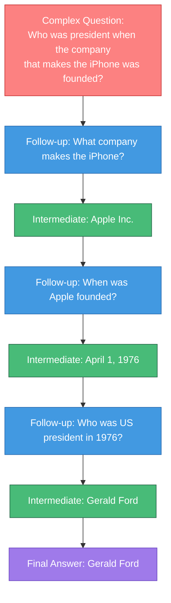
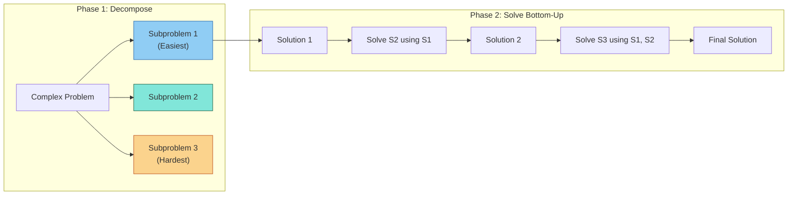
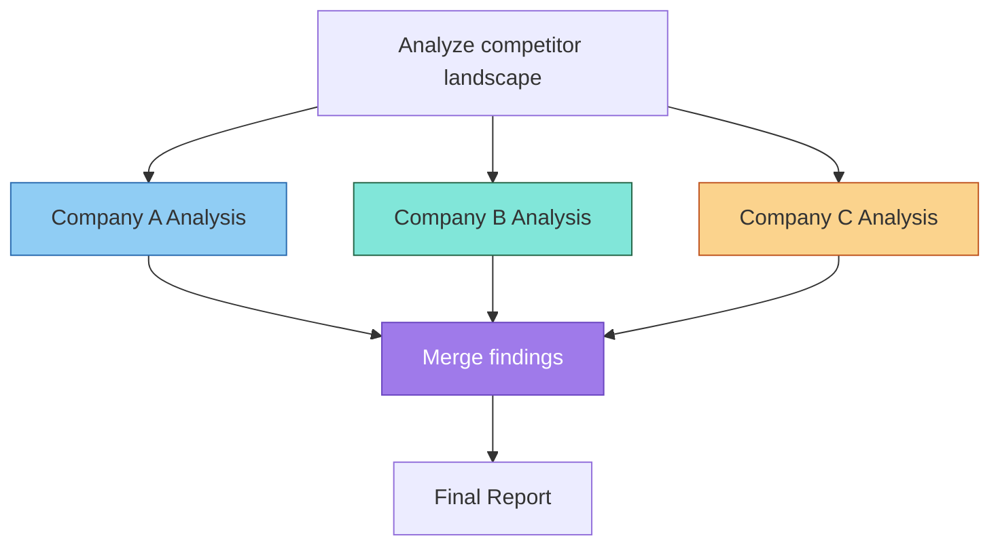
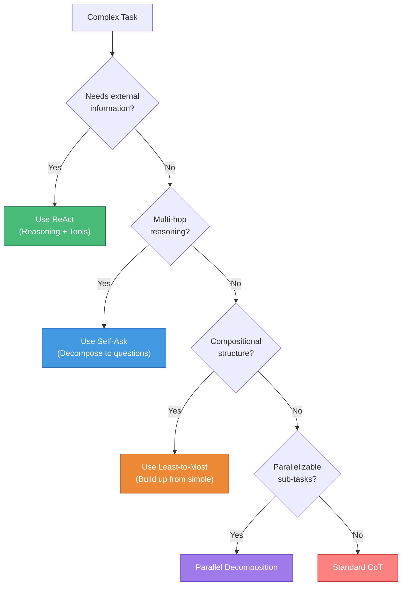
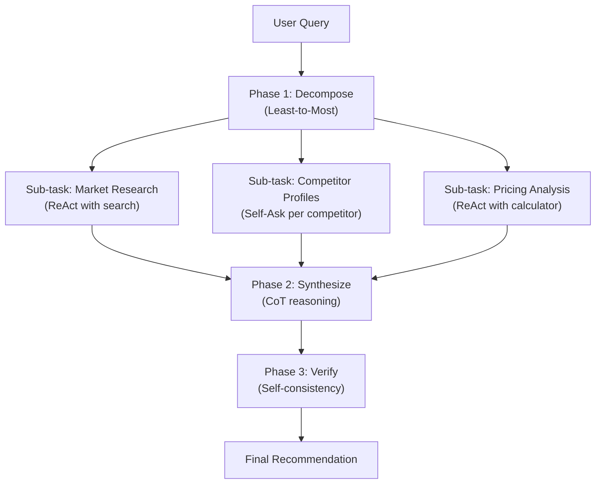

# Advanced Prompting Techniques

> Beyond chain-of-thought, advanced techniques enable LLMs to interact with tools, decompose complex problems, and reason over multiple steps with external feedback.

---

## Learning Objectives

- **Implement ReAct** for interleaved reasoning and action with tools
- **Apply self-ask** for decomposing complex questions into simpler sub-questions
- **Use least-to-most prompting** to solve problems incrementally
- **Design decomposition strategies** for multi-step tasks
- **Understand when each technique is most effective**

---

## ReAct: Reasoning + Acting

ReAct (Reasoning and Acting) interleaves chain-of-thought reasoning with actions, enabling LLMs to interact with external tools and environments.

```mermaid
flowchart TB
    subgraph ReAct["ReAct Loop"]
        Q["Question"] --> T1["Thought: I need to find..."]
        T1 --> A1["Action: Search[query]"]
        A1 --> O1["Observation: Results..."]
        O1 --> T2["Thought: Now I know X, but need Y..."]
        T2 --> A2["Action: Lookup[entity]"]
        A2 --> O2["Observation: Y = value"]
        O2 --> T3["Thought: I can now answer"]
        T3 --> F["Final Answer"]
    end

    style T1 fill:#4299e1,stroke:#2b6cb0,color:#fff
    style T2 fill:#4299e1,stroke:#2b6cb0,color:#fff
    style T3 fill:#4299e1,stroke:#2b6cb0,color:#fff
    style A1 fill:#48bb78,stroke:#276749,color:#fff
    style A2 fill:#48bb78,stroke:#276749,color:#fff
    style O1 fill:#ed8936,stroke:#c05621,color:#fff
    style O2 fill:#ed8936,stroke:#c05621,color:#fff
```



### ReAct Format

```
Question: What is the elevation range for the area that the eastern
sector of the Colorado orogeny extends into?

Thought 1: I need to search for the Colorado orogeny and find information
about its eastern sector.
Action 1: Search[Colorado orogeny]
Observation 1: The Colorado orogeny was an episode of mountain building
in Colorado and surrounding areas. It extended from Wyoming to New Mexico
and into the High Plains.

Thought 2: The eastern sector extends into the High Plains. I need to find
the elevation range of the High Plains.
Action 2: Search[High Plains elevation]
Observation 2: The High Plains are a subregion of the Great Plains. Elevation
ranges from around 1,800 feet (550 m) to over 6,000 feet (1,800 m).

Thought 3: I now have the information needed to answer the question.
Action 3: Finish[1,800 to 6,000 feet]
```

### Available Actions

| Action | Description | Example |
|--------|-------------|---------|
| `Search[query]` | Web or knowledge base search | `Search[population of Tokyo]` |
| `Lookup[term]` | Look up specific entity | `Lookup[Albert Einstein]` |
| `Calculate[expr]` | Mathematical computation | `Calculate[24 * 365]` |
| `Finish[answer]` | Return final answer | `Finish[The answer is 42]` |

### ReAct Implementation

```python
def react_agent(question, tools, max_steps=10):
    """Execute ReAct loop with available tools."""
    context = f"Question: {question}\n\n"

    for step in range(max_steps):
        # Generate thought and action
        response = model.generate(context + f"Thought {step+1}:")
        thought, action = parse_thought_action(response)

        context += f"Thought {step+1}: {thought}\n"
        context += f"Action {step+1}: {action}\n"

        # Check for finish action
        if action.startswith("Finish["):
            answer = extract_answer(action)
            return answer

        # Execute action and get observation
        observation = execute_action(action, tools)
        context += f"Observation {step+1}: {observation}\n\n"

    return "Max steps reached without answer"
```

::: info Why ReAct Works
ReAct succeeds because it grounds reasoning in real-world observations. Pure reasoning can hallucinate facts; ReAct verifies at each step. This is especially powerful for tasks requiring current information or precise data.
:::

---

## Self-Ask

Self-ask prompts the model to explicitly decompose complex questions into simpler sub-questions, answering each before tackling the main question.



### Self-Ask Format

```
Question: Who lived longer, Theodor Haecker or Harry Vaughan Watkins?

Are follow-up questions needed here: Yes.

Follow-up: When was Theodor Haecker born?
Intermediate answer: Theodor Haecker was born on June 4, 1879.

Follow-up: When did Theodor Haecker die?
Intermediate answer: Theodor Haecker died on April 9, 1945.

Follow-up: When was Harry Vaughan Watkins born?
Intermediate answer: Harry Vaughan Watkins was born on December 26, 1875.

Follow-up: When did Harry Vaughan Watkins die?
Intermediate answer: Harry Vaughan Watkins died on October 4, 1960.

Follow-up: How long did Theodor Haecker live?
Intermediate answer: 65 years (1879-1945).

Follow-up: How long did Harry Vaughan Watkins live?
Intermediate answer: 84 years (1875-1960).

So the final answer is: Harry Vaughan Watkins lived longer.
```

### When Self-Ask Excels

| Scenario | Why Self-Ask Helps |
|----------|-------------------|
| **Multi-hop reasoning** | Breaks inference chain into explicit steps |
| **Compositional questions** | Decomposes into atomic queries |
| **Fact verification** | Each sub-question can be independently verified |
| **Knowledge integration** | Combines facts from different domains |

---

## Least-to-Most Prompting

Least-to-most prompting teaches the model to solve easy subproblems first, then use those solutions to tackle harder problems progressively.



### Example: SCAN Compositional Task

**Problem**: Translate "jump around left twice" to actions.

**Phase 1 - Decompose**:
```
To solve "jump around left twice", I first need to solve:
1. "jump left" (simplest)
2. "jump around left" (builds on 1)
3. "jump around left twice" (builds on 2)
```

**Phase 2 - Solve progressively**:
```
Q: "jump left"
A: TURN_LEFT JUMP

Q: "jump around left" (using that "jump left" = TURN_LEFT JUMP)
A: "around left" means doing "left" 4 times, so:
   TURN_LEFT JUMP TURN_LEFT JUMP TURN_LEFT JUMP TURN_LEFT JUMP

Q: "jump around left twice"
A: Do "jump around left" twice:
   TURN_LEFT JUMP TURN_LEFT JUMP TURN_LEFT JUMP TURN_LEFT JUMP
   TURN_LEFT JUMP TURN_LEFT JUMP TURN_LEFT JUMP TURN_LEFT JUMP
```

### Least-to-Most vs Standard CoT

| Aspect | Standard CoT | Least-to-Most |
|--------|-------------|---------------|
| **Order** | Linear, as presented | Easiest → Hardest |
| **Dependency** | Each step uses previous | Solutions explicitly carried forward |
| **Generalization** | Task-specific | Learns reusable sub-solutions |
| **Best for** | Single-step derivations | Compositional tasks |

---

## Problem Decomposition Strategies

### Recursive Decomposition

Break problems into similar sub-problems:

```
Task: Summarize a 50-page document

Decomposition:
1. Split document into 10 sections (5 pages each)
2. Summarize each section (500 → 100 words)
3. Combine section summaries (1000 → 200 words)
4. Final summary (200 words)
```

### Parallel Decomposition

Split into independent sub-tasks:



### Sequential Decomposition

Chain tasks where output of one is input to next:

```
Task: Create a marketing campaign

Step 1: Research → Target audience profile
Step 2: Ideation (using profile) → 5 campaign concepts
Step 3: Evaluation (of concepts) → Top 2 concepts
Step 4: Development (of top concepts) → Full campaign plan
Step 5: Review → Final recommendations
```

### Decomposition Template

```
## Task Decomposition

Original task: [COMPLEX TASK]

### Sub-tasks identified:
1. [SUB-TASK 1] - Depends on: None
2. [SUB-TASK 2] - Depends on: Sub-task 1
3. [SUB-TASK 3] - Depends on: None (can run parallel)
4. [SUB-TASK 4] - Depends on: Sub-tasks 2, 3

### Execution plan:
Phase 1 (Parallel): Sub-tasks 1, 3
Phase 2 (Sequential): Sub-task 2 (needs 1)
Phase 3 (Sequential): Sub-task 4 (needs 2, 3)

### For each sub-task:
- Input: [what information/data is needed]
- Process: [what transformation/analysis]
- Output: [what is produced]
```

---

## Choosing the Right Technique

### Decision Framework



### Comparison Table

| Technique | Key Feature | Best For | Limitations |
|-----------|-------------|----------|-------------|
| **ReAct** | Tool interaction | Real-time data, verification | Requires tool infrastructure |
| **Self-Ask** | Question decomposition | Multi-hop facts | May over-decompose simple tasks |
| **Least-to-Most** | Progressive building | Compositional tasks | Slower, more tokens |
| **Decomposition** | Task splitting | Long/complex workflows | Manual structure design |

---

## Real-World Application: Research Assistant

Combining techniques for a research workflow:

```
System: You are a research assistant with access to search tools.

## Available Actions
- Search[query]: Search academic papers
- Summarize[text]: Condense information
- Compare[items]: Analyze differences
- Finish[answer]: Provide final response

## Task
Research the current state of protein folding prediction.

---

Thought 1: I need to find recent developments in protein folding prediction.
This is a multi-faceted topic, so I'll decompose it.

Sub-questions to answer:
1. What are the main approaches to protein folding prediction?
2. What is the current state-of-the-art (accuracy, speed)?
3. What are the main challenges remaining?

Thought 2: Let me start with the main approaches.
Action 2: Search[protein folding prediction methods 2024]
Observation 2: Key methods include AlphaFold2 (deep learning),
RoseTTAFold (three-track architecture), ESMFold (language models)...

Thought 3: Now I have approaches. Let me find state-of-the-art metrics.
Action 3: Search[AlphaFold2 accuracy CASP benchmark]
Observation 3: AlphaFold2 achieved 92.4 GDT (Global Distance Test)
on CASP14, significantly outperforming previous methods...

Thought 4: I should find current challenges.
Action 4: Search[protein folding prediction limitations challenges]
Observation 4: Challenges include: multi-state proteins, protein
complexes, mutations, and proteins with intrinsically disordered regions...

Thought 5: I now have enough information to synthesize an answer.
Action 5: Finish[
The current state of protein folding prediction:

**Approaches**:
- AlphaFold2: Deep learning with attention mechanisms
- RoseTTAFold: Three-track neural network
- ESMFold: Protein language models

**State-of-the-Art**:
- AlphaFold2 achieves ~92% accuracy (GDT) on benchmarks
- Near-experimental accuracy for many single-chain proteins

**Remaining Challenges**:
- Protein complexes and interactions
- Intrinsically disordered proteins
- Effect of mutations
- Computational cost for large proteins
]
```

---

## Interview Q&A

### Q1: Explain the difference between ReAct and standard chain-of-thought. When would you use each?

**Strong Answer:**

The fundamental difference is **grounding**:

**Chain-of-Thought**:
- Pure reasoning within the model
- No external verification
- Relies on knowledge from training
- Can hallucinate facts

**ReAct**:
- Interleaves reasoning with actions
- Actions retrieve real information
- Observations ground reasoning in facts
- Can verify claims externally

**When to use CoT:**
- Logic/math problems (no external facts needed)
- Creative tasks (generation, not retrieval)
- When latency matters (no tool calls)
- Offline scenarios (no API access)

**When to use ReAct:**
- Fact-heavy questions requiring current data
- Multi-step research tasks
- When accuracy matters more than speed
- Tasks requiring calculation or lookup

**Example comparison:**

```
Question: What is the capital of France and its population?

CoT: "France's capital is Paris. Paris has approximately
2.1 million people." (May be outdated or wrong)

ReAct:
Thought: I need to find the capital and its population.
Action: Search[capital of France]
Observation: Paris is the capital of France.
Thought: Now I need the population.
Action: Search[Paris population 2024]
Observation: Paris has 2.1 million (city) or 12.3 million (metro)
Action: Finish[Paris, with 2.1M city / 12.3M metro population]
```

ReAct provides verifiable, current information at the cost of additional API calls and latency.

---

### Q2: How would you implement self-ask for a knowledge-intensive QA system?

**Strong Answer:**

I'd implement self-ask with retrieval augmentation:

```python
def self_ask_with_retrieval(question, retriever, model, max_depth=5):
    """Self-ask with retrieval for each sub-question."""

    prompt = f"""Question: {question}

Are follow-up questions needed here:"""

    for _ in range(max_depth):
        response = model.generate(prompt)

        if "So the final answer is:" in response:
            return extract_final_answer(response)

        if "Follow-up:" in response:
            followup = extract_followup(response)
            # Retrieve relevant documents
            docs = retriever.search(followup, k=3)
            context = "\n".join(docs)

            # Answer with retrieved context
            answer_prompt = f"""Context: {context}
Question: {followup}
Answer:"""
            intermediate = model.generate(answer_prompt)

            prompt += f"""
Follow-up: {followup}
Intermediate answer: {intermediate}
"""
        else:
            # No more follow-ups needed
            prompt += "\nSo the final answer is:"

    return "Could not determine answer"
```

**Key design decisions:**

1. **Retrieval per sub-question**: Each follow-up gets its own retrieval, ensuring relevant context for that specific question.

2. **Depth limit**: Prevents infinite decomposition; most questions resolve in 2-4 hops.

3. **Early termination**: When "final answer" appears, stop decomposing.

4. **Context management**: Only pass relevant context for each sub-question, avoiding context pollution.

**Optimizations for production:**
- Cache intermediate answers for repeated sub-questions
- Parallel retrieval when sub-questions are independent
- Confidence scoring to decide if decomposition is needed

---

### Q3: Design a prompt architecture for a complex task that combines multiple advanced techniques.

**Strong Answer:**

For a complex research and analysis task, I'd combine techniques in a structured pipeline:

**Task**: "Analyze the competitive landscape of cloud providers and recommend a strategy for a startup"

**Architecture:**



**Implementation:**

```
## Phase 1: Decomposition (Least-to-Most)

Main task: Competitive analysis and strategy

Sub-tasks (ordered by dependency):
1. [Independent] List major cloud providers
2. [Independent] Define evaluation criteria
3. [Depends on 1] Profile each provider
4. [Depends on 2,3] Compare against criteria
5. [Depends on 4] Synthesize strategy

## Phase 2: Execute Sub-tasks

### Sub-task 1: Market Research (ReAct)
Thought: I need current market data on cloud providers
Action: Search[cloud provider market share 2024]
...

### Sub-task 3: Competitor Profiles (Self-Ask)
For AWS:
- Follow-up: What is AWS's market share?
- Follow-up: What are AWS's key services?
- Follow-up: What are AWS's pricing strengths?
...

### Sub-task 4: Comparison (Chain-of-Thought)
Let me systematically compare against our criteria:
1. Pricing: AWS offers... while Azure...
2. Features: ...
...

## Phase 3: Verification (Self-Consistency)

Generate 3 independent strategy recommendations:
Strategy 1: Focus on GCP for ML workloads...
Strategy 2: Multi-cloud with AWS primary...
Strategy 3: Focus on GCP for ML workloads...

Consensus (2/3): GCP-focused strategy for ML-heavy startup
```

This architecture leverages each technique's strengths:
- Least-to-most for structural decomposition
- ReAct for fact-gathering
- Self-ask for deep dives
- CoT for synthesis
- Self-consistency for confidence

---

## Summary Table

| Technique | Core Mechanism | Use Case | Cost Factor |
|-----------|---------------|----------|-------------|
| **ReAct** | Thought-Action-Observation loop | Tool use, real-time data | 2-5x (tool latency) |
| **Self-Ask** | Question decomposition | Multi-hop reasoning | 2-4x (sub-questions) |
| **Least-to-Most** | Easy → Hard progression | Compositional tasks | 2-3x (staged solving) |
| **Decomposition** | Task splitting | Complex workflows | Varies (parallelizable) |

---

## Sources

- "ReAct: Synergizing Reasoning and Acting in Language Models" (Yao et al., 2023)
- "Measuring and Narrowing the Compositionality Gap in Language Models" (Press et al., 2022) - Self-Ask
- "Least-to-Most Prompting Enables Complex Reasoning in Large Language Models" (Zhou et al., 2023)
- "Decomposed Prompting: A Modular Approach for Solving Complex Tasks" (Khot et al., 2023)
- "Toolformer: Language Models Can Teach Themselves to Use Tools" (Schick et al., 2023)
