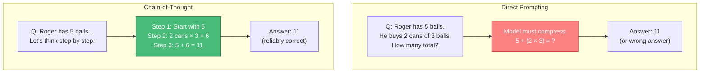
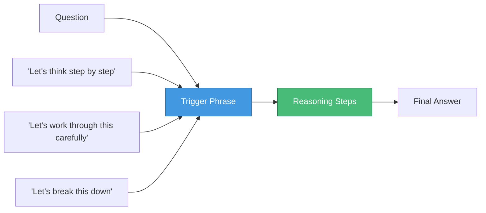
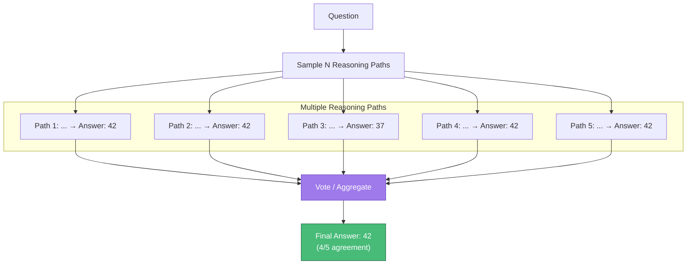
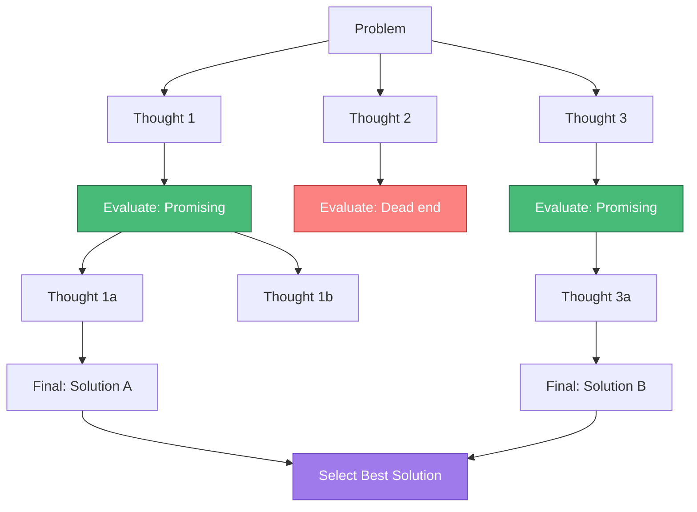

# Chain-of-Thought Prompting

> Chain-of-thought (CoT) prompting elicits step-by-step reasoning from LLMs, dramatically improving performance on complex tasks requiring multi-step logic.

---

## Learning Objectives

- **Understand why CoT works** and the mechanisms behind reasoning elicitation
- **Apply standard CoT** with explicit reasoning demonstrations
- **Use zero-shot CoT** with simple trigger phrases
- **Implement self-consistency** to improve reliability through multiple reasoning paths
- **Explore tree-of-thought** for complex problems requiring exploration

---

## Why Chain-of-Thought Works

LLMs are fundamentally next-token predictors. Without explicit reasoning steps, they must "compress" complex multi-step logic into a single prediction, which often fails for non-trivial problems.



### The Computational Benefit

Each generated token provides additional "compute" for the model to process information:

| Approach | Effective Compute | Accuracy on GSM8K |
|----------|------------------|-------------------|
| Direct answer | 1 forward pass | ~20% |
| CoT reasoning | N forward passes (per token) | ~60-80% |

::: info Key Insight
CoT doesn't give the model new knowledge - it allows the model to use its existing knowledge more effectively by breaking complex computations into manageable steps.
:::

---

## Standard Chain-of-Thought

Standard CoT provides explicit demonstrations of step-by-step reasoning.

### Basic CoT Format

```
Q: A juggler can juggle 16 balls. Half of the balls are golf balls, and half
   of the golf balls are blue. How many blue golf balls are there?

A: Let's work through this step by step:
   1. Total balls: 16
   2. Golf balls: 16 / 2 = 8
   3. Blue golf balls: 8 / 2 = 4
   Therefore, there are 4 blue golf balls.

Q: A restaurant has 12 tables. Each table has 4 chairs. They remove 2 chairs
   from each table for a special event. How many chairs remain?

A: Let's work through this step by step:
   1. Original chairs: 12 tables × 4 chairs = 48 chairs
   2. Chairs removed: 12 tables × 2 chairs = 24 chairs
   3. Remaining chairs: 48 - 24 = 24 chairs
   Therefore, 24 chairs remain.

Q: [Your question here]

A: Let's work through this step by step:
```

### CoT for Different Task Types

**Mathematical Reasoning:**
```
Q: If a train travels at 60 mph for 2.5 hours, how far does it go?

A: Let's solve this:
   - Speed: 60 mph
   - Time: 2.5 hours
   - Distance = Speed × Time
   - Distance = 60 × 2.5 = 150 miles
   The train travels 150 miles.
```

**Logical Reasoning:**
```
Q: All roses are flowers. Some flowers fade quickly. Can we conclude
   that some roses fade quickly?

A: Let's analyze this logically:
   - Premise 1: All roses are flowers (Roses ⊆ Flowers)
   - Premise 2: Some flowers fade quickly (∃ flowers that fade)
   - Question: Do some roses fade quickly?

   Analysis: The fact that SOME flowers fade quickly doesn't mean
   roses are among those that fade. The flowers that fade could be
   non-rose flowers.

   Conclusion: No, we cannot conclude that some roses fade quickly.
   This would be an invalid logical inference.
```

**Multi-step Planning:**
```
Q: How would you organize a team dinner for 15 people with dietary
   restrictions and a $500 budget?

A: Let me plan this systematically:

   Step 1: Gather requirements
   - Number of people: 15
   - Budget: $500 (~$33/person)
   - Need: Dietary restriction information

   Step 2: Collect dietary information
   - Survey team for restrictions (vegetarian, vegan, allergies)
   - Identify common accommodations needed

   Step 3: Select venue/format
   - Restaurant with diverse menu (accommodates restrictions)
   - Or catered event with customizable options
   - Budget check: $500 / 15 = $33/person (mid-range restaurants work)

   Step 4: Make arrangements
   - Book reservation for 15 with restrictions noted
   - Confirm with venue about specific dietary needs
   - Share details with team

   Recommendation: Book a restaurant with clearly marked menu options
   for various diets, ensuring $33/person covers appetizers, mains,
   and non-alcoholic beverages.
```

---

## Zero-Shot Chain-of-Thought

Zero-shot CoT uses trigger phrases to elicit reasoning without providing examples.



### Effective Trigger Phrases

| Trigger | Best For | Example |
|---------|----------|---------|
| "Let's think step by step" | General reasoning | Math, logic problems |
| "Let's work through this carefully" | Detailed analysis | Complex scenarios |
| "First, let me understand the problem" | Problem clarification | Ambiguous questions |
| "Let me break this into parts" | Decomposition | Multi-component tasks |
| "Let's consider this systematically" | Structured analysis | Comparisons, evaluations |

### Zero-Shot CoT Example

```
Q: In a classroom, there are 3 times as many girls as boys. If there
   are 24 students in total, how many boys are there?

Let's think step by step.

[Model generates:]
Let me work through this:
- Let B = number of boys
- Girls = 3B (three times as many)
- Total students = Boys + Girls = B + 3B = 4B
- We know: 4B = 24
- Therefore: B = 24/4 = 6

There are 6 boys in the classroom.
```

::: info Research Finding
The simple phrase "Let's think step by step" improves accuracy on MultiArith from 17.7% to 78.7% (Kojima et al., 2022). This works because it triggers the model to generate reasoning tokens that provide intermediate computation.
:::

---

## Self-Consistency

Self-consistency improves reliability by sampling multiple reasoning paths and aggregating results.



### Implementation

```python
def self_consistency(question, model, n_samples=5, temperature=0.7):
    """Generate multiple reasoning paths and return majority answer."""
    answers = []

    for _ in range(n_samples):
        # Generate with temperature > 0 for diversity
        response = model.generate(
            prompt=f"{question}\n\nLet's think step by step.",
            temperature=temperature
        )
        # Extract final answer
        answer = extract_answer(response)
        answers.append(answer)

    # Return most common answer
    return Counter(answers).most_common(1)[0][0]
```

### Self-Consistency Results

| Dataset | CoT | CoT + Self-Consistency (40 paths) | Improvement |
|---------|-----|-----------------------------------|-------------|
| GSM8K | 56.5% | 74.4% | +17.9% |
| SVAMP | 68.9% | 86.6% | +17.7% |
| AQuA | 35.8% | 48.3% | +12.5% |

### When to Use Self-Consistency

- **Tasks with verifiable answers**: Math, factual questions
- **High-stakes decisions**: Where correctness matters more than latency
- **When single CoT is unreliable**: Complex multi-step reasoning

::: warning Cost Consideration
Self-consistency multiplies API costs by the number of samples. For production systems, consider using it selectively for difficult queries or implementing confidence-based sampling.
:::

---

## Tree-of-Thought

Tree-of-Thought (ToT) extends CoT by exploring multiple reasoning branches and evaluating which paths are most promising.



### ToT Process

1. **Decompose**: Break problem into intermediate steps
2. **Generate**: Produce multiple candidate thoughts at each step
3. **Evaluate**: Score each thought's promise
4. **Search**: Explore promising branches (BFS or DFS)
5. **Select**: Choose the best final solution

### Example: Game of 24

```
Problem: Use 4, 5, 6, 10 to make 24 using +, -, *, /

Initial thoughts:
1. 6 * 4 = 24, need to make 5 and 10 cancel → (6 * 4) * (10 - 5) / 5 = 24? ❌
2. 10 + 6 + 4 + 5 = 25 (close but not 24) → Dead end ❌
3. 10 - 4 = 6, so we have 6, 6, 5 → 6 * (6 - 5 + ?) → Explore ✓

Branch from thought 3:
- (10 - 4) * (6 - 5) = 6 * 1 = 6 ❌
- (10 - 4) = 6, then 6 * 5 - 6 = 24 ✓

Solution: (10 - 4) * 5 - 6 = 30 - 6 = 24 ✓
Wait, let me verify: 6 * 5 - 6 = 24 ✓
Using: 10-4=6, then 6*5=30, then 30-6=24
Numbers used: 10, 4, 5, 6 ✓
```

### ToT vs CoT Comparison

| Aspect | Chain-of-Thought | Tree-of-Thought |
|--------|-----------------|-----------------|
| **Structure** | Linear sequence | Branching tree |
| **Exploration** | Single path | Multiple paths |
| **Backtracking** | Not possible | Built-in |
| **Cost** | 1 generation | Many generations |
| **Best for** | Well-defined problems | Creative/search problems |

---

## Practical Considerations

### When to Use Each Technique

| Technique | Use Case | Example Tasks |
|-----------|----------|---------------|
| **Standard CoT** | Need reliable reasoning | Math word problems |
| **Zero-shot CoT** | Quick improvement, no examples | General reasoning |
| **Self-consistency** | High-stakes, verifiable answers | Critical calculations |
| **Tree-of-Thought** | Creative problem-solving | Puzzles, planning |

### Common Mistakes

1. **Forgetting the final answer**: CoT should end with a clear answer
   ```
   # Bad: Trails off
   "Step 3: 5 + 6 = 11"

   # Good: Explicit answer
   "Step 3: 5 + 6 = 11
   Therefore, the answer is 11."
   ```

2. **Over-reasoning simple problems**: CoT adds latency; use for complex tasks only

3. **Inconsistent reasoning format**: Keep step structure consistent across examples

---

## Interview Q&A

### Q1: Explain why chain-of-thought prompting improves LLM performance on reasoning tasks.

**Strong Answer:**

Chain-of-thought works through several mechanisms:

**1. Extended computation**: Each generated token provides an additional forward pass. CoT effectively gives the model more "compute time" by spreading the reasoning across multiple tokens. For complex problems, a single forward pass to predict the answer may be insufficient.

**2. Working memory externalization**: LLMs have limited "working memory" within a single forward pass. By writing out intermediate steps, CoT externalizes working memory into the context, allowing the model to refer back to computed values.

**3. Error localization**: When reasoning is explicit, errors in individual steps can be identified and corrected. Direct answer prediction is a black box.

**4. Training data alignment**: LLMs are trained on text that often includes reasoning. When we prompt for step-by-step thinking, we're asking the model to generate text similar to its training data (textbooks, explanations, solutions).

**5. Attention focus**: Intermediate steps create new tokens that the model can attend to when generating subsequent steps. This creates explicit dependencies between reasoning steps.

The key insight is that CoT doesn't add knowledge to the model - it provides a computational framework that allows existing knowledge to be applied more effectively.

---

### Q2: How would you implement self-consistency in a production system with cost constraints?

**Strong Answer:**

Self-consistency improves accuracy but multiplies costs. I'd implement a cost-aware approach:

**1. Adaptive sampling**: Instead of fixed N samples for all queries, use confidence-based sampling:
```python
def adaptive_self_consistency(query, max_samples=10):
    answers = []
    for i in range(max_samples):
        answer = generate_with_cot(query)
        answers.append(answer)

        # Early stopping if confident
        if i >= 3:  # Minimum samples
            majority_ratio = max(Counter(answers).values()) / len(answers)
            if majority_ratio > 0.8:  # Strong agreement
                break

    return Counter(answers).most_common(1)[0][0]
```

**2. Difficulty classification**: Route queries by complexity:
- Simple queries → Zero-shot CoT (1 sample)
- Medium queries → Standard CoT (1-3 samples)
- Complex queries → Self-consistency (5-10 samples)

**3. Caching**: Cache reasoning paths for similar queries. If a new query is semantically similar to a cached query with high self-consistency agreement, reuse the answer.

**4. Parallel generation**: Use async API calls to reduce latency:
```python
async def parallel_self_consistency(query, n=5):
    tasks = [generate_async(query) for _ in range(n)]
    answers = await asyncio.gather(*tasks)
    return majority_vote(answers)
```

**5. Two-phase validation**: Generate one answer, then ask the model to verify it. Only use full self-consistency if verification fails:
```
Phase 1: Generate answer with CoT
Phase 2: "Check this answer: [answer]. Is it correct? If not, solve again."
Phase 3: If disagreement, use self-consistency
```

This approach typically reduces costs by 60-80% compared to naive self-consistency while maintaining most of the accuracy gains.

---

### Q3: Compare chain-of-thought to tree-of-thought. When would you choose each?

**Strong Answer:**

| Dimension | Chain-of-Thought | Tree-of-Thought |
|-----------|-----------------|-----------------|
| **Structure** | Linear: Step1 → Step2 → Answer | Branching: Multiple paths explored |
| **Backtracking** | None - commits to each step | Can abandon unpromising branches |
| **Cost** | 1x generation | 10-100x generation |
| **Latency** | Low | High |
| **Failure modes** | Single wrong step derails | Can recover from wrong branches |

**Choose CoT when:**
- Problem has a clear solution path
- Latency matters
- Cost is constrained
- Task is well-defined (math, factual reasoning)

**Choose ToT when:**
- Problem requires exploration (puzzles, creative tasks)
- Multiple valid approaches exist
- Backtracking would help (constraint satisfaction)
- Accuracy is more important than cost

**Practical examples:**
- **CoT**: "Calculate compound interest on $1000 at 5% for 3 years"
- **ToT**: "Find a way to arrange 8 queens on a chessboard with no attacks"

**Hybrid approach**: Start with CoT, escalate to ToT if confidence is low:
```
1. Try CoT → If confident, return answer
2. If uncertain, generate 3 alternative first steps
3. Evaluate each, pursue promising branches
4. Return best solution found
```

In production, ToT is rarely used due to cost. Self-consistency with CoT provides similar robustness benefits at lower cost for most tasks.

---

## Summary Table

| Technique | Mechanism | Best For | Cost |
|-----------|-----------|----------|------|
| **Standard CoT** | Demonstrated reasoning | Complex math/logic | 1x |
| **Zero-shot CoT** | Trigger phrases | Quick improvement | 1x |
| **Self-consistency** | Multiple paths + voting | High-stakes decisions | Nx |
| **Tree-of-Thought** | Branching exploration | Creative/search problems | 10-100x |

---

## Sources

- "Chain-of-Thought Prompting Elicits Reasoning in Large Language Models" (Wei et al., 2022)
- "Large Language Models are Zero-Shot Reasoners" (Kojima et al., 2022)
- "Self-Consistency Improves Chain of Thought Reasoning" (Wang et al., 2023)
- "Tree of Thoughts: Deliberate Problem Solving with Large Language Models" (Yao et al., 2023)
- "Automatic Chain of Thought Prompting in Large Language Models" (Zhang et al., 2022)
