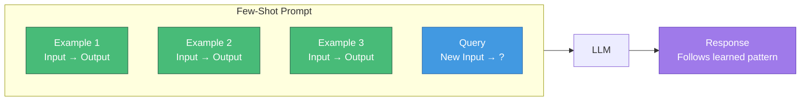
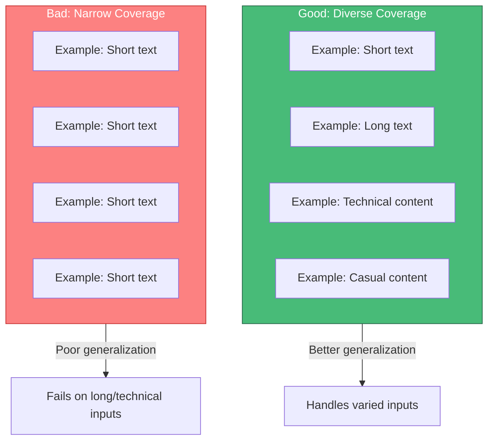
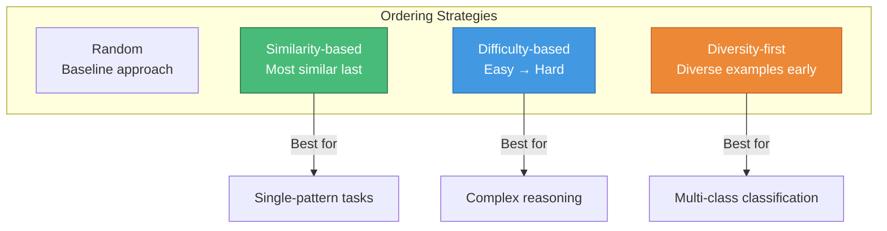
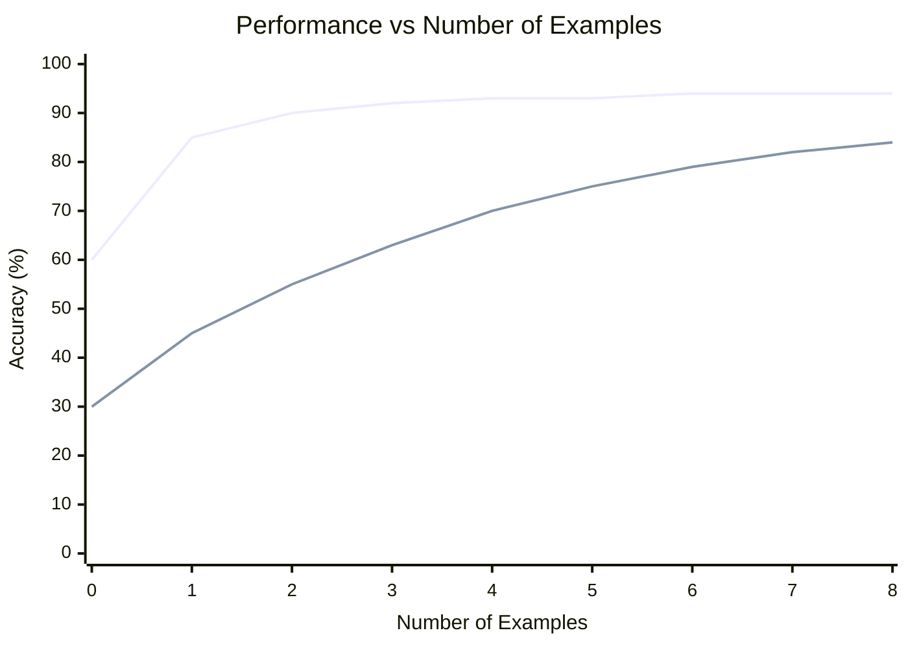

# Few-Shot Learning

> Few-shot learning enables LLMs to learn patterns from a small number of examples provided in the prompt, dramatically improving task performance without fine-tuning.

---

## Learning Objectives

- **Understand the mechanics** of how few-shot learning works in LLMs
- **Select optimal examples** that maximize learning signal
- **Order examples strategically** to leverage recency and primacy effects
- **Format demonstrations consistently** to establish clear patterns
- **Determine the right number** of examples for different tasks

---

## What is Few-Shot Learning?

Few-shot learning (also called in-context learning) provides examples of the desired input-output behavior directly in the prompt. The model learns to follow the demonstrated pattern without any weight updates.



### Zero-Shot vs Few-Shot vs Many-Shot

| Approach | Examples | Best For |
|----------|----------|----------|
| **Zero-shot** | 0 | Simple, well-known tasks |
| **One-shot** | 1 | Demonstrating format |
| **Few-shot** | 2-8 | Most tasks requiring pattern learning |
| **Many-shot** | 10+ | Complex tasks with long contexts |

---

## Example Selection Strategies

The quality of examples matters more than quantity. Poorly chosen examples can hurt performance.

### Diversity Principle

Select examples that cover the **distribution of expected inputs**:



### Selection Criteria

| Criterion | Description | Example |
|-----------|-------------|---------|
| **Representativeness** | Cover common input types | Include both questions and statements for intent classification |
| **Edge cases** | Include boundary conditions | Add examples with ambiguous cases |
| **Clarity** | Unambiguous mappings | Avoid examples where output could be interpreted multiple ways |
| **Relevance** | Similar to expected queries | Use domain-specific examples for domain tasks |

### Dynamic Example Selection

For production systems, select examples dynamically based on the input:

```python
def select_examples(query, example_pool, k=3):
    """Select k most relevant examples for the query."""
    # Embed all examples and query
    query_embedding = embed(query)
    example_embeddings = [embed(ex['input']) for ex in example_pool]

    # Find k nearest neighbors
    similarities = cosine_similarity(query_embedding, example_embeddings)
    top_k_indices = np.argsort(similarities)[-k:]

    return [example_pool[i] for i in top_k_indices]
```

::: info Research Insight
Dynamic example selection (KATE, EPR) can improve few-shot performance by 10-20% over random selection, especially for tasks with high input variability.
:::

---

## Example Ordering Effects

The order of examples significantly impacts model performance due to recency and primacy effects.

### Ordering Strategies



### Research Findings

| Ordering | Effect | When to Use |
|----------|--------|-------------|
| **Most similar last** | +5-15% accuracy | When query resembles specific examples |
| **Easy to hard** | Better complex reasoning | Math, multi-step problems |
| **Random** | Baseline, no bias | When unsure, provides consistency |
| **Label balanced** | Prevents bias | Classification with imbalanced classes |

### Label Ordering in Classification

For classification tasks, alternate labels to prevent recency bias:

```
# Good: Balanced ordering
Input: "I love this!" → Positive
Input: "Terrible experience" → Negative
Input: "Best purchase ever" → Positive
Input: "Waste of money" → Negative

# Bad: All same label at end
Input: "I love this!" → Positive
Input: "Best purchase ever" → Positive
Input: "Terrible experience" → Negative
Input: "Waste of money" → Negative
```

The bad ordering biases the model toward predicting "Negative" for the query.

---

## Demonstration Formatting

Consistent formatting establishes clear patterns for the model to follow.

### Format Templates

**Simple Input-Output:**
```
Input: What is 2+2?
Output: 4

Input: What is 3*5?
Output: 15

Input: What is 10/2?
Output:
```

**Structured with Labels:**
```
Text: "The movie was absolutely fantastic!"
Sentiment: Positive

Text: "I regret buying this product."
Sentiment: Negative

Text: "It works exactly as described."
Sentiment:
```

**With Reasoning (Chain-of-Thought):**
```
Q: Roger has 5 tennis balls. He buys 2 more cans of tennis balls.
   Each can has 3 balls. How many does he have now?
A: Roger started with 5 balls. He bought 2 cans × 3 balls = 6 balls.
   Total: 5 + 6 = 11 balls.
   The answer is 11.

Q: The cafeteria had 23 apples. They used 20 for lunch and bought 6 more.
   How many do they have?
A:
```

### Formatting Best Practices

| Practice | Rationale | Example |
|----------|-----------|---------|
| **Consistent delimiters** | Model learns pattern | Always use "Input:" and "Output:" |
| **Explicit section markers** | Reduces ambiguity | Use `###` or `---` between examples |
| **Aligned structure** | Visual consistency | Same number of fields per example |
| **Clear termination** | Model knows when to stop | End with explicit answer marker |

---

## How Many Examples?

The optimal number of examples depends on task complexity, context window limits, and diminishing returns.

### Performance vs. Examples Curve



### Guidelines by Task Type

| Task Type | Recommended Examples | Notes |
|-----------|---------------------|-------|
| **Format conversion** | 1-2 | Model quickly learns pattern |
| **Classification** | 2-4 per class | Balance across labels |
| **Entity extraction** | 3-5 | Cover entity variety |
| **Reasoning** | 3-6 | Quality over quantity |
| **Translation** | 5-10 | More needed for style |

::: warning Diminishing Returns
Research shows that performance gains typically plateau after 8-16 examples. Additional examples consume tokens without proportional benefit. Always test empirically for your specific task.
:::

---

## Common Pitfalls

### 1. Inconsistent Formatting

```
# Bad: Mixed formats confuse the model
Review: "Great product" → positive
Input: "Terrible service"
Result: negative
"Amazing experience" is: positive

# Good: Consistent format
Review: "Great product" → Sentiment: positive
Review: "Terrible service" → Sentiment: negative
Review: "Amazing experience" → Sentiment:
```

### 2. Biased Example Distribution

```
# Bad: All positive examples
Review: "Love it!" → positive
Review: "Amazing!" → positive
Review: "Best ever!" → positive
Review: "It broke after one use" → ???
# Model is biased toward positive

# Good: Balanced distribution
Review: "Love it!" → positive
Review: "Terrible quality" → negative
Review: "Best ever!" → positive
Review: "Never buying again" → negative
Review: "It broke after one use" →
```

### 3. Ambiguous Examples

```
# Bad: Ambiguous label
Review: "It was okay, I guess" → positive
# "Okay" is arguably neutral

# Good: Clear examples
Review: "Absolutely loved it!" → positive
Review: "Complete waste of money" → negative
```

---

## Real-World Example: Named Entity Recognition

```
Extract entities from the text. Mark each with its type.

Text: "Apple CEO Tim Cook announced the new iPhone at the event in Cupertino."
Entities:
- Apple (ORGANIZATION)
- Tim Cook (PERSON)
- iPhone (PRODUCT)
- Cupertino (LOCATION)

Text: "Microsoft acquired GitHub for $7.5 billion in 2018."
Entities:
- Microsoft (ORGANIZATION)
- GitHub (ORGANIZATION)
- $7.5 billion (MONEY)
- 2018 (DATE)

Text: "Elon Musk's Tesla factory in Berlin produces Model Y vehicles."
Entities:
- Elon Musk (PERSON)
- Tesla (ORGANIZATION)
- Berlin (LOCATION)
- Model Y (PRODUCT)

Text: "Amazon founder Jeff Bezos invested in Blue Origin's Texas facility."
Entities:
```

This example demonstrates:
- Consistent formatting with explicit entity types
- Diverse entity coverage (people, organizations, locations, products, money, dates)
- Multiple examples showing the full range of expected outputs
- Clear termination point for model completion

---

## Interview Q&A

### Q1: How do you select examples for few-shot learning when you have a large pool of candidates?

**Strong Answer:**

I use a multi-criteria selection approach:

1. **Semantic similarity**: Embed all candidate examples and the expected query distribution. Select examples that are representative of the input space, not just similar to each other.

2. **Coverage optimization**: Ensure examples cover different aspects:
   - Different input lengths
   - Different label classes (balanced)
   - Different difficulty levels
   - Edge cases and typical cases

3. **Quality filtering**: Remove examples that are:
   - Ambiguous (multiple valid outputs)
   - Incorrectly labeled
   - Too similar to other selected examples

4. **Dynamic selection**: For production systems, I implement similarity-based retrieval:
   ```python
   # Retrieve k most similar examples to the query
   examples = retriever.get_nearest(query, k=5)
   # Optionally filter for diversity
   examples = diversity_filter(examples, min_distance=0.3)
   ```

5. **Empirical validation**: Test different example sets on a held-out validation set and select the combination that maximizes task performance.

The key insight is that example quality and diversity matter more than quantity. I typically see better results from 3-4 well-chosen examples than 8-10 randomly selected ones.

---

### Q2: What ordering effects should you consider when constructing few-shot prompts?

**Strong Answer:**

Several ordering effects impact few-shot performance:

**1. Recency effect**: Models pay more attention to examples near the query. I place the most relevant or similar example last, closest to the query.

**2. Primacy effect**: First examples establish the pattern. I ensure the first example is clear, unambiguous, and representative.

**3. Label bias**: If all examples of one class appear together, the model may be biased toward predicting that class. I interleave labels:
```
Positive → Negative → Positive → Negative → Query
```

**4. Difficulty progression**: For reasoning tasks, ordering from simple to complex helps:
```
Easy example → Medium example → Hard example → Query
```
This builds up the model's "understanding" progressively.

**5. Semantic clustering**: Group semantically similar examples together, with the most query-similar group at the end.

In practice, I run ablations on ordering for critical applications. A common finding is that similarity-based ordering (most similar last) provides 5-15% improvement over random ordering for many tasks.

---

### Q3: How do you handle few-shot learning for tasks with many output classes?

**Strong Answer:**

Many-class few-shot learning (e.g., 50+ categories) poses challenges because including examples of every class would consume the entire context window. I use several strategies:

**1. Hierarchical classification**: Break into coarse → fine categories:
```
Step 1: Classify into 5 broad categories
Step 2: For that category, classify into specific subcategories
```

**2. Representative sampling**: Select 1-2 examples per major category, prioritizing:
- Most frequent classes
- Classes most likely for the current query
- Edge cases between confusing classes

**3. Dynamic example injection**: Retrieve examples relevant to the query:
```python
# First pass: identify likely categories
likely_categories = coarse_classifier(query)
# Select examples from those categories
examples = [get_example(cat) for cat in likely_categories[:5]]
```

**4. Label description**: Instead of examples for every class, provide class descriptions:
```
Categories:
- BILLING: Questions about invoices, payments, charges
- TECHNICAL: Issues with product functionality
- SHIPPING: Delivery status, tracking, delays
...
```

**5. Hybrid approach**: Combine label descriptions with a few diverse examples:
```
[Category descriptions]

Examples showing classification:
[2-3 diverse examples]

Now classify: [query]
```

This approach scales to hundreds of classes while staying within context limits.

---

## Summary Table

| Aspect | Key Principle | Implementation |
|--------|---------------|----------------|
| **Selection** | Quality over quantity | Cover input distribution, avoid ambiguity |
| **Ordering** | Leverage recency effect | Most similar example last |
| **Formatting** | Consistency is critical | Same structure for all examples |
| **Quantity** | Diminishing returns | 3-8 examples for most tasks |
| **Balance** | Prevent label bias | Equal representation of classes |
| **Dynamics** | Adapt to query | Retrieve similar examples at runtime |

---

## Sources

- "Language Models are Few-Shot Learners" (Brown et al., 2020) - GPT-3 Paper
- "Rethinking the Role of Demonstrations" (Min et al., 2022)
- "Fantastically Ordered Prompts and Where to Find Them" (Lu et al., 2022)
- "What Makes Good In-Context Examples for GPT-3?" (Liu et al., 2022)
- "KATE: K-Nearest Neighbor Augmented In-Context Learning" (Liu et al., 2022)
