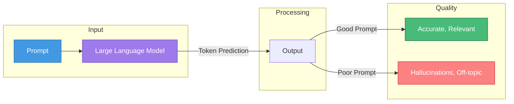
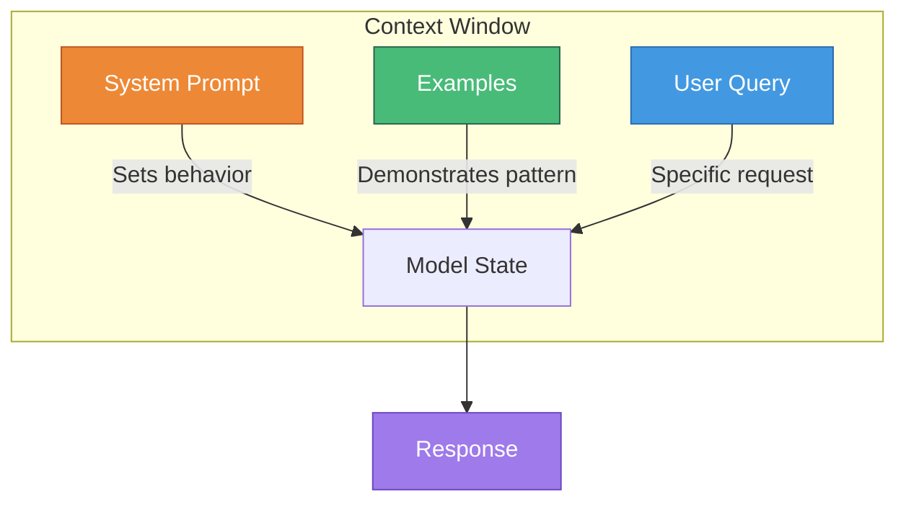
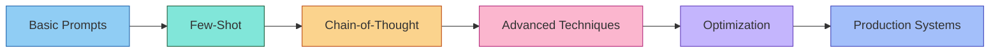

# Prompt Engineering

> **The art and science of communicating effectively with large language models to achieve desired outcomes.**

---

## Learning Objectives

After completing this module, you will be able to:

- **Understand prompt anatomy** and how system, user, and assistant roles shape model behavior
- **Apply few-shot learning** techniques with optimal example selection and formatting
- **Implement chain-of-thought** and advanced reasoning strategies for complex problems
- **Optimize prompts** using systematic approaches like APE and DSPy
- **Defend against prompt injection** and security vulnerabilities

---

## Module Overview

| Module | Focus | Key Concepts |
|--------|-------|--------------|
| [Prompt Anatomy](./prompt-anatomy) | Structure and components | Roles, delimiters, instruction design |
| [Few-Shot Learning](./few-shot-learning) | Learning from examples | Example selection, ordering, formatting |
| [Chain-of-Thought](./chain-of-thought) | Reasoning strategies | CoT, zero-shot CoT, self-consistency, ToT |
| [Advanced Techniques](./advanced-techniques) | Sophisticated patterns | ReAct, self-ask, least-to-most, decomposition |
| [Prompt Optimization](./prompt-optimization) | Systematic improvement | APE, DSPy, prompt tuning, A/B testing |
| [Prompt Security](./prompt-security) | Safety and defense | Injection attacks, jailbreaks, mitigations |
| [Prompt Evaluation](./prompt-evaluation) | Measuring quality | Metrics, comparison frameworks, versioning |

---

## Why Prompt Engineering Matters

Prompt engineering is the primary interface for extracting value from LLMs. Unlike traditional programming where explicit instructions are executed deterministically, prompting involves probabilistic models that interpret natural language. Small changes in wording can dramatically affect output quality.

---

## Core Principles

### 1. Clarity Over Brevity

| Approach | Example | Result |
|----------|---------|--------|
| **Vague** | "Write about Python" | Unpredictable output |
| **Specific** | "Write a 200-word explanation of Python list comprehensions for beginners" | Focused, useful output |

### 2. Context is King

### 3. Iterative Refinement

Prompt engineering is rarely "one and done." Effective practitioners:
- Start with a baseline prompt
- Test with diverse inputs
- Identify failure modes
- Refine systematically
- Document what works

---

## Interview Quick Reference

| Topic | Key Points to Mention |
|-------|----------------------|
| **Prompt Anatomy** | System/user/assistant roles, delimiters, instruction placement |
| **Few-Shot Learning** | Example quality > quantity, ordering effects, formatting consistency |
| **Chain-of-Thought** | Explicit reasoning, "Let's think step by step," self-consistency |
| **Advanced Techniques** | ReAct for tool use, decomposition for complex tasks |
| **Optimization** | APE for automatic prompt search, DSPy for programmatic prompting |
| **Security** | Injection attacks, defense-in-depth, input validation |
| **Evaluation** | Task-specific metrics, human evaluation, A/B testing |

---

## Progression Path

---

## Sources

- OpenAI Prompt Engineering Guide
- Anthropic's Claude Documentation
- "Chain-of-Thought Prompting Elicits Reasoning" (Wei et al., 2022)
- "Large Language Models are Zero-Shot Reasoners" (Kojima et al., 2022)
- "ReAct: Synergizing Reasoning and Acting" (Yao et al., 2023)
