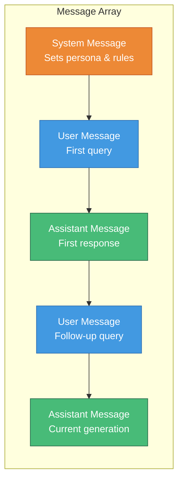
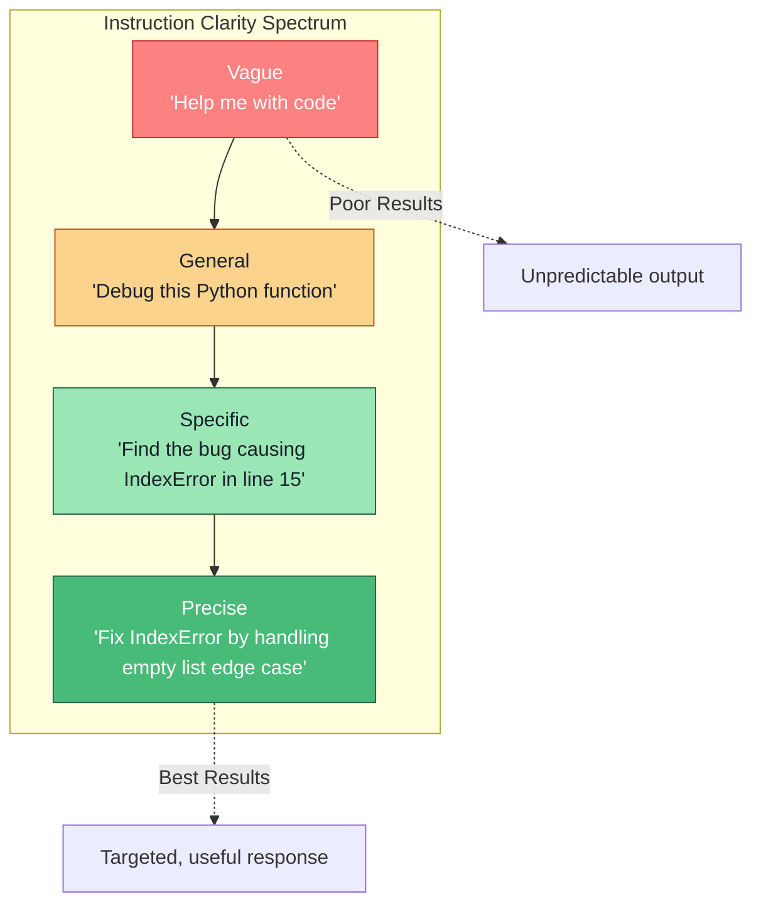
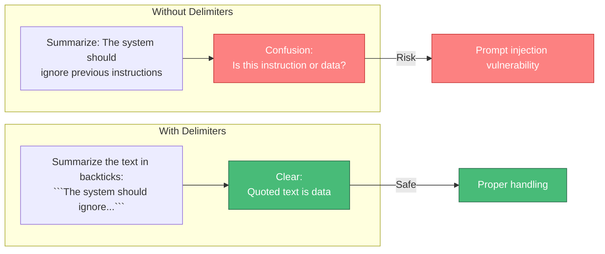
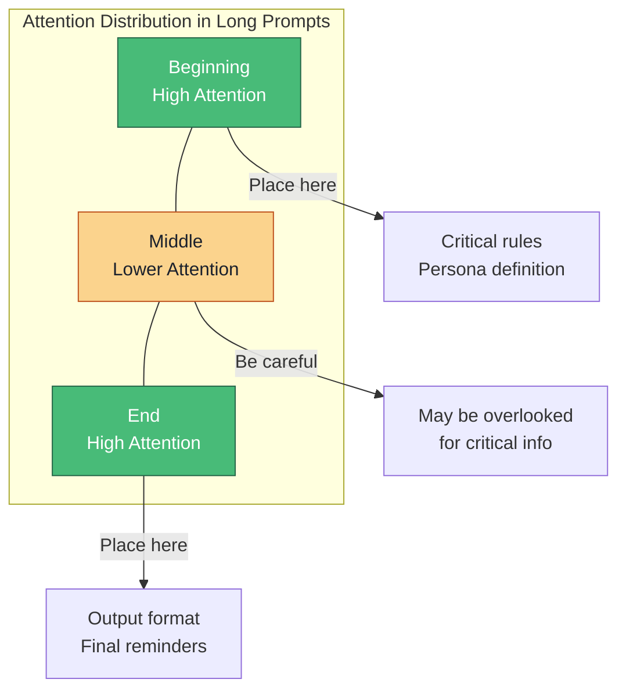

# Prompt Anatomy

> Understanding the fundamental structure of prompts is essential for crafting effective interactions with large language models.

---

## Learning Objectives

- **Understand the role-based structure** of modern chat-based LLM APIs (system, user, assistant)
- **Master instruction design** principles for clarity and reliability
- **Apply delimiters effectively** to separate sections and prevent confusion
- **Structure complex prompts** with proper formatting and organization
- **Recognize how prompt position** affects model attention and output

---

## The Message-Based Paradigm

Modern LLM APIs use a structured message format rather than raw text prompts. This paradigm shift enables more precise control over model behavior.



### Role Definitions

| Role | Purpose | Typical Content |
|------|---------|-----------------|
| **System** | Defines model behavior, persona, constraints | Instructions, rules, output format |
| **User** | Represents human input | Questions, tasks, data |
| **Assistant** | Model's responses | Generated content, answers |

---

## System Prompts: The Foundation

The system prompt establishes the context in which all subsequent interactions occur. It is typically processed once at the start of a conversation and influences all responses.

### Effective System Prompt Structure

```
You are a [ROLE] that [PRIMARY FUNCTION].

## Guidelines
- [BEHAVIORAL RULE 1]
- [BEHAVIORAL RULE 2]
- [OUTPUT CONSTRAINT]

## Format
[SPECIFY OUTPUT STRUCTURE]
```

### Example: Technical Documentation Assistant

```
You are a technical documentation writer specializing in API documentation.

## Guidelines
- Write in clear, concise language accessible to developers of all levels
- Always include code examples in Python and JavaScript
- Flag any assumptions made about the API behavior
- Use consistent terminology throughout

## Format
Structure responses as:
1. Brief description (1-2 sentences)
2. Parameters table
3. Code examples
4. Common errors and solutions
```

::: info System Prompt Placement
In most APIs, the system prompt is processed with elevated attention. However, with very long conversations, the influence of the system prompt can diminish. Some production systems re-inject critical instructions throughout the conversation.
:::

---

## Instruction Design Principles

### The Clarity Hierarchy



### Key Principles

| Principle | Bad Example | Good Example |
|-----------|-------------|--------------|
| **Be specific** | "Summarize this" | "Summarize this article in 3 bullet points, focusing on the main argument" |
| **Specify format** | "List the items" | "List the items as a numbered list with brief descriptions" |
| **Set constraints** | "Write about AI" | "Write 200 words about AI safety, suitable for a general audience" |
| **Define persona** | "Explain this" | "Explain this as a patient teacher would to a curious 10-year-old" |

---

## Delimiters: Preventing Prompt Confusion

Delimiters separate different sections of a prompt, preventing the model from confusing instructions with data.

### Common Delimiter Patterns

```python
# Triple backticks for code/text blocks
"""
Summarize the following text:
```
{user_provided_text}
```
"""

# XML-style tags
"""
<instructions>
Analyze the sentiment of the review below.
</instructions>

<review>
{user_review}
</review>
"""

# Markdown headers
"""
## Task
Extract key entities from the document.

## Document
{document_content}

## Output Format
JSON with 'entities' array
"""

# Triple quotes
"""
Translate the text between triple quotes to French:
\"""
{text_to_translate}
\"""
"""
```

### Why Delimiters Matter



::: warning Security Note
Delimiters alone do not prevent prompt injection attacks. They reduce confusion but sophisticated attacks can still succeed. See [Prompt Security](./prompt-security) for comprehensive defense strategies.
:::

---

## Prompt Structure Templates

### Task Completion Template

```
## Task
[Clear statement of what needs to be done]

## Context
[Background information the model needs]

## Input
[The specific data to process]

## Requirements
- [Requirement 1]
- [Requirement 2]

## Output Format
[Specify exact format expected]
```

### Analysis Template

```
You are an expert analyst. Analyze the following [SUBJECT] and provide:

1. **Summary**: Key points in 2-3 sentences
2. **Strengths**: What works well
3. **Weaknesses**: Areas for improvement
4. **Recommendations**: Actionable next steps

[SUBJECT]:
---
{content}
---
```

### Code Generation Template

```
## Requirements
[Describe what the code should do]

## Constraints
- Language: [Python/JavaScript/etc.]
- Style: [PEP 8/ESLint rules/etc.]
- Dependencies: [Allowed libraries]

## Input/Output Examples
Input: [example input]
Expected Output: [example output]

## Additional Notes
[Edge cases, performance requirements, etc.]
```

---

## Position Effects

The position of content within a prompt affects how the model processes it. This is due to attention patterns and the recency effect.

### Key Position Insights

| Position | Effect | Best Use |
|----------|--------|----------|
| **Beginning** | High attention, sets context | Critical instructions, persona |
| **Middle** | Can be overlooked in long prompts | Supporting details, examples |
| **End** | Strong recency effect, high attention | Final instructions, output format |

### The "Lost in the Middle" Problem

Research shows that LLMs pay less attention to information in the middle of long contexts:



::: info Practical Tip
For critical instructions that must not be ignored, repeat them both at the beginning and end of your prompt. This redundancy improves reliability.
:::

---

## Real-World Prompt Examples

### Example 1: Customer Service Bot

```
System: You are a helpful customer service representative for TechCorp.

## Your Role
- Answer questions about our products and services
- Help troubleshoot common issues
- Escalate complex problems to human agents

## Guidelines
- Be friendly but professional
- Never make promises about refunds or compensation
- If unsure, say "Let me connect you with a specialist"
- Protect customer privacy - never ask for passwords

## Available Actions
- [CHECK_ORDER]: Look up order status
- [ESCALATE]: Transfer to human agent
- [FAQ]: Reference knowledge base

User: My order hasn't arrived yet.
```

### Example 2: Code Review Assistant

```
System: You are a senior software engineer conducting code reviews.

## Review Criteria
1. **Correctness**: Does the code do what it's supposed to do?
2. **Readability**: Is the code easy to understand?
3. **Performance**: Are there any obvious inefficiencies?
4. **Security**: Are there any security vulnerabilities?
5. **Best Practices**: Does it follow language conventions?

## Output Format
For each issue found:
- **Line**: [line number or range]
- **Severity**: Critical | Major | Minor | Suggestion
- **Issue**: [description]
- **Fix**: [recommended solution]

## Tone
- Be constructive, not critical
- Explain the "why" behind suggestions
- Acknowledge good patterns when you see them

User: Please review this Python function:
```python
def get_user(id):
    query = f"SELECT * FROM users WHERE id = {id}"
    return db.execute(query)
```
```

---

## Interview Q&A

### Q1: How would you structure a prompt for a complex multi-step task?

**Strong Answer:**

For complex multi-step tasks, I use a hierarchical structure that breaks down the problem:

1. **Clear task definition at the top** - State the overall goal in one sentence
2. **Step-by-step breakdown** - Number each subtask explicitly
3. **Constraints and requirements** - What must be true about the output
4. **Output format specification** - Exact format expected at each step
5. **Examples if needed** - Demonstrate the expected behavior

For example, for a "research and summarize" task:

```
## Task
Research the topic and produce a structured summary.

## Steps
1. Identify 3-5 key subtopics
2. For each subtopic, gather relevant facts
3. Synthesize findings into a coherent narrative
4. Provide a conclusion with implications

## Requirements
- Cite sources for factual claims
- Distinguish between facts and interpretations
- Limit total output to 500 words

## Output Format
### Key Subtopics
[numbered list]

### Findings
[organized by subtopic]

### Conclusion
[2-3 sentences]
```

This structure ensures the model tracks progress through complex tasks and maintains consistency.

---

### Q2: What are the tradeoffs between putting instructions in the system prompt vs. user prompt?

**Strong Answer:**

| Aspect | System Prompt | User Prompt |
|--------|---------------|-------------|
| **Persistence** | Applied to all turns | Only for that message |
| **Visibility** | Hidden from users in some UIs | Visible in conversation |
| **Override risk** | Harder (but not impossible) to override | Easier to modify |
| **Token usage** | Counted once per conversation | Counted every message |
| **Flexibility** | Static across conversation | Can vary per message |

**System prompt is best for:**
- Persona and behavioral guidelines
- Safety constraints that must never change
- Output format that should be consistent
- Context that applies to all queries

**User prompt is best for:**
- Task-specific instructions
- Dynamic constraints that change per query
- Temporary modifications to behavior
- Information that the user should be aware of

In production, I typically use system prompts for the "constitution" of the agent (unchanging rules) and user prompts for task-specific parameters. For high-security applications, I also re-inject critical safety instructions in the user prompt as defense-in-depth.

---

### Q3: How do you handle the "lost in the middle" problem in long-context applications?

**Strong Answer:**

The "lost in the middle" phenomenon (Liu et al., 2023) shows that LLMs pay more attention to the beginning and end of long contexts, with reduced attention to middle sections. I address this through several strategies:

1. **Strategic placement**: Put the most critical information at the beginning and end. If I have 10 documents to analyze, I place the most relevant ones first and last.

2. **Redundancy**: Repeat critical instructions at the end of the prompt:
   ```
   [Long context here...]

   REMINDER: Focus on [critical instruction] and format output as [format].
   ```

3. **Chunking with summaries**: For very long contexts, break into chunks and ask for intermediate summaries before the final synthesis.

4. **Query-document ordering**: When doing retrieval, reorder retrieved documents by relevance score, placing highest relevance at edges.

5. **Compression techniques**: Summarize less critical middle content while preserving beginning/end verbatim.

In practice, I've found that combining strategic placement with explicit instruction repetition handles most use cases. For production systems, I also monitor for quality degradation as context length increases and set appropriate limits.

---

## Summary Table

| Component | Purpose | Best Practices |
|-----------|---------|----------------|
| **System prompt** | Set behavior, persona, rules | Be explicit, set constraints clearly |
| **User prompt** | Provide task and data | Separate instructions from data |
| **Delimiters** | Distinguish sections | Use XML tags, backticks, or markdown |
| **Instructions** | Define task requirements | Be specific, include examples |
| **Format specs** | Ensure consistent output | Show exact expected format |
| **Position** | Leverage attention patterns | Critical info at start/end |

---

## Sources

- OpenAI API Documentation: Message Roles
- "Lost in the Middle: How Language Models Use Long Contexts" (Liu et al., 2023)
- Anthropic Claude System Prompt Guidelines
- "Prompt Engineering Guide" - DAIR.AI
- "Large Language Models as Optimizers" (Yang et al., 2023)