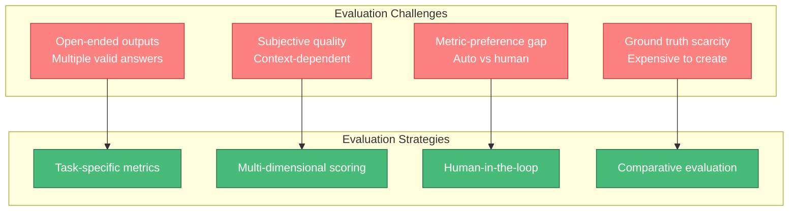
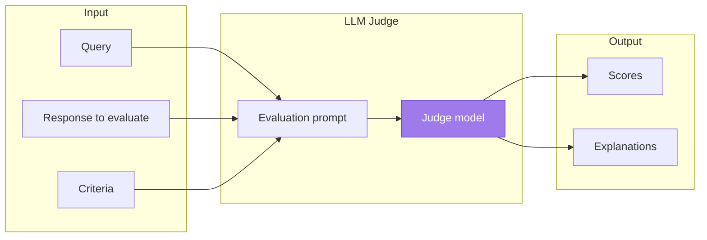
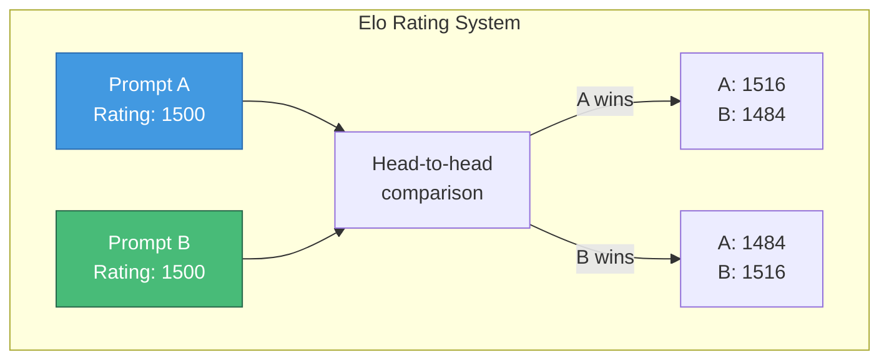
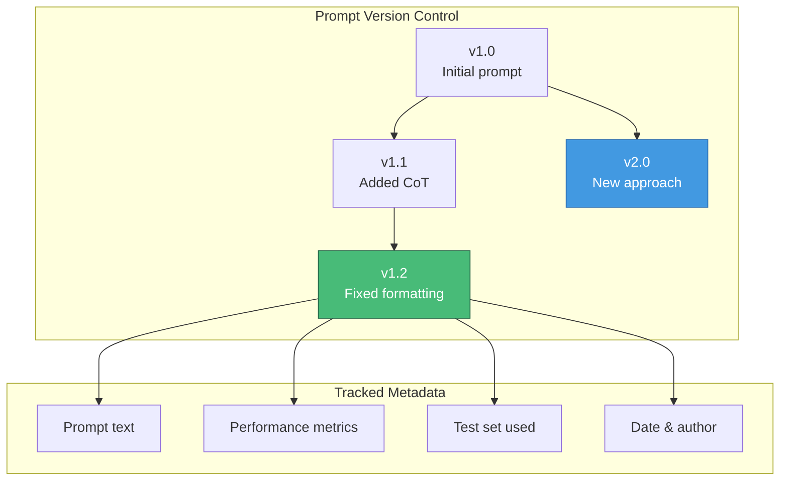
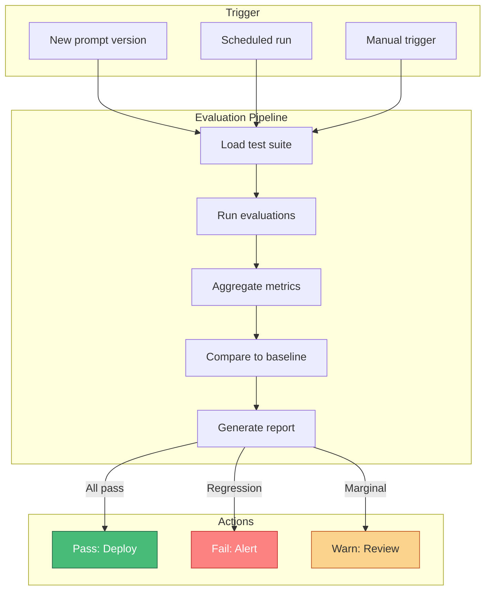

# Prompt Evaluation

> Systematic evaluation of prompt performance is essential for iterative improvement and production deployment of LLM applications.

---

## Learning Objectives

- **Design task-specific metrics** for different LLM applications
- **Implement comparison frameworks** for prompt variants
- **Establish prompt versioning** and regression testing
- **Combine automated and human evaluation** effectively
- **Build evaluation pipelines** for continuous improvement

---

## The Evaluation Challenge

Evaluating LLM outputs is fundamentally difficult because:
- Outputs are often open-ended with multiple valid responses
- Quality is subjective and context-dependent
- Automated metrics may not correlate with human preferences
- Ground truth is expensive or impossible to obtain



---

## Task-Specific Metrics

Different tasks require different evaluation approaches:

### Classification Tasks

| Metric | Formula | Use Case |
|--------|---------|----------|
| **Accuracy** | Correct / Total | Balanced classes |
| **Precision** | TP / (TP + FP) | Cost of false positives high |
| **Recall** | TP / (TP + FN) | Cost of false negatives high |
| **F1 Score** | 2 * (P * R) / (P + R) | Balance precision/recall |
| **Cohen's Kappa** | Agreement vs chance | Multi-rater consistency |

```python
from sklearn.metrics import classification_report, confusion_matrix

def evaluate_classification(predictions, ground_truth, labels):
    """Comprehensive classification evaluation."""
    report = classification_report(ground_truth, predictions,
                                   target_names=labels, output_dict=True)

    cm = confusion_matrix(ground_truth, predictions)

    return {
        "accuracy": report["accuracy"],
        "per_class": {label: report[label] for label in labels},
        "confusion_matrix": cm.tolist(),
        "macro_f1": report["macro avg"]["f1-score"],
    }
```

### Generation Tasks

| Metric | Measures | Limitations |
|--------|----------|-------------|
| **BLEU** | N-gram overlap | Ignores semantics |
| **ROUGE** | Recall of reference n-grams | Same as BLEU |
| **BERTScore** | Semantic similarity | Requires embeddings |
| **METEOR** | Stem matching + synonyms | Still surface-level |
| **Perplexity** | Model confidence | Doesn't measure quality |

```python
from evaluate import load

def evaluate_generation(predictions, references):
    """Multi-metric generation evaluation."""
    bleu = load("bleu")
    rouge = load("rouge")
    bertscore = load("bertscore")

    results = {
        "bleu": bleu.compute(predictions=predictions,
                            references=[[r] for r in references]),
        "rouge": rouge.compute(predictions=predictions,
                              references=references),
        "bertscore": bertscore.compute(predictions=predictions,
                                       references=references,
                                       lang="en"),
    }

    return results
```

### Reasoning Tasks

| Metric | Description |
|--------|-------------|
| **Exact match** | Output equals expected |
| **Contains answer** | Expected appears in output |
| **Chain validity** | Reasoning steps are logical |
| **Final answer accuracy** | Correct answer regardless of path |

```python
def evaluate_reasoning(prediction, expected, check_chain=True):
    """Evaluate reasoning tasks with optional chain validation."""
    # Extract final answer
    pred_answer = extract_final_answer(prediction)
    expected_answer = extract_final_answer(expected)

    result = {
        "exact_match": prediction.strip() == expected.strip(),
        "answer_match": pred_answer == expected_answer,
    }

    if check_chain:
        # Use LLM to validate reasoning chain
        chain_prompt = f"""
        Evaluate if this reasoning chain is logically valid:

        {prediction}

        Answer only: VALID or INVALID
        """
        chain_valid = llm.generate(chain_prompt).strip() == "VALID"
        result["chain_valid"] = chain_valid

    return result
```

---

## LLM-as-Judge Evaluation

Using LLMs to evaluate LLM outputs is increasingly common and effective.



### LLM-as-Judge Prompt Template

```python
JUDGE_PROMPT = """
You are an expert evaluator. Rate the following response on a scale of 1-5
for each criterion.

## Query
{query}

## Response to Evaluate
{response}

## Criteria
1. **Accuracy**: Is the information correct and factual?
2. **Relevance**: Does it address the query directly?
3. **Completeness**: Does it cover all aspects of the query?
4. **Clarity**: Is it well-written and easy to understand?
5. **Helpfulness**: Would this be useful to the user?

## Output Format
Provide scores and brief justification for each:
- Accuracy: [1-5] - [reason]
- Relevance: [1-5] - [reason]
- Completeness: [1-5] - [reason]
- Clarity: [1-5] - [reason]
- Helpfulness: [1-5] - [reason]
- Overall: [1-5]
"""

def llm_judge(query: str, response: str, judge_model) -> dict:
    """Use LLM as judge for evaluation."""
    prompt = JUDGE_PROMPT.format(query=query, response=response)
    evaluation = judge_model.generate(prompt)
    return parse_judge_scores(evaluation)
```

### Pairwise Comparison

When absolute scores are unreliable, compare responses head-to-head:

```python
COMPARISON_PROMPT = """
Compare these two responses to the same query. Which is better?

## Query
{query}

## Response A
{response_a}

## Response B
{response_b}

## Instructions
1. Analyze both responses for accuracy, relevance, and helpfulness
2. Identify specific strengths and weaknesses of each
3. Declare a winner or tie

## Output Format
Analysis A: [strengths and weaknesses]
Analysis B: [strengths and weaknesses]
Winner: [A, B, or TIE]
Confidence: [HIGH, MEDIUM, LOW]
Reason: [brief explanation]
"""

def pairwise_compare(query: str, response_a: str, response_b: str,
                     judge_model, n_comparisons: int = 3) -> dict:
    """Compare two responses with multiple judgments."""
    results = []

    for i in range(n_comparisons):
        # Randomize order to reduce position bias
        if i % 2 == 0:
            prompt = COMPARISON_PROMPT.format(
                query=query, response_a=response_a, response_b=response_b
            )
            result = judge_model.generate(prompt)
            winner = parse_winner(result)
        else:
            prompt = COMPARISON_PROMPT.format(
                query=query, response_a=response_b, response_b=response_a
            )
            result = judge_model.generate(prompt)
            winner = flip_winner(parse_winner(result))

        results.append(winner)

    # Majority vote
    return {
        "winner": Counter(results).most_common(1)[0][0],
        "agreement": max(Counter(results).values()) / len(results),
        "votes": dict(Counter(results)),
    }
```

::: info Reducing Judge Bias
LLM judges have biases: position bias (favoring first/last), verbosity bias (favoring longer), and self-preference bias (favoring same model). Mitigate with:
- Randomizing response order
- Multiple judge models
- Calibration on known comparisons
:::

---

## Comparison Frameworks

### Elo Rating System

Track prompt performance over many comparisons using Elo ratings:



```python
class EloRating:
    def __init__(self, k_factor=32):
        self.ratings = {}
        self.k = k_factor

    def expected_score(self, rating_a: float, rating_b: float) -> float:
        """Calculate expected score for player A."""
        return 1 / (1 + 10 ** ((rating_b - rating_a) / 400))

    def update_ratings(self, prompt_a: str, prompt_b: str,
                       winner: str) -> tuple[float, float]:
        """Update ratings after a match."""
        # Initialize if needed
        if prompt_a not in self.ratings:
            self.ratings[prompt_a] = 1500
        if prompt_b not in self.ratings:
            self.ratings[prompt_b] = 1500

        rating_a = self.ratings[prompt_a]
        rating_b = self.ratings[prompt_b]

        # Calculate expected scores
        expected_a = self.expected_score(rating_a, rating_b)
        expected_b = 1 - expected_a

        # Actual scores
        if winner == "A":
            actual_a, actual_b = 1, 0
        elif winner == "B":
            actual_a, actual_b = 0, 1
        else:  # Tie
            actual_a, actual_b = 0.5, 0.5

        # Update ratings
        self.ratings[prompt_a] = rating_a + self.k * (actual_a - expected_a)
        self.ratings[prompt_b] = rating_b + self.k * (actual_b - expected_b)

        return self.ratings[prompt_a], self.ratings[prompt_b]

    def get_rankings(self) -> list[tuple[str, float]]:
        """Return prompts ranked by rating."""
        return sorted(self.ratings.items(), key=lambda x: x[1], reverse=True)
```

### Multi-Dimensional Evaluation Matrix

```python
@dataclass
class EvaluationResult:
    prompt_version: str
    test_set: str
    metrics: dict
    timestamp: datetime

class EvaluationMatrix:
    def __init__(self):
        self.results = []
        self.dimensions = ["accuracy", "latency", "cost", "safety", "user_satisfaction"]

    def add_result(self, prompt_version: str, test_set: str, metrics: dict):
        """Record evaluation result."""
        result = EvaluationResult(
            prompt_version=prompt_version,
            test_set=test_set,
            metrics=metrics,
            timestamp=datetime.now()
        )
        self.results.append(result)

    def compare_versions(self, version_a: str, version_b: str) -> dict:
        """Compare two prompt versions across all dimensions."""
        results_a = [r for r in self.results if r.prompt_version == version_a]
        results_b = [r for r in self.results if r.prompt_version == version_b]

        comparison = {}
        for dim in self.dimensions:
            avg_a = np.mean([r.metrics.get(dim, 0) for r in results_a])
            avg_b = np.mean([r.metrics.get(dim, 0) for r in results_b])
            comparison[dim] = {
                "version_a": avg_a,
                "version_b": avg_b,
                "delta": avg_b - avg_a,
                "winner": "A" if avg_a > avg_b else "B" if avg_b > avg_a else "tie"
            }

        return comparison

    def generate_report(self, prompt_version: str) -> str:
        """Generate evaluation report for a prompt version."""
        results = [r for r in self.results if r.prompt_version == prompt_version]

        report = f"# Evaluation Report: {prompt_version}\n\n"
        report += f"Test runs: {len(results)}\n\n"

        for dim in self.dimensions:
            values = [r.metrics.get(dim, 0) for r in results]
            report += f"## {dim.title()}\n"
            report += f"- Mean: {np.mean(values):.3f}\n"
            report += f"- Std: {np.std(values):.3f}\n"
            report += f"- Min: {np.min(values):.3f}\n"
            report += f"- Max: {np.max(values):.3f}\n\n"

        return report
```

---

## Prompt Versioning

### Version Control for Prompts



### Prompt Registry

```python
import hashlib
import json
from datetime import datetime

class PromptRegistry:
    def __init__(self, storage_path: str):
        self.storage_path = storage_path
        self.prompts = self.load_prompts()

    def register(self, name: str, prompt_text: str, metadata: dict = None) -> str:
        """Register a new prompt version."""
        # Generate version hash
        version_hash = hashlib.sha256(prompt_text.encode()).hexdigest()[:8]

        # Create entry
        entry = {
            "name": name,
            "text": prompt_text,
            "hash": version_hash,
            "created_at": datetime.now().isoformat(),
            "metadata": metadata or {},
            "metrics": {},
        }

        # Store
        version_key = f"{name}_{version_hash}"
        self.prompts[version_key] = entry
        self.save_prompts()

        return version_key

    def get_prompt(self, version_key: str) -> dict:
        """Retrieve a prompt by version key."""
        return self.prompts.get(version_key)

    def record_metrics(self, version_key: str, metrics: dict):
        """Record evaluation metrics for a prompt version."""
        if version_key in self.prompts:
            timestamp = datetime.now().isoformat()
            self.prompts[version_key]["metrics"][timestamp] = metrics
            self.save_prompts()

    def get_best_version(self, name: str, metric: str = "accuracy") -> str:
        """Get the best performing version for a prompt name."""
        candidates = [
            (k, v) for k, v in self.prompts.items()
            if v["name"] == name and v["metrics"]
        ]

        if not candidates:
            return None

        def avg_metric(entry):
            values = [m.get(metric, 0) for m in entry["metrics"].values()]
            return np.mean(values) if values else 0

        best = max(candidates, key=lambda x: avg_metric(x[1]))
        return best[0]

    def list_versions(self, name: str) -> list[dict]:
        """List all versions of a prompt."""
        return [
            {"key": k, "created": v["created_at"], "metrics": v["metrics"]}
            for k, v in self.prompts.items()
            if v["name"] == name
        ]
```

### Regression Testing

```python
class PromptRegressionTest:
    def __init__(self, registry: PromptRegistry, test_suite: list[dict]):
        self.registry = registry
        self.test_suite = test_suite  # [{input, expected, ...}]

    def run_regression(self, prompt_name: str, new_version: str) -> dict:
        """Run regression tests comparing new version to best known."""
        best_version = self.registry.get_best_version(prompt_name)

        if not best_version:
            return {"status": "no_baseline", "message": "No baseline to compare"}

        # Run both versions on test suite
        results_best = self.evaluate_version(best_version)
        results_new = self.evaluate_version(new_version)

        # Compare
        regression_detected = False
        regressions = []

        for metric in results_best.keys():
            if results_new[metric] < results_best[metric] * 0.95:  # 5% tolerance
                regression_detected = True
                regressions.append({
                    "metric": metric,
                    "baseline": results_best[metric],
                    "new": results_new[metric],
                    "delta": results_new[metric] - results_best[metric]
                })

        return {
            "status": "regression" if regression_detected else "pass",
            "baseline_version": best_version,
            "baseline_metrics": results_best,
            "new_metrics": results_new,
            "regressions": regressions,
        }

    def evaluate_version(self, version_key: str) -> dict:
        """Evaluate a prompt version on the test suite."""
        prompt = self.registry.get_prompt(version_key)["text"]

        correct = 0
        latencies = []

        for test_case in self.test_suite:
            start = time.time()
            output = llm.generate(f"{prompt}\n\n{test_case['input']}")
            latency = time.time() - start

            latencies.append(latency)
            if matches_expected(output, test_case["expected"]):
                correct += 1

        return {
            "accuracy": correct / len(self.test_suite),
            "avg_latency": np.mean(latencies),
            "p95_latency": np.percentile(latencies, 95),
        }
```

---

## Building Evaluation Pipelines

### Continuous Evaluation Architecture



### Pipeline Implementation

```python
class EvaluationPipeline:
    def __init__(self, config: dict):
        self.test_suites = config["test_suites"]
        self.metrics = config["metrics"]
        self.thresholds = config["thresholds"]
        self.registry = PromptRegistry(config["registry_path"])

    def run(self, prompt_version: str) -> dict:
        """Execute full evaluation pipeline."""
        results = {
            "version": prompt_version,
            "timestamp": datetime.now().isoformat(),
            "test_results": {},
            "overall_status": "pass",
        }

        for suite_name, test_suite in self.test_suites.items():
            suite_results = self.evaluate_suite(prompt_version, test_suite)
            results["test_results"][suite_name] = suite_results

            # Check thresholds
            for metric, value in suite_results.items():
                threshold = self.thresholds.get(metric, {})
                if value < threshold.get("min", 0):
                    results["overall_status"] = "fail"
                elif value < threshold.get("warn", 0):
                    if results["overall_status"] == "pass":
                        results["overall_status"] = "warn"

        # Record results
        self.registry.record_metrics(prompt_version, results["test_results"])

        # Generate report
        results["report"] = self.generate_report(results)

        return results

    def evaluate_suite(self, version: str, test_suite: list) -> dict:
        """Evaluate on a single test suite."""
        prompt = self.registry.get_prompt(version)["text"]
        evaluator = self.create_evaluator(self.metrics)

        all_outputs = []
        all_expected = []
        all_latencies = []

        for case in test_suite:
            start = time.time()
            output = llm.generate(f"{prompt}\n\n{case['input']}")
            latency = time.time() - start

            all_outputs.append(output)
            all_expected.append(case["expected"])
            all_latencies.append(latency)

        return {
            **evaluator.compute(all_outputs, all_expected),
            "avg_latency": np.mean(all_latencies),
            "p95_latency": np.percentile(all_latencies, 95),
        }

    def generate_report(self, results: dict) -> str:
        """Generate human-readable report."""
        status_emoji = {"pass": "PASS", "warn": "WARN", "fail": "FAIL"}

        report = f"""
# Evaluation Report

**Version**: {results['version']}
**Status**: {status_emoji[results['overall_status']]}
**Timestamp**: {results['timestamp']}

## Test Results

"""
        for suite, metrics in results["test_results"].items():
            report += f"### {suite}\n"
            for metric, value in metrics.items():
                report += f"- {metric}: {value:.4f}\n"
            report += "\n"

        return report
```

---

## Interview Q&A

### Q1: How do you evaluate LLM outputs when there's no single correct answer?

**Strong Answer:**

When outputs are open-ended, I use multiple evaluation strategies:

**1. Multi-dimensional scoring:**
Instead of single "correctness," evaluate across dimensions:
- Relevance: Does it address the query?
- Accuracy: Are facts correct?
- Helpfulness: Would users find it useful?
- Coherence: Is it well-structured?
- Safety: Is it appropriate?

**2. LLM-as-judge:**
Use a (typically stronger) LLM to evaluate outputs:
```python
judge_prompt = """
Rate this response 1-5 on relevance, accuracy, helpfulness.
Query: {query}
Response: {response}
"""
```
This scales better than human evaluation while correlating reasonably with human preferences.

**3. Pairwise comparison:**
When absolute scores are noisy, compare responses head-to-head:
- "Which response is better for this query?"
- Aggregate comparisons into rankings (Elo system)
- More reliable than absolute scoring

**4. Human evaluation sample:**
For critical applications, sample a subset for human review:
- Create rubric with clear criteria
- Use multiple annotators
- Measure inter-annotator agreement (Cohen's Kappa)

**5. Proxy metrics:**
When direct evaluation is impossible, use proxies:
- User engagement (clicks, time on page)
- Task completion rate
- Follow-up questions (fewer = better)

The key is combining multiple approaches. I typically use automated metrics for development iteration, LLM-as-judge for larger scale testing, and human evaluation for final validation.

---

### Q2: Design an evaluation framework for a customer service chatbot.

**Strong Answer:**

For a customer service chatbot, I'd design a multi-layered evaluation framework:

**Layer 1: Automated Metrics**

| Metric | Measurement | Target |
|--------|-------------|--------|
| Intent accuracy | Correct classification | >95% |
| Response relevance | BERTScore vs gold | >0.85 |
| Factual accuracy | Entity/fact extraction check | >98% |
| Response time | Latency p95 | <2s |
| Escalation rate | % routed to human | <20% |

**Layer 2: Safety & Compliance**

```python
safety_checks = {
    "pii_leakage": check_no_pii_in_response,
    "hallucination": verify_facts_against_kb,
    "tone": sentiment_analysis_check,
    "policy_compliance": check_against_rules,
}
```

**Layer 3: LLM-as-Judge**

```python
judge_prompt = """
Evaluate this customer service interaction:

Customer: {query}
Agent: {response}

Rate 1-5 on:
1. Helpfulness: Did it solve/address the issue?
2. Accuracy: Is the information correct?
3. Tone: Is it professional and empathetic?
4. Completeness: Were all aspects addressed?
"""
```

**Layer 4: Business Metrics**

- Resolution rate: % issues resolved in conversation
- CSAT scores: Post-conversation surveys
- Repeat contact rate: Customers returning with same issue
- Handle time: Average conversation length

**Layer 5: Regression Testing**

- Golden test set: 200 critical scenarios that must pass
- Edge cases: Angry customers, complex issues
- Run on every prompt change

**Pipeline flow:**
1. All changes go through automated tests
2. Pass → LLM-as-judge evaluation
3. Pass → A/B test with 5% traffic
4. Significant improvement → Full rollout

This framework catches issues at multiple levels while being practical to implement and maintain.

---

### Q3: How would you detect and prevent prompt regression in production?

**Strong Answer:**

Prompt regression detection requires both proactive testing and reactive monitoring:

**Proactive: Pre-deployment testing**

```python
class RegressionGate:
    def __init__(self, golden_set, baseline_metrics, tolerance=0.05):
        self.golden_set = golden_set  # Critical test cases
        self.baseline = baseline_metrics
        self.tolerance = tolerance

    def check(self, new_prompt) -> bool:
        new_metrics = self.evaluate(new_prompt)

        for metric, baseline_value in self.baseline.items():
            new_value = new_metrics[metric]
            if new_value < baseline_value * (1 - self.tolerance):
                return False, f"Regression on {metric}: {baseline_value} -> {new_value}"

        return True, "All checks passed"
```

**Golden set composition:**
- Representative samples from each use case
- Known failure cases that were fixed
- Edge cases and adversarial inputs
- High-value customer scenarios

**Reactive: Production monitoring**

```python
class ProductionMonitor:
    def __init__(self, alert_threshold=0.1):
        self.metrics_window = []
        self.threshold = alert_threshold

    def record(self, metric_name, value):
        self.metrics_window.append({
            "metric": metric_name,
            "value": value,
            "timestamp": time.time()
        })

        # Check for regression
        recent = self.get_recent_values(metric_name, window="1h")
        historical = self.get_historical_average(metric_name)

        if np.mean(recent) < historical * (1 - self.threshold):
            self.trigger_alert(metric_name, recent, historical)

    def trigger_alert(self, metric, recent, historical):
        alert = {
            "type": "regression",
            "metric": metric,
            "recent_avg": np.mean(recent),
            "historical_avg": historical,
            "drop_pct": (historical - np.mean(recent)) / historical,
        }
        send_alert(alert)
```

**Monitoring signals:**
- Direct metrics: accuracy on labeled samples
- Proxy metrics: user thumbs up/down, escalation rate
- Implicit feedback: session length, repeat queries

**Rollback capability:**
```python
class PromptDeployment:
    def __init__(self):
        self.current_version = None
        self.previous_version = None

    def deploy(self, new_version):
        self.previous_version = self.current_version
        self.current_version = new_version

    def rollback(self):
        if self.previous_version:
            self.current_version = self.previous_version
            notify("Rolled back to previous prompt version")
```

The key is having fast detection (minutes, not days) and automatic rollback capability for critical regressions.

---

## Summary Table

| Aspect | Approach | Tools/Methods |
|--------|----------|---------------|
| **Classification** | Standard ML metrics | Accuracy, F1, Confusion matrix |
| **Generation** | Text similarity | BLEU, ROUGE, BERTScore |
| **Reasoning** | Answer extraction | Exact match, chain validation |
| **Open-ended** | LLM-as-judge | Pairwise comparison, multi-dim scoring |
| **Comparison** | Rating systems | Elo, Bradley-Terry |
| **Versioning** | Registry | Hash-based versions, metadata |
| **Regression** | Gate + monitoring | Golden sets, production alerts |

---

## Sources

- "Judging LLM-as-a-Judge with MT-Bench and Chatbot Arena" (Zheng et al., 2023)
- "G-Eval: NLG Evaluation using GPT-4 with Better Human Alignment" (Liu et al., 2023)
- "HELM: Holistic Evaluation of Language Models" (Liang et al., 2022)
- "BERTScore: Evaluating Text Generation with BERT" (Zhang et al., 2020)
- "Chatbot Arena: An Open Platform for Evaluating LLMs" (Chiang et al., 2024)
